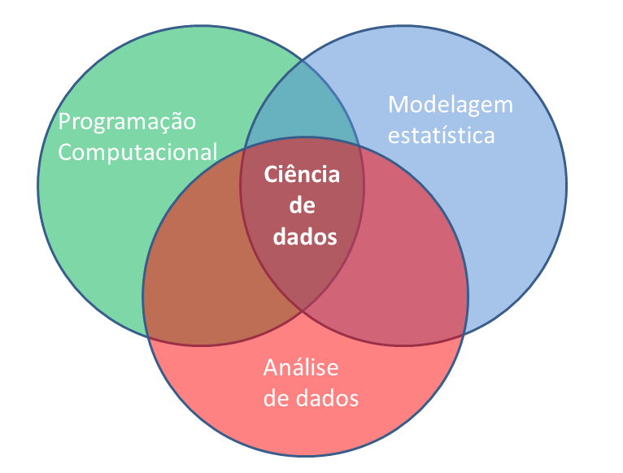

# (PART) Introdução {-}

# Motivação {#intro}

<!-- #dados meteorológicos 
#Importância e valor da informação meteorológica
 aquisição de dados
 preparação de dados
 controle de qualidade
 interpolação 
 visualização
-->


```{r setup, echo = FALSE, message=FALSE}
options(stringsAsFactors = TRUE)
library(dplyr)
rblue <- ''
```


## Análise de dados meteorológicos

> Processo pelo qual adquire-se conhecimento, compreensão e percepção dos fenômenos meteorológicos a partir de observações (dados) qualitativas e quantitativas.

</style>
<div class="midcenter" style="margin-left:50px; margin-top:50px;">

</div>


## Ciência de dados


</style>
<div class="midcenter" style="margin-left:50px; margin-top:50px;">

</div>


## Etapas para abordagem de um problema 


 1. **Questão científica/problema**
<br/>
 2. **Obtenção de dados:** coleta/medida do(as) estado/condições da atmosfera
    - Instrumentos e sensores
<br/>
 3. **Processamento de dados:**
    *download* ---> limpeza ---> formatação ---> <br/>
     transformação ---> controle de qualidade
       - ferramenta/software
         - <span style="color: red">conhecimento em programação</span>
 4. **Análise de dados**
    - ferramenta/software
      - <span style="color: red">conhecimento em programação</span>
 5. **Solução para o problema** 
    - Proposta de um modelo 
      - estatístico, empírico, ou fisicamente baseado
    - <span style="color: red">conhecimento em programação</span>
<br/> 
 6. **Apresentação/divulgação/publicação**


## Programação computacional


</style>
<div class="midcenter" style="margin-left:10px; margin-top:10px;">

</div>

</style>
<div class="midcenter" style="margin-left:10px; margin-top:0px;">

</div>

## `r rblue` 

<!-- 
https://datacarpentry.org/R-ecology-lesson/00-before-we-start.html 

-->

* [R](https://www.r-project.org/) é o termo usado para se referir a linguagem de programação e ao software que interpreta os scripts escritos usando esta linguagem.


* Comunidade fantástica

  - [Contribuidores](https://www.r-project.org/contributors.html) (@R-base)

  - milhares de pessoas usam o R diariamente e ajudam outras pessoas


* **Software Livre** (GPL), [Código aberto](https://github.com/wch/r-source) e multiplataforma
<br/> 
* Ambiente para Análise de dados interativa

## Por que o R?

<!-- 
http://www.sthda.com/english/wiki/what-is-r-and-why-learning-r-programming

https://datacarpentry.org/R-ecology-lesson/00-before-we-start.html
-->

* [R](https://www.r-project.org/) não é uma GUI (Interface gráfica do usuário) e isso é bom


    - há uma natural resistência e dificuldade ao uso de códigos e scripts
 

    - scripts favorecem a **automatização** e **reprodutibilidade**


    - força você a ter um conhecimneto mais aprofundado do que está fazendo


- [Reprodutibilidade](https://pt.wikipedia.org/wiki/Reprodutibilidade)

    - qualquer pessoa (inclusive você mesmo no futuro) pode obter os mesmos resultados do mesmo conjunto de dados

    - R é integrado com [outras ferramentas](https://cran.r-project.org/web/views/ReproducibleResearch.html) de que permitem atualizar seus resultados, figuras e análises automaticamente

   - [Relatório dinâmicos](https://rmarkdown.rstudio.com/articles_intro.html) e [interativos](http://shiny.rstudio.com/)

- Acesso ao estado da arte da ciência de dados (*Big Data*, *Data Mining*, *Machine Leraning*)

- é um software livre, de código fonte aberto e funciona em diversos sistemas operacionais (Linux, Windows e MacOS).

- Interface com Fortran, C, C++, Python

- [Visualização de dados](https://cran.r-project.org/web/views/Graphics.html)

   - R produz [gráficos de alta qualidade](https://timogrossenbacher.ch/2016/12/beautiful-thematic-maps-with-ggplot2-only/)


- R trabalha com dados de todas formas e tamanhos 


- Extensões para [Manipulação de dados](http://blog.rstudio.org/2014/07/22/introducing-tidyr/)
 


## Pacotes da comunidade do R

Evolução do nº de pacotes disponíveis no [CRAN](http://cran.r-project.org/mirrors.html)
</style>
<div class="midcenter" style="margin-left:10px; margin-top:10px;">

</div>


## Por que um meteorologista usaria o R?

A meteorologia é 4D: 

```r
meteorologia <- function(x, y, z, t){
  ...muita coisa para caber em um slide...
}
```

Logo, requer ferramentas específicas para:
 
* manipulação de dados espacias
 
* análise de séries temporais
 
* importação e ferramentas de [SIG](https://pt.wikipedia.org/wiki/Sistema_de_informa%C3%A7%C3%A3o_geogr%C3%A1fica)

* leitura de dados em formatos específicos ([netcdf](https://en.wikipedia.org/wiki/NetCDF), [binários](https://en.wikipedia.org/wiki/Binary_file), [grib2](https://en.wikipedia.org/wiki/GRIB), ...)


## R não é perfeito!

* Muitos códigos em R são escritos para resolver um problema;
    * foco nos resultados e não no processo
    * usuários não são programadores
    * códigos deselegantes, lentos e difíceis de entender
 
* Como o nosso idioma, há muitas exceções para serem lembradas
 
* R não é muito rápido e códigos mal escritos serão lentos
 
* São apenas ~20 anos de evolução
 
* Há muito o que melhorar


## Para saber mais sobre o R

[**Documentação oficial**](http://cran.r-project.org/manuals.html)
  - [Manuais do R traduzidos](https://cran.r-project.org/other-docs.html)


[**Lista de Livros relacionados ao R**](http://www.r-project.org/doc/bib/R-books.html)

- [Livros gratuitos](https://github.com/vhf/free-programming-books/blob/master/free-programming-books.md#r) (em inglês)


**Fóruns:** 

- lista Brasileira de discussão do programa R: [**R-br**](https://listas.inf.ufpr.br/cgi-bin/mailman/listinfo/r-br)

- [stackoverflow](http://stackoverflow.com/questions/tagged/r)
<br/>
