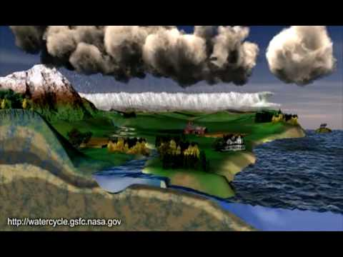

# Instalação do R e RStudio {#install}

```{r setupCH, echo = FALSE, message=FALSE}
options(stringsAsFactors = TRUE)
library(dplyr)
```


Objetivos de aprendizagem:

1. Descrever os principais reservatórios no ciclo hidrológico global e seus tamanhos relativos 

2. Descrever os principais fluxos conectando os reservatórios do ciclo hidrológico global

3. Descrever as propriedades da água relevantes para <span style="font-variant:small-caps;">hidrometeorologia</span>

4. Converter massa, volume e fluxos de energia

5. Aplicar a equação do balanço de massa para um volume de controle particular

6. Informar as taxas médias do ciclo hidrológico global e os tempos de residência da água nos diferentes reservatórios

7. Definir bacia hidrográfica e explicar sua relevância para <span style="font-variant:small-caps;">hidrometeorologia</span>

8. Construir uma bacia hidrográfica a partir de dados topográficos para uso em análises hidrológicas


## Sistema Hidroclimático Terrestre

O clima da Terra é entendido como um **sistema** composto de diversas esferas que interagem entre si através de trocas de energia, água e dos ciclos biogeoquímicos. As principais componentes do sistema climático são:

- Atmosfera (ar)

- Hidrosfera (água)

- Criosfera (porções congeladas da Terra)

- Biosfera (organismos vivos)

- Pedosfera (solo)

- Antroposfera (humanos)


A componente humana é um importante agente de mudança ambiental através das mudanças do uso e cobertura da superfície terrestre que afetam diretamente componentes do ciclo hidrológico e dos ciclos biogeoquímicos. Diversos processos físicos, biológicos e químicos dentro do sistema terrestre geram *feedbacks* no sistema climático que acentuam ou mitigam mudanças no clima. Muitos desses *feedbacks* estão associados aos ecossistemas terrestres e as atividades humanas. Um entendimento mais abrangente sobre o clima da Terra requer que todas componentes do sistema climático (físicas, químicas, biológicas e sócio-econômicas) sejam consideradas. 

```{block, note-text-climate-system, type='rmdnote'}
Como leitura complementar sobre as esferas do sistema climático recomenda-se a leitura do [Capítulo 1](http://ead06.proj.ufsm.br/moodle/mod/resource/view.php?id=316666) do Livro *Terrestrial Hydrometeorology* [@Shuttle2012].
```


A esfera de grande interesse é a Hidrosfera que descreve a água contida no planeta Terra armazenada em rios, lagos, oceanos, solo e ar. A Terra armazena cerca de 1377 milhões  de km^3^ de água. Esta quantidade espalhada sobre a área superficial da Terra (510 milhões de km^2^) seria equivalente a uma lâmina de água de profundidade média de 2700 m.

Os oceanos comportam 97% daquele volume de água (Tabela \@ref(tab:water-earth)). Isto equivale a uma lâmina d'água de profundidade média de 3700 m espalhada sobre a área superficial dos oceanos.  

Outros 1,9% estão congelados nas calotas polares, geleiras, solo permanentemente congelado ([permafrost](https://pt.wikipedia.org/wiki/Pergelissolo)). Apenas 1,1 % da água da Terra é líquida e encontrada na superfície continental. Rios, lagos e áreas alagáveis (pântanos, banhados, manguezais) contém 178000 km^3^ de água. 

Mais de 15 milhões de km^3^ de água estão abaixo da superfície. Aquíferos profundos que incluem a água subterrânea armazenam maior parte desse volume. O solo próximo a superfície (umidade do solo), armazena muito pouca água (122000 km^3^). A atmosfera tem a menor quantidade de água ~13000 km^3^ ou ~25 mm de água espalhados sobre a área superficial da Terra.

A pequena fração de água armazenada nos reservatórios de água doce (lagos, rios, umidade do solo), na atmosfera e a biosfera podem subestimar a importância deles uma vez que tendem a ser os mais dinâmicos do ciclo hidrológico, conforme descrito em mais detalhes a seguir.


```{r water-earth, echo = FALSE}
# DT com dados da tabela de Bonan 2015, 
water_earth <- data.frame(
  pool = c("Oceano", "Água doce", "Áreas congeladas", "Água subterrânea", "Lagos e Rios", "Água no solo", "Atmosfera"),
  vol = c(1335040000, 41984700, 26372000, 15300000, 178000, 122000, 12700)  
)
# total de água na hidrosfera
tot <- sum(water_earth$vol[1:2])
# água relativa
water_earth <- dplyr::mutate(water_earth, 
                             water_rel = round(vol/tot * 100, 3))
# arrendonda valores
water_earth$water_rel[1:2] <- round(water_earth$water_rel[1:2])
water_earth$water_rel[3:4] <- round(water_earth$water_rel[3:4], 1)
# total de água doce na hidrosfera
tot_freswater <- water_earth$vol[2]
water_earth$freshwater_rel <- NA
water_earth$freshwater_rel[-c(1, 2)] <- water_earth$vol[-c(1, 2)]/tot_freswater * 100
water_earth$freshwater_rel[3:4] <- round(water_earth$freshwater_rel[3:4], 1)
water_earth$freshwater_rel[5:7] <- round(water_earth$freshwater_rel[5:7], 2)
# water_earth <- transform(water_earth, 
#                          freshwater_rel = ifelse(is.na(freshwater_rel), "-", freshwater_rel))
# substituindo nomes
names(water_earth) <- c("Reservatório", 
                        "Volume (Km^3^)", 
                        "Total de água (%)",
                        "Total de água doce (%)")
# imprimindo tabela
knitr::kable(water_earth, 
             caption = "Água armazenada no planeta Terra. Adaptado de @Trenberth2007.",
             booktabs = TRUE,
             row.names = FALSE, 
             #align = "r",
             format.args = list(big.mark = ".", 
                                decimal.mark = ",",
                                na.encode = TRUE))
```

A água é uma parte importante do sistema climático. Os oceanos armazenam e transportam calor, redistribuindo o aquecimento geograficamente desigual da Terra pelo Sol. O armazenamento de carbono nos oceanos regula a concentração do CO~2~ atmosférico. O vapor d'água é o gás de efeito estufa mais importante em termos de concentração e [aquecimento radiativo](https://en.wikipedia.org/wiki/Radiative_forcing). O vapor d'água condensa para formar nuvens. As nuvens podem gerar precipitação e também afetar o balanço global de radiação refletindo radiação solar, absorvendo e emitindo radiação de onda longa. O calor latente liberado durante a condensação fornece considerável energia para abastecer as tempestades. O ciclo hidrológico entre a atmosfera, o oceano e a superfície terrestre continental regula a quantidade de vapor d'água no ar. As taxas de precipitação e evaporação dependem da temperatura do ar e de outros fatores climáticos de forma que quando o clima muda a quantidade de vapor d'água na atmosfera também muda.


## Ciclo Hidrológico

PAREI AQUI
A água se move entre os reservatórios via fluxos.  Some of the key hydrologic fluxes include: precipitation (either in liquid or solid form), evaporation and transpiration (together referred to as evapotranspiration), infiltration, recharge, and runoff. Precipitation and evapotranspiration are the key fluxes between the atmosphere and surface (land and oceans). Precipitation may accumulate when it falls as snow while rainfall is partitioned at the surface into infiltration and surface runoff. Percolation of water through the unsaturated soil zone recharges groundwater aquifers which ultimately 
25. feeds surface water bodies via lateral flow and runoff. The atmospheric water is replenished via evaporation from the soil and open water surfaces and transpiration from vegetation.    Fluxes and storage are directly linked via mass balance as described in more detail below.

A key aspect of the hydrologic cycle is the fact that it is driven by energy inputs (primarily from the sun; Figure 1.3). At the global scale, the system is essentially closed with respect to water; negligible water is entering or leaving the system. In other words, there is no external forcing in terms of a water flux. Systems with no external forcing will generally eventually come to an equilibrium state. So what makes the hydrologic cycle so dynamic? The solar radiative energy input, which is external to the system, drives the hydrologic cycle. Averaged over the globe, 342 W m-2 of solar radiative energy is being continuously input to the system at the top of the atmosphere. This energy input must be dissipated, and this is done, to a large extent, via the hydrologic cycle. Due to this fact, the study of hydrology is not isolated to the study of water storage and movement, but also must often include study of energy storage and movements.


O ciclo hidrológico é o movimento vertical e horizontal da água em suas diferentes fases (vapor, líquida ou sólida) entre a os oceanos, a atmosfera e a superfície terrestre. Clicando na figura abaixo você pode visualizar uma animação do ciclo hidrológico produzida pela [NASA](http://www.nasa.gov/vision/earth/environment/warm_wetworld.html).


<center>
[](https://www.youtube.com/watch?v=Az2xdNu0ZRk)
</center>

O ciclo da água é um processo global de circulação fechada controlado pela energia solar, a força de coriolis e a força da gravidade. 

A <span style="font-variant:small-caps;">evaporação</span> é processo físico pelo qual a água líquida nos oceanos ou no continente muda para vapor no ar. Isto ocorre quando o ar não saturado entra em contato com uma superfície úmida. A evaporação fornece umidade para atmosfera que retorna para a superfície como chuva ou neve. A <span style="font-variant:small-caps;">evaporação</span> também consome uma grande quantidade de calor, o que ajuda a resfriar a superfície evaporante. O vapor d'água na atmosfera, pode condensar formando nuvens e dependendo das condições atmosféricas essa água pode retornar a superfície como precipitação. Quando o vapor d’água condensa na atmosfera é liberado calor. Esse calor é uma importante fonte de energia para a circulação atmosférica e as tempestades.
Os oceanos são a maior fonte água para <span style="font-variant:small-caps;">evaporação</span> Os solos contêm menos de 1% da água doce não congelada na terra. Entretanto, a água do solo é um importante determinante dos fluxos do balanço de energia  e do clima próximo a superfície. Além disso, A descarga de água dos rios para os oceanos, dilui a água dos oceanos, evitando torná-la mais salgada, o que por sua vez influencia o transporte de calor pelos oceanos. 

Os rios também carregam nutrientes para o oceano o que influencia a produtividade dos ecossistemas marinhos e o ciclo de carbono entre a atmosfera, terra e oceano.

A água é a fonte de vida na terra. Entre 60-90% do corpo humano e da biomassa vegetal é água, e sua disponibilidade determina onde as plantas crescem e quão bem elas crescem. Dessa forma, o ciclo de carbono está intimamente vinculado ao ciclo hidrológico. O balanço de energia global é fortemente influenciado pela alta capacidade da água armazenar energia térmica e pela grande quantidade de energia requerida para sua mudança de fase. A abundância de água na atmosfera e oceanos exerce um importante papel como regulador do clima, sendo o vapor d’água um dos mais importantes gases-estufa.

Os recursos hídricos foram sempre considerados como ilimitados, entretanto o século vinte testemunhou um grande crescimento no uso da água, assim como um aumento no risco de sua contaminação. Está previsto que a população global irá dobrar de valor nos próximos 50 anos, o que causará uma pressão maior sobre os recursos hídricos. 

Diante dos cenários de mudanças climáticas projetados deve ocorrer uma intensificação do ciclo hidrológico evidenciada pelo aumento da variabilidade da precipitação (maior freqüência de eventos extremos e estiagens), o que ressalta ainda mais a importância de um planejamento do uso dos recursos hídricos desde já. Estimativas recentes sugerem que as mudanças climáticas quantificarão por um aumento de 20% na escassez de água global.


- - -

## Questão da escala

O ciclo da água no sistema terrestre e sua variabilidade na escala global, regional e local são influenciados por uma variedade de processos, interações mútuas, mecanismos de *feedback* e processos antropogênicos. As escalas em que esses processos interagem espacial e temporalmente variam para cada componente do sistema terrestre (atmosfera, hidrosfera, criosfera e biosfera) de uma forma complexa.


https://www.youtube.com/embed/8oRjP8yj2Wo


<center>
[](http://www.youtube.com/watch?v=Az2xdNu0ZRk)
<center>

Source: 
http://www.nasa.gov/vision/earth/environment/warm_wetworld.html 


teste 2

 "And here's to you, <span style="background-color:green">Mrs. Robinson</span>, Jesus loves you more than you will know."


<span style="color: red; font-size:0.85em;">ENFASE COM COR FNS</span> 


 <div style="background-color:rgba(0, 0, 0, 0.0470588); text-align:center; vertical-align: middle; padding:40px 0;">
 <a href="/donate">DONATE</a>
 </div>
 
- - - 


 
## Propriedades da água
 
A água não é a molécula mais abundante no planeta, mas é a mais importante para todas formas de vida. A vida surgiu na água e é impossível sobreviver sem ela. Aproximadamente 60% do tecido animal e 90% do tecido das plantas é constituído de água. 

Em geral a *água* é um termo usado para se referir a parte da água doce que é renovável anualmente e inclui a água superficial, a água no solo e no sub-solo. 

capítulo \@ref(intro).

## Bacia Hidrográfica

Para compreender melhor os processo hidrológicos é necessário definir um volume de controle mais apropriado do que áreas continentais ou politicamente definidas. A maior parte dos problemas requerem volumes de controle de escala muito inferior a continental. 

**[menor escala, mais aberto o ciclo]**

Qualquer volume pode ser usado para aplicar a a equação do balanço hídrico, mas em hidrologia o volume de controle ou a unidade hidrológica fundamental é a <span style="font-variant:small-caps;">Bacia Hidrográfica</span>[^].


```{block, note-text3, type='rmdnote'}
<span style="font-variant:small-caps;">Bacia Hidrográfica</span> (BH): Área de captação natural sobre a superfície terrestre que faz convergir os escoamentos para um ponto chamado exutório. A <span style="font-variant:small-caps;">Bacia Hidrográfica</span> é constituída de um conjunto de superfícies vertentes e uma rede de drenagem formada por cursos d'água que confluem até resultar em um leito único no exutório.

A BH é definida a partir de uma localização específica, geralmente ao longo de um curso d'água e a área terrestre associada pode ser considerada **captar** a água que escoa por aquele ponto. Então é possível definir inúmeras BH para um rio específico.

O exutório é o ponto que defini a delimitação de uma BH, para onde toda precipitação captada à montante converge por escoamento superficial e sub-superficial. 
```

*watershed*: pequena BH

*basin*: grande BH

*catchment*: termo genérico para BH (qualquer escala)


