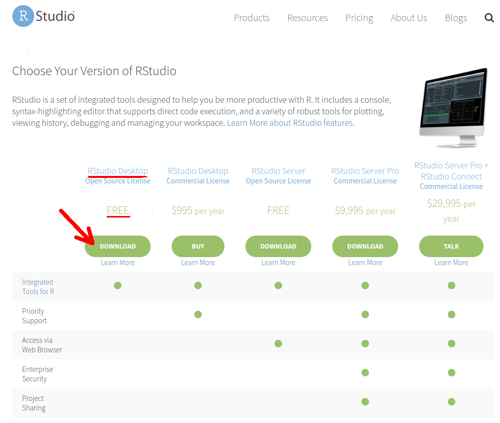
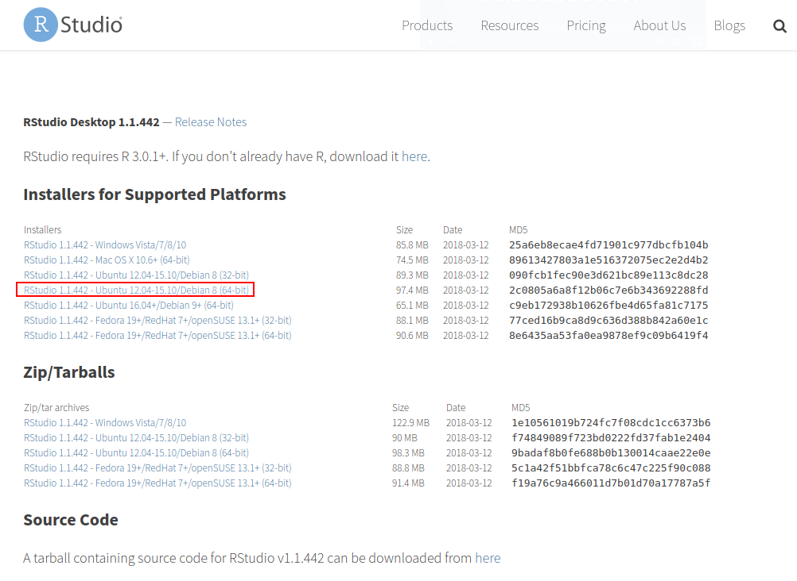

# (PART) Configuração do Sistema {-}


# O que você precisa 

```{r setup, echo = FALSE, message=FALSE}
rm(list = ls())
options(stringsAsFactors = TRUE)
pcks <- c("knitr"
          #, "tint"
          )
easypackages::libraries(pcks)
opts_chunk$set(cache = FALSE, 
               tidy = FALSE,
               fig.path = "images/", 
               #comment = "#>",
               collapse = TRUE)
#rblue <- "<code class='sourceCode bash'><span class='ex'>R</span></code>"
rblue <- ''
minirstudio <- ''
source("R/utils.R")
```


Você precisará do [`r rblue`](https://www.r-project.org/), [RStudio](https://rstudio.com/) e se estiver em SO Windows também do programa [Rtools]().

## Instalação do R e RStudio {#install}


A interação do usuário com o `r rblue` é por meio da linha de comando. A interface da linha de comando tem suas vantagens, mas a sua vida ficará muito mais fácil com o uso de uma Interface de Desenvolvimento Integrado (IDE) como o RStudio *Desktop*.

A seguir veremos como:

- instalar o `r rblue` nos SO Windows e Linux Ubuntu

- manter o `r rblue` sempre atualizado no Linux Ubuntu 

- configurar um diretório para armazenar os pacotes do R instalados

- instalar pacotes no `r rblue`

- instalar o Rstudio *Desktop*

Neste livro, o maior foco na instalação do `r rblue` é dada para o SO Linux [Ubuntu](https://pt.wikipedia.org/wiki/Ubuntu), pelo fato de assim como o R, ser um software livre e de código aberto. Como o Linux Ubuntu é baseado no [Debian](https://pt.wikipedia.org/wiki/Debian) o procedimento de instalação também se estende a essa distribuição Linux e as [versões derivadas do Ubuntu](https://pt.wikipedia.org/wiki/Ubuntu#Projetos_derivados) oficialmente reconhecidas. 

A instalação no SO Windows é igual a instalação de qualquer outro *software* e pode ser facilmente encontrada na internet. Por esta razão, somente indicou-se o caminho de instalação.


```{block, note-text-climate-system, type='rmdtip'}
Ao instalar R recomenda-se optar por instalar na língua inglesa. Assim quando surgir uma mensagem de erro durante seu uso, basta usá-la numa pesquisa na internet para solucionar o problema. As chances de resolver o problema serão muito maiores se sua pesquisa for realizada em inglês.
```

### Instalando o `r rblue`

O `r rblue` pode ser instalado a partir dos [binários pré-compilados](https://cran.r-project.org/bin/) ou do [código fonte](https://cran.r-project.org/sources.html). Nós veremos a instalação do `r rblue` a partir dos arquivos binários.


#### Windows 

O binário executável do `r rblue` para o Windows está disponível na **Rede Abrangente de Arquivos do `r rblue`** ([CRAN](https://cran.r-project.org/)) e pode ser baixado [aqui](http://cran.r-project.org/bin/windows/base/). 

Abra o executável e siga instruções de instalação do R mantendo todas as opções padrões.

No Windows a instalação do `r rblue` inclui uma Interface Gráfica do Usuário (GUI) acessível pelo executável `RGui.exe` (Figura \@ref(fig:r-gui)). Um atalho para esse executável é gerado por *default* na área de trabalho com o símbolo do `r rblue`.

```{r r-gui, comment="", highlight=TRUE, out.width="100%", fig.cap="Interface gráfica do usuário no R para Windows.", echo = FALSE}
knitr::include_graphics("images/rgui-windows.png")
```

Para instalar pacotes de plataformas diferentes da CRAN (veja seção [#install-github]) é necessário instalar o programa [Rtools](https://cran.r-project.org/bin/windows/Rtools/index.html). Nesta página você deve selecionar a versão do `Rtools` adequada (e.g [Rtools35.exe](https://cran.r-project.org/bin/windows/Rtools/Rtools35.exe)) para sua versão do R (`r cran_news_windows()`). 


##### Atualização do `r rblue` no Windows

Novas versões do R são disponibilizadas em geral com frequência de 5 vezes por ano. Recomenda-se manter o R atualizado, pois as novas versões incluem [aperfeiçoamentos e a correção de *bugs*](`r cran_news_windows()`).


As novas versões do `r rblue` vem com os [pacotes padrões do R](https://cran.r-project.org/doc/manuals/R-FAQ.html#Which-add_002don-packages-exist-for-R_003f). Os demais pacotes instalados pelo usuário na versão anterior precisam ser reinstalados na nova versão do `r rblue`.


Para atualizar o `r rblue` no Windows, ao invés de baixar o executável a cada nova versão e repetir o processo da seção anterior, você pode utilizar o pacote [**installr**](https://cran.r-project.org/web/packages/installr/index.html). A instalação de pacotes no `r rblue` será vista na seção \@ref(install-pck).

#### Linux 

##### Ubuntu

Há várias formas de instalar o `r rblue` no Ubuntu, mas geralmente a versão compilada no repositório *default* do Ubuntu não é a última. Se isso não for problema para você então basta executar:

```{r, eval = FALSE}
sudo apt-get install r-base
```

Entretanto, os pacotes do `r rblue` recém lançados são compilados para última versão do `r rblue`. Então você pode ter restrições ao uso de pacotes novos, os quais geralmente incluem o estado da arte de análise de dados. Por esta razão, abaixo mostra-se como instalar o `r rblue` de forma que seja atualizado automaticamente pelo sistema.

##### R sempre atualizado

Se você quer trabalhar sempre com a última versão estável do `r rblue`, é possível configurar o Linux Ubuntu para atualizar automaticamente o `r rblue`. O procedimento de instalação requer senha de superusuário do sistema ou de privilégios [sudo](https://en.wikipedia.org/wiki/Sudo). Caso não tenha, consulte o administrador do sistema.

Ao utilizar distribuições Linux Ubuntu é importante optar por versões estáveis[^1]. As versões de Suporte de Longo Prazo (LTS) mais recentes são:

- 12.04: `precise`
- 14.04: `trusty` 
- 16.04: `xenial`
- 18.04: `bionic`

[^1]: Clique [aqui](https://wiki.ubuntu.com/Releases) para saber mais sobre as versões do Ubuntu.

 
A versão mais atual é a `r stringr::str_extract(cran_news_windows(), "[0-9].[0-9].[0-9]")`. Para que ele seja atualizado automaticamente no Ubuntu você precisa adicionar o endereço https://cloud.r-project.org/bin/linux/ubuntu que automaticamente redireciona para o espelho da CRAN mais próximo à lista de repositórios do Linux.

###### Incluindo repositório do `r rblue` na Lista de repositórios do Ubuntu

O primeiro passo é descobrir o nome da versão UBUNTU instalada. Para isso, você pode utilizar o seguinte comando[^2] :


```
$ lsb_release -sc
```
```
bionic
```


[^2]: Se o comando `lsb_release` não funcionar você precisa instalar o pacote `lsb-release` no sistema. Para isso, digite no terminal Linux `sudo apt-get install lsb-release`.

O endereço do espelho da CRAN e algumas configurações do sistema podem ser inseridas num arquivo em `/etc/apt/sources.list.d/cran.list`. Essa tarefa requer privilégios de [superusuário](https://pt.wikipedia.org/wiki/Superusu%C3%A1rio). Vamos trocar do seu usuário para o superusuário.

    $ sudo su

Após o comando, informe a senha de superusuário e então vamos criar o arquivo `/etc/apt/sources.list.d/cran.list`.

    # touch /etc/apt/sources.list.d/cran.list

Vamos definir no terminal uma variável chamada `repos` que será composta pelo endereço do espelho[^3], o nome da versão do Ubuntu e o sufixo `-cran35`. Este sufixo é para obter versões do R  3.6**. 

    # repos="deb https://cloud.r-project.org/bin/linux/ubuntu `lsb_release -sc`-cran35/"
    
[^3]: Usando https://cloud.r-project.org automaticamente redireciona parao espelho da CRAN mais próximo. A lista de espelhos atual encontra-se em https://cran.r-project.org/mirrors.html.

O valor da variável `repos` é mostrado pelo comando: `echo $repos`. Certifique-se de que a última palavra corresponde ao nome da sua versão Ubuntu.


Adicionamos o conteúdo da `repos` ao arquivo cran.list usando o comando:

    # echo $repos >> /etc/apt/sources.list.d/cran.list

Assim o gerenciador de pacotes 
[apt](http://pt.wikipedia.org/wiki/Advanced_Packaging_Tool)[^4] fará a atualização do `r rblue` quando uma nova versão estiver disponível. Ou seja, você estará utilizando sempre versão mais atual do `r rblue`.

[^4]: o gerenciador de pacotes [apt](http://pt.wikipedia.org/wiki/Advanced_Packaging_Tool) é usado para instalação, atualização e remoção de pacotes em distribuições Debian GNU/Linux.


Feito isso, você podemos retornar a sessão de usuário comum:

    # exit


###### [APT protegido](https://cran.r-project.org/bin/linux/ubuntu/README.html#secure-apt) 

Os arquivos binários do `r rblue` para Ubuntu na [CRAN](http://cran.r-project.org) são assinados com uma chave pública [^5]. Para adicionar essa chave ao seu sistema digite os seguintes comandos:

    $ gpg --keyserver hkp://keyserver.ubuntu.com:80 --recv-keys E298A3A825C0D65DFD57CBB651716619E084DAB9

    $ gpg -a --export E298A3A825C0D65DFD57CBB651716619E084DAB9 | sudo apt-key add -

[^5]: Chave pública de autenticação é um meio alternativo de se logar em um servidor ao invés de digitar uma senha. É uma forma mais segura e flexível, mas mais difícil de ser configurada. Esse meio alternativo de fazer login é importante se o computador está visível na internet. Para saber mais veja [aqui](http://the.earth.li/~sgtatham/putty/0.55/htmldoc/Chapter8.html).

Se aparecer uma mensagem **OK** a chave foi adicionada com sucesso e os comandos a seguir podem ignorados. Porém, se aparecer uma mensagem do tipo *keyserver error*, utilize o seguinte comando:

    $ sudo apt-key adv --keyserver keyserver.ubuntu.com --recv-keys E298A3A825C0D65DFD57CBB651716619E084DAB9

Caso seja impresso alguma mensagem de erro, outra alternativa pode ser usada para obter a chave, via os comandos:

    $ gpg --keyserver keyserver.ubuntu.com --recv-key E298A3A825C0D65DFD57CBB651716619E084DAB9
    
    $ gpg -a --export E298A3A825C0D65DFD57CBB651716619E084DAB9 | sudo apt-key add -


###### Atualização da lista de repositórios do Ubuntu e instalação do `r rblue`

Após fazer as configurações da lista de repositórios e adicionar a chave é necessário fazer a atualização dessa lista (requer poderes de super usuário):

    $ sudo apt-get update
    
Finalmente, instalamos o binário do R, a coleção de pacotes recomendados e ferramentas de desenvolvimento:

    $ sudo apt-get -y install r-base-core r-recommended r-base-dev

<!---
referências
 https://stackoverflow.com/questions/46704247/upgrade-r-in-ubuntu-xenial
 https://gist.github.com/mGalarnyk/41c887e921e712baf86fecc507b3afc7
 https://askubuntu.com/questions/1162051/i-am-unable-to-install-latest-version-of-r 
 https://rtask.thinkr.fr/installation-of-r-3-5-on-ubuntu-18-04-lts-and-tips-for-spatial-packages/
 https://yiweiniu.github.io/blog/2019/07/Install-Update-R-and-R-packages/
 https://shiny.rstudio.com/articles/upgrade-R.html

# for r dev packages
sudo add-apt-repository ppa:marutter/rrutter3.5
sudo add-apt-repository ppa:marutter/c2d4u
sudo apt-get update
sudo apt-get -y install r-base-core r-recommended r-base-dev

# run apt-get update and then check via apt-cache policy r-base-core
apt-cache policy r-base-core

sudo apt install r-cran-rgl r-cran-rjags r-cran-snow r-cran-ggplot2 r-cran-igraph r-cran-lme4 r-cran-rjava r-cran-devtools r-cran-roxygen2 r-cran-rjava r-cran-xlsx

# pacotes mais usados
c("tidyverse", 
  "data.table",
  "knitr",
  "rstudioapi",
  
  )

rlang > Rcpp > backports > vctrs > glue > tibble > tidyselect> dplyr > purrr
nlme > lattice > broom

‘broom’, ‘dbplyr’, ‘haven’, ‘hms’, ‘modelr’, ‘reprex’, ‘rvest’, ‘tidyr’
--->


###### Testando o `r rblue`

Para iniciar o `r rblue` no Ubuntu, digite `R` no cursor do terminal:

    $ R

A partir desse momento já começamos uma sessão no `r rblue`. Vamos gerar uma sequência numérica de 1 a 10 e plotá-la.

```{r Chunck4, comment="", fig.align='center', fig.cap="Gráfico da sequência de 10 números.", prompt=TRUE, collapse=TRUE}
1:10
plot(1:10)
```

Você pode sair do `r rblue`, sem salvar os dados da seção, com o código a seguir:

```{r Chunck5, comment="", eval = FALSE, prompt=TRUE}
q(save = "no")
```

##### Diretório para pacotes instalados pelo usuário

Os pacotes que vem com os pacotes *r-base* e *r-recommended* são instalados no diretório `/usr/lib/R/library`. Estes pacotes são atualizados pelo sistema[^6] ou usando `sudo apt-get update && sudo apt-get upgrade`.

[^6]: Por ser atualizado automaticamente pelo sistema, às vezes o usuário nem percebe que a versão do R mudou.

Uma boa prática para os pacotes R instalados pelo usuário é definir um diretório específico. Isso lhe dá mais controle sobre os pacotes do `r rblue` instalados no sistema. Um local sugerido é o `/home/usuario/.R/libs`. O seu `home` ou `pasta pessoal` pode ser obtido com o comando `echo $HOME`. Para criar o diretório você pode digitar o comando abaixo:

    $ mkdir -p `echo $HOME`/.R/libs/
    
Para informar ao `r rblue` onde procurar os pacotes instalados, você precisa criar um arquivo chamado `.Renviron`, no diretório `$HOME`, contendo a expressão `R_LIBS=/home/usuario/.R/libs/`. Você pode fazer isso em um terminal com os comandos:

    $ R_LIBS=`echo $HOME/.R/libs/`
    $ echo $R_LIBS >> `echo $HOME/.Renviron`

Esse caminho fica então visível ao `r rblue`, o que pode ser verificado executando a função `.libPaths()` na linha de comando do `r rblue`. 

Abra o `r rblue`:

    $ R

e ao digitar:

```{r, prompt=TRUE, comment=""}
.libPaths()
```
    
o seu diretório `/home/usuario/.R/libs` [^7] deve aparecer em primeiro lugar. Indicando que este local tem prioridade para instalação dos pacotes. Caso o diretório deixe de existir os diretórios seguintes  serão usados.

[^7]: Diretórios precedidos por "." no Linux são diretórios ocultos. O diretório `/home/usuario/.R` é um diretório oculto, para visualizá-lo no Ubuntu, na interface gráfica do sistema, acesse *View > Show Hidden Files* (ou *Visualizar > Mostrar arquivos ocultos*). No terminal utilize `ls -a` para listar os arquivos ocultos.


## Pacotes do R {#install-pck}

Um pacote do R é uma coleção de funções, dados e documentação que estende as capacidades básicas do R.

### Da internet

#### CRAN {#install-cran}

A forma mais fácil de instalar uma pacote do R é através da função `install.packages("nome_do_pacote")`.

Por *default* o pacote informado é instalado a partir da ([CRAN](https://cran.r-project.org/))

A seguir você verá como instalar um pacote. Como exemplo instalaremos o pacote **remotes** que dispões de funções para instalar pacotes de repositórios remotos, como por exemplo do [GitHub](https://github.com/).

```{r, eval = FALSE}
install.packages("remotes")
```


```{r solucao-devtools-dep, include=FALSE}
#Package Installation from Remote Repositories, Including 'GitHub'
#sudo apt-get libssl-dev
# see https://www.rstudio.com/products/rpackages/devtools/
#   The OpenSSL library that is required to
#   build git2r was not found.

#   Please install:
#libssl-dev    (package on e.g. Debian and Ubuntu)
#openssl-devel (package on e.g. Fedora, CentOS)
#openssl       (Homebrew package on OS X)
```

Para ter acesso as funções disponibilizadas com o pacote você precisa carregar o pacote:

```{r, eval = FALSE}
library(remotes)
```

Apesar de precisar só instalar uma vez um pacote, você precisará carregá-lo a cada nova sessão.

Para desinstalar um pacote você pode usar a função `remove.packages("nome_do_pacote")`.

#### GitHub e R-forge {#install-github}

Nem todos pacotes são disponíveis na CRAN. Muitos desenvolvedores disponibilizam seus pacotes em plataformas como o [GitHub](https://github.com/) e [R-forge](https://r-forge.r-project.org/). As vezes um pacote pode  estar em ambos CRAN e GitHub (ou R-forge), mas a última versão - a de desenvolvimento - é somente disponibilizada no GitHub (ou R-forge). 

Para instalar um pacote de um repositório do GitHub usa-se a função `install_github()` do pacote **remotes**. Portanto, o pacote **remotes** precisa ser sido instalado primeiro (ver seção \@ref(install-cran)). 

```{r, include = FALSE}
#Antes de instalar o pacote **devtools**, usuários Windows precisam instalar o programa [Rtools](https://cran.r-project.org/bin/windows/Rtools/index.html).
```

A função para instalar um pacote do GitHub requer como argumento o nome do usuário e do repositório. Por exemplo, para instalar o pacote `inmetr` do repositório mantido pelo [lhmet](https://github.com/lhmet), usa-se:

```{r, eval = FALSE}
# install.packages("devtools")
# carrega o pacote devtools
library(remotes)
# instala o pacote inmetr do repositório 
# https://github.com/lhmet/inmetr 
install_github("lhmet/inmetr")
```


```{block, dica-2ptos2ptos, type='rmdtip'}
Você pode acessar uma função de um pacote instalado com a forma especial `pacote::funcao`. O trecho de código anterior poderia ser reduzido a: 

`remotes::install_github("lhmet/inmetr")`

Essa forma deixa explícito que estamos usando a função `install_github()` do pacote **remotes**.

As vezes você pode estar com diversos pacotes carregados e eles podem ter funções de mesmo nome. Portanto, essa é a alternativa mais segura de avaliar funções afim de evitar conflitos. 
```

Para instalar um pacote num repositório do R-forge, por exemplo o repositório do pacote [raster](https://r-forge.r-project.org/projects/raster/), usa-se:

```{r, eval = FALSE}
install.packages(
  "raster",  
  repos = "http://R-Forge.R-project.org"
)
```


#### Arquivo fonte local

Códigos fonte de pacotes do R são armazenados como arquivos com a extensão `.tar.gz`. Binários compilados são armazenados com a extensão `.zip`. Exemplo de arquivos como estes podem ser baixados manualmente da CRAN (veja a seção Downloads em https://cran.r-project.org/web/packages/ggplot2/index.html), GitHub ou R-forge.

Eventualmente um usuário pode instalar um pacote a partir desses arquivos localmente. Isto pode também ser feito  com a função `install.packages()`, especificando o argumento `repos = NULL` e o argumento `pkgs` com o caminho do arquivo. Por exemplo:

```{r, eval = FALSE}
install.packages("ggplot2_2.1.0.tar.gz", repos = NULL)
```


## Atualização de pacotes 

Se o seu `r rblue` foi atualizado, os pacotes da versão prévia do `r rblue` devem ser reinstalados para evitar problemas de compatibilidade. O comando abaixo atualiza todos pacotes para a última versão. A opção `checkbuild = TRUE` reinstala os pacotes que foram construídos uma versão mais antiga que a do `r rblue` atual. 


```{r, eval = FALSE}
update.packages(checkBuilt=TRUE, ask=FALSE)
```

Se você usa muitos pacotes, este processo pode tornar-se trabalhoso e problemático, devido a cadeia de dependências de alguns pacotes. Por esta razão, há pacotes para facilicitar este processo, como o [rvcheck](https://github.com/GuangchuangYu/rvcheck).

```{r, eval = FALSE}
install.packages("rvcheck")
```

Com o [rvcheck](https://github.com/GuangchuangYu/rvcheck) podemos:

- checar a versão mais recente do R

```{r}
library(rvcheck)
check_r()
```

- checar a versão mais atual de um pacote na CRAN, no GitHub ou no Bioconductor

```{r}
check_cran('dplyr')
check_github('lhmet/inmetr')
check_bioc('EBImage')
```

Por fim, para atualizar todos os pacotes:

```{r, eval = FALSE}
update_all(check_R = TRUE)
```


```{block, note-text-keep-pkg-version, type='rmdtip'}
Se você precisa manter a versão dos seus pacotes em uma nova versão do R, o pacote [pkgsnap](https://github.com/MangoTheCat/pkgsnap) é uma solução. Esta opção é útil para evitar que mudanças nas versões dos pacotes possam fazer com que seu código se comporte de maneira diferente.
```


## RStudio no Ubuntu {#install-rstudio}

`r minirstudio` é uma empresa que desenvolve ferramentas gratuitas para o `r rblue` e [produtos pagos](https://www.rstudio.com/products/) para empresas.

Uma de suas ferramentas gratuitas é o software RStudio *Desktop* que consiste em um ambiente integrado de desenvolvimento ([IDE](http://en.wikipedia.org/wiki/Integrated_development_environment)) construído especificamente para o `r rblue`, consequentemente, também é multiplataforma.

Para instalação da versão do [RStudio Desktop](https://rstudio.com/products/rstudio/#rstudio-desktop), você precisa saber se seu SO é 64 ou 32-bit e a versão do Linux Ubuntu. Essas informações podem ser obtidas, respectivamente, pelos comandos:

    $ arch

```
x86_64
```
Se retornar **x86_64** sua máquina é 64-bit.

    $ lsb_release --release | cut -f2

```
14.04
```

Com essas informações, siga os seguintes passos:

  1. acesse [RStudio](https://www.rstudio.com/products/rstudio/download/)
  2. clique em *Download* (Figura \@ref(fig:rstudio-choose))


```{r rstudio-choose, echo = FALSE,  fig.align='center', out.width="100%", fig.cap="Opção para baixar o RStudio *Desktop*."}

```

  3. Clique na sua plataforma (de acordo com seu SO, arquitetura e versão da distribuição) (Figura \@ref(fig:rstudio-plat)), no exemplo deste livro *RStudio 1.2.5033 - `r sessioninfo::os_name()` (`r ifelse(as.logical(grep("64", sessioninfo::platform_info()$system)), 64, 32)`-bit)*.
  
```{r, rstudio-plat, echo = FALSE, fig.align='center', out.width="100%", fig.cap="Escolha da plataforma em que será o usada o RStudio *Desktop*."}

```
  

  4. Dependendo da sua versão Ubuntu, ao clicar sobre o sobre o arquivo baixado com o botão direito, há a opção de abrir com *Ubuntu Software Center* e então clicar em `instalar`. Se na versão de seu *Desktop* não há esta opção ao clicar com botão direito sobre o arquivo, instale via **terminal**[^8] com os seguintes comandos:


[^8]: digite 'Ctrl+Alt+t' para abrir um terminal no Linux Ubuntu

```
$ cd /local/do/arquivo/baixado
$ sudo dpkg -i arquivoBaixado.deb
$ sudo apt-get install -f
```


Abra o RStudio digitando no terminal:

    $ rstudio &
    
Agora você está pronto para começar a programar em `r rblue` aproveitando as facilidades que o [RStudio](http://www.rstudio.com/) oferece. 

