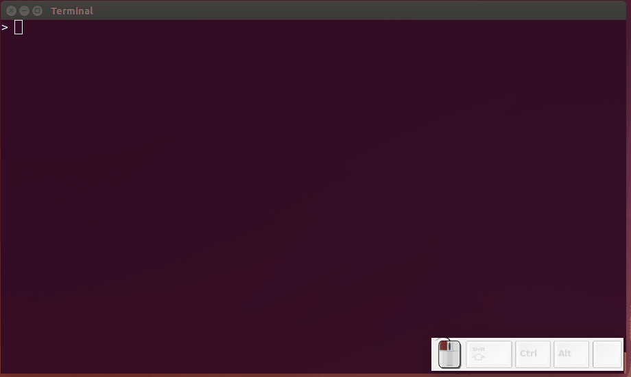

# Interface do Usuário {#iu}


Na maior parte do tempo você provavelmente usará o  no **modo interativo**: rodando comandos e vendo os resultados.
 
Eventualmente esse processo pode ser inconveniente. Por exemplo, no caso de uma análise com um código bem extenso e que precisa ser  repetida com dados atualizados semanalmente. Nessa situação, recomenda-se a criação de um script, ou seja, um arquivo texto, com a extensão `.R`, contendo o código de sua análise.

Esse *script* pode ser executado pelo R no **modo de processamento em lote** (do termo em inglês *Batch Processing*) através de um terminal do SO Linux, ou via o Prompt de comando (`cmd.exe`) do SO Windows.

Nesta seção apresenta-se ao leitor estes dois modos de execução do .


##  no modo interativo

No Linux o  pode ser aberto simplesmente digitando em um terminal a letra `R`. 


```bash
$ R
```

```
R version 3.4.4 (2018-03-15) -- "Someone to Lean On"
Copyright (C) 2018 The R Foundation for Statistical Computing
Platform: x86_64-pc-linux-gnu (64-bit)

R is free software and comes with ABSOLUTELY NO WARRANTY.
You are welcome to redistribute it under certain conditions.
Type 'license()' or 'licence()' for distribution details.

  Natural language support but running in an English locale

R is a collaborative project with many contributors.
Type 'contributors()' for more information and
'citation()' on how to cite R or R packages in publications.

Type 'demo()' for some demos, 'help()' for on-line help, or
'help.start()' for an HTML browser interface to help.
Type 'q()' to quit R.

> 
```

A janela com a linha de comando do  apresenta o *prompt* do  (` > `). Após este símbolo digitamos os comandos, pressionamos a tecla `<enter>`, o  interpreta o comando e retorna o resultado. 

Os comandos digitados na linha de comando são chamados de expressões. Esse é o modo iterativo do . Portanto, a linha de comando é a mais importante ferramenta do , pois todas expressões são avaliadas através dela. 


```r
> 62 + 38
[1] 100
```

A expressão é avaliada pelo , o resultado é mostrado, mas o seu valor é perdido.

O número entre colchetes que aparece como resultado da operação ("[1]" no caso acima) indica o conteúdo resultante da operação iniciando na posição 1 desse objeto. O significado dessa informação torna-se mais óbvio quando trabalhamos com objetos maiores, como por exemplo com vetores. Observe os valores nos colchetes para uma sequência de 100 até 1.


```r
> 100:1
  [1] 100  99  98  97  96  95  94  93  92  91  90  89  88  87  86  85  84
 [18]  83  82  81  80  79  78  77  76  75  74  73  72  71  70  69  68  67
 [35]  66  65  64  63  62  61  60  59  58  57  56  55  54  53  52  51  50
 [52]  49  48  47  46  45  44  43  42  41  40  39  38  37  36  35  34  33
 [69]  32  31  30  29  28  27  26  25  24  23  22  21  20  19  18  17  16
 [86]  15  14  13  12  11  10   9   8   7   6   5   4   3   2   1
```

O elemento `[18]` da sequência de 100 até 1 é o número `83`.

Pode ocorrer da expressão digitada na linha ser muito extensa e ir além de uma linha. Se a expressão estiver incompleta o  mostra um sinal de `+`.


```r
> 1 * 2 * 3 * 4 * 5 *
+ 6 * 7 * 8 * 9 * 10
[1] 3628800
```

Execute a expressão abaixo até o sinal de menos e tecle `<enter>`. Enquanto a expressão não estiver completa o sinal de + se repetirá. Até que você digite o número que deseja subtrair de 4.


```r
> 4 -
+   
+   3
[1] 1
```

### Expressões em sequência {#expressInSeq}

Podemos executar todas expressões anteriores em apenas uma linha, usando o ponto e vírgula  `;` para separar as expressões:


```r
> 62 + 38; 100:1; 1 * 2 * 3 * 4 * 5 * 6 * 7 * 8 * 9 * 10; 4 - 3
[1] 100
  [1] 100  99  98  97  96  95  94  93  92  91  90  89  88  87  86  85  84
 [18]  83  82  81  80  79  78  77  76  75  74  73  72  71  70  69  68  67
 [35]  66  65  64  63  62  61  60  59  58  57  56  55  54  53  52  51  50
 [52]  49  48  47  46  45  44  43  42  41  40  39  38  37  36  35  34  33
 [69]  32  31  30  29  28  27  26  25  24  23  22  21  20  19  18  17  16
 [86]  15  14  13  12  11  10   9   8   7   6   5   4   3   2   1
[1] 3628800
[1] 1
```


### Navegação entre as expressões já avaliadas

Você pode usar as teclas ⬆️ e ⬇️ para navegar entre as expressões já avaliadas pelo . O que é útil quando precisamos repetir um comando anterior com alguma mudança ou para corrigir um erro de digitação ou a omissão de um parentêses.

Quando a linha de comando é usada por muito tempo a sua tela pode ficar poluída com a saída das expressões anteriores. Para limpar a tela, tecle `Ctrl+l`. Assim o console aparece na parte superior do terminal.


```r
> 15 + 4
[1] 19
> 100:1
  [1] 100  99  98  97  96  95  94  93  92  91  90  89  88  87  86  85  84
 [18]  83  82  81  80  79  78  77  76  75  74  73  72  71  70  69  68  67
 [35]  66  65  64  63  62  61  60  59  58  57  56  55  54  53  52  51  50
 [52]  49  48  47  46  45  44  43  42  41  40  39  38  37  36  35  34  33
 [69]  32  31  30  29  28  27  26  25  24  23  22  21  20  19  18  17  16
 [86]  15  14  13  12  11  10   9   8   7   6   5   4   3   2   1
> #tecle <Ctr + l>
```

Para parar ou cancelar a execução de uma expressão utilize as teclas `Ctrl + C`. As teclas `Ctrl + l` tem o efeito de limpar a tela.

### Comentários

No , a cerquilha `#` (hashtag) é um caracter especial. Qualquer coisa após esse caracter será ignorada pelo . Somente as expressões antes da `#` são avaliadas. Por meio desse símbolo de comentário podemos fazer anotações e comentários no código sem atrapalhar a interpretação das expressões pelo .


```r
> # comentário antes do código 
```

```r
> 17 + 3 # comentário ao lado do código: adicionando 17 e 3
[1] 20
```


### Auto preenchimento de funções

O  inclui o preenchimento automático de nomes de funções e arquivos por meio da tecla `<tab>`. Uma lista de possíveis funções que começam com as letras inicialmente digitadas aparecerão.


```r
> read#<tab> pressione <tab> para ver as opções de comandos que iniciam com o termo read
```


<div class="figure" style="text-align: center">

<p class="caption">(\#fig:unnamed-chunk-3)Auto preenchimento de código na linha de comandos do R.</p>
</div>

### Primeiro *script* {#primeiro-script}

O trecho de código abaixo apresenta nas primeiras linhas algumas expressões do  executadas anteriormente. Mas há também, na segunda parte, códigos para salvar um gráfico de pontos num arquivo *pdf*. Na última parte do trecho, define-se uma variável `x` que contém aquela mesma sequência numérica usada no gráfico.


```r
# Primeiro script no R
#----------------------------------------------------------------
# cálculos básicos
15 + 4
1:100
1 * 2 * 3 * 4 * 5 *6 * 7 * 8 * 9 * 10
4-3
#----------------------------------------------------------------
# salvando um gráfico em um arquivo pdf
arquivo_pdf <- "plot-script1.pdf"
pdf(arquivo_pdf)        # cria e abre um arquivo pdf
plot(1:100)             # faz o gráfico
dev.off()               # fecha o arquivo pdf
#----------------------------------------------------------------
# definindo uma variável x
x <- 1:100
x
```

Este conjunto de linhas de código, quando inseridos em um arquivo texto[^7] formam um primeiro *script* . Este *script* pode ser executado pelo  através da função `source()`, usando como argumento o caminho para o local do *script*. 

[^7]: Para fazer isso, você pode usar um editor de texto qualquer (p.ex.: [gedit](https://help.gnome.org/users/gedit/stable/index.html.pt_BR) no SO Linux, ou [Notepad](https://pt.wikipedia.org/wiki/Bloco_de_Notas) no SO Windows).


```r
> source("/home/usuario/adar/script1.R")
```


Este *script* produzirá como saída o arquivo `/home/usuario/adar/plot-script1.pdf`. Você pode visualizar o arquivo para conferir o gráficos de pontos gerado.


##  no modo de processamento em lote


Para rodar um *script* no modo de processamento em lote do  através do seguinte comando no terminal Linux:

```
$ R CMD BATCH opcoes arqentrada arqsaida
```

Onde: `arqentrada`é o nome do script (arquivo com a extensão `.R`) a ser executado; `arqsaida` é o arquivo (com a extensão `.Rout`) com as saídas dos comandos executados no R; `opcoes` é a lista de opções que controlam a execução.

Vamos rodar como exemplo, o `script1.R` da seção \@ref(primeiro-script). 

```
$ R CMD BATCH /home/usuario/adar/script1.R
```

O comando acima, produzirá dois arquivos de saída: 
 
1. `script1.Rout`[^8] criado por *default* quando o `arqsaida` não é especificado, e;

[^8]: Você pode notar que este arquivo tem o mesmo nome do `arqentrada`, exceto que a sua extensão foi alterada para `.Rout`.

2. arquivo \"plot-script1.pdf\".


Você pode especificar o nome do `arqsaida` como desejar. No exemplo abaixo, mostra-se como salvar o arquivo de saída incluindo a data em que ele foi gerado, `script1-saida-adatadehoje.log`.

```
$ R CMD BATCH script1.R script1-saida-`date "+%Y%m%d"`.log
```
Após a execução do último comando, os mesmos arquivos resultantes do comando anterior serão gerados, exceto pelo primeiro (`.Rout`), que será nomeado ` script1-saida-20180507.Rout `.

Para mais opções do comando `R CMD BATCH` digite no terminal do Linux `R --help`.

