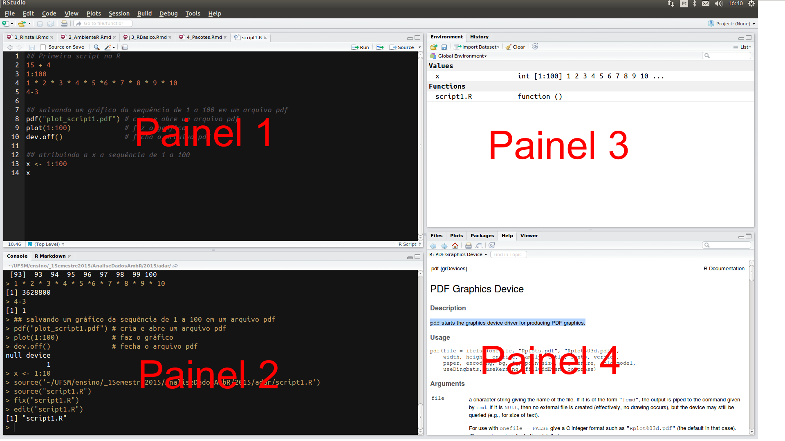

# RStudio {#rstudio}

```{r setup, include = FALSE}
rm(list = ls())
pcks <- c("knitr", "htmltools", "vembedr")
#pcks <- c("knitr", "emo", "htmltools", "vembedr")
easypackages::libraries(pcks)
opts_chunk$set(prompt = TRUE,
               cache = FALSE, 
               fig.path = "images/", 
               comment = "",
               collapse = TRUE)
#rblue <- "<code class='sourceCode bash'><span class='ex'>R</span></code>"
rblue <- ''
```

O RStudio *Desktop* é um ambiente integrado de desenvolvimento (IDE) para o `r rblue`. Portanto, o RStudio depende da instalação prévia do `r rblue`. Ele funciona como uma interface gráfica do usuário (GUI), mas com muito mais potencialidades.

O RStudio é uma ferramente que potencializará sua interação com o `r rblue`:

- na produção de gráficos

- na organização de seu código na forma de projetos

- na reprodutibilidade de seu trabalho ou pesquisa 

- na manutenção e criação de seus próprios pacotes do R

- na criação e compartilhamento de seus relatórios

- no compartilhamento de seu código e a colaboração com outros

Nessa seção você terá uma visão geral do RStudio *Desktop*.

## Visão geral do RStudio

Assumindo que o RStudio tenha sido instalado (seção \@ref(install-rstudio)), ao abri-lo e clicar em *File > New File > R script* você verá uma tela com aspecto similar ao da Figura \@ref(fig:rstudio-fig).

```{r rstudio-fig, ref.label='rstudio-fig', echo = FALSE, fig.fullwidth = TRUE, fig.cap="Rstudio"}

```

O RStudio possui 4 painéis principais:

  1. Editor para scripts e visualização de dados

     - abrir e criar scripts
     - rodar scripts
     - código com sintaxe realçada
     - rodar partes do código `<Ctrl+enter>`
     - rodar todo script `<Ctrl+Shift+S>`
     - autopreenchimento das funções `<tab>`
     - comentar linhas `<Ctrl+Shift+C>`
     - desfazer `<Ctrl+Z>`
     - refazer `<Ctrl+Shift+Z>`
     - referência para teclas de atalho `<Alt+Shift+K>`
     - abrir script com `<Ctrl+Click>`
     - encontrar e substituir `Ctrl+F`


2. Console do R


3. Navegador do espaço de trabalho e histórico de comandos


4. Arquivos/Plots/Pacotes/Ajuda/Visualizador


Configuração de texto e painéis em:

* Menus
    * Tools > global Options > Appearance
        * mostrar linhas, alterar realce da sintaxe
    * Session
    * Plots


Para saber mais sobre os recursos fornecidos pelo RStudio assista ao vídeo *[RStudio Essencials](https://www.rstudio.com/resources/webinars/rstudio-essentials-webinar-series-part-1/)*. Isso o ajudará a usar mais efetivamente o RStudio.


```{r, echo = FALSE}
embed_vimeo("97378167")
```


**Folha de referência do RStudio**

```{r cheat-sheet, ref.label='cheat-sheet', echo = FALSE, fig.align='center', fig.cap="Folha de referência do RStudio, disponível em https://www.rstudio.com/wp-content/uploads/2016/03/rstudio-IDE-cheatsheet-portuguese.pdf", out.width = '100%'}
knitr::include_graphics('images/print-screen-folha-ref-rstudio.png')
```


