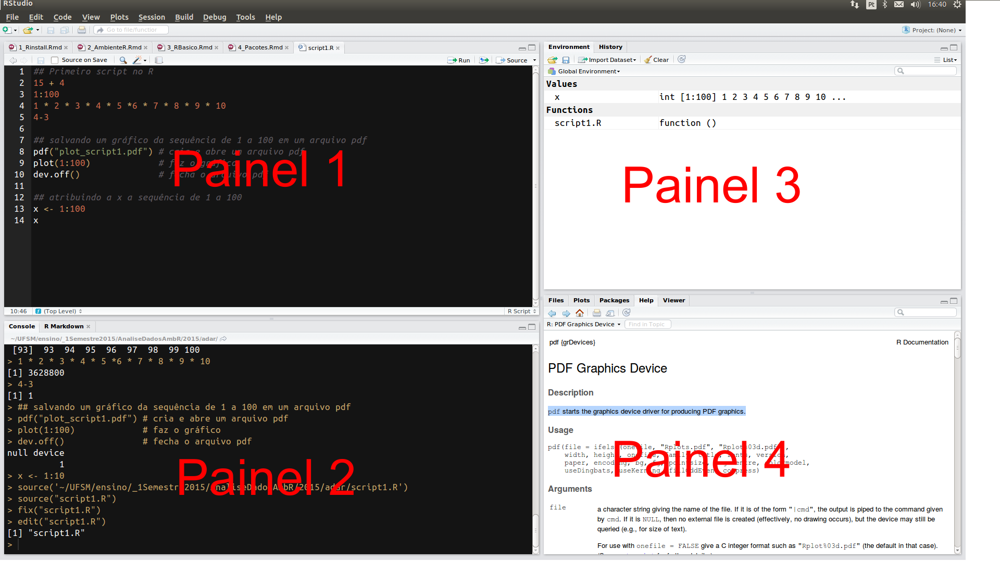

# RStudio {#rstudio}

O [RStudio](http://www.rstudio.com/) é um ambiente integrado de desenvolvimento (IDE) para o R. Essa ferramenta potencializará:

- a interação com o R e a produção de gráficos

- a organização de seu código na forma de projetos

- a reprodutibilidade de sua pesquisa 

- a manutenção e criação de seus próprios pacotes do R

- a criação e compartilhamento de seus relatórios

- o compartilhamento de seu código e a colaboração com outros

Ao abrir o RStudio você verá uma tela com aspecto similar ao da Figura \@ref(fig:rstudio-fig).

(\#fig:rstudio-fig)Rstudio

O RStudio possui 4 painés principais:

  1. Editor para scripts e visualização de dados

     - abrir e criar scripts
     - rodar scripts
     - código com sintaxe realçada
     - rodar partes do código `<Ctrl+enter>`
     - rodar todo script `<Ctrl+Shift+S>`
     - autopreenchimento das funções `<tab>`
     - comentar linhas `<Ctrl+Shift+C>`
     - desfazer `<Ctrl+Z>`
     - refazer `<Ctrl+Shift+Z>`
     - referência para teclas de atalho `<Alt+Shift+K>`
     - abrir script com `<Ctrl+Click>`
     - econtrar e substituir `Ctrl+F`

2. Console do R

3. Navegador do espaço de trabalho e histórico de comandos

4. Arquivos/Plots/Pacotes/Ajuda/Visualizador

Configuração de texto e painés em:

* Menus
    * Tools > global options > Appearance
        * mostrar linhas, alterar realce da sintaxe
    * Session
    * Plots

 

Para saber mais sobre os recursos fornecidos pelo RStudio assista ao vídeo *[RStudio Essencials](https://www.rstudio.com/resources/webinars/rstudio-essentials-webinar-series-part-1/)*. Isso o ajudará a usar mais efetivamente o RStudio.

**Folha de referência do RStudio**

(\#fig:cheat-sheet)Folha de referência do RStudio, disponível em https://www.rstudio.com/wp-content/uploads/2016/03/rstudio-IDE-cheatsheet-portuguese.pdf

