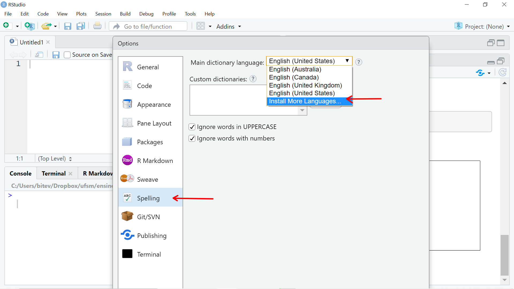

# RStudio {#rstudio}

O RStudio *Desktop* é um ambiente integrado de desenvolvimento (IDE) para o . Portanto, o RStudio depende da instalação prévia do . Ele funciona como uma interface gráfica do usuário (GUI), mas com muito mais potencialidades.

O RStudio é uma ferramente que potencializará sua interação com o :

- na produção de gráficos

- na organização de seu código na forma de projetos

- na reprodutibilidade de seu trabalho ou pesquisa 

- na manutenção e criação de seus próprios pacotes do R

- na criação e compartilhamento de seus relatórios

- no compartilhamento de seu código e a colaboração com outros

Nessa seção você terá uma visão geral do RStudio *Desktop*.

## Visão geral do RStudio

Assumindo que o RStudio tenha sido instalado (seção \@ref(install-rstudio)), ao abri-lo e clicar em *File > New File > R script* você verá uma tela com aspecto similar ao da Figura \@ref(fig:rstudio-fig).

(\#fig:rstudio-fig)Rstudio

O RStudio possui 4 painéis principais:

  1. Editor para scripts e visualização de dados

     - abrir e criar scripts
     - rodar scripts
     - código com sintaxe realçada
     - rodar partes do código `<Ctrl+enter>`
     - rodar todo script `<Ctrl+Shift+S>`
     - autopreenchimento das funções `<tab>`
     - comentar linhas `<Ctrl+Shift+C>`
     - desfazer `<Ctrl+Z>`
     - refazer `<Ctrl+Shift+Z>`
     - referência para teclas de atalho `<Alt+Shift+K>`
     - abrir script com `<Ctrl+Click>`
     - encontrar e substituir `Ctrl+F`

2. Console do R

3. Navegador do espaço de trabalho e histórico de comandos

4. Arquivos/Plots/Pacotes/Ajuda/Visualizador

Configuração de texto e painéis em:

* Menus
    * Tools > global Options > Appearance
        * mostrar linhas, alterar realce da sintaxe
    * Session
    * Plots

A **Folha de referência do RStudio** (Figura \@ref(fig:rstudio-cheat-sheet))) fornece uma visão geral das suas principais funcionalidades.

(\#fig:rstudio-cheat-sheet)Folha de referência do RStudio, disponível em https://www.rstudio.com/wp-content/uploads/2016/03/rstudio-IDE-cheatsheet-portuguese.pdf

Para saber mais sobre os recursos fornecidos pelo RStudio assista ao vídeo *[RStudio Essencials](https://www.rstudio.com/resources/webinars/rstudio-essentials-webinar-series-part-1/)*. Isso o ajudará a usar mais efetivamente o RStudio.

## Correção ortográfica

O RStudio oferece o recurso de correção ortográfica do texto. No caso de línguas diferentes da Inglesa é necessário instalar os dicionários para outras línguas. Os dicionários podem ser instalados indo em `Tools > Global Options`, selecionando `Spelling` no painel à esquerda e `Install More Languages` na caixa de seleção dos dicionários de línguas (Figura \@ref(fig:rstudio-spell-config)). Assim, será feita a instalação das 28 linguagens disponíveis.

(\#fig:rstudio-spell-config)Configuração do RStudio para instalar dicionários de outras línguas.

Após a adição dos dicionários, acesse novamente a caixa de seleção de dicionários e selecione `Portuguese (Brazil)` e depois clique em `ok` (Figura \@ref(fig:rstudio-set-dict)).

(\#fig:rstudio-set-dict)Configuração do dicionário de Portugês-BR  no RStudio.

Agora você pode evitar erros ortográficos nos seus relatórios e demais documentos escritos em R Markdown através da tecla `F7` (ou `Edit > Check Spelling`).

Se você quer usar uma diferente variação de dicionário para sua língua de trabalho, siga as orientações disponibilizadas no [suporte do RStudio](https://support.rstudio.com/hc/en-us/articles/200551916-Spelling-Dictionaries).

