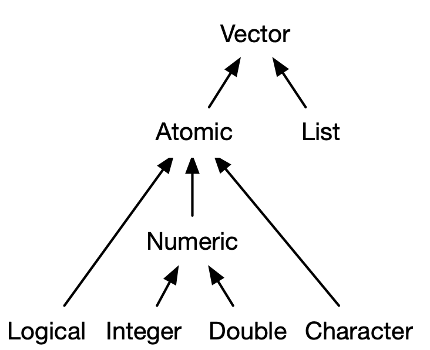

# Tipos de dados {#datatype}


Neste capítulo vamos:

- aprender a criar vetores
- conhecer os tipos de dados mais usados no R
- descobrir qual é o tipo de dado de uma variável
- aprender a fazer testes com operadores lógicos
- saber como converter uma variável de um tipo para outro


```{r setup, include = FALSE}
rm(list = ls())
pcks <- c("knitr")
# pcks <- c("knitr", "emo")
easypackages::libraries(pcks)
opts_chunk$set(
  prompt = FALSE,
  cache = FALSE,
  fig.path = "images/",
  comment = "#>",
  collapse = TRUE
)
source("R/utils.R")
```


<!-- 
faltando: 
fórmulas 
factor 
-->


## Vetores e tipos de dados {#tipos-dados}

Vetor é a estrutura básica de dados do `r rblue` e consiste em uma coleção de elementos. Vetores podem ser de dois tipos: **vetores atômicos** e **listas**[^listas]. Um vetor atômico é uma coleção de elementos do mesmo tipo de dado. Os tipos de dados mais usados (tabela \@ref(tab:classes-r)) em vetores atômicos são: **`numeric`** (numérico), **`character`** (caracteres), **`logical`** (lógico), **`date`** (datas), **`POSIX`** (data e horários). A relação entre estes tipos de dados é mostrada na Figura \@ref(fig:data-types-rel). 

[^listas]: Lista é um tipo de vetor chamado `list` que é capaz de armazenar dados de diferentes tipos (heterogêneos), o que será visto na seção \@ref(listas). 

```{r classes-r, echo = FALSE, warning=FALSE, eval = TRUE}
classes_df <- tibble::tibble(
  `Tipo de dados` = c("Números", "Caracteres", "Lógicos", "Datas", "Datas e horários"),
  `Classe no R` = c("numeric", "character", "logical", "Date", "POSIX"),
  exemplo = list("2.5, 2", '"adar"', "TRUE, FALSE", "2010-01-01", "2010-01-01 00:00:00")
)
knitr::kable(classes_df,
  caption = "Principais tipos de dados do R.",
  align = "c"
)
```


```{r data-types-rel, ref.label='data-types-rel', echo = FALSE, fig.align='center', fig.cap="Relação entre os diferentes tipos de vetores atômicos.", out.width='50%'}

```


```{block, note-vectors, type='rmdtip'}
Embora existam dois tipos de vetores o termo "vetor" é em geral usado para se referir ao do tipo atômico.
```


### Construindo vetores {#build-vectors}


**Vetores atômicos** são geralmente criados com a função `c()`, abreviatura para **combinar ou concatenar**. Os argumentos podem ser especificados separados por vírgula. Por exemplo, para criar um vetor com números reais chamado `vetor_dbl`, escrevemos:


```{r va-1}
(vetor_dbl <- c(-1.51, 0.33, 1.46, 2.04))
```


```{block, note-virgulas, type='rmdnote'}
A função `c()` aceita um **número variado de argumentos**, o que é representado por três pontos ou reticências (`...`) na sua documentação de ajuda (`?c`). 
```


Para saber qual a classe ou tipo de uma variável podemos usar a função `class()`.

```{r va-2}
class(vetor_dbl)
```


### Números

O tipo de dados mais usado no `r rblue` é chamado *numeric*. Este tipo inclui números inteiros, decimais, positivos, negativos e zero. Um dado do tipo numérico pode ser real (`double`) ou inteiro (`integer`) (\@ref(fig:data-types-rel)).

**Números inteiros**: são geralmente usados para contagem (n° habitantes, n° de palavras, quantidade de eventos de um dado fenômeno). São números sem a parte fracionária.  

**Números reais**: podem ter uma parte fracionária e uma inteira. Estes resultam de medidas que podem assumir qualquer valor: 3.5 horas, 10.4 mm, 18.1 °C.

Como todo n° inteiro pode ser representado como real, no `r rblue` por padrão números (ou operações envolvendo números) são definidos como **`double`** ([dupla precisão no formato de ponto flutuante](https://pt.wikipedia.org/wiki/Dupla_precis%C3%A3o_no_formato_de_ponto_flutuante)). Por exemplo o vetor `vetor_num` é numérico:

```{r nums-1}
(vetor_num <- c(-1, 0, 1, 2, NA_real_))
class(vetor_num)
```

Mas para sabermos se ele é real ou inteiro, usamos a função `typeof()`:

```{r nums-2}
typeof(vetor_num)
```


Para definirmos um vetor como inteiro é necessário usar o sufixo `L` em cada elemento numérico. 


```{r nums-3}
(vetor_int <- c(1L, 6L, 10L, NA_integer_))
typeof(vetor_int)
```
 

O R converte inteiros para numéricos automaticamete quando necessário. Vamos verificar essas conversões usar a função `typeof()` para determinar o tipo de dado e as conversões que o R faz. Por exemplo:

```{r chunk5}
typeof(5L)
typeof(4.5)
typeof(5L * 4.5)
typeof(10L/3L)
```


### Caractere

Um grupo de caracteres (ou *strings*), letras ou qualquer forma de texto são dados do tipo **`character`**. Eles são identificados por aspas dupla, por exemplo:  

<!---
qualquer Dados caractere (do termo em inglês *character* ) é bastante utilizado e deve ser manipulado com cuidado. Há duas principais formas de lidar com caracteres: a função `character()` e a `factor()`. Embora pareçam similares eles são tratados de forma diferente.
-->


```{r char-1}
(vetor_char <- c("ae", NA_character_, "ou"))
class(vetor_char)
```

<!--
`char` contém as palavras  \"Vai chover hoje?\", enquanto, `charf` tem as mesmas palavras porém sem as aspas e a segunda linha de informação sobre os níveis (*levels*) de `charf`. Nós veremos esse tipos de dado futuramente em vetores.
-->

Para obter o tamanho de caracters usamos a função `nchar()`.
        
```{r, char-2}
nchar(vetor_char)
```       

O `r rblue` vem com alguns vetores de caracteres pré-definidos:

```{r}
# alfabeto inglês em letras minúsculas
letters
# alfabeto inglês em letras maiúsculas
LETTERS
# nomes dos meses em inglês
month.name
# abreviatura dos nomes dos meses em inglês
month.abb
```


<!---
Se você precisar incluir aspas duplas em um caracter, como por exemplo, uma frase citada, você tem duas formas de fazer isso:

- Usar aspas simples no início e fim do caracter e aspas duplas em torno da parte de texto citada.

```{r}
(texto_citado_1 <- 'Ela disse: "Escrever na verdade é reescrever."')
message(texto_citado_1)
```

- Usar aspas dupla no início e fim do caracter e aspas duplas precedidas por contrabarra (`\`) entre texto citado.

```{r}
(texto_citado_2 <- "Ela disse: \"Escrever na verdade é reescrever\".")
message(texto_citado_2)
```
-->


### Lógico {#logico}
   
Valores lógicos são um tipo de vetores atômicos extremamente úteis simples, pois só podem assumir os valores `TRUE` (verdadeiro), `FALSE` (falso) e `NA`.  Eles são dados do tipo `logical` no `r rblue`.

```{r chunk9}
# variável lógica
vetor_log <- c(FALSE, NA, FALSE, TRUE)
vetor_log
class(vetor_log)
``` 


O `r rblue` aceita as abreviaturas `T` e `F` para representar `TRUE` e `FALSE`. Entretanto, esta não é uma prática recomendável, conforme exemplo abaixo.

```{r chunk12}
TRUE
T
class(T)
T <- 10
class(T)
```

Vetores lógicos resultam de comparações e são amplamente usados em estruturas de controle em programação (como por exemplo nas funções `while()` e `if()`). A Tabela \@ref(tab:oper-logic) apresenta os principais operadores lógicos para comparações.

```{r oper-logic, echo = FALSE, warning=FALSE}
#<a name="tab-oper-logic"></a>
oper <- c("<", "<=", ">", ">=", "==", "!=", "!x", "x | y", "x & y", "isTRUE(x)", "%in%")
desc <- c("menor que", " menor ou igual a", "maior que", "maior ou igual", "idêntico", "diferente", "não é x (negação)", "x ou y", "x e y", "teste se x é verdadeiro", "está contido em")
oper_logic <- data.frame(
  Operador = oper,
  Descrição = desc,
  stringsAsFactors = FALSE
)
kable(oper_logic, caption = "Operadores Lógicos", align = "c")
```

Este conjunto de operadores permite diversas comparações entre vetores, por exemplo: 

- quais elementos do `vetor_dbl` (da seção \@ref{build-vectors}) são negativos?

```{r}
vetor_dbl < 0
```

outros exemplos ÚTEIS ...


PAREI AQUI -------------------------------------------------

podem ser usados em operações aritméticas. Neste caso, serão convertidos numericamente para 1 (TRUE) e 0 (FALSE).

```{r chunk10, eval = FALSE}
vl * 5
TRUE * 4
TRUE + TRUE
FALSE - TRUE
```

Assim como as outras classes de dados, existem funções para verificar a classe de dados lógicos.

```{r chunk11, eval = FALSE}
class(vl)
is.logical(vl)
```


Valores lógicos resultam da comparação de números ou caracteres.

```{r chunk13}
4 == 3 # 4 é idêntico a 3?
teste2i2 <- 2 * 2 == 2 + 2
teste2i2
teste2d2 <- 2 * 2 != 2 + 2 # operador: diferente de
teste2d2
4 < 3
4 > 3
4 >= 3 & 4 <= 5
4 <= 3 | 4 <= 5
"abc" == "defg"
"abc" < "defg"
nchar("abc") < nchar("defg")
```


```{r}
# vetor numérico
vetor_num <- c(5, 2.5, 4.5)
# Note o sufixo L que distingue variaveis "double" de "integers"
vetor_int <- c(1L, 6L, 10L)
# Vetor logico
vetor_log <- c(TRUE, FALSE, TRUE, FALSE)

```

Generalizar is.{tipo_de_dados}


### Datas e horários

Lidar com datas e horários pode ser difícil em qualquer linguagem e pode complicar mais ainda quando há diversas opções de classes de datas disponíveis, como no `r rblue`. Entre as classes mais convenientes para este tipo de informação consideram-se:

  * `Date`
  
  * `POSIXct`
  

`Date` armazena apenas a data enquanto `POSIXct` armazena a data e o horário. Ambos dados são representados como o número de dias (*Date*) ou segundos (*POSIXct*) decorridos  desde 1 de Janeiro de 1970.

```{r chunk15}
data1 <- as.Date("2012-06-28")
data1
class(data1)
as.numeric(data1)
data2 <- as.POSIXct("2012-06-28 17:42")
data2
class(data2)
as.numeric(data2)
```

A manipulação de dados da classe de datas e horários (`Date-time`) torna-se mais versátil através dos pacotes `lubridate` e `chron`, o que será visto posteriormente no curso.

Funções como `as.numeric()` e `as.Date()` não apenas mudam o formato de um objeto mas muda realmente a classe original do objeto.

```{r chunk16}
class(data1)
class(as.numeric(data1))
```

```{r, include = FALSE}
# inserir hierarquia de flexibilidade dos dados
# usada na coerção
# character > numeric > integer > logical
```

## Testes sobre tipos de dados

Além função `typeof()`, a família `is.*()` também permite descobrir o tipo de dado, p.ex.: `is.numeric()`, `is.character()` e etc.

```{r, eval = FALSE}
#x; typeof(x)
vl; typeof(vl)
data1; typeof(data1)
#x; is.numeric(x)
#  num.real?
#is.double(x/5)
is.double(5L)
is.character("12.34")
charf; is.factor(charf)
i; is.integer(i)
is.function(sqrt)
is.finite(i)
#is.nan(x)
#is.na(x)
```

## Conversão entre tipos de dados

Em algumas circunstâncias precisamos alterar o tipo de uma variável. A maioria das funções `is.*()` possui uma função `as.*()` correspondente de conversão para aquele tipo de dado.

```{r}
# de character para numeric
as.numeric("12.34") 
# de factor para character
#as.character(charf)
# character para factor
as.factor("a")
# de double para integer
#typeof(x)
#typeof(as.integer(x))
#as.integer(x) == 51L
as.integer("12.34")
# arredondamento
as.integer(12.34)
# lógico para inteiro
as.integer(TRUE)
# numérico para lógico
as.logical(0:2)
# character para numérico?
as.numeric("a")
# de character para date
dt_char <- "2016-03-17"
dt <- as.Date(dt_char)
dt
# de character para date-time
data_hora <- as.POSIXct("2016-03-17 15:30:00")
data_hora
```


