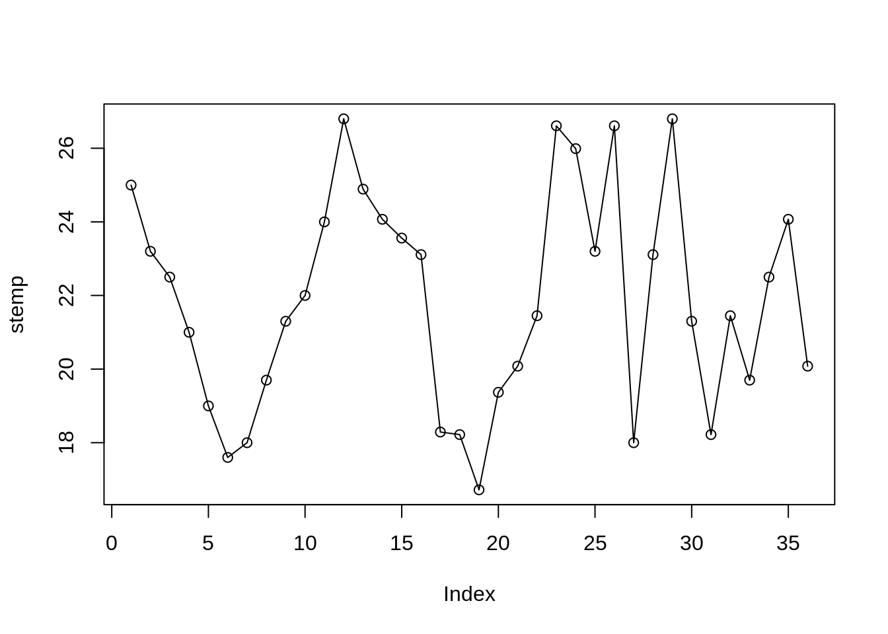

# Estrutura de dados {#estrutura-dados}


O R permite ler dados de uma variedade de fontes e formatos. Nesta unidade veremos como importar dados de arquivos texto, binários e de outros softwares para o R. Nesta seção vamos:

- ver como **importar dados no R**[^10] 
- conhecer os formatos mais comuns de dados reconhecidos pelo R
- ler arquivos de dados meteorológicos de fontes brasileiras

[^10]: Para uma descrição mais abrangente sobre importação e exportação de dados no R consulte a documentação de cada função e o manual [R Data Import/Export](http://cran.r-project.org/doc/manuals/r-release/R-data.html).

##  Visão geral

Existem diferentes formas de armazenar dados no R. Algumas vezes os dados precisam ser armazenados de forma mais complexa do que por exemplo vetores. 

O R possui uma variedade de estruturas (Figura \@ref(fig:fig-estrut-dados)). As mais utilizadas são:

- *dataframe* (tabela de dados)

- *matrix* (matriz)

- *list* (lista)

- *array* e *vector* (vetor)

<div class="figure">

<p class="caption">(\#fig:fig-estrut-dados)Principais estruturas de dados no R.</p>
</div>


## Vetor

Um vetor é uma coleção de elementos. Os vetores são amplamente usados e compõem a estrutura básica de dados do R, por ser uma linguagem vetorizada. 

Os vetores podem ser de dois tipos: **vetores atômicos** e **listas**. 

### Vetores atômicos 

Os **vetores atômicos** são constituem a estrutura de dados mais simples do R (como se fossem os átomos do R). Um vetor atômico é uma coleção de elementos, em que todos são do mesmo tipo de dado (todos `double`, ou `integer`, ou `logical`, etc). 

Como linguagem vetorizada, as operações são aplicadas a cada elemento do vetor automaticamente, sem a necessidade de laços (ou *loopings*) ao longo do vetor. Esse conceito pode ser estranho para quem vem de outras linguagens, mas é uma das grandes vantagens do R.

Vetores não tem dimensões, ou seja não existem é um vetor linha ou vetor coluna. 

#### Propriedades

+ `typeof()` para descobrir o tipo de dado

+ `length()` para descobrir o tamanho de um tipo de dado 

+ `attributes` (informações acionais específicas do dado), entre eles o atributo mais comum está o `names()`.

#### Criação

**Vetores atômicos** são geralmente criados com `c()`, abreviatura para o verbo **combinar ou concatenar**.


```r
# vetor numérico
vetor_num <- c(5, 2.5, 4.5)
# Note o sufixo L que distingue variaveis "double" de "integers"
vetor_int <- c(1L, 6L, 10L)
# Vetor logico
vetor_log <- c(TRUE, FALSE, TRUE, FALSE)
# Vetor de caracteres
vetor_char <- c("Analise de dados", "ambientais com o R")
```

Vetores atômicos podem ser criados a partir de outros vetores aninhados entre si pela função `c()`.


```r
v1 <- 1 # vetor com 1 elemento
v2 <- c(2) # vetor com 1 elemento
v3 <- c(4, 6) # vetor com 2 elemento
```

Formas diferentes para criação de vetor que resultam num mesmo vetor:


```r
(v_123 <- c(v1, v2, v3))
#> [1] 1 2 4 6
(v_123a <- c(1, c(v2, v3)))
#> [1] 1 2 4 6
(v_123b <- c(vetor_num, c(v1, v2), v3))
#> [1] 5.0 2.5 4.5 1.0 2.0 4.0 6.0
v <- c(1, 2, 4, 6)
v
#> [1] 1 2 4 6
```

#### Coerção de vetores


```r
c("a", 1)
#> [1] "a" "1"
as.numeric(c(FALSE, FALSE, TRUE))
#> [1] 0 0 1
```

Você pode manualmente forçar um tipo de vetor para outro usando funções de coerção: `as.character()`, `as.double()`,`as.integer()`, `as.logical()`. Coerção frequentemente acontece automaticamente, mas geralmente será mostrada uma mensagem quando ocorrer.

Vamos usar a coerção no seguinte caso. Imagine um vetor com valores de chuva mensal de um ano e outro vetor com os meses do ano. Note a diferença da forma como criamos o vetor `meses` e o vetor `months`. Como descobrir o número de meses sem chuva nesse ano?

```r
# vetor com nomes criados com 1 comando
meses <- c(
  jan = 1, fev = 2, mar = 3, abr = 4, mai = 5, jun = 6,
  jul = 7, ago = 8, set = 9, out = 10, nov = 11, dez = 12
)
meses
#> jan fev mar abr mai jun jul ago set out nov dez 
#>   1   2   3   4   5   6   7   8   9  10  11  12
# vetor definido e depois adiciona-se o nome das variáveis
months <- c(1, 2, 3, 4, 5, 6, 7, 8, 9, 10, 11, 12)
names(months) <- c("Jan", "Feb", "Mar", "Apr", "May", "Jun", "Jul", "Aug", "Sep", "Oct", "Nov", "Dec")
months
#> Jan Feb Mar Apr May Jun Jul Aug Sep Oct Nov Dec 
#>   1   2   3   4   5   6   7   8   9  10  11  12
# o atibuto mais comum de um vetor
attributes(meses)
#> $names
#>  [1] "jan" "fev" "mar" "abr" "mai" "jun" "jul" "ago" "set" "out" "nov"
#> [12] "dez"
length(meses)
#> [1] 12
# Vetor com dados de prec
chuva <- c(100, 0, 20, 140, 110, 50, 90, 0, 0, 10, 0, 6)
length(chuva)
#> [1] 12
# quando nao choveu?
seco <- chuva == 0
seco
#>  [1] FALSE  TRUE FALSE FALSE FALSE FALSE FALSE  TRUE  TRUE FALSE  TRUE
#> [12] FALSE
# coerção de lógico para numérico
seco01 <- as.numeric(seco)
# seco01 <- as.integer(seco)
seco01
#>  [1] 0 1 0 0 0 0 0 1 1 0 1 0
# total de meses secos no ano
sum(seco01)
#> [1] 4
# também funciona com vetores lógicos
sum(seco)
#> [1] 4
```

#### Nomeando vetores

Nós podemos nomear um vetor de 3 formas:

+ Durante a criação

+ Modificando um vetor

+ Criando um vetor modificado

Nomes devem ser únicos (sem repetições), porque para filtragem de elementos de um vetor ou a seleção de um subconjunto (razão pela qual usam-se os `names`) retornará somente o primeiro elemento que tiver nome repetido.

```r
# Durante a criação:
x <- c(a = 1, b = 2, c = 3)
x
#> a b c 
#> 1 2 3
# Modificando um vetor:
x <- 1:3
names(x) <- c("a", "b", "c")
x
#> a b c 
#> 1 2 3
# Criando um vetor modificado
x <- setNames(1:3, c("a", "b", "c"))
x
#> a b c 
#> 1 2 3
```

Nem todos elementos precisam ter nomes. Se os nomes são faltantes, `names()` retornará um string vazia ("") para aqueles elementos. Se todos forem faltantes, `names()` retornará `NULL`.

```r
y <- c(a = 1, 2, 3)
names(y)
#> [1] "a" ""  ""
z <- c(1, 2, 3)
names(z)
#> NULL
```

Podemos criar um vetor sem nomes usando a função `unname(x)`, ou remover `names` com `names(x) <- NULL`.


```r
a <- c(dia1 = 12, dia2 = 20, dia3 = 10)
a
#> dia1 dia2 dia3 
#>   12   20   10
names(a)
#> [1] "dia1" "dia2" "dia3"
a_sn <- unname(a)
a_sn
#> [1] 12 20 10
names(a_sn)
#> NULL
```


### Operações com vetores

Para multiplicar cada elemento de um vetor por um valor é usar o operador de multiplicação  (*). O mesmo procedimento se aplica as demais operações de soma, subtração, divisão, exponenciação e etc.

```r
x <- 1:10
x * 3
#>  [1]  3  6  9 12 15 18 21 24 27 30
x + 2
#>  [1]  3  4  5  6  7  8  9 10 11 12
x - 3
#>  [1] -2 -1  0  1  2  3  4  5  6  7
x / 4
#>  [1] 0.25 0.50 0.75 1.00 1.25 1.50 1.75 2.00 2.25 2.50
2 ^ (x / 4)
#>  [1] 1.189207 1.414214 1.681793 2.000000 2.378414 2.828427 3.363586
#>  [8] 4.000000 4.756828 5.656854
x ^ 2
#>  [1]   1   4   9  16  25  36  49  64  81 100
sqrt(x)
#>  [1] 1.000000 1.414214 1.732051 2.000000 2.236068 2.449490 2.645751
#>  [8] 2.828427 3.000000 3.162278
```

Operações vetoriais podem ser estendidas para mais de um vetor.


```r
# criando 2 vetores de mesmo tamanho
x <- 1:10
y <- -5:4
# somando-os
x + y
#>  [1] -4 -2  0  2  4  6  8 10 12 14
x - y
#>  [1] 6 6 6 6 6 6 6 6 6 6
x * y
#>  [1] -5 -8 -9 -8 -5  0  7 16 27 40
x / y
#>  [1] -0.2 -0.5 -1.0 -2.0 -5.0  Inf  7.0  4.0  3.0  2.5
x ^ y
#>  [1] 1.000000e+00 6.250000e-02 3.703704e-02 6.250000e-02 2.000000e-01
#>  [6] 1.000000e+00 7.000000e+00 6.400000e+01 7.290000e+02 1.000000e+04
2 ^ x
#>  [1]    2    4    8   16   32   64  128  256  512 1024
x %% y
#>  [1] -4 -2  0  0  0 NA  0  0  0  2
# tamanho dos vetores
length(x)
#> [1] 10
length(y)
#> [1] 10
length(x + y)
#> [1] 10
```

Uma peculiaridade do R é o tratamento de operações com vetores de tamanhos diferentes. O vetor menor é reciclado, de forma que seus elementos sejam repetidos em ordem até atingirem o tamanho do vetor mais longo envolvido na operação. 


```r
v1 <- c(3, 5, 88, 90)
v2 <- c(2, 1)
v1 + v2
#> [1]  5  6 90 91
```

Se o vetor mais longo não é múltiplo do mais curto, o R imprime um aviso.


```r
v1 <- c(3, 5, 88, 90)
v2 <- c(2, 1, 3)
v1 + v2
#> Warning in v1 + v2: longer object length is not a multiple of shorter
#> object length
#> [1]  5  6 91 92
```

A reciclagem é intrinsecamente usada em operações envolvendo vetores.


```r
v1
#> [1]  3  5 88 90
cte <- 4
v1 * cte
#> [1]  12  20 352 360
```

O número 4 nesse caso é reciclado 4 vezes e então multiplicado por cada elemento do vetor `v1`.
Avisos e erros:


```r
v1 <- c(3, 5, 88, 90)
srt(v1)
#> Error in srt(v1): could not find function "srt"
sqrt(-v1)
#> Warning in sqrt(-v1): NaNs produced
#> [1] NaN NaN NaN NaN
```

Comparações também funcionam com vetores.


```r
x <= 5
#>  [1]  TRUE  TRUE  TRUE  TRUE  TRUE FALSE FALSE FALSE FALSE FALSE
x > y
#>  [1] TRUE TRUE TRUE TRUE TRUE TRUE TRUE TRUE TRUE TRUE
x < y
#>  [1] FALSE FALSE FALSE FALSE FALSE FALSE FALSE FALSE FALSE FALSE
```


Entre os operadores lógicos vistos (Tabela \@ref(tab:oper-logic)) alguns deles não foram aplicados em exemplos. Vamos então usar o operador `%in%` para verificar se um vetor está contido parcial ou totalmente em outro vetor.


```r
# operador está contido em
2:4 %in% x
#> [1] TRUE TRUE TRUE
# 2:4 são elementos de x?
is.element(2:4, x)
#> [1] TRUE TRUE TRUE
```

A função `nchar()` também funciona sobre cada elemento do vetor. Esse é mais um exemplo de função vetorizada do R.


```r
nchar(month.name)
#>  [1] 7 8 5 5 3 4 4 6 9 7 8 8
nchar(y)
#>  [1] 2 2 2 2 2 1 1 1 1 1
```

#### Operadores `any` e `all`


```r
vetor <- c(0, 1, -1, -2, 3, 5, -5)
all(vetor < 0) # todas as posições são maiores que 0 ?
#> [1] FALSE
any(vetor > 0) # alguma posição é maior que 0?
#> [1] TRUE
```

Ambas as funções sintetizam a informação:

- `all()` verifica se a condição avaliada é válida para todos elementos do vetor;
- `any()` verifica se a condição avaliada é válida para pelo menos um dos elementos do vetor;

As funções fornecem um único valor (vetor lógico de tamanho 1) para resumir ou descrever o resultado da condição aplicada ao vetor.


### Sequências 

Vimos nas seções anteriores que é muito simples criar sequências de números inteiros com o operador `:`.  Nesta seção veremos outras formas de gerar sequências, como uma sequência de números não inteiros e sequências de números repetidos. 

#### Sequências de números inteiros

Sequências de números formam um vetor. Há diversas formas de se gerar sequências no R. Para gerar uma sequência de 1 até 365, em vez de escrevermos cada número e combiná-los usando `c(1,2,3,...,365)`, podemos usar o operador `:` da seguinte forma:
 

```r
# dias do ano
dda <- 1:365
dda
#>   [1]   1   2   3   4   5   6   7   8   9  10  11  12  13  14  15  16  17
#>  [18]  18  19  20  21  22  23  24  25  26  27  28  29  30  31  32  33  34
#>  [35]  35  36  37  38  39  40  41  42  43  44  45  46  47  48  49  50  51
#>  [52]  52  53  54  55  56  57  58  59  60  61  62  63  64  65  66  67  68
#>  [69]  69  70  71  72  73  74  75  76  77  78  79  80  81  82  83  84  85
#>  [86]  86  87  88  89  90  91  92  93  94  95  96  97  98  99 100 101 102
#> [103] 103 104 105 106 107 108 109 110 111 112 113 114 115 116 117 118 119
#> [120] 120 121 122 123 124 125 126 127 128 129 130 131 132 133 134 135 136
#> [137] 137 138 139 140 141 142 143 144 145 146 147 148 149 150 151 152 153
#> [154] 154 155 156 157 158 159 160 161 162 163 164 165 166 167 168 169 170
#> [171] 171 172 173 174 175 176 177 178 179 180 181 182 183 184 185 186 187
#> [188] 188 189 190 191 192 193 194 195 196 197 198 199 200 201 202 203 204
#> [205] 205 206 207 208 209 210 211 212 213 214 215 216 217 218 219 220 221
#> [222] 222 223 224 225 226 227 228 229 230 231 232 233 234 235 236 237 238
#> [239] 239 240 241 242 243 244 245 246 247 248 249 250 251 252 253 254 255
#> [256] 256 257 258 259 260 261 262 263 264 265 266 267 268 269 270 271 272
#> [273] 273 274 275 276 277 278 279 280 281 282 283 284 285 286 287 288 289
#> [290] 290 291 292 293 294 295 296 297 298 299 300 301 302 303 304 305 306
#> [307] 307 308 309 310 311 312 313 314 315 316 317 318 319 320 321 322 323
#> [324] 324 325 326 327 328 329 330 331 332 333 334 335 336 337 338 339 340
#> [341] 341 342 343 344 345 346 347 348 349 350 351 352 353 354 355 356 357
#> [358] 358 359 360 361 362 363 364 365
# sequencia de anos
anos <- 1961:1990
anos
#>  [1] 1961 1962 1963 1964 1965 1966 1967 1968 1969 1970 1971 1972 1973 1974
#> [15] 1975 1976 1977 1978 1979 1980 1981 1982 1983 1984 1985 1986 1987 1988
#> [29] 1989 1990
# sequencia de inteiros decrescente
si_dec <- 10:-10
si_dec
#>  [1]  10   9   8   7   6   5   4   3   2   1   0  -1  -2  -3  -4  -5  -6
#> [18]  -7  -8  -9 -10
# sequencia de numeros não inteiros
seqn <- 1.5:10
seqn
#> [1] 1.5 2.5 3.5 4.5 5.5 6.5 7.5 8.5 9.5
c(seqn, 10)
#>  [1]  1.5  2.5  3.5  4.5  5.5  6.5  7.5  8.5  9.5 10.0
```

#### Sequências de números não inteiros

Mas para gerar uma sequencia de números não inteiros há uma função específica para tal tarefa.

```r
# igual a c(snum, 10), mas usando o seq
(snum_b <- seq(from = 1.5, to = 10, by = 0.5))
#>  [1]  1.5  2.0  2.5  3.0  3.5  4.0  4.5  5.0  5.5  6.0  6.5  7.0  7.5  8.0
#> [15]  8.5  9.0  9.5 10.0
```

Exemplos de sequência de anos, meses e dias.

```r
# vetor com de anos decimais (2 valores por dia)
anos_dec <- seq(2010, 2011, length.out = 365 * 2)
# para ver só o início do vetor ao invés de todo o vetor
head(anos_dec)
#> [1] 2010.000 2010.001 2010.003 2010.004 2010.005 2010.007
# mas não dá pra ver a parte decimal, vamos alterar as opções
# aumentando as casas decimais
options(digits = 6)
# verifique agora
head(anos_dec)
#> [1] 2010.00 2010.00 2010.00 2010.00 2010.01 2010.01
# só os primeiros 30 elementos
head(anos_dec, 30)
#>  [1] 2010.00 2010.00 2010.00 2010.00 2010.01 2010.01 2010.01 2010.01
#>  [9] 2010.01 2010.01 2010.01 2010.02 2010.02 2010.02 2010.02 2010.02
#> [17] 2010.02 2010.02 2010.02 2010.03 2010.03 2010.03 2010.03 2010.03
#> [25] 2010.03 2010.03 2010.04 2010.04 2010.04 2010.04
# para ver só o final do vetor yrFrac
tail(anos_dec)
#> [1] 2010.99 2010.99 2011.00 2011.00 2011.00 2011.00
# para ver só os último 50 elementos do yrFrac
tail(anos_dec, 50)
#>  [1] 2010.93 2010.93 2010.94 2010.94 2010.94 2010.94 2010.94 2010.94
#>  [9] 2010.94 2010.95 2010.95 2010.95 2010.95 2010.95 2010.95 2010.95
#> [17] 2010.95 2010.96 2010.96 2010.96 2010.96 2010.96 2010.96 2010.96
#> [25] 2010.97 2010.97 2010.97 2010.97 2010.97 2010.97 2010.97 2010.98
#> [33] 2010.98 2010.98 2010.98 2010.98 2010.98 2010.98 2010.98 2010.99
#> [41] 2010.99 2010.99 2010.99 2010.99 2010.99 2010.99 2011.00 2011.00
#> [49] 2011.00 2011.00
# pentadas
pent <- seq(from = 1, to = 365, by = 5)
# dencendios
decd <- seq(from = 1, to = 365, by = 10)
# fracoes de dia
frac_d30mn <- seq(0, 365, length.out = 365 * 48) + 1
head(frac_d30mn, 48 * 2)
#>  [1] 1.00000 1.02083 1.04167 1.06250 1.08334 1.10417 1.12501 1.14584
#>  [9] 1.16668 1.18751 1.20835 1.22918 1.25001 1.27085 1.29168 1.31252
#> [17] 1.33335 1.35419 1.37502 1.39586 1.41669 1.43752 1.45836 1.47919
#> [25] 1.50003 1.52086 1.54170 1.56253 1.58337 1.60420 1.62504 1.64587
#> [33] 1.66670 1.68754 1.70837 1.72921 1.75004 1.77088 1.79171 1.81255
#> [41] 1.83338 1.85422 1.87505 1.89588 1.91672 1.93755 1.95839 1.97922
#> [49] 2.00006 2.02089 2.04173 2.06256 2.08340 2.10423 2.12506 2.14590
#> [57] 2.16673 2.18757 2.20840 2.22924 2.25007 2.27091 2.29174 2.31257
#> [65] 2.33341 2.35424 2.37508 2.39591 2.41675 2.43758 2.45842 2.47925
#> [73] 2.50009 2.52092 2.54175 2.56259 2.58342 2.60426 2.62509 2.64593
#> [81] 2.66676 2.68760 2.70843 2.72927 2.75010 2.77093 2.79177 2.81260
#> [89] 2.83344 2.85427 2.87511 2.89594 2.91678 2.93761 2.95845 2.97928
tail(frac_d30mn, 48 * 2)
#>  [1] 364.021 364.042 364.062 364.083 364.104 364.125 364.146 364.167
#>  [9] 364.187 364.208 364.229 364.250 364.271 364.292 364.312 364.333
#> [17] 364.354 364.375 364.396 364.417 364.437 364.458 364.479 364.500
#> [25] 364.521 364.542 364.562 364.583 364.604 364.625 364.646 364.667
#> [33] 364.687 364.708 364.729 364.750 364.771 364.792 364.812 364.833
#> [41] 364.854 364.875 364.896 364.917 364.937 364.958 364.979 365.000
#> [49] 365.021 365.042 365.062 365.083 365.104 365.125 365.146 365.167
#> [57] 365.187 365.208 365.229 365.250 365.271 365.292 365.312 365.333
#> [65] 365.354 365.375 365.396 365.417 365.437 365.458 365.479 365.500
#> [73] 365.521 365.542 365.562 365.583 365.604 365.625 365.646 365.667
#> [81] 365.687 365.708 365.729 365.750 365.771 365.792 365.812 365.833
#> [89] 365.854 365.875 365.896 365.917 365.937 365.958 365.979 366.000
# diferentes funções para gerar uma sequência
an <- c(1, 7, 2, 5, 3, 2)
# gerando uma sequencia a partir de um número
seq_len(length.out = 6)
#> [1] 1 2 3 4 5 6
# gerando uma sequência a partir de um número
seq(6)
#> [1] 1 2 3 4 5 6
# de acordo com o tamanho do vetor gera-se uma sequencia
seq(along = an)
#> [1] 1 2 3 4 5 6
seq(along = 0) # ! melhor opção para gerar sequencias do tamanho do vetor
#> [1] 1
seq(0) # ! cuidado, veja ?seq para entender a razão desse resultado inusitado
#> [1] 1 0
# conflito entre parâmetros
# a <-seq(from = -5, to = 5, by = 0.05, length.out=200)
s5by <- seq(from = -5, to = 5, by = 0.05)
length(s5by)
#> [1] 201
tail(s5by)
#> [1] 4.75 4.80 4.85 4.90 4.95 5.00
s5len <- seq(from = -5, to = 5, length.out = 200)
length(s5len)
#> [1] 200
tail(s5len)
#> [1] 4.74874 4.79899 4.84925 4.89950 4.94975 5.00000
```

#### Sequências de números repetidos


```r
rep_t4 <- rep(1:2, times = 4)
rep_t4
#> [1] 1 2 1 2 1 2 1 2
rep_e31 <- rep(1:12, each = 31)
rep_e31
#>   [1]  1  1  1  1  1  1  1  1  1  1  1  1  1  1  1  1  1  1  1  1  1  1  1
#>  [24]  1  1  1  1  1  1  1  1  2  2  2  2  2  2  2  2  2  2  2  2  2  2  2
#>  [47]  2  2  2  2  2  2  2  2  2  2  2  2  2  2  2  2  3  3  3  3  3  3  3
#>  [70]  3  3  3  3  3  3  3  3  3  3  3  3  3  3  3  3  3  3  3  3  3  3  3
#>  [93]  3  4  4  4  4  4  4  4  4  4  4  4  4  4  4  4  4  4  4  4  4  4  4
#> [116]  4  4  4  4  4  4  4  4  4  5  5  5  5  5  5  5  5  5  5  5  5  5  5
#> [139]  5  5  5  5  5  5  5  5  5  5  5  5  5  5  5  5  5  6  6  6  6  6  6
#> [162]  6  6  6  6  6  6  6  6  6  6  6  6  6  6  6  6  6  6  6  6  6  6  6
#> [185]  6  6  7  7  7  7  7  7  7  7  7  7  7  7  7  7  7  7  7  7  7  7  7
#> [208]  7  7  7  7  7  7  7  7  7  7  8  8  8  8  8  8  8  8  8  8  8  8  8
#> [231]  8  8  8  8  8  8  8  8  8  8  8  8  8  8  8  8  8  8  9  9  9  9  9
#> [254]  9  9  9  9  9  9  9  9  9  9  9  9  9  9  9  9  9  9  9  9  9  9  9
#> [277]  9  9  9 10 10 10 10 10 10 10 10 10 10 10 10 10 10 10 10 10 10 10 10
#> [300] 10 10 10 10 10 10 10 10 10 10 10 11 11 11 11 11 11 11 11 11 11 11 11
#> [323] 11 11 11 11 11 11 11 11 11 11 11 11 11 11 11 11 11 11 11 12 12 12 12
#> [346] 12 12 12 12 12 12 12 12 12 12 12 12 12 12 12 12 12 12 12 12 12 12 12
#> [369] 12 12 12 12
rep_t13 <- rep(c("chuva", "sol"), times = c(1, 3))
rep_t13
#> [1] "chuva" "sol"   "sol"   "sol"
rep_t13_t4 <- rep(rep(c("chuva", "sol"), times = c(1, 3)), times = 4)
rep_t13_t4
#>  [1] "chuva" "sol"   "sol"   "sol"   "chuva" "sol"   "sol"   "sol"  
#>  [9] "chuva" "sol"   "sol"   "sol"   "chuva" "sol"   "sol"   "sol"
```


### Indexação de vetores {#index-vetores}

Os elementos de um vetor são indexados e para acessá-los usamos a notação de índices do R. 

Podemos selecionar partes de um vetor por números (posição do elemento), caracteres (nome) e vetores lógicos. 

Através do operador `[` podemos acessar ou filtrar elementos de um vetor. O operador colchete `[` aplicado a um vetor retornará um vetor.

Considere os seguintes vetores como exemplo:


```r
# vetor de chuva mensal para um dado ano
prec <- c(300, 150, 210, 12, 0, 0, 12, 22, 80, 100, 0, 280)
meses <- c("Jan", "Fev", "Mar", "Abr", "Mai", "Jun", "Jul", "Ago", "Set", "Out", "Nov", "Dez")
names(prec) <- meses
prec
#> Jan Fev Mar Abr Mai Jun Jul Ago Set Out Nov Dez 
#> 300 150 210  12   0   0  12  22  80 100   0 280
# gráfico de barras
barplot(prec)
box()
```


```r
# temperatura do ar média mensal para um dado ano
temp <- c(25, 23.2, 22.5, 21, 19, 17.6, 18, 19.7, 21.3, 22, 24, 26.8)
names(temp) <- meses
temp
#>  Jan  Fev  Mar  Abr  Mai  Jun  Jul  Ago  Set  Out  Nov  Dez 
#> 25.0 23.2 22.5 21.0 19.0 17.6 18.0 19.7 21.3 22.0 24.0 26.8
plot(temp, type = "o")
```


Como selecionar o valor de chuva e temperatura só para janeiro?

Usando a seguinte sintaxe: 

`vetor[i]`

onde `i` representa os elementos a serem selecionados.

#### Indexação por vetores inteiros

##### Positivos

Para selecionar o valor de chuva e temperatura só para janeiro, digitamos:


```r
prec_jan <- prec[1]
prec_jan
#> Jan 
#> 300
temp_jan <- temp[1]
temp_jan
#> Jan 
#>  25
```

Como selecionar os últimos valores dos vetores de chuva e temperatura?


```r
# vetor de temperatura do ar média mensal de um ano qualquer
temp_dez <- temp[length(temp)]
temp_dez
#>  Dez 
#> 26.8
prec_dez <- prec[length(prec)]
prec_dez
#> Dez 
#> 280
```

Como selecionar os valores de chuva do trimestre JJA e de temperatura para o trimestre DJF?


```r
sel_prec <- c(6, 7, 8)
# vetor de chuva JJA
prec_jja <- prec[sel_prec]
prec_jja
#> Jun Jul Ago 
#>   0  12  22
# total de chuva trimestral nesse ano
prect_jja_tot <- sum(prec_jja)
prect_jja_tot
#> [1] 34
# vetor de temperatura DJF
sel_temp <- c(12, 1, 2)
temp_djf <- temp[sel_temp]
temp_djf
#>  Dez  Jan  Fev 
#> 26.8 25.0 23.2
# temp média trimestral nesse ano
temp_djf_med <- mean(temp_djf)
temp_djf_med
#> [1] 25
```

##### Negativos

Como selecionar todos valores menos o primeiro e o último?


```r
# exceto o primeiro e ultimo
prec[-c(1, length(prec))]
#> Fev Mar Abr Mai Jun Jul Ago Set Out Nov 
#> 150 210  12   0   0  12  22  80 100   0
# exceto os 3 primeiros meses
temp[-c(1:3)]
#>  Abr  Mai  Jun  Jul  Ago  Set  Out  Nov  Dez 
#> 21.0 19.0 17.6 18.0 19.7 21.3 22.0 24.0 26.8
# exceto os 3 últimos meses
temp[-c(length(temp):(length(temp) - 2))]
#>  Jan  Fev  Mar  Abr  Mai  Jun  Jul  Ago  Set 
#> 25.0 23.2 22.5 21.0 19.0 17.6 18.0 19.7 21.3
```

####  Indexação por nomes


```r
prec["Jan"]
#> Jan 
#> 300
prec[c("Dez", "Fev", "Jun")]
#> Dez Fev Jun 
#> 280 150   0
```

#### Indexação por vetores lógicos

Vamos criar um vetor lógico e usá-lo para exemplificar a seleção lógica de elementos de um vetor. 


```r
vetor_l <- c(
  TRUE, FALSE, FALSE, TRUE,
  TRUE, FALSE, TRUE, FALSE,
  TRUE, FALSE, FALSE, TRUE
)
meses[vetor_l]
#> [1] "Jan" "Abr" "Mai" "Jul" "Set" "Dez"
```

Os elementos de `vetor_l` correspondentes a `TRUE` foram selecionados. Aplicando-se a função `sum()` a um vetor lógico obtemos o total de elementos verdadeiros:


```r
sum(vetor_l)
#> [1] 6
```

Vamos considerar agora a seguinte forma do vetor lógico (`vetor_l`) e relembrar da **coerção** de vetores.


```r
# vetor lógico
vetor_l <- c(TRUE, FALSE)
meses[vetor_l]
#> [1] "Jan" "Mar" "Mai" "Jul" "Set" "Nov"
vetor_l <- c(TRUE, FALSE, FALSE)
meses[vetor_l]
#> [1] "Jan" "Abr" "Jul" "Out"
prec[c(TRUE, FALSE)]
#> Jan Mar Mai Jul Set Nov 
#> 300 210   0  12  80   0
temp[c(rep(FALSE, 3), TRUE)]
#>  Abr  Ago  Dez 
#> 21.0 19.7 26.8
```

A indexação pode ser feita também por comparações:


```r
# vetor prec
prec
#> Jan Fev Mar Abr Mai Jun Jul Ago Set Out Nov Dez 
#> 300 150 210  12   0   0  12  22  80 100   0 280
# teste para chuva > 80 mm/mês
prec > 80
#>   Jan   Fev   Mar   Abr   Mai   Jun   Jul   Ago   Set   Out   Nov   Dez 
#>  TRUE  TRUE  TRUE FALSE FALSE FALSE FALSE FALSE FALSE  TRUE FALSE  TRUE
# salvando resultado do teste
above80 <- prec > 80
# extraindo valores atendidos ao teste
prec[above80]
#> Jan Fev Mar Out Dez 
#> 300 150 210 100 280
# teste para meses com chuva abaixo da média mensal
(prec_med <- mean(prec))
#> [1] 97.1667
# salvando resultado do teste
(below_avg <- prec < prec_med)
#>   Jan   Fev   Mar   Abr   Mai   Jun   Jul   Ago   Set   Out   Nov   Dez 
#> FALSE FALSE FALSE  TRUE  TRUE  TRUE  TRUE  TRUE  TRUE FALSE  TRUE FALSE
# extraindo valores que atendem a condição
prec[below_avg]
#> Abr Mai Jun Jul Ago Set Nov 
#>  12   0   0  12  22  80   0
# extraindo os 3 primeiros meses com prec abaixo da média
prec[below_avg][1:3]
#> Abr Mai Jun 
#>  12   0   0
# forma equivalente em uma linha só
prec[prec < mean(prec)][1:3]
#> Abr Mai Jun 
#>  12   0   0
# teste para meses com prec diferente de zero
prec[prec != 0]
#> Jan Fev Mar Abr Jul Ago Set Out Dez 
#> 300 150 210  12  12  22  80 100 280
```


####  Indexação com múltiplas condições

Nos exemplo acima vimos como buscar os os elementos de um vetor para apenas uma condição. Entretanto frequentemente precisamos testar mais condições. Por exemplo, para condições do tipo:

- $0.5 < prec \leq 100$ 
- $temp < 5$  ou $temp \geq 25$ 

precisamos usar os operadores relacionais:

- `&` e `&&` (\"e"\)

- `|` e `||` (\"ou"\)

A ordem das operações pode ser controladas por parênteses. Os operadores `&` e `|` são vetorizados (retornam vetores de mesmo tamanho que os vetores testados). 

As diferenças entre os operadores são mostradas nos exemplos a seguir.


```r
# prec
prec
#> Jan Fev Mar Abr Mai Jun Jul Ago Set Out Nov Dez 
#> 300 150 210  12   0   0  12  22  80 100   0 280
# combinação de operador lógico e relacional
below100 <- prec > 0 & prec <= 100
prec_cond1 <- prec[below100]
prec_cond1
#> Abr Jul Ago Set Out 
#>  12  12  22  80 100
```

A forma dupla (`&&` ou `||`) compara somente um elemento de cada lado, enquanto a forma normal (`&` e `|`), compara cada elemento dos vetores em cada lado.


```r
a <- c(1, 1, 0, 1)
b <- c(2, 1, 0, 1)
# forma normal verifica cada elemento de a e cada elemento de b
a == 1 & b == 1
#> [1] FALSE  TRUE FALSE  TRUE
# forma dupla verifica somente o primeiro elemento de a e o primeiro elemento de b
# retornando somente um resultado
a == 1 && b == 1
#> [1] FALSE
```


------------------------------------------------------------
 a   b   a==1    b==1    a == 1 & b == 1   a == 1 && b == 1 
--- --- ------- ------- ----------------- ------------------
 1   2   TRUE    FALSE        FALSE             FALSE       

 1   1   TRUE    TRUE         TRUE                          

 0   0   FALSE   FALSE        FALSE                         

 1   1   TRUE    TRUE         TRUE                          
------------------------------------------------------------

Table: Demostração da diferença entre & e &&.

Podem haver mais que duas condições a serem testadas. As condições podem ser combinadas usando múltiplos `&` ou `|`. As diferentes condições podem ser agrupadas por parênteses assim como operações matemáticas. Sem parênteses, a ordem das operações é semelhante a das operações matemáticas:

- **PEMDAS**: Parênteses > Expoentes > Multiplicação > Divisão > Adição e Subtração 

Onde `&`é equivalente à **multiplicação** e `|` é equivalente à **adição**, logo **e** tem precedência sobre **ou**.


```r
# vetor de horas
horas <- 0:23
# vetor de temperaturas horárias
tar_hor <- c(
  19.9, 19.8, 19.5, 19.4, 19.4, 19.3,
  19.2, 19, 19.2, 19.5, 20.1, 20.6, 20.9,
  21.8, 22.5, 22.6, 22.5, 22, 21.4, 20.1,
  20, 19.8, 19.6, 19.4
)
# gráfico do varição horária da temperatura do ar
plot(horas, tar_hor, type = "o", pch = 20)
# temperaturas noturnas abaixo de 20ºC
(night_below20 <- (horas < 6 | horas > 18) & tar_hor < 20)
#>  [1]  TRUE  TRUE  TRUE  TRUE  TRUE  TRUE FALSE FALSE FALSE FALSE FALSE
#> [12] FALSE FALSE FALSE FALSE FALSE FALSE FALSE FALSE FALSE FALSE  TRUE
#> [23]  TRUE  TRUE
tar_hor[night_below20]
#> [1] 19.9 19.8 19.5 19.4 19.4 19.3 19.8 19.6 19.4
# destacando no gráfico
points(
  x = horas[night_below20],
  y = tar_hor[night_below20],
  pch = 20, # tipo de símbolo para os ponts
  col = "blue", # cor do símbolo
  cex = 2
) # tamanho do ponto
# temperaturas abaixo de 20ºC que não ocorreram a noite
day_below20 <- tar_hor < 20 & !night_below20
points(horas[day_below20], tar_hor[day_below20], pch = 20, col = "red", cex = 2)
# adicionando linha horizontal ao longo da temperatura = 20ºC
abline(h = 20, col = "gray")
```


Vimos que a filtragem consiste em extrair elementos de um vetor que satisfaça uma (ou várias) condição(ões). Entretanto, em alguns casos, o interesse é na posição dentro do vetor na qual a condição é verdadeira Nós podemos localizar essas ocorrências usando a função `which()`:


```r
# prec sem nomes
names(prec) <- NULL
# combinação de operador lógico e relacional
below100
#>   Jan   Fev   Mar   Abr   Mai   Jun   Jul   Ago   Set   Out   Nov   Dez 
#> FALSE FALSE FALSE  TRUE FALSE FALSE  TRUE  TRUE  TRUE  TRUE FALSE FALSE
which(below100)
#> Abr Jul Ago Set Out 
#>   4   7   8   9  10
# qual os meses em que a chuva foi acima da media
which(prec > prec_med)
#> [1]  1  2  3 10 12
prec[which(prec > prec_med)]
#> [1] 300 150 210 100 280
# Qual a temp quando a chuva ou a temp foi acima da media?
sel <- which(prec > prec_med | !temp < mean(temp))
sel
#> Jan Fev Mar Out Nov Dez 
#>   1   2   3  10  11  12
prec[sel]
#> [1] 300 150 210 100   0 280
# quais posições do vetor prec não choveu
which(prec == 0)
#> [1]  5  6 11
# quando ocorreu a prec max
which(prec == max(prec))
#> [1] 1
# equivalente a ...
which.max(prec)
#> [1] 1
# seleciona só a primeira ocorrência!
which.min(prec)
#> [1] 5
prec
#>  [1] 300 150 210  12   0   0  12  22  80 100   0 280
```

Um outro operador útil para comparação entre vetores é o operador `%in%`, que pode ser interpretado como \"está contido em\". O **resultado é um vetor de mesmo tamanho que o vetor à esquerda do teste**. 


```r
# compare o tamanho dos vetores resultantes
which(meses %in% c("JAN", "Feb", "Mar"))
#> [1] 3
# note a diferença
which(c("JAN", "Feb", "Mar") %in% meses)
#> [1] 3
cond <- names(temp) %in% c("Jun", "Jul", "Ago")
quais <- which(cond)
quais
#> [1] 6 7 8
prec[cond]
#> [1]  0 12 22
prec[quais]
#> [1]  0 12 22
```

### Substituição de elementos de um vetor


```r
# posição a ser alterada
pos <- 10
# valor da temperatura naquela posição
old_temp <- temp[pos]
old_temp
#> Out 
#>  22
# vetor de temperatura
temp
#>  Jan  Fev  Mar  Abr  Mai  Jun  Jul  Ago  Set  Out  Nov  Dez 
#> 25.0 23.2 22.5 21.0 19.0 17.6 18.0 19.7 21.3 22.0 24.0 26.8
# substituição do valor original por um novo valor
new_temp <- 30
# alterando temperatura do mês de outubro
temp[pos] <- new_temp
temp
#>  Jan  Fev  Mar  Abr  Mai  Jun  Jul  Ago  Set  Out  Nov  Dez 
#> 25.0 23.2 22.5 21.0 19.0 17.6 18.0 19.7 21.3 30.0 24.0 26.8
```
  
A substituição também pode ser feita também pelo nome das variáveis.


```r
prec
#>  [1] 300 150 210  12   0   0  12  22  80 100   0 280
prec["Mai"] <- 5
temp
#>  Jan  Fev  Mar  Abr  Mai  Jun  Jul  Ago  Set  Out  Nov  Dez 
#> 25.0 23.2 22.5 21.0 19.0 17.6 18.0 19.7 21.3 30.0 24.0 26.8
temp[c("Mai", "Jul")] <- temp[c("Mai", "Jul")] + 2
temp
#>  Jan  Fev  Mar  Abr  Mai  Jun  Jul  Ago  Set  Out  Nov  Dez 
#> 25.0 23.2 22.5 21.0 21.0 17.6 20.0 19.7 21.3 30.0 24.0 26.8
```

### Criação de vetores com `vector`

Outra forma de se criar vetores é através da função `vector()`.


```r
# criação de vetor v
v <- 3
v
#> [1] 3
# adicionando elementos
v[2] <- 100
v
#> [1]   3 100
v[5] <- 6
v
#> [1]   3 100  NA  NA   6
# adicionando elementos de vetores
x <- c(88, 5, 12, 13)
x <- c(x[1:3], 168, x[4]) # insere 168 antes do 13
x
#> [1]  88   5  12 168  13
# outra opção
k <- vector()
class(k)
#> [1] "logical"
# vetor k existe?
ls()
#>  [1] "a"             "a_sn"          "above80"       "an"           
#>  [5] "anos"          "anos_dec"      "b"             "below_avg"    
#>  [9] "below100"      "chuva"         "cond"          "cte"          
#> [13] "day_below20"   "dda"           "decd"          "desc"         
#> [17] "frac_d30mn"    "horas"         "k"             "meses"        
#> [21] "months"        "new_temp"      "night_below20" "old_temp"     
#> [25] "oper"          "pcks"          "pent"          "pos"          
#> [29] "prec"          "prec_cond1"    "prec_dez"      "prec_jan"     
#> [33] "prec_jja"      "prec_med"      "prect_jja_tot" "quais"        
#> [37] "rblue"         "rep_e31"       "rep_t13"       "rep_t13_t4"   
#> [41] "rep_t4"        "s5by"          "s5len"         "seco"         
#> [45] "seco01"        "sel"           "sel_prec"      "sel_temp"     
#> [49] "seqn"          "si_dec"        "snum_b"        "tar_hor"      
#> [53] "temp"          "temp_dez"      "temp_djf"      "temp_djf_med" 
#> [57] "temp_jan"      "v"             "v_123"         "v_123a"       
#> [61] "v_123b"        "v1"            "v2"            "v3"           
#> [65] "vetor"         "vetor_char"    "vetor_int"     "vetor_l"      
#> [69] "vetor_log"     "vetor_num"     "x"             "y"            
#> [73] "z"
# alocando o valor 45 no 3º elemento de k
k[3] <- 45
k
#> [1] NA NA 45
class(k)
#> [1] "numeric"
# diminuindo o tamanho de k
length(k)
#> [1] 3
length(k) <- 2
k
#> [1] NA NA
length(k) <- 0
k
#> numeric(0)
class(k)
#> [1] "numeric"
is.null(k)
#> [1] FALSE
# exemplo
temp <- c(25, 23.2, 22.5, 21, 19, 17.6, 18, 19.7, 21.3, 22, 24, 26.8)
temp_orig <- temp
# mostrando o vetor temp
temp
#>  [1] 25.0 23.2 22.5 21.0 19.0 17.6 18.0 19.7 21.3 22.0 24.0 26.8
temp[]
#>  [1] 25.0 23.2 22.5 21.0 19.0 17.6 18.0 19.7 21.3 22.0 24.0 26.8
# substituir todos elementos do vetor temp por um vetor com apenas um valor
temp <- 0
temp
#> [1] 0
# vamos redefinir temp e comparar o anterior com o obtido com o próximo comando
temp <- temp_orig
temp[1:length(temp)] <- 0
temp
#>  [1] 0 0 0 0 0 0 0 0 0 0 0 0
# qual diferença de x <- 0 e x[] <-0 ?
temp <- temp_orig
temp[] <- 0
temp
#>  [1] 0 0 0 0 0 0 0 0 0 0 0 0
# Um vetor com tamanho pre-definido e do tipo numeric
umvetor <- vector(mode = "numeric", length = 100)
umvetor
#>   [1] 0 0 0 0 0 0 0 0 0 0 0 0 0 0 0 0 0 0 0 0 0 0 0 0 0 0 0 0 0 0 0 0 0 0 0
#>  [36] 0 0 0 0 0 0 0 0 0 0 0 0 0 0 0 0 0 0 0 0 0 0 0 0 0 0 0 0 0 0 0 0 0 0 0
#>  [71] 0 0 0 0 0 0 0 0 0 0 0 0 0 0 0 0 0 0 0 0 0 0 0 0 0 0 0 0 0 0
# populando o vetor
umvetor[1] <- 10
umvetor[10] <- 100
umvetor
#>   [1]  10   0   0   0   0   0   0   0   0 100   0   0   0   0   0   0   0
#>  [18]   0   0   0   0   0   0   0   0   0   0   0   0   0   0   0   0   0
#>  [35]   0   0   0   0   0   0   0   0   0   0   0   0   0   0   0   0   0
#>  [52]   0   0   0   0   0   0   0   0   0   0   0   0   0   0   0   0   0
#>  [69]   0   0   0   0   0   0   0   0   0   0   0   0   0   0   0   0   0
#>  [86]   0   0   0   0   0   0   0   0   0   0   0   0   0   0   0
```

### Vetores nulos e elementos faltantes

Seja qual for a razão, ao realizar um experimento em condições reais sempre haverá situações em que não conhecemos o valor de uma determinada variável. Por exemplo, a série de uma variável meteorológica medida em estação de superfície, sempre ocorrem datas em que não há registro da variável. Falha instrumental, dado não coletado pelo observador, falta de energia, são causas inerentes de falhas em séries climáticas de longo prazo. 
No R dados faltantes são representados pela string `NA`.


```r
v1 <- c(1:8, NA)
v1 > 5 # NA sai na resposta
#> [1] FALSE FALSE FALSE FALSE FALSE  TRUE  TRUE  TRUE    NA
# teste lógico com o operador idêntico "=="
v1 == NA
#> [1] NA NA NA NA NA NA NA NA NA
# não funcionou, porque há funções específicas para vetores com NA
onde_falta <- is.na(v1)
# função apropriada p/ checar se tem NAs
faltante <- which(is.na(v1))
v1[-faltante]
#> [1] 1 2 3 4 5 6 7 8
# ou
v1[!onde_falta]
#> [1] 1 2 3 4 5 6 7 8
# vamos calcular a média de v1
sum(v1) / length(v1)
#> [1] NA
# vamos remover valores NA
sum(v1[-faltante]) / length(v1[-faltante])
#> [1] 4.5
sum(v1[!onde_falta]) / length(v1[!onde_falta])
#> [1] 4.5
# mas o R possui a função mean
mean(v1)
#> [1] NA
# não retornou o que desejamos, removendo as posicoes dos dados faltantes
mean(v1[-faltante])
#> [1] 4.5
# ok, mas olhando o help ...
# ?mean
mean(v1, na.rm = TRUE)
#> [1] 4.5
# definir como faltante todos elementos de v1
v1[] <- NA
v1
#> [1] NA NA NA NA NA NA NA NA NA
length(v1)
#> [1] 9
# vetor com dados faltantes indicados por -999
# substituir onde é -999 por NA
x <- c(-999, 10, 15, -999, 50)
x == -999
#> [1]  TRUE FALSE FALSE  TRUE FALSE
x[x == -999] <- NA
# total de dados faltantes
sum(!is.na(x))
#> [1] 3
```


### Diferença entre `NA` e `NULL`

O `NULL` é um tipo de dado especial do R.


```r
# v1 existe ?
ls()
#>  [1] "a"             "a_sn"          "above80"       "an"           
#>  [5] "anos"          "anos_dec"      "b"             "below_avg"    
#>  [9] "below100"      "chuva"         "cond"          "cte"          
#> [13] "day_below20"   "dda"           "decd"          "desc"         
#> [17] "faltante"      "frac_d30mn"    "horas"         "k"            
#> [21] "meses"         "months"        "new_temp"      "night_below20"
#> [25] "old_temp"      "onde_falta"    "oper"          "pcks"         
#> [29] "pent"          "pos"           "prec"          "prec_cond1"   
#> [33] "prec_dez"      "prec_jan"      "prec_jja"      "prec_med"     
#> [37] "prect_jja_tot" "quais"         "rblue"         "rep_e31"      
#> [41] "rep_t13"       "rep_t13_t4"    "rep_t4"        "s5by"         
#> [45] "s5len"         "seco"          "seco01"        "sel"          
#> [49] "sel_prec"      "sel_temp"      "seqn"          "si_dec"       
#> [53] "snum_b"        "tar_hor"       "temp"          "temp_dez"     
#> [57] "temp_djf"      "temp_djf_med"  "temp_jan"      "temp_orig"    
#> [61] "umvetor"       "v"             "v_123"         "v_123a"       
#> [65] "v_123b"        "v1"            "v2"            "v3"           
#> [69] "vetor"         "vetor_char"    "vetor_int"     "vetor_l"      
#> [73] "vetor_log"     "vetor_num"     "x"             "y"            
#> [77] "z"
exists("v1")
#> [1] TRUE
# vamos anular todo v1
v1 <- NULL
ls()
#>  [1] "a"             "a_sn"          "above80"       "an"           
#>  [5] "anos"          "anos_dec"      "b"             "below_avg"    
#>  [9] "below100"      "chuva"         "cond"          "cte"          
#> [13] "day_below20"   "dda"           "decd"          "desc"         
#> [17] "faltante"      "frac_d30mn"    "horas"         "k"            
#> [21] "meses"         "months"        "new_temp"      "night_below20"
#> [25] "old_temp"      "onde_falta"    "oper"          "pcks"         
#> [29] "pent"          "pos"           "prec"          "prec_cond1"   
#> [33] "prec_dez"      "prec_jan"      "prec_jja"      "prec_med"     
#> [37] "prect_jja_tot" "quais"         "rblue"         "rep_e31"      
#> [41] "rep_t13"       "rep_t13_t4"    "rep_t4"        "s5by"         
#> [45] "s5len"         "seco"          "seco01"        "sel"          
#> [49] "sel_prec"      "sel_temp"      "seqn"          "si_dec"       
#> [53] "snum_b"        "tar_hor"       "temp"          "temp_dez"     
#> [57] "temp_djf"      "temp_djf_med"  "temp_jan"      "temp_orig"    
#> [61] "umvetor"       "v"             "v_123"         "v_123a"       
#> [65] "v_123b"        "v1"            "v2"            "v3"           
#> [69] "vetor"         "vetor_char"    "vetor_int"     "vetor_l"      
#> [73] "vetor_log"     "vetor_num"     "x"             "y"            
#> [77] "z"
v1
#> NULL
# NULL
vetor1 <- c()
vetor2 <- NULL
is.null(c(vetor1, vetor2))
#> [1] TRUE
# vetor1 e vetor2 são equivalentes?
identical(vetor1, vetor2)
#> [1] TRUE
# remoção de elementos de um vetor com NULL
a <- c(10, 2, NA, 20)
a
#> [1] 10  2 NA 20
typeof(a)
#> [1] "double"
# remover de a o dado faltante
a <- a[!is.na(a)]
a
#> [1] 10  2 20
# é possível remover um elemento com o NULL?
a[length(a)] <- NULL
#> Error in a[length(a)] <- NULL: replacement has length zero
a
#> [1] 10  2 20
a <- a[-length(a)]
a
#> [1] 10  2
typeof(a)
#> [1] "double"
# anulando a
a <- NULL
# qual modo de um objeto nulo?
typeof(a)
#> [1] "NULL"
# qual modo de NA?
b <- NA
b
#> [1] NA
typeof(b)
#> [1] "logical"
length(a)
#> [1] 0
length(b)
#> [1] 1
```

 

## Matriz

Vetores são dados unidimensionais. Vetores multidimensionais são denominados arranjos (tradução do termo em inglês *array*). As matrizes são um caso especial de *array* em que o número de dimensões é igual a 2, uma dimensão corresponde as linhas e a outra as colunas. Os dados armazenados em uma matriz só podem ser de um tipo de dado (ou `numeric`, ou `character`, por exemplo).

### Criação de matrizes 

#### Função `matrix()` 

Uma forma mais clara de se criar uma matriz é usando a função `matrix()`.

Ao aplicarmos a função `matrix()` a um vetor sem especificar nenhum argumento ela produz uma matriz de uma coluna.


```r
# atribuindo novas dimensões ao vetor
m <- matrix(vetor) # matriz de uma coluna
m
#>      [,1]
#> [1,]    0
#> [2,]    1
#> [3,]   -1
#> [4,]   -2
#> [5,]    3
#> [6,]    5
#> [7,]   -5
```

Se desejamos construir uma matriz com 3 linhas e 4 colunas a partir do vetor `vetor` podemos fazer da seguinte forma:


```r
# criando a matriz gerada com dim
mat <- matrix(vetor, nrow = 3, ncol = 4)
#> Warning in matrix(vetor, nrow = 3, ncol = 4): data length [7] is not a sub-
#> multiple or multiple of the number of rows [3]
mat
#>      [,1] [,2] [,3] [,4]
#> [1,]    0   -2   -5   -1
#> [2,]    1    3    0   -2
#> [3,]   -1    5    1    3
# não há necessidade de especificar ambos ncol e nrow
mat <- matrix(vetor, nrow = 3)
#> Warning in matrix(vetor, nrow = 3): data length [7] is not a sub-multiple
#> or multiple of the number of rows [3]
mat
#>      [,1] [,2] [,3]
#> [1,]    0   -2   -5
#> [2,]    1    3    0
#> [3,]   -1    5    1
```

No exemplo a seguir os dados do vetor aparecem distribuídos ao longo das linhas e não das colunas como no caso acima. Nós definimos isso com o argumento **`byrow = TRUE`** da função `matrix()`:


```r
mat <- matrix(vetor, ncol = 4, byrow = TRUE)
#> Warning in matrix(vetor, ncol = 4, byrow = TRUE): data length [7] is not a
#> sub-multiple or multiple of the number of rows [2]
mat
#>      [,1] [,2] [,3] [,4]
#> [1,]    0    1   -1   -2
#> [2,]    3    5   -5    0
```

### Nomes das linhas e colunas de uma matriz {#nomes-lin-col-mat}

Nas matrizes, assim como nos vetores, também é possível dar nomes aos elementos para tornar a leitura da informação mais clara. 
Vamos usar os vetores de temperatura mensal dos anos de `1990:1992`para construir uma matriz com os meses ao longo das colunas e  os anos ao longo das linhas. 


```r
# temperatura do ar média mensal do ano de 1990
temp90 <- c(
  25.00, 23.20, 22.50, 21.00, 19.00, 17.60,
  18.00, 19.70, 21.30, 22.00, 24.00, 26.80
)
# temperatura do ar média mensal do ano de 1991
temp91 <- c(
  24.89, 24.07, 23.56, 23.11, 18.29, 18.22,
  16.72, 19.37, 20.08, 21.45, 26.61, 25.99
)
# temperatura do ar média mensal do ano de 1992
temp92 <- c(
  23.2, 26.61, 18, 23.11, 26.8, 21.3, 18.22,
  21.45, 19.7, 22.5, 24.07, 20.08
)
# vetor com as temperaturas dos 3 anos
vtemp <- c(temp90, temp91, temp92)
vtemp
#>  [1] 25.00 23.20 22.50 21.00 19.00 17.60 18.00 19.70 21.30 22.00 24.00
#> [12] 26.80 24.89 24.07 23.56 23.11 18.29 18.22 16.72 19.37 20.08 21.45
#> [23] 26.61 25.99 23.20 26.61 18.00 23.11 26.80 21.30 18.22 21.45 19.70
#> [34] 22.50 24.07 20.08
# arranjar matrix com meses ao longo das colunas e anos ao longo das linhas
temp_mat <- matrix(vtemp, ncol = 12, byrow = TRUE)
temp_mat
#>       [,1]  [,2]  [,3]  [,4]  [,5]  [,6]  [,7]  [,8]  [,9] [,10] [,11]
#> [1,] 25.00 23.20 22.50 21.00 19.00 17.60 18.00 19.70 21.30 22.00 24.00
#> [2,] 24.89 24.07 23.56 23.11 18.29 18.22 16.72 19.37 20.08 21.45 26.61
#> [3,] 23.20 26.61 18.00 23.11 26.80 21.30 18.22 21.45 19.70 22.50 24.07
#>      [,12]
#> [1,] 26.80
#> [2,] 25.99
#> [3,] 20.08
# cópia da matriz temp_mat (sem nomes)
temp_matO <- temp_mat
```

Atribuindo nomes às linhas (`rownames()`) e colunas (`colnames()`) da matriz criada dos vetores de temperatura mensal (`temp_mat`).


```r
# atribuindo nomes as colunas e linhas da temp_mat
rownames(temp_mat) <- c("ano1990", "ano1991", "ano1992")
colnames(temp_mat) <- c(
  "Jan", "Fev", "Mar", "Abr", "Mai",
  "Jun", "Jul", "Ago", "Set", "Out",
  "Nov", "Dez"
)
temp_mat
#>           Jan   Fev   Mar   Abr   Mai   Jun   Jul   Ago   Set   Out   Nov
#> ano1990 25.00 23.20 22.50 21.00 19.00 17.60 18.00 19.70 21.30 22.00 24.00
#> ano1991 24.89 24.07 23.56 23.11 18.29 18.22 16.72 19.37 20.08 21.45 26.61
#> ano1992 23.20 26.61 18.00 23.11 26.80 21.30 18.22 21.45 19.70 22.50 24.07
#>           Dez
#> ano1990 26.80
#> ano1991 25.99
#> ano1992 20.08
```

### Indexação de matrizes

Como acessamos o valor de temperatura de maio de 1991 na matriz `temp_mat`?


```r
temp_mat # matriz de temperaturas com nomes
#>           Jan   Fev   Mar   Abr   Mai   Jun   Jul   Ago   Set   Out   Nov
#> ano1990 25.00 23.20 22.50 21.00 19.00 17.60 18.00 19.70 21.30 22.00 24.00
#> ano1991 24.89 24.07 23.56 23.11 18.29 18.22 16.72 19.37 20.08 21.45 26.61
#> ano1992 23.20 26.61 18.00 23.11 26.80 21.30 18.22 21.45 19.70 22.50 24.07
#>           Dez
#> ano1990 26.80
#> ano1991 25.99
#> ano1992 20.08
temp_matO # matriz de temperaturas sem nomes
#>       [,1]  [,2]  [,3]  [,4]  [,5]  [,6]  [,7]  [,8]  [,9] [,10] [,11]
#> [1,] 25.00 23.20 22.50 21.00 19.00 17.60 18.00 19.70 21.30 22.00 24.00
#> [2,] 24.89 24.07 23.56 23.11 18.29 18.22 16.72 19.37 20.08 21.45 26.61
#> [3,] 23.20 26.61 18.00 23.11 26.80 21.30 18.22 21.45 19.70 22.50 24.07
#>      [,12]
#> [1,] 26.80
#> [2,] 25.99
#> [3,] 20.08
# qual a linha do ano de 1991
linha <- 2
# qual a coluna do mês de maio
coluna <- 5
# extraindo
temp_mat[linha, coluna]
#> [1] 18.29
# ou usando os nomes
temp_mat["ano1991", "Mai"]
#> [1] 18.29
```


Com o operador `[` podemos usar todos os esquemas de indexação vistos em vetores.


```r
# temperaturas de todos janeiros
temp_mat[, 1]
#> ano1990 ano1991 ano1992 
#>   25.00   24.89   23.20
temp_mat[, "Jan"]
#> ano1990 ano1991 ano1992 
#>   25.00   24.89   23.20
# só as temperaturas de 1990 e 1993
temp_mat[ -2, ]
#>          Jan   Fev  Mar   Abr  Mai  Jun   Jul   Ago  Set  Out   Nov   Dez
#> ano1990 25.0 23.20 22.5 21.00 19.0 17.6 18.00 19.70 21.3 22.0 24.00 26.80
#> ano1992 23.2 26.61 18.0 23.11 26.8 21.3 18.22 21.45 19.7 22.5 24.07 20.08
# só as temperaturas dos verões
temp_mat[, c(12, 1, 2)]
#>           Dez   Jan   Fev
#> ano1990 26.80 25.00 23.20
#> ano1991 25.99 24.89 24.07
#> ano1992 20.08 23.20 26.61
# invertendo ordem das colunas
temp_mat[, ncol(temp_mat):1]
#>           Dez   Nov   Out   Set   Ago   Jul   Jun   Mai   Abr   Mar   Fev
#> ano1990 26.80 24.00 22.00 21.30 19.70 18.00 17.60 19.00 21.00 22.50 23.20
#> ano1991 25.99 26.61 21.45 20.08 19.37 16.72 18.22 18.29 23.11 23.56 24.07
#> ano1992 20.08 24.07 22.50 19.70 21.45 18.22 21.30 26.80 23.11 18.00 26.61
#>           Jan
#> ano1990 25.00
#> ano1991 24.89
#> ano1992 23.20
# invertendo ordem das colunas e das linhas
temp_mat[ 3:1, 12:1]
#>           Dez   Nov   Out   Set   Ago   Jul   Jun   Mai   Abr   Mar   Fev
#> ano1992 20.08 24.07 22.50 19.70 21.45 18.22 21.30 26.80 23.11 18.00 26.61
#> ano1991 25.99 26.61 21.45 20.08 19.37 16.72 18.22 18.29 23.11 23.56 24.07
#> ano1990 26.80 24.00 22.00 21.30 19.70 18.00 17.60 19.00 21.00 22.50 23.20
#>           Jan
#> ano1992 23.20
#> ano1991 24.89
#> ano1990 25.00
# invertendo ordem das colunas e das linhas
temp_mat[ c(2, 1, 3), c(6:1, 12, 10:8)]
#>           Jun   Mai   Abr   Mar   Fev   Jan   Dez   Out   Set   Ago
#> ano1991 18.22 18.29 23.11 23.56 24.07 24.89 25.99 21.45 20.08 19.37
#> ano1990 17.60 19.00 21.00 22.50 23.20 25.00 26.80 22.00 21.30 19.70
#> ano1992 21.30 26.80 23.11 18.00 26.61 23.20 20.08 22.50 19.70 21.45
# só as temperaturas dos invernos
temp_mat[, colnames(temp_mat) %in% c("Jun", "Jul", "Ago") ]
#>           Jun   Jul   Ago
#> ano1990 17.60 18.00 19.70
#> ano1991 18.22 16.72 19.37
#> ano1992 21.30 18.22 21.45
# exceto as temperaturas dos invernos
temp_mat[, -which(colnames(temp_mat) %in% c("Jun", "Jul", "Ago")) ]
#>           Jan   Fev   Mar   Abr   Mai   Set   Out   Nov   Dez
#> ano1990 25.00 23.20 22.50 21.00 19.00 21.30 22.00 24.00 26.80
#> ano1991 24.89 24.07 23.56 23.11 18.29 20.08 21.45 26.61 25.99
#> ano1992 23.20 26.61 18.00 23.11 26.80 19.70 22.50 24.07 20.08
# seleção de colunas intercaladas da matriz: mês sim, mês nao
temp_mat[, c(TRUE, FALSE)]
#>           Jan   Mar   Mai   Jul   Set   Nov
#> ano1990 25.00 22.50 19.00 18.00 21.30 24.00
#> ano1991 24.89 23.56 18.29 16.72 20.08 26.61
#> ano1992 23.20 18.00 26.80 18.22 19.70 24.07
# 2 meses sim, 1 mes não
temp_mat[, c(TRUE, TRUE, FALSE)]
#>           Jan   Fev   Abr   Mai   Jul   Ago   Out   Nov
#> ano1990 25.00 23.20 21.00 19.00 18.00 19.70 22.00 24.00
#> ano1991 24.89 24.07 23.11 18.29 16.72 19.37 21.45 26.61
#> ano1992 23.20 26.61 23.11 26.80 18.22 21.45 22.50 24.07
```

Podemos fazer uso do operador `[` de forma aninhada:


```r
temp_mat
#>           Jan   Fev   Mar   Abr   Mai   Jun   Jul   Ago   Set   Out   Nov
#> ano1990 25.00 23.20 22.50 21.00 19.00 17.60 18.00 19.70 21.30 22.00 24.00
#> ano1991 24.89 24.07 23.56 23.11 18.29 18.22 16.72 19.37 20.08 21.45 26.61
#> ano1992 23.20 26.61 18.00 23.11 26.80 21.30 18.22 21.45 19.70 22.50 24.07
#>           Dez
#> ano1990 26.80
#> ano1991 25.99
#> ano1992 20.08
temp_mat[, 1:6]
#>           Jan   Fev   Mar   Abr   Mai   Jun
#> ano1990 25.00 23.20 22.50 21.00 19.00 17.60
#> ano1991 24.89 24.07 23.56 23.11 18.29 18.22
#> ano1992 23.20 26.61 18.00 23.11 26.80 21.30
temp_mat[, 1:6]["ano1991", ]
#>   Jan   Fev   Mar   Abr   Mai   Jun 
#> 24.89 24.07 23.56 23.11 18.29 18.22
temp_mat[, 1:6]["ano1991", ][2:4]
#>   Fev   Mar   Abr 
#> 24.07 23.56 23.11
```

Podemos substituir valores de uma submatriz da matriz:


```r
M <- temp_mat
M
#>           Jan   Fev   Mar   Abr   Mai   Jun   Jul   Ago   Set   Out   Nov
#> ano1990 25.00 23.20 22.50 21.00 19.00 17.60 18.00 19.70 21.30 22.00 24.00
#> ano1991 24.89 24.07 23.56 23.11 18.29 18.22 16.72 19.37 20.08 21.45 26.61
#> ano1992 23.20 26.61 18.00 23.11 26.80 21.30 18.22 21.45 19.70 22.50 24.07
#>           Dez
#> ano1990 26.80
#> ano1991 25.99
#> ano1992 20.08
# 1990 e 1992 os meses de jan e dez
M[c(1, 3), c(1, 12)]
#>          Jan   Dez
#> ano1990 25.0 26.80
#> ano1992 23.2 20.08
# matriz com novos valores
matrix(c(21, 22, 23, 24), ncol = 2)
#>      [,1] [,2]
#> [1,]   21   23
#> [2,]   22   24
# substituindo
M[c(1, 3), c(1, 12)] <- matrix(c(21, 22, 23, 24), ncol = 2)
M
#>           Jan   Fev   Mar   Abr   Mai   Jun   Jul   Ago   Set   Out   Nov
#> ano1990 21.00 23.20 22.50 21.00 19.00 17.60 18.00 19.70 21.30 22.00 24.00
#> ano1991 24.89 24.07 23.56 23.11 18.29 18.22 16.72 19.37 20.08 21.45 26.61
#> ano1992 22.00 26.61 18.00 23.11 26.80 21.30 18.22 21.45 19.70 22.50 24.07
#>           Dez
#> ano1990 23.00
#> ano1991 25.99
#> ano1992 24.00
```


### Número de linhas e colunas de uma matriz


```r
M
#>           Jan   Fev   Mar   Abr   Mai   Jun   Jul   Ago   Set   Out   Nov
#> ano1990 21.00 23.20 22.50 21.00 19.00 17.60 18.00 19.70 21.30 22.00 24.00
#> ano1991 24.89 24.07 23.56 23.11 18.29 18.22 16.72 19.37 20.08 21.45 26.61
#> ano1992 22.00 26.61 18.00 23.11 26.80 21.30 18.22 21.45 19.70 22.50 24.07
#>           Dez
#> ano1990 23.00
#> ano1991 25.99
#> ano1992 24.00
ncol(temp_mat)
#> [1] 12
nrow(temp_mat)
#> [1] 3
dim(temp_mat)
#> [1]  3 12
```

Existem funções específicas para saber a coluna e a linha de cada elemento de uma matriz.


```r
# colunas de cada elemento da matriz
col(temp_mat)
#>      [,1] [,2] [,3] [,4] [,5] [,6] [,7] [,8] [,9] [,10] [,11] [,12]
#> [1,]    1    2    3    4    5    6    7    8    9    10    11    12
#> [2,]    1    2    3    4    5    6    7    8    9    10    11    12
#> [3,]    1    2    3    4    5    6    7    8    9    10    11    12
# linhas de cada elemento da matriz
row(temp_mat)
#>      [,1] [,2] [,3] [,4] [,5] [,6] [,7] [,8] [,9] [,10] [,11] [,12]
#> [1,]    1    1    1    1    1    1    1    1    1     1     1     1
#> [2,]    2    2    2    2    2    2    2    2    2     2     2     2
#> [3,]    3    3    3    3    3    3    3    3    3     3     3     3
```

### Adição de linhas e colunas a uma matriz

Na construção de um vetor concatenaram-se valores com a função `c()`. A concatenação por linhas ou colunas em uma matriz pode ser feita com as funções `rbind()` e `cbind()`, respectivamente. No exemplo abaixo concatenam-se vetores de temperaturas mensais de 3 anos (ver seção \@ref(nomes-lin-col-mat)), primeiro por linhas e depois por colunas. 


```r
(temp_mat_lin <- rbind(temp90, temp91, temp92))
#>         [,1]  [,2]  [,3]  [,4]  [,5]  [,6]  [,7]  [,8]  [,9] [,10] [,11]
#> temp90 25.00 23.20 22.50 21.00 19.00 17.60 18.00 19.70 21.30 22.00 24.00
#> temp91 24.89 24.07 23.56 23.11 18.29 18.22 16.72 19.37 20.08 21.45 26.61
#> temp92 23.20 26.61 18.00 23.11 26.80 21.30 18.22 21.45 19.70 22.50 24.07
#>        [,12]
#> temp90 26.80
#> temp91 25.99
#> temp92 20.08
(temp_mat_col <- cbind(temp90, temp91, temp92))
#>       temp90 temp91 temp92
#>  [1,]   25.0  24.89  23.20
#>  [2,]   23.2  24.07  26.61
#>  [3,]   22.5  23.56  18.00
#>  [4,]   21.0  23.11  23.11
#>  [5,]   19.0  18.29  26.80
#>  [6,]   17.6  18.22  21.30
#>  [7,]   18.0  16.72  18.22
#>  [8,]   19.7  19.37  21.45
#>  [9,]   21.3  20.08  19.70
#> [10,]   22.0  21.45  22.50
#> [11,]   24.0  26.61  24.07
#> [12,]   26.8  25.99  20.08
```


### Matriz transposta e diagonal

A primeira entre as diversas funções de álgebra matricial no R é a transposta `t()`.

```r
temp_mat
#>           Jan   Fev   Mar   Abr   Mai   Jun   Jul   Ago   Set   Out   Nov
#> ano1990 25.00 23.20 22.50 21.00 19.00 17.60 18.00 19.70 21.30 22.00 24.00
#> ano1991 24.89 24.07 23.56 23.11 18.29 18.22 16.72 19.37 20.08 21.45 26.61
#> ano1992 23.20 26.61 18.00 23.11 26.80 21.30 18.22 21.45 19.70 22.50 24.07
#>           Dez
#> ano1990 26.80
#> ano1991 25.99
#> ano1992 20.08
t(temp_mat)
#>     ano1990 ano1991 ano1992
#> Jan    25.0   24.89   23.20
#> Fev    23.2   24.07   26.61
#> Mar    22.5   23.56   18.00
#> Abr    21.0   23.11   23.11
#> Mai    19.0   18.29   26.80
#> Jun    17.6   18.22   21.30
#> Jul    18.0   16.72   18.22
#> Ago    19.7   19.37   21.45
#> Set    21.3   20.08   19.70
#> Out    22.0   21.45   22.50
#> Nov    24.0   26.61   24.07
#> Dez    26.8   25.99   20.08
# diagonal 
diag(temp_mat)
#> [1] 25.00 24.07 18.00
```

Operações matriciais adicionais são apresentadas no Apêndice \@ref(oper-mat).


### Conversão de matriz para vetor

Frequentemente é mais conveniente trabalhar com um vetor do que com uma matriz, por isso precisamos saber como fazer o caminho inverso. Quando criamos uma matriz (p. ex.: `temp_mat`) no início da seção ela foi baseada em um vetor (`vtemp`). Como fazemos para voltar aquele vetor original a partir da matriz?


```r
temp_mat[1:nrow(temp_mat) * ncol(temp_mat) ]
#> [1] 23.11 21.45 20.08
# vetor de temperaturas
vtemp <- temp_mat[1:(ncol(temp_mat) * nrow(temp_mat))]
vtemp
#>  [1] 25.00 24.89 23.20 23.20 24.07 26.61 22.50 23.56 18.00 21.00 23.11
#> [12] 23.11 19.00 18.29 26.80 17.60 18.22 21.30 18.00 16.72 18.22 19.70
#> [23] 19.37 21.45 21.30 20.08 19.70 22.00 21.45 22.50 24.00 26.61 24.07
#> [34] 26.80 25.99 20.08
# outra forma de converte temp_mat para vetor
c(temp_mat)
#>  [1] 25.00 24.89 23.20 23.20 24.07 26.61 22.50 23.56 18.00 21.00 23.11
#> [12] 23.11 19.00 18.29 26.80 17.60 18.22 21.30 18.00 16.72 18.22 19.70
#> [23] 19.37 21.45 21.30 20.08 19.70 22.00 21.45 22.50 24.00 26.61 24.07
#> [34] 26.80 25.99 20.08
# função formal para converter
as.vector(temp_mat)
#>  [1] 25.00 24.89 23.20 23.20 24.07 26.61 22.50 23.56 18.00 21.00 23.11
#> [12] 23.11 19.00 18.29 26.80 17.60 18.22 21.30 18.00 16.72 18.22 19.70
#> [23] 19.37 21.45 21.30 20.08 19.70 22.00 21.45 22.50 24.00 26.61 24.07
#> [34] 26.80 25.99 20.08
# para desmanchar a matriz com os elementos seguindo a ordem das linhas
c(t(temp_mat))
#>  [1] 25.00 23.20 22.50 21.00 19.00 17.60 18.00 19.70 21.30 22.00 24.00
#> [12] 26.80 24.89 24.07 23.56 23.11 18.29 18.22 16.72 19.37 20.08 21.45
#> [23] 26.61 25.99 23.20 26.61 18.00 23.11 26.80 21.30 18.22 21.45 19.70
#> [34] 22.50 24.07 20.08
as.vector(t(temp_mat))
#>  [1] 25.00 23.20 22.50 21.00 19.00 17.60 18.00 19.70 21.30 22.00 24.00
#> [12] 26.80 24.89 24.07 23.56 23.11 18.29 18.22 16.72 19.37 20.08 21.45
#> [23] 26.61 25.99 23.20 26.61 18.00 23.11 26.80 21.30 18.22 21.45 19.70
#> [34] 22.50 24.07 20.08
# serie temporal de temp_mat
stemp <- c(t(temp_mat))
plot(stemp, type = "o")
```



```r
# criar matriz com colunas temp e meses 1:12
cbind(rep(1:12, nrow(temp_mat)), stemp)
#>          stemp
#>  [1,]  1 25.00
#>  [2,]  2 23.20
#>  [3,]  3 22.50
#>  [4,]  4 21.00
#>  [5,]  5 19.00
#>  [6,]  6 17.60
#>  [7,]  7 18.00
#>  [8,]  8 19.70
#>  [9,]  9 21.30
#> [10,] 10 22.00
#> [11,] 11 24.00
#> [12,] 12 26.80
#> [13,]  1 24.89
#> [14,]  2 24.07
#> [15,]  3 23.56
#> [16,]  4 23.11
#> [17,]  5 18.29
#> [18,]  6 18.22
#> [19,]  7 16.72
#> [20,]  8 19.37
#> [21,]  9 20.08
#> [22,] 10 21.45
#> [23,] 11 26.61
#> [24,] 12 25.99
#> [25,]  1 23.20
#> [26,]  2 26.61
#> [27,]  3 18.00
#> [28,]  4 23.11
#> [29,]  5 26.80
#> [30,]  6 21.30
#> [31,]  7 18.22
#> [32,]  8 21.45
#> [33,]  9 19.70
#> [34,] 10 22.50
#> [35,] 11 24.07
#> [36,] 12 20.08
# dados de temp e meses
tempdat <- cbind(1:12, stemp)
# plot da temperatura pelos meses (os meses repetem)
plot(
  tempdat,
  type = "p", # tipo de grafico: pontos
  pch = 20, # codigo numérico do simbolo do ponto
  col = rep(1:3, each = ncol(temp_mat)), # cores dos pontos
  cex = rep(seq(1, 2, by = 0.5), each = ncol(temp_mat)), # aumenta tamanho dos pontos
  las = 1, # orientação dos labels dos eixos perpendiculares ao eixo
  ylab = expression(Tar ~ (degree ~ C)), # label da variável y
  xlab = "meses", # label da variavel x
  main = "Temperatura mensal (1990-1992)" # título
) # end plot
```


```r
# para entender a variação nas cores e símbolos usadas no gráfico
cbind(
  meses = 1:12, temp = stemp,
  cores = rep(1:3, each = ncol(temp_mat)), # cores
  simb_tam = rep(seq(1, 2, by = 0.5), each = ncol(temp_mat))
) # tamanho dos símbolos
#>       meses  temp cores simb_tam
#>  [1,]     1 25.00     1      1.0
#>  [2,]     2 23.20     1      1.0
#>  [3,]     3 22.50     1      1.0
#>  [4,]     4 21.00     1      1.0
#>  [5,]     5 19.00     1      1.0
#>  [6,]     6 17.60     1      1.0
#>  [7,]     7 18.00     1      1.0
#>  [8,]     8 19.70     1      1.0
#>  [9,]     9 21.30     1      1.0
#> [10,]    10 22.00     1      1.0
#> [11,]    11 24.00     1      1.0
#> [12,]    12 26.80     1      1.0
#> [13,]     1 24.89     2      1.5
#> [14,]     2 24.07     2      1.5
#> [15,]     3 23.56     2      1.5
#> [16,]     4 23.11     2      1.5
#> [17,]     5 18.29     2      1.5
#> [18,]     6 18.22     2      1.5
#> [19,]     7 16.72     2      1.5
#> [20,]     8 19.37     2      1.5
#> [21,]     9 20.08     2      1.5
#> [22,]    10 21.45     2      1.5
#> [23,]    11 26.61     2      1.5
#> [24,]    12 25.99     2      1.5
#> [25,]     1 23.20     3      2.0
#> [26,]     2 26.61     3      2.0
#> [27,]     3 18.00     3      2.0
#> [28,]     4 23.11     3      2.0
#> [29,]     5 26.80     3      2.0
#> [30,]     6 21.30     3      2.0
#> [31,]     7 18.22     3      2.0
#> [32,]     8 21.45     3      2.0
#> [33,]     9 19.70     3      2.0
#> [34,]    10 22.50     3      2.0
#> [35,]    11 24.07     3      2.0
#> [36,]    12 20.08     3      2.0
```


## Arranjo 

Arranjo é uma estrutura de dados multidimensional. A matriz é um caso particular de arranjo com 2 dimensões: linhas e colunas. Mas podemos ter dados com *n* dimensões. 


Por exemplo, imagine o campo espacial representado por uma grade de espaçamento horizontal regular de uma variável meteorológica. Nessa situação podemos usar uma matriz com valores de temperatura, onde as colunas representam as longitudes e as linhas as latitudes dos pontos da grade. Em um dados tempo, a matriz da variável com valores de temperatura do ar, por exemplo, representa o estado térmico espacial daquele momento. Então podemos dizer que esse arranjo possui 3 dimensões: latitude (linha), longitude (coluna) e tempo (camadas).

### Criação 

Suponha que os campos espaciais médios mensais de temperatura sejam dados pelo vetor `temp_vetor` abaixo. 


```r
temp_vetor <- c(
  18, 24, 19, 23, 19, 27, 24, 18, 13, 20, 25, 19, 18, 22, 17,
  9, 17, 22, 13, 19, 29, 18, 19, 18, 11, 18, 19, 17, 13, 17, 26,
  21, 22, 20, 14, 17
)
```

O vetor `temp_vetor` pode ser convertido em um arranjo dos campos espaciais usando a função `array()`, com o argumento `dim` especificando as dimensões.


```r
temp_array <- array(data = temp_vetor, dim = c(3, 4, 3))
temp_array
#> , , 1
#> 
#>      [,1] [,2] [,3] [,4]
#> [1,]   18   23   24   20
#> [2,]   24   19   18   25
#> [3,]   19   27   13   19
#> 
#> , , 2
#> 
#>      [,1] [,2] [,3] [,4]
#> [1,]   18    9   13   18
#> [2,]   22   17   19   19
#> [3,]   17   22   29   18
#> 
#> , , 3
#> 
#>      [,1] [,2] [,3] [,4]
#> [1,]   11   17   26   20
#> [2,]   18   13   21   14
#> [3,]   19   17   22   17
dim(temp_array)
#> [1] 3 4 3
class(temp_array)
#> [1] "array"
```

O arranjo também pode ter atributos, como o nomes das linhas, colunas e camadas.


```r
colnames(temp_array) <- -(45:42)
rownames(temp_array) <- -(19:21)
# nomes das dimensões
dimnames(temp_array)
#> [[1]]
#> [1] "-19" "-20" "-21"
#> 
#> [[2]]
#> [1] "-45" "-44" "-43" "-42"
#> 
#> [[3]]
#> NULL
# nomes para camadas
dimnames(temp_array)[[3]] <- c("Jan", "Fev", "Mar")
temp_array
#> , , Jan
#> 
#>     -45 -44 -43 -42
#> -19  18  23  24  20
#> -20  24  19  18  25
#> -21  19  27  13  19
#> 
#> , , Fev
#> 
#>     -45 -44 -43 -42
#> -19  18   9  13  18
#> -20  22  17  19  19
#> -21  17  22  29  18
#> 
#> , , Mar
#> 
#>     -45 -44 -43 -42
#> -19  11  17  26  20
#> -20  18  13  21  14
#> -21  19  17  22  17
```

### Indexação

Os mesmo procedimentos de indexação usados para matriz são aplicados a um arranjo (A), mas com a seguinte convenção de índices `A[linha, coluna, camada]`.


```r
# serie temporal do 1º ponto
temp_array[1, 1, ]
#> Jan Fev Mar 
#>  18  18  11
temp_array["-19", "-45", ]
#> Jan Fev Mar 
#>  18  18  11
# para 1a faixa de latitude (-19),
# os valores de temp das longitudes em todos tempos
temp_array[1, , ]
#>     Jan Fev Mar
#> -45  18  18  11
#> -44  23   9  17
#> -43  24  13  26
#> -42  20  18  20
# para 2a faixa de longitude (-44), todas longitudes e tempos
temp_array[, 2, ]
#>     Jan Fev Mar
#> -19  23   9  17
#> -20  19  17  13
#> -21  27  22  17
# média meridional
colMeans(temp_array[, 2, ])
#>     Jan     Fev     Mar 
#> 23.0000 16.0000 15.6667
# subdominio "espacial"
temp_array[2:3, 2:3, ]
#> , , Jan
#> 
#>     -44 -43
#> -20  19  18
#> -21  27  13
#> 
#> , , Fev
#> 
#>     -44 -43
#> -20  17  19
#> -21  22  29
#> 
#> , , Mar
#> 
#>     -44 -43
#> -20  13  21
#> -21  17  22
# média espacial do 1o mês
mean(temp_array[, , 1])
#> [1] 20.75
# média espacial do segundo mês
mean(temp_array[, , "Jan"])
#> [1] 20.75
# demanchando o arranjo (conversão para vetor)
c(temp_array)
#>  [1] 18 24 19 23 19 27 24 18 13 20 25 19 18 22 17  9 17 22 13 19 29 18 19
#> [24] 18 11 18 19 17 13 17 26 21 22 20 14 17
c(temp_array[, , 1])
#>  [1] 18 24 19 23 19 27 24 18 13 20 25 19
# para entender a forma como a matriz é convertida para vetor
mat_temp <- cbind(
  mes = rep(1:3, each = 20),
  elemat = rep(1:20, times = 6),
  valores = c(temp_array),
  elearr = 1:(cumprod(dim(temp_array))[3])
)
#> Warning in cbind(mes = rep(1:3, each = 20), elemat = rep(1:20, times =
#> 6), : number of rows of result is not a multiple of vector length (arg 3)
mat_temp
#>        mes elemat valores elearr
#>   [1,]   1      1      18      1
#>   [2,]   1      2      24      2
#>   [3,]   1      3      19      3
#>   [4,]   1      4      23      4
#>   [5,]   1      5      19      5
#>   [6,]   1      6      27      6
#>   [7,]   1      7      24      7
#>   [8,]   1      8      18      8
#>   [9,]   1      9      13      9
#>  [10,]   1     10      20     10
#>  [11,]   1     11      25     11
#>  [12,]   1     12      19     12
#>  [13,]   1     13      18     13
#>  [14,]   1     14      22     14
#>  [15,]   1     15      17     15
#>  [16,]   1     16       9     16
#>  [17,]   1     17      17     17
#>  [18,]   1     18      22     18
#>  [19,]   1     19      13     19
#>  [20,]   1     20      19     20
#>  [21,]   2      1      29     21
#>  [22,]   2      2      18     22
#>  [23,]   2      3      19     23
#>  [24,]   2      4      18     24
#>  [25,]   2      5      11     25
#>  [26,]   2      6      18     26
#>  [27,]   2      7      19     27
#>  [28,]   2      8      17     28
#>  [29,]   2      9      13     29
#>  [30,]   2     10      17     30
#>  [31,]   2     11      26     31
#>  [32,]   2     12      21     32
#>  [33,]   2     13      22     33
#>  [34,]   2     14      20     34
#>  [35,]   2     15      14     35
#>  [36,]   2     16      17     36
#>  [37,]   2     17      18      1
#>  [38,]   2     18      24      2
#>  [39,]   2     19      19      3
#>  [40,]   2     20      23      4
#>  [41,]   3      1      19      5
#>  [42,]   3      2      27      6
#>  [43,]   3      3      24      7
#>  [44,]   3      4      18      8
#>  [45,]   3      5      13      9
#>  [46,]   3      6      20     10
#>  [47,]   3      7      25     11
#>  [48,]   3      8      19     12
#>  [49,]   3      9      18     13
#>  [50,]   3     10      22     14
#>  [51,]   3     11      17     15
#>  [52,]   3     12       9     16
#>  [53,]   3     13      17     17
#>  [54,]   3     14      22     18
#>  [55,]   3     15      13     19
#>  [56,]   3     16      19     20
#>  [57,]   3     17      29     21
#>  [58,]   3     18      18     22
#>  [59,]   3     19      19     23
#>  [60,]   3     20      18     24
#>  [61,]   1      1      11     25
#>  [62,]   1      2      18     26
#>  [63,]   1      3      19     27
#>  [64,]   1      4      17     28
#>  [65,]   1      5      13     29
#>  [66,]   1      6      17     30
#>  [67,]   1      7      26     31
#>  [68,]   1      8      21     32
#>  [69,]   1      9      22     33
#>  [70,]   1     10      20     34
#>  [71,]   1     11      14     35
#>  [72,]   1     12      17     36
#>  [73,]   1     13      18      1
#>  [74,]   1     14      24      2
#>  [75,]   1     15      19      3
#>  [76,]   1     16      23      4
#>  [77,]   1     17      19      5
#>  [78,]   1     18      27      6
#>  [79,]   1     19      24      7
#>  [80,]   1     20      18      8
#>  [81,]   2      1      13      9
#>  [82,]   2      2      20     10
#>  [83,]   2      3      25     11
#>  [84,]   2      4      19     12
#>  [85,]   2      5      18     13
#>  [86,]   2      6      22     14
#>  [87,]   2      7      17     15
#>  [88,]   2      8       9     16
#>  [89,]   2      9      17     17
#>  [90,]   2     10      22     18
#>  [91,]   2     11      13     19
#>  [92,]   2     12      19     20
#>  [93,]   2     13      29     21
#>  [94,]   2     14      18     22
#>  [95,]   2     15      19     23
#>  [96,]   2     16      18     24
#>  [97,]   2     17      11     25
#>  [98,]   2     18      18     26
#>  [99,]   2     19      19     27
#> [100,]   2     20      17     28
#> [101,]   3      1      13     29
#> [102,]   3      2      17     30
#> [103,]   3      3      26     31
#> [104,]   3      4      21     32
#> [105,]   3      5      22     33
#> [106,]   3      6      20     34
#> [107,]   3      7      14     35
#> [108,]   3      8      17     36
#> [109,]   3      9      18      1
#> [110,]   3     10      24      2
#> [111,]   3     11      19      3
#> [112,]   3     12      23      4
#> [113,]   3     13      19      5
#> [114,]   3     14      27      6
#> [115,]   3     15      24      7
#> [116,]   3     16      18      8
#> [117,]   3     17      13      9
#> [118,]   3     18      20     10
#> [119,]   3     19      25     11
#> [120,]   3     20      19     12
```

## Lista

Listas são o segundo tipo de vetor. O primeiro tipo nós já vimos, são os **vetores atômicos**, nos quais todos os elementos devem ser de uma mesma classe de objeto. Listas são uma estrutura de dados muito versátil por pelo menos 3 razões:

  1. Os elementos podem ser de diferentes classes de objetos (p.ex.: um elemento `numeric`, outro `character`);
  2. Cada elemento pode ter um tamanho diferente;
  3. Os elementos podem conter diferentes estrutura de dados (p.ex.: um elemento `matrix`, outro `vector`);
  
Dentro da lista o conjunto de objetos são ordenados e cada elemento pode conter sub-elementos.

### Criação

As vezes precisamos de um *container* para armazenar diferentes tipos de dados do R e com diferente tamanhos. As *listas* servem para isso e permitem armazenar qualquer número de itens de qualquer tipo. Uma lista pode conter números, caracteres ou uma mistura de *dataframes*, sub-listas, matrizes e vetores.

Listas podem ser criadas com a função `list()`. A especificação do conteúdo de uma lista é muito similar a da função `c()` vista anteriormente. Nós simplesmente listamos os elementos da lista separados por uma vírgula dentro da função `list()`.


```r
# lista de dados heterogêneos
lst <- list(1:4, c(1.1, 2.3, 5.9), c(TRUE, FALSE), "R", list(0, 1))
lst
#> [[1]]
#> [1] 1 2 3 4
#> 
#> [[2]]
#> [1] 1.1 2.3 5.9
#> 
#> [[3]]
#> [1]  TRUE FALSE
#> 
#> [[4]]
#> [1] "R"
#> 
#> [[5]]
#> [[5]][[1]]
#> [1] 0
#> 
#> [[5]][[2]]
#> [1] 1
# estrutura da lista
str(lst)
#> List of 5
#>  $ : int [1:4] 1 2 3 4
#>  $ : num [1:3] 1.1 2.3 5.9
#>  $ : logi [1:2] TRUE FALSE
#>  $ : chr "R"
#>  $ :List of 2
#>   ..$ : num 0
#>   ..$ : num 1
# tamanho da lista (num. de componentes ou elementos)
length(lst)
#> [1] 5
# atribuindo nomes a lista
names(lst)
#> NULL
names(lst) <- c("vetor_int", "vetor_num", "logico", "char", "lista")
```

Os índices em colchetes duplos `[[]]` identificam o elemento ou a componente da lista. Os índices em colchete simples `[]` indicam qual sub-elemento da lista está sendo mostrado. Por exemplo `1.1` é o primeiro sub-elemento do segundo elemento da lista `lst`. Desse aninhamento de elementos surge o sistema de indexação de listas. A estrutura de uma lista pode se tornar complicada com o aumento do grau de sub-elementos. Mas essa flexibilidade, faz das listas uma ferramenta de armazenamento de dados para todos propósitos.

<div class="rmdtip">
<p>Veremos que no R, listas são frequentemente usadas para armazenar a saída de funções com diversos resultados. Como por exemplo a saída das funções <code>rle()</code>.</p>
</div>


Para verificar se uma lista é aninhada usamos a função `is.recursive()`.


```r
is.recursive(lst)
#> [1] TRUE
```


Vamos ver um exemplo onde criamos uma lista com informações de duas estações meteorológicas.


```r
# matriz de dados meteorológicos da estação de Santa Maria
dados_sm <- cbind(
  tar = c(31, 35, 21, 23, 33, 17),
  prec = c(300, 200, 150, 120, 210, 110)
)
dados_sm
#>      tar prec
#> [1,]  31  300
#> [2,]  35  200
#> [3,]  21  150
#> [4,]  23  120
#> [5,]  33  210
#> [6,]  17  110
# lista com informações da estação de santa maria
sm_l <- list(
  c(-45, -23),
  "Santa Maria",
  dados_sm
)
sm_l
#> [[1]]
#> [1] -45 -23
#> 
#> [[2]]
#> [1] "Santa Maria"
#> 
#> [[3]]
#>      tar prec
#> [1,]  31  300
#> [2,]  35  200
#> [3,]  21  150
#> [4,]  23  120
#> [5,]  33  210
#> [6,]  17  110
# adicionar nomes aos elementos
names(sm_l) <- c("coords", "cidade", "dados")
sm_l
#> $coords
#> [1] -45 -23
#> 
#> $cidade
#> [1] "Santa Maria"
#> 
#> $dados
#>      tar prec
#> [1,]  31  300
#> [2,]  35  200
#> [3,]  21  150
#> [4,]  23  120
#> [5,]  33  210
#> [6,]  17  110
# matriz de dados meteorológicos da estação de Júlio de Castilhos
dados_jc <- cbind(
  tar = c(22.5, 20, 18.75, 18, 20.25, 17.75),
  prec = c(360, 310, 285, 270, 315, 265)
)
# criando lista de JC, mas nomeando de forma diferente
jc_l <- list(
  coords = c(-45.1, -23.2),
  cidade = "Júlio de Castilhos",
  dados = dados_jc
)
# adicionar nomes as componentes
names(jc_l) <- names(sm_l)
jc_l
#> $coords
#> [1] -45.1 -23.2
#> 
#> $cidade
#> [1] "Júlio de Castilhos"
#> 
#> $dados
#>        tar prec
#> [1,] 22.50  360
#> [2,] 20.00  310
#> [3,] 18.75  285
#> [4,] 18.00  270
#> [5,] 20.25  315
#> [6,] 17.75  265
```

As informações de cada estação estão armazenadas em 2 listas. Mas é mais prático termos todas estações em um única lista:


```r
# combinando listas mantendo os elementos separadamente
dados_l <- list(sm_l, jc_l)
dados_l
#> [[1]]
#> [[1]]$coords
#> [1] -45 -23
#> 
#> [[1]]$cidade
#> [1] "Santa Maria"
#> 
#> [[1]]$dados
#>      tar prec
#> [1,]  31  300
#> [2,]  35  200
#> [3,]  21  150
#> [4,]  23  120
#> [5,]  33  210
#> [6,]  17  110
#> 
#> 
#> [[2]]
#> [[2]]$coords
#> [1] -45.1 -23.2
#> 
#> [[2]]$cidade
#> [1] "Júlio de Castilhos"
#> 
#> [[2]]$dados
#>        tar prec
#> [1,] 22.50  360
#> [2,] 20.00  310
#> [3,] 18.75  285
#> [4,] 18.00  270
#> [5,] 20.25  315
#> [6,] 17.75  265
names(dados_l)
#> NULL
names(dados_l) <- c("sm", "jc")
dados_l
#> $sm
#> $sm$coords
#> [1] -45 -23
#> 
#> $sm$cidade
#> [1] "Santa Maria"
#> 
#> $sm$dados
#>      tar prec
#> [1,]  31  300
#> [2,]  35  200
#> [3,]  21  150
#> [4,]  23  120
#> [5,]  33  210
#> [6,]  17  110
#> 
#> 
#> $jc
#> $jc$coords
#> [1] -45.1 -23.2
#> 
#> $jc$cidade
#> [1] "Júlio de Castilhos"
#> 
#> $jc$dados
#>        tar prec
#> [1,] 22.50  360
#> [2,] 20.00  310
#> [3,] 18.75  285
#> [4,] 18.00  270
#> [5,] 20.25  315
#> [6,] 17.75  265
# como a lista é um tipo vetor, a função length()
# fornece o número de elementos da lista
length(dados_l)
#> [1] 2
```

Para resumir a estrutura de uma lista (ou *dataframe*) podemos usar a função `str()`:


```r
str(dados_l)
#> List of 2
#>  $ sm:List of 3
#>   ..$ coords: num [1:2] -45 -23
#>   ..$ cidade: chr "Santa Maria"
#>   ..$ dados : num [1:6, 1:2] 31 35 21 23 33 17 300 200 150 120 ...
#>   .. ..- attr(*, "dimnames")=List of 2
#>   .. .. ..$ : NULL
#>   .. .. ..$ : chr [1:2] "tar" "prec"
#>  $ jc:List of 3
#>   ..$ coords: num [1:2] -45.1 -23.2
#>   ..$ cidade: chr "Júlio de Castilhos"
#>   ..$ dados : num [1:6, 1:2] 22.5 20 18.8 18 20.2 ...
#>   .. ..- attr(*, "dimnames")=List of 2
#>   .. .. ..$ : NULL
#>   .. .. ..$ : chr [1:2] "tar" "prec"
```

As listas também poderiam ser combinadas com função concatena ou combina `c()`. 


```r
dados_l2 <- c(sm_l, jc_l)
dados_l2
#> $coords
#> [1] -45 -23
#> 
#> $cidade
#> [1] "Santa Maria"
#> 
#> $dados
#>      tar prec
#> [1,]  31  300
#> [2,]  35  200
#> [3,]  21  150
#> [4,]  23  120
#> [5,]  33  210
#> [6,]  17  110
#> 
#> $coords
#> [1] -45.1 -23.2
#> 
#> $cidade
#> [1] "Júlio de Castilhos"
#> 
#> $dados
#>        tar prec
#> [1,] 22.50  360
#> [2,] 20.00  310
#> [3,] 18.75  285
#> [4,] 18.00  270
#> [5,] 20.25  315
#> [6,] 17.75  265
str(dados_l2)
#> List of 6
#>  $ coords: num [1:2] -45 -23
#>  $ cidade: chr "Santa Maria"
#>  $ dados : num [1:6, 1:2] 31 35 21 23 33 17 300 200 150 120 ...
#>   ..- attr(*, "dimnames")=List of 2
#>   .. ..$ : NULL
#>   .. ..$ : chr [1:2] "tar" "prec"
#>  $ coords: num [1:2] -45.1 -23.2
#>  $ cidade: chr "Júlio de Castilhos"
#>  $ dados : num [1:6, 1:2] 22.5 20 18.8 18 20.2 ...
#>   ..- attr(*, "dimnames")=List of 2
#>   .. ..$ : NULL
#>   .. ..$ : chr [1:2] "tar" "prec"
```


### Indexação 

#### Operador `[`

Assim como em vetores, podemos acessar os elementos de uma lista usando os colchetes `[` com índices numéricos positivos, negativos, caracteres (nomes dos elementos) e lógicos. As expressões abaixo, ilustram o uso dessas diferentes formas de seleção de elementos e produzem o mesmo resultado.


```r
sm_l[1:2]
#> $coords
#> [1] -45 -23
#> 
#> $cidade
#> [1] "Santa Maria"
sm_l[c("coords", "alt")]
#> $coords
#> [1] -45 -23
#> 
#> $<NA>
#> NULL
```

O resultado da seleção do 1º e 2º elemento é uma lista menor que a original. Isso não é muito útil, uma vez que muitas funções do R não lidam com listas.  Por exemplo, se quiséssemos calcular a soma do vetor contido do primeiro elemento da lista `lst` obtém-se um erro.


```r
# seleção do 1º elemento da lst
lst[1]
#> $vetor_int
#> [1] 1 2 3 4
# o resultado da seleção é uma lista
mode(lst[1])
#> [1] "list"
# a função sum() espera como entrada um vetor
sum(lst[1])
#> Error in sum(lst[1]): invalid 'type' (list) of argument
# acessando elemento inexistente
lst[6]
#> $<NA>
#> NULL
```

Então ao selecionar elementos de uma lista com o operador `[` o resultado preserva a estrutura original do objeto. `lst` é uma lista e o resultado da seleção `lst[1]` também é uma lista.
**Portanto, a seleção de elementos com o operador `[` preserva a estrutura do objeto original**.   

#### Operador `[[` e `$`

Entretanto na maioria das vezes estamos interessados no conteúdo dos elementos de uma lista. Para fazer isso há dois operadores: o duplo colchetes `[[` e o `$`. Para acessar elementos individuais de uma lista usamos o duplo colchetes `[[` especificando o número do elemento ou o nome. Essa forma de seleção de dados permite o acesso a um elemento por vez. 


```r
# 1º elemento de sm_l
sm_l[[1]]
#> [1] -45 -23
sm_l[["coords"]]
#> [1] -45 -23
# modo de sm_l
mode(sm_l)
#> [1] "list"
# ultimo elemento de sm_l
sm_l[[length(sm_l)]]
#>      tar prec
#> [1,]  31  300
#> [2,]  35  200
#> [3,]  21  150
#> [4,]  23  120
#> [5,]  33  210
#> [6,]  17  110
sm_l[["dados"]]
#>      tar prec
#> [1,]  31  300
#> [2,]  35  200
#> [3,]  21  150
#> [4,]  23  120
#> [5,]  33  210
#> [6,]  17  110
# subelementos
dados_l[["sm"]][["cidade"]]
#> [1] "Santa Maria"
```

Para acessar o conteúdo de elementos de uma lista que possui nomes podemos também usar o  operador `$`. Ele funciona de forma similar ao duplo colchetes usado com o nome do elemento da lista. Mas esse operador tem duas vantagens: a IDE RStudio autocompleta o nome do elemento (usando a tecla `<tab>`) e o R aceita o nome parcial dos nomes dos elementos.


```r
# seleção de dados por nomes usando o símbolo $
dados_l$s
#> $coords
#> [1] -45 -23
#> 
#> $cidade
#> [1] "Santa Maria"
#> 
#> $dados
#>      tar prec
#> [1,]  31  300
#> [2,]  35  200
#> [3,]  21  150
#> [4,]  23  120
#> [5,]  33  210
#> [6,]  17  110
dados_l$j
#> $coords
#> [1] -45.1 -23.2
#> 
#> $cidade
#> [1] "Júlio de Castilhos"
#> 
#> $dados
#>        tar prec
#> [1,] 22.50  360
#> [2,] 20.00  310
#> [3,] 18.75  285
#> [4,] 18.00  270
#> [5,] 20.25  315
#> [6,] 17.75  265
dados_l$sm$dados
#>      tar prec
#> [1,]  31  300
#> [2,]  35  200
#> [3,]  21  150
#> [4,]  23  120
#> [5,]  33  210
#> [6,]  17  110
dados_l$sm$dados[3:5, 1:2]
#>      tar prec
#> [1,]  21  150
#> [2,]  23  120
#> [3,]  33  210
dados_l$sm$dados[, "tar"]
#> [1] 31 35 21 23 33 17
dados_l$sm$dados[, "tar", drop = FALSE]
#>      tar
#> [1,]  31
#> [2,]  35
#> [3,]  21
#> [4,]  23
#> [5,]  33
#> [6,]  17
```

#### Lista de condimentos 

É fácil de confundir quando usar `]` e `]]`. A tabela abaixo ajuda lembrar da diferença entre eles.


------------------------------------------------------------------------------
           descrição                   código               resultado         
-------------------------------- ------------------ --------------------------
       frasco de pimenta               frasco           

 frasco de pimenta com apenas 1      frasco[1]        
       pacote de pimenta                                                      

      1 pacote de pimenta           frasco[[1]]       

    conteúdo de um pacote de      frasco[[1]][[1]]    
            pimenta                                                           
------------------------------------------------------------------------------

### Conversão de lista para vetor e vice-versa.


```r
vet <- 1:10
vet
#>  [1]  1  2  3  4  5  6  7  8  9 10
vet.list <- as.list(vet)
vet.list
#> [[1]]
#> [1] 1
#> 
#> [[2]]
#> [1] 2
#> 
#> [[3]]
#> [1] 3
#> 
#> [[4]]
#> [1] 4
#> 
#> [[5]]
#> [1] 5
#> 
#> [[6]]
#> [1] 6
#> 
#> [[7]]
#> [1] 7
#> 
#> [[8]]
#> [1] 8
#> 
#> [[9]]
#> [1] 9
#> 
#> [[10]]
#> [1] 10
# desmanchando a lista
unlist(vet.list)
#>  [1]  1  2  3  4  5  6  7  8  9 10
# deletando um elemento de uma lista
length(vet.list)
#> [1] 10
vet.list[8] <- NULL
vet.list
#> [[1]]
#> [1] 1
#> 
#> [[2]]
#> [1] 2
#> 
#> [[3]]
#> [1] 3
#> 
#> [[4]]
#> [1] 4
#> 
#> [[5]]
#> [1] 5
#> 
#> [[6]]
#> [1] 6
#> 
#> [[7]]
#> [1] 7
#> 
#> [[8]]
#> [1] 9
#> 
#> [[9]]
#> [1] 10
length(vet.list)
#> [1] 9
```

### Conversão de `list` para `data.frame`

Vamos modificar a lista `sm_l` para convertê-la em um *dataframe*.


```r
sm_l
#> $coords
#> [1] -45 -23
#> 
#> $cidade
#> [1] "Santa Maria"
#> 
#> $dados
#>      tar prec
#> [1,]  31  300
#> [2,]  35  200
#> [3,]  21  150
#> [4,]  23  120
#> [5,]  33  210
#> [6,]  17  110
# ao invés da componente coords, criamos uma lon e lat
sm_l$lon <- sm_l$coords[1]
sm_l$lat <- sm_l$coords[2]
sm_l$coords <- NULL
sm_l
#> $cidade
#> [1] "Santa Maria"
#> 
#> $dados
#>      tar prec
#> [1,]  31  300
#> [2,]  35  200
#> [3,]  21  150
#> [4,]  23  120
#> [5,]  33  210
#> [6,]  17  110
#> 
#> $lon
#> [1] -45
#> 
#> $lat
#> [1] -23
# converter para dataframe
sm_df <- data.frame(sm_l)
sm_df
#>        cidade dados.tar dados.prec lon lat
#> 1 Santa Maria        31        300 -45 -23
#> 2 Santa Maria        35        200 -45 -23
#> 3 Santa Maria        21        150 -45 -23
#> 4 Santa Maria        23        120 -45 -23
#> 5 Santa Maria        33        210 -45 -23
#> 6 Santa Maria        17        110 -45 -23
```


## Dataframe

Um dataframe é o objeto mais usado para guardar conjunto de dados na forma de tabela (tabulares ou planos).

A estrutura de um *dataframe* é retangular como a de uma matriz. Mas tem a vantagem de armazenar vetores de diferentes tipos (`character`, `numeric`, `logical` e etc) nas suas colunas. O que não é possível em uma matriz. Ou seja é uma estrutura de armazenamento de dados heterogênea. *Matrix*, *arrays* e *vector* só armazenam dados homogêneos.

Cada linha do *dataframe* corresponde a um registro da tabela. Cada coluna corresponde a uma variável a ser armazenada para cada registro da tabela.

### Criação

Uma das formas mais simples de se criar um *dataframe* é através da função `data.frame()`.


```r
# criando um dataframe
dados <- data.frame(
  datas = c(
    "2013-01-01", "2013-01-02", "2013-01-03", "2013-01-04", "2013-01-05",
    "2013-01-06", "2013-01-07", "2013-01-08", "2013-01-09", "2013-01-10",
    "2013-01-11", "2013-01-12", "2013-01-13", "2013-01-14", "2013-01-15"
  ),
  cidade = rep("Santa Maria", 15),
  tar = c(31, 35, 21, 23, 33, 17, 18, 16, 34, 27, 15, 28, 22, 29, 32)
)
dados
#>         datas      cidade tar
#> 1  2013-01-01 Santa Maria  31
#> 2  2013-01-02 Santa Maria  35
#> 3  2013-01-03 Santa Maria  21
#> 4  2013-01-04 Santa Maria  23
#> 5  2013-01-05 Santa Maria  33
#> 6  2013-01-06 Santa Maria  17
#> 7  2013-01-07 Santa Maria  18
#> 8  2013-01-08 Santa Maria  16
#> 9  2013-01-09 Santa Maria  34
#> 10 2013-01-10 Santa Maria  27
#> 11 2013-01-11 Santa Maria  15
#> 12 2013-01-12 Santa Maria  28
#> 13 2013-01-13 Santa Maria  22
#> 14 2013-01-14 Santa Maria  29
#> 15 2013-01-15 Santa Maria  32
class(dados)
#> [1] "data.frame"
is.data.frame(dados)
#> [1] TRUE
```

Para um diagnóstico rápido das variáveis de um `dataframe` usamos a função `str()`: 


```r
# descrição geral do conjunto de dados
str(dados)
#> 'data.frame':	15 obs. of  3 variables:
#>  $ datas : Factor w/ 15 levels "2013-01-01","2013-01-02",..: 1 2 3 4 5 6 7 8 9 10 ...
#>  $ cidade: Factor w/ 1 level "Santa Maria": 1 1 1 1 1 1 1 1 1 1 ...
#>  $ tar   : num  31 35 21 23 33 17 18 16 34 27 ...
```

A saída da função `str()`indica que há duas variáveis da classe `factor`.
Em um *dataframe* vetores do tipo `character` são automaticamente convertidos em `factor`. Este é o comportamento *default* da função `data.frame()`. Para que essa conversão não seja feita você deve definir o parâmetro `stringsAsFactors = FALSE` na função `data.frame()`. Vamos recriar o *dataframe* `dados` sem a conversão de `character` para `factor`.


```r
# criando um dataframe
dados <- data.frame(
  datas = c(
    "2013-01-01", "2013-01-02", "2013-01-03", "2013-01-04", "2013-01-05",
    "2013-01-06", "2013-01-07", "2013-01-08", "2013-01-09", "2013-01-10",
    "2013-01-11", "2013-01-12", "2013-01-13", "2013-01-14", "2013-01-15"
  ),
  cidade = rep("Santa Maria", 15),
  tar = c(31, 35, 21, 23, 33, 17, 18, 16, 34, 27, 15, 28, 22, 29, 32),
  stringsAsFactors = FALSE
)
str(dados)
#> 'data.frame':	15 obs. of  3 variables:
#>  $ datas : chr  "2013-01-01" "2013-01-02" "2013-01-03" "2013-01-04" ...
#>  $ cidade: chr  "Santa Maria" "Santa Maria" "Santa Maria" "Santa Maria" ...
#>  $ tar   : num  31 35 21 23 33 17 18 16 34 27 ...
```

A função `summary()` fornece um resumo estatístico das variáveis (colunas) de um *dataframe*.


```r
# resumo estatístico dos dados
summary(dados)
#>     datas              cidade               tar      
#>  Length:15          Length:15          Min.   :15.0  
#>  Class :character   Class :character   1st Qu.:19.5  
#>  Mode  :character   Mode  :character   Median :27.0  
#>                                        Mean   :25.4  
#>                                        3rd Qu.:31.5  
#>                                        Max.   :35.0
```

### Atributos de um *dataframe*

*dataframe* é uma estrutura de dados avançada e possui diversos atributos. 


```r
# atributos
attributes(dados)
#> $names
#> [1] "datas"  "cidade" "tar"   
#> 
#> $class
#> [1] "data.frame"
#> 
#> $row.names
#>  [1]  1  2  3  4  5  6  7  8  9 10 11 12 13 14 15
# atributos armazenados em uma lista
str(attributes(dados))
#> List of 3
#>  $ names    : chr [1:3] "datas" "cidade" "tar"
#>  $ class    : chr "data.frame"
#>  $ row.names: int [1:15] 1 2 3 4 5 6 7 8 9 10 ...
# número de colunas
ncol(dados)
#> [1] 3
# número de linhas
nrow(dados)
#> [1] 15
# dimensões
dim(dados)
#> [1] 15  3
# nomes podem ser atribuídos as linhas e as colunas
rownames(dados)
#>  [1] "1"  "2"  "3"  "4"  "5"  "6"  "7"  "8"  "9"  "10" "11" "12" "13" "14"
#> [15] "15"
# novos nomes para as linhas de dados
rownames(dados) <- paste0("linha", rownames(dados))
dados
#>              datas      cidade tar
#> linha1  2013-01-01 Santa Maria  31
#> linha2  2013-01-02 Santa Maria  35
#> linha3  2013-01-03 Santa Maria  21
#> linha4  2013-01-04 Santa Maria  23
#> linha5  2013-01-05 Santa Maria  33
#> linha6  2013-01-06 Santa Maria  17
#> linha7  2013-01-07 Santa Maria  18
#> linha8  2013-01-08 Santa Maria  16
#> linha9  2013-01-09 Santa Maria  34
#> linha10 2013-01-10 Santa Maria  27
#> linha11 2013-01-11 Santa Maria  15
#> linha12 2013-01-12 Santa Maria  28
#> linha13 2013-01-13 Santa Maria  22
#> linha14 2013-01-14 Santa Maria  29
#> linha15 2013-01-15 Santa Maria  32
# removendo nomes das linhas
rownames(dados) <- NULL
dados
#>         datas      cidade tar
#> 1  2013-01-01 Santa Maria  31
#> 2  2013-01-02 Santa Maria  35
#> 3  2013-01-03 Santa Maria  21
#> 4  2013-01-04 Santa Maria  23
#> 5  2013-01-05 Santa Maria  33
#> 6  2013-01-06 Santa Maria  17
#> 7  2013-01-07 Santa Maria  18
#> 8  2013-01-08 Santa Maria  16
#> 9  2013-01-09 Santa Maria  34
#> 10 2013-01-10 Santa Maria  27
#> 11 2013-01-11 Santa Maria  15
#> 12 2013-01-12 Santa Maria  28
#> 13 2013-01-13 Santa Maria  22
#> 14 2013-01-14 Santa Maria  29
#> 15 2013-01-15 Santa Maria  32
# mesmo que names(dados)
colnames(dados)
#> [1] "datas"  "cidade" "tar"
# ou simplesmente
names(dados)
#> [1] "datas"  "cidade" "tar"
```

### Acesso as variáveis de um *dataframe* 

Existem várias formas de acessar as variáveis de um *dataframe*. Os operadores para extração de elementos são os mesmos utilizados para extração de elementos de uma lista: `[`, `[[` e `$`. Mas observe a diferença nos resultados extraídos com cada operador.


```r
# variáveis do dataframe
names(dados)
#> [1] "datas"  "cidade" "tar"
# acessando os dados de temperatura
dados[, 3]
#>  [1] 31 35 21 23 33 17 18 16 34 27 15 28 22 29 32
# ou
dados[, "tar"]
#>  [1] 31 35 21 23 33 17 18 16 34 27 15 28 22 29 32
# ou
dados$tar
#>  [1] 31 35 21 23 33 17 18 16 34 27 15 28 22 29 32
is.vector(dados$tar)
#> [1] TRUE
# note a diferença no resultado da extração
dados["tar"]
#>    tar
#> 1   31
#> 2   35
#> 3   21
#> 4   23
#> 5   33
#> 6   17
#> 7   18
#> 8   16
#> 9   34
#> 10  27
#> 11  15
#> 12  28
#> 13  22
#> 14  29
#> 15  32
class(dados["tar"])
#> [1] "data.frame"
dados[["tar"]]
#>  [1] 31 35 21 23 33 17 18 16 34 27 15 28 22 29 32
class(dados[["tar"]])
#> [1] "numeric"
dados[, "tar"]
#>  [1] 31 35 21 23 33 17 18 16 34 27 15 28 22 29 32
class(dados[, "tar"])
#> [1] "numeric"
```

Portanto *dataframes* tem estrutura retangular similar a das matrizes e algumas de listas (diferentes colunas podem conter diferentes tipos de objetos).

#### Função `with()`

O acesso as variáveis de um *dataframe* também é possível com a função `with(data, expr)`.


```r
# acesso a variáveis de um dataframe
with(data = dados, expr = tar)
#>  [1] 31 35 21 23 33 17 18 16 34 27 15 28 22 29 32
tarK <- with(data = dados, expr = tar + 273.15)
tarK
#>  [1] 304.15 308.15 294.15 296.15 306.15 290.15 291.15 289.15 307.15 300.15
#> [11] 288.15 301.15 295.15 302.15 305.15
# gráfico de uma variável usando with()
with(data = dados, 
     # parâmetro expr geralmente não é mostrado
       plot(tar + 273.15, type = "o")
     )
```


O argumento pode ser substituído por qualquer expressão ou conjunto de expressões que envolvam as variáveis do *dataframe* de entrada.

Quando houver uma expressão com mais de uma linha você agrupa o código usando chaves `{}`.


```r
with(dados, 
     {
       dates <- as.Date(datas)
       plot(dates, tar)
     }
)
```


### Indexação, seleção e substituição 

Todos esquemas de  indexação usados para matrizes (seleção por índices, nomes, vetores lógicos - *ver Aula9*) podem ser usados com *dataframes*.


```r
# exclui a primeiro e a última observação para todas variáveis
dados[-c(1, nrow(dados)), ]
#>         datas      cidade tar
#> 2  2013-01-02 Santa Maria  35
#> 3  2013-01-03 Santa Maria  21
#> 4  2013-01-04 Santa Maria  23
#> 5  2013-01-05 Santa Maria  33
#> 6  2013-01-06 Santa Maria  17
#> 7  2013-01-07 Santa Maria  18
#> 8  2013-01-08 Santa Maria  16
#> 9  2013-01-09 Santa Maria  34
#> 10 2013-01-10 Santa Maria  27
#> 11 2013-01-11 Santa Maria  15
#> 12 2013-01-12 Santa Maria  28
#> 13 2013-01-13 Santa Maria  22
#> 14 2013-01-14 Santa Maria  29
# temperatura dos primeiros 5 dias
dados[1:5, 3]
#> [1] 31 35 21 23 33
# temperatura no dia 2013-01-09
dados[dados$datas == "2013-01-09", "tar"]
#> [1] 34
# acrescentar uma nova variavel
dados$prec <- c(rep(0, 5), 10, 18, 4, 0, 0, 5, 0, 0, 2, 0)
dados
#>         datas      cidade tar prec
#> 1  2013-01-01 Santa Maria  31    0
#> 2  2013-01-02 Santa Maria  35    0
#> 3  2013-01-03 Santa Maria  21    0
#> 4  2013-01-04 Santa Maria  23    0
#> 5  2013-01-05 Santa Maria  33    0
#> 6  2013-01-06 Santa Maria  17   10
#> 7  2013-01-07 Santa Maria  18   18
#> 8  2013-01-08 Santa Maria  16    4
#> 9  2013-01-09 Santa Maria  34    0
#> 10 2013-01-10 Santa Maria  27    0
#> 11 2013-01-11 Santa Maria  15    5
#> 12 2013-01-12 Santa Maria  28    0
#> 13 2013-01-13 Santa Maria  22    0
#> 14 2013-01-14 Santa Maria  29    2
#> 15 2013-01-15 Santa Maria  32    0
```

Uma função específica para gerar subconjunto de dados em *dataframes* é a `subset()`. 


```r
# subconjunto baseado em condição lógica
ss1 <- subset(dados, datas == "2013-01-09", select = "tar")
ss1
#>   tar
#> 9  34
# subconjunto baseado em condição lógica
ss2 <- subset(dados, tar > 26 & prec > 0)
ss2
#>         datas      cidade tar prec
#> 14 2013-01-14 Santa Maria  29    2
# subconjunto baseado em condição lógica
ss3 <- subset(dados, tar > 26 | prec > 0)
ss3
#>         datas      cidade tar prec
#> 1  2013-01-01 Santa Maria  31    0
#> 2  2013-01-02 Santa Maria  35    0
#> 5  2013-01-05 Santa Maria  33    0
#> 6  2013-01-06 Santa Maria  17   10
#> 7  2013-01-07 Santa Maria  18   18
#> 8  2013-01-08 Santa Maria  16    4
#> 9  2013-01-09 Santa Maria  34    0
#> 10 2013-01-10 Santa Maria  27    0
#> 11 2013-01-11 Santa Maria  15    5
#> 12 2013-01-12 Santa Maria  28    0
#> 14 2013-01-14 Santa Maria  29    2
#> 15 2013-01-15 Santa Maria  32    0
# subconjunto baseado em condição lógica
ss4 <- subset(dados,
  datas %in% c("2013-01-09", "2013-01-13", "2013-01-15"),
  select = -cidade
)
ss4
#>         datas tar prec
#> 9  2013-01-09  34    0
#> 13 2013-01-13  22    0
#> 15 2013-01-15  32    0
# subconjunto baseado em condição lógica
ss4 <- subset(dados,
  !datas %in% c("2013-01-09", "2013-01-13", "2013-01-15"),
  select = -cidade
)
ss4
#>         datas tar prec
#> 1  2013-01-01  31    0
#> 2  2013-01-02  35    0
#> 3  2013-01-03  21    0
#> 4  2013-01-04  23    0
#> 5  2013-01-05  33    0
#> 6  2013-01-06  17   10
#> 7  2013-01-07  18   18
#> 8  2013-01-08  16    4
#> 10 2013-01-10  27    0
#> 11 2013-01-11  15    5
#> 12 2013-01-12  28    0
#> 14 2013-01-14  29    2
```

Uma função específica para alteração, remoção e inclusão de variáveis em um *dataframe* é a `transform()`. Essa função é mais indicada para alteração de mais de uma variável (ao mesmo tempo) de um *dataframe*.


```r
# mudança do dataframe, alteração de várias variáveis
dados <- transform(dados,
  cidade = ifelse(1:nrow(dados) > 8, "Sao Sepe", cidade),
  datas = c(datas[1:8], datas[1:7]),
  anomalias = ifelse(cidade == "Santa Maria",
    tar - mean(tar[cidade == "Santa Maria"]),
    tar - mean(tar[cidade == "Sao Sepe"])
  )
)
dados
#>         datas      cidade tar prec anomalias
#> 1  2013-01-01 Santa Maria  31    0       5.6
#> 2  2013-01-02 Santa Maria  35    0       9.6
#> 3  2013-01-03 Santa Maria  21    0      -4.4
#> 4  2013-01-04 Santa Maria  23    0      -2.4
#> 5  2013-01-05 Santa Maria  33    0       7.6
#> 6  2013-01-06 Santa Maria  17   10      -8.4
#> 7  2013-01-07 Santa Maria  18   18      -7.4
#> 8  2013-01-08 Santa Maria  16    4      -9.4
#> 9  2013-01-01    Sao Sepe  34    0       8.6
#> 10 2013-01-02    Sao Sepe  27    0       1.6
#> 11 2013-01-03    Sao Sepe  15    5     -10.4
#> 12 2013-01-04    Sao Sepe  28    0       2.6
#> 13 2013-01-05    Sao Sepe  22    0      -3.4
#> 14 2013-01-06    Sao Sepe  29    2       3.6
#> 15 2013-01-07    Sao Sepe  32    0       6.6
# alterar só uma variavel, anomalia normalizada
dados$anomalias.norm <- ifelse(dados$cidade == "Santa Maria",
  dados$anomalias / sd(dados$anomalias[dados$cidade == "Santa Maria"]),
  dados$anomalias / sd(dados$anomalias[dados$cidade == "Sao Sepe"])
)
dados
#>         datas      cidade tar prec anomalias anomalias.norm
#> 1  2013-01-01 Santa Maria  31    0       5.6       0.732167
#> 2  2013-01-02 Santa Maria  35    0       9.6       1.255143
#> 3  2013-01-03 Santa Maria  21    0      -4.4      -0.575274
#> 4  2013-01-04 Santa Maria  23    0      -2.4      -0.313786
#> 5  2013-01-05 Santa Maria  33    0       7.6       0.993655
#> 6  2013-01-06 Santa Maria  17   10      -8.4      -1.098250
#> 7  2013-01-07 Santa Maria  18   18      -7.4      -0.967506
#> 8  2013-01-08 Santa Maria  16    4      -9.4      -1.228994
#> 9  2013-01-01    Sao Sepe  34    0       8.6       1.339211
#> 10 2013-01-02    Sao Sepe  27    0       1.6       0.249156
#> 11 2013-01-03    Sao Sepe  15    5     -10.4      -1.619512
#> 12 2013-01-04    Sao Sepe  28    0       2.6       0.404878
#> 13 2013-01-05    Sao Sepe  22    0      -3.4      -0.529456
#> 14 2013-01-06    Sao Sepe  29    2       3.6       0.560600
#> 15 2013-01-07    Sao Sepe  32    0       6.6       1.027767
```

### Combinando *dataframes*


```r
coords_df <- data.frame(
  lon = c(rep(-45, 8), rep(-45.1, 7)), # longitudes
  lat = c(rep(-23, 8), rep(-23.1, 7))
) # latitudes
d <- cbind(dados, coords_df)
d
#>         datas      cidade tar prec anomalias anomalias.norm   lon   lat
#> 1  2013-01-01 Santa Maria  31    0       5.6       0.732167 -45.0 -23.0
#> 2  2013-01-02 Santa Maria  35    0       9.6       1.255143 -45.0 -23.0
#> 3  2013-01-03 Santa Maria  21    0      -4.4      -0.575274 -45.0 -23.0
#> 4  2013-01-04 Santa Maria  23    0      -2.4      -0.313786 -45.0 -23.0
#> 5  2013-01-05 Santa Maria  33    0       7.6       0.993655 -45.0 -23.0
#> 6  2013-01-06 Santa Maria  17   10      -8.4      -1.098250 -45.0 -23.0
#> 7  2013-01-07 Santa Maria  18   18      -7.4      -0.967506 -45.0 -23.0
#> 8  2013-01-08 Santa Maria  16    4      -9.4      -1.228994 -45.0 -23.0
#> 9  2013-01-01    Sao Sepe  34    0       8.6       1.339211 -45.1 -23.1
#> 10 2013-01-02    Sao Sepe  27    0       1.6       0.249156 -45.1 -23.1
#> 11 2013-01-03    Sao Sepe  15    5     -10.4      -1.619512 -45.1 -23.1
#> 12 2013-01-04    Sao Sepe  28    0       2.6       0.404878 -45.1 -23.1
#> 13 2013-01-05    Sao Sepe  22    0      -3.4      -0.529456 -45.1 -23.1
#> 14 2013-01-06    Sao Sepe  29    2       3.6       0.560600 -45.1 -23.1
#> 15 2013-01-07    Sao Sepe  32    0       6.6       1.027767 -45.1 -23.1
# usando a própria função data.frame()
d2 <- data.frame(dados, coords_df, stringsAsFactors = FALSE)
d2
#>         datas      cidade tar prec anomalias anomalias.norm   lon   lat
#> 1  2013-01-01 Santa Maria  31    0       5.6       0.732167 -45.0 -23.0
#> 2  2013-01-02 Santa Maria  35    0       9.6       1.255143 -45.0 -23.0
#> 3  2013-01-03 Santa Maria  21    0      -4.4      -0.575274 -45.0 -23.0
#> 4  2013-01-04 Santa Maria  23    0      -2.4      -0.313786 -45.0 -23.0
#> 5  2013-01-05 Santa Maria  33    0       7.6       0.993655 -45.0 -23.0
#> 6  2013-01-06 Santa Maria  17   10      -8.4      -1.098250 -45.0 -23.0
#> 7  2013-01-07 Santa Maria  18   18      -7.4      -0.967506 -45.0 -23.0
#> 8  2013-01-08 Santa Maria  16    4      -9.4      -1.228994 -45.0 -23.0
#> 9  2013-01-01    Sao Sepe  34    0       8.6       1.339211 -45.1 -23.1
#> 10 2013-01-02    Sao Sepe  27    0       1.6       0.249156 -45.1 -23.1
#> 11 2013-01-03    Sao Sepe  15    5     -10.4      -1.619512 -45.1 -23.1
#> 12 2013-01-04    Sao Sepe  28    0       2.6       0.404878 -45.1 -23.1
#> 13 2013-01-05    Sao Sepe  22    0      -3.4      -0.529456 -45.1 -23.1
#> 14 2013-01-06    Sao Sepe  29    2       3.6       0.560600 -45.1 -23.1
#> 15 2013-01-07    Sao Sepe  32    0       6.6       1.027767 -45.1 -23.1
# verificando se os dois dataframes são idênticos
identical(d, d2)
#> [1] TRUE
# dados de Caçapava
cacapava <- data.frame(
  datas = "2013-01-01",
  cidade = "Cacapava",
  tar = 19,
  prec = 0,
  anomalias = NA,
  anomalias.norm = NA,
  lon = -45.1,
  lat = -23.2
)
d <- rbind(d, cacapava)
d
#>         datas      cidade tar prec anomalias anomalias.norm   lon   lat
#> 1  2013-01-01 Santa Maria  31    0       5.6       0.732167 -45.0 -23.0
#> 2  2013-01-02 Santa Maria  35    0       9.6       1.255143 -45.0 -23.0
#> 3  2013-01-03 Santa Maria  21    0      -4.4      -0.575274 -45.0 -23.0
#> 4  2013-01-04 Santa Maria  23    0      -2.4      -0.313786 -45.0 -23.0
#> 5  2013-01-05 Santa Maria  33    0       7.6       0.993655 -45.0 -23.0
#> 6  2013-01-06 Santa Maria  17   10      -8.4      -1.098250 -45.0 -23.0
#> 7  2013-01-07 Santa Maria  18   18      -7.4      -0.967506 -45.0 -23.0
#> 8  2013-01-08 Santa Maria  16    4      -9.4      -1.228994 -45.0 -23.0
#> 9  2013-01-01    Sao Sepe  34    0       8.6       1.339211 -45.1 -23.1
#> 10 2013-01-02    Sao Sepe  27    0       1.6       0.249156 -45.1 -23.1
#> 11 2013-01-03    Sao Sepe  15    5     -10.4      -1.619512 -45.1 -23.1
#> 12 2013-01-04    Sao Sepe  28    0       2.6       0.404878 -45.1 -23.1
#> 13 2013-01-05    Sao Sepe  22    0      -3.4      -0.529456 -45.1 -23.1
#> 14 2013-01-06    Sao Sepe  29    2       3.6       0.560600 -45.1 -23.1
#> 15 2013-01-07    Sao Sepe  32    0       6.6       1.027767 -45.1 -23.1
#> 16 2013-01-01    Cacapava  19    0        NA             NA -45.1 -23.2
```

### Teste e Coerção

Podemos converter um objeto para *dataframe* com `as.data.frame()`:

+ Um vetor é transformado em um *dataframe* de uma coluna;

+ Uma lista terá uma coluna para elemento, se os elementos não forem de mesmo tamanho haverá um erro;
+ Uma matriz cria um *dataframe* com mesma estrutura de uma matriz;


```r
# convertendo lista para dataframe
sm_l
#> $cidade
#> [1] "Santa Maria"
#> 
#> $dados
#>      tar prec
#> [1,]  31  300
#> [2,]  35  200
#> [3,]  21  150
#> [4,]  23  120
#> [5,]  33  210
#> [6,]  17  110
#> 
#> $lon
#> [1] -45
#> 
#> $lat
#> [1] -23
sm_l_df <- as.data.frame(sm_l)
sm_l_df
#>        cidade dados.tar dados.prec lon lat
#> 1 Santa Maria        31        300 -45 -23
#> 2 Santa Maria        35        200 -45 -23
#> 3 Santa Maria        21        150 -45 -23
#> 4 Santa Maria        23        120 -45 -23
#> 5 Santa Maria        33        210 -45 -23
#> 6 Santa Maria        17        110 -45 -23
# convertendo array para dataframe
v
#> [1]   3 100  NA  NA   6
v_df <- as.data.frame(v)
# convertendo vetor para dataframe
temp90_df <- as.data.frame(temp90)
# convertendo matrix para dataframe
mat
#>      [,1] [,2] [,3] [,4]
#> [1,]    0    1   -1   -2
#> [2,]    3    5   -5    0
mat_df <- as.data.frame(mat)
names(mat_df)
#> [1] "V1" "V2" "V3" "V4"
mat_df
#>   V1 V2 V3 V4
#> 1  0  1 -1 -2
#> 2  3  5 -5  0
# testes
is.data.frame(mat_df)
#> [1] TRUE
class(v_df)
#> [1] "data.frame"
```


