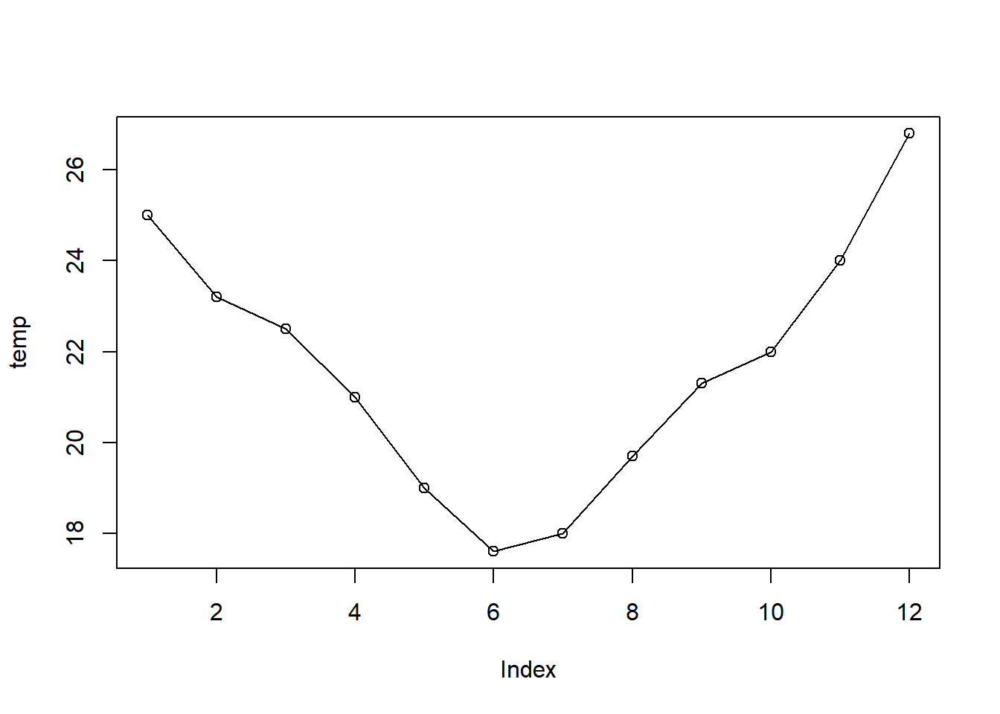

# Manipulação de Vetores {#manip-vectors}


Neste capítulo veremos como manipular vetores, incluindo:

- como nomear vetores

- operação entre vetores

- a indexação de vetores

- 

## Propriedades

+ `typeof()` para descobrir o tipo de dado

+ `length()` para descobrir o tamanho de um tipo de dado 

+ `attributes` (informações acionais específicas do dado), entre eles o atributo mais comum está o `names()`.


### Nomeando vetores

Nós podemos nomear um vetor de 3 formas:

+ Durante a criação

+ Modificando um vetor

+ Criando um vetor modificado

Nomes devem ser únicos (sem repetições), porque para filtragem de elementos de um vetor ou a seleção de um subconjunto (razão pela qual usam-se os `names`) retornará somente o primeiro elemento que tiver nome repetido.

```r
# Durante a criação:
x <- c(a = 1, b = 2, c = 3)
x
#> a b c 
#> 1 2 3
# Modificando um vetor:
x <- 1:3
names(x) <- c("a", "b", "c")
x
#> a b c 
#> 1 2 3
# Criando um vetor modificado
x <- setNames(1:3, c("a", "b", "c"))
x
#> a b c 
#> 1 2 3
```

Nem todos elementos precisam ter nomes. Se os nomes são faltantes, `names()` retornará um string vazia ("") para aqueles elementos. Se todos forem faltantes, `names()` retornará `NULL`.

```r
y <- c(a = 1, 2, 3)
names(y)
#> [1] "a" ""  ""
z <- c(1, 2, 3)
names(z)
#> NULL
```

Podemos criar um vetor sem nomes usando a função `unname(x)`, ou remover `names` com `names(x) <- NULL`.


```r
a <- c(dia1 = 12, dia2 = 20, dia3 = 10)
a
#> dia1 dia2 dia3 
#>   12   20   10
names(a)
#> [1] "dia1" "dia2" "dia3"
a_sn <- unname(a)
a_sn
#> [1] 12 20 10
names(a_sn)
#> NULL
```


### Operações com vetores

Como o `R` é uma linguagem vetorizada, as operações são aplicadas a cada elemento do vetor automaticamente, sem a necessidade de laços (ou *loopings*) ao longo do vetor. Esta é uma das grandes vantagens do  .

Operações aritméticas podem ser aplicadas diretamente entre vetores.


```r
# criando 2 vetores de mesmo tamanho
x <- 1:10
y <- -5:4
# somando-os
x + y
#>  [1] -4 -2  0  2  4  6  8 10 12 14
x / y
#>  [1] -0.2 -0.5 -1.0 -2.0 -5.0  Inf  7.0  4.0  3.0  2.5
2 ^ x
#>  [1]    2    4    8   16   32   64  128  256  512 1024
x %% y
#>  [1] -4 -2  0  0  0 NA  0  0  0  2
length(x + y)
#> [1] 10
```

Uma peculiaridade do R é o tratamento de operações com vetores de tamanhos diferentes. O vetor menor é reciclado, de forma que seus elementos sejam repetidos em ordem até atingirem o tamanho do vetor mais longo envolvido na operação. 


```r
(vetor_dbl <- c(-1.5, 0.3, 1.4, 2.0))
#> [1] -1.5  0.3  1.4  2.0
cte <- 4
vetor_dbl * cte
#> [1] -6.0  1.2  5.6  8.0
quatros <- c(4, 4, 4, 4)
vetor_dbl * 4
#> [1] -6.0  1.2  5.6  8.0
```

O número 4 nesse caso é reciclado 4 vezes e então multiplicado por cada elemento de `vetor_dbl`.


```r
v2 <- c(2, 1)
vetor_dbl + v2
#> [1] 0.5 1.3 3.4 3.0
```

Se o vetor mais longo não é múltiplo do mais curto, o  imprime um aviso.


```r
v3 <- c(2, 1, 3)
vetor_dbl + v3
#> Warning in vetor_dbl + v3: comprimento do objeto maior não é múltiplo do
#> comprimento do objeto menor
#> [1] 0.5 1.3 4.4 4.0
```

A reciclagem é intrinsecamente usada em operações envolvendo vetores.


- - - 
SOLTO 

Valores lógicos resultam da comparação de números ou caracteres.
A Tabela \@ref(tab:oper-logic) apresenta os principais operadores lógicos para comparações.


Table: (\#tab:oper-logic)Operadores Lógicos

 Operador            Descrição        
-----------  -------------------------
     <               menor que        
    <=           menor ou igual a     
     >               maior que        
    >=            maior ou igual      
    ==               idêntico         
    !=               diferente        
    !x           não é x (negação)    
   x | y              x ou y          
   x & y               x e y          
 isTRUE(x)    teste se x é verdadeiro 
   %in%           está contido em     

Este conjunto de operadores permite diversas comparações entre vetores, por exemplo: 

- quais elementos do `vetor_dbl` (da seção \@ref(build-vectors)) são negativos?


```r
vetor_dbl < 0
#> [1]  TRUE FALSE FALSE FALSE
```

outros exemplos ÚTEIS ...


PAREI AQUI -------------------------------------------------

podem ser usados em operações aritméticas. Neste caso, serão convertidos numericamente para 1 (TRUE) e 0 (FALSE).


```r
vl * 5
TRUE * 4
TRUE + TRUE
FALSE - TRUE
```


```r
4 == 3 # 4 é idêntico a 3?
#> [1] FALSE
teste2i2 <- 2 * 2 == 2 + 2
teste2i2
#> [1] TRUE
teste2d2 <- 2 * 2 != 2 + 2 # operador: diferente de
teste2d2
#> [1] FALSE
4 < 3
#> [1] FALSE
4 > 3
#> [1] TRUE
4 >= 3 & 4 <= 5
#> [1] TRUE
4 <= 3 | 4 <= 5
#> [1] TRUE
"abc" == "defg"
#> [1] FALSE
"abc" < "defg"
#> [1] TRUE
nchar("abc") < nchar("defg")
#> [1] TRUE
```


Comparações também funcionam com vetores.


```r
x <= 5
#>  [1]  TRUE  TRUE  TRUE  TRUE  TRUE FALSE FALSE FALSE FALSE FALSE
x > y
#>  [1] TRUE TRUE TRUE TRUE TRUE TRUE TRUE TRUE TRUE TRUE
x < y
#>  [1] FALSE FALSE FALSE FALSE FALSE FALSE FALSE FALSE FALSE FALSE
```


Entre os operadores lógicos vistos (Tabela \@ref(tab:oper-logic)) alguns deles não foram aplicados em exemplos. Vamos então usar o operador `%in%` para verificar se um vetor está contido parcial ou totalmente em outro vetor.


```r
# operador está contido em
2:4 %in% x
#> [1] TRUE TRUE TRUE
# 2:4 são elementos de x?
is.element(2:4, x)
#> [1] TRUE TRUE TRUE
```


#### Operadores `any` e `all`


```r
vetor <- c(0, 1, -1, -2, 3, 5, -5)
all(vetor < 0) # todas as posições são maiores que 0 ?
#> [1] FALSE
any(vetor > 0) # alguma posição é maior que 0?
#> [1] TRUE
```

Ambas as funções sintetizam a informação:

- `all()` verifica se a condição avaliada é válida para todos elementos do vetor;
- `any()` verifica se a condição avaliada é válida para pelo menos um dos elementos do vetor;

As funções fornecem um único valor (vetor lógico de tamanho 1) para resumir ou descrever o resultado da condição aplicada ao vetor.


### Sequências 

Vimos nas seções anteriores que é muito simples criar sequências de números inteiros com o operador `:`.  Nesta seção veremos outras formas de gerar sequências, como uma sequência de números não inteiros e sequências de números repetidos. 

#### Sequências de números inteiros

Sequências de números formam um vetor. Há diversas formas de se gerar sequências no R. Para gerar uma sequência de 1 até 365, em vez de escrevermos cada número e combiná-los usando `c(1,2,3,...,365)`, podemos usar o operador `:` da seguinte forma:
 

```r
# dias do ano
dda <- 1:365
dda
#>   [1]   1   2   3   4   5   6   7   8   9  10  11  12  13  14  15  16  17  18
#>  [19]  19  20  21  22  23  24  25  26  27  28  29  30  31  32  33  34  35  36
#>  [37]  37  38  39  40  41  42  43  44  45  46  47  48  49  50  51  52  53  54
#>  [55]  55  56  57  58  59  60  61  62  63  64  65  66  67  68  69  70  71  72
#>  [73]  73  74  75  76  77  78  79  80  81  82  83  84  85  86  87  88  89  90
#>  [91]  91  92  93  94  95  96  97  98  99 100 101 102 103 104 105 106 107 108
#> [109] 109 110 111 112 113 114 115 116 117 118 119 120 121 122 123 124 125 126
#> [127] 127 128 129 130 131 132 133 134 135 136 137 138 139 140 141 142 143 144
#> [145] 145 146 147 148 149 150 151 152 153 154 155 156 157 158 159 160 161 162
#> [163] 163 164 165 166 167 168 169 170 171 172 173 174 175 176 177 178 179 180
#> [181] 181 182 183 184 185 186 187 188 189 190 191 192 193 194 195 196 197 198
#> [199] 199 200 201 202 203 204 205 206 207 208 209 210 211 212 213 214 215 216
#> [217] 217 218 219 220 221 222 223 224 225 226 227 228 229 230 231 232 233 234
#> [235] 235 236 237 238 239 240 241 242 243 244 245 246 247 248 249 250 251 252
#> [253] 253 254 255 256 257 258 259 260 261 262 263 264 265 266 267 268 269 270
#> [271] 271 272 273 274 275 276 277 278 279 280 281 282 283 284 285 286 287 288
#> [289] 289 290 291 292 293 294 295 296 297 298 299 300 301 302 303 304 305 306
#> [307] 307 308 309 310 311 312 313 314 315 316 317 318 319 320 321 322 323 324
#> [325] 325 326 327 328 329 330 331 332 333 334 335 336 337 338 339 340 341 342
#> [343] 343 344 345 346 347 348 349 350 351 352 353 354 355 356 357 358 359 360
#> [361] 361 362 363 364 365
# sequencia de anos
anos <- 1961:1990
anos
#>  [1] 1961 1962 1963 1964 1965 1966 1967 1968 1969 1970 1971 1972 1973 1974 1975
#> [16] 1976 1977 1978 1979 1980 1981 1982 1983 1984 1985 1986 1987 1988 1989 1990
# sequencia de inteiros decrescente
si_dec <- 10:-10
si_dec
#>  [1]  10   9   8   7   6   5   4   3   2   1   0  -1  -2  -3  -4  -5  -6  -7  -8
#> [20]  -9 -10
# sequencia de numeros não inteiros
seqn <- 1.5:10
seqn
#> [1] 1.5 2.5 3.5 4.5 5.5 6.5 7.5 8.5 9.5
c(seqn, 10)
#>  [1]  1.5  2.5  3.5  4.5  5.5  6.5  7.5  8.5  9.5 10.0
```

#### Sequências de números não inteiros

Mas para gerar uma sequencia de números não inteiros há uma função específica para tal tarefa.

```r
# igual a c(snum, 10), mas usando o seq
(snum_b <- seq(from = 1.5, to = 10, by = 0.5))
#>  [1]  1.5  2.0  2.5  3.0  3.5  4.0  4.5  5.0  5.5  6.0  6.5  7.0  7.5  8.0  8.5
#> [16]  9.0  9.5 10.0
```

Exemplos de sequência de anos, meses e dias.

```r
# vetor com de anos decimais (2 valores por dia)
anos_dec <- seq(2010, 2011, length.out = 365 * 2)
# para ver só o início do vetor ao invés de todo o vetor
head(anos_dec)
#> [1] 2010.000 2010.001 2010.003 2010.004 2010.005 2010.007
# mas não dá pra ver a parte decimal, vamos alterar as opções
# aumentando as casas decimais
options(digits = 6)
# verifique agora
head(anos_dec)
#> [1] 2010.00 2010.00 2010.00 2010.00 2010.01 2010.01
# só os primeiros 30 elementos
head(anos_dec, 30)
#>  [1] 2010.00 2010.00 2010.00 2010.00 2010.01 2010.01 2010.01 2010.01 2010.01
#> [10] 2010.01 2010.01 2010.02 2010.02 2010.02 2010.02 2010.02 2010.02 2010.02
#> [19] 2010.02 2010.03 2010.03 2010.03 2010.03 2010.03 2010.03 2010.03 2010.04
#> [28] 2010.04 2010.04 2010.04
# para ver só o final do vetor yrFrac
tail(anos_dec)
#> [1] 2010.99 2010.99 2011.00 2011.00 2011.00 2011.00
# para ver só os último 50 elementos do yrFrac
tail(anos_dec, 50)
#>  [1] 2010.93 2010.93 2010.94 2010.94 2010.94 2010.94 2010.94 2010.94 2010.94
#> [10] 2010.95 2010.95 2010.95 2010.95 2010.95 2010.95 2010.95 2010.95 2010.96
#> [19] 2010.96 2010.96 2010.96 2010.96 2010.96 2010.96 2010.97 2010.97 2010.97
#> [28] 2010.97 2010.97 2010.97 2010.97 2010.98 2010.98 2010.98 2010.98 2010.98
#> [37] 2010.98 2010.98 2010.98 2010.99 2010.99 2010.99 2010.99 2010.99 2010.99
#> [46] 2010.99 2011.00 2011.00 2011.00 2011.00
# pentadas
pent <- seq(from = 1, to = 365, by = 5)
# dencendios
decd <- seq(from = 1, to = 365, by = 10)
# fracoes de dia
frac_d30mn <- seq(0, 365, length.out = 365 * 48) + 1
head(frac_d30mn, 48 * 2)
#>  [1] 1.00000 1.02083 1.04167 1.06250 1.08334 1.10417 1.12501 1.14584 1.16668
#> [10] 1.18751 1.20835 1.22918 1.25001 1.27085 1.29168 1.31252 1.33335 1.35419
#> [19] 1.37502 1.39586 1.41669 1.43752 1.45836 1.47919 1.50003 1.52086 1.54170
#> [28] 1.56253 1.58337 1.60420 1.62504 1.64587 1.66670 1.68754 1.70837 1.72921
#> [37] 1.75004 1.77088 1.79171 1.81255 1.83338 1.85422 1.87505 1.89588 1.91672
#> [46] 1.93755 1.95839 1.97922 2.00006 2.02089 2.04173 2.06256 2.08340 2.10423
#> [55] 2.12506 2.14590 2.16673 2.18757 2.20840 2.22924 2.25007 2.27091 2.29174
#> [64] 2.31257 2.33341 2.35424 2.37508 2.39591 2.41675 2.43758 2.45842 2.47925
#> [73] 2.50009 2.52092 2.54175 2.56259 2.58342 2.60426 2.62509 2.64593 2.66676
#> [82] 2.68760 2.70843 2.72927 2.75010 2.77093 2.79177 2.81260 2.83344 2.85427
#> [91] 2.87511 2.89594 2.91678 2.93761 2.95845 2.97928
tail(frac_d30mn, 48 * 2)
#>  [1] 364.021 364.042 364.062 364.083 364.104 364.125 364.146 364.167 364.187
#> [10] 364.208 364.229 364.250 364.271 364.292 364.312 364.333 364.354 364.375
#> [19] 364.396 364.417 364.437 364.458 364.479 364.500 364.521 364.542 364.562
#> [28] 364.583 364.604 364.625 364.646 364.667 364.687 364.708 364.729 364.750
#> [37] 364.771 364.792 364.812 364.833 364.854 364.875 364.896 364.917 364.937
#> [46] 364.958 364.979 365.000 365.021 365.042 365.062 365.083 365.104 365.125
#> [55] 365.146 365.167 365.187 365.208 365.229 365.250 365.271 365.292 365.312
#> [64] 365.333 365.354 365.375 365.396 365.417 365.437 365.458 365.479 365.500
#> [73] 365.521 365.542 365.562 365.583 365.604 365.625 365.646 365.667 365.687
#> [82] 365.708 365.729 365.750 365.771 365.792 365.812 365.833 365.854 365.875
#> [91] 365.896 365.917 365.937 365.958 365.979 366.000
# diferentes funções para gerar uma sequência
an <- c(1, 7, 2, 5, 3, 2)
# gerando uma sequencia a partir de um número
seq_len(length.out = 6)
#> [1] 1 2 3 4 5 6
# gerando uma sequência a partir de um número
seq(6)
#> [1] 1 2 3 4 5 6
# de acordo com o tamanho do vetor gera-se uma sequencia
seq(along = an)
#> [1] 1 2 3 4 5 6
seq(along = 0) # ! melhor opção para gerar sequencias do tamanho do vetor
#> [1] 1
seq(0) # ! cuidado, veja ?seq para entender a razão desse resultado inusitado
#> [1] 1 0
# conflito entre parâmetros
# a <-seq(from = -5, to = 5, by = 0.05, length.out=200)
s5by <- seq(from = -5, to = 5, by = 0.05)
length(s5by)
#> [1] 201
tail(s5by)
#> [1] 4.75 4.80 4.85 4.90 4.95 5.00
s5len <- seq(from = -5, to = 5, length.out = 200)
length(s5len)
#> [1] 200
tail(s5len)
#> [1] 4.74874 4.79899 4.84925 4.89950 4.94975 5.00000
```

#### Sequências de números repetidos


```r
rep_t4 <- rep(1:2, times = 4)
rep_t4
#> [1] 1 2 1 2 1 2 1 2
rep_e31 <- rep(1:12, each = 31)
rep_e31
#>   [1]  1  1  1  1  1  1  1  1  1  1  1  1  1  1  1  1  1  1  1  1  1  1  1  1  1
#>  [26]  1  1  1  1  1  1  2  2  2  2  2  2  2  2  2  2  2  2  2  2  2  2  2  2  2
#>  [51]  2  2  2  2  2  2  2  2  2  2  2  2  3  3  3  3  3  3  3  3  3  3  3  3  3
#>  [76]  3  3  3  3  3  3  3  3  3  3  3  3  3  3  3  3  3  3  4  4  4  4  4  4  4
#> [101]  4  4  4  4  4  4  4  4  4  4  4  4  4  4  4  4  4  4  4  4  4  4  4  4  5
#> [126]  5  5  5  5  5  5  5  5  5  5  5  5  5  5  5  5  5  5  5  5  5  5  5  5  5
#> [151]  5  5  5  5  5  6  6  6  6  6  6  6  6  6  6  6  6  6  6  6  6  6  6  6  6
#> [176]  6  6  6  6  6  6  6  6  6  6  6  7  7  7  7  7  7  7  7  7  7  7  7  7  7
#> [201]  7  7  7  7  7  7  7  7  7  7  7  7  7  7  7  7  7  8  8  8  8  8  8  8  8
#> [226]  8  8  8  8  8  8  8  8  8  8  8  8  8  8  8  8  8  8  8  8  8  8  8  9  9
#> [251]  9  9  9  9  9  9  9  9  9  9  9  9  9  9  9  9  9  9  9  9  9  9  9  9  9
#> [276]  9  9  9  9 10 10 10 10 10 10 10 10 10 10 10 10 10 10 10 10 10 10 10 10 10
#> [301] 10 10 10 10 10 10 10 10 10 10 11 11 11 11 11 11 11 11 11 11 11 11 11 11 11
#> [326] 11 11 11 11 11 11 11 11 11 11 11 11 11 11 11 11 12 12 12 12 12 12 12 12 12
#> [351] 12 12 12 12 12 12 12 12 12 12 12 12 12 12 12 12 12 12 12 12 12 12
rep_t13 <- rep(c("chuva", "sol"), times = c(1, 3))
rep_t13
#> [1] "chuva" "sol"   "sol"   "sol"
rep_t13_t4 <- rep(rep(c("chuva", "sol"), times = c(1, 3)), times = 4)
rep_t13_t4
#>  [1] "chuva" "sol"   "sol"   "sol"   "chuva" "sol"   "sol"   "sol"   "chuva"
#> [10] "sol"   "sol"   "sol"   "chuva" "sol"   "sol"   "sol"
```


### Indexação de vetores {#index-vetores}

Os elementos de um vetor são indexados e para acessá-los usamos a notação de índices do R. 

Podemos selecionar partes de um vetor por números (posição do elemento), caracteres (nome) e vetores lógicos. 

Através do operador `[` podemos acessar ou filtrar elementos de um vetor. O operador colchete `[` aplicado a um vetor retornará um vetor.

Considere os seguintes vetores como exemplo:


```r
# vetor de chuva mensal para um dado ano
prec <- c(300, 150, 210, 12, 0, 0, 12, 22, 80, 100, 0, 280)
meses <- c("Jan", "Fev", "Mar", "Abr", "Mai", "Jun", "Jul", "Ago", "Set", "Out", "Nov", "Dez")
names(prec) <- meses
prec
#> Jan Fev Mar Abr Mai Jun Jul Ago Set Out Nov Dez 
#> 300 150 210  12   0   0  12  22  80 100   0 280
# gráfico de barras
barplot(prec)
box()
```


```r
# temperatura do ar média mensal para um dado ano
temp <- c(25, 23.2, 22.5, 21, 19, 17.6, 18, 19.7, 21.3, 22, 24, 26.8)
names(temp) <- meses
temp
#>  Jan  Fev  Mar  Abr  Mai  Jun  Jul  Ago  Set  Out  Nov  Dez 
#> 25.0 23.2 22.5 21.0 19.0 17.6 18.0 19.7 21.3 22.0 24.0 26.8
plot(temp, type = "o")
```



Como selecionar o valor de chuva e temperatura só para janeiro?

Usando a seguinte sintaxe: 

`vetor[i]`

onde `i` representa os elementos a serem selecionados.

#### Indexação por vetores inteiros

##### Positivos

Para selecionar o valor de chuva e temperatura só para janeiro, digitamos:


```r
prec_jan <- prec[1]
prec_jan
#> Jan 
#> 300
temp_jan <- temp[1]
temp_jan
#> Jan 
#>  25
```

Como selecionar os últimos valores dos vetores de chuva e temperatura?


```r
# vetor de temperatura do ar média mensal de um ano qualquer
temp_dez <- temp[length(temp)]
temp_dez
#>  Dez 
#> 26.8
prec_dez <- prec[length(prec)]
prec_dez
#> Dez 
#> 280
```

Como selecionar os valores de chuva do trimestre JJA e de temperatura para o trimestre DJF?


```r
sel_prec <- c(6, 7, 8)
# vetor de chuva JJA
prec_jja <- prec[sel_prec]
prec_jja
#> Jun Jul Ago 
#>   0  12  22
# total de chuva trimestral nesse ano
prect_jja_tot <- sum(prec_jja)
prect_jja_tot
#> [1] 34
# vetor de temperatura DJF
sel_temp <- c(12, 1, 2)
temp_djf <- temp[sel_temp]
temp_djf
#>  Dez  Jan  Fev 
#> 26.8 25.0 23.2
# temp média trimestral nesse ano
temp_djf_med <- mean(temp_djf)
temp_djf_med
#> [1] 25
```

##### Negativos

Como selecionar todos valores menos o primeiro e o último?


```r
# exceto o primeiro e ultimo
prec[-c(1, length(prec))]
#> Fev Mar Abr Mai Jun Jul Ago Set Out Nov 
#> 150 210  12   0   0  12  22  80 100   0
# exceto os 3 primeiros meses
temp[-c(1:3)]
#>  Abr  Mai  Jun  Jul  Ago  Set  Out  Nov  Dez 
#> 21.0 19.0 17.6 18.0 19.7 21.3 22.0 24.0 26.8
# exceto os 3 últimos meses
temp[-c(length(temp):(length(temp) - 2))]
#>  Jan  Fev  Mar  Abr  Mai  Jun  Jul  Ago  Set 
#> 25.0 23.2 22.5 21.0 19.0 17.6 18.0 19.7 21.3
```

####  Indexação por nomes


```r
prec["Jan"]
#> Jan 
#> 300
prec[c("Dez", "Fev", "Jun")]
#> Dez Fev Jun 
#> 280 150   0
```

#### Indexação por vetores lógicos

Vamos criar um vetor lógico e usá-lo para exemplificar a seleção lógica de elementos de um vetor. 


```r
vetor_l <- c(
  TRUE, FALSE, FALSE, TRUE,
  TRUE, FALSE, TRUE, FALSE,
  TRUE, FALSE, FALSE, TRUE
)
meses[vetor_l]
#> [1] "Jan" "Abr" "Mai" "Jul" "Set" "Dez"
```

Os elementos de `vetor_l` correspondentes a `TRUE` foram selecionados. Aplicando-se a função `sum()` a um vetor lógico obtemos o total de elementos verdadeiros:


```r
sum(vetor_l)
#> [1] 6
```

Vamos considerar agora a seguinte forma do vetor lógico (`vetor_l`) e relembrar da **coerção** de vetores.


```r
# vetor lógico
vetor_l <- c(TRUE, FALSE)
meses[vetor_l]
#> [1] "Jan" "Mar" "Mai" "Jul" "Set" "Nov"
vetor_l <- c(TRUE, FALSE, FALSE)
meses[vetor_l]
#> [1] "Jan" "Abr" "Jul" "Out"
prec[c(TRUE, FALSE)]
#> Jan Mar Mai Jul Set Nov 
#> 300 210   0  12  80   0
temp[c(rep(FALSE, 3), TRUE)]
#>  Abr  Ago  Dez 
#> 21.0 19.7 26.8
```

A indexação pode ser feita também por comparações:


```r
# vetor prec
prec
#> Jan Fev Mar Abr Mai Jun Jul Ago Set Out Nov Dez 
#> 300 150 210  12   0   0  12  22  80 100   0 280
# teste para chuva > 80 mm/mês
prec > 80
#>   Jan   Fev   Mar   Abr   Mai   Jun   Jul   Ago   Set   Out   Nov   Dez 
#>  TRUE  TRUE  TRUE FALSE FALSE FALSE FALSE FALSE FALSE  TRUE FALSE  TRUE
# salvando resultado do teste
above80 <- prec > 80
# extraindo valores atendidos ao teste
prec[above80]
#> Jan Fev Mar Out Dez 
#> 300 150 210 100 280
# teste para meses com chuva abaixo da média mensal
(prec_med <- mean(prec))
#> [1] 97.1667
# salvando resultado do teste
(below_avg <- prec < prec_med)
#>   Jan   Fev   Mar   Abr   Mai   Jun   Jul   Ago   Set   Out   Nov   Dez 
#> FALSE FALSE FALSE  TRUE  TRUE  TRUE  TRUE  TRUE  TRUE FALSE  TRUE FALSE
# extraindo valores que atendem a condição
prec[below_avg]
#> Abr Mai Jun Jul Ago Set Nov 
#>  12   0   0  12  22  80   0
# extraindo os 3 primeiros meses com prec abaixo da média
prec[below_avg][1:3]
#> Abr Mai Jun 
#>  12   0   0
# forma equivalente em uma linha só
prec[prec < mean(prec)][1:3]
#> Abr Mai Jun 
#>  12   0   0
# teste para meses com prec diferente de zero
prec[prec != 0]
#> Jan Fev Mar Abr Jul Ago Set Out Dez 
#> 300 150 210  12  12  22  80 100 280
```


####  Indexação com múltiplas condições

Nos exemplo acima vimos como buscar os os elementos de um vetor para apenas uma condição. Entretanto frequentemente precisamos testar mais condições. Por exemplo, para condições do tipo:

- $0.5 < prec \leq 100$ 
- $temp < 5$  ou $temp \geq 25$ 

precisamos usar os operadores relacionais:

- `&` e `&&` (\"e"\)

- `|` e `||` (\"ou"\)

A ordem das operações pode ser controladas por parênteses. Os operadores `&` e `|` são vetorizados (retornam vetores de mesmo tamanho que os vetores testados). 

As diferenças entre os operadores são mostradas nos exemplos a seguir.


```r
# prec
prec
#> Jan Fev Mar Abr Mai Jun Jul Ago Set Out Nov Dez 
#> 300 150 210  12   0   0  12  22  80 100   0 280
# combinação de operador lógico e relacional
below100 <- prec > 0 & prec <= 100
prec_cond1 <- prec[below100]
prec_cond1
#> Abr Jul Ago Set Out 
#>  12  12  22  80 100
```

A forma dupla (`&&` ou `||`) compara somente um elemento de cada lado, enquanto a forma normal (`&` e `|`), compara cada elemento dos vetores em cada lado.


```r
a <- c(1, 1, 0, 1)
b <- c(2, 1, 0, 1)
# forma normal verifica cada elemento de a e cada elemento de b
a == 1 & b == 1
#> [1] FALSE  TRUE FALSE  TRUE
# forma dupla verifica somente o primeiro elemento de a e o primeiro elemento de b
# retornando somente um resultado
a == 1 && b == 1
#> [1] FALSE
```


------------------------------------------------------------
 a   b   a==1    b==1    a == 1 & b == 1   a == 1 && b == 1 
--- --- ------- ------- ----------------- ------------------
 1   2   TRUE    FALSE        FALSE             FALSE       

 1   1   TRUE    TRUE         TRUE                          

 0   0   FALSE   FALSE        FALSE                         

 1   1   TRUE    TRUE         TRUE                          
------------------------------------------------------------

Table: Demostração da diferença entre & e &&.

Podem haver mais que duas condições a serem testadas. As condições podem ser combinadas usando múltiplos `&` ou `|`. As diferentes condições podem ser agrupadas por parênteses assim como operações matemáticas. Sem parênteses, a ordem das operações é semelhante a das operações matemáticas:

- **PEMDAS**: Parênteses > Expoentes > Multiplicação > Divisão > Adição e Subtração 

Onde `&`é equivalente à **multiplicação** e `|` é equivalente à **adição**, logo **e** tem precedência sobre **ou**.


```r
# vetor de horas
horas <- 0:23
# vetor de temperaturas horárias
tar_hor <- c(
  19.9, 19.8, 19.5, 19.4, 19.4, 19.3,
  19.2, 19, 19.2, 19.5, 20.1, 20.6, 20.9,
  21.8, 22.5, 22.6, 22.5, 22, 21.4, 20.1,
  20, 19.8, 19.6, 19.4
)
# gráfico do varição horária da temperatura do ar
plot(horas, tar_hor, type = "o", pch = 20)
# temperaturas noturnas abaixo de 20ºC
(night_below20 <- (horas < 6 | horas > 18) & tar_hor < 20)
#>  [1]  TRUE  TRUE  TRUE  TRUE  TRUE  TRUE FALSE FALSE FALSE FALSE FALSE FALSE
#> [13] FALSE FALSE FALSE FALSE FALSE FALSE FALSE FALSE FALSE  TRUE  TRUE  TRUE
tar_hor[night_below20]
#> [1] 19.9 19.8 19.5 19.4 19.4 19.3 19.8 19.6 19.4
# destacando no gráfico
points(
  x = horas[night_below20],
  y = tar_hor[night_below20],
  pch = 20, # tipo de símbolo para os ponts
  col = "blue", # cor do símbolo
  cex = 2
) # tamanho do ponto
# temperaturas abaixo de 20ºC que não ocorreram a noite
day_below20 <- tar_hor < 20 & !night_below20
points(horas[day_below20], tar_hor[day_below20], pch = 20, col = "red", cex = 2)
# adicionando linha horizontal ao longo da temperatura = 20ºC
abline(h = 20, col = "gray")
```


Vimos que a filtragem consiste em extrair elementos de um vetor que satisfaça uma (ou várias) condição(ões). Entretanto, em alguns casos, o interesse é na posição dentro do vetor na qual a condição é verdadeira Nós podemos localizar essas ocorrências usando a função `which()`:


```r
# prec sem nomes
names(prec) <- NULL
# combinação de operador lógico e relacional
below100
#>   Jan   Fev   Mar   Abr   Mai   Jun   Jul   Ago   Set   Out   Nov   Dez 
#> FALSE FALSE FALSE  TRUE FALSE FALSE  TRUE  TRUE  TRUE  TRUE FALSE FALSE
which(below100)
#> Abr Jul Ago Set Out 
#>   4   7   8   9  10
# qual os meses em que a chuva foi acima da media
which(prec > prec_med)
#> [1]  1  2  3 10 12
prec[which(prec > prec_med)]
#> [1] 300 150 210 100 280
# Qual a temp quando a chuva ou a temp foi acima da media?
sel <- which(prec > prec_med | !temp < mean(temp))
sel
#> Jan Fev Mar Out Nov Dez 
#>   1   2   3  10  11  12
prec[sel]
#> [1] 300 150 210 100   0 280
# quais posições do vetor prec não choveu
which(prec == 0)
#> [1]  5  6 11
# quando ocorreu a prec max
which(prec == max(prec))
#> [1] 1
# equivalente a ...
which.max(prec)
#> [1] 1
# seleciona só a primeira ocorrência!
which.min(prec)
#> [1] 5
prec
#>  [1] 300 150 210  12   0   0  12  22  80 100   0 280
```

Um outro operador útil para comparação entre vetores é o operador `%in%`, que pode ser interpretado como \"está contido em\". O **resultado é um vetor de mesmo tamanho que o vetor à esquerda do teste**. 


```r
# compare o tamanho dos vetores resultantes
which(meses %in% c("JAN", "Feb", "Mar"))
#> [1] 3
# note a diferença
which(c("JAN", "Feb", "Mar") %in% meses)
#> [1] 3
cond <- names(temp) %in% c("Jun", "Jul", "Ago")
quais <- which(cond)
quais
#> [1] 6 7 8
prec[cond]
#> [1]  0 12 22
prec[quais]
#> [1]  0 12 22
```

### Substituição de elementos de um vetor


```r
# posição a ser alterada
pos <- 10
# valor da temperatura naquela posição
old_temp <- temp[pos]
old_temp
#> Out 
#>  22
# vetor de temperatura
temp
#>  Jan  Fev  Mar  Abr  Mai  Jun  Jul  Ago  Set  Out  Nov  Dez 
#> 25.0 23.2 22.5 21.0 19.0 17.6 18.0 19.7 21.3 22.0 24.0 26.8
# substituição do valor original por um novo valor
new_temp <- 30
# alterando temperatura do mês de outubro
temp[pos] <- new_temp
temp
#>  Jan  Fev  Mar  Abr  Mai  Jun  Jul  Ago  Set  Out  Nov  Dez 
#> 25.0 23.2 22.5 21.0 19.0 17.6 18.0 19.7 21.3 30.0 24.0 26.8
```
  
A substituição também pode ser feita também pelo nome das variáveis.


```r
prec
#>  [1] 300 150 210  12   0   0  12  22  80 100   0 280
prec["Mai"] <- 5
temp
#>  Jan  Fev  Mar  Abr  Mai  Jun  Jul  Ago  Set  Out  Nov  Dez 
#> 25.0 23.2 22.5 21.0 19.0 17.6 18.0 19.7 21.3 30.0 24.0 26.8
temp[c("Mai", "Jul")] <- temp[c("Mai", "Jul")] + 2
temp
#>  Jan  Fev  Mar  Abr  Mai  Jun  Jul  Ago  Set  Out  Nov  Dez 
#> 25.0 23.2 22.5 21.0 21.0 17.6 20.0 19.7 21.3 30.0 24.0 26.8
```

### Criação de vetores com `vector`

Outra forma de se criar vetores é através da função `vector()`.


```r
# criação de vetor v
v <- 3
v
#> [1] 3
# adicionando elementos
v[2] <- 100
v
#> [1]   3 100
v[5] <- 6
v
#> [1]   3 100  NA  NA   6
# adicionando elementos de vetores
x <- c(88, 5, 12, 13)
x <- c(x[1:3], 168, x[4]) # insere 168 antes do 13
x
#> [1]  88   5  12 168  13
# outra opção
k <- vector()
class(k)
#> [1] "logical"
# vetor k existe?
ls()
#>  [1] "a"                  "a_sn"               "above80"           
#>  [4] "an"                 "anos"               "anos_dec"          
#>  [7] "b"                  "below_avg"          "below100"          
#> [10] "cond"               "cran_news_windows"  "cte"               
#> [13] "day_below20"        "dda"                "decd"              
#> [16] "desc"               "format_hotkey"      "frac_d30mn"        
#> [19] "horas"              "k"                  "meses"             
#> [22] "new_temp"           "night_below20"      "old_temp"          
#> [25] "oper"               "oper_logic"         "pcks"              
#> [28] "pent"               "pos"                "prec"              
#> [31] "prec_cond1"         "prec_dez"           "prec_jan"          
#> [34] "prec_jja"           "prec_med"           "prect_jja_tot"     
#> [37] "quais"              "quatros"            "r_cran_version_win"
#> [40] "rblue"              "rep_e31"            "rep_t13"           
#> [43] "rep_t13_t4"         "rep_t4"             "s5by"              
#> [46] "s5len"              "sel"                "sel_prec"          
#> [49] "sel_temp"           "seqn"               "si_dec"            
#> [52] "snum_b"             "tar_hor"            "temp"              
#> [55] "temp_dez"           "temp_djf"           "temp_djf_med"      
#> [58] "temp_jan"           "teste2d2"           "teste2i2"          
#> [61] "v"                  "v2"                 "v3"                
#> [64] "vetor"              "vetor_dbl"          "vetor_l"           
#> [67] "x"                  "y"                  "z"
# alocando o valor 45 no 3º elemento de k
k[3] <- 45
k
#> [1] NA NA 45
class(k)
#> [1] "numeric"
# diminuindo o tamanho de k
length(k)
#> [1] 3
length(k) <- 2
k
#> [1] NA NA
length(k) <- 0
k
#> numeric(0)
class(k)
#> [1] "numeric"
is.null(k)
#> [1] FALSE
# exemplo
temp <- c(25, 23.2, 22.5, 21, 19, 17.6, 18, 19.7, 21.3, 22, 24, 26.8)
temp_orig <- temp
# mostrando o vetor temp
temp
#>  [1] 25.0 23.2 22.5 21.0 19.0 17.6 18.0 19.7 21.3 22.0 24.0 26.8
temp[]
#>  [1] 25.0 23.2 22.5 21.0 19.0 17.6 18.0 19.7 21.3 22.0 24.0 26.8
# substituir todos elementos do vetor temp por um vetor com apenas um valor
temp <- 0
temp
#> [1] 0
# vamos redefinir temp e comparar o anterior com o obtido com o próximo comando
temp <- temp_orig
temp[1:length(temp)] <- 0
temp
#>  [1] 0 0 0 0 0 0 0 0 0 0 0 0
# qual diferença de x <- 0 e x[] <-0 ?
temp <- temp_orig
temp[] <- 0
temp
#>  [1] 0 0 0 0 0 0 0 0 0 0 0 0
# Um vetor com tamanho pre-definido e do tipo numeric
umvetor <- vector(mode = "numeric", length = 100)
umvetor
#>   [1] 0 0 0 0 0 0 0 0 0 0 0 0 0 0 0 0 0 0 0 0 0 0 0 0 0 0 0 0 0 0 0 0 0 0 0 0 0
#>  [38] 0 0 0 0 0 0 0 0 0 0 0 0 0 0 0 0 0 0 0 0 0 0 0 0 0 0 0 0 0 0 0 0 0 0 0 0 0
#>  [75] 0 0 0 0 0 0 0 0 0 0 0 0 0 0 0 0 0 0 0 0 0 0 0 0 0 0
# populando o vetor
umvetor[1] <- 10
umvetor[10] <- 100
umvetor
#>   [1]  10   0   0   0   0   0   0   0   0 100   0   0   0   0   0   0   0   0
#>  [19]   0   0   0   0   0   0   0   0   0   0   0   0   0   0   0   0   0   0
#>  [37]   0   0   0   0   0   0   0   0   0   0   0   0   0   0   0   0   0   0
#>  [55]   0   0   0   0   0   0   0   0   0   0   0   0   0   0   0   0   0   0
#>  [73]   0   0   0   0   0   0   0   0   0   0   0   0   0   0   0   0   0   0
#>  [91]   0   0   0   0   0   0   0   0   0   0
```

### Vetores nulos e elementos faltantes

Seja qual for a razão, ao realizar um experimento em condições reais sempre haverá situações em que não conhecemos o valor de uma determinada variável. Por exemplo, a série de uma variável meteorológica medida em estação de superfície, sempre ocorrem datas em que não há registro da variável. Falha instrumental, dado não coletado pelo observador, falta de energia, são causas inerentes de falhas em séries climáticas de longo prazo. 
No R dados faltantes são representados pela string `NA`.


```r
v1 <- c(1:8, NA)
v1 > 5 # NA sai na resposta
#> [1] FALSE FALSE FALSE FALSE FALSE  TRUE  TRUE  TRUE    NA
# teste lógico com o operador idêntico "=="
v1 == NA
#> [1] NA NA NA NA NA NA NA NA NA
# não funcionou, porque há funções específicas para vetores com NA
onde_falta <- is.na(v1)
# função apropriada p/ checar se tem NAs
faltante <- which(is.na(v1))
v1[-faltante]
#> [1] 1 2 3 4 5 6 7 8
# ou
v1[!onde_falta]
#> [1] 1 2 3 4 5 6 7 8
# vamos calcular a média de v1
sum(v1) / length(v1)
#> [1] NA
# vamos remover valores NA
sum(v1[-faltante]) / length(v1[-faltante])
#> [1] 4.5
sum(v1[!onde_falta]) / length(v1[!onde_falta])
#> [1] 4.5
# mas o R possui a função mean
mean(v1)
#> [1] NA
# não retornou o que desejamos, removendo as posicoes dos dados faltantes
mean(v1[-faltante])
#> [1] 4.5
# ok, mas olhando o help ...
# ?mean
mean(v1, na.rm = TRUE)
#> [1] 4.5
# definir como faltante todos elementos de v1
v1[] <- NA
v1
#> [1] NA NA NA NA NA NA NA NA NA
length(v1)
#> [1] 9
# vetor com dados faltantes indicados por -999
# substituir onde é -999 por NA
x <- c(-999, 10, 15, -999, 50)
x == -999
#> [1]  TRUE FALSE FALSE  TRUE FALSE
x[x == -999] <- NA
# total de dados faltantes
sum(!is.na(x))
#> [1] 3
```


### Diferença entre `NA` e `NULL`

O `NULL` é um tipo de dado especial do R.


```r
# v1 existe ?
ls()
#>  [1] "a"                  "a_sn"               "above80"           
#>  [4] "an"                 "anos"               "anos_dec"          
#>  [7] "b"                  "below_avg"          "below100"          
#> [10] "cond"               "cran_news_windows"  "cte"               
#> [13] "day_below20"        "dda"                "decd"              
#> [16] "desc"               "faltante"           "format_hotkey"     
#> [19] "frac_d30mn"         "horas"              "k"                 
#> [22] "meses"              "new_temp"           "night_below20"     
#> [25] "old_temp"           "onde_falta"         "oper"              
#> [28] "oper_logic"         "pcks"               "pent"              
#> [31] "pos"                "prec"               "prec_cond1"        
#> [34] "prec_dez"           "prec_jan"           "prec_jja"          
#> [37] "prec_med"           "prect_jja_tot"      "quais"             
#> [40] "quatros"            "r_cran_version_win" "rblue"             
#> [43] "rep_e31"            "rep_t13"            "rep_t13_t4"        
#> [46] "rep_t4"             "s5by"               "s5len"             
#> [49] "sel"                "sel_prec"           "sel_temp"          
#> [52] "seqn"               "si_dec"             "snum_b"            
#> [55] "tar_hor"            "temp"               "temp_dez"          
#> [58] "temp_djf"           "temp_djf_med"       "temp_jan"          
#> [61] "temp_orig"          "teste2d2"           "teste2i2"          
#> [64] "umvetor"            "v"                  "v1"                
#> [67] "v2"                 "v3"                 "vetor"             
#> [70] "vetor_dbl"          "vetor_l"            "x"                 
#> [73] "y"                  "z"
exists("v1")
#> [1] TRUE
# vamos anular todo v1
v1 <- NULL
ls()
#>  [1] "a"                  "a_sn"               "above80"           
#>  [4] "an"                 "anos"               "anos_dec"          
#>  [7] "b"                  "below_avg"          "below100"          
#> [10] "cond"               "cran_news_windows"  "cte"               
#> [13] "day_below20"        "dda"                "decd"              
#> [16] "desc"               "faltante"           "format_hotkey"     
#> [19] "frac_d30mn"         "horas"              "k"                 
#> [22] "meses"              "new_temp"           "night_below20"     
#> [25] "old_temp"           "onde_falta"         "oper"              
#> [28] "oper_logic"         "pcks"               "pent"              
#> [31] "pos"                "prec"               "prec_cond1"        
#> [34] "prec_dez"           "prec_jan"           "prec_jja"          
#> [37] "prec_med"           "prect_jja_tot"      "quais"             
#> [40] "quatros"            "r_cran_version_win" "rblue"             
#> [43] "rep_e31"            "rep_t13"            "rep_t13_t4"        
#> [46] "rep_t4"             "s5by"               "s5len"             
#> [49] "sel"                "sel_prec"           "sel_temp"          
#> [52] "seqn"               "si_dec"             "snum_b"            
#> [55] "tar_hor"            "temp"               "temp_dez"          
#> [58] "temp_djf"           "temp_djf_med"       "temp_jan"          
#> [61] "temp_orig"          "teste2d2"           "teste2i2"          
#> [64] "umvetor"            "v"                  "v1"                
#> [67] "v2"                 "v3"                 "vetor"             
#> [70] "vetor_dbl"          "vetor_l"            "x"                 
#> [73] "y"                  "z"
v1
#> NULL
# NULL
vetor1 <- c()
vetor2 <- NULL
is.null(c(vetor1, vetor2))
#> [1] TRUE
# vetor1 e vetor2 são equivalentes?
identical(vetor1, vetor2)
#> [1] TRUE
# remoção de elementos de um vetor com NULL
a <- c(10, 2, NA, 20)
a
#> [1] 10  2 NA 20
typeof(a)
#> [1] "double"
# remover de a o dado faltante
a <- a[!is.na(a)]
a
#> [1] 10  2 20
# é possível remover um elemento com o NULL?
a[length(a)] <- NULL
#> Error in a[length(a)] <- NULL: substituto tem comprimento zero
a
#> [1] 10  2 20
a <- a[-length(a)]
a
#> [1] 10  2
typeof(a)
#> [1] "double"
# anulando a
a <- NULL
# qual modo de um objeto nulo?
typeof(a)
#> [1] "NULL"
# qual modo de NA?
b <- NA
b
#> [1] NA
typeof(b)
#> [1] "logical"
length(a)
#> [1] 0
length(b)
#> [1] 1
```

 

## Exercícios

1. Crie um vetor com os valores de $e^{x}cos{x}$ para os valores de $x = (3, 3.1, 3.2, ..., 6$).


- - - 


2. Crie os seguintes vetores.
    a. $(0.1^{3}\times0.2^{1}, 0.1^{6}\times0.2^{4}, ..., 0.1^{36}\times0.2^{34})$  
    

 
    b. $(2, \frac{2^{2}}{2}, \frac{2^{3}}{3}, ..., \frac{2^{25}}{25})$  
    


- - -

3. Reproduza a criação do vetor dias da semana (`dds`) mostrado abaixo.


```
      Domingo Segunda-feira   Terca-feira  Quarta-feira  Quinta-feira 
            1             2             3             4             5 
  Sexta-feira        Sabado 
            6             7 
```

- - -

4. Escreva os códigos necessários para determinar:  

  a. o vetor lógico indicando quais números são pares na sequência de valores 85, 79, 70, 6, 32, 8, 17, 93, 81, 76. Calcule o total de números ímpares.

  b. Se um ano é bissexto. Verifique os resultados de seu código para os anos 1974, 1968, 1959, 1895, 1921, 1897, 1906, 1982, 1970, 1965. Calcule o total de anos com 365 dias.


- - -

5. Quais códigos para gerar os seguintes dados:
  a.

```
[1] -20   0  10  20  30  40
```
  b.

```
[1] -1.00 -0.75 -0.50 -0.25  0.00  0.25  0.50  0.75  1.00
```
  c.

```
 [1] -3.141593 -2.570394 -1.999195 -1.427997 -0.856798 -0.285599  0.285599
 [8]  0.856798  1.427997  1.999195  2.570394  3.141593
```
  d.

```
 [1] 1 1 1 1 1 2 2 2 2 3 3 3 4 4 5
```
  e.

```
 [1] 1 1 1 1 1 2 2 2 2 3 3 3 4 4 5 4 4 3 3 3 2 2 2 2 1 1 1 1 1
```

  f. Dica: lembre da função `rep()` e seus argumentos `each` e `times`. Experimente usar vetores nesses argumentos.
  

```
     [,1] [,2] [,3] [,4]
[1,]    1    1    2    2
[2,]    1    1    2    2
[3,]    3    3    4    4
[4,]    3    3    4    4
```

  g. Como a partir da matriz gerada na letra *f* você pode obter a matriz abaixo?
  

```
     [,1] [,2] [,3] [,4]
[1,]    1    1    3    3
[2,]    1    1    3    3
[3,]    2    2    4    4
[4,]    2    2    4    4
```

  h. Qual o código para converter a matriz gerada na letra *g* no vetor abaixo?
  

```
 [1] 1 1 3 3 1 1 3 3 2 2 4 4 2 2 4 4
```

- - - 

6. Como obter as seguintes sequências a partir dos vetores fornecidos usando a mesma solução para todos casos?


   a. v3 = (10, 0.5, 8, 4)


```
[1] 1 2 3 4
```


  b. v2 = (10, 0.5)


```
[1] 1 2
```


  c. v1 = (10)


```
[1] 1
```


  d. v0 = ()


```
integer(0)
```

- - -

7. (a) Calcule a soma cumulativa dos números 2, 3, 4, 5, 6. Dica: ver a função `cumsum()`. (b) Calcule a soma cumulativa destes números mas na ordem reversa. Dica: ver a função `rev()`.


- - -

8. Os dados abaixo são de precipitação horária de um evento severo ocorrido em 03/12/2012 em Santa Maria-RS. 


 hora    prec 
------  ------
  9      0.0  
  10     0.0  
  11     0.0  
  12     0.0  
  13     0.0  
  14     0.0  
  15     0.0  
  16     21.4 
  17     41.2 
  18     2.6  
  19     1.0  
  20     0.4  
  21     0.0  

a. Como seria o código para determinar a soma cumulativa da precipitação horária? Salve seu resultado em um vetor chamado `prec_acum`. Interprete o resultado `c(NA, diff(prec_acum))`.


b. Mostre o código para encontrar o horário de ocorrência da precipitação máxima?


c. Mostre o código para obter a hora de início e fim do evento de  precipitação severa. Qual foi a duração do evento?


d. Qual foi a precipitação total do evento? Quanto da precipitação total do evento, em %, ocorreu até às 17 h?


- - -

9. EXERCÍCIO RESOLVIDO. Considere o vetor `x` definido pelos números descritos abaixo. Mostre como  encontrar o primeiro número positivo localizado após o último número negativo. Por exemplo, seja o vetor `z` definido pelos valores (11, 10, 15, 2, 6, -15, -10, -22, -8, 5, 7, 2, 12, 8, 4, 1, 3, -3, -1, 30, 14). Os valores selecionados seriam 5 e 30.

Um possível código para chegar a esse resultado seria:


```r
x <- c(
  11, 10, 15, 2, 6, -15, -10, -22, -8,  5,
   7,  2, 12, 8, 4,   1,   3,  -3, -1, 30, 14
)
# x1 <- ifelse(x > 0, 1, 0)
# cópia de x
x01 <- x
# substituo x positivo por 1 e x negativo por 0
x01[x > 0] <- 1
x01[!x > 0] <- 0
res <- x[which(diff(x01) == 1) + 1]
res
#> [1]  5 30
```

- - -

10. Mostre o código para resolver as seguintes tarefas. Considere o vetor `prec` com valores de precipitação diária indicado abaixo.


```r
prec <- c(
  0, 0, 0, 0.8, 0, 0.01, 0.75, 0,
  0, 0, 0, 0.35, 0.08, 0, 0, 0, 0, 0.31, 0, 3.57, 12.17, 0, 0,
  0, 0.04, 3.16, 0, 0.95, 0.79, 0, 0, 0, 0, 0, 3.51, 0, 0, 0.16,
  0, 0, 8.16, 0.54, 4.39, 1.24, 0, 0, 0, 0, 0, 2.43, 0, 0, 0, 0,
  0, 7.18, 0, 0, 0.26, 0, 0, 0.28, 0, 0, 0.09, 0.38, 0, 0, 0, 0,
  0, 0, 0.51, 0, 0, 0, 0, 0, 0, 0.67, 0, 0, 0, 0, 0.15, 0, 0.82,
  0, 0, 0, 0, 0, 0, 0, 0, 0.37, 0, 0.58, 4.95, 0, 0, 0, 0, 0, 7.68,
  0, 0, 0.37, 0, 1.56, 0, 0, 0, 0.34, 0.48, 0, 4.21, 2.28, 4.3,
  0, 3.38, 0, 0, 0, 0, 7.28, 0, 4.89, 3.91, 0, 0, 0, 0, 0, 0, 2.93,
  0, 2.49, 0.77, 0, 2.9, 3.53, 0.83, 0, 0, 0, 0.94, 0.59, 0, 0,
  0, 0, 0.04, 0, 0.65, 0, 0, 0, 6.23, 0.09, 0, 0.66, 0, 0, 0, 4.42,
  0, 0, 0, 0.84, 0, 0, 0, 0, 0, 0.09, 0, 0, 0.08, 0, 0.66, 0, 0,
  0, 0.06, 0, 0, 0, 3.28, 0, 0.8, 5.69, 0.8, 0
)
```

  (a) Quantos dias ocorreram no intervalo 0 < prec < 0.25?
  


  (b) Substitua os valores de chuva registrados no intervalo 0 < prec < 0.25 por 0.
  


  (c) Crie um vetor denominado `prec01` indicando o estado da precipitação (chuvoso = 1, seco = 0) baseado no limiar de 0.25 mm para detecção de chuva pelo pluviômetro. 


  (d) Qual a probabilidade de chuva dessa série de precipitação diária?
  


  (e) Qual a probabilidade de chover dois dias consecutivos (`p11`)? Calcule a probabilidade de chover em qualquer um de dois dias consecutivos (`p01 + p10`)?


  (f) Determine a duração de cada evento chuvoso (número de dias consecutivos).
   
> Dica: comece encontrando a posição do início do evento e depois a posição final do envento. A diferença entre as posições fornece a duração do evento. O exercício resolvido (9) é análogo a esse exercício.


O resultado esperado é um vetor que identifique o evento e sua duração.


```r
duracao
#>  evento1  evento2  evento3  evento4  evento5  evento6  evento7  evento8 
#>        1        1        1        1        2        1        2        1 
#>  evento9 evento10 evento11 evento12 evento13 evento14 evento15 evento16 
#>        4        1        1        1        1        1        1        1 
#> evento17 evento18 evento19 evento20 evento21 evento22 evento23 evento24 
#>        1        1        2        1        1        1        2        3 
#> evento25 evento26 evento27 evento28 evento29 evento30 evento31 evento32 
#>        1        1        2        1        2        3        2        1 
#> evento33 evento34 evento35 evento36 evento37 evento38 evento39 
#>        1        1        1        1        1        1        3
```

- - -

11. EXERCÍCIO RESOLVIDO. Dado o vetor `temp` mostrado abaixo.


```r
temp <- c(
  NA, NA, 27L, 7L, 4L, 0L, 26L, 15L, 25L, NA, NA, NA, NA, 6L,
  29L, 18L, 17L, 23L, 20L, 1L, 30L, 13L, NA, NA, NA, NA, NA, NA,
  NA, 19L
)
```

   a. Como você pode codificar a obtenção de um vetor com zeros nos valores válidos e com números sequenciais dentro das falhas?


```r
# vetor lógico de falhas
eh_falha <- is.na(temp)
# soma cumulativa de falhas
acum_falhas <- cumsum(eh_falha)
# calculando soma a partir do início da falha
seq_falhas <- acum_falhas - cummax((!eh_falha) * acum_falhas)
seq_falhas
#>  [1] 1 2 0 0 0 0 0 0 0 1 2 3 4 0 0 0 0 0 0 0 0 0 1 2 3 4 5 6 7 0
```


   b. Como a partir do vetor resultante em *11.b* obter um vetor cujo os valores
dentro das falhas indique a ordem de ocorrência da falha.


```r
(ordem_falhas <- cumsum(seq_falhas == 1) * as.integer(eh_falha > 0))
#>  [1] 1 1 0 0 0 0 0 0 0 2 2 2 2 0 0 0 0 0 0 0 0 0 3 3 3 3 3 3 3 0
```

   c. Qual o tamanho de cada falha.
   

```r
pos_fim_falha <- which(c(NA, diff(ordem_falhas)) < 0) - 1
(tamanho_falhas <- seq_falhas[pos_fim_falha])
#> [1] 2 4 7
# names(tamanho_falhas) <- paste0("falha", unique(ordem_falhas[ordem_falhas > 0]))
names(tamanho_falhas) <- paste0("falha", seq_along(tamanho_falhas))
tamanho_falhas
#> falha1 falha2 falha3 
#>      2      4      7
```

   d. Determine o tamanho da maior falha?


```r
(max_falha <- max(tamanho_falhas))
#> [1] 7
```

- - -

12. Para os valores de velocidade ($V_h$) e a direção do vento ($\theta$) (na convenção meteorológica):


$V_h$ = (10, 10, 10, 10, 14.142, 14.142, 14.142, 14.142, 0)

$\theta$ = (270, 180, 360, 90, 225, 315, 135, 45, 0)

   a. Determine as componentes zonal e meridional do vento.
   
   $$u = -V_{h} \cdot sin(\theta_{rad})$$
   $$v = -V_{h} \cdot cos(\theta_{rad})$$


   b. Faça os cálculos necessários para reconstruir $V_h$ e $\theta$ a partir de $u$ e $v$ determinados no item **a**. Por convenção, a direção do vento $\theta$ em condições calmas ($V_h$ < 0.5 m s^-1^) é assumida como 0°.

$$V_{h} = \sqrt{(u^2 + v^2)}$$
$$\theta_{mat} = {\rm atan2}(-u, -v)\cdot\frac{180}{\pi}$$
$$
\theta = \left\{\begin{matrix}
\theta_{mat} + 360 & se & \theta_{mat} < 0 \\ 
0 & se & u = 0,\:  v = 0 \: \:  ou \: \:  V_{h} < 0.5\\
\end{matrix}\right.
$$


Como resultado monte um dataframe com todas variáveis derivadas.


   u     v       ws    wd   wd_uv  dir      
----  ----  -------  ----  ------  ---------
  10     0   10.000   270     270  Oeste    
   0    10   10.000   180     180  Sul      
   0   -10   10.000   360     360  Norte    
 -10     0   10.000    90      90  Leste    
  10    10   14.142   225     225  Sudoeste 
  10   -10   14.142   315     315  Noroeste 
 -10    10   14.142   135     135  Sudeste  
 -10   -10   14.142    45      45  Nordeste 
   0     0    0.000     0       0  Calmo    


> Dica: ver figura abaixo.


- - -


13. Para as séries de `prec_obs` e `prec_sim` calcule:

- a proporção corretamente prevista $PC = \frac{wc+dc}{n}$ 
- o índice de sucesso crítico $CSI=\frac{wc}{wc+wi+di}$. 

Onde $wc$ e $dc$ são as previsões corretas de dias úmidos ($prec > 0.25$ mm dia^-1^) e secos respectivamente, $wi$ e $di$ são as previsões incorretas de dias úmidos e secos respectivamente. $n$ é o n° total de previsões.


```r
prec_obs <- c(
  0, 0, 0, 0.5, 1, 6, 9, 0.2, 1, 0, 0, 0.25,
  10, 15, 8, 3, 0, 0, 0, 0, 0, 0, 0.25, 0,
  0, 0, 1, 5, 0, 20, 0, 0, 0, 0, 1, 1,
  0, 2, 12, 1, 0, 0, 0, 0, 0, 0, 5, 5
)
prec_sim <- c(
  0, 0.2, 0.1, 0, 0, 3, 1, 1, 1, 1, 0, 3,
  0, 10, 4, 1, 0.3, 0.5, 0.5, 0.5, 0.5, 0, 0.25, 0.25,
  0.25, 0, 0.5, 3, 0, 5, 0, 0, 0, 0, 0.5, 0,
  0.25, 0.2, 0, 0.2, 0, 0, 0, 0, 1, 2, 1, 0
)
```


- - -

14. Escreva o código para calcular o coeficiente de correlação de Pearson (`r`) entre os vetores `obs` e `prev`. 


Confira seu resultado com a saída da função `cor(obs, prev)`. 


```r
obs <- c(
  -0.49, 0.27, -0.48, 0.8, -1, 0.1, -1.16,
  0.58, -1.6, -0.31, 0.45, -0.98, 0.19, 0.73,
  -0.49, -0.04, -0.11, 0.46, 2.02, -1.05
)
prev <- c(
  NA, -0.49, 0.27, -0.48, 0.8, -1, 0.1, -1.16,
  0.58, -1.6, -0.31, 0.45, -0.98, 0.19, 0.73,
  -0.49, -0.04, -0.11, 0.46, 2.02
)
```


- - - 

15. Construa uma função para converter valores de temperatura em K para °C e outra para converter ângulos de radianos para graus. Utilize dois exemplos para mostrar que suas funções funcionam corretamente.


