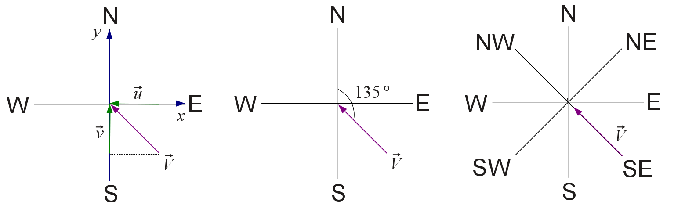

# Manipulação de Vetores {#manip-vectors}

```{r setup, include = FALSE}
rm(list = ls())
pcks <- c("knitr", "pander", "htmlTable")
easypackages::libraries(pcks)
opts_chunk$set(
  prompt = FALSE,
  cache = FALSE,
  fig.path = "images/",
  comment = "#>",
  collapse = TRUE
)
source("R/utils.R")
```


Neste capítulo veremos como manipular vetores, incluindo:

- como nomear vetores

- operação entre vetores

- gerar sequências

- a indexação de vetores


## Propriedades

+ `typeof()` para descobrir o tipo de dado

+ `length()` para descobrir o tamanho de um tipo de dado 

+ `attributes` (informações acionais específicas do dado), entre eles o atributo mais comum está o `names()`.


### Nomeando vetores


As 3 formas equivalentes mais comuns de criar vetores com nomes são demostradas abaixo com um exemplo de dados mensais de precipitação.

+ Durante a criação, com a função `c()` incluindo os nomes nos argumentos

```{r nv1, message=FALSE}
# vetor de chuva mensal para um dado ano
prec <- c(
  jan = 300, 
  fev = 150,
  mar = 210,
  abr = 12, 
  mai = 0, 
  jun = 0, 
  jul = 12, 
  ago = 22, 
  set = 80, 
  out = 100, 
  nov = 10,  
  dez = 280
  )
```

+ Modificando um vetor com a função `names()<-`

```{r nv2}
prec <- c(300, 150, 210, 12, 0, 0, 12, 22, 80, 100, 10, 280)
meses <- c("jan", "fev", "mar", "abr", "mai", "jun", "jul", "ago", "set", "out", "nov", "dez")
names(prec) <- meses
prec
```


+ Criando um vetor modificado

```{r nv3}
prec <- setNames(
  object = c(300, 150, 210, 12, 0, 0, 12, 22, 80, 100, 10, 280),
  nm = c("jan", "fev", "mar", "abr", "mai", "jun", "jul", "ago", "set", "out", "nov", "dez")
)
prec
```

Nomes não podem ser repetidos entre os elementos, porque a seleção de um subconjunto do vetor baseada nos nomes retornará somente o primeiro elemento que tiver nome repetido.

Embora não faça muito sentido, nem todos elementos precisam ter nomes. A saída da função `names()` retornará um vetor caracter vazio (\"\") para aqueles elementos sem nomes especificados. 

```{r chunk75}
(meses_pnm <- c(jan = 1, 2, 3))
names(meses_pnm)
```

Quando nenhum nome é especificado, `names()` retornará `NULL`.

```{r}
(meses_snm <- c(1, 2, 3))
names(meses_snm)
```


Para remover os nomes de um vetor, usamos a função `unname()` ou `names() <- NULL`.

```{r chunk76, message=FALSE}
prec_clim <- c(230, 205, 160, 100, 60, 30, 40, 60, 110, 165, 200, 220)
names(prec_clim) <- names(prec)
prec_clim
unname(prec_clim)
names(prec_clim) <- NULL
prec_clim
```


## Operações com vetores

Como o `R` é uma linguagem vetorizada, as operações são aplicadas a cada elemento do vetor automaticamente, sem a necessidade de laços (ou *loopings*) ao longo do vetor. Esta é uma das grandes vantagens do  `r rblue`.

Operações aritméticas podem ser aplicadas diretamente entre vetores.

```{r chunk78, message=FALSE}
# desvios da prec em relação a média climatológica
prec - prec_clim
# % do total anual
prec/prec_clim * 100
# transformação boxcox da prec com alpha = 0.2
(prec ^ 0.2 - 1)/0.2
prec %% 10
```

--- PAREI AQUI

Uma peculiaridade do `r rblue` é o tratamento de operações com vetores de tamanhos diferentes. O vetor menor é reciclado, de forma que seus elementos sejam repetidos em ordem até atingirem o tamanho do vetor mais longo envolvido na operação. 

```{r chunk711, message=FALSE}
(vetor_dbl <- c(-1.5, 0.3, 1.4, 2.0))
cte <- 4
vetor_dbl * cte
quatros <- c(4, 4, 4, 4)
vetor_dbl * quatros
```

O número 4 nesse caso é reciclado 4 vezes e então multiplicado por cada elemento de `vetor_dbl`.


```{r chunk79, message=FALSE}
v2 <- c(2, 1)
vetor_dbl + v2
```

Se o vetor mais longo não é múltiplo do mais curto, o `r rblue` imprime um aviso.

```{r chunk710, message=FALSE}
v3 <- c(2, 1, 3)
vetor_dbl + v3
```

A reciclagem é intrinsecamente usada em operações envolvendo vetores.

Operações aritméticas podem ser feitas com vetores lógicos, como nos exemplos abaixo:

```{r chunk10}
c(TRUE, TRUE, FALSE) * 5
TRUE * 4
TRUE + TRUE
FALSE - TRUE
```

### Comparações

Vetores lógicos resultam da comparação de números ou caracteres. A Tabela \@ref(tab:oper-logic) apresenta os principais operadores lógicos para comparações.

```{r oper-logic, echo = FALSE, warning=FALSE}
# <a name="tab-oper-logic"></a>
oper <- c("<", "<=", ">", ">=", "==", "!=", "!x", "x | y", "x & y", "isTRUE(x)", "%in%")
desc <- c("menor que", " menor ou igual a", "maior que", "maior ou igual", "idêntico", "diferente", "não é x (negação)", "x ou y", "x e y", "teste se x é verdadeiro", "está contido em")
oper_logic <- data.frame(
  Operador = oper,
  Descrição = desc,
  stringsAsFactors = FALSE
)
kable(oper_logic, caption = "Operadores Lógicos", align = "c")
```

Este conjunto de operadores permite diversas comparações entre vetores, por exemplo: 

- quais elementos do `vetor_dbl` (da seção \@ref(build-vectors)) são negativos?

```{r}
prec - mean(prec) < 0
```

- quais elementos de `prec` são maior que os de `prec_clim`?

```{r chunk713, message=FALSE}
prec > 100
```

O operador `%in%` serve para verificar se um vetor está contido parcial ou totalmente em outro vetor.

```{r }
# operador está contido em
c(200, 150, 100) %in% prec
# 2:4 são elementos de x?
is.element(c(200, 150, 100), prec)
```


Nos exemplos acima, vimos como buscar os os elementos de um vetor para apenas uma condição. Entretanto, frequentemente precisamos testar mais condições, ou seja, combinar comparações. Por exemplo, para condições do tipo:

- $0 < prec \leq 100$ 
- $x < 50$  ou $x \geq 150$ 

precisamos usar os operadores relacionais:

- `&` e `&&` (\"e"\)

- `|` e `||` (\"ou"\)

A ordem das operações pode ser controladas por parênteses. Os operadores `&` e `|` são vetorizados (retornam vetores de mesmo tamanho que os vetores testados). 


```{r}
horas <- 0:23
# noite
horas < 6 | horas > 18
# dia
horas >= 6 & horas <= 18
# dia
!(horas < 6 | horas > 18)
```


A forma dupla (`&&` ou `||`) compara somente um elemento de cada lado, enquanto a forma normal (`&` e `|`), compara cada elemento dos vetores em cada lado.

```{r chunk7290, message=FALSE}
a <- c(1, 1, 0, 1)
b <- c(2, 1, 0, 1)
# forma normal verifica cada elemento de a e cada elemento de b
a == 1 & b == 1
# forma dupla verifica somente o primeiro elemento de a e o primeiro elemento de b
# retornando somente um resultado
a == 1 && b == 1
```

```{r chunk72901, message=FALSE  , echo=FALSE, out.width=200}
oper <- c("a", "b", "a==1", "b==1", "a == 1 & b == 1", "a == 1 && b == 1")
desc <- data.frame(
  a,
  b,
  a == 1,
  b == 1,
  a == 1 & b == 1,
  a == 1 && b == 1
)
names(desc) <- oper
desc[2:nrow(desc), 6] <- ""
pander(desc, caption = "Demostração da diferença entre & e &&.")
```

Podem haver mais que duas condições a serem testadas. As condições podem ser combinadas usando múltiplos `&` ou `|`. As diferentes condições podem ser agrupadas por parênteses assim como operações matemáticas. 


### Funções `any` e `all`

Estas funções fornecem um único valor (vetor lógico de tamanho 1) para resumir ou descrever o resultado da condição aplicada ao vetor.

```{r chunk715, message=FALSE  }
vetor <- c(0, 1, -1, -2, 3, 5, -5)
all(vetor < 0) # todas as posições são maiores que 0 ?
any(vetor > 0) # alguma posição é maior que 0?
```

- `all()` verifica se a condição avaliada é válida para todos elementos de um vetor;
- `any()` verifica se a condição avaliada é válida para pelo menos um dos elementos de um vetor;


## Sequências 

Vimos nas seções anteriores que é muito simples criar sequências de números inteiros com o operador `:`.  Nesta seção veremos outras formas de gerar sequências, como uma sequência de números não inteiros e sequências de números repetidos. 

### Sequências de números inteiros

Sequências de números formam um vetor. Há diversas formas de se gerar sequências no R. Para gerar uma sequência de 1 até 365, em vez de escrevermos cada número e combiná-los usando `c(1,2,3,...,365)`, podemos usar o operador `:` da seguinte forma:
 
```{r chunk716, message=FALSE}
# dias do ano
dda <- 1:365
dda
# sequencia de inteiros decrescente
si_dec <- 10:-10
si_dec
# sequencia de numeros não inteiros
seqn <- 1.5:10
seqn
c(seqn, 10)
```

### Sequências de números não inteiros

Para gerar uma sequencia de números reias há a função `seq()`.

```{r chunk717, message=FALSE  }
# igual a c(snum, 10), mas usando o seq
(snum_b <- seq(
  from = 1.5,
  to = 10,
  by = 0.5
))
```

Exemplos de sequência de anos, meses e dias.
```{r chunk718, message=FALSE  }
# vetor com de anos decimais (2 valores por dia)
anos_dec <- seq(2010, 2011, length.out = 365 * 2)
# para ver só o início do vetor ao invés de todo o vetor
head(anos_dec)
# mas não dá pra ver a parte decimal, vamos alterar as opções
# aumentando as casas decimais
options(digits = 6)
# verifique agora
head(anos_dec)
# só os primeiros 30 elementos
head(anos_dec, 30)
# para ver só o final do vetor yrFrac
tail(anos_dec)
# para ver só os último 50 elementos do yrFrac
tail(anos_dec, 50)
# pentadas
pent <- seq(from = 1, to = 365, by = 5)
# dencendios
decd <- seq(from = 1, to = 365, by = 10)
# fracoes de dia
frac_d30mn <- seq(0, 365, length.out = 365 * 48) + 1
head(frac_d30mn, 48 * 2)
tail(frac_d30mn, 48 * 2)
# diferentes funções para gerar uma sequência
an <- c(1, 7, 2, 5, 3, 2)
# gerando uma sequencia a partir de um número
seq_len(length.out = 6)
# gerando uma sequência a partir de um número
seq(6)
# de acordo com o tamanho do vetor gera-se uma sequencia
seq(along = an)
seq(along = 0) # ! melhor opção para gerar sequencias do tamanho do vetor
seq(0) # ! cuidado, veja ?seq para entender a razão desse resultado inusitado
# conflito entre parâmetros
# a <-seq(from = -5, to = 5, by = 0.05, length.out=200)
s5by <- seq(from = -5, to = 5, by = 0.05)
length(s5by)
tail(s5by)
s5len <- seq(from = -5, to = 5, length.out = 200)
length(s5len)
tail(s5len)
```

### Sequências de números repetidos

```{r chunk719, message=FALSE   }
rep_t4 <- rep(1:2, times = 4)
rep_t4
rep_e31 <- rep(1:12, each = 31)
rep_e31
rep_t13 <- rep(c("chuva", "sol"), times = c(1, 3))
rep_t13
rep_t13_t4 <- rep(rep(c("chuva", "sol"), times = c(1, 3)), times = 4)
rep_t13_t4
```        


## Indexação de vetores {#index-vetores}

Os elementos de um vetor são indexados e para acessá-los usamos a notação de índices do `r rblue`. 

Podemos selecionar partes de um vetor por números (posição do elemento), caracteres (nome) e vetores lógicos. 

Através do operador `[` podemos acessar ou filtrar elementos de um vetor. O operador colchete `[` aplicado a um vetor retornará um vetor.

Considere os seguintes vetores como exemplo:

```{r chunk720, message=FALSE }
prec
```

Como selecionar o valor de chuva e temperatura só para janeiro?

Usando a seguinte sintaxe: 

`vetor[i]`

onde `i` representa o índice dos elementos a serem selecionados.

### Indexação por vetores inteiros

#### Positivos

Para selecionar o valor de chuva e temperatura só para janeiro, digitamos:

```{r chunk721, message=FALSE }
prec_jan <- prec[1]
prec_jan
```

Como selecionar os últimos valores do vetor de chuva?

```{r Chun722, message=FALSE  }
prec_dez <- prec[length(prec)]
prec_dez
```

Como selecionar os valores de chuva do trimestre JJA e de temperatura para o trimestre DJF?

```{r chunk723, message=FALSE }
sel_prec <- c(6, 7, 8)
# vetor de chuva JJA
prec_jja <- prec[sel_prec]
prec_jja
# total de chuva trimestral nesse ano
prect_jja_tot <- sum(prec_jja)
prect_jja_tot
```

#### Negativos

Como selecionar todos valores menos o primeiro e o último?

```{r chunk724, message=FALSE }
# exceto o primeiro e ultimo
prec[-c(1, length(prec))]
```

###  Indexação por nomes

```{r chunk727c, message=FALSE }
prec["Jan"]
prec[c("Dez", "Fev", "Jun")]
```

### Indexação por vetores lógicos

Vamos criar um vetor lógico e usá-lo para exemplificar a seleção lógica de elementos de um vetor. 

```{r chunk725, message=FALSE}
vetor_l <- c(
  TRUE, FALSE, FALSE, TRUE,
  TRUE, FALSE, TRUE, FALSE,
  TRUE, FALSE, FALSE, TRUE
)
meses[vetor_l]
```        

Os elementos de `vetor_l` correspondentes a `TRUE` foram selecionados. Aplicando-se a função `sum()` a um vetor lógico obtemos o total de elementos verdadeiros:

```{r chunk726, message=FALSE}
sum(vetor_l)
```       

Vamos considerar agora a seguinte forma do vetor lógico (`vetor_l`) e relembrar da **coerção** de vetores.

```{r chunk727, message=FALSE  }
# vetor lógico
vetor_l <- c(TRUE, FALSE)
meses[vetor_l]
vetor_l <- c(TRUE, FALSE, FALSE)
meses[vetor_l]
prec[c(TRUE, FALSE)]
``` 

A indexação pode ser feita também por comparações:

```{r chunk728, message=FALSE  }
# vetor prec
prec
# teste para chuva > 80 mm/mês
prec > 80
# salvando resultado do teste
prec_alta <- prec > 80
# extraindo valores atendidos ao teste
prec[prec_alta]
# teste para meses com chuva abaixo da média mensal
(prec_med <- mean(prec))
# salvando resultado do teste
(prec_baixa <- prec < prec_med)
# extraindo valores que atendem a condição
prec[prec_baixa]
# extraindo os 3 primeiros meses com prec abaixo da média
prec[prec_baixa][1:3]
# forma equivalente em uma linha só
prec[prec < mean(prec)][1:3]
# teste para meses com prec diferente de zero
prec[prec != 0]
``` 

Vimos que a filtragem consiste em extrair elementos de um vetor que satisfaça uma (ou várias) condição(ões). Entretanto, em alguns casos, o interesse é na posição dentro do vetor na qual a condição é verdadeira Nós podemos localizar essas ocorrências usando a função `which()`:

```{r chunk730, message=FALSE}
# prec sem nomes
names(prec) <- NULL
# combinação de operador lógico e relacional
prec_alta
which(prec_alta)
# qual os meses em que a chuva foi acima da media
which(prec > prec_med)
prec[which(prec > prec_med)]
``` 


### Substituição de elementos de um vetor

```{r chunk732, message=FALSE}
# posição a ser alterada
pos <- 10
# valor da prec naquela posição
prec_velha <- prec[pos]
prec_velha
# vetor de prec
prec
# substituição do valor original por um novo valor
prec_nova <- 30
# alterando prec do mês de outubro
prec[pos] <- prec_nova
prec
```
  
A substituição também pode ser feita também pelo nome das variáveis.

```{r chunk733, message=FALSE}
prec
prec["Mai"] <- 5
```


### Vetores nulos e elementos faltantes

Seja qual for a razão, ao realizar um experimento em condições reais sempre haverá situações em que não conhecemos o valor de uma determinada variável. Por exemplo, a série de uma variável meteorológica medida em estação de superfície, sempre ocorrem datas em que não há registro da variável. Falha instrumental, dado não coletado pelo observador, falta de energia, são causas inerentes de falhas em séries climáticas de longo prazo. 
No R dados faltantes são representados pela string `NA`.

```{r chunk735, message=FALSE  , error = TRUE}
v1 <- c(1:8, NA)
v1 > 5 # NA sai na resposta
# teste lógico com o operador idêntico "=="
v1 == NA
# não funcionou, porque há funções específicas para vetores com NA
onde_falta <- is.na(v1)
# função apropriada p/ checar se tem NAs
faltante <- which(is.na(v1))
v1[-faltante]
# ou
v1[!onde_falta]
# mas o R possui a função mean
mean(v1)
# não retornou o que desejamos, removendo as posicoes dos dados faltantes
mean(v1[-faltante])
# ok, mas olhando o help ...
# ?mean
mean(v1, na.rm = TRUE)
# definir como faltante todos elementos de v1
v1[] <- NA
v1
length(v1)
# vetor com dados faltantes indicados por -999
# substituir onde é -999 por NA
x_falt <- c(-999, 10, 15, -999, 50)
x_falt == -999
x_falt[x_falt == -999] <- NA
# total de dados faltantes
sum(!is.na(x_falt))
```


### Dados Nulos (`NULL`)

O `NULL` é um tipo de dado especial de dado no R. Ele é um vetor de tamnho zero.

```{r chunk738, message=FALSE, error=TRUE}
# v1 existe ?
ls()
exists("v1")
# vamos anular todo v1
v1 <- NULL
ls()
v1
# NULL
vetor1 <- c()
vetor2 <- NULL
is.null(c(vetor1, vetor2))
# vetor1 e vetor2 são equivalentes?
identical(vetor1, vetor2)
# remoção de elementos de um vetor com NULL
a <- c(10, 2, NA, 20)
a
typeof(a)
# remover de a o dado faltante
a <- a[!is.na(a)]
a
# é possível remover um elemento com o NULL?
a[length(a)] <- NULL
a
a <- a[-length(a)]
a
typeof(a)
# anulando a
a <- NULL
# qual modo de um objeto nulo?
typeof(a)
# qual modo de NA?
b <- NA
b
typeof(b)
length(a)
length(b)
```

 

### Exercícios

1. Crie um vetor com os valores de $e^{x}cos{x}$ para os valores de $x = (3, 3.1, 3.2, ..., 6$).


- - - 


2. Crie os seguintes vetores.
    a. $(0.1^{3}\times0.2^{1}, 0.1^{6}\times0.2^{4}, ..., 0.1^{36}\times0.2^{34})$  
    
`r paste(" ")`
    b. $(2, \frac{2^{2}}{2}, \frac{2^{3}}{3}, ..., \frac{2^{25}}{25})$  
    


- - -

3. Reproduza a criação do vetor dias da semana (`dds`) mostrado abaixo.


- - -

4. Escreva os códigos necessários para determinar:  

`r paste("  ")`a. o vetor lógico indicando quais números são pares na sequência de valores `r set.seed(2); paste0(paste( (nums <- sample(1:100, 10)) , collapse = ", "))`. Calcule o total de números ímpares.

`r paste("  ")`b. Se um ano é bissexto. Verifique os resultados de seu código para os anos `r set.seed(2); paste( (anos <- sample(1890:2015, 10)) , collapse = ", ")`. Calcule o total de anos com 365 dias.


- - -

5. Quais códigos para gerar os seguintes dados:
  a.
```{r, eval=TRUE,echo=FALSE,comment=""}
(tar0 <- c(-20, seq(0, 40, by = 10)))
```
  b.
```{r, eval=TRUE,echo=FALSE,comment=""}
(seq(-1, 1, by = 1 / 4))
```
  c.
```{r , eval=TRUE,echo=FALSE,comment=""}
(seq(-pi, pi, length.out = 12))
```
  d.
```{r , eval=TRUE,echo=FALSE,comment=""}
rep(1:5, times = 5:1)
```
  e.
```{r , eval=TRUE,echo=FALSE,comment=""}
rep(c(1:5, 4:1), times = c(5:1, 2:5))
``` 

  f. Dica: lembre da função `rep()` e seus argumentos `each` e `times`. Experimente usar vetores nesses argumentos.
  
  g. Como a partir da matriz gerada na letra *f* você pode obter a matriz abaixo?
  


  h. Qual o código para converter a matriz gerada na letra *g* no vetor abaixo?
  

- - - 

6. Como obter as seguintes sequências a partir dos vetores fornecidos usando a mesma solução para todos casos?

```{r , eval=TRUE,echo=FALSE,comment=""}
v3 <- c(10, 0.5, 8, 4)
``` 

   a. v3 = `r paste0("(", paste(v3 , collapse = ", "), ")")`

```{r, eval=TRUE,echo=FALSE,comment=""}
1:length(v3)
``` 

```{r Chunk7b, eval=TRUE,echo=FALSE,comment=""}
v2 <- c(10, 0.5)
``` 

  b. v2 = `r paste0("(", paste(v2 , collapse = ", "), ")")`

```{r Chunk7b_sol, eval=TRUE,echo=FALSE,comment=""}
1:length(v2)
```

```{r Chunk7c, eval=TRUE,echo=FALSE,comment=""}
v1 <- c(10)
``` 
  c. v1 = `r paste0("(", paste(v1 , collapse = ", "), ")")`


```{r Chunk7c_sol, eval=TRUE,echo=FALSE,comment=""}
1:length(v1)
```

```{r Chunk7d, eval=TRUE,echo=FALSE,comment=""}
v0 <- c()
``` 

  d. v0 = `r paste0("(", paste(v0 , collapse = ", "), ")")`


```{r Chunk7d_sol, eval=TRUE,echo=FALSE,comment=""}
# 1:length(v0)
seq_along(v0)
```

- - -

7. (a) Calcule a soma cumulativa dos números `r 2:6`. Dica: ver a função `cumsum()`. (b) Calcule a soma cumulativa destes números mas na ordem reversa. Dica: ver a função `rev()`.


- - -

8. Os dados abaixo são de precipitação horária de um evento severo ocorrido em 03/12/2012 em Santa Maria-RS. 

```{r, echo = FALSE}
hora <- (12:24) - 3
prec_h <- c(0, 0, 0, 0, 0, 0, 0, 21.4, 41.2, 2.6, 1, 0.4, 0)
evento <- data.frame(hora, prec = prec_h)
knitr::kable(evento, align = "c", longtable = TRUE)
```

a. Como seria o código para determinar a soma cumulativa da precipitação horária? Salve seu resultado em um vetor chamado `prec_acum`. Interprete o resultado `c(NA, diff(prec_acum))`.

```{r, include = FALSE}
(prec_acum <- cumsum(prec_h))
```

b. Mostre o código para encontrar o horário de ocorrência da precipitação máxima?

```{r, include = FALSE}
hora[which.max(prec_h)]
```

c. Mostre o código para obter a hora de início e fim do evento de  precipitação severa. Qual foi a duração do evento?

```{r, include = FALSE}
(inicio <- hora[prec_h > 0][1])
(fim <- hora[max(which(prec_h > 0))])
fim - inicio + 1
sum(prec_h > 0)
```

d. Qual foi a precipitação total do evento? Quanto da precipitação total do evento, em %, ocorreu até às 17 h?

```{r, include = FALSE}
tot_evento <- sum(prec_h)
perc_rel <- prec_h / tot_evento * 100
perc_rel
perc_rel_cum <- cumsum(perc_rel)
perc_rel_cum[hora == 17]
round(perc_rel_cum[hora == 17])
```


- - -

9. EXERCÍCIO RESOLVIDO. Considere o vetor `x` definido pelos números descritos abaixo. Mostre como  encontrar o primeiro número positivo localizado após o último número negativo. Por exemplo, seja o vetor `z` definido pelos valores (11, 10, 15, 2, 6, -15, -10, -22, -8, 5, 7, 2, 12, 8, 4, 1, 3, -3, -1, 30, 14). Os valores selecionados seriam 5 e 30.

Um possível código para chegar a esse resultado seria:

```{r}
x <- c(
  11, 10, 15, 2, 6, -15, -10, -22, -8, 5,
  7, 2, 12, 8, 4, 1, 3, -3, -1, 30, 14
)
# x1 <- ifelse(x > 0, 1, 0)
# cópia de x
x01 <- x
# substituo x positivo por 1 e x negativo por 0
x01[x > 0] <- 1
x01[!x > 0] <- 0
res <- x[which(diff(x01) == 1) + 1]
res
```

- - -

10. Mostre o código para resolver as seguintes tarefas. Considere o vetor `prec` com valores de precipitação diária indicado abaixo.

```{r Chunk10, echo=FALSE, eval=FALSE}
# como gerar vetor de precipitações
vprec <- c(
  0, 0, 1, 1, 0, 1, 0, 0, 1, 1, 1, 0, 0, 1, 0, 0, 0, 0, 0, 0, 0,
  1, 0, 0, 0, 0, 0, 1, 0, 1, 0, 1, 0, 0, 1, 0, 0, 1, 0, 1, 1, 0,
  0, 1, 0, 0, 0, 0, 1, 1, 0, 0, 0, 0, 1, 1, 1, 1, 0, 1, 0, 1, 0,
  1, 1, 1, 0, 0, 0, 0, 0, 1, 0, 0, 0, 1, 0, 1, 1, 1, 0, 0, 0, 0,
  0, 1, 0, 1, 0, 1, 0, 0, 0, 0, 0, 0, 0, 0, 0, 0, 0, 1, 0, 1, 0,
  0, 1, 1, 1, 1, 1, 1, 0, 0, 1, 0, 0, 0, 1, 1, 0, 1, 1, 0, 1, 0,
  0, 0, 1, 1, 1, 1, 1, 1, 0, 0, 0, 1, 1, 1, 0, 0, 0, 0, 0, 1, 0,
  1, 0, 1, 0, 1, 1, 1, 0, 1, 0, 0, 0, 1, 0, 1, 1, 0, 0, 0, 0, 1,
  1, 0, 0, 0, 0, 1, 0, 1, 1, 0, 0, 0, 1, 1, 0, 1, 1, 0, 0, 0, 0,
  0, 1, 0, 0, 1, 0, 0, 1, 1, 1, 1, 0, 0, 0, 0, 0, 1, 0, 0, 0, 0,
  0, 1, 0, 0, 1, 0, 0, 1, 0, 0, 1, 1, 0, 0, 0, 0, 0, 0, 1, 0, 0,
  0, 0, 0, 0, 1, 0, 0, 0, 0, 1, 0, 1, 0, 0, 0, 0, 0, 0, 0, 0, 1,
  0, 1, 1, 0, 0, 0, 0, 0, 1, 0, 0, 1, 0, 1, 0, 0, 0, 1, 1, 0, 1,
  1, 1, 0, 1, 0, 0, 0, 0, 1, 0, 1, 1, 0, 0, 0, 0, 0, 0, 1, 0, 1,
  1, 0, 1, 1, 1, 0, 0, 0, 1, 1, 0, 0, 0, 0, 1, 0, 1, 0, 0, 0, 1,
  1, 0, 1, 0, 0, 0, 1, 0, 0, 0, 1, 0, 0, 0, 0, 0, 1, 0, 0, 1, 0,
  1, 0, 0, 0, 1, 0, 0, 0, 1, 0, 1, 1, 1, 0
)
prec <- vprec
prec[vprec > 0] <- runif(sum(vprec > 0)) * sample(c(0.1, 1, 5, 10, 20), size = sum(vprec > 0), replace = TRUE, prob = c(0.1, 0.30, 0.3, 0.2, 0.1))
prec
dput(round(prec, 2))
```

```{r Chunk10a, message=FALSE, echo=TRUE, eval=TRUE}
prec <- c(
  0, 0, 0, 0.8, 0, 0.01, 0.75, 0,
  0, 0, 0, 0.35, 0.08, 0, 0, 0, 0, 0.31, 0, 3.57, 12.17, 0, 0,
  0, 0.04, 3.16, 0, 0.95, 0.79, 0, 0, 0, 0, 0, 3.51, 0, 0, 0.16,
  0, 0, 8.16, 0.54, 4.39, 1.24, 0, 0, 0, 0, 0, 2.43, 0, 0, 0, 0,
  0, 7.18, 0, 0, 0.26, 0, 0, 0.28, 0, 0, 0.09, 0.38, 0, 0, 0, 0,
  0, 0, 0.51, 0, 0, 0, 0, 0, 0, 0.67, 0, 0, 0, 0, 0.15, 0, 0.82,
  0, 0, 0, 0, 0, 0, 0, 0, 0.37, 0, 0.58, 4.95, 0, 0, 0, 0, 0, 7.68,
  0, 0, 0.37, 0, 1.56, 0, 0, 0, 0.34, 0.48, 0, 4.21, 2.28, 4.3,
  0, 3.38, 0, 0, 0, 0, 7.28, 0, 4.89, 3.91, 0, 0, 0, 0, 0, 0, 2.93,
  0, 2.49, 0.77, 0, 2.9, 3.53, 0.83, 0, 0, 0, 0.94, 0.59, 0, 0,
  0, 0, 0.04, 0, 0.65, 0, 0, 0, 6.23, 0.09, 0, 0.66, 0, 0, 0, 4.42,
  0, 0, 0, 0.84, 0, 0, 0, 0, 0, 0.09, 0, 0, 0.08, 0, 0.66, 0, 0,
  0, 0.06, 0, 0, 0, 3.28, 0, 0.8, 5.69, 0.8, 0
)
```

  (a) Quantos dias ocorreram no intervalo 0 < prec < 0.25?
  
```{r Chunk10a1, echo=FALSE, eval=TRUE, results = FALSE}
n_ev <- sum(prec > 0 & prec < 0.25)
n_ev
vals_ev <- prec[prec > 0 & prec < 0.25]
vals_ev
```

  (b) Substitua os valores de chuva registrados no intervalo 0 < prec < 0.25 por 0.
  
```{r Chunk10b, echo=FALSE, eval=TRUE, results = FALSE}
prec[prec > 0 & prec < 0.25] <- 0
prec
```  

  (c) Crie um vetor denominado `prec01` indicando o estado da precipitação (chuvoso = 1, seco = 0) baseado no limiar de 0.25 mm para detecção de chuva pelo pluviômetro. 
```{r Chunk10c, echo=FALSE, eval=TRUE, results = FALSE}
limiar <- 0.25
prec01 <- as.integer(prec > limiar)
# prec01
prec_estado <- prec01
prec_estado[prec_estado == 1] <- "chuvoso"
# prec_estado
prec_estado[prec_estado == "0"] <- "seco"
prec_estado
```

  (d) Qual a probabilidade de chuva dessa série de precipitação diária?
  
```{r Chunk10d, echo=FALSE, eval=TRUE, results = FALSE}
prob <- sum(prec01) / length(prec01)
prob <- mean(prec01)
# %
prob_perc <- mean(prec01) * 100
prob
prob_perc
``` 

  (e) Qual a probabilidade de chover dois dias consecutivos (`p11`)? Calcule a probabilidade de chover em qualquer um de dois dias consecutivos (`p01 + p10`)?

```{r Chunk10e, message=FALSE, echo=FALSE, eval=TRUE, results=FALSE}
choveu <- data.frame(
  hoje = prec01[-length(prec01)],
  amanha = prec01[-1]
)
choveu
# p11: núm de eventos com chuva em dois dias consecutivos /núm. de combinações de 2 dias
prob11 <- with(
  choveu,
  sum(hoje == 1 & amanha == 1) / length(amanha) * 100
)
prob11
# p01
prob01 <- with(
  choveu,
  sum(hoje == 0 & amanha == 1) / length(amanha) * 100
)
prob01
# p10
prob10 <- with(
  choveu,
  sum(hoje == 1 & amanha == 0) / length(amanha) * 100
)
prob10
prob10 == prob01
# sum(sapply(1:(length(prec01)-1), function(i) if(prec01[i] == 1 & prec01[i+1] == 1) 1 else 0))/length()
# numero de vezes que choveu ou hoje ou amanhã: p(1|1)
prob12 <- with(
  choveu,
  sum(hoje != amanha) / length(amanha) * 100
)
prob12
# p00
prob00 <- with(
  choveu,
  sum(hoje == 0 & amanha == 0) / length(amanha) * 100
)
prob00
# somas das probalidades deve ser igual a 1
prob12 + prob11 + prob00
```

```{r Chunk10e1, echo=FALSE, eval=TRUE, results='hide'}
## PARA MELHOR VISUALIZAÇÃO
# data frame para visualização de casos de prec com 2 consecutivos
conds_df <- with(
  choveu,
  data.frame(hoje,
    amanha,
    cond00 = hoje == 0 & amanha == 0,
    cond11 = hoje == 1 & amanha == 1,
    cond01 = (hoje == 0 & amanha == 1),
    cond10 = (hoje == 1 & amanha == 0),
    cond12 = (hoje != amanha)
  )
)
# dia que não permite comparação para as transições de estado
# conds_df <- conds_df[complete.cases(conds_df), ]
(probs <- colSums(conds_df) / nrow(conds_df))
# verificação das probabilidades
(probs_sum <- sum(probs[-c(1:2, 7)]))
```

  (f) Determine a duração de cada evento chuvoso (número de dias consecutivos).
   
> Dica: comece encontrando a posição do início do evento e depois a posição final do envento. A diferença entre as posições fornece a duração do evento. O exercício resolvido (9) é análogo a esse exercício.

```{r Chunk10f, echo=FALSE, eval=TRUE, results='hide'}
# posições iniciais do evento
posi <- which(diff(c(0, prec01)) == 1)
# posições finais do evento
posf <- c(which(diff(c(prec01, 0)) == -1))
# duracao de cada evento
duracao <- posf - posi + 1
# duracao
names(duracao) <- paste("evento", 1:length(duracao), sep = "")
```

O resultado esperado é um vetor que identifique o evento e sua duração.

```{r Chunk10f1, eval=TRUE, results = 'hide'}
duracao <- c(evento1 = 1, evento2 = 1, evento3 = 1, evento4 = 1, evento5 = 2, 
evento6 = 1, evento7 = 2, evento8 = 1, evento9 = 4, evento10 = 1, 
evento11 = 1, evento12 = 1, evento13 = 1, evento14 = 1, evento15 = 1, 
evento16 = 1, evento17 = 1, evento18 = 1, evento19 = 2, evento20 = 1, 
evento21 = 1, evento22 = 1, evento23 = 2, evento24 = 3, evento25 = 1, 
evento26 = 1, evento27 = 2, evento28 = 1, evento29 = 2, evento30 = 3, 
evento31 = 2, evento32 = 1, evento33 = 1, evento34 = 1, evento35 = 1, 
evento36 = 1, evento37 = 1, evento38 = 1, evento39 = 3)
```

```{r}
duracao
```


- - -

11. EXERCÍCIO RESOLVIDO. Dado o vetor `temp` mostrado abaixo.

```{r Chunk111, echo=FALSE, eval=TRUE}
temp <- sample(0:30, 30)
temp[2:4] <- NA
temp[10:15] <- NA
temp[23:29] <- NA
# dput(temp)
temp <- c(
  NA, NA, 27L, 7L, 4L, 0L, 26L, 15L, 25L, NA, NA, NA, NA, 6L,
  29L, 18L, 17L, 23L, 20L, 1L, 30L, 13L, NA, NA, NA, NA, NA, NA,
  NA, 19L
)
```
```{r Chunk112}
temp <- c(
  NA, NA, 27L, 7L, 4L, 0L, 26L, 15L, 25L, NA, NA, NA, NA, 6L,
  29L, 18L, 17L, 23L, 20L, 1L, 30L, 13L, NA, NA, NA, NA, NA, NA,
  NA, 19L
)
```

   a. Como você pode codificar a obtenção de um vetor com zeros nos valores válidos e com números sequenciais dentro das falhas?

```{r Chunk11a}
# vetor lógico de falhas
eh_falha <- is.na(temp)
# soma cumulativa de falhas
acum_falhas <- cumsum(eh_falha)
# calculando soma a partir do início da falha
seq_falhas <- acum_falhas - cummax((!eh_falha) * acum_falhas)
seq_falhas
```


   b. Como a partir do vetor resultante em *11.b* obter um vetor cujo os valores
dentro das falhas indique a ordem de ocorrência da falha.

```{r Chunk11c}
(ordem_falhas <- cumsum(seq_falhas == 1) * as.integer(eh_falha > 0))
```

   c. Qual o tamanho de cada falha.
   
```{r}
pos_fim_falha <- which(c(NA, diff(ordem_falhas)) < 0) - 1
(tamanho_falhas <- seq_falhas[pos_fim_falha])
# names(tamanho_falhas) <- paste0("falha", unique(ordem_falhas[ordem_falhas > 0]))
names(tamanho_falhas) <- paste0("falha", seq_along(tamanho_falhas))
tamanho_falhas
```

   d. Determine o tamanho da maior falha?

```{r}
(max_falha <- max(tamanho_falhas))
```

- - -

12. Para os valores de velocidade ($V_h$) e a direção do vento ($\theta$) (na convenção meteorológica):

```{r Chunk12, include=FALSE}
ws <- c(10, 10, 10, 10, 14.142, 14.142, 14.142, 14.142, 0)
wd <- c(270, 180, 360, 90, 225, 315, 135, 45, 0)
```

$V_h$ = `r paste0("(", paste(ws , collapse = ", "), ")")`

$\theta$ = `r paste0("(", paste(wd , collapse = ", "), ")")`

   a. Determine as componentes zonal e meridional do vento.
   
   $$u = -V_{h} \cdot sin(\theta_{rad})$$
   $$v = -V_{h} \cdot cos(\theta_{rad})$$


   b. Faça os cálculos necessários para reconstruir $V_h$ e $\theta$ a partir de $u$ e $v$ determinados no item **a**. Por convenção, a direção do vento $\theta$ em condições calmas ($V_h$ < 0.5 m s^-1^) é assumida como 0°.

$$V_{h} = \sqrt{(u^2 + v^2)}$$
$$\theta_{mat} = {\rm atan2}(-u, -v)\cdot\frac{180}{\pi}$$
$$
\theta = \left\{\begin{matrix}
\theta_{mat} + 360 & se & \theta_{mat} < 0 \\ 
0 & se & u = 0,\:  v = 0 \: \:  ou \: \:  V_{h} < 0.5\\
\end{matrix}\right.
$$


Como resultado monte um dataframe com todas variáveis derivadas.

```{r, eval = TRUE, echo = FALSE}
uv_df <- structure(list(u = c(10, 0, 0, -10, 10, 10, -10, -10, 0), v = c(0, 
10, -10, 0, 10, -10, 10, -10, 0), ws = c(10, 10, 10, 10, 14.142, 
14.142, 14.142, 14.142, 0), wd = c(270, 180, 360, 90, 225, 315, 
135, 45, 0), wd_uv = c(270, 180, 360, 90, 225, 315, 135, 45, 
0), dir = structure(c(6L, 9L, 5L, 2L, 8L, 4L, 7L, 3L, 1L), .Label = c("Calmo", 
"Leste", "Nordeste", "Noroeste", "Norte", "Oeste", "Sudeste", 
"Sudoeste", "Sul"), class = "factor")), class = "data.frame", row.names = c(NA, 
-9L))
knitr::kable(uv_df)
```


> Dica: ver figura abaixo.




- - -


13. Para as séries de `prec_obs` e `prec_sim` calcule:

- a proporção corretamente prevista $PC = \frac{wc+dc}{n}$ 
- o índice de sucesso crítico $CSI=\frac{wc}{wc+wi+di}$. 

Onde $wc$ e $dc$ são as previsões corretas de dias úmidos ($prec > 0.25$ mm dia^-1^) e secos respectivamente, $wi$ e $di$ são as previsões incorretas de dias úmidos e secos respectivamente. $n$ é o n° total de previsões.

```{r , include=TRUE}
prec_obs <- c(
  0, 0, 0, 0.5, 1, 6, 9, 0.2, 1, 0, 0, 0.25,
  10, 15, 8, 3, 0, 0, 0, 0, 0, 0, 0.25, 0,
  0, 0, 1, 5, 0, 20, 0, 0, 0, 0, 1, 1,
  0, 2, 12, 1, 0, 0, 0, 0, 0, 0, 5, 5
)
prec_sim <- c(
  0, 0.2, 0.1, 0, 0, 3, 1, 1, 1, 1, 0, 3,
  0, 10, 4, 1, 0.3, 0.5, 0.5, 0.5, 0.5, 0, 0.25, 0.25,
  0.25, 0, 0.5, 3, 0, 5, 0, 0, 0, 0, 0.5, 0,
  0.25, 0.2, 0, 0.2, 0, 0, 0, 0, 1, 2, 1, 0
)
```


- - -

14. Escreva o código para calcular o coeficiente de correlação de Pearson (`r`) entre os vetores `obs` e `prev`. 


Confira seu resultado com a saída da função `cor(obs, prev)`. 

```{r , include=TRUE}
obs <- c(
  -0.49, 0.27, -0.48, 0.8, -1, 0.1, -1.16,
  0.58, -1.6, -0.31, 0.45, -0.98, 0.19, 0.73,
  -0.49, -0.04, -0.11, 0.46, 2.02, -1.05
)
prev <- c(
  NA, -0.49, 0.27, -0.48, 0.8, -1, 0.1, -1.16,
  0.58, -1.6, -0.31, 0.45, -0.98, 0.19, 0.73,
  -0.49, -0.04, -0.11, 0.46, 2.02
)
```


- - - 

15. Construa uma função para converter valores de temperatura em K para °C e outra para converter ângulos de radianos para graus. Utilize dois exemplos para mostrar que suas funções funcionam corretamente.


