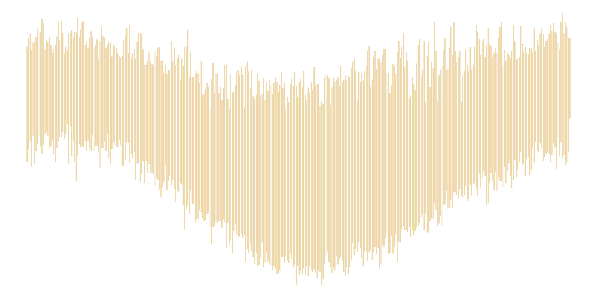
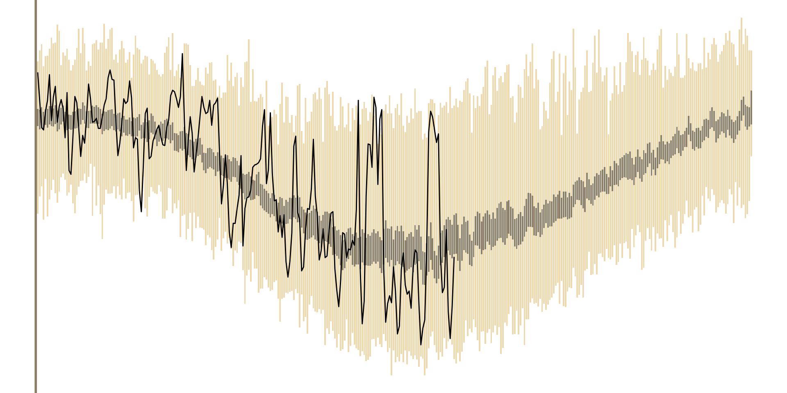

# Manipulação de Vetores {#manip-vectors}


Neste capítulo veremos como manipular vetores, incluindo:

- como nomear vetores

- realizar cálculos entre vetores

- gerar sequências

- entender a indexação de vetores

- lidar com dados faltantes, nulos e duplicados

- usar as funções para cálculos móveis


Em algumas seções deste capítulos usaremos funções dos pacotes do grupo [tidyverse](https://www.tidyverse.org/), como o [ggplot2](https://ggplot2.tidyverse.org/) e [dplyr](https://dplyr.tidyverse.org/). Para carregá-los basta digitar:


```r
library(tidyverse)
```


## Propriedades

+ `typeof()` para descobrir o tipo de dado

+ `length()` para descobrir o tamanho de um tipo de dado 

+ `attributes` (informações acionais específicas do dado), entre eles o atributo mais comum está o `names()`.


### Nomeando vetores


As 3 formas equivalentes mais comuns de criar vetores com nomes são demostradas abaixo com um exemplo de dados mensais de precipitação.

+ Durante a criação, com a função `c()` incluindo os nomes nos argumentos


```r
# vetor de chuva mensal para um dado ano
prec <- c(
  jan = 300, 
  fev = 150,
  mar = 210,
  abr = 12, 
  mai = 0, 
  jun = 0, 
  jul = 12, 
  ago = 22, 
  set = 100, 
  out = 120, 
  nov = 10,  
  dez = 280
  )
```

+ Modificando um vetor com a função `names()<-`


```r
prec <- c(300, 200, 210, 12, 0, 0, 12, 22, 100, 120, 10, 280)
meses <- c("jan", "fev", "mar", "abr", "mai", "jun", "jul", "ago", "set", "out", "nov", "dez")
names(prec) <- meses
prec
#> jan fev mar abr mai jun jul ago set out nov dez 
#> 300 200 210  12   0   0  12  22 100 120  10 280
```


+ Criando um vetor modificado


```r
prec <- setNames(
  object = c(300, 200, 210, 12, 0, 0, 12, 22, 100, 120, 10, 280),
  nm = c("jan", "fev", "mar", "abr", "mai", "jun", "jul", "ago", "set", "out", "nov", "dez")
)
prec
#> jan fev mar abr mai jun jul ago set out nov dez 
#> 300 200 210  12   0   0  12  22 100 120  10 280
```

Nomes não podem ser repetidos entre os elementos, porque a seleção de um subconjunto do vetor baseada nos nomes retornará somente o primeiro elemento que tiver nome repetido.

Embora não faça muito sentido, nem todos elementos precisam ter nomes. A saída da função `names()` retornará um vetor caractere vazio (\"\") para aqueles elementos sem nomes especificados. 


```r
(meses <- c(jan = 1, fev = 2, 3:12))
#> jan fev                                         
#>   1   2   3   4   5   6   7   8   9  10  11  12
names(meses)
#>  [1] "jan" "fev" ""    ""    ""    ""    ""    ""    ""    ""    ""    ""
```

Quando nenhum nome é especificado, `names()` retornará `NULL`[^mais-sobre-null].


```r
names(1:12)
#> NULL
```

[^mais-sobre-null]: Nós conheceremos mais detalhes sobre o `NULL` na sessão \@ref(dados-nulos).

Para remover os nomes de um vetor, podemos usar a função `unname()` ou `names() <- NULL`.


```r
prec_clim <- c(230, 205, 160, 100, 60, 30, 40, 60, 110, 165, 200, 220)
names(prec_clim) <- names(prec)
prec_clim
#> jan fev mar abr mai jun jul ago set out nov dez 
#> 230 205 160 100  60  30  40  60 110 165 200 220
unname(prec_clim)
#>  [1] 230 205 160 100  60  30  40  60 110 165 200 220
names(prec_clim) <- NULL
prec_clim
#>  [1] 230 205 160 100  60  30  40  60 110 165 200 220
```


Nas próximas seções frequentemente usaremos  os vetores `prec` e `prec_clim`. É importante então contextualizar essas variáveis. A variável `prec` consiste na precipitação mensal observada em um ano qualquer em um dado local. A variável `prec_clim` refere-se aos valores esperados de precipitação mensal[^normais] (médias de pelo menos 30 anos) do mesmo local.

[^normais]: Também conhecidos como **normais climatológicas** de precipitação de um local. 


## Atributos

Nós podemos adicionar atributos a um vetor, como por exemplo alguma informação sobre os valores daquela variável. A variável `prec` possui um atributo (`names`). A função `attributes()` lista qualquer atributo de uma variável. Vamos criar uma variável para mostrar como podemos adicionar um atributo a um vetor.


```r
temp <- c(27, 23, 21, 18, 19, 28)
attributes(temp)
#> NULL
```

Podemos adicionar um atributo chamado `metadados` à `temp` e fornecer um vetor caractere com a função de atribuição de atributo `attr()<-`

```r
attr(temp, "metadados") <- "dados obtidos em www.inmet.gov.br, acesso em 10/10/2010"
temp
#> [1] 27 23 21 18 19 28
#> attr(,"metadados")
#> [1] "dados obtidos em www.inmet.gov.br, acesso em 10/10/2010"
```

Algumas funções carregarão este atributo adiante, mas outras não, conforme exemplo a seguir.


```r
(temp_inc <- temp + 1)
#> [1] 28 24 22 19 20 29
#> attr(,"metadados")
#> [1] "dados obtidos em www.inmet.gov.br, acesso em 10/10/2010"
(temp_inc <- c(temp_inc, 18))
#> [1] 28 24 22 19 20 29 18
```

Há situações de uso válido deste recurso, mas inicialmente é melhor não confiar nele. 

## Operações com vetores {#oper-vect}

Como o `R` é uma linguagem vetorizada, as operações são aplicadas a cada elemento do vetor automaticamente, sem a necessidade de laços (ou *loopings*) ao longo do vetor. Esta é uma das grandes vantagens do  .

Operações aritméticas podem ser aplicadas diretamente entre vetores.


```r
# desvios da prec em relação a média climatológica
prec - prec_clim
#>  jan  fev  mar  abr  mai  jun  jul  ago  set  out  nov  dez 
#>   70   -5   50  -88  -60  -30  -28  -38  -10  -45 -190   60
# anomalia em % relativa
prec/prec_clim * 100
#>       jan       fev       mar       abr       mai       jun       jul       ago 
#> 130.43478  97.56098 131.25000  12.00000   0.00000   0.00000  30.00000  36.66667 
#>       set       out       nov       dez 
#>  90.90909  72.72727   5.00000 127.27273
# transformação boxcox da prec com alpha = 0.335
((prec^0.335 - 1)/0.335)
#>       jan       fev       mar       abr       mai       jun       jul       ago 
#> 17.188869 14.626583 14.916806  3.877403 -2.985075 -2.985075  3.877403  5.422424 
#>       set       out       nov       dez 
#> 10.977168 11.856532  3.470802 16.727944
# cte^intervalo
mean(prec)^(1/2:5)
#> [1] 10.271319  4.725171  3.204890  2.538929
```


Uma peculiaridade do  é o tratamento de operações com vetores de tamanhos diferentes. O vetor menor é reciclado, de forma que seus elementos sejam repetidos em ordem até atingirem o tamanho do vetor mais longo envolvido na operação. 


```r
# velocidades em m s-1
(vel_ms <- c(1.5, 0.3, 1.4, 2.0))
#> [1] 1.5 0.3 1.4 2.0
# fator de conversão para km h-1
fator_conv <- 3.6
vel_ms * fator_conv
#> [1] 5.40 1.08 5.04 7.20
# equivalência
fator_conv <- c(3.6, 3.6, 3.6, 3.6)
vel_ms * fator_conv
#> [1] 5.40 1.08 5.04 7.20
```

A constante `fator_conv = 3.6` nesse caso é reciclada 4 vezes (tamanho do vetor `vel_ms`) e então multiplicada por cada elemento de `vetor_dbl`. Por isso os resultados no código acima são idênticos. Essa funcionalidade de fazer um vetor do mesmo tamanho de outro é conhecida como **reciclagem**. Se o vetor mais longo não tem tamanho múltiplo do mais curto, o  realiza a operação com uma mensagem de aviso.


```r
1:10 * 1:2
#>  [1]  1  4  3  8  5 12  7 16  9 20
1:10 * 1:3
#> Warning in 1:10 * 1:3: longer object length is not a multiple of shorter object
#> length
#>  [1]  1  4  9  4 10 18  7 16 27 10
```


A reciclagem é um recurso útil, mas também perigoso. Seu código pode ficar mais elegante ou gerar resultados inesperados.


Operações aritméticas podem ser feitas com vetores lógicos, como nos exemplos abaixo:


```r
FALSE - TRUE
#> [1] -1
prec_clim >= 100
#>  [1]  TRUE  TRUE  TRUE  TRUE FALSE FALSE FALSE FALSE  TRUE  TRUE  TRUE  TRUE
(prec_clim >= 100) * 1:12
#>  [1]  1  2  3  4  0  0  0  0  9 10 11 12
```

### Comparações

Vetores lógicos resultam da comparação de números ou caracteres. A Tabela \@ref(tab:oper-logic) apresenta os principais operadores lógicos para comparações.


Table: (\#tab:oper-logic)Operadores Lógicos

 Operador            Descrição        
-----------  -------------------------
     <               menor que        
    <=           menor ou igual a     
     >               maior que        
    >=            maior ou igual      
    ==               idêntico         
    !=               diferente        
    !x           não é x (negação)    
   x | y              x ou y          
   x & y               x e y          
 isTRUE(x)    teste se x é verdadeiro 
   %in%           está contido em     

Este conjunto de operadores permite diversas comparações entre vetores, por exemplo: 

- quais meses de `prec` foram abaixo do normal?


```r
prec
#> jan fev mar abr mai jun jul ago set out nov dez 
#> 300 200 210  12   0   0  12  22 100 120  10 280
prec_clim
#>  [1] 230 205 160 100  60  30  40  60 110 165 200 220
prec - prec_clim < 0
#>   jan   fev   mar   abr   mai   jun   jul   ago   set   out   nov   dez 
#> FALSE  TRUE FALSE  TRUE  TRUE  TRUE  TRUE  TRUE  TRUE  TRUE  TRUE FALSE
```

O operador `%in%` serve para verificar se um vetor está contido parcial ou totalmente em outro vetor.


```r
# operador está contido em
c(200, 150, 100) %in% prec
#> [1]  TRUE FALSE  TRUE
# 2:4 são elementos de x?
is.element(c(200, 150, 100), prec)
#> [1]  TRUE FALSE  TRUE
```


Nos exemplos acima, vimos como buscar os os elementos de um vetor para apenas uma condição. Entretanto, frequentemente precisamos testar mais condições, ou seja, combinar comparações. Por exemplo, para condições do tipo:

- $0 < prec \leq 100$ 
- $prec < 50$  ou $prec \geq 150$ 

precisamos usar os operadores relacionais:

- `&` e `&&` (\"e"\)

- `|` e `||` (\"ou"\)


```r
# prec entre 0 e 100 mm
prec > 0 & prec <= 100
#>   jan   fev   mar   abr   mai   jun   jul   ago   set   out   nov   dez 
#> FALSE FALSE FALSE  TRUE FALSE FALSE  TRUE  TRUE  TRUE FALSE  TRUE FALSE
# prec abaixo de 50 e acima de 150 mm
prec < 50 | prec >= 150
#>   jan   fev   mar   abr   mai   jun   jul   ago   set   out   nov   dez 
#>  TRUE  TRUE  TRUE  TRUE  TRUE  TRUE  TRUE  TRUE FALSE FALSE  TRUE  TRUE
```


A ordem das operações pode ser controlada por parênteses. Os operadores `&` e `|` são vetorizados (retornam vetores de mesmo tamanho que os vetores testados). 


A forma dupla (`&&` ou `||`) compara somente um elemento de cada lado, enquanto a forma normal (`&` e `|`), compara cada elemento dos vetores em cada lado.


```r
a <- c(1, 1, 0, 1)
b <- c(2, 1, 0, 1)
# forma normal verifica cada elemento de a e cada elemento de b
a == 1 & b == 1
#> [1] FALSE  TRUE FALSE  TRUE
# forma dupla verifica somente o primeiro elemento de a e o primeiro elemento de b
# retornando somente um resultado
a == 1 && b == 1
#> [1] FALSE
```


------------------------------------------------------------
 a   b   a==1    b==1    a == 1 & b == 1   a == 1 && b == 1 
--- --- ------- ------- ----------------- ------------------
 1   2   TRUE    FALSE        FALSE             FALSE       

 1   1   TRUE    TRUE         TRUE                          

 0   0   FALSE   FALSE        FALSE                         

 1   1   TRUE    TRUE         TRUE                          
------------------------------------------------------------

Table: Demonstração da diferença entre & e &&.

Podem haver mais que duas condições a serem testadas. As condições podem ser combinadas usando múltiplos `&` ou `|`. As diferentes condições podem ser agrupadas por parênteses assim como feito nas operações matemáticas. 


#### Testes de igualdade 

A comparação de igualdade no  pode ser meio confusa devido as forma de armazenamento diferentes dos números.


```r
0.6 - 0.3
#> [1] 0.3
0.9 - 0.6
#> [1] 0.3
0.3 == 0.3
#> [1] TRUE
```

Tudo normal, mas ao comparar operações com valores decimais, você pode se surpreender:


```r
(0.6 - 0.3) == (0.9 - 0.6)
#> [1] FALSE
```

Isso ocorre por imprecisão no final da parte decimal que pode ser arrendondada incorretamente. Isso não acarreta problema na maioria dos cálculos. Para evitar esse problema é melhor comparar os resultados usando a função `all.equal()`.


```r
all.equal(
  target = 0.6 - 0.3,
  current = 0.9 - 0.6
)
#> [1] TRUE
```

A `all.equal()` inclui uma tolerância na comparação ($1,5\times10^{-8}$) fazendo com aquela imprecisão seja ignorada. Para mais detalhes consulte `?all.equal`.


### Funções `any` e `all`

Estas funções fornecem um único valor (vetor lógico de tamanho 1) para resumir ou descrever o resultado da condição aplicada ao vetor.


```r
vetor <- c(0, 1, -1, -2, 3, 5, -5)
all(vetor < 0) # todas as posições são maiores que 0 ?
#> [1] FALSE
any(vetor > 0) # alguma posição é maior que 0?
#> [1] TRUE
```

- `all()` verifica se a condição avaliada é válida para todos elementos de um vetor;

- `any()` verifica se a condição avaliada é válida para pelo menos um dos elementos de um vetor;


## Sequências 

Vimos nas seções anteriores que é muito simples criar sequências de números inteiros com o operador `:`.  Nesta seção veremos outras formas de gerar sequências, como uma sequência de números reais e sequências de números repetidos. 


### Sequências de números inteiros

Os dois pontos (`:`) são uma maneira muito fácil de gerar uma sequência de números igualmente espaçados por 1. Você especifica um número inicial e um número final e o `R` produzirá todos os números inteiros entre eles, incluindo os dois números. Isso funciona mesmo para números negativos ou para valores decrescentes.


```r
(ddm <- 1:31)
#>  [1]  1  2  3  4  5  6  7  8  9 10 11 12 13 14 15 16 17 18 19 20 21 22 23 24 25
#> [26] 26 27 28 29 30 31
typeof(ddm)
#> [1] "integer"
# sequencia de inteiros decrescente
(si_dec <- 10:-10)
#>  [1]  10   9   8   7   6   5   4   3   2   1   0  -1  -2  -3  -4  -5  -6  -7  -8
#> [20]  -9 -10
typeof(si_dec)
#> [1] "integer"
```

### Sequências de números reais

A função `seq()`pode ser usada para gerar sequências tanto de números reais como inteiros.

No código abaixo são geradas uma sequência crescente e uma decrescente, ambas igualmente espaçadas por 3.


```r
seq(from = 1, to = 10, by = 3)
#> [1]  1  4  7 10
seq(from = 10, to = 1, by = -3)
#> [1] 10  7  4  1
```

Para sequências decrescentes o argumento `by` (\"por\") deve ser negativo.

A saída da `seq()` vai sempre incluir o n° inicial (passado no argumento `from` - \"de\"), mas nem sempre incluirá o n° final (passado no argumento `to` - \"até\"). Se sua sequência está aumentando por um argumento `by` que é par (ímpar) e o argumento `to` também é par (ímpar), não incluirá o valor do argumento `to` no resultado (Tabela \@ref(tab:seqs-by)). Quando `to` e `by` diferem o valor de `to` fará parte da sequência de saída.


Table: (\#tab:seqs-by)Sequências com argumentos ímpares e pares.

 'from'    'to'    'to' é par?    'by'    'by' é par?         sequência          resultado inclui 'to' 
--------  ------  -------------  ------  -------------  ----------------------  -----------------------
   1        10        TRUE         2         TRUE          c(1, 3, 5, 7, 9)              FALSE         
   1        10        TRUE         3         FALSE          c(1, 4, 7, 10)               TRUE          
   1        11        FALSE        2         TRUE        c(1, 3, 5, 7, 9, 11)            TRUE          
   1        11        FALSE        3         FALSE          c(1, 4, 7, 10)               FALSE         

Ao invés de usar o argumento `by`, podemos especificar um valor para o argumento `length.out` (\"tamanho de saída\") para produzir um vetor com tantos números, igualmente espaçados, entre os valores `from` e `to`.


```r
seq(from = 1, to = 10, length.out = 20)
#>  [1]  1.000000  1.473684  1.947368  2.421053  2.894737  3.368421  3.842105
#>  [8]  4.315789  4.789474  5.263158  5.736842  6.210526  6.684211  7.157895
#> [15]  7.631579  8.105263  8.578947  9.052632  9.526316 10.000000
```

O `length.out = 20` no código acima permite gerar 20 números igualmente espaçados entre 1 e 10.


### Repetições

Algumas vezes precisamos repetir certos valores, o que pode ser feito com a função `rep()`. O argumento `times` especifica o número de vezes para repetir o `x`. 


```r
rep(x = 1:2, times = 4)
#> [1] 1 2 1 2 1 2 1 2
```

O argumento `each` especifica o número de vezes para repetir cada elemento de `x`.


```r
rep(x = 1:2, each = 3)
#> [1] 1 1 1 2 2 2
```

Os argumentos podem ser combinados.


```r
rep(x = 1:2, times = 4, each = 3)
#>  [1] 1 1 1 2 2 2 1 1 1 2 2 2 1 1 1 2 2 2 1 1 1 2 2 2
```

No caso acima, `x` primeiro foi repetido 4 vezes e depois cada elemento foi repetido 3 vezes.

Quando argumento `times` é um vetor de mesmo tamanho que `x`, cada um de seus valores será usado para repetir tantas vezes o respectivo elemento de `x`.


```r
rep(x = 1:2, times = 4:3)
#> [1] 1 1 1 1 2 2 2
```

<!-- 
AULA-6 encerrou aqui 
-->

## Indexação de vetores {#index-vetores}

Os elementos de um vetor são indexados e para acessá-los usamos a notação de índices do . Para extrair ou filtrar elementos de um vetor usamos o operador colchetes **`[ ]`**, seguindo a sintaxe: 

<p style="color:DodgerBlue; font-size:1.3em; font-weight: bold;text-align:center;"> `vetor[indices]` </p>

onde **`indices`** representa o vetor com os índices dos elementos da variável `vetor` a serem selecionados. O operador **`[`** quando aplicado a um vetor retornará sempre um vetor.

Para acessar partes um elemento de um vetor o vetor `indices` dentro dos colchetes pode ser especificado de diferentes formas:

- por posições (vetor numérico)

- por nomes (vetor de caracteres)

- por comparações, testes ou condições (vetor lógico)


### Indexação por vetores numéricos

#### Positivos

Para extrairmos a precipitação de janeiro e dezembro do vetor `prec` podemos usar o seguinte código:


```r
# vetor com as posições dos meses de janeiro e dezembro
c(1, length(prec))
#> [1]  1 12
# acesso aos valores localizados nas posições 1 e 12 
prec[c(1, length(prec))]
#> jan dez 
#> 300 280
```

Passando um vetor numérico entre os colchetes retorna a parte do vetor contendo os elementos daquelas posições.

Similarmente a precipitação dos meses de inverno (Junho, Julho e Agosto) podem ser selecionadas usando um vetor definido com os índices das posições daqueles meses:


```r
inds_jja <- 6:8
# vetor de chuva JJA
prec[inds_jja]
#> jun jul ago 
#>   0  12  22
```

<div class="rmdtip">
<p>O reposicionamento dos elementos de um vetor pode ser feito pela especificação da ordem dos índices. Par ordenar os elementos na ordem dezembro, Janeiro e Fevereiro indexamos da seguinte maneira:</p>
<p><code>prec[c(12, 1, 2)]</code></p>
<p>A inversão da ordem dos elementos pode ser feita com a indexação:</p>
<p><code>prec[length(prec):1]</code></p>
<p>A função <code>rev()</code> economiza tempo de digitação de código para realizar esta mesma ação:</p>
<p><code>rev(prec)</code></p>
</div>

#### Negativos

O acesso aos dados de precipitação de janeiro e dezembro do vetor `prec` poderia ser feita uma lógica complementar. Poderíamos selecionar todos elementos de `prec` exceto aqueles entre Fevereiro (posição 2) e Novembro (posição 11). Esta frase poderia ser transcrita em código `R`, simplesmente como `-(2:11)`. O sinal `-` precedendo o vetor numérico, exclui o acesso aquelas posições quando usado entre o operador **`[`**.


```r
prec[-(2:11)]
#> jan dez 
#> 300 280
```

Analogamente, os meses de inverno poderiam ser selecionados com:


```r
 prec[-c(1:5, 9:12)]
#> jun jul ago 
#>   0  12  22
```


###  Indexação por nomes

A seleção de partes e um vetor pode ser feita também usando os nomes de seus elementos. As precipitações de janeiro e dezembro poderiam ser extraídas usando os nomes daqueles elementos:


```r
prec[c("jan", "dez")]
#> jan dez 
#> 300 280
```

Assim como as precipitações de inverno.


```r
prec[c("jun", "jul", "ago")]
#> jun jul ago 
#>   0  12  22
```


### Indexação por vetores lógicos

Vamos criar um vetor lógico e usá-lo para a seleção com um vetor lógico dos elementos de `prec` para Janeiro e Dezembro. 


```r
inds_log <- c(
  TRUE, FALSE, FALSE, FALSE,
  FALSE, FALSE, FALSE, FALSE,
  FALSE, FALSE, FALSE, TRUE
)
prec[inds_log]
#> jan dez 
#> 300 280
```

Somente os elementos de `inds_log` correspondentes a `TRUE` foram selecionados. 

Vetores lógicos são muito úteis quando aproveitamos a funcionalidade de **coerção**. Imagine que você queira extrair de `prec` o primeiro elemento, mas o segundo não, o terceiro elemento sim, o quarto não e assim sucessivamente. Essa seleção intercalada pode ser simplesmente feita com:


```r
inds_log <- c(TRUE, FALSE)
prec[inds_log]
#> jan mar mai jul set nov 
#> 300 210   0  12 100  10
```

Uma forma mais prática de filtrar vetores é por comparações. Por exemplo, quais valores de precipitação foram acima de 80 mm?


```r
inds_prec_alta <- prec > 80
prec[inds_prec_alta]
#> jan fev mar set out dez 
#> 300 200 210 100 120 280
```


Vimos que a filtragem consiste em extrair elementos de um vetor que satisfaça uma ou várias condições. Entretanto, em alguns casos, o interesse está nas posições do vetor que atendem a condição (onde ela é verdadeira). Nós podemos localizar essas ocorrências usando a função `which()`. Por exemplo, qual a posição dos elementos do vetor `inds_prec_alta` que são verdadeiros?


```r
which(inds_prec_alta)
#> jan fev mar set out dez 
#>   1   2   3   9  10  12
```

A função `which()` converte um vetor lógico em numérico, somente os índices em que a condição é `TRUE`.

A utilidade da `which()` é mais evidente quando usada para, por  exemplo, sabermos qual o mês do 4° caso mais chuvoso.


```r
which(inds_prec_alta)[4]
#> set 
#>   9
names(which(inds_prec_alta)[4])
#> [1] "set"
# ou
names(prec)[which(inds_prec_alta)[4]]
#> [1] "set"
```

<div class="rmdtip">
<p>A resultado da <code>which()</code> é um vetor numérico e portanto equivale a indexação numérica. Então a seleções abaixo são equivalentes:</p>
<p><code>prec[which(inds_prec_alta)]</code></p>
<p><code>prec[inds_prec_alta]</code></p>
<p>Quando é melhor usar uma ou outra opção? Note que o resultado de <code>which(inds_prec_alta)</code> armazena somente os índices que satisfazem a condição, enquanto que o resultado de <code>inds_prec_alta</code> é um vetor lógico de mesmo tamanho que <code>prec</code>. Então, se estiver trabalhando com <strong>big data</strong> (p.ex.: um vetor com milhões de elementos) em termos de eficiência de uso da memória a <code>which()</code> é melhor opção.</p>
</div>


<div class="rmdimportant">
<p>Para localizar valores extremos em um vetor podemos usar as funções <code>which.max()</code> e <code>which.min()</code> que fornecem respectivamente, a posição do valor máximo e mínimo no vetor. Elas são versões eficientes dos códigos <code>which(x == max(x))</code> e <code>which(x == min(x))</code>. Contudo, há uma diferença entre elas que pode ser verificada pela comparação dos resultados das instruções:</p>
<p><code>which.min(prec)</code></p>
<p><code>which(prec == min(prec))</code></p>
<p>A primeira seleciona o primeiro índice para o qual <code>prec</code> tem seu mínimo (5° elemento), enquanto a segunda retorna todos os índices correspondentes ao mínimo (5° e 6° elemento).</p>
</div>


## Substituição de elementos de um vetor {#replace-vect}

Podemos substituir os valores de um vetor usando os mesmos esquemas de indexação vistos na seção anterior. A sintaxe geral para substituir elementos de um vetor por novos valores é:

<p style="color:DodgerBlue; font-size:1.3em; font-weight: bold;text-align:center;"> `vetor[indices] <- novos_valores` </p>

Vamos fazer uma cópia do vetor `prec` para então alterá-lo, fazendo substituição de seus elementos usando as diferentes formas de indexação.


```r
(prec_alt <- prec)
#> jan fev mar abr mai jun jul ago set out nov dez 
#> 300 200 210  12   0   0  12  22 100 120  10 280
```

#### Por posições

suponha que você precisa substituir os valores de precipitação dos meses de inverno por valores corrigidos.


```r
inds_jja
#> [1] 6 7 8
prec_alt[inds_jja] <- c(NA, 21, 42)
prec
#> jan fev mar abr mai jun jul ago set out nov dez 
#> 300 200 210  12   0   0  12  22 100 120  10 280
prec_alt
#> jan fev mar abr mai jun jul ago set out nov dez 
#> 300 200 210  12   0  NA  21  42 100 120  10 280
```


  
#### Por nomes

Suponha que os valores de precipitação de janeiro e dezembro foram atualizados para 250 e 208, respectivamente. Esta alteração pode ser com o código abaixo.


```r
prec_jd_corr <- c(250, 208)
prec_alt[c("jan", "dez")] <- prec_jd_corr
prec
#> jan fev mar abr mai jun jul ago set out nov dez 
#> 300 200 210  12   0   0  12  22 100 120  10 280
prec_alt
#> jan fev mar abr mai jun jul ago set out nov dez 
#> 250 200 210  12   0  NA  21  42 100 120  10 208
```


#### Por comparação

Imagine que você precisa substituir os valores de `prec` que ficaram em torno de $\pm10 \%$  da média mensal climatológica pelos valores climatológicos.

Vamos primeiro determinar os desvios relativos (em %) em relação as médias climatológicas:


```r
# limiar em % da normal climatológica
limiar <- 10 
desvios <- prec - prec_clim
# anomalias relativas em %
(anom_perc <-  abs(desvios)/prec_clim * 100)
#>        jan        fev        mar        abr        mai        jun        jul 
#>  30.434783   2.439024  31.250000  88.000000 100.000000 100.000000  70.000000 
#>        ago        set        out        nov        dez 
#>  63.333333   9.090909  27.272727  95.000000  27.272727
```

Então substituímos os casos com baixo desvio pela precipitação climatológica.


```r
# meses com prec em torno de +-10% da média climatol.
prec[anom_perc <= 10]
#> fev set 
#> 200 100
# substituição pela prec mensal climatol. 
prec[anom_perc <= 10] <- prec_clim[anom_perc <= 10]
prec
#> jan fev mar abr mai jun jul ago set out nov dez 
#> 300 205 210  12   0   0  12  22 110 120  10 280
```

A função `abs()` determina o valor absoluto ou módulo de um vetor.

Uma alternativa bastante útil para substituir valores de um vetor usando comparações é a **função vetorizada** **`ifelse()`**. A mesma operação realizada no trecho de código anterior poderia ser feita com `ifelse()` da seguinte forma:


```r
prec <- ifelse(ano_perc <= 10, prec_clim, prec)
```

```r
prec
#> jan fev mar abr mai jun jul ago set out nov dez 
#> 300 205 210  12   0   0  12  22 110 120  10 280
```


<!---
Uma exemplo é sua aplicação para preencher as falhas no vetor `prec_alt` por seus valores climatológicos.


```r
prec_alt_comp <- ifelse(
  test = is.na(prec_alt), # condição: é faltante?
  yes = prec_clim,        # se verdadeira: preenche com prec_clim 
  no = prec_alt           # se falsa: mantém prec_alt
)
prec_alt_comp
#> jan fev mar abr mai jun jul ago set out nov dez 
#> 250 200 210  12   0  30  21  42 100 120  10 208
```
--->


## Lidando com dados faltantes

Dados faltantes (`NA`s) são inevitáveis e em qualquer processamento de dados reais nós precisamos determinar se existem dados faltantes e a quantidade de observações válidas. É importante também, saber o efeito que eles tem nos cálculos, as funcionalidades para identificá-los e substituí-los se necessários.

Vamos substituir alguns valores da `prec_alt` por `NA` para poder tratar de dados faltantes usando as diferentes funcionalidades que o  oferece para isso. 


```r
prec_alt[c(3, 4, 11)] <- NA
prec_alt
#> jan fev mar abr mai jun jul ago set out nov dez 
#> 250 200  NA  NA   0  NA  21  42 100 120  NA 208
```

### Identificação e remoção de `NA`s

Para identificar `NA`s em um vetor, a função específica para isso é a `is.na()`. 


```r
is.na(prec_alt)
#>   jan   fev   mar   abr   mai   jun   jul   ago   set   out   nov   dez 
#> FALSE FALSE  TRUE  TRUE FALSE  TRUE FALSE FALSE FALSE FALSE  TRUE FALSE
```

Também podemos usá-la aninhada com a função `which()` para obter os índices dos elementos faltantes.


```r
which(is.na(prec_alt))
#> mar abr jun nov 
#>   3   4   6  11
```

Novos usuários do R tentam identificar dados faltantes com a expressão: 


```r
prec_alt == NA
#> jan fev mar abr mai jun jul ago set out nov dez 
#>  NA  NA  NA  NA  NA  NA  NA  NA  NA  NA  NA  NA
```

O que produzirá somente `NA`s mesmo que o vetor testado possua algum `NA`. Isso ocorre pela regra de qualquer operação com `NA`s resulta em `NA`s.

Para verificar se há algum dado faltante em um vetor usamos a função `anyNA()` e para quantificar o total de observações faltantes combinamos as expressões `sum()` e `is.na()`:


```r
anyNA(prec_alt)
#> [1] TRUE
sum(is.na(prec_alt))
#> [1] 4
```

A remoção dos elementos faltantes de um vetor é moleza. É só combinar o operador negação `!` e `is.na()` por indexação lógica:


```r
prec_alt[!is.na(prec_alt)]
#> jan fev mai jul ago set out dez 
#> 250 200   0  21  42 100 120 208
# outra forma equivalente
#prec_alt[-which(is.na(prec_alt))]
```

Uma alternativa mais sofisticada é a função `na.omit()`. Ela não só remove os valores faltantes, mas como também guarda a localização dos dados faltantes. Esta informação é armazenada na lista de atributos do vetor.


```r
prec_alt_sem_falt <- na.omit(prec_alt)
attributes(prec_alt_sem_falt)
#> $names
#> [1] "jan" "fev" "mai" "jul" "ago" "set" "out" "dez"
#> 
#> $na.action
#> mar abr jun nov 
#>   3   4   6  11 
#> attr(,"class")
#> [1] "omit"
```

As posições originais dos dados faltantes descartados podem ser obtidas com:


```r
attr(
  x = prec_alt_sem_falt,
  which = "na.action"
)
#> mar abr jun nov 
#>   3   4   6  11 
#> attr(,"class")
#> [1] "omit"
```

Quando trabalhamos com vetores grandes que contenham várias falhas é útil saber a posição da sequência de dados consecutivos válidos mais longa. A função `na.contiguous()` retornará somente elementos daquela sequência.


```r
prec_alt_val_long <- na.contiguous(prec_alt)
prec_alt_val_long
#> jul ago set out 
#>  21  42 100 120 
#> attr(,"na.action")
#> [1]  1  2  3  4  5  6 11 12
#> attr(,"class")
#> [1] "omit"
#> attr(,"tsp")
#> [1]  7 10  1
```

### Indexação com `NA`s

Suponha que queremos extrair um conjunto de elementos de `prec_clim` baseado em `inds_na`.


```r
prec_alt > 220
#>   jan   fev   mar   abr   mai   jun   jul   ago   set   out   nov   dez 
#>  TRUE FALSE    NA    NA FALSE    NA FALSE FALSE FALSE FALSE    NA FALSE
```

O interesse é extrair os valores de `prec_clim` quando a `prec_alt` superou 220 mm. A expressão para essa seleção é: 


```r
prec_clim[prec_alt > 220]
#> [1] 230  NA  NA  NA  NA
```

o resultado da filtragem foi um vetor com o resultado da condição de prec_clim  para qual `prec_alt > 220` e também `NA`s. Isto é um resultado que provavelmente ninguém deseja. 

Se nós queremos extrair os valores de `prec_clim` para os quais `prec_alt` **não é faltante** e **também superior a 220** nós devemos usar a seguinte expressão:


```r
prec_clim[!is.na(prec_alt) & prec_alt > 220]
#> [1] 230
```

A moral da história aqui é que na prática quando você tem `NA`s em índices (ou seja, nos valores de qualquer vetor dentro do colchetes) o  pode retornar algo diferente do que era esperado.


Uma função para filtragem de dados que é capaz de dar conta disso mais prontamente é função `subset()` (que pode ser traduzida como *subconjunto*) que recebe os dados no primeiro argumento (`x`) e a expressão lógica no segundo (argumento `subset` de mesmo nome da função).


```r
subset(
  x = prec_clim,
  subset = prec_alt > 220
)
#> [1] 230
```


### Efeito de `NAs` em funções

Na seção \@ref(NAs) vimos que qualquer operação com `NA` resulta em `NA`. Algumas funções úteis merecem ser enfatizadas quando usadas em vetores com dados faltantes.

A função `range()` retorna a amplitude de variação dos valores em um vetor.


```r
range(prec_alt)
#> [1] NA NA
```

Como `prec_alt` possui dados faltantes ela retornará `NA`. Assim como várias outras funções matemáticas básicas no  a função `range()` permite especificar o argumento `na.rm = TRUE` para calcular o resultado após omitir os valores faltantes.


```r
range(prec_alt, na.rm = TRUE)
#> [1]   0 250
```

Logo, `prec_alt` varia de um mínimo 0 a um máximo de 250. 


Diversas funções tem essa funcionalidade, entre elas as mais usadas para estatísticas descritivas, como:


```r
# prec máx. mensal
max(prec_alt, na.rm = TRUE)
#> [1] 250
# pŕec min mensal
min(prec_alt, na.rm = TRUE)
#> [1] 0
# prec total anual
sum(prec_alt, na.rm = TRUE)
#> [1] 941
# prec média
mean(prec_alt, na.rm = TRUE)
#> [1] 117.625
# mediana da prec 
median(prec_alt, na.rm = TRUE)
#> [1] 110
# desvio padrão
sd(prec_alt, na.rm = TRUE)
#> [1] 93.87216
# variância
var(prec_alt, na.rm = TRUE)
#> [1] 8811.982
```

A função `summary()` fornece um resumo estatístico de uma variável, incluindo: mínimo, 1° quartil, mediana, média, 3° quartil, máximo e o número de casos faltantes (se aplicável). 


```r
summary(prec_alt)
#>    Min. 1st Qu.  Median    Mean 3rd Qu.    Max.    NA's 
#>    0.00   36.75  110.00  117.62  202.00  250.00       4
```

## Dados Nulos (`NULL`) {#dados-nulos}

O `NULL` é um tipo especial de dado no . Ele é um vetor de tamanho zero.


```r
vetor_nulo1 <- NULL
vetor_nulo1
#> NULL
length(vetor_nulo1)
#> [1] 0
```

Um vetor nulo também pode ser definido com:


```r
vetor_nulo2 <- c()
vetor_nulo2
#> NULL
```

Note que um vetor ser nulo não significa que ele não exista. Ou seja, a atribuição de `NULL` a uma variável não apaga a variável de seu ambiente de trabalho. A existência de uma variável pode ser verificada com a função `exists()`, na qual o argumento `x` deve ser passado como caractere. 


```r
exists(x = "vetor_nulo1")
#> [1] TRUE
```

Como o `NULL` é um vetor vazio, seu uso explícito dentro de um vetor não conta. Assim, qualquer operação com `NULL` resulta em um vetor vazio.


```r
(vetor_elem_nulo <- c(1, 2, NULL, 4))
#> [1] 1 2 4
length(vetor_elem_nulo)
#> [1] 3
vetor_elem_nulo + NULL
#> numeric(0)
```

Em algumas situações você pode querer anular um atributo de um vetor, como os nomes. Eventualmente até mesmo o próprio vetor.


```r
prec
#> jan fev mar abr mai jun jul ago set out nov dez 
#> 300 205 210  12   0   0  12  22 110 120  10 280
names(prec) <- NULL
prec
#>  [1] 300 205 210  12   0   0  12  22 110 120  10 280
prec <- NULL
prec
#> NULL
```


## Dados duplicados
 
Dados frequentemente pode ter valores duplicados ou repetidos e dependendo da aplicação isso pode causar problemas nos resultados. Portanto é importante detectar e remover essas ocorrências. O  oferece algumas funções convenientes para detectar dados duplicados. 

Mas antes, vamos criar um vetor de datas com alguns dias repetidos para então mostrar as funcionalidades disponíveis.


```r
datas <- seq(
  from = as.Date("2017-01-10"),
  to = as.Date("2017-01-10") + 10,
  by = "day"
)
datas <- c(
  datas[1:6], NA, 
  datas[7:length(datas)], 
  datas[length(datas)], 
  datas[5:6]
)
datas
#>  [1] "2017-01-10" "2017-01-11" "2017-01-12" "2017-01-13" "2017-01-14"
#>  [6] "2017-01-15" NA           "2017-01-16" "2017-01-17" "2017-01-18"
#> [11] "2017-01-19" "2017-01-20" "2017-01-20" "2017-01-14" "2017-01-15"
```

A função `duplicated()` detecta onde ocorrem valores repetidos. 


```r
duplicated(datas)
#>  [1] FALSE FALSE FALSE FALSE FALSE FALSE FALSE FALSE FALSE FALSE FALSE FALSE
#> [13]  TRUE  TRUE  TRUE
```

Ela retorna um vetor lógico mostrando quais elementos são duplicados. Neste exemplo os últimos 3 elementos. Este resultado pode ser usado para remover os valores repetidos:


```r
# datas únicas: sem valores duplicados
datas[!duplicated(datas)]
#>  [1] "2017-01-10" "2017-01-11" "2017-01-12" "2017-01-13" "2017-01-14"
#>  [6] "2017-01-15" NA           "2017-01-16" "2017-01-17" "2017-01-18"
#> [11] "2017-01-19" "2017-01-20"
```

Alternativamente, há função `unique()` para remover valores repetidos de um vetor:


```r
unique(datas)
#>  [1] "2017-01-10" "2017-01-11" "2017-01-12" "2017-01-13" "2017-01-14"
#>  [6] "2017-01-15" NA           "2017-01-16" "2017-01-17" "2017-01-18"
#> [11] "2017-01-19" "2017-01-20"
```

## Dados ordenados

Duas operações comuns em análise de dados são a ordenação e a classificação dados de um vetor.

A função `sort()` arranja os dados de um vetor numérico em ordem crescente ou descrescente (se argumento for especificado como `decreasing = TRUE`). Se o vetor for de caracteres, o arranjo segue a ordem alfabética dando precedência às letras em minúsculo.


```r
sort(prec_alt)
#> mai jul ago set out fev dez jan 
#>   0  21  42 100 120 200 208 250
sort(prec_alt, decreasing = TRUE)
#> jan dez fev out set ago jul mai 
#> 250 208 200 120 100  42  21   0
```


```r
sort(names(prec_alt))
#>  [1] "abr" "ago" "dez" "fev" "jan" "jul" "jun" "mai" "mar" "nov" "out" "set"
```

A ordem de classificação de cada elemento de um vetor numérico é obtida com a função `order()`:


```r
prec_alt
#> jan fev mar abr mai jun jul ago set out nov dez 
#> 250 200  NA  NA   0  NA  21  42 100 120  NA 208
order(prec_alt)
#>  [1]  5  7  8  9 10  2 12  1  3  4  6 11
```

O resultado indica que o 5º lemento de `prec_alt` é o menor valor e o 1º elemeno é o de maior valor. Isso pode ser facilmente verificado passando este resultado na indexação da `prec_alt`.


```r
# equivalente a sort()
prec_alt[order(prec_alt)]
#> mai jul ago set out fev dez jan mar abr jun nov 
#>   0  21  42 100 120 200 208 250  NA  NA  NA  NA
```


Nota-se então, que por padrão na saída da `order()` os elementos faltantes são colocados nas últimas posições (no exemplo: 3, 4, 6, 11). Para remover os casos faltantes especificamos o argumento `na.last = NA`.


```r
order(prec_alt, na.last = NA)
#> [1]  5  7  8  9 10  2 12  1
```


## Funções móveis úteis

Se queremos obter um valor que leve em consideração todos os valores anteriores e o valor atual, podemos usar funções da família **cum{fun}()**, como a **`cumsum()`** para somar valores à medida que avançamos na sequência. Esta operação é conhecida como soma cumulativa, total móvel ou soma móvel.

Vamos obter a soma cumulativa da série da precipitação mensal abaixo.


```r
# serie de com 2 anos de prec mensal
prec <- c(
    230, 205, 160, 100, 60, 30, 
    40, 60, 110, 165, 200, 220, 
    250,200, 210, 12, 0, 30, 
    21, 42, 100, 120, 10, 208
  )
prec
#>  [1] 230 205 160 100  60  30  40  60 110 165 200 220 250 200 210  12   0  30  21
#> [20]  42 100 120  10 208
# meses de prec como datas
dts <- seq(
  from = as.Date("2010-01-01"),
  by = "month",
  length.out = length(prec)
)
dts
#>  [1] "2010-01-01" "2010-02-01" "2010-03-01" "2010-04-01" "2010-05-01"
#>  [6] "2010-06-01" "2010-07-01" "2010-08-01" "2010-09-01" "2010-10-01"
#> [11] "2010-11-01" "2010-12-01" "2011-01-01" "2011-02-01" "2011-03-01"
#> [16] "2011-04-01" "2011-05-01" "2011-06-01" "2011-07-01" "2011-08-01"
#> [21] "2011-09-01" "2011-10-01" "2011-11-01" "2011-12-01"
prec_ac <- cumsum(prec)
prec_ac
#>  [1]  230  435  595  695  755  785  825  885  995 1160 1360 1580 1830 2030 2240
#> [16] 2252 2252 2282 2303 2345 2445 2565 2575 2783
```


Para melhor compreensão vamos visualizar as duas variáveis na mesma escala. A precipitação será representada por barras e a precipitação acumulada até o mês decorrido como linha. Nós abordaremos os recursos para visualização gráfica na seção **Visualização de dados**.


```r
#library(ggplot2)
# gráfico
graf <- qplot(
  x = dts,
  y = prec,
  geom = c("col"),
  ylim = range(c(prec, prec_ac))
) +
  # ajuste dos labels das datas (eixo x)
  scale_x_date(
    name = "meses",
    date_breaks = "2 months",
    date_labels = "%b\n%Y"
  ) +
  # camada com prec acumulado
  layer(
    map = aes(
      x = dts,
      y = prec_ac,
    ),
    geom = "line",
    params = list(
      colour = "green",
      size = 1
    ),
    stat = "identity",
    position = "identity"
  )
graf
```



```r

# (y_cmx <- cummax(y))
# (y_cmn <- cummin(y))
```


As funções `cummax()` e `cummin()` fornecem os valores mínimo e máximo entre o início do vetor e a posição de cada elemento. Para enfatizar a utilidade destas funções, vamos considerar o vetor `y` abaixo, representando uma onda com amplitude que aumenta no tempo.


```r
(x <- seq(from = 0, to = 2.75*pi, length.out = 20))
#>  [1] 0.0000000 0.4547042 0.9094084 1.3641126 1.8188168 2.2735210 2.7282252
#>  [8] 3.1829294 3.6376336 4.0923378 4.5470420 5.0017462 5.4564504 5.9111546
#> [15] 6.3658588 6.8205630 7.2752672 7.7299714 8.1846756 8.6393798
(y <- round(-x*cos(2*x), 2))
#>  [1]  0.00 -0.28  0.22  1.25  1.60  0.37 -1.85 -3.17 -1.99  1.33  4.30  4.19
#> [13]  0.45 -4.35 -6.28 -3.25  2.92  7.49  6.46  0.00
# maximos e minimos móveis de y
(y_env_sup <- cummax(y))
#>  [1] 0.00 0.00 0.22 1.25 1.60 1.60 1.60 1.60 1.60 1.60 4.30 4.30 4.30 4.30 4.30
#> [16] 4.30 4.30 7.49 7.49 7.49
(y_env_inf <- cummin(y))
#>  [1]  0.00 -0.28 -0.28 -0.28 -0.28 -0.28 -1.85 -3.17 -3.17 -3.17 -3.17 -3.17
#> [13] -3.17 -4.35 -6.28 -6.28 -6.28 -6.28 -6.28 -6.28
```

A visualização gráfica mostra que estas funções fornecem os envelopes superiore e inferior de variação de um vetor.


```r
graf <- qplot(
  x = x,
  y = y,
  geom = c("line", "point"),
  ylim = range(c(y, y_env_sup, y_env_inf))
) +
  # linha do envelope superior
  layer(
    map = aes(
      x = x, 
      y = y_env_sup, 
      ), 
    geom = "line",
    params = list(
      colour = "red", 
      size = 1
      ),
    stat = "identity", 
    position = "identity"
    ) +
  # linha do envelope inferior
  layer(
    map = aes(
      x = x, 
      y = y_env_inf
      ), 
    geom = "line",
    params = list(
      colour = "blue", 
      size = 1
      ),
    stat = "identity", 
    position = "identity"
    )
graf
```



Em alguns casos precisamos comparar os valores em relação a valores antes ou depois de um elemento do vetor. Para este tipo de operação podemos usar as funções: 

- `diff(x)`: diferencial ou primeira diferença, calcula para cada elemento de `x` a diferença `x[i] - x[i-1]` para i de 2 até `length(x)`. Resulta em um vetor com um elemento a menos que o vetor de entrada.


- `lag(x, n)` do pacote **`dplyr`**[^pcktidyverse]: atrasa os valores de um vetor `x` por `n` observações; 


- `lead(x, n)` do pacote **`dplyr`**[^pcktidyverse]: adianta os valores de um vetor `x` por `n` observações; 


[^pcktidyverse]: faz parte da coleção de pacotes para ciência de dados chamada **tidyverse**.


Vamos comparar o resultado da `diff()` aplicada ao vetor de `prec` acumulado (`prec_ac`) com os valores `prec`.


```r
diff(prec_ac) 
#>  [1] 205 160 100  60  30  40  60 110 165 200 220 250 200 210  12   0  30  21  42
#> [20] 100 120  10 208
#length(diff(prec_ac))
prec
#>  [1] 230 205 160 100  60  30  40  60 110 165 200 220 250 200 210  12   0  30  21
#> [20]  42 100 120  10 208
#length(prec)
```

Se precisássemos comparar `prec` com valores do mês anterior e posterior, estes vetores poderiam ser obtidos simplesmente com:


```r
# vetor prec deslocado para frente (atrasado)
lag(prec)
#>  [1]  NA 230 205 160 100  60  30  40  60 110 165 200 220 250 200 210  12   0  30
#> [20]  21  42 100 120  10
# vetor prec deslocado para trás (adiantados)
lead(prec)
#>  [1] 205 160 100  60  30  40  60 110 165 200 220 250 200 210  12   0  30  21  42
#> [20] 100 120  10 208  NA
```

Para detectar períodos de aumento (ou redução) da precipitação do mês atual em relação ao anterior.


```r
prec - lag(prec) > 0
#>  [1]    NA FALSE FALSE FALSE FALSE FALSE  TRUE  TRUE  TRUE  TRUE  TRUE  TRUE
#> [13]  TRUE FALSE  TRUE FALSE FALSE  TRUE FALSE  TRUE  TRUE  TRUE FALSE  TRUE
prec - lag(prec) < 0
#>  [1]    NA  TRUE  TRUE  TRUE  TRUE  TRUE FALSE FALSE FALSE FALSE FALSE FALSE
#> [13] FALSE  TRUE FALSE  TRUE  TRUE FALSE  TRUE FALSE FALSE FALSE  TRUE FALSE
```


<!---
- table()
frequência de ocorrência, contagens, porcentagem e proporção
- prop.table()*100
--->


## Identificação de eventos discretos

Frequentemente precisamos separar a série temporal de uma variável em eventos discretos, como a identificação de períodos extremos ou de risco, como secas, tempestades, ondas de calor,  períodos de poluição crítica (acima ou abaixo de um limiar de concentração do poluentes) e etc. 

Para caracterização destes eventos as informação essencias são o **início**, o **fim** e a **duração** de cada evento. Com a discretização de cada evento é possível então aprofundar a análise, definindo novos atributos na escala de evento.

Para ilustrar a conveniência das funções vistas até agora, veremos uma forma geral para identificação de eventos. Por simplicidade, o exemplo será de identificação de períodos secos em uma dada região, considerando como critério valores de precipitação inferiores a 100 mm. 

O primeiro passo é obter um vetor lógico que indicando a ocorrência dos eventos.


```r
# como identificar estes períodos?
limiar <- 100
# definição de evento (condição)
(eventos <- prec > limiar)
#>  [1]  TRUE  TRUE  TRUE FALSE FALSE FALSE FALSE FALSE  TRUE  TRUE  TRUE  TRUE
#> [13]  TRUE  TRUE  TRUE FALSE FALSE FALSE FALSE FALSE FALSE  TRUE FALSE  TRUE
```

A partir daí o problema consiste em identificar valores idênticos consecutivos em sequência. Nós então combinaremos operadores lógicos, aritmética de vetores, indexação e funções básicas para determinar a duração em cada evento e a ordem cronológica.


```r
(acum_eventos <- cumsum(eventos))
#>  [1]  1  2  3  3  3  3  3  3  4  5  6  7  8  9 10 10 10 10 10 10 10 11 11 12
# mantém valores de cumsum qdo não é evento
# e zera qdo é evento
(entre_eventos <- acum_eventos * (!eventos))
#>  [1]  0  0  0  3  3  3  3  3  0  0  0  0  0  0  0 10 10 10 10 10 10  0 11  0
acum_eventos * (eventos)
#>  [1]  1  2  3  0  0  0  0  0  4  5  6  7  8  9 10  0  0  0  0  0  0 11  0 12
# sequencia das ocorrência dentro de um evento
(seq_eventos <- acum_eventos - cummax(entre_eventos))
#>  [1] 1 2 3 0 0 0 0 0 1 2 3 4 5 6 7 0 0 0 0 0 0 1 0 1
# identificador da ordem cronológica de cada evento
(ordem_eventos <- cumsum(seq_eventos == 1) * eventos)
#>  [1] 1 1 1 0 0 0 0 0 2 2 2 2 2 2 2 0 0 0 0 0 0 3 0 4
```

Com os vetores que identificam cada evento e quantificam suas ocorrências em cada evento, podemos extrair os índices de início, fim e a duração de cada evento.


```r
pos_ult <- ifelse(eventos[length(eventos)] == TRUE, length(eventos), 0)
#replace(pos_ult, is.na(pos_ult), NULL)
(fim <- c(which(c(NA, diff(eventos) < 0) == 1) - 1, pos_ult))
#> [1]  3 15 22 24
(inicio <- which(seq_eventos == 1))
#> [1]  1  9 22 24
(dur <- seq_eventos[fim])
#> [1] 3 7 1 1
unique(ordem_eventos[ordem_eventos > 0])
#> [1] 1 2 3 4
```


<!---
#freq <- table(ordem_eventos[ordem_eventos > 0])
#duracao <- unname(rep(freq, times = freq))
#dur <- ordem_eventos
#dur[ordem_eventos != 0] <- duracao
--->


## Exercícios

1. Crie um vetor com os valores de $e^{x}cos{x}$ para os valores de $x = (3, 3.1, 3.2, ..., 6$).


- - - 


2. Crie os seguintes vetores.
    a. $(0.1^{3}\times0.2^{1}, 0.1^{6}\times0.2^{4}, ..., 0.1^{36}\times0.2^{34})$  
    
 
    b. $(2, \frac{2^{2}}{2}, \frac{2^{3}}{3}, ..., \frac{2^{25}}{25})$  
    


- - -

3. Reproduza a criação do vetor dias da semana (`dds`) mostrado abaixo.


- - -

4. Escreva os códigos necessários para determinar:  

  a. o vetor lógico indicando quais números são pares na sequência de valores 85, 79, 70, 6, 32, 8, 17, 93, 81, 76. Calcule o total de números ímpares.

  b. Se um ano é bissexto. Verifique os resultados de seu código para os anos 1974, 1968, 1959, 1895, 1921, 1897, 1906, 1982, 1970, 1965. Calcule o total de anos com 365 dias.


- - -

5. Quais códigos para gerar os seguintes dados:
  a.

```
[1] -30   0   5  10  15  20  30
```
  b.

```
[1] 1.0 0.8 0.6 0.4 0.2 0.0
```
  c.

```
 [1] 3.141593 3.141593 3.141593 3.141593 3.141593 3.141593 3.141593 3.141593
 [9] 3.141593 3.141593 3.141593 3.141593
```
  d.

```
 [1] -1 -1  0  0  0  1  1  1  1  2  2  2  2  2  3  3  3  3  3  3  4  4  4  4  4
[26]  4  4  5  5  5  5  5  5  5  5
```
  e.

```
 [1] 5 5 5 5 5 4 4 4 4 3 3 3 2 2 1 2 2 3 3 3 4 4 4 4 5 5 5 5 5
```

  f. Dica: lembre da função `rep()` e seus argumentos `each` e `times`. Experimente usar vetores nesses argumentos.
  
  g. Como a partir da matriz gerada na letra *f* você pode obter a matriz abaixo?
  


  h. Qual o código para converter a matriz gerada na letra *g* no vetor abaixo?
  

- - - 

6. Como obter as seguintes sequências a partir dos vetores fornecidos usando a mesma solução para todos casos?


   a. v3 = (10, 0.5, 8, 4)


```
[1] 1 2 3 4
```


  b. v2 = (10, 0.5)


```
[1] 1 2
```


  c. v1 = (10)


```
[1] 1
```


  d. v0 = ()


```
integer(0)
```

- - -

7. (a) Calcule a soma cumulativa dos números 2, 3, 4, 5, 6. Dica: ver a função `cumsum()`. (b) Calcule a soma cumulativa destes números mas na ordem reversa. Dica: ver a função `rev()`.


- - -

8. Os dados abaixo são de precipitação horária de um evento severo ocorrido em 03/12/2012 em Santa Maria-RS. 


 hora    prec 
------  ------
  9      0.0  
  10     0.0  
  11     0.0  
  12     0.0  
  13     0.0  
  14     0.0  
  15     0.0  
  16     21.4 
  17     41.2 
  18     2.6  
  19     1.0  
  20     0.4  
  21     0.0  

a. Como seria o código para determinar a soma cumulativa da precipitação horária? Salve seu resultado em um vetor chamado `prec_acum`. Interprete o resultado `c(NA, diff(prec_acum))`.


b. Mostre o código para encontrar o horário de ocorrência da precipitação máxima?


c. Mostre o código para obter a hora de início e fim do evento de  precipitação severa. Qual foi a duração do evento?


d. Qual foi a precipitação total do evento? Quanto da precipitação total do evento, em %, ocorreu até às 17 h?


- - -

9. EXERCÍCIO RESOLVIDO. Considere o vetor `x` definido pelos números descritos abaixo. Mostre como  encontrar o primeiro número positivo localizado após o último número negativo. Por exemplo, seja o vetor `z` definido pelos valores (11, 10, 15, 2, 6, -15, -10, -22, -8, 5, 7, 2, 12, 8, 4, 1, 3, -3, -1, 30, 14). Os valores selecionados seriam 5 e 30.

Um possível código para chegar a esse resultado seria:


```r
x <- c(
  11, 10, 15, 2, 6, -15, -10, -22, -8, 5,
  7, 2, 12, 8, 4, 1, 3, -3, -1, 30, 14
)
# x1 <- ifelse(x > 0, 1, 0)
# cópia de x
x01 <- x
# substituo x positivo por 1 e x negativo por 0
x01[x > 0] <- 1
x01[!x > 0] <- 0
res <- x[which(diff(x01) == 1) + 1]
res
#> [1]  5 30
```

- - -

10. Mostre o código para resolver as seguintes tarefas. Considere o vetor `prec` com valores de precipitação diária indicado abaixo.


```r
prec <- c(
  0, 0, 0, 0.8, 0, 0.01, 0.75, 0,
  0, 0, 0, 0.35, 0.08, 0, 0, 0, 0, 0.31, 0, 3.57, 12.17, 0, 0,
  0, 0.04, 3.16, 0, 0.95, 0.79, 0, 0, 0, 0, 0, 3.51, 0, 0, 0.16,
  0, 0, 8.16, 0.54, 4.39, 1.24, 0, 0, 0, 0, 0, 2.43, 0, 0, 0, 0,
  0, 7.18, 0, 0, 0.26, 0, 0, 0.28, 0, 0, 0.09, 0.38, 0, 0, 0, 0,
  0, 0, 0.51, 0, 0, 0, 0, 0, 0, 0.67, 0, 0, 0, 0, 0.15, 0, 0.82,
  0, 0, 0, 0, 0, 0, 0, 0, 0.37, 0, 0.58, 4.95, 0, 0, 0, 0, 0, 7.68,
  0, 0, 0.37, 0, 1.56, 0, 0, 0, 0.34, 0.48, 0, 4.21, 2.28, 4.3,
  0, 3.38, 0, 0, 0, 0, 7.28, 0, 4.89, 3.91, 0, 0, 0, 0, 0, 0, 2.93,
  0, 2.49, 0.77, 0, 2.9, 3.53, 0.83, 0, 0, 0, 0.94, 0.59, 0, 0,
  0, 0, 0.04, 0, 0.65, 0, 0, 0, 6.23, 0.09, 0, 0.66, 0, 0, 0, 4.42,
  0, 0, 0, 0.84, 0, 0, 0, 0, 0, 0.09, 0, 0, 0.08, 0, 0.66, 0, 0,
  0, 0.06, 0, 0, 0, 3.28, 0, 0.8, 5.69, 0.8, 0
)
```

  (a) Quantos dias ocorreram no intervalo 0 < prec < 0.25?
  

  (b) Substitua os valores de chuva registrados no intervalo 0 < prec < 0.25 por 0.
  

  (c) Crie um vetor denominado `prec01` indicando o estado da precipitação (chuvoso = 1, seco = 0) baseado no limiar de 0.25 mm para detecção de chuva pelo pluviômetro. 


  (d) Qual a probabilidade de chuva dessa série de precipitação diária?
  

  (e) Qual a probabilidade de chover dois dias consecutivos (`p11`)? Calcule a probabilidade de chover em qualquer um de dois dias consecutivos (`p01 + p10`)?


  (f) Determine a duração de cada evento chuvoso (número de dias consecutivos).
   
> Dica: comece encontrando a posição do início do evento e depois a posição final do evento. A diferença entre as posições fornece a duração do evento. O exercício resolvido (9) é análogo a esse exercício.


O resultado esperado é um vetor que identifique o evento e sua duração.


```r
duracao <- c(evento1 = 1, evento2 = 1, evento3 = 1, evento4 = 1, evento5 = 2, 
evento6 = 1, evento7 = 2, evento8 = 1, evento9 = 4, evento10 = 1, 
evento11 = 1, evento12 = 1, evento13 = 1, evento14 = 1, evento15 = 1, 
evento16 = 1, evento17 = 1, evento18 = 1, evento19 = 2, evento20 = 1, 
evento21 = 1, evento22 = 1, evento23 = 2, evento24 = 3, evento25 = 1, 
evento26 = 1, evento27 = 2, evento28 = 1, evento29 = 2, evento30 = 3, 
evento31 = 2, evento32 = 1, evento33 = 1, evento34 = 1, evento35 = 1, 
evento36 = 1, evento37 = 1, evento38 = 1, evento39 = 3)
```


```r
duracao
#>  evento1  evento2  evento3  evento4  evento5  evento6  evento7  evento8 
#>        1        1        1        1        2        1        2        1 
#>  evento9 evento10 evento11 evento12 evento13 evento14 evento15 evento16 
#>        4        1        1        1        1        1        1        1 
#> evento17 evento18 evento19 evento20 evento21 evento22 evento23 evento24 
#>        1        1        2        1        1        1        2        3 
#> evento25 evento26 evento27 evento28 evento29 evento30 evento31 evento32 
#>        1        1        2        1        2        3        2        1 
#> evento33 evento34 evento35 evento36 evento37 evento38 evento39 
#>        1        1        1        1        1        1        3
```


- - -

11. EXERCÍCIO RESOLVIDO. Dado o vetor `temp` mostrado abaixo.


```r
temp <- c(
  NA, NA, 27L, 7L, 4L, 0L, 26L, 15L, 25L, NA, NA, NA, NA, 6L,
  29L, 18L, 17L, 23L, 20L, 1L, 30L, 13L, NA, NA, NA, NA, NA, NA,
  NA, 19L
)
```

   a. Como você pode codificar a obtenção de um vetor com zeros nos valores válidos e com números sequenciais dentro das falhas?


```r
# vetor lógico de falhas
eh_falha <- is.na(temp)
# soma cumulativa de falhas
acum_falhas <- cumsum(eh_falha)
# calculando soma a partir do início da falha
seq_falhas <- acum_falhas - cummax((!eh_falha) * acum_falhas)
seq_falhas
#>  [1] 1 2 0 0 0 0 0 0 0 1 2 3 4 0 0 0 0 0 0 0 0 0 1 2 3 4 5 6 7 0
```


   b. Como a partir do vetor resultante em *11.b* obter um vetor cujo os valores
dentro das falhas indique a ordem de ocorrência da falha.


```r
(ordem_falhas <- cumsum(seq_falhas == 1) * as.integer(eh_falha > 0))
#>  [1] 1 1 0 0 0 0 0 0 0 2 2 2 2 0 0 0 0 0 0 0 0 0 3 3 3 3 3 3 3 0
```

   c. Qual o tamanho de cada falha.
   

```r
pos_fim_falha <- which(c(NA, diff(ordem_falhas)) < 0) - 1
(tamanho_falhas <- seq_falhas[pos_fim_falha])
#> [1] 2 4 7
# names(tamanho_falhas) <- paste0("falha", unique(ordem_falhas[ordem_falhas > 0]))
names(tamanho_falhas) <- paste0("falha", seq_along(tamanho_falhas))
tamanho_falhas
#> falha1 falha2 falha3 
#>      2      4      7
```

   d. Determine o tamanho da maior falha?


```r
(max_falha <- max(tamanho_falhas))
#> [1] 7
```

- - -

12. Para os valores de velocidade ($V_h$) e a direção do vento ($\theta$) (na convenção meteorológica):


$V_h$ = (10, 10, 10, 10, 14.142, 14.142, 14.142, 14.142, 0)

$\theta$ = (270, 180, 360, 90, 225, 315, 135, 45, 0)

   a. Determine as componentes zonal e meridional do vento.
   
   $$u = -V_{h} \cdot sin(\theta_{rad})$$
   $$v = -V_{h} \cdot cos(\theta_{rad})$$


   b. Faça os cálculos necessários para reconstruir $V_h$ e $\theta$ a partir de $u$ e $v$ determinados no item **a**. Por convenção, a direção do vento $\theta$ em condições calmas ($V_h$ < 0.5 m s^-1^) é assumida como 0°.

$$V_{h} = \sqrt{(u^2 + v^2)}$$
$$\theta_{mat} = {\rm atan2}(-u, -v)\cdot\frac{180}{\pi}$$
$$
\theta = \left\{\begin{matrix}
\theta_{mat} + 360 & se & \theta_{mat} < 0 \\ 
0 & se & u = 0,\:  v = 0 \: \:  ou \: \:  V_{h} < 0.5\\
\end{matrix}\right.
$$


Como resultado monte um data frame com todas variáveis derivadas.


   u     v       ws    wd   wd_uv  dir      
----  ----  -------  ----  ------  ---------
  10     0   10.000   270     270  Oeste    
   0    10   10.000   180     180  Sul      
   0   -10   10.000   360     360  Norte    
 -10     0   10.000    90      90  Leste    
  10    10   14.142   225     225  Sudoeste 
  10   -10   14.142   315     315  Noroeste 
 -10    10   14.142   135     135  Sudeste  
 -10   -10   14.142    45      45  Nordeste 
   0     0    0.000     0       0  Calmo    


> Dica: ver figura abaixo.


- - -


13. Para as séries de `prec_obs` e `prec_sim` calcule:

- a proporção corretamente prevista $PC = \frac{wc+dc}{n}$ 
- o índice de sucesso crítico $CSI=\frac{wc}{wc+wi+di}$. 

Onde $wc$ e $dc$ são as previsões corretas de dias úmidos ($prec > 0.25$ mm dia^-1^) e secos respectivamente, $wi$ e $di$ são as previsões incorretas de dias úmidos e secos respectivamente. $n$ é o n° total de previsões.


```r
prec_obs <- c(
  0, 0, 0, 0.5, 1, 6, 9, 0.2, 1, 0, 0, 0.25,
  10, 15, 8, 3, 0, 0, 0, 0, 0, 0, 0.25, 0,
  0, 0, 1, 5, 0, 20, 0, 0, 0, 0, 1, 1,
  0, 2, 12, 1, 0, 0, 0, 0, 0, 0, 5, 5
)
prec_sim <- c(
  0, 0.2, 0.1, 0, 0, 3, 1, 1, 1, 1, 0, 3,
  0, 10, 4, 1, 0.3, 0.5, 0.5, 0.5, 0.5, 0, 0.25, 0.25,
  0.25, 0, 0.5, 3, 0, 5, 0, 0, 0, 0, 0.5, 0,
  0.25, 0.2, 0, 0.2, 0, 0, 0, 0, 1, 2, 1, 0
)
```


- - -

14. Escreva o código para calcular o coeficiente de correlação de Pearson (`r`) entre os vetores `obs` e `prev`. 


Confira seu resultado com a saída da função `cor(obs, prev)`. 


```r
obs <- c(
  -0.49, 0.27, -0.48, 0.8, -1, 0.1, -1.16,
  0.58, -1.6, -0.31, 0.45, -0.98, 0.19, 0.73,
  -0.49, -0.04, -0.11, 0.46, 2.02, -1.05
)
prev <- c(
  NA, -0.49, 0.27, -0.48, 0.8, -1, 0.1, -1.16,
  0.58, -1.6, -0.31, 0.45, -0.98, 0.19, 0.73,
  -0.49, -0.04, -0.11, 0.46, 2.02
)
```


- - - 

15. Construa uma função para converter valores de temperatura em K para °C e outra para converter ângulos de radianos para graus. Utilize dois exemplos para mostrar que suas funções funcionam corretamente.


