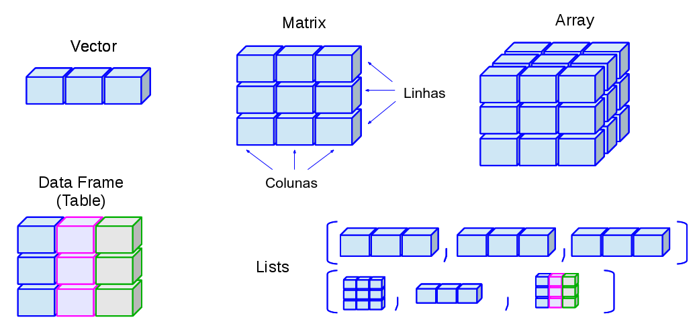

# Estrutura de dados {#estrutura-dados}

```{r setup, include = FALSE}
rm(list = ls())
pcks <- c("knitr", "pander", "htmlTable")
easypackages::libraries(pcks)
opts_chunk$set(
  prompt = FALSE,
  cache = FALSE,
  fig.path = "images/",
  comment = "#>",
  collapse = TRUE
)
source("R/utils.R")
```


Existem diferentes formas de armazenar dados no `r rblue`. Algumas vezes os dados precisam ser armazenados de forma mais complexa do que por exemplo vetores. 

O `r rblue` possui uma variedade de estruturas (Figura \@ref(fig:fig-estrut-dados)). Dentre elas as fundamentais, ainda não vistas, são:

- *matrix* (matriz)

- *array* e *vector* (vetor)

- *list* (lista)

- *dataframe* (quadro ou tabela de dados)

```{r fig-estrut-dados, echo = FALSE, out.width="100%", fig.cap="Principais estruturas de dados no R."}

```

Neste curso nós focaremos nas estrutura de quadro de dados e listas que são as mais revelantes para processamento de dados ambientais. Matrizes e arranjos tendem a ser usadas por uma pequena fração de usuários e para aplicações específicas. Também existem outras estruturas específicas que são criadas por desenvolvedores para atender as suas necessidades. Essas estruturas são disponibilizadas com pacotes de contribuidores, como por exemplo estruturas de dados para manipulação de dados geoespaciais.

O Apêndice \@ref(oper-mat) oferece um material sobre matrizes caso você precise saber mais sobre esta estrutura de dados.


## Lista {#listas}

Listas são o segundo tipo de vetor. O primeiro tipo nós já vimos, são os **vetores atômicos**, nos quais todos os elementos devem ser de uma mesma classe de objeto. Listas são uma estrutura de dados muito versátil por pelo menos 3 razões:

  1. Os elementos podem ser de diferentes classes de objetos (p.ex.: um elemento `numeric`, outro `character`);
  2. Cada elemento pode ter um tamanho diferente;
  3. Os elementos podem conter diferentes estrutura de dados (p.ex.: um elemento `matrix`, outro `vector`);
  
Dentro da lista o conjunto de objetos são ordenados e cada elemento pode conter sub-elementos.

### Criação

As vezes precisamos de um *container* para armazenar diferentes tipos de dados do R e com diferente tamanhos. As *listas* servem para isso e permitem armazenar qualquer número de itens de qualquer tipo. Uma lista pode conter números, caracteres ou uma mistura de *dataframes*, sub-listas, matrizes e vetores.

Listas podem ser criadas com a função `list()`. A especificação do conteúdo de uma lista é muito similar a da função `c()` vista anteriormente. Nós simplesmente listamos os elementos da lista separados por uma vírgula dentro da função `list()`.

```{r Chunk410, message=FALSE   , echo=TRUE, eval=TRUE}
# lista de dados heterogêneos
lst <- list(1:4, c(1.1, 2.3, 5.9), c(TRUE, FALSE), "R", list(0, 1))
lst
# estrutura da lista
str(lst)
# tamanho da lista (num. de componentes ou elementos)
length(lst)
# atribuindo nomes a lista
names(lst)
names(lst) <- c("vetor_int", "vetor_dbl", "logico", "char", "lista")
```

Os índices em colchetes duplos `[[]]` identificam o elemento ou a componente da lista. Os índices em colchete simples `[]` indicam qual sub-elemento da lista está sendo mostrado. Por exemplo `1.1` é o primeiro sub-elemento do segundo elemento da lista `lst`. Desse aninhamento de elementos surge o sistema de indexação de listas. A estrutura de uma lista pode se tornar complicada com o aumento do grau de sub-elementos. Mas essa flexibilidade, faz das listas uma ferramenta de armazenamento de dados para todos propósitos.

```{block, note-virgulas, type='rmdtip'}
Veremos que no R, listas são frequentemente usadas para armazenar a saída de funções com diversos resultados. Como por exemplo a saída das funções `rle()`.
```


Para verificar se uma lista é aninhada usamos a função `is.recursive()`.

```{r}
is.recursive(lst)
```


Vamos ver um exemplo onde criamos uma lista com informações de duas estações meteorológicas.

```{r Chunk412, message=FALSE  , echo=TRUE, eval=TRUE}
# matriz de dados meteorológicos da estação de Santa Maria
dados_sm <- cbind(
  tar = c(31, 35, 21, 23, 33, 17),
  prec = c(300, 200, 150, 120, 210, 110)
)
dados_sm
# lista com informações da estação de santa maria
sm_l <- list(
  c(-45, -23),
  "Santa Maria",
  dados_sm
)
sm_l
# adicionar nomes aos elementos
names(sm_l) <- c("coords", "cidade", "dados")
sm_l
# matriz de dados meteorológicos da estação de Júlio de Castilhos
dados_jc <- cbind(
  tar = c(22.5, 20, 18.75, 18, 20.25, 17.75),
  prec = c(360, 310, 285, 270, 315, 265)
)
# criando lista de JC, mas nomeando de forma diferente
jc_l <- list(
  coords = c(-45.1, -23.2),
  cidade = "Júlio de Castilhos",
  dados = dados_jc
)
# adicionar nomes as componentes
names(jc_l) <- names(sm_l)
jc_l
```

As informações de cada estação estão armazenadas em 2 listas. Mas é mais prático termos todas estações em um única lista:

```{r Chunk413, message=FALSE  , echo=TRUE, eval=TRUE}
# combinando listas mantendo os elementos separadamente
dados_l <- list(sm_l, jc_l)
dados_l
names(dados_l)
names(dados_l) <- c("sm", "jc")
dados_l
# como a lista é um tipo vetor, a função length()
# fornece o número de elementos da lista
length(dados_l)
```

Para resumir a estrutura de uma lista (ou *dataframe*) podemos usar a função `str()`:

```{r Chunk414, message=FALSE   , echo=TRUE, eval=TRUE}
str(dados_l)
```

As listas também poderiam ser combinadas com função concatena ou combina `c()`. 

```{r Chunk415, message=FALSE   , echo=TRUE, eval=TRUE}
dados_l2 <- c(sm_l, jc_l)
dados_l2
str(dados_l2)
```


### Indexação 

#### Operador `[`

Assim como em vetores, podemos acessar os elementos de uma lista usando os colchetes `[` com índices numéricos positivos, negativos, caracteres (nomes dos elementos) e lógicos. As expressões abaixo, ilustram o uso dessas diferentes formas de seleção de elementos e produzem o mesmo resultado.

```{r chunck 420, message=FALSE   , echo=TRUE, eval=TRUE}  
sm_l[1:2]
sm_l[c("coords", "alt")]
```

O resultado da seleção do 1º e 2º elemento é uma lista menor que a original. Isso não é muito útil, uma vez que muitas funções do R não lidam com listas.  Por exemplo, se quiséssemos calcular a soma do vetor contido do primeiro elemento da lista `lst` obtém-se um erro.

```{r chunck 421, message=FALSE   , echo=TRUE, eval=TRUE, error=TRUE}  
# seleção do 1º elemento da lst
lst[1]
# o resultado da seleção é uma lista
mode(lst[1])
# a função sum() espera como entrada um vetor
sum(lst[1])
# acessando elemento inexistente
lst[6]
```

Então ao selecionar elementos de uma lista com o operador `[` o resultado preserva a estrutura original do objeto. `lst` é uma lista e o resultado da seleção `lst[1]` também é uma lista.
**Portanto, a seleção de elementos com o operador `[` preserva a estrutura do objeto original**.   

#### Operador `[[` e `$`

Entretanto na maioria das vezes estamos interessados no conteúdo dos elementos de uma lista. Para fazer isso há dois operadores: o duplo colchetes `[[` e o `$`. Para acessar elementos individuais de uma lista usamos o duplo colchetes `[[` especificando o número do elemento ou o nome. Essa forma de seleção de dados permite o acesso a um elemento por vez. 

```{r Chunk4220, message=FALSE   , echo=TRUE, eval=TRUE}
# 1º elemento de sm_l
sm_l[[1]]
sm_l[["coords"]]
# modo de sm_l
mode(sm_l)
# ultimo elemento de sm_l
sm_l[[length(sm_l)]]
sm_l[["dados"]]
# subelementos
dados_l[["sm"]][["cidade"]]
```

Para acessar o conteúdo de elementos de uma lista que possui nomes podemos também usar o  operador `$`. Ele funciona de forma similar ao duplo colchetes usado com o nome do elemento da lista. Mas esse operador tem duas vantagens: a IDE RStudio autocompleta o nome do elemento (usando a tecla `<tab>`) e o R aceita o nome parcial dos nomes dos elementos.

```{r Chunk4221, message=FALSE   , echo=TRUE, eval=TRUE}
# seleção de dados por nomes usando o símbolo $
dados_l$s
dados_l$j
dados_l$sm$dados
dados_l$sm$dados[3:5, 1:2]
dados_l$sm$dados[, "tar"]
dados_l$sm$dados[, "tar", drop = FALSE]
```

#### Lista de condimentos 

É fácil de confundir quando usar `]` e `]]`. A tabela abaixo ajuda lembrar da diferença entre eles.

```{r, echo = FALSE}
df <- data.frame(
  descrição = c(
    "frasco de pimenta",
    "frasco de pimenta com apenas 1 pacote de pimenta",
    "1 pacote de pimenta",
    "conteúdo de um pacote de pimenta"
  ),
  código = c("frasco", "frasco[1]", "frasco[[1]]", "frasco[[1]][[1]]"),
  resultado = c(
    pandoc.image.return("images/pepper.jpg"),
    pandoc.image.return("images/pepper-1.jpg"),
    pandoc.image.return("images/pepper-2.jpg"),
    pandoc.image.return("images/pepper-3.jpg")
  ),
  stringsAsFactors = FALSE
)
pander::pander(df)
```

### Conversão de lista para vetor e vice-versa.

```{r Chunk45, message=FALSE   , echo=TRUE, eval=TRUE}
vet <- 1:10
vet
vet.list <- as.list(vet)
vet.list
# desmanchando a lista
unlist(vet.list)
# deletando um elemento de uma lista
length(vet.list)
vet.list[8] <- NULL
vet.list
length(vet.list)
```

### Conversão de `list` para `data.frame`

Vamos modificar a lista `sm_l` para convertê-la em um *dataframe*.

```{r Chunk46, message=FALSE   , echo=TRUE, eval=TRUE}
sm_l
# ao invés da componente coords, criamos uma lon e lat
sm_l$lon <- sm_l$coords[1]
sm_l$lat <- sm_l$coords[2]
sm_l$coords <- NULL
sm_l
# converter para dataframe
sm_df <- data.frame(sm_l)
sm_df
```


## Dataframe

Um dataframe é o objeto mais usado para guardar conjunto de dados na forma de tabela (tabulares ou planos).

A estrutura de um *dataframe* é retangular como a de uma matriz. Mas tem a vantagem de armazenar vetores de diferentes tipos (`character`, `numeric`, `logical` e etc) nas suas colunas. O que não é possível em uma matriz. Ou seja é uma estrutura de armazenamento de dados heterogênea. *Matrix*, *arrays* e *vector* só armazenam dados homogêneos.

Cada linha do *dataframe* corresponde a um registro da tabela. Cada coluna corresponde a uma variável a ser armazenada para cada registro da tabela.

### Criação

Uma das formas mais simples de se criar um *dataframe* é através da função `data.frame()`.

```{r Chunk510, message=FALSE   , echo=TRUE, eval=TRUE}
# criando um dataframe
dados <- data.frame(
  datas = c(
    "2013-01-01", "2013-01-02", "2013-01-03", "2013-01-04", "2013-01-05",
    "2013-01-06", "2013-01-07", "2013-01-08", "2013-01-09", "2013-01-10",
    "2013-01-11", "2013-01-12", "2013-01-13", "2013-01-14", "2013-01-15"
  ),
  cidade = rep("Santa Maria", 15),
  tar = c(31, 35, 21, 23, 33, 17, 18, 16, 34, 27, 15, 28, 22, 29, 32)
)
dados
class(dados)
is.data.frame(dados)
```

Para um diagnóstico rápido das variáveis de um `dataframe` usamos a função `str()`: 

```{r Chunk511, message=FALSE   , echo=TRUE, eval=TRUE}
# descrição geral do conjunto de dados
str(dados)
```

A saída da função `str()`indica que há duas variáveis da classe `factor`.
Em um *dataframe* vetores do tipo `character` são automaticamente convertidos em `factor`. Este é o comportamento *default* da função `data.frame()`. Para desabilitar essa conversão você precisa definir o parâmetro `stringsAsFactors = FALSE` na função `data.frame()`. Vamos recriar o *dataframe* `dados` sem a conversão de `character` para `factor`.


```{r Chunk512, message=FALSE   , echo=TRUE, eval=TRUE}
# criando um dataframe
dados <- data.frame(
  datas = c(
    "2013-01-01", "2013-01-02", "2013-01-03", "2013-01-04", "2013-01-05",
    "2013-01-06", "2013-01-07", "2013-01-08", "2013-01-09", "2013-01-10",
    "2013-01-11", "2013-01-12", "2013-01-13", "2013-01-14", "2013-01-15"
  ),
  cidade = rep("Santa Maria", 15),
  tar = c(31, 35, 21, 23, 33, 17, 18, 16, 34, 27, 15, 28, 22, 29, 32),
  stringsAsFactors = FALSE
)
str(dados)
```

A função `summary()` fornece um resumo estatístico das variáveis (colunas) de um *dataframe*.

```{r Chunk513, message=FALSE   , echo=TRUE, eval=TRUE}
# resumo estatístico dos dados
summary(dados)
```

### Atributos de um *dataframe*

*dataframe* é uma estrutura de dados avançada e possui diversos atributos. 

```{r Chunk520, message=FALSE   , echo=TRUE, eval=TRUE}
# atributos
attributes(dados)
# atributos armazenados em uma lista
str(attributes(dados))
# número de colunas
ncol(dados)
# número de linhas
nrow(dados)
# dimensões
dim(dados)
# nomes podem ser atribuídos as linhas e as colunas
rownames(dados)
# novos nomes para as linhas de dados
rownames(dados) <- paste0("linha", rownames(dados))
dados
# removendo nomes das linhas
rownames(dados) <- NULL
dados
# mesmo que names(dados)
colnames(dados)
# ou simplesmente
names(dados)
```

### Acesso as variáveis de um *dataframe* 

Existem várias formas de acessar as variáveis de um *dataframe*. Os operadores para extração de elementos são os mesmos utilizados para extração de elementos de uma lista: `[`, `[[` e `$`. Mas observe a diferença nos resultados extraídos com cada operador.

```{r Chunk530, message=FALSE   , echo=TRUE, eval=TRUE, error =TRUE}
# variáveis do dataframe
names(dados)
# acessando os dados de temperatura
dados[, 3]
# ou
dados[, "tar"]
# ou
dados$tar
is.vector(dados$tar)
# note a diferença no resultado da extração
dados["tar"]
class(dados["tar"])
dados[["tar"]]
class(dados[["tar"]])
dados[, "tar"]
class(dados[, "tar"])
```

Portanto *dataframes* tem estrutura retangular similar a das matrizes e algumas de listas (diferentes colunas podem conter diferentes tipos de objetos).

#### Função `with()`

O acesso as variáveis de um *dataframe* também é possível com a função `with(data, expr)`.

```{r Chunk5310, message=FALSE  , echo=TRUE, eval=TRUE}
# acesso a variáveis de um dataframe
with(data = dados, expr = tar)
tarK <- with(data = dados, expr = tar + 273.15)
tarK
# gráfico de uma variável usando with()
with(data = dados, 
     # parâmetro expr geralmente não é mostrado
       plot(tar + 273.15, type = "o")
     )
```

O argumento pode ser substituído por qualquer expressão ou conjunto de expressões que envolvam as variáveis do *dataframe* de entrada.

Quando houver uma expressão com mais de uma linha você agrupa o código usando chaves `{}`.

```{r}
with(dados, 
     {
       dates <- as.Date(datas)
       plot(dates, tar)
     }
)
```


### Indexação, seleção e substituição 

Todos esquemas de  indexação usados para matrizes (seleção por índices, nomes, vetores lógicos - *ver Aula9*) podem ser usados com *dataframes*.

```{r Chunk540, message=FALSE   , echo=TRUE, eval=TRUE}
# exclui a primeiro e a última observação para todas variáveis
dados[-c(1, nrow(dados)), ]
# temperatura dos primeiros 5 dias
dados[1:5, 3]
# temperatura no dia 2013-01-09
dados[dados$datas == "2013-01-09", "tar"]
# acrescentar uma nova variavel
dados$prec <- c(rep(0, 5), 10, 18, 4, 0, 0, 5, 0, 0, 2, 0)
dados
```

Uma função específica para gerar subconjunto de dados em *dataframes* é a `subset()`. 

```{r Chunk541, message=FALSE , echo=TRUE, eval=TRUE}
# subconjunto baseado em condição lógica
ss1 <- subset(dados, datas == "2013-01-09", select = "tar")
ss1
# subconjunto baseado em condição lógica
ss2 <- subset(dados, tar > 26 & prec > 0)
ss2
# subconjunto baseado em condição lógica
ss3 <- subset(dados, tar > 26 | prec > 0)
ss3
# subconjunto baseado em condição lógica
ss4 <- subset(dados,
  datas %in% c("2013-01-09", "2013-01-13", "2013-01-15"),
  select = -cidade
)
ss4
# subconjunto baseado em condição lógica
ss4 <- subset(dados,
  !datas %in% c("2013-01-09", "2013-01-13", "2013-01-15"),
  select = -cidade
)
ss4
```

Uma função específica para alteração, remoção e inclusão de variáveis em um *dataframe* é a `transform()`. Essa função é mais indicada para alteração de mais de uma variável (ao mesmo tempo) de um *dataframe*.

```{r Chunk542, message=FALSE  , echo=TRUE, eval=TRUE}
# mudança do dataframe, alteração de várias variáveis
dados <- transform(dados,
  cidade = ifelse(1:nrow(dados) > 8, "Sao Sepe", cidade),
  datas = c(datas[1:8], datas[1:7]),
  anomalias = ifelse(cidade == "Santa Maria",
    tar - mean(tar[cidade == "Santa Maria"]),
    tar - mean(tar[cidade == "Sao Sepe"])
  )
)
dados
# alterar só uma variavel, anomalia normalizada
dados$anomalias.norm <- ifelse(dados$cidade == "Santa Maria",
  dados$anomalias / sd(dados$anomalias[dados$cidade == "Santa Maria"]),
  dados$anomalias / sd(dados$anomalias[dados$cidade == "Sao Sepe"])
)
dados
```

### Combinando *dataframes*

```{r Chunk550, message=FALSE  , echo=TRUE, eval=TRUE}
coords_df <- data.frame(
  lon = c(rep(-45, 8), rep(-45.1, 7)), # longitudes
  lat = c(rep(-23, 8), rep(-23.1, 7))
) # latitudes
d <- cbind(dados, coords_df)
d
# usando a própria função data.frame()
d2 <- data.frame(dados, coords_df, stringsAsFactors = FALSE)
d2
# verificando se os dois dataframes são idênticos
identical(d, d2)
# dados de Caçapava
cacapava <- data.frame(
  datas = "2013-01-01",
  cidade = "Cacapava",
  tar = 19,
  prec = 0,
  anomalias = NA,
  anomalias.norm = NA,
  lon = -45.1,
  lat = -23.2
)
d <- rbind(d, cacapava)
d
```

### Teste e Coerção

Podemos converter um objeto para *dataframe* com `as.data.frame()`:

+ Um vetor é transformado em um *dataframe* de uma coluna;

+ Uma lista terá uma coluna para elemento, se os elementos não forem de mesmo tamanho haverá um erro;
+ Uma matriz cria um *dataframe* com mesma estrutura de uma matriz;

```{r Chunk551, message=FALSE  , echo=TRUE, eval=TRUE}
# temperatura do ar média mensal do ano de 1990
temp90 <- c(
  25.00, 23.20, 22.50, 21.00, 19.00, 17.60,
  18.00, 19.70, 21.30, 22.00, 24.00, 26.80
)
# convertendo lista para dataframe
sm_l
sm_l_df <- as.data.frame(sm_l)
sm_l_df
# convertendo array para dataframe
v <- c(3, 100, NA, NA, 6)
v_df <- as.data.frame(v)
# convertendo vetor para dataframe
temp90_df <- as.data.frame(temp90)
```

A conversão de matriz para quadro de dados, pode ser feita da seguinte forma.

```{r}
vetor <- c(0, 1, -1, -2, 3, 5, -5)
mat <- matrix(vetor, ncol = 4, byrow = TRUE)
mat
# convertendo matrix para dataframe
mat
mat_df <- as.data.frame(mat)
names(mat_df)
mat_df
# testes
is.data.frame(mat_df)
class(v_df)
```

## Exercícios

1. Crie um vetor com os valores de $e^{x}cos{x}$ para os valores de $x = (3, 3.1, 3.2, ..., 6$).
```{r, include = FALSE}
x <- seq(3, 6, by = 0.1)
exp(x) * cos(x)
# (exp(1)^x)*cos(x)
```

- - - 


2. Crie os seguintes vetores.
    a. $(0.1^{3}\times0.2^{1}, 0.1^{6}\times0.2^{4}, ..., 0.1^{36}\times0.2^{34})$  
    
```{r, include = FALSE}
0.1 ^ (seq(3, 36, by = 3)) * (0.2 ^ (seq(1, 34, by = 3)))
```
`r paste(" ")`
    b. $(2, \frac{2^{2}}{2}, \frac{2^{3}}{3}, ..., \frac{2^{25}}{25})$  
    
```{r, include = FALSE}
2^(1:25)/(1:25)
#paste(2^(1:25), 1:25, sep = "/")
```

- - -

3. Reproduza a criação do vetor dias da semana (`dds`) mostrado abaixo.

```{r , message=FALSE, eval=TRUE, echo = FALSE, comment=""}
dds <- 1:7
names(dds) <- c(
  "Domingo", "Segunda-feira", "Terca-feira", 
  "Quarta-feira", "Quinta-feira", "Sexta-feira", 
  "Sabado"
)
dds
```

- - -

4. Escreva os códigos necessários para determinar:  

`r paste("  ")`a. o vetor lógico indicando quais números são pares na sequência de valores `r set.seed(2); paste0(paste( (nums <- sample(1:100, 10)) , collapse = ", "))`. Calcule o total de números ímpares.

`r paste("  ")`b. Se um ano é bissexto. Verifique os resultados de seu código para os anos `r set.seed(2); paste( (anos <- sample(1890:2015, 10)) , collapse = ", ")`. Calcule o total de anos com 365 dias.

```{r, include = FALSE}
set.seed(2)
# (a)
(eh_par <- nums %% 2 == 0)
(n_pares <- sum(eh_par))
# (b)
(eh_biss <- anos %% 4 == 0)
(n_biss <- sum(!eh_biss))
```

- - -

5. Quais códigos para gerar os seguintes dados:
  a.
```{r, eval=TRUE,echo=FALSE,comment=""}
(tar0 <- c(-20, seq(0,40, by = 10)))
```
  b.
```{r, eval=TRUE,echo=FALSE,comment=""}
(seq(-1, 1, by = 1/4))
```
  c.
```{r , eval=TRUE,echo=FALSE,comment=""}
(seq(-pi, pi, length.out = 12))
```
  d.
```{r , eval=TRUE,echo=FALSE,comment=""}
rep(1:5, times = 5:1)
```
  e.
```{r , eval=TRUE,echo=FALSE,comment=""}
rep(c(1:5, 4:1), times = c(5:1, 2:5))
``` 

  f. Dica: lembre da função `rep()` e seus argumentos `each` e `times`. Experimente usar vetores nesses argumentos.
  
```{r, eval=TRUE,echo=FALSE,comment=""}
vetor_f <- c(
  rep(rep(1:2, each = 2), times = 2),
  rep(rep(3:4, each = 2), times = 2)
)
(m <- matrix(vetor_f, byrow = TRUE, ncol = 4))
```

  g. Como a partir da matriz gerada na letra *f* você pode obter a matriz abaixo?
  
```{r, eval=TRUE,echo=FALSE,comment=""}
(mat_g <- t(m))
```

  h. Qual o código para converter a matriz gerada na letra *g* no vetor abaixo?
  
```{r, eval=TRUE,echo=FALSE,comment=""}
c(t(mat_g))
```

- - - 

6. Como obter as seguintes sequências a partir dos vetores fornecidos usando a mesma solução para todos casos?

```{r , eval=TRUE,echo=FALSE,comment=""}
v3 <- c(10, 0.5, 8, 4)
``` 

   a. v3 = `r paste0("(", paste(v3 , collapse = ", "), ")")`

```{r, eval=TRUE,echo=FALSE,comment=""}
1:length(v3)
``` 

```{r Chunk7b, eval=TRUE,echo=FALSE,comment=""}
v2 <- c(10, 0.5)
``` 

  b. v2 = `r paste0("(", paste(v2 , collapse = ", "), ")")`

```{r Chunk7b_sol, eval=TRUE,echo=FALSE,comment=""}
1:length(v2)
```

```{r Chunk7c, eval=TRUE,echo=FALSE,comment=""}
v1 <- c(10)
``` 
  c. v1 = `r paste0("(", paste(v1 , collapse = ", "), ")")`


```{r Chunk7c_sol, eval=TRUE,echo=FALSE,comment=""}
1:length(v1)
```

```{r Chunk7d, eval=TRUE,echo=FALSE,comment=""}
v0 <- c()
``` 

  d. v0 = `r paste0("(", paste(v0 , collapse = ", "), ")")`


```{r Chunk7d_sol, eval=TRUE,echo=FALSE,comment=""}
#1:length(v0)
seq_along(v0)
```

- - -

7. (a) Calcule a soma cumulativa dos números `r 2:6`. Dica: ver a função `cumsum()`. (b) Calcule a soma cumulativa destes números mas na ordem reversa. Dica: ver a função `rev()`.

```{r, echo = FALSE, results='hide'}
cumsum(2:6)
cumsum(rev(2:6))
```


- - -

8. Os dados abaixo são de precipitação horária de um evento severo ocorrido em 03/12/2012 em Santa Maria-RS. 

```{r, echo = FALSE}
hora <- (12:24) - 3
prec_h <- c(0, 0, 0, 0, 0, 0, 0, 21.4, 41.2, 2.6, 1, 0.4, 0)
evento <- data.frame(hora, prec = prec_h)
knitr::kable(evento, align = "c", longtable = TRUE)
```

a. Como seria o código para determinar a soma cumulativa da precipitação horária? Salve seu resultado em um vetor chamado `prec_acum`. Interprete o resultado `c(NA, diff(prec_acum))`.

```{r, include = FALSE}
(prec_acum <- cumsum(prec_h))
```

b. Mostre o código para encontrar o horário de ocorrência da precipitação máxima?

```{r, include = FALSE}
hora[which.max(prec_h)]
```

c. Mostre o código para obter a hora de início e fim do evento de  precipitação severa. Qual foi a duração do evento?

```{r, include = FALSE}
(inicio <- hora[prec_h > 0][1])
(fim <- hora[max(which(prec_h > 0))])
fim - inicio + 1
sum(prec_h > 0)
```

d. Qual foi a precipitação total do evento? Quanto da precipitação total do evento, em %, ocorreu até às 17 h?

```{r, include = FALSE}
tot_evento <- sum(prec_h)
perc_rel <- prec_h / tot_evento * 100
perc_rel
perc_rel_cum <- cumsum(perc_rel)
perc_rel_cum[hora == 17]
round(perc_rel_cum[hora == 17])
```


- - -

9. EXERCÍCIO RESOLVIDO. Considere o vetor `x` definido pelos números descritos abaixo. Mostre como  encontrar o primeiro número positivo localizado após o último número negativo. Por exemplo, seja o vetor `z` definido pelos valores (11, 10, 15, 2, 6, -15, -10, -22, -8, 5, 7, 2, 12, 8, 4, 1, 3, -3, -1, 30, 14). Os valores selecionados seriam 5 e 30.

Um possível código para chegar a esse resultado seria:

```{r}
x <- c(
  11, 10, 15, 2, 6, -15, -10, -22, -8,  5,
   7,  2, 12, 8, 4,   1,   3,  -3, -1, 30, 14
)
# x1 <- ifelse(x > 0, 1, 0)
# cópia de x
x01 <- x
# substituo x positivo por 1 e x negativo por 0
x01[x > 0] <- 1
x01[!x > 0] <- 0
res <- x[which(diff(x01) == 1) + 1]
res
```

- - -

10. Mostre o código para resolver as seguintes tarefas. Considere o vetor `prec` com valores de precipitação diária indicado abaixo.

```{r Chunk10, echo=FALSE, eval=FALSE}
# como gerar vetor de precipitações
vprec <- c(
  0, 0, 1, 1, 0, 1, 0, 0, 1, 1, 1, 0, 0, 1, 0, 0, 0, 0, 0, 0, 0,
  1, 0, 0, 0, 0, 0, 1, 0, 1, 0, 1, 0, 0, 1, 0, 0, 1, 0, 1, 1, 0,
  0, 1, 0, 0, 0, 0, 1, 1, 0, 0, 0, 0, 1, 1, 1, 1, 0, 1, 0, 1, 0,
  1, 1, 1, 0, 0, 0, 0, 0, 1, 0, 0, 0, 1, 0, 1, 1, 1, 0, 0, 0, 0,
  0, 1, 0, 1, 0, 1, 0, 0, 0, 0, 0, 0, 0, 0, 0, 0, 0, 1, 0, 1, 0,
  0, 1, 1, 1, 1, 1, 1, 0, 0, 1, 0, 0, 0, 1, 1, 0, 1, 1, 0, 1, 0,
  0, 0, 1, 1, 1, 1, 1, 1, 0, 0, 0, 1, 1, 1, 0, 0, 0, 0, 0, 1, 0,
  1, 0, 1, 0, 1, 1, 1, 0, 1, 0, 0, 0, 1, 0, 1, 1, 0, 0, 0, 0, 1,
  1, 0, 0, 0, 0, 1, 0, 1, 1, 0, 0, 0, 1, 1, 0, 1, 1, 0, 0, 0, 0,
  0, 1, 0, 0, 1, 0, 0, 1, 1, 1, 1, 0, 0, 0, 0, 0, 1, 0, 0, 0, 0,
  0, 1, 0, 0, 1, 0, 0, 1, 0, 0, 1, 1, 0, 0, 0, 0, 0, 0, 1, 0, 0,
  0, 0, 0, 0, 1, 0, 0, 0, 0, 1, 0, 1, 0, 0, 0, 0, 0, 0, 0, 0, 1,
  0, 1, 1, 0, 0, 0, 0, 0, 1, 0, 0, 1, 0, 1, 0, 0, 0, 1, 1, 0, 1,
  1, 1, 0, 1, 0, 0, 0, 0, 1, 0, 1, 1, 0, 0, 0, 0, 0, 0, 1, 0, 1,
  1, 0, 1, 1, 1, 0, 0, 0, 1, 1, 0, 0, 0, 0, 1, 0, 1, 0, 0, 0, 1,
  1, 0, 1, 0, 0, 0, 1, 0, 0, 0, 1, 0, 0, 0, 0, 0, 1, 0, 0, 1, 0,
  1, 0, 0, 0, 1, 0, 0, 0, 1, 0, 1, 1, 1, 0
)
prec <- vprec
prec[vprec > 0] <- runif(sum(vprec > 0)) * sample(c(0.1, 1, 5, 10, 20), size = sum(vprec > 0), replace = TRUE, prob = c(0.1, 0.30, 0.3, 0.2, 0.1))
prec
dput(round(prec, 2))
```

```{r Chunk10a, message=FALSE, echo=TRUE, eval=TRUE}
prec <- c(
  0, 0, 0, 0.8, 0, 0.01, 0.75, 0,
  0, 0, 0, 0.35, 0.08, 0, 0, 0, 0, 0.31, 0, 3.57, 12.17, 0, 0,
  0, 0.04, 3.16, 0, 0.95, 0.79, 0, 0, 0, 0, 0, 3.51, 0, 0, 0.16,
  0, 0, 8.16, 0.54, 4.39, 1.24, 0, 0, 0, 0, 0, 2.43, 0, 0, 0, 0,
  0, 7.18, 0, 0, 0.26, 0, 0, 0.28, 0, 0, 0.09, 0.38, 0, 0, 0, 0,
  0, 0, 0.51, 0, 0, 0, 0, 0, 0, 0.67, 0, 0, 0, 0, 0.15, 0, 0.82,
  0, 0, 0, 0, 0, 0, 0, 0, 0.37, 0, 0.58, 4.95, 0, 0, 0, 0, 0, 7.68,
  0, 0, 0.37, 0, 1.56, 0, 0, 0, 0.34, 0.48, 0, 4.21, 2.28, 4.3,
  0, 3.38, 0, 0, 0, 0, 7.28, 0, 4.89, 3.91, 0, 0, 0, 0, 0, 0, 2.93,
  0, 2.49, 0.77, 0, 2.9, 3.53, 0.83, 0, 0, 0, 0.94, 0.59, 0, 0,
  0, 0, 0.04, 0, 0.65, 0, 0, 0, 6.23, 0.09, 0, 0.66, 0, 0, 0, 4.42,
  0, 0, 0, 0.84, 0, 0, 0, 0, 0, 0.09, 0, 0, 0.08, 0, 0.66, 0, 0,
  0, 0.06, 0, 0, 0, 3.28, 0, 0.8, 5.69, 0.8, 0
)
```

  (a) Quantos dias ocorreram no intervalo 0 < prec < 0.25?
  
```{r Chunk10a1, echo=FALSE, eval=TRUE, results = FALSE}
n_ev <- sum(prec > 0 & prec < 0.25)
n_ev
vals_ev <- prec[prec > 0 & prec < 0.25]
vals_ev
```

  (b) Substitua os valores de chuva registrados no intervalo 0 < prec < 0.25 por 0.
  
```{r Chunk10b, echo=FALSE, eval=TRUE, results = FALSE}
prec[prec > 0 & prec < 0.25] <- 0
prec
```  

  (c) Crie um vetor denominado `prec01` indicando o estado da precipitação (chuvoso = 1, seco = 0) baseado no limiar de 0.25 mm para detecção de chuva pelo pluviômetro. 
```{r Chunk10c, echo=FALSE, eval=TRUE, results = FALSE}
limiar <- 0.25
prec01 <- as.integer(prec > limiar)
# prec01
prec_estado <- prec01
prec_estado[prec_estado == 1] <- "chuvoso"
# prec_estado
prec_estado[prec_estado == "0"] <- "seco"
prec_estado
```

  (d) Qual a probabilidade de chuva dessa série de precipitação diária?
  
```{r Chunk10d, echo=FALSE, eval=TRUE, results = FALSE}
prob <- sum(prec01) / length(prec01)
prob <- mean(prec01)
# %
prob_perc <- mean(prec01) * 100
prob
prob_perc
``` 

  (e) Qual a probabilidade de chover dois dias consecutivos (`p11`)? Calcule a probabilidade de chover em qualquer um de dois dias consecutivos (`p01 + p10`)?

```{r Chunk10e, message=FALSE, echo=FALSE, eval=TRUE, results=FALSE}
choveu <- data.frame(
  hoje = prec01[-length(prec01)],
  amanha = prec01[-1]
)
choveu
# p11: núm de eventos com chuva em dois dias consecutivos /núm. de combinações de 2 dias
prob11 <- with(
  choveu,
  sum(hoje == 1 & amanha == 1) / length(amanha) * 100
)
prob11
# p01
prob01 <- with(
  choveu,
  sum(hoje == 0 & amanha == 1) / length(amanha) * 100
)
prob01
# p10
prob10 <- with(
  choveu,
  sum(hoje == 1 & amanha == 0) / length(amanha) * 100
)
prob10
prob10 == prob01
# sum(sapply(1:(length(prec01)-1), function(i) if(prec01[i] == 1 & prec01[i+1] == 1) 1 else 0))/length()
# numero de vezes que choveu ou hoje ou amanhã: p(1|1)
prob12 <- with(
  choveu,
  sum(hoje != amanha) / length(amanha) * 100
)
prob12
# p00
prob00 <- with(
  choveu,
  sum(hoje == 0 & amanha == 0) / length(amanha) * 100
)
prob00
# somas das probalidades deve ser igual a 1
prob12 + prob11 + prob00
```

```{r Chunk10e1, echo=FALSE, eval=TRUE, results='hide'}
## PARA MELHOR VISUALIZAÇÃO
# data frame para visualização de casos de prec com 2 consecutivos
conds_df <- with(
  choveu,
  data.frame(hoje,
    amanha,
    cond00 = hoje == 0 & amanha == 0,
    cond11 = hoje == 1 & amanha == 1,
    cond01 = (hoje == 0 & amanha == 1),
    cond10 = (hoje == 1 & amanha == 0),
    cond12 = (hoje != amanha)
  )
)
# dia que não permite comparação para as transições de estado
# conds_df <- conds_df[complete.cases(conds_df), ]
(probs <- colSums(conds_df) / nrow(conds_df))
# verificação das probabilidades
(probs_sum <- sum(probs[-c(1:2, 7)]))
```

  (f) Determine a duração de cada evento chuvoso (número de dias consecutivos).
   
> Dica: comece encontrando a posição do início do evento e depois a posição final do envento. A diferença entre as posições fornece a duração do evento. O exercício resolvido (9) é análogo a esse exercício.

```{r Chunk10f, echo=FALSE, eval=TRUE, results='hide'}
# posições iniciais do evento
posi <- which(diff(c(0, prec01)) == 1)
# posições finais do evento
posf <- c(which(diff(c(prec01, 0)) == -1))
# duracao de cada evento
duracao <- posf - posi + 1
# duracao
names(duracao) <- paste("evento", 1:length(duracao), sep = "")
```

O resultado esperado é um vetor que identifique o evento e sua duração.

```{r Chunk10f1}
duracao
```

- - -

11. EXERCÍCIO RESOLVIDO. Dado o vetor `temp` mostrado abaixo.

```{r Chunk111, echo=FALSE, eval=TRUE}
temp <- sample(0:30, 30)
temp[2:4] <- NA
temp[10:15] <- NA
temp[23:29] <- NA
# dput(temp)
temp <- c(
  NA, NA, 27L, 7L, 4L, 0L, 26L, 15L, 25L, NA, NA, NA, NA, 6L,
  29L, 18L, 17L, 23L, 20L, 1L, 30L, 13L, NA, NA, NA, NA, NA, NA,
  NA, 19L
)
```
```{r Chunk112}
temp <- c(
  NA, NA, 27L, 7L, 4L, 0L, 26L, 15L, 25L, NA, NA, NA, NA, 6L,
  29L, 18L, 17L, 23L, 20L, 1L, 30L, 13L, NA, NA, NA, NA, NA, NA,
  NA, 19L
)
```

   a. Como você pode codificar a obtenção de um vetor com zeros nos valores válidos e com números sequenciais dentro das falhas?

```{r Chunk11a}
# vetor lógico de falhas
eh_falha <- is.na(temp)
# soma cumulativa de falhas
acum_falhas <- cumsum(eh_falha)
# calculando soma a partir do início da falha
seq_falhas <- acum_falhas - cummax((!eh_falha) * acum_falhas)
seq_falhas
```


   b. Como a partir do vetor resultante em *11.b* obter um vetor cujo os valores
dentro das falhas indique a ordem de ocorrência da falha.

```{r Chunk11c}
(ordem_falhas <- cumsum(seq_falhas == 1) * as.integer(eh_falha > 0))
```

   c. Qual o tamanho de cada falha.
   
```{r}
pos_fim_falha <- which(c(NA, diff(ordem_falhas)) < 0) - 1
(tamanho_falhas <- seq_falhas[pos_fim_falha])
# names(tamanho_falhas) <- paste0("falha", unique(ordem_falhas[ordem_falhas > 0]))
names(tamanho_falhas) <- paste0("falha", seq_along(tamanho_falhas))
tamanho_falhas
```

   d. Determine o tamanho da maior falha?

```{r}
(max_falha <- max(tamanho_falhas))
```

- - -

12. Para os valores de velocidade ($V_h$) e a direção do vento ($\theta$) (na convenção meteorológica):

```{r Chunk12, include=FALSE}
ws <- c(10, 10, 10, 10, 14.142, 14.142, 14.142, 14.142, 0)
wd <- c(270, 180, 360, 90, 225, 315, 135, 45, 0)
```

$V_h$ = `r paste0("(", paste(ws , collapse = ", "), ")")`

$\theta$ = `r paste0("(", paste(wd , collapse = ", "), ")")`

   a. Determine as componentes zonal e meridional do vento.
   
   $$u = -V_{h} \cdot sin(\theta_{rad})$$
   $$v = -V_{h} \cdot cos(\theta_{rad})$$

```{r Chunk12_a, echo=FALSE, eval=TRUE, results = FALSE}
u <- round(-ws * sin(wd * pi / 180), 3)
u
v <- round(-ws * cos(wd * pi / 180), 3)
v
```

   b. Faça os cálculos necessários para reconstruir $V_h$ e $\theta$ a partir de $u$ e $v$ determinados no item **a**. Por convenção, a direção do vento $\theta$ em condições calmas ($V_h$ < 0.5 m s^-1^) é assumida como 0°.

$$V_{h} = \sqrt{(u^2 + v^2)}$$
$$\theta_{mat} = {\rm atan2}(-u, -v)\cdot\frac{180}{\pi}$$
$$
\theta = \left\{\begin{matrix}
\theta_{mat} + 360 & se & \theta_{mat} < 0 \\ 
0 & se & u = 0,\:  v = 0 \: \:  ou \: \:  V_{h} < 0.5\\
\end{matrix}\right.
$$


```{r Chunk12_b, echo=FALSE, eval=TRUE, results = FALSE}
# velocidade horizontal do vento a partir de u e v
(ws_uv <- round(sqrt(u^2 + v^2), 3))
# direção do vento
(wd_uv <- atan2(-u, -v) * 180/pi)
# ajuste para dir <= 0 do angulo matemático para meteorológico
wd_uv[wd_uv <= 0] <- wd_uv[wd_uv <= 0] + 360
wd_uv[u == 0 & v == 0] <- 0
wd_uv
wd
identical(wd, wd_uv)
all.equal(wd, wd_uv)
```

Como resultado monte um dataframe com todas variáveis derivadas.

```{r, echo=FALSE}
knitr::kable(data.frame(u, v, ws, 
           wd, wd_uv, 
           dir = c("Oeste", "Sul", "Norte", 
                   "Leste", "Sudoeste", "Noroeste",
                   "Sudeste", "Nordeste", "Calmo")
           ))
```


> Dica: ver figura abaixo.


- - -


13. Para as séries de `prec_obs` e `prec_sim` calcule:

- a proporção corretamente prevista $PC = \frac{wc+dc}{n}$ 
- o índice de sucesso crítico $CSI=\frac{wc}{wc+wi+di}$. 

Onde $wc$ e $dc$ são as previsões corretas de dias úmidos ($prec > 0.25$ mm dia^-1^) e secos respectivamente, $wi$ e $di$ são as previsões incorretas de dias úmidos e secos respectivamente. $n$ é o n° total de previsões.

```{r , include=TRUE}
prec_obs <- c(
  0, 0, 0, 0.5, 1, 6, 9, 0.2, 1, 0, 0, 0.25,
  10, 15, 8, 3, 0, 0, 0, 0, 0, 0, 0.25, 0,
  0, 0, 1, 5, 0, 20, 0, 0, 0, 0, 1, 1,
  0, 2, 12, 1, 0, 0, 0, 0, 0, 0, 5, 5
)
prec_sim <- c(
  0, 0.2, 0.1, 0, 0, 3, 1, 1, 1, 1, 0, 3,
  0, 10, 4, 1, 0.3, 0.5, 0.5, 0.5, 0.5, 0, 0.25, 0.25,
  0.25, 0, 0.5, 3, 0, 5, 0, 0, 0, 0, 0.5, 0,
  0.25, 0.2, 0, 0.2, 0, 0, 0, 0, 1, 2, 1, 0
)
```


```{r , include=FALSE}
wc <- sum((prec_obs > 0.25) & (prec_sim > 0.25))
dc <- sum((prec_obs <= 0.25) & (prec_sim <= 0.25))
n <- length(prec_obs)
wi <- sum((prec_obs <= 0.25) & (prec_sim > 0.25))
di <- sum((prec_obs > 0.25) & (prec_sim <= 0.25))
PC <- (wc + dc) / n
PC
CSI <- wc / (wc + wi + di)
CSI
```

- - -

14. Escreva o código para calcular o coeficiente de correlação de Pearson (`r`) entre os vetores `obs` e `prev`. 


Confira seu resultado com a saída da função `cor(obs, prev)`. 

```{r , include=TRUE}
obs <- c(
  -0.49, 0.27, -0.48, 0.8, -1, 0.1, -1.16,
  0.58, -1.6, -0.31, 0.45, -0.98, 0.19, 0.73,
  -0.49, -0.04, -0.11, 0.46, 2.02, -1.05
)
prev <- c(
  NA, -0.49, 0.27, -0.48, 0.8, -1, 0.1, -1.16,
  0.58, -1.6, -0.31, 0.45, -0.98, 0.19, 0.73,
  -0.49, -0.04, -0.11, 0.46, 2.02
)
```


```{r , include = FALSE}
ok <- !(is.na(obs) | is.na(prev))
obs <- obs[ok]
prev <- prev[ok]
n <- length(prev)
# cálculo da correlação
(r <- sum((obs - mean(obs)) * (prev - mean(prev))) /
  sqrt(sum((obs - mean(obs)) ^ 2) * sum((prev - mean(prev)) ^ 2)))
cor(obs, prev)
```

- - - 

15. Construa uma função para converter valores de temperatura em K para °C e outra para converter ângulos de radianos para graus. Utilize dois exemplos para mostrar que suas funções funcionam corretamente.

```{r , include=FALSE}
k2c <- function(tk) tk - 273.15
k2c(300)
k2c(273)
rad2graus <- function(rad) rad / pi * 180
rad2graus(pi)
rad2graus(pi / 2)
```
