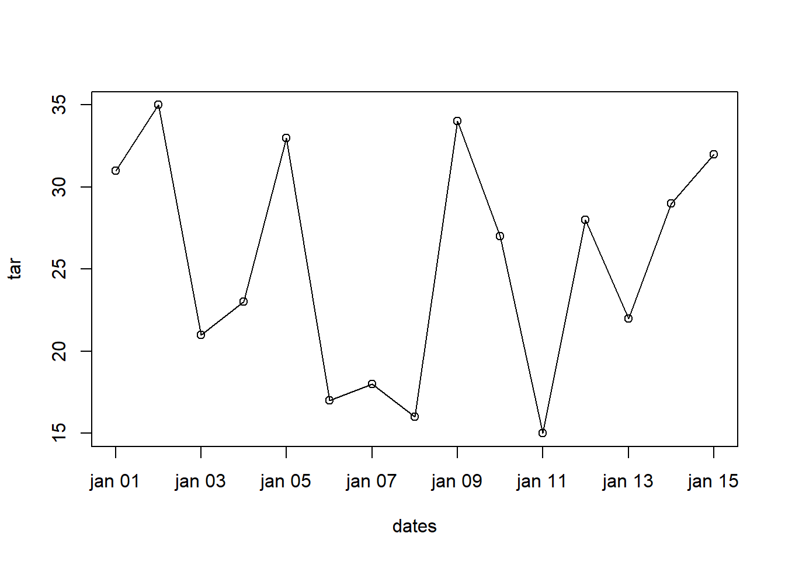

# Estrutura de dados {#estrutura-dados}


Existem diferentes formas de armazenar dados no . Algumas vezes os dados precisam ser armazenados de forma mais complexa do que por exemplo vetores. 

O  possui uma variedade de estruturas (Figura \@ref(fig:fig-estrut-dados)). Dentre elas as fundamentais, ainda não vistas, são:

- *matrix* (matriz)

- *array* (arranjo)

- *list* (lista)

- *dataframe* (quadro de dados ou tabela de dados)

<div class="figure">

<p class="caption">(\#fig:fig-estrut-dados)Principais estruturas de dados no R.</p>
</div>

As estruturas de dados matriz e arranjo não serão vistas em detalhes, mas você pode encontrar no Apêndice \@ref(oper-mat) um material sobre matrizes e arranjos, caso você precise saber mais sobre esta estrutura de dados. Elas tendem a ser usadas em aplicações específicas, por uma pequena fração de usuários. 

Também existem outras estruturas de dados específicas que são criadas por desenvolvedores para atender às suas necessidades. Essas estruturas são disponibilizadas com pacotes de contribuidores, como por exemplo estruturas de dados para manipulação de dados geoespaciais (p.ex.: [raster](https://cran.r-project.org/web/packages/raster/index.html), [sf](https://cran.r-project.org/web/packages/sf/index.html)).

Neste curso nós focaremos nas estrutura de quadro de dados (tradução de *data frame*) e lista (*list*) que são as mais revelantes para processamento de dados ambientais. 


## Lista {#listas}

Listas são o segundo tipo de vetor. O primeiro tipo nós já vimos, são os **vetores atômicos**, nos quais todos os elementos devem ser dados do mesmo tipo. Listas são uma estrutura de dados mais versátil por pelo menos 3 motivos:

  1. Os elementos podem ser de diferentes classes de objetos (p.ex.: um elemento `numeric`, outro `character`);
  
  2. Cada elemento pode ter um tamanho diferente;
  
  3. Os elementos podem conter diferentes estrutura de dados (p.ex.: um elemento `matrix`, outro `vector`);
  
Dentro da lista o conjunto de objetos são ordenados e cada elemento pode conter sub-elementos.

### Criação

As vezes precisamos de um *container* para armazenar diferentes tipos de dados do R e com diferente tamanhos. As *listas* servem para isso e permitem armazenar qualquer número de itens de qualquer tipo. Uma lista pode conter números, caracteres ou uma mistura de *dataframes*, sub-listas, matrizes e vetores.

Listas podem ser criadas com a função `list()`. A especificação do conteúdo de uma lista é muito similar a da função `c()` vista anteriormente. Nós simplesmente listamos os dados que queremos como elementos da lista separados por vírgula dentro da função `list()`.


```r
# lista de dados heterogêneos
lst <- list(
  # 4 vetores atômicos
  c(1L, 6L, 10L, NA),
  c(-1, 0, 1, 2, NA),
  c(FALSE, NA, FALSE, TRUE),
  c('ae', NA, "ou"),
  # uma lista com 2 elementos 
  list(0, 1)
)
lst
#> [[1]]
#> [1]  1  6 10 NA
#> 
#> [[2]]
#> [1] -1  0  1  2 NA
#> 
#> [[3]]
#> [1] FALSE    NA FALSE  TRUE
#> 
#> [[4]]
#> [1] "ae" NA   "ou"
#> 
#> [[5]]
#> [[5]][[1]]
#> [1] 0
#> 
#> [[5]][[2]]
#> [1] 1
```

Os índices em colchetes duplos `[[]]` identificam o elemento ou a componente da lista. Os índices em colchete simples `[]` indicam qual sub-elemento da lista está sendo mostrado. Por exemplo `-1` é o primeiro elemento do vetor armazenado no segundo elemento da lista `lst`. Desse aninhamento de elementos surge o sistema de indexação de listas. A estrutura de uma lista pode se tornar complicada com o aumento do grau de sub-elementos. Mas essa flexibilidade, faz das listas uma ferramenta de armazenamento de dados para diversos propósitos.

Uma forma rápida de visualizar a estrutura de uma lista com a função `str()`:


```r
str(lst)
#> List of 5
#>  $ : int [1:4] 1 6 10 NA
#>  $ : num [1:5] -1 0 1 2 NA
#>  $ : logi [1:4] FALSE NA FALSE TRUE
#>  $ : chr [1:3] "ae" NA "ou"
#>  $ :List of 2
#>   ..$ : num 0
#>   ..$ : num 1
```

A saída mostra que a lista tem 5 elementos, para cada elemento é indicado seu tipo de dado. Uma lista pode armazenar uma lista dentro de suas componentes. Neste caso a lista é dita ser uma **lista aninhada**. Em algumas circunstâncias você pode precisar verificar se uma lista é aninhada e para isso usamos a função `is.recursive()`.


```r
is.recursive(lst)
#> [1] TRUE
```

Listas, por serem vetores, podem ter nomes:


```r
names(lst)
#> NULL
names(lst) <- c("vetor_int", "vetor_dbl", "vetor_log", "vetor_char", "lista")
```

Note a diferença de como é mostrada no console a lista após ter sido nomeado seus componentes:


```r
lst
#> $vetor_int
#> [1]  1  6 10 NA
#> 
#> $vetor_dbl
#> [1] -1  0  1  2 NA
#> 
#> $vetor_log
#> [1] FALSE    NA FALSE  TRUE
#> 
#> $vetor_char
#> [1] "ae" NA   "ou"
#> 
#> $lista
#> $lista[[1]]
#> [1] 0
#> 
#> $lista[[2]]
#> [1] 1
```

Ao invés do duplo colchetes, agora aparecem os nomes das componentes da lista precedidas do símbolo `$`. A lista interna da `lst` (5° elemento) segue sendo impressa com duplo colchetes uma vez que seus elementos não tem nomes.

<div class="rmdtip">
<p>Veremos que <strong>listas</strong> são frequentemente usadas para armazenar a saída de funções com diversos resultados. Como por exemplo a saída das funções <code>rle()</code>. Esta função é bastante útil para identificar sequência de dados repetidos.</p>
</div>


### Exemplo de lista com dados de estações meteorológicas

Vamos ver um exemplo onde criamos uma lista com dados e informações (metadados) de duas estações meteorológicas.


```r
# matriz de dados meteorológicos da estação de Santa Maria
dados_sm <- cbind(
  tar = c(31, 35, 21, 23, 33, 17),
  prec = c(300, 200, 150, 120, 210, 110)
)
dados_sm
#>      tar prec
#> [1,]  31  300
#> [2,]  35  200
#> [3,]  21  150
#> [4,]  23  120
#> [5,]  33  210
#> [6,]  17  110
# lista com informações da estação de santa maria
sm_l <- list(
  c(-45, -23),
  "Santa Maria",
  dados_sm
)
sm_l
#> [[1]]
#> [1] -45 -23
#> 
#> [[2]]
#> [1] "Santa Maria"
#> 
#> [[3]]
#>      tar prec
#> [1,]  31  300
#> [2,]  35  200
#> [3,]  21  150
#> [4,]  23  120
#> [5,]  33  210
#> [6,]  17  110
# adicionar nomes aos elementos
names(sm_l) <- c("coords", "cidade", "dados")
sm_l
#> $coords
#> [1] -45 -23
#> 
#> $cidade
#> [1] "Santa Maria"
#> 
#> $dados
#>      tar prec
#> [1,]  31  300
#> [2,]  35  200
#> [3,]  21  150
#> [4,]  23  120
#> [5,]  33  210
#> [6,]  17  110
# matriz de dados meteorológicos da estação de Júlio de Castilhos
dados_jc <- cbind(
  tar = c(22.5, 20, 18.75, 18, 20.25, 17.75),
  prec = c(360, 310, 285, 270, 315, 265)
)
# criando lista de JC, mas nomeando de forma diferente
jc_l <- list(
  coords = c(-45.1, -23.2),
  cidade = "Júlio de Castilhos",
  dados = dados_jc
)
# adicionar nomes as componentes
names(jc_l) <- names(sm_l)
jc_l
#> $coords
#> [1] -45.1 -23.2
#> 
#> $cidade
#> [1] "Júlio de Castilhos"
#> 
#> $dados
#>        tar prec
#> [1,] 22.50  360
#> [2,] 20.00  310
#> [3,] 18.75  285
#> [4,] 18.00  270
#> [5,] 20.25  315
#> [6,] 17.75  265
```

As informações de cada estação estão armazenadas em 2 listas. Mas é mais prático termos todas estações em um única lista:


```r
# combinando listas mantendo os elementos separadamente
dados_l <- list(sm_l, jc_l)
dados_l
#> [[1]]
#> [[1]]$coords
#> [1] -45 -23
#> 
#> [[1]]$cidade
#> [1] "Santa Maria"
#> 
#> [[1]]$dados
#>      tar prec
#> [1,]  31  300
#> [2,]  35  200
#> [3,]  21  150
#> [4,]  23  120
#> [5,]  33  210
#> [6,]  17  110
#> 
#> 
#> [[2]]
#> [[2]]$coords
#> [1] -45.1 -23.2
#> 
#> [[2]]$cidade
#> [1] "Júlio de Castilhos"
#> 
#> [[2]]$dados
#>        tar prec
#> [1,] 22.50  360
#> [2,] 20.00  310
#> [3,] 18.75  285
#> [4,] 18.00  270
#> [5,] 20.25  315
#> [6,] 17.75  265
names(dados_l)
#> NULL
# nomes para cada estação
names(dados_l) <- c("sm", "jc")
dados_l
#> $sm
#> $sm$coords
#> [1] -45 -23
#> 
#> $sm$cidade
#> [1] "Santa Maria"
#> 
#> $sm$dados
#>      tar prec
#> [1,]  31  300
#> [2,]  35  200
#> [3,]  21  150
#> [4,]  23  120
#> [5,]  33  210
#> [6,]  17  110
#> 
#> 
#> $jc
#> $jc$coords
#> [1] -45.1 -23.2
#> 
#> $jc$cidade
#> [1] "Júlio de Castilhos"
#> 
#> $jc$dados
#>        tar prec
#> [1,] 22.50  360
#> [2,] 20.00  310
#> [3,] 18.75  285
#> [4,] 18.00  270
#> [5,] 20.25  315
#> [6,] 17.75  265
# tamanho da lista ou número de elementos da lista
length(dados_l)
#> [1] 2
```

Vamos ver como ficou a estrutura da lista `dados_l`:


```r
str(dados_l)
#> List of 2
#>  $ sm:List of 3
#>   ..$ coords: num [1:2] -45 -23
#>   ..$ cidade: chr "Santa Maria"
#>   ..$ dados : num [1:6, 1:2] 31 35 21 23 33 17 300 200 150 120 ...
#>   .. ..- attr(*, "dimnames")=List of 2
#>   .. .. ..$ : NULL
#>   .. .. ..$ : chr [1:2] "tar" "prec"
#>  $ jc:List of 3
#>   ..$ coords: num [1:2] -45.1 -23.2
#>   ..$ cidade: chr "Júlio de Castilhos"
#>   ..$ dados : num [1:6, 1:2] 22.5 20 18.8 18 20.2 ...
#>   .. ..- attr(*, "dimnames")=List of 2
#>   .. .. ..$ : NULL
#>   .. .. ..$ : chr [1:2] "tar" "prec"
```

As listas também poderiam ser combinadas com função concatena ou combina `c()`. 


```r
dados_l2 <- c(sm_l, jc_l)
str(dados_l2)
#> List of 6
#>  $ coords: num [1:2] -45 -23
#>  $ cidade: chr "Santa Maria"
#>  $ dados : num [1:6, 1:2] 31 35 21 23 33 17 300 200 150 120 ...
#>   ..- attr(*, "dimnames")=List of 2
#>   .. ..$ : NULL
#>   .. ..$ : chr [1:2] "tar" "prec"
#>  $ coords: num [1:2] -45.1 -23.2
#>  $ cidade: chr "Júlio de Castilhos"
#>  $ dados : num [1:6, 1:2] 22.5 20 18.8 18 20.2 ...
#>   ..- attr(*, "dimnames")=List of 2
#>   .. ..$ : NULL
#>   .. ..$ : chr [1:2] "tar" "prec"
```

Perceba a diferença entre a lista combinada com `list()` (`dados_l`) e com `c()` (`dados_l2`). Esta última possui 6 elementos e com nomes repetidos, o que pode gerar confusão quando for selecionar os dados.

### Indexação 

#### Operador `[`

Assim como na indexação de vetores atômicos (\@ref(index-vetores)), podemos acessar os elementos de uma lista usando os colchetes `[` com índices numéricos positivos, negativos, caracteres (nomes dos elementos) e lógicos. As expressões abaixo, ilustram o uso dessas diferentes formas de seleção de elementos e produzem o mesmo resultado.


```r
# seleção dos dois primeiros elelemntos da lista
# por números
sm_l[1:2]
#> $coords
#> [1] -45 -23
#> 
#> $cidade
#> [1] "Santa Maria"
# por nomes
sm_l[c("coords", "alt")]
#> $coords
#> [1] -45 -23
#> 
#> $<NA>
#> NULL
```

O resultado da seleção do 1º e 2º elemento é uma lista menor que a original. Isso não é muito útil, uma vez que muitas funções do R não lidam com listas.  Por exemplo, se quiséssemos calcular a soma do vetor contido do primeiro elemento da lista `lst` obtém-se um erro.


```r
# seleção do 1º elemento da lst
lst[1]
#> $vetor_int
#> [1]  1  6 10 NA
# o resultado da seleção é uma lista
mode(lst[1])
#> [1] "list"
# a função sum() espera como entrada um vetor
sum(lst[1])
#> Error in sum(lst[1]): invalid 'type' (list) of argument
# acessando elemento inexistente
lst[6]
#> $<NA>
#> NULL
```

Então ao selecionar elementos de uma lista com o operador `[` o resultado preserva a estrutura original do objeto. `lst` é uma lista e o resultado da seleção `lst[1]` também é uma lista.

**Portanto, a seleção de elementos com o operador `[` preserva a estrutura de dados original**.   

#### Operador `[[` e `$`

Na maioria das vezes estamos interessados no conteúdo dos elementos de uma lista. Para fazer isso há dois operadores: 

- duplo colchetes `[[`  

- sifrão `$`

Para acessar elementos individuais de uma lista usamos o duplo colchetes `[[` especificando o número do elemento ou o nome. Essa forma de seleção de dados permite o acesso a um elemento por vez. 


```r
# 1º elemento de sm_l
sm_l[[1]]
#> [1] -45 -23
sm_l[["coords"]]
#> [1] -45 -23

# ultimo elemento de sm_l
sm_l[[length(sm_l)]]
#>      tar prec
#> [1,]  31  300
#> [2,]  35  200
#> [3,]  21  150
#> [4,]  23  120
#> [5,]  33  210
#> [6,]  17  110
sm_l[["dados"]]
#>      tar prec
#> [1,]  31  300
#> [2,]  35  200
#> [3,]  21  150
#> [4,]  23  120
#> [5,]  33  210
#> [6,]  17  110
```

A indexação pode ser combinada, por exemplo: para extrair da estação `sm` (1° elemento da `dados_l`) o nome da cidade (2° sub-elemento), fazemos:


```r
dados_l[["sm"]][["cidade"]]
#> [1] "Santa Maria"
```


Para acessar o conteúdo de elementos de uma lista que possui nomes podemos também usar o  operador `$`. Ele funciona de forma similar ao duplo colchetes usado com o nome do elemento da lista. Mas esse operador tem duas vantagens: a IDE RStudio autocompleta o nome do elemento (usando a tecla `<tab>`) e o  aceita o nome parcial dos nomes dos elementos.


```r
# seleção de dados por nomes usando o símbolo $
dados_l$s
#> $coords
#> [1] -45 -23
#> 
#> $cidade
#> [1] "Santa Maria"
#> 
#> $dados
#>      tar prec
#> [1,]  31  300
#> [2,]  35  200
#> [3,]  21  150
#> [4,]  23  120
#> [5,]  33  210
#> [6,]  17  110
dados_l$j
#> $coords
#> [1] -45.1 -23.2
#> 
#> $cidade
#> [1] "Júlio de Castilhos"
#> 
#> $dados
#>        tar prec
#> [1,] 22.50  360
#> [2,] 20.00  310
#> [3,] 18.75  285
#> [4,] 18.00  270
#> [5,] 20.25  315
#> [6,] 17.75  265
```

Com o operador `$`, para extrair da estação `sm` (1° elemento da `dados_l`) o nome da cidade (2° sub-elemento), fazemos:


```r
dados_l$sm$cidade
#> [1] "Santa Maria"
```

#### Lista de condimentos 

É fácil de confundir quando usar `]` e `]]`. A tabela abaixo ajuda lembrar da diferença entre eles.


------------------------------------------------------------------------------
           descrição                   código               resultado         
-------------------------------- ------------------ --------------------------
       frasco de pimenta               frasco           

 frasco de pimenta com apenas 1      frasco[1]        
       pacote de pimenta                                                      

      1 pacote de pimenta           frasco[[1]]       

    conteúdo de um pacote de      frasco[[1]][[1]]    
            pimenta                                                           
------------------------------------------------------------------------------

### Conversão de lista para vetor e vice-versa.

Um vetor é convertido para listacom a função `as.list()`.


```r
va <- 1:10
va
#>  [1]  1  2  3  4  5  6  7  8  9 10
va_list <- as.list(va)
va_list
#> [[1]]
#> [1] 1
#> 
#> [[2]]
#> [1] 2
#> 
#> [[3]]
#> [1] 3
#> 
#> [[4]]
#> [1] 4
#> 
#> [[5]]
#> [1] 5
#> 
#> [[6]]
#> [1] 6
#> 
#> [[7]]
#> [1] 7
#> 
#> [[8]]
#> [1] 8
#> 
#> [[9]]
#> [1] 9
#> 
#> [[10]]
#> [1] 10
```

Você pode "desmanchar" uma lista com a função `unlist()`:


```r
# desmanchando a lista
unlist(va_list)
#>  [1]  1  2  3  4  5  6  7  8  9 10
```

Ou seja a lista é convertida em vetor atômico.

A remoção de um elemento da lista pode ser feita usando a indexação e o valor `NULL`.


```r
str(va_list)
#> List of 10
#>  $ : int 1
#>  $ : int 2
#>  $ : int 3
#>  $ : int 4
#>  $ : int 5
#>  $ : int 6
#>  $ : int 7
#>  $ : int 8
#>  $ : int 9
#>  $ : int 10
va_list[8] <- NULL
str(va_list)
#> List of 9
#>  $ : int 1
#>  $ : int 2
#>  $ : int 3
#>  $ : int 4
#>  $ : int 5
#>  $ : int 6
#>  $ : int 7
#>  $ : int 9
#>  $ : int 10
```

### Conversão de `list` para `data.frame`

Vamos modificar a lista `sm_l` para convertê-la em um *dataframe*.


```r
sm_l
#> $coords
#> [1] -45 -23
#> 
#> $cidade
#> [1] "Santa Maria"
#> 
#> $dados
#>      tar prec
#> [1,]  31  300
#> [2,]  35  200
#> [3,]  21  150
#> [4,]  23  120
#> [5,]  33  210
#> [6,]  17  110
# ao invés da componente coords, criamos uma lon e lat
sm_l$lon <- sm_l$coords[1]
sm_l$lat <- sm_l$coords[2]
sm_l$coords <- NULL
sm_l
#> $cidade
#> [1] "Santa Maria"
#> 
#> $dados
#>      tar prec
#> [1,]  31  300
#> [2,]  35  200
#> [3,]  21  150
#> [4,]  23  120
#> [5,]  33  210
#> [6,]  17  110
#> 
#> $lon
#> [1] -45
#> 
#> $lat
#> [1] -23
# converter para dataframe
sm_df <- data.frame(sm_l)
sm_df
#>        cidade dados.tar dados.prec lon lat
#> 1 Santa Maria        31        300 -45 -23
#> 2 Santa Maria        35        200 -45 -23
#> 3 Santa Maria        21        150 -45 -23
#> 4 Santa Maria        23        120 -45 -23
#> 5 Santa Maria        33        210 -45 -23
#> 6 Santa Maria        17        110 -45 -23
```


## *Data Frames* (Quadro de Dados)

Um *Data Frame*, aqui será referenciado como quadro de dados, é a estrutura de dados mais usada para guardar conjunto de dados na forma de tabela (dados tabulares).

Um quadro de dados é retangular como a de uma matriz. Mas tem a vantagem de armazenar vetores de diferentes tipos (`character`, `numeric`, `logical` e etc) nas suas colunas. O que não é possível em uma matriz. Ou seja é uma estrutura de armazenamento de dados heterogênea. 

Cada linha do quadro de dados corresponde a uma observação. Cada coluna corresponde a uma variável.

### Criação


```r
options(stringsAsFactors = FALSE)
```


Uma das formas mais simples de se criar um quadro de dados é através da função `data.frame()`. Vamos criar um quadro de dados com medidas de temperatura da estação de Santa Maria.


```r
# criando um dataframe
dados <- data.frame(
  datas = c(
    "2013-01-01", "2013-01-02", "2013-01-03", "2013-01-04", "2013-01-05",
    "2013-01-06", "2013-01-07", "2013-01-08", "2013-01-09", "2013-01-10",
    "2013-01-11", "2013-01-12", "2013-01-13", "2013-01-14", "2013-01-15"
  ),
  cidade = rep("Santa Maria", 15),
  tar = c(31, 35, 21, 23, 33, 17, 18, 16, 34, 27, 15, 28, 22, 29, 32)
)
dados
#>         datas      cidade tar
#> 1  2013-01-01 Santa Maria  31
#> 2  2013-01-02 Santa Maria  35
#> 3  2013-01-03 Santa Maria  21
#> 4  2013-01-04 Santa Maria  23
#> 5  2013-01-05 Santa Maria  33
#> 6  2013-01-06 Santa Maria  17
#> 7  2013-01-07 Santa Maria  18
#> 8  2013-01-08 Santa Maria  16
#> 9  2013-01-09 Santa Maria  34
#> 10 2013-01-10 Santa Maria  27
#> 11 2013-01-11 Santa Maria  15
#> 12 2013-01-12 Santa Maria  28
#> 13 2013-01-13 Santa Maria  22
#> 14 2013-01-14 Santa Maria  29
#> 15 2013-01-15 Santa Maria  32
class(dados)
#> [1] "data.frame"
is.data.frame(dados)
#> [1] TRUE
```

Novamente podemos a `str()` para um diagnóstico rápido das variáveis em um quadro de dados: 


```r
str(dados)
#> 'data.frame':	15 obs. of  3 variables:
#>  $ datas : chr  "2013-01-01" "2013-01-02" "2013-01-03" "2013-01-04" ...
#>  $ cidade: chr  "Santa Maria" "Santa Maria" "Santa Maria" "Santa Maria" ...
#>  $ tar   : num  31 35 21 23 33 17 18 16 34 27 ...
```


A função `summary()` fornece um resumo estatístico das variáveis (colunas) de um *dataframe*.


```r
summary(dados)
#>     datas              cidade               tar      
#>  Length:15          Length:15          Min.   :15.0  
#>  Class :character   Class :character   1st Qu.:19.5  
#>  Mode  :character   Mode  :character   Median :27.0  
#>                                        Mean   :25.4  
#>                                        3rd Qu.:31.5  
#>                                        Max.   :35.0
```


### Atributos de um *dataframe*

Quadro de dados é uma estrutura de dados avançada e possui diversos atributos.


```r
# atributos
attributes(dados)
#> $names
#> [1] "datas"  "cidade" "tar"   
#> 
#> $class
#> [1] "data.frame"
#> 
#> $row.names
#>  [1]  1  2  3  4  5  6  7  8  9 10 11 12 13 14 15
# atributos armazenados em uma lista
str(attributes(dados))
#> List of 3
#>  $ names    : chr [1:3] "datas" "cidade" "tar"
#>  $ class    : chr "data.frame"
#>  $ row.names: int [1:15] 1 2 3 4 5 6 7 8 9 10 ...
# número de colunas
ncol(dados)
#> [1] 3
# número de linhas
nrow(dados)
#> [1] 15
# dimensões
dim(dados)
#> [1] 15  3
# nomes podem ser atribuídos as linhas e as colunas
rownames(dados)
#>  [1] "1"  "2"  "3"  "4"  "5"  "6"  "7"  "8"  "9"  "10" "11" "12" "13" "14" "15"
```

Nomes podem ser atribuídos a cada observação (linha) do quadro de dados através da função `rownames()`.


```r
# novos nomes para as linhas de dados
rownames(dados) <- paste0("linha", rownames(dados))
dados
#>              datas      cidade tar
#> linha1  2013-01-01 Santa Maria  31
#> linha2  2013-01-02 Santa Maria  35
#> linha3  2013-01-03 Santa Maria  21
#> linha4  2013-01-04 Santa Maria  23
#> linha5  2013-01-05 Santa Maria  33
#> linha6  2013-01-06 Santa Maria  17
#> linha7  2013-01-07 Santa Maria  18
#> linha8  2013-01-08 Santa Maria  16
#> linha9  2013-01-09 Santa Maria  34
#> linha10 2013-01-10 Santa Maria  27
#> linha11 2013-01-11 Santa Maria  15
#> linha12 2013-01-12 Santa Maria  28
#> linha13 2013-01-13 Santa Maria  22
#> linha14 2013-01-14 Santa Maria  29
#> linha15 2013-01-15 Santa Maria  32
```

Embora este recurso exista, em geral, esta opção não é muito utilizada uma vez que podemos adicionar uma coluna com para identificar cada observação. Por isso vamos ver como remover os nomes das linhas do quadro de dados.


```r
# removendo nomes das linhas
rownames(dados) <- NULL
dados
#>         datas      cidade tar
#> 1  2013-01-01 Santa Maria  31
#> 2  2013-01-02 Santa Maria  35
#> 3  2013-01-03 Santa Maria  21
#> 4  2013-01-04 Santa Maria  23
#> 5  2013-01-05 Santa Maria  33
#> 6  2013-01-06 Santa Maria  17
#> 7  2013-01-07 Santa Maria  18
#> 8  2013-01-08 Santa Maria  16
#> 9  2013-01-09 Santa Maria  34
#> 10 2013-01-10 Santa Maria  27
#> 11 2013-01-11 Santa Maria  15
#> 12 2013-01-12 Santa Maria  28
#> 13 2013-01-13 Santa Maria  22
#> 14 2013-01-14 Santa Maria  29
#> 15 2013-01-15 Santa Maria  32
```

Os nomes das variáveis de um quadro de dados podem ser adicionadas com a função `names()` (ou também a `colnames()`).


```r
names(dados)
#> [1] "datas"  "cidade" "tar"
# mesmo que names(dados)
colnames(dados)
#> [1] "datas"  "cidade" "tar"
```

### Formas de acesso à variáveis

#### Co[hetes e $ifrão

Existem várias formas de acessar as variáveis de um quadro de dados. Os operadores para extração de elementos são os mesmos utilizados para extração de elementos de uma lista: cochetes simples `[`, duplo `[[` e sifrão`$`. Mas observe abaixo, a diferença nos resultados extraídos com cada operador.


```r
# variáveis do dataframe
names(dados)
#> [1] "datas"  "cidade" "tar"
# acessando os dados de temperatura
dados[, 3]
#>  [1] 31 35 21 23 33 17 18 16 34 27 15 28 22 29 32
# ou
dados[, "tar"]
#>  [1] 31 35 21 23 33 17 18 16 34 27 15 28 22 29 32
# ou
dados$tar
#>  [1] 31 35 21 23 33 17 18 16 34 27 15 28 22 29 32
is.vector(dados$tar)
#> [1] TRUE
# note a diferença no resultado da extração
dados["tar"]
#>    tar
#> 1   31
#> 2   35
#> 3   21
#> 4   23
#> 5   33
#> 6   17
#> 7   18
#> 8   16
#> 9   34
#> 10  27
#> 11  15
#> 12  28
#> 13  22
#> 14  29
#> 15  32
class(dados["tar"])
#> [1] "data.frame"
dados[["tar"]]
#>  [1] 31 35 21 23 33 17 18 16 34 27 15 28 22 29 32
class(dados[["tar"]])
#> [1] "numeric"
dados[, "tar"]
#>  [1] 31 35 21 23 33 17 18 16 34 27 15 28 22 29 32
class(dados[, "tar"])
#> [1] "numeric"
```

Portanto, **quadro de dados**  são uma versão bidimensional de uma lista.

#### Função `with()`

O acesso as variáveis de um *dataframe* também é possível com a função `with(data, expr)`.


```r
# acesso a variáveis de um dataframe
with(data = dados, expr = tar)
#>  [1] 31 35 21 23 33 17 18 16 34 27 15 28 22 29 32
tarK <- with(data = dados, expr = tar + 273.15)
tarK
#>  [1] 304.15 308.15 294.15 296.15 306.15 290.15 291.15 289.15 307.15 300.15
#> [11] 288.15 301.15 295.15 302.15 305.15
# gráfico de uma variável usando with()
with(data = dados, 
     # parâmetro expr geralmente não é mostrado
       plot(tar + 273.15, type = "o")
     )
```


O argumento pode ser substituído por qualquer expressão ou conjunto de expressões que envolvam as variáveis do quadro de dados de entrada. Quando houver uma expressão com mais de uma linha você agrupa o código usando chaves `{}`.


```r
with(dados, 
     {
       dates <- as.Date(datas)
       plot(dates, tar, type = "o")
     }
)
```




### Indexação, seleção e substituição 

Os esquemas de indexação usados para vetores (\@ref(index-vetores)) podem ser usados com quadro de dados. Porém o quadro de dados possui duas dimensões e a indexação pode ser feita por linhas e colunas:

<p style="color:DodgerBlue; font-size:1.3em; font-weight: bold;text-align:center;"> `quadro_dados[inds_lin, inds_col]` </p>


```r
# exclui a primeiro e a última observação para todas variáveis
(inds_lin <- -c(1, nrow(dados)))
#> [1]  -1 -15
(inds_col <- 3)
#> [1] 3
dados[inds_lin, inds_col]
#>  [1] 35 21 23 33 17 18 16 34 27 15 28 22 29
```

Podemos selecionar a temperatura no dia 2013-01-09, usando:


```r
dados[dados$datas == "2013-01-09", "tar"]
#> [1] 34
```

Para acrescentar uma nova variável chamada `prec`, fazemos:


```r
# acrescentar uma nova variavel
dados$prec <- c(rep(0, 5), 10, 18, 4, 0, 0, 5, 0, 0, 2, 0)
dados
#>         datas      cidade tar prec
#> 1  2013-01-01 Santa Maria  31    0
#> 2  2013-01-02 Santa Maria  35    0
#> 3  2013-01-03 Santa Maria  21    0
#> 4  2013-01-04 Santa Maria  23    0
#> 5  2013-01-05 Santa Maria  33    0
#> 6  2013-01-06 Santa Maria  17   10
#> 7  2013-01-07 Santa Maria  18   18
#> 8  2013-01-08 Santa Maria  16    4
#> 9  2013-01-09 Santa Maria  34    0
#> 10 2013-01-10 Santa Maria  27    0
#> 11 2013-01-11 Santa Maria  15    5
#> 12 2013-01-12 Santa Maria  28    0
#> 13 2013-01-13 Santa Maria  22    0
#> 14 2013-01-14 Santa Maria  29    2
#> 15 2013-01-15 Santa Maria  32    0
```

Uma função específica para gerar subconjunto de dados em *dataframes* é a `subset()`. 


```r
# subconjunto baseado em condição lógica
ss1 <- subset(dados, datas == "2013-01-09", select = "tar")
ss1
#>   tar
#> 9  34
# subconjunto baseado em condição lógica
ss2 <- subset(dados, tar > 26 & prec > 0)
ss2
#>         datas      cidade tar prec
#> 14 2013-01-14 Santa Maria  29    2
# subconjunto baseado em condição lógica
ss3 <- subset(dados, tar > 26 | prec > 0)
ss3
#>         datas      cidade tar prec
#> 1  2013-01-01 Santa Maria  31    0
#> 2  2013-01-02 Santa Maria  35    0
#> 5  2013-01-05 Santa Maria  33    0
#> 6  2013-01-06 Santa Maria  17   10
#> 7  2013-01-07 Santa Maria  18   18
#> 8  2013-01-08 Santa Maria  16    4
#> 9  2013-01-09 Santa Maria  34    0
#> 10 2013-01-10 Santa Maria  27    0
#> 11 2013-01-11 Santa Maria  15    5
#> 12 2013-01-12 Santa Maria  28    0
#> 14 2013-01-14 Santa Maria  29    2
#> 15 2013-01-15 Santa Maria  32    0
# subconjunto baseado em condição lógica
ss4 <- subset(dados,
  datas %in% c("2013-01-09", "2013-01-13", "2013-01-15"),
  select = -cidade
)
ss4
#>         datas tar prec
#> 9  2013-01-09  34    0
#> 13 2013-01-13  22    0
#> 15 2013-01-15  32    0
# subconjunto baseado em condição lógica
ss4 <- subset(dados,
  !datas %in% c("2013-01-09", "2013-01-13", "2013-01-15"),
  select = -cidade
)
ss4
#>         datas tar prec
#> 1  2013-01-01  31    0
#> 2  2013-01-02  35    0
#> 3  2013-01-03  21    0
#> 4  2013-01-04  23    0
#> 5  2013-01-05  33    0
#> 6  2013-01-06  17   10
#> 7  2013-01-07  18   18
#> 8  2013-01-08  16    4
#> 10 2013-01-10  27    0
#> 11 2013-01-11  15    5
#> 12 2013-01-12  28    0
#> 14 2013-01-14  29    2
```

Uma função específica para alteração, remoção e inclusão de variáveis em um *dataframe* é a `transform()`. Essa função é mais indicada para alteração de mais de uma variável (ao mesmo tempo) de um *dataframe*.


```r
# mudança do dataframe, alteração de várias variáveis
dados <- transform(dados,
  cidade = ifelse(1:nrow(dados) > 8, "Sao Sepe", cidade),
  datas = c(datas[1:8], datas[1:7]),
  anomalias = ifelse(cidade == "Santa Maria",
    tar - mean(tar[cidade == "Santa Maria"]),
    tar - mean(tar[cidade == "Sao Sepe"])
  )
)
dados
#>         datas      cidade tar prec anomalias
#> 1  2013-01-01 Santa Maria  31    0       5.6
#> 2  2013-01-02 Santa Maria  35    0       9.6
#> 3  2013-01-03 Santa Maria  21    0      -4.4
#> 4  2013-01-04 Santa Maria  23    0      -2.4
#> 5  2013-01-05 Santa Maria  33    0       7.6
#> 6  2013-01-06 Santa Maria  17   10      -8.4
#> 7  2013-01-07 Santa Maria  18   18      -7.4
#> 8  2013-01-08 Santa Maria  16    4      -9.4
#> 9  2013-01-01    Sao Sepe  34    0       8.6
#> 10 2013-01-02    Sao Sepe  27    0       1.6
#> 11 2013-01-03    Sao Sepe  15    5     -10.4
#> 12 2013-01-04    Sao Sepe  28    0       2.6
#> 13 2013-01-05    Sao Sepe  22    0      -3.4
#> 14 2013-01-06    Sao Sepe  29    2       3.6
#> 15 2013-01-07    Sao Sepe  32    0       6.6
# alterar só uma variavel, anomalia normalizada
dados$anomalias.norm <- ifelse(dados$cidade == "Santa Maria",
  dados$anomalias / sd(dados$anomalias[dados$cidade == "Santa Maria"]),
  dados$anomalias / sd(dados$anomalias[dados$cidade == "Sao Sepe"])
)
dados
#>         datas      cidade tar prec anomalias anomalias.norm
#> 1  2013-01-01 Santa Maria  31    0       5.6      0.7321669
#> 2  2013-01-02 Santa Maria  35    0       9.6      1.2551433
#> 3  2013-01-03 Santa Maria  21    0      -4.4     -0.5752740
#> 4  2013-01-04 Santa Maria  23    0      -2.4     -0.3137858
#> 5  2013-01-05 Santa Maria  33    0       7.6      0.9936551
#> 6  2013-01-06 Santa Maria  17   10      -8.4     -1.0982504
#> 7  2013-01-07 Santa Maria  18   18      -7.4     -0.9675063
#> 8  2013-01-08 Santa Maria  16    4      -9.4     -1.2289944
#> 9  2013-01-01    Sao Sepe  34    0       8.6      1.3392114
#> 10 2013-01-02    Sao Sepe  27    0       1.6      0.2491556
#> 11 2013-01-03    Sao Sepe  15    5     -10.4     -1.6195115
#> 12 2013-01-04    Sao Sepe  28    0       2.6      0.4048779
#> 13 2013-01-05    Sao Sepe  22    0      -3.4     -0.5294557
#> 14 2013-01-06    Sao Sepe  29    2       3.6      0.5606001
#> 15 2013-01-07    Sao Sepe  32    0       6.6      1.0277669
```

### Combinando *dataframes*


```r
coords_df <- data.frame(
  lon = c(rep(-45, 8), rep(-45.1, 7)), # longitudes
  lat = c(rep(-23, 8), rep(-23.1, 7))
) # latitudes
d <- cbind(dados, coords_df)
d
#>         datas      cidade tar prec anomalias anomalias.norm   lon   lat
#> 1  2013-01-01 Santa Maria  31    0       5.6      0.7321669 -45.0 -23.0
#> 2  2013-01-02 Santa Maria  35    0       9.6      1.2551433 -45.0 -23.0
#> 3  2013-01-03 Santa Maria  21    0      -4.4     -0.5752740 -45.0 -23.0
#> 4  2013-01-04 Santa Maria  23    0      -2.4     -0.3137858 -45.0 -23.0
#> 5  2013-01-05 Santa Maria  33    0       7.6      0.9936551 -45.0 -23.0
#> 6  2013-01-06 Santa Maria  17   10      -8.4     -1.0982504 -45.0 -23.0
#> 7  2013-01-07 Santa Maria  18   18      -7.4     -0.9675063 -45.0 -23.0
#> 8  2013-01-08 Santa Maria  16    4      -9.4     -1.2289944 -45.0 -23.0
#> 9  2013-01-01    Sao Sepe  34    0       8.6      1.3392114 -45.1 -23.1
#> 10 2013-01-02    Sao Sepe  27    0       1.6      0.2491556 -45.1 -23.1
#> 11 2013-01-03    Sao Sepe  15    5     -10.4     -1.6195115 -45.1 -23.1
#> 12 2013-01-04    Sao Sepe  28    0       2.6      0.4048779 -45.1 -23.1
#> 13 2013-01-05    Sao Sepe  22    0      -3.4     -0.5294557 -45.1 -23.1
#> 14 2013-01-06    Sao Sepe  29    2       3.6      0.5606001 -45.1 -23.1
#> 15 2013-01-07    Sao Sepe  32    0       6.6      1.0277669 -45.1 -23.1
# usando a própria função data.frame()
d2 <- data.frame(dados, coords_df, stringsAsFactors = FALSE)
d2
#>         datas      cidade tar prec anomalias anomalias.norm   lon   lat
#> 1  2013-01-01 Santa Maria  31    0       5.6      0.7321669 -45.0 -23.0
#> 2  2013-01-02 Santa Maria  35    0       9.6      1.2551433 -45.0 -23.0
#> 3  2013-01-03 Santa Maria  21    0      -4.4     -0.5752740 -45.0 -23.0
#> 4  2013-01-04 Santa Maria  23    0      -2.4     -0.3137858 -45.0 -23.0
#> 5  2013-01-05 Santa Maria  33    0       7.6      0.9936551 -45.0 -23.0
#> 6  2013-01-06 Santa Maria  17   10      -8.4     -1.0982504 -45.0 -23.0
#> 7  2013-01-07 Santa Maria  18   18      -7.4     -0.9675063 -45.0 -23.0
#> 8  2013-01-08 Santa Maria  16    4      -9.4     -1.2289944 -45.0 -23.0
#> 9  2013-01-01    Sao Sepe  34    0       8.6      1.3392114 -45.1 -23.1
#> 10 2013-01-02    Sao Sepe  27    0       1.6      0.2491556 -45.1 -23.1
#> 11 2013-01-03    Sao Sepe  15    5     -10.4     -1.6195115 -45.1 -23.1
#> 12 2013-01-04    Sao Sepe  28    0       2.6      0.4048779 -45.1 -23.1
#> 13 2013-01-05    Sao Sepe  22    0      -3.4     -0.5294557 -45.1 -23.1
#> 14 2013-01-06    Sao Sepe  29    2       3.6      0.5606001 -45.1 -23.1
#> 15 2013-01-07    Sao Sepe  32    0       6.6      1.0277669 -45.1 -23.1
# verificando se os dois dataframes são idênticos
identical(d, d2)
#> [1] TRUE
# dados de Caçapava
cacapava <- data.frame(
  datas = "2013-01-01",
  cidade = "Cacapava",
  tar = 19,
  prec = 0,
  anomalias = NA,
  anomalias.norm = NA,
  lon = -45.1,
  lat = -23.2
)
d <- rbind(d, cacapava)
d
#>         datas      cidade tar prec anomalias anomalias.norm   lon   lat
#> 1  2013-01-01 Santa Maria  31    0       5.6      0.7321669 -45.0 -23.0
#> 2  2013-01-02 Santa Maria  35    0       9.6      1.2551433 -45.0 -23.0
#> 3  2013-01-03 Santa Maria  21    0      -4.4     -0.5752740 -45.0 -23.0
#> 4  2013-01-04 Santa Maria  23    0      -2.4     -0.3137858 -45.0 -23.0
#> 5  2013-01-05 Santa Maria  33    0       7.6      0.9936551 -45.0 -23.0
#> 6  2013-01-06 Santa Maria  17   10      -8.4     -1.0982504 -45.0 -23.0
#> 7  2013-01-07 Santa Maria  18   18      -7.4     -0.9675063 -45.0 -23.0
#> 8  2013-01-08 Santa Maria  16    4      -9.4     -1.2289944 -45.0 -23.0
#> 9  2013-01-01    Sao Sepe  34    0       8.6      1.3392114 -45.1 -23.1
#> 10 2013-01-02    Sao Sepe  27    0       1.6      0.2491556 -45.1 -23.1
#> 11 2013-01-03    Sao Sepe  15    5     -10.4     -1.6195115 -45.1 -23.1
#> 12 2013-01-04    Sao Sepe  28    0       2.6      0.4048779 -45.1 -23.1
#> 13 2013-01-05    Sao Sepe  22    0      -3.4     -0.5294557 -45.1 -23.1
#> 14 2013-01-06    Sao Sepe  29    2       3.6      0.5606001 -45.1 -23.1
#> 15 2013-01-07    Sao Sepe  32    0       6.6      1.0277669 -45.1 -23.1
#> 16 2013-01-01    Cacapava  19    0        NA             NA -45.1 -23.2
```

### Teste e Coerção

Podemos converter uma estrutura de dados para quadro de dados com a função `as.data.frame()`:

+ Um vetor é transformado em um *dataframe* de uma coluna;

+ Uma lista terá uma coluna para elemento, se os elementos não forem de mesmo tamanho haverá um erro;

+ Uma matriz cria um *dataframe* com mesma estrutura de uma matriz;


```r
# temperatura do ar média mensal do ano de 1990
temp90 <- c(
  25.00, 23.20, 22.50, 21.00, 19.00, 17.60,
  18.00, 19.70, 21.30, 22.00, 24.00, 26.80
)
# convertendo lista para dataframe
sm_l
#> $cidade
#> [1] "Santa Maria"
#> 
#> $dados
#>      tar prec
#> [1,]  31  300
#> [2,]  35  200
#> [3,]  21  150
#> [4,]  23  120
#> [5,]  33  210
#> [6,]  17  110
#> 
#> $lon
#> [1] -45
#> 
#> $lat
#> [1] -23
sm_l_df <- as.data.frame(sm_l)
sm_l_df
#>        cidade dados.tar dados.prec lon lat
#> 1 Santa Maria        31        300 -45 -23
#> 2 Santa Maria        35        200 -45 -23
#> 3 Santa Maria        21        150 -45 -23
#> 4 Santa Maria        23        120 -45 -23
#> 5 Santa Maria        33        210 -45 -23
#> 6 Santa Maria        17        110 -45 -23
# convertendo array para dataframe
v <- c(3, 100, NA, NA, 6)
v_df <- as.data.frame(v)
# convertendo vetor para dataframe
temp90_df <- as.data.frame(temp90)
```

A conversão de matriz para quadro de dados, pode ser feita da seguinte forma.


```r
vetor <- c(0, 1, -1, -2, 3, 5, -5)
mat <- matrix(vetor, ncol = 4, byrow = TRUE)
#> Warning in matrix(vetor, ncol = 4, byrow = TRUE): data length [7] is not a sub-
#> multiple or multiple of the number of rows [2]
mat
#>      [,1] [,2] [,3] [,4]
#> [1,]    0    1   -1   -2
#> [2,]    3    5   -5    0
# convertendo matrix para dataframe
mat
#>      [,1] [,2] [,3] [,4]
#> [1,]    0    1   -1   -2
#> [2,]    3    5   -5    0
mat_df <- as.data.frame(mat)
names(mat_df)
#> [1] "V1" "V2" "V3" "V4"
mat_df
#>   V1 V2 V3 V4
#> 1  0  1 -1 -2
#> 2  3  5 -5  0
# testes
is.data.frame(mat_df)
#> [1] TRUE
class(v_df)
#> [1] "data.frame"
```


