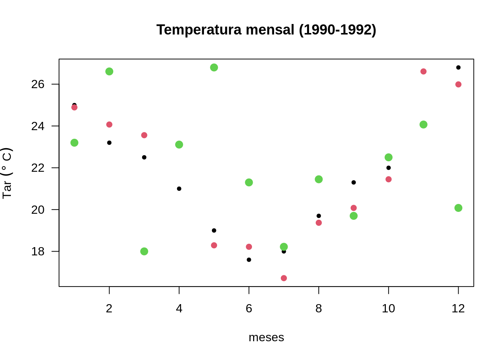

# Estrutura de dados {#estrutura-dados}


Existem diferentes formas de armazenar dados no . Algumas vezes os dados precisam ser armazenados de forma mais complexa do que por exemplo vetores. 

O  possui uma variedade de estruturas (Figura \@ref(fig:fig-estrut-dados)). Dentre elas as fundamentais, ainda não vistas, são:

- *matrix* (matriz)

- *array* e *vector* (vetor)

- *list* (lista)

- *dataframe* (tabela de dados)

<div class="figure">

<p class="caption">(\#fig:fig-estrut-dados)Principais estruturas de dados no R.</p>
</div>


## Matriz

Vetores são dados unidimensionais. Vetores multidimensionais são denominados arranjos (tradução do termo em inglês *array*). As matrizes são um caso especial de *array* em que o número de dimensões é igual a 2, uma dimensão corresponde as linhas e a outra as colunas. Os dados armazenados em uma matriz só podem ser de um tipo de dado (ou `numeric`, ou `character`, por exemplo).

### Criação de matrizes 

#### Função `matrix()` 

Uma forma mais clara de se criar uma matriz é usando a função `matrix()`.

Ao aplicarmos a função `matrix()` a um vetor sem especificar nenhum argumento ela produz uma matriz de uma coluna.


```r
vetor <- c(0, 1, -1, -2, 3, 5, -5)
# atribuindo novas dimensões ao vetor
m <- matrix(vetor) # matriz de uma coluna
m
#>      [,1]
#> [1,]    0
#> [2,]    1
#> [3,]   -1
#> [4,]   -2
#> [5,]    3
#> [6,]    5
#> [7,]   -5
```

Se desejamos construir uma matriz com 3 linhas e 4 colunas a partir do vetor `vetor` podemos fazer da seguinte forma:


```r
# criando a matriz gerada com dim
mat <- matrix(vetor, nrow = 3, ncol = 4)
#> Warning in matrix(vetor, nrow = 3, ncol = 4): data length [7] is not a sub-
#> multiple or multiple of the number of rows [3]
mat
#>      [,1] [,2] [,3] [,4]
#> [1,]    0   -2   -5   -1
#> [2,]    1    3    0   -2
#> [3,]   -1    5    1    3
# não há necessidade de especificar ambos ncol e nrow
mat <- matrix(vetor, nrow = 3)
#> Warning in matrix(vetor, nrow = 3): data length [7] is not a sub-multiple or
#> multiple of the number of rows [3]
mat
#>      [,1] [,2] [,3]
#> [1,]    0   -2   -5
#> [2,]    1    3    0
#> [3,]   -1    5    1
```

No exemplo a seguir os dados do vetor aparecem distribuídos ao longo das linhas e não das colunas como no caso acima. Nós definimos isso com o argumento **`byrow = TRUE`** da função `matrix()`:


```r
mat <- matrix(vetor, ncol = 4, byrow = TRUE)
#> Warning in matrix(vetor, ncol = 4, byrow = TRUE): data length [7] is not a sub-
#> multiple or multiple of the number of rows [2]
mat
#>      [,1] [,2] [,3] [,4]
#> [1,]    0    1   -1   -2
#> [2,]    3    5   -5    0
```

### Nomes das linhas e colunas de uma matriz {#nomes-lin-col-mat}

Nas matrizes, assim como nos vetores, também é possível dar nomes aos elementos para tornar a leitura da informação mais clara. 
Vamos usar os vetores de temperatura mensal dos anos de `1990:1992`para construir uma matriz com os meses ao longo das colunas e  os anos ao longo das linhas. 


```r
# temperatura do ar média mensal do ano de 1990
temp90 <- c(
  25.00, 23.20, 22.50, 21.00, 19.00, 17.60,
  18.00, 19.70, 21.30, 22.00, 24.00, 26.80
)
# temperatura do ar média mensal do ano de 1991
temp91 <- c(
  24.89, 24.07, 23.56, 23.11, 18.29, 18.22,
  16.72, 19.37, 20.08, 21.45, 26.61, 25.99
)
# temperatura do ar média mensal do ano de 1992
temp92 <- c(
  23.2, 26.61, 18, 23.11, 26.8, 21.3, 18.22,
  21.45, 19.7, 22.5, 24.07, 20.08
)
# vetor com as temperaturas dos 3 anos
vtemp <- c(temp90, temp91, temp92)
vtemp
#>  [1] 25.00 23.20 22.50 21.00 19.00 17.60 18.00 19.70 21.30 22.00 24.00 26.80
#> [13] 24.89 24.07 23.56 23.11 18.29 18.22 16.72 19.37 20.08 21.45 26.61 25.99
#> [25] 23.20 26.61 18.00 23.11 26.80 21.30 18.22 21.45 19.70 22.50 24.07 20.08
# arranjar matrix com meses ao longo das colunas e anos ao longo das linhas
temp_mat <- matrix(vtemp, ncol = 12, byrow = TRUE)
temp_mat
#>       [,1]  [,2]  [,3]  [,4]  [,5]  [,6]  [,7]  [,8]  [,9] [,10] [,11] [,12]
#> [1,] 25.00 23.20 22.50 21.00 19.00 17.60 18.00 19.70 21.30 22.00 24.00 26.80
#> [2,] 24.89 24.07 23.56 23.11 18.29 18.22 16.72 19.37 20.08 21.45 26.61 25.99
#> [3,] 23.20 26.61 18.00 23.11 26.80 21.30 18.22 21.45 19.70 22.50 24.07 20.08
# cópia da matriz temp_mat (sem nomes)
temp_matO <- temp_mat
```

Atribuindo nomes às linhas (`rownames()`) e colunas (`colnames()`) da matriz criada dos vetores de temperatura mensal (`temp_mat`).


```r
# atribuindo nomes as colunas e linhas da temp_mat
rownames(temp_mat) <- c("ano1990", "ano1991", "ano1992")
colnames(temp_mat) <- c(
  "Jan", "Fev", "Mar", "Abr", "Mai",
  "Jun", "Jul", "Ago", "Set", "Out",
  "Nov", "Dez"
)
temp_mat
#>           Jan   Fev   Mar   Abr   Mai   Jun   Jul   Ago   Set   Out   Nov   Dez
#> ano1990 25.00 23.20 22.50 21.00 19.00 17.60 18.00 19.70 21.30 22.00 24.00 26.80
#> ano1991 24.89 24.07 23.56 23.11 18.29 18.22 16.72 19.37 20.08 21.45 26.61 25.99
#> ano1992 23.20 26.61 18.00 23.11 26.80 21.30 18.22 21.45 19.70 22.50 24.07 20.08
```

### Indexação de matrizes

Como acessamos o valor de temperatura de maio de 1991 na matriz `temp_mat`?


```r
temp_mat # matriz de temperaturas com nomes
#>           Jan   Fev   Mar   Abr   Mai   Jun   Jul   Ago   Set   Out   Nov   Dez
#> ano1990 25.00 23.20 22.50 21.00 19.00 17.60 18.00 19.70 21.30 22.00 24.00 26.80
#> ano1991 24.89 24.07 23.56 23.11 18.29 18.22 16.72 19.37 20.08 21.45 26.61 25.99
#> ano1992 23.20 26.61 18.00 23.11 26.80 21.30 18.22 21.45 19.70 22.50 24.07 20.08
temp_matO # matriz de temperaturas sem nomes
#>       [,1]  [,2]  [,3]  [,4]  [,5]  [,6]  [,7]  [,8]  [,9] [,10] [,11] [,12]
#> [1,] 25.00 23.20 22.50 21.00 19.00 17.60 18.00 19.70 21.30 22.00 24.00 26.80
#> [2,] 24.89 24.07 23.56 23.11 18.29 18.22 16.72 19.37 20.08 21.45 26.61 25.99
#> [3,] 23.20 26.61 18.00 23.11 26.80 21.30 18.22 21.45 19.70 22.50 24.07 20.08
# qual a linha do ano de 1991
linha <- 2
# qual a coluna do mês de maio
coluna <- 5
# extraindo
temp_mat[linha, coluna]
#> [1] 18.29
# ou usando os nomes
temp_mat["ano1991", "Mai"]
#> [1] 18.29
```


Com o operador `[` podemos usar todos os esquemas de indexação vistos em vetores.


```r
# temperaturas de todos janeiros
temp_mat[, 1]
#> ano1990 ano1991 ano1992 
#>   25.00   24.89   23.20
temp_mat[, "Jan"]
#> ano1990 ano1991 ano1992 
#>   25.00   24.89   23.20
# só as temperaturas de 1990 e 1993
temp_mat[ -2, ]
#>          Jan   Fev  Mar   Abr  Mai  Jun   Jul   Ago  Set  Out   Nov   Dez
#> ano1990 25.0 23.20 22.5 21.00 19.0 17.6 18.00 19.70 21.3 22.0 24.00 26.80
#> ano1992 23.2 26.61 18.0 23.11 26.8 21.3 18.22 21.45 19.7 22.5 24.07 20.08
# só as temperaturas dos verões
temp_mat[, c(12, 1, 2)]
#>           Dez   Jan   Fev
#> ano1990 26.80 25.00 23.20
#> ano1991 25.99 24.89 24.07
#> ano1992 20.08 23.20 26.61
# invertendo ordem das colunas
temp_mat[, ncol(temp_mat):1]
#>           Dez   Nov   Out   Set   Ago   Jul   Jun   Mai   Abr   Mar   Fev   Jan
#> ano1990 26.80 24.00 22.00 21.30 19.70 18.00 17.60 19.00 21.00 22.50 23.20 25.00
#> ano1991 25.99 26.61 21.45 20.08 19.37 16.72 18.22 18.29 23.11 23.56 24.07 24.89
#> ano1992 20.08 24.07 22.50 19.70 21.45 18.22 21.30 26.80 23.11 18.00 26.61 23.20
# invertendo ordem das colunas e das linhas
temp_mat[ 3:1, 12:1]
#>           Dez   Nov   Out   Set   Ago   Jul   Jun   Mai   Abr   Mar   Fev   Jan
#> ano1992 20.08 24.07 22.50 19.70 21.45 18.22 21.30 26.80 23.11 18.00 26.61 23.20
#> ano1991 25.99 26.61 21.45 20.08 19.37 16.72 18.22 18.29 23.11 23.56 24.07 24.89
#> ano1990 26.80 24.00 22.00 21.30 19.70 18.00 17.60 19.00 21.00 22.50 23.20 25.00
# invertendo ordem das colunas e das linhas
temp_mat[ c(2, 1, 3), c(6:1, 12, 10:8)]
#>           Jun   Mai   Abr   Mar   Fev   Jan   Dez   Out   Set   Ago
#> ano1991 18.22 18.29 23.11 23.56 24.07 24.89 25.99 21.45 20.08 19.37
#> ano1990 17.60 19.00 21.00 22.50 23.20 25.00 26.80 22.00 21.30 19.70
#> ano1992 21.30 26.80 23.11 18.00 26.61 23.20 20.08 22.50 19.70 21.45
# só as temperaturas dos invernos
temp_mat[, colnames(temp_mat) %in% c("Jun", "Jul", "Ago") ]
#>           Jun   Jul   Ago
#> ano1990 17.60 18.00 19.70
#> ano1991 18.22 16.72 19.37
#> ano1992 21.30 18.22 21.45
# exceto as temperaturas dos invernos
temp_mat[, -which(colnames(temp_mat) %in% c("Jun", "Jul", "Ago")) ]
#>           Jan   Fev   Mar   Abr   Mai   Set   Out   Nov   Dez
#> ano1990 25.00 23.20 22.50 21.00 19.00 21.30 22.00 24.00 26.80
#> ano1991 24.89 24.07 23.56 23.11 18.29 20.08 21.45 26.61 25.99
#> ano1992 23.20 26.61 18.00 23.11 26.80 19.70 22.50 24.07 20.08
# seleção de colunas intercaladas da matriz: mês sim, mês nao
temp_mat[, c(TRUE, FALSE)]
#>           Jan   Mar   Mai   Jul   Set   Nov
#> ano1990 25.00 22.50 19.00 18.00 21.30 24.00
#> ano1991 24.89 23.56 18.29 16.72 20.08 26.61
#> ano1992 23.20 18.00 26.80 18.22 19.70 24.07
# 2 meses sim, 1 mes não
temp_mat[, c(TRUE, TRUE, FALSE)]
#>           Jan   Fev   Abr   Mai   Jul   Ago   Out   Nov
#> ano1990 25.00 23.20 21.00 19.00 18.00 19.70 22.00 24.00
#> ano1991 24.89 24.07 23.11 18.29 16.72 19.37 21.45 26.61
#> ano1992 23.20 26.61 23.11 26.80 18.22 21.45 22.50 24.07
```

Podemos fazer uso do operador `[` de forma aninhada:


```r
temp_mat
#>           Jan   Fev   Mar   Abr   Mai   Jun   Jul   Ago   Set   Out   Nov   Dez
#> ano1990 25.00 23.20 22.50 21.00 19.00 17.60 18.00 19.70 21.30 22.00 24.00 26.80
#> ano1991 24.89 24.07 23.56 23.11 18.29 18.22 16.72 19.37 20.08 21.45 26.61 25.99
#> ano1992 23.20 26.61 18.00 23.11 26.80 21.30 18.22 21.45 19.70 22.50 24.07 20.08
temp_mat[, 1:6]
#>           Jan   Fev   Mar   Abr   Mai   Jun
#> ano1990 25.00 23.20 22.50 21.00 19.00 17.60
#> ano1991 24.89 24.07 23.56 23.11 18.29 18.22
#> ano1992 23.20 26.61 18.00 23.11 26.80 21.30
temp_mat[, 1:6]["ano1991", ]
#>   Jan   Fev   Mar   Abr   Mai   Jun 
#> 24.89 24.07 23.56 23.11 18.29 18.22
temp_mat[, 1:6]["ano1991", ][2:4]
#>   Fev   Mar   Abr 
#> 24.07 23.56 23.11
```

Podemos substituir valores de uma submatriz da matriz:


```r
M <- temp_mat
M
#>           Jan   Fev   Mar   Abr   Mai   Jun   Jul   Ago   Set   Out   Nov   Dez
#> ano1990 25.00 23.20 22.50 21.00 19.00 17.60 18.00 19.70 21.30 22.00 24.00 26.80
#> ano1991 24.89 24.07 23.56 23.11 18.29 18.22 16.72 19.37 20.08 21.45 26.61 25.99
#> ano1992 23.20 26.61 18.00 23.11 26.80 21.30 18.22 21.45 19.70 22.50 24.07 20.08
# 1990 e 1992 os meses de jan e dez
M[c(1, 3), c(1, 12)]
#>          Jan   Dez
#> ano1990 25.0 26.80
#> ano1992 23.2 20.08
# matriz com novos valores
matrix(c(21, 22, 23, 24), ncol = 2)
#>      [,1] [,2]
#> [1,]   21   23
#> [2,]   22   24
# substituindo
M[c(1, 3), c(1, 12)] <- matrix(c(21, 22, 23, 24), ncol = 2)
M
#>           Jan   Fev   Mar   Abr   Mai   Jun   Jul   Ago   Set   Out   Nov   Dez
#> ano1990 21.00 23.20 22.50 21.00 19.00 17.60 18.00 19.70 21.30 22.00 24.00 23.00
#> ano1991 24.89 24.07 23.56 23.11 18.29 18.22 16.72 19.37 20.08 21.45 26.61 25.99
#> ano1992 22.00 26.61 18.00 23.11 26.80 21.30 18.22 21.45 19.70 22.50 24.07 24.00
```


### Número de linhas e colunas de uma matriz


```r
M
#>           Jan   Fev   Mar   Abr   Mai   Jun   Jul   Ago   Set   Out   Nov   Dez
#> ano1990 21.00 23.20 22.50 21.00 19.00 17.60 18.00 19.70 21.30 22.00 24.00 23.00
#> ano1991 24.89 24.07 23.56 23.11 18.29 18.22 16.72 19.37 20.08 21.45 26.61 25.99
#> ano1992 22.00 26.61 18.00 23.11 26.80 21.30 18.22 21.45 19.70 22.50 24.07 24.00
ncol(temp_mat)
#> [1] 12
nrow(temp_mat)
#> [1] 3
dim(temp_mat)
#> [1]  3 12
```

Existem funções específicas para saber a coluna e a linha de cada elemento de uma matriz.


```r
# colunas de cada elemento da matriz
col(temp_mat)
#>      [,1] [,2] [,3] [,4] [,5] [,6] [,7] [,8] [,9] [,10] [,11] [,12]
#> [1,]    1    2    3    4    5    6    7    8    9    10    11    12
#> [2,]    1    2    3    4    5    6    7    8    9    10    11    12
#> [3,]    1    2    3    4    5    6    7    8    9    10    11    12
# linhas de cada elemento da matriz
row(temp_mat)
#>      [,1] [,2] [,3] [,4] [,5] [,6] [,7] [,8] [,9] [,10] [,11] [,12]
#> [1,]    1    1    1    1    1    1    1    1    1     1     1     1
#> [2,]    2    2    2    2    2    2    2    2    2     2     2     2
#> [3,]    3    3    3    3    3    3    3    3    3     3     3     3
```

### Adição de linhas e colunas a uma matriz

Na construção de um vetor concatenaram-se valores com a função `c()`. A concatenação por linhas ou colunas em uma matriz pode ser feita com as funções `rbind()` e `cbind()`, respectivamente. No exemplo abaixo concatenam-se vetores de temperaturas mensais de 3 anos (ver seção \@ref(nomes-lin-col-mat)), primeiro por linhas e depois por colunas. 


```r
(temp_mat_lin <- rbind(temp90, temp91, temp92))
#>         [,1]  [,2]  [,3]  [,4]  [,5]  [,6]  [,7]  [,8]  [,9] [,10] [,11] [,12]
#> temp90 25.00 23.20 22.50 21.00 19.00 17.60 18.00 19.70 21.30 22.00 24.00 26.80
#> temp91 24.89 24.07 23.56 23.11 18.29 18.22 16.72 19.37 20.08 21.45 26.61 25.99
#> temp92 23.20 26.61 18.00 23.11 26.80 21.30 18.22 21.45 19.70 22.50 24.07 20.08
(temp_mat_col <- cbind(temp90, temp91, temp92))
#>       temp90 temp91 temp92
#>  [1,]   25.0  24.89  23.20
#>  [2,]   23.2  24.07  26.61
#>  [3,]   22.5  23.56  18.00
#>  [4,]   21.0  23.11  23.11
#>  [5,]   19.0  18.29  26.80
#>  [6,]   17.6  18.22  21.30
#>  [7,]   18.0  16.72  18.22
#>  [8,]   19.7  19.37  21.45
#>  [9,]   21.3  20.08  19.70
#> [10,]   22.0  21.45  22.50
#> [11,]   24.0  26.61  24.07
#> [12,]   26.8  25.99  20.08
```


### Matriz transposta e diagonal

A primeira entre as diversas funções de álgebra matricial no R é a transposta `t()`.

```r
temp_mat
#>           Jan   Fev   Mar   Abr   Mai   Jun   Jul   Ago   Set   Out   Nov   Dez
#> ano1990 25.00 23.20 22.50 21.00 19.00 17.60 18.00 19.70 21.30 22.00 24.00 26.80
#> ano1991 24.89 24.07 23.56 23.11 18.29 18.22 16.72 19.37 20.08 21.45 26.61 25.99
#> ano1992 23.20 26.61 18.00 23.11 26.80 21.30 18.22 21.45 19.70 22.50 24.07 20.08
t(temp_mat)
#>     ano1990 ano1991 ano1992
#> Jan    25.0   24.89   23.20
#> Fev    23.2   24.07   26.61
#> Mar    22.5   23.56   18.00
#> Abr    21.0   23.11   23.11
#> Mai    19.0   18.29   26.80
#> Jun    17.6   18.22   21.30
#> Jul    18.0   16.72   18.22
#> Ago    19.7   19.37   21.45
#> Set    21.3   20.08   19.70
#> Out    22.0   21.45   22.50
#> Nov    24.0   26.61   24.07
#> Dez    26.8   25.99   20.08
# diagonal 
diag(temp_mat)
#> [1] 25.00 24.07 18.00
```

Operações matriciais adicionais são apresentadas no Apêndice \@ref(oper-mat).


### Conversão de matriz para vetor

Frequentemente é mais conveniente trabalhar com um vetor do que com uma matriz, por isso precisamos saber como fazer o caminho inverso. Quando criamos uma matriz (p. ex.: `temp_mat`) no início da seção ela foi baseada em um vetor (`vtemp`). Como fazemos para voltar aquele vetor original a partir da matriz?


```r
temp_mat[1:nrow(temp_mat) * ncol(temp_mat) ]
#> [1] 23.11 21.45 20.08
# vetor de temperaturas
vtemp <- temp_mat[1:(ncol(temp_mat) * nrow(temp_mat))]
vtemp
#>  [1] 25.00 24.89 23.20 23.20 24.07 26.61 22.50 23.56 18.00 21.00 23.11 23.11
#> [13] 19.00 18.29 26.80 17.60 18.22 21.30 18.00 16.72 18.22 19.70 19.37 21.45
#> [25] 21.30 20.08 19.70 22.00 21.45 22.50 24.00 26.61 24.07 26.80 25.99 20.08
# outra forma de converte temp_mat para vetor
c(temp_mat)
#>  [1] 25.00 24.89 23.20 23.20 24.07 26.61 22.50 23.56 18.00 21.00 23.11 23.11
#> [13] 19.00 18.29 26.80 17.60 18.22 21.30 18.00 16.72 18.22 19.70 19.37 21.45
#> [25] 21.30 20.08 19.70 22.00 21.45 22.50 24.00 26.61 24.07 26.80 25.99 20.08
# função formal para converter
as.vector(temp_mat)
#>  [1] 25.00 24.89 23.20 23.20 24.07 26.61 22.50 23.56 18.00 21.00 23.11 23.11
#> [13] 19.00 18.29 26.80 17.60 18.22 21.30 18.00 16.72 18.22 19.70 19.37 21.45
#> [25] 21.30 20.08 19.70 22.00 21.45 22.50 24.00 26.61 24.07 26.80 25.99 20.08
# para desmanchar a matriz com os elementos seguindo a ordem das linhas
c(t(temp_mat))
#>  [1] 25.00 23.20 22.50 21.00 19.00 17.60 18.00 19.70 21.30 22.00 24.00 26.80
#> [13] 24.89 24.07 23.56 23.11 18.29 18.22 16.72 19.37 20.08 21.45 26.61 25.99
#> [25] 23.20 26.61 18.00 23.11 26.80 21.30 18.22 21.45 19.70 22.50 24.07 20.08
as.vector(t(temp_mat))
#>  [1] 25.00 23.20 22.50 21.00 19.00 17.60 18.00 19.70 21.30 22.00 24.00 26.80
#> [13] 24.89 24.07 23.56 23.11 18.29 18.22 16.72 19.37 20.08 21.45 26.61 25.99
#> [25] 23.20 26.61 18.00 23.11 26.80 21.30 18.22 21.45 19.70 22.50 24.07 20.08
# serie temporal de temp_mat
stemp <- c(t(temp_mat))
plot(stemp, type = "o")
```


```r
# criar matriz com colunas temp e meses 1:12
cbind(rep(1:12, nrow(temp_mat)), stemp)
#>          stemp
#>  [1,]  1 25.00
#>  [2,]  2 23.20
#>  [3,]  3 22.50
#>  [4,]  4 21.00
#>  [5,]  5 19.00
#>  [6,]  6 17.60
#>  [7,]  7 18.00
#>  [8,]  8 19.70
#>  [9,]  9 21.30
#> [10,] 10 22.00
#> [11,] 11 24.00
#> [12,] 12 26.80
#> [13,]  1 24.89
#> [14,]  2 24.07
#> [15,]  3 23.56
#> [16,]  4 23.11
#> [17,]  5 18.29
#> [18,]  6 18.22
#> [19,]  7 16.72
#> [20,]  8 19.37
#> [21,]  9 20.08
#> [22,] 10 21.45
#> [23,] 11 26.61
#> [24,] 12 25.99
#> [25,]  1 23.20
#> [26,]  2 26.61
#> [27,]  3 18.00
#> [28,]  4 23.11
#> [29,]  5 26.80
#> [30,]  6 21.30
#> [31,]  7 18.22
#> [32,]  8 21.45
#> [33,]  9 19.70
#> [34,] 10 22.50
#> [35,] 11 24.07
#> [36,] 12 20.08
# dados de temp e meses
tempdat <- cbind(1:12, stemp)
# plot da temperatura pelos meses (os meses repetem)
plot(
  tempdat,
  type = "p", # tipo de grafico: pontos
  pch = 20, # codigo numérico do simbolo do ponto
  col = rep(1:3, each = ncol(temp_mat)), # cores dos pontos
  cex = rep(seq(1, 2, by = 0.5), each = ncol(temp_mat)), # aumenta tamanho dos pontos
  las = 1, # orientação dos labels dos eixos perpendiculares ao eixo
  ylab = expression(Tar ~ (degree ~ C)), # label da variável y
  xlab = "meses", # label da variavel x
  main = "Temperatura mensal (1990-1992)" # título
) # end plot
```



```r
# para entender a variação nas cores e símbolos usadas no gráfico
cbind(
  meses = 1:12, temp = stemp,
  cores = rep(1:3, each = ncol(temp_mat)), # cores
  simb_tam = rep(seq(1, 2, by = 0.5), each = ncol(temp_mat))
) # tamanho dos símbolos
#>       meses  temp cores simb_tam
#>  [1,]     1 25.00     1      1.0
#>  [2,]     2 23.20     1      1.0
#>  [3,]     3 22.50     1      1.0
#>  [4,]     4 21.00     1      1.0
#>  [5,]     5 19.00     1      1.0
#>  [6,]     6 17.60     1      1.0
#>  [7,]     7 18.00     1      1.0
#>  [8,]     8 19.70     1      1.0
#>  [9,]     9 21.30     1      1.0
#> [10,]    10 22.00     1      1.0
#> [11,]    11 24.00     1      1.0
#> [12,]    12 26.80     1      1.0
#> [13,]     1 24.89     2      1.5
#> [14,]     2 24.07     2      1.5
#> [15,]     3 23.56     2      1.5
#> [16,]     4 23.11     2      1.5
#> [17,]     5 18.29     2      1.5
#> [18,]     6 18.22     2      1.5
#> [19,]     7 16.72     2      1.5
#> [20,]     8 19.37     2      1.5
#> [21,]     9 20.08     2      1.5
#> [22,]    10 21.45     2      1.5
#> [23,]    11 26.61     2      1.5
#> [24,]    12 25.99     2      1.5
#> [25,]     1 23.20     3      2.0
#> [26,]     2 26.61     3      2.0
#> [27,]     3 18.00     3      2.0
#> [28,]     4 23.11     3      2.0
#> [29,]     5 26.80     3      2.0
#> [30,]     6 21.30     3      2.0
#> [31,]     7 18.22     3      2.0
#> [32,]     8 21.45     3      2.0
#> [33,]     9 19.70     3      2.0
#> [34,]    10 22.50     3      2.0
#> [35,]    11 24.07     3      2.0
#> [36,]    12 20.08     3      2.0
```


## Arranjo 

Arranjo é uma estrutura de dados multidimensional. A matriz é um caso particular de arranjo com 2 dimensões: linhas e colunas. Mas podemos ter dados com *n* dimensões. 


Por exemplo, imagine o campo espacial representado por uma grade de espaçamento horizontal regular de uma variável meteorológica. Nessa situação podemos usar uma matriz com valores de temperatura, onde as colunas representam as longitudes e as linhas as latitudes dos pontos da grade. Em um dados tempo, a matriz da variável com valores de temperatura do ar, por exemplo, representa o estado térmico espacial daquele momento. Então podemos dizer que esse arranjo possui 3 dimensões: latitude (linha), longitude (coluna) e tempo (camadas).

### Criação 

Suponha que os campos espaciais médios mensais de temperatura sejam dados pelo vetor `temp_vetor` abaixo. 


```r
temp_vetor <- c(
  18, 24, 19, 23, 19, 27, 24, 18, 13, 20, 25, 19, 18, 22, 17,
  9, 17, 22, 13, 19, 29, 18, 19, 18, 11, 18, 19, 17, 13, 17, 26,
  21, 22, 20, 14, 17
)
```

O vetor `temp_vetor` pode ser convertido em um arranjo dos campos espaciais usando a função `array()`, com o argumento `dim` especificando as dimensões.


```r
temp_array <- array(data = temp_vetor, dim = c(3, 4, 3))
temp_array
#> , , 1
#> 
#>      [,1] [,2] [,3] [,4]
#> [1,]   18   23   24   20
#> [2,]   24   19   18   25
#> [3,]   19   27   13   19
#> 
#> , , 2
#> 
#>      [,1] [,2] [,3] [,4]
#> [1,]   18    9   13   18
#> [2,]   22   17   19   19
#> [3,]   17   22   29   18
#> 
#> , , 3
#> 
#>      [,1] [,2] [,3] [,4]
#> [1,]   11   17   26   20
#> [2,]   18   13   21   14
#> [3,]   19   17   22   17
dim(temp_array)
#> [1] 3 4 3
class(temp_array)
#> [1] "array"
```

O arranjo também pode ter atributos, como o nomes das linhas, colunas e camadas.


```r
colnames(temp_array) <- -(45:42)
rownames(temp_array) <- -(19:21)
# nomes das dimensões
dimnames(temp_array)
#> [[1]]
#> [1] "-19" "-20" "-21"
#> 
#> [[2]]
#> [1] "-45" "-44" "-43" "-42"
#> 
#> [[3]]
#> NULL
# nomes para camadas
dimnames(temp_array)[[3]] <- c("Jan", "Fev", "Mar")
temp_array
#> , , Jan
#> 
#>     -45 -44 -43 -42
#> -19  18  23  24  20
#> -20  24  19  18  25
#> -21  19  27  13  19
#> 
#> , , Fev
#> 
#>     -45 -44 -43 -42
#> -19  18   9  13  18
#> -20  22  17  19  19
#> -21  17  22  29  18
#> 
#> , , Mar
#> 
#>     -45 -44 -43 -42
#> -19  11  17  26  20
#> -20  18  13  21  14
#> -21  19  17  22  17
```

### Indexação

Os mesmo procedimentos de indexação usados para matriz são aplicados a um arranjo (A), mas com a seguinte convenção de índices `A[linha, coluna, camada]`.


```r
# serie temporal do 1º ponto
temp_array[1, 1, ]
#> Jan Fev Mar 
#>  18  18  11
temp_array["-19", "-45", ]
#> Jan Fev Mar 
#>  18  18  11
# para 1a faixa de latitude (-19),
# os valores de temp das longitudes em todos tempos
temp_array[1, , ]
#>     Jan Fev Mar
#> -45  18  18  11
#> -44  23   9  17
#> -43  24  13  26
#> -42  20  18  20
# para 2a faixa de longitude (-44), todas longitudes e tempos
temp_array[, 2, ]
#>     Jan Fev Mar
#> -19  23   9  17
#> -20  19  17  13
#> -21  27  22  17
# média meridional
colMeans(temp_array[, 2, ])
#>      Jan      Fev      Mar 
#> 23.00000 16.00000 15.66667
# subdominio "espacial"
temp_array[2:3, 2:3, ]
#> , , Jan
#> 
#>     -44 -43
#> -20  19  18
#> -21  27  13
#> 
#> , , Fev
#> 
#>     -44 -43
#> -20  17  19
#> -21  22  29
#> 
#> , , Mar
#> 
#>     -44 -43
#> -20  13  21
#> -21  17  22
# média espacial do 1o mês
mean(temp_array[, , 1])
#> [1] 20.75
# média espacial do segundo mês
mean(temp_array[, , "Jan"])
#> [1] 20.75
# demanchando o arranjo (conversão para vetor)
c(temp_array)
#>  [1] 18 24 19 23 19 27 24 18 13 20 25 19 18 22 17  9 17 22 13 19 29 18 19 18 11
#> [26] 18 19 17 13 17 26 21 22 20 14 17
c(temp_array[, , 1])
#>  [1] 18 24 19 23 19 27 24 18 13 20 25 19
# para entender a forma como a matriz é convertida para vetor
mat_temp <- cbind(
  mes = rep(1:3, each = 20),
  elemat = rep(1:20, times = 6),
  valores = c(temp_array),
  elearr = 1:(cumprod(dim(temp_array))[3])
)
#> Warning in cbind(mes = rep(1:3, each = 20), elemat = rep(1:20, times = 6), :
#> number of rows of result is not a multiple of vector length (arg 3)
mat_temp
#>        mes elemat valores elearr
#>   [1,]   1      1      18      1
#>   [2,]   1      2      24      2
#>   [3,]   1      3      19      3
#>   [4,]   1      4      23      4
#>   [5,]   1      5      19      5
#>   [6,]   1      6      27      6
#>   [7,]   1      7      24      7
#>   [8,]   1      8      18      8
#>   [9,]   1      9      13      9
#>  [10,]   1     10      20     10
#>  [11,]   1     11      25     11
#>  [12,]   1     12      19     12
#>  [13,]   1     13      18     13
#>  [14,]   1     14      22     14
#>  [15,]   1     15      17     15
#>  [16,]   1     16       9     16
#>  [17,]   1     17      17     17
#>  [18,]   1     18      22     18
#>  [19,]   1     19      13     19
#>  [20,]   1     20      19     20
#>  [21,]   2      1      29     21
#>  [22,]   2      2      18     22
#>  [23,]   2      3      19     23
#>  [24,]   2      4      18     24
#>  [25,]   2      5      11     25
#>  [26,]   2      6      18     26
#>  [27,]   2      7      19     27
#>  [28,]   2      8      17     28
#>  [29,]   2      9      13     29
#>  [30,]   2     10      17     30
#>  [31,]   2     11      26     31
#>  [32,]   2     12      21     32
#>  [33,]   2     13      22     33
#>  [34,]   2     14      20     34
#>  [35,]   2     15      14     35
#>  [36,]   2     16      17     36
#>  [37,]   2     17      18      1
#>  [38,]   2     18      24      2
#>  [39,]   2     19      19      3
#>  [40,]   2     20      23      4
#>  [41,]   3      1      19      5
#>  [42,]   3      2      27      6
#>  [43,]   3      3      24      7
#>  [44,]   3      4      18      8
#>  [45,]   3      5      13      9
#>  [46,]   3      6      20     10
#>  [47,]   3      7      25     11
#>  [48,]   3      8      19     12
#>  [49,]   3      9      18     13
#>  [50,]   3     10      22     14
#>  [51,]   3     11      17     15
#>  [52,]   3     12       9     16
#>  [53,]   3     13      17     17
#>  [54,]   3     14      22     18
#>  [55,]   3     15      13     19
#>  [56,]   3     16      19     20
#>  [57,]   3     17      29     21
#>  [58,]   3     18      18     22
#>  [59,]   3     19      19     23
#>  [60,]   3     20      18     24
#>  [61,]   1      1      11     25
#>  [62,]   1      2      18     26
#>  [63,]   1      3      19     27
#>  [64,]   1      4      17     28
#>  [65,]   1      5      13     29
#>  [66,]   1      6      17     30
#>  [67,]   1      7      26     31
#>  [68,]   1      8      21     32
#>  [69,]   1      9      22     33
#>  [70,]   1     10      20     34
#>  [71,]   1     11      14     35
#>  [72,]   1     12      17     36
#>  [73,]   1     13      18      1
#>  [74,]   1     14      24      2
#>  [75,]   1     15      19      3
#>  [76,]   1     16      23      4
#>  [77,]   1     17      19      5
#>  [78,]   1     18      27      6
#>  [79,]   1     19      24      7
#>  [80,]   1     20      18      8
#>  [81,]   2      1      13      9
#>  [82,]   2      2      20     10
#>  [83,]   2      3      25     11
#>  [84,]   2      4      19     12
#>  [85,]   2      5      18     13
#>  [86,]   2      6      22     14
#>  [87,]   2      7      17     15
#>  [88,]   2      8       9     16
#>  [89,]   2      9      17     17
#>  [90,]   2     10      22     18
#>  [91,]   2     11      13     19
#>  [92,]   2     12      19     20
#>  [93,]   2     13      29     21
#>  [94,]   2     14      18     22
#>  [95,]   2     15      19     23
#>  [96,]   2     16      18     24
#>  [97,]   2     17      11     25
#>  [98,]   2     18      18     26
#>  [99,]   2     19      19     27
#> [100,]   2     20      17     28
#> [101,]   3      1      13     29
#> [102,]   3      2      17     30
#> [103,]   3      3      26     31
#> [104,]   3      4      21     32
#> [105,]   3      5      22     33
#> [106,]   3      6      20     34
#> [107,]   3      7      14     35
#> [108,]   3      8      17     36
#> [109,]   3      9      18      1
#> [110,]   3     10      24      2
#> [111,]   3     11      19      3
#> [112,]   3     12      23      4
#> [113,]   3     13      19      5
#> [114,]   3     14      27      6
#> [115,]   3     15      24      7
#> [116,]   3     16      18      8
#> [117,]   3     17      13      9
#> [118,]   3     18      20     10
#> [119,]   3     19      25     11
#> [120,]   3     20      19     12
```

## Lista {#listas}

Listas são o segundo tipo de vetor. O primeiro tipo nós já vimos, são os **vetores atômicos**, nos quais todos os elementos devem ser de uma mesma classe de objeto. Listas são uma estrutura de dados muito versátil por pelo menos 3 razões:

  1. Os elementos podem ser de diferentes classes de objetos (p.ex.: um elemento `numeric`, outro `character`);
  2. Cada elemento pode ter um tamanho diferente;
  3. Os elementos podem conter diferentes estrutura de dados (p.ex.: um elemento `matrix`, outro `vector`);
  
Dentro da lista o conjunto de objetos são ordenados e cada elemento pode conter sub-elementos.

### Criação

As vezes precisamos de um *container* para armazenar diferentes tipos de dados do R e com diferente tamanhos. As *listas* servem para isso e permitem armazenar qualquer número de itens de qualquer tipo. Uma lista pode conter números, caracteres ou uma mistura de *dataframes*, sub-listas, matrizes e vetores.

Listas podem ser criadas com a função `list()`. A especificação do conteúdo de uma lista é muito similar a da função `c()` vista anteriormente. Nós simplesmente listamos os elementos da lista separados por uma vírgula dentro da função `list()`.


```r
# lista de dados heterogêneos
lst <- list(1:4, c(1.1, 2.3, 5.9), c(TRUE, FALSE), "R", list(0, 1))
lst
#> [[1]]
#> [1] 1 2 3 4
#> 
#> [[2]]
#> [1] 1.1 2.3 5.9
#> 
#> [[3]]
#> [1]  TRUE FALSE
#> 
#> [[4]]
#> [1] "R"
#> 
#> [[5]]
#> [[5]][[1]]
#> [1] 0
#> 
#> [[5]][[2]]
#> [1] 1
# estrutura da lista
str(lst)
#> List of 5
#>  $ : int [1:4] 1 2 3 4
#>  $ : num [1:3] 1.1 2.3 5.9
#>  $ : logi [1:2] TRUE FALSE
#>  $ : chr "R"
#>  $ :List of 2
#>   ..$ : num 0
#>   ..$ : num 1
# tamanho da lista (num. de componentes ou elementos)
length(lst)
#> [1] 5
# atribuindo nomes a lista
names(lst)
#> NULL
names(lst) <- c("vetor_int", "vetor_dbl", "logico", "char", "lista")
```

Os índices em colchetes duplos `[[]]` identificam o elemento ou a componente da lista. Os índices em colchete simples `[]` indicam qual sub-elemento da lista está sendo mostrado. Por exemplo `1.1` é o primeiro sub-elemento do segundo elemento da lista `lst`. Desse aninhamento de elementos surge o sistema de indexação de listas. A estrutura de uma lista pode se tornar complicada com o aumento do grau de sub-elementos. Mas essa flexibilidade, faz das listas uma ferramenta de armazenamento de dados para todos propósitos.

<div class="rmdtip">
<p>Veremos que no R, listas são frequentemente usadas para armazenar a saída de funções com diversos resultados. Como por exemplo a saída das funções <code>rle()</code>.</p>
</div>


Para verificar se uma lista é aninhada usamos a função `is.recursive()`.


```r
is.recursive(lst)
#> [1] TRUE
```


Vamos ver um exemplo onde criamos uma lista com informações de duas estações meteorológicas.


```r
# matriz de dados meteorológicos da estação de Santa Maria
dados_sm <- cbind(
  tar = c(31, 35, 21, 23, 33, 17),
  prec = c(300, 200, 150, 120, 210, 110)
)
dados_sm
#>      tar prec
#> [1,]  31  300
#> [2,]  35  200
#> [3,]  21  150
#> [4,]  23  120
#> [5,]  33  210
#> [6,]  17  110
# lista com informações da estação de santa maria
sm_l <- list(
  c(-45, -23),
  "Santa Maria",
  dados_sm
)
sm_l
#> [[1]]
#> [1] -45 -23
#> 
#> [[2]]
#> [1] "Santa Maria"
#> 
#> [[3]]
#>      tar prec
#> [1,]  31  300
#> [2,]  35  200
#> [3,]  21  150
#> [4,]  23  120
#> [5,]  33  210
#> [6,]  17  110
# adicionar nomes aos elementos
names(sm_l) <- c("coords", "cidade", "dados")
sm_l
#> $coords
#> [1] -45 -23
#> 
#> $cidade
#> [1] "Santa Maria"
#> 
#> $dados
#>      tar prec
#> [1,]  31  300
#> [2,]  35  200
#> [3,]  21  150
#> [4,]  23  120
#> [5,]  33  210
#> [6,]  17  110
# matriz de dados meteorológicos da estação de Júlio de Castilhos
dados_jc <- cbind(
  tar = c(22.5, 20, 18.75, 18, 20.25, 17.75),
  prec = c(360, 310, 285, 270, 315, 265)
)
# criando lista de JC, mas nomeando de forma diferente
jc_l <- list(
  coords = c(-45.1, -23.2),
  cidade = "Júlio de Castilhos",
  dados = dados_jc
)
# adicionar nomes as componentes
names(jc_l) <- names(sm_l)
jc_l
#> $coords
#> [1] -45.1 -23.2
#> 
#> $cidade
#> [1] "Júlio de Castilhos"
#> 
#> $dados
#>        tar prec
#> [1,] 22.50  360
#> [2,] 20.00  310
#> [3,] 18.75  285
#> [4,] 18.00  270
#> [5,] 20.25  315
#> [6,] 17.75  265
```

As informações de cada estação estão armazenadas em 2 listas. Mas é mais prático termos todas estações em um única lista:


```r
# combinando listas mantendo os elementos separadamente
dados_l <- list(sm_l, jc_l)
dados_l
#> [[1]]
#> [[1]]$coords
#> [1] -45 -23
#> 
#> [[1]]$cidade
#> [1] "Santa Maria"
#> 
#> [[1]]$dados
#>      tar prec
#> [1,]  31  300
#> [2,]  35  200
#> [3,]  21  150
#> [4,]  23  120
#> [5,]  33  210
#> [6,]  17  110
#> 
#> 
#> [[2]]
#> [[2]]$coords
#> [1] -45.1 -23.2
#> 
#> [[2]]$cidade
#> [1] "Júlio de Castilhos"
#> 
#> [[2]]$dados
#>        tar prec
#> [1,] 22.50  360
#> [2,] 20.00  310
#> [3,] 18.75  285
#> [4,] 18.00  270
#> [5,] 20.25  315
#> [6,] 17.75  265
names(dados_l)
#> NULL
names(dados_l) <- c("sm", "jc")
dados_l
#> $sm
#> $sm$coords
#> [1] -45 -23
#> 
#> $sm$cidade
#> [1] "Santa Maria"
#> 
#> $sm$dados
#>      tar prec
#> [1,]  31  300
#> [2,]  35  200
#> [3,]  21  150
#> [4,]  23  120
#> [5,]  33  210
#> [6,]  17  110
#> 
#> 
#> $jc
#> $jc$coords
#> [1] -45.1 -23.2
#> 
#> $jc$cidade
#> [1] "Júlio de Castilhos"
#> 
#> $jc$dados
#>        tar prec
#> [1,] 22.50  360
#> [2,] 20.00  310
#> [3,] 18.75  285
#> [4,] 18.00  270
#> [5,] 20.25  315
#> [6,] 17.75  265
# como a lista é um tipo vetor, a função length()
# fornece o número de elementos da lista
length(dados_l)
#> [1] 2
```

Para resumir a estrutura de uma lista (ou *dataframe*) podemos usar a função `str()`:


```r
str(dados_l)
#> List of 2
#>  $ sm:List of 3
#>   ..$ coords: num [1:2] -45 -23
#>   ..$ cidade: chr "Santa Maria"
#>   ..$ dados : num [1:6, 1:2] 31 35 21 23 33 17 300 200 150 120 ...
#>   .. ..- attr(*, "dimnames")=List of 2
#>   .. .. ..$ : NULL
#>   .. .. ..$ : chr [1:2] "tar" "prec"
#>  $ jc:List of 3
#>   ..$ coords: num [1:2] -45.1 -23.2
#>   ..$ cidade: chr "Júlio de Castilhos"
#>   ..$ dados : num [1:6, 1:2] 22.5 20 18.8 18 20.2 ...
#>   .. ..- attr(*, "dimnames")=List of 2
#>   .. .. ..$ : NULL
#>   .. .. ..$ : chr [1:2] "tar" "prec"
```

As listas também poderiam ser combinadas com função concatena ou combina `c()`. 


```r
dados_l2 <- c(sm_l, jc_l)
dados_l2
#> $coords
#> [1] -45 -23
#> 
#> $cidade
#> [1] "Santa Maria"
#> 
#> $dados
#>      tar prec
#> [1,]  31  300
#> [2,]  35  200
#> [3,]  21  150
#> [4,]  23  120
#> [5,]  33  210
#> [6,]  17  110
#> 
#> $coords
#> [1] -45.1 -23.2
#> 
#> $cidade
#> [1] "Júlio de Castilhos"
#> 
#> $dados
#>        tar prec
#> [1,] 22.50  360
#> [2,] 20.00  310
#> [3,] 18.75  285
#> [4,] 18.00  270
#> [5,] 20.25  315
#> [6,] 17.75  265
str(dados_l2)
#> List of 6
#>  $ coords: num [1:2] -45 -23
#>  $ cidade: chr "Santa Maria"
#>  $ dados : num [1:6, 1:2] 31 35 21 23 33 17 300 200 150 120 ...
#>   ..- attr(*, "dimnames")=List of 2
#>   .. ..$ : NULL
#>   .. ..$ : chr [1:2] "tar" "prec"
#>  $ coords: num [1:2] -45.1 -23.2
#>  $ cidade: chr "Júlio de Castilhos"
#>  $ dados : num [1:6, 1:2] 22.5 20 18.8 18 20.2 ...
#>   ..- attr(*, "dimnames")=List of 2
#>   .. ..$ : NULL
#>   .. ..$ : chr [1:2] "tar" "prec"
```


### Indexação 

#### Operador `[`

Assim como em vetores, podemos acessar os elementos de uma lista usando os colchetes `[` com índices numéricos positivos, negativos, caracteres (nomes dos elementos) e lógicos. As expressões abaixo, ilustram o uso dessas diferentes formas de seleção de elementos e produzem o mesmo resultado.


```r
sm_l[1:2]
#> $coords
#> [1] -45 -23
#> 
#> $cidade
#> [1] "Santa Maria"
sm_l[c("coords", "alt")]
#> $coords
#> [1] -45 -23
#> 
#> $<NA>
#> NULL
```

O resultado da seleção do 1º e 2º elemento é uma lista menor que a original. Isso não é muito útil, uma vez que muitas funções do R não lidam com listas.  Por exemplo, se quiséssemos calcular a soma do vetor contido do primeiro elemento da lista `lst` obtém-se um erro.


```r
# seleção do 1º elemento da lst
lst[1]
#> $vetor_int
#> [1] 1 2 3 4
# o resultado da seleção é uma lista
mode(lst[1])
#> [1] "list"
# a função sum() espera como entrada um vetor
sum(lst[1])
#> Error in sum(lst[1]): invalid 'type' (list) of argument
# acessando elemento inexistente
lst[6]
#> $<NA>
#> NULL
```

Então ao selecionar elementos de uma lista com o operador `[` o resultado preserva a estrutura original do objeto. `lst` é uma lista e o resultado da seleção `lst[1]` também é uma lista.
**Portanto, a seleção de elementos com o operador `[` preserva a estrutura do objeto original**.   

#### Operador `[[` e `$`

Entretanto na maioria das vezes estamos interessados no conteúdo dos elementos de uma lista. Para fazer isso há dois operadores: o duplo colchetes `[[` e o `$`. Para acessar elementos individuais de uma lista usamos o duplo colchetes `[[` especificando o número do elemento ou o nome. Essa forma de seleção de dados permite o acesso a um elemento por vez. 


```r
# 1º elemento de sm_l
sm_l[[1]]
#> [1] -45 -23
sm_l[["coords"]]
#> [1] -45 -23
# modo de sm_l
mode(sm_l)
#> [1] "list"
# ultimo elemento de sm_l
sm_l[[length(sm_l)]]
#>      tar prec
#> [1,]  31  300
#> [2,]  35  200
#> [3,]  21  150
#> [4,]  23  120
#> [5,]  33  210
#> [6,]  17  110
sm_l[["dados"]]
#>      tar prec
#> [1,]  31  300
#> [2,]  35  200
#> [3,]  21  150
#> [4,]  23  120
#> [5,]  33  210
#> [6,]  17  110
# subelementos
dados_l[["sm"]][["cidade"]]
#> [1] "Santa Maria"
```

Para acessar o conteúdo de elementos de uma lista que possui nomes podemos também usar o  operador `$`. Ele funciona de forma similar ao duplo colchetes usado com o nome do elemento da lista. Mas esse operador tem duas vantagens: a IDE RStudio autocompleta o nome do elemento (usando a tecla `<tab>`) e o R aceita o nome parcial dos nomes dos elementos.


```r
# seleção de dados por nomes usando o símbolo $
dados_l$s
#> $coords
#> [1] -45 -23
#> 
#> $cidade
#> [1] "Santa Maria"
#> 
#> $dados
#>      tar prec
#> [1,]  31  300
#> [2,]  35  200
#> [3,]  21  150
#> [4,]  23  120
#> [5,]  33  210
#> [6,]  17  110
dados_l$j
#> $coords
#> [1] -45.1 -23.2
#> 
#> $cidade
#> [1] "Júlio de Castilhos"
#> 
#> $dados
#>        tar prec
#> [1,] 22.50  360
#> [2,] 20.00  310
#> [3,] 18.75  285
#> [4,] 18.00  270
#> [5,] 20.25  315
#> [6,] 17.75  265
dados_l$sm$dados
#>      tar prec
#> [1,]  31  300
#> [2,]  35  200
#> [3,]  21  150
#> [4,]  23  120
#> [5,]  33  210
#> [6,]  17  110
dados_l$sm$dados[3:5, 1:2]
#>      tar prec
#> [1,]  21  150
#> [2,]  23  120
#> [3,]  33  210
dados_l$sm$dados[, "tar"]
#> [1] 31 35 21 23 33 17
dados_l$sm$dados[, "tar", drop = FALSE]
#>      tar
#> [1,]  31
#> [2,]  35
#> [3,]  21
#> [4,]  23
#> [5,]  33
#> [6,]  17
```

#### Lista de condimentos 

É fácil de confundir quando usar `]` e `]]`. A tabela abaixo ajuda lembrar da diferença entre eles.


------------------------------------------------------------------------------
           descrição                   código               resultado         
-------------------------------- ------------------ --------------------------
       frasco de pimenta               frasco           

 frasco de pimenta com apenas 1      frasco[1]        
       pacote de pimenta                                                      

      1 pacote de pimenta           frasco[[1]]       

    conteúdo de um pacote de      frasco[[1]][[1]]    
            pimenta                                                           
------------------------------------------------------------------------------

### Conversão de lista para vetor e vice-versa.


```r
vet <- 1:10
vet
#>  [1]  1  2  3  4  5  6  7  8  9 10
vet.list <- as.list(vet)
vet.list
#> [[1]]
#> [1] 1
#> 
#> [[2]]
#> [1] 2
#> 
#> [[3]]
#> [1] 3
#> 
#> [[4]]
#> [1] 4
#> 
#> [[5]]
#> [1] 5
#> 
#> [[6]]
#> [1] 6
#> 
#> [[7]]
#> [1] 7
#> 
#> [[8]]
#> [1] 8
#> 
#> [[9]]
#> [1] 9
#> 
#> [[10]]
#> [1] 10
# desmanchando a lista
unlist(vet.list)
#>  [1]  1  2  3  4  5  6  7  8  9 10
# deletando um elemento de uma lista
length(vet.list)
#> [1] 10
vet.list[8] <- NULL
vet.list
#> [[1]]
#> [1] 1
#> 
#> [[2]]
#> [1] 2
#> 
#> [[3]]
#> [1] 3
#> 
#> [[4]]
#> [1] 4
#> 
#> [[5]]
#> [1] 5
#> 
#> [[6]]
#> [1] 6
#> 
#> [[7]]
#> [1] 7
#> 
#> [[8]]
#> [1] 9
#> 
#> [[9]]
#> [1] 10
length(vet.list)
#> [1] 9
```

### Conversão de `list` para `data.frame`

Vamos modificar a lista `sm_l` para convertê-la em um *dataframe*.


```r
sm_l
#> $coords
#> [1] -45 -23
#> 
#> $cidade
#> [1] "Santa Maria"
#> 
#> $dados
#>      tar prec
#> [1,]  31  300
#> [2,]  35  200
#> [3,]  21  150
#> [4,]  23  120
#> [5,]  33  210
#> [6,]  17  110
# ao invés da componente coords, criamos uma lon e lat
sm_l$lon <- sm_l$coords[1]
sm_l$lat <- sm_l$coords[2]
sm_l$coords <- NULL
sm_l
#> $cidade
#> [1] "Santa Maria"
#> 
#> $dados
#>      tar prec
#> [1,]  31  300
#> [2,]  35  200
#> [3,]  21  150
#> [4,]  23  120
#> [5,]  33  210
#> [6,]  17  110
#> 
#> $lon
#> [1] -45
#> 
#> $lat
#> [1] -23
# converter para dataframe
sm_df <- data.frame(sm_l)
sm_df
#>        cidade dados.tar dados.prec lon lat
#> 1 Santa Maria        31        300 -45 -23
#> 2 Santa Maria        35        200 -45 -23
#> 3 Santa Maria        21        150 -45 -23
#> 4 Santa Maria        23        120 -45 -23
#> 5 Santa Maria        33        210 -45 -23
#> 6 Santa Maria        17        110 -45 -23
```


## Dataframe

Um dataframe é o objeto mais usado para guardar conjunto de dados na forma de tabela (tabulares ou planos).

A estrutura de um *dataframe* é retangular como a de uma matriz. Mas tem a vantagem de armazenar vetores de diferentes tipos (`character`, `numeric`, `logical` e etc) nas suas colunas. O que não é possível em uma matriz. Ou seja é uma estrutura de armazenamento de dados heterogênea. *Matrix*, *arrays* e *vector* só armazenam dados homogêneos.

Cada linha do *dataframe* corresponde a um registro da tabela. Cada coluna corresponde a uma variável a ser armazenada para cada registro da tabela.

### Criação

Uma das formas mais simples de se criar um *dataframe* é através da função `data.frame()`.


```r
# criando um dataframe
dados <- data.frame(
  datas = c(
    "2013-01-01", "2013-01-02", "2013-01-03", "2013-01-04", "2013-01-05",
    "2013-01-06", "2013-01-07", "2013-01-08", "2013-01-09", "2013-01-10",
    "2013-01-11", "2013-01-12", "2013-01-13", "2013-01-14", "2013-01-15"
  ),
  cidade = rep("Santa Maria", 15),
  tar = c(31, 35, 21, 23, 33, 17, 18, 16, 34, 27, 15, 28, 22, 29, 32)
)
dados
#>         datas      cidade tar
#> 1  2013-01-01 Santa Maria  31
#> 2  2013-01-02 Santa Maria  35
#> 3  2013-01-03 Santa Maria  21
#> 4  2013-01-04 Santa Maria  23
#> 5  2013-01-05 Santa Maria  33
#> 6  2013-01-06 Santa Maria  17
#> 7  2013-01-07 Santa Maria  18
#> 8  2013-01-08 Santa Maria  16
#> 9  2013-01-09 Santa Maria  34
#> 10 2013-01-10 Santa Maria  27
#> 11 2013-01-11 Santa Maria  15
#> 12 2013-01-12 Santa Maria  28
#> 13 2013-01-13 Santa Maria  22
#> 14 2013-01-14 Santa Maria  29
#> 15 2013-01-15 Santa Maria  32
class(dados)
#> [1] "data.frame"
is.data.frame(dados)
#> [1] TRUE
```

Para um diagnóstico rápido das variáveis de um `dataframe` usamos a função `str()`: 


```r
# descrição geral do conjunto de dados
str(dados)
#> 'data.frame':	15 obs. of  3 variables:
#>  $ datas : chr  "2013-01-01" "2013-01-02" "2013-01-03" "2013-01-04" ...
#>  $ cidade: chr  "Santa Maria" "Santa Maria" "Santa Maria" "Santa Maria" ...
#>  $ tar   : num  31 35 21 23 33 17 18 16 34 27 ...
```

A saída da função `str()`indica que há duas variáveis da classe `factor`.
Em um *dataframe* vetores do tipo `character` são automaticamente convertidos em `factor`. Este é o comportamento *default* da função `data.frame()`. Para desabilitar essa conversão você precisa definir o parâmetro `stringsAsFactors = FALSE` na função `data.frame()`. Vamos recriar o *dataframe* `dados` sem a conversão de `character` para `factor`.


```r
# criando um dataframe
dados <- data.frame(
  datas = c(
    "2013-01-01", "2013-01-02", "2013-01-03", "2013-01-04", "2013-01-05",
    "2013-01-06", "2013-01-07", "2013-01-08", "2013-01-09", "2013-01-10",
    "2013-01-11", "2013-01-12", "2013-01-13", "2013-01-14", "2013-01-15"
  ),
  cidade = rep("Santa Maria", 15),
  tar = c(31, 35, 21, 23, 33, 17, 18, 16, 34, 27, 15, 28, 22, 29, 32),
  stringsAsFactors = FALSE
)
str(dados)
#> 'data.frame':	15 obs. of  3 variables:
#>  $ datas : chr  "2013-01-01" "2013-01-02" "2013-01-03" "2013-01-04" ...
#>  $ cidade: chr  "Santa Maria" "Santa Maria" "Santa Maria" "Santa Maria" ...
#>  $ tar   : num  31 35 21 23 33 17 18 16 34 27 ...
```

A função `summary()` fornece um resumo estatístico das variáveis (colunas) de um *dataframe*.


```r
# resumo estatístico dos dados
summary(dados)
#>     datas              cidade               tar      
#>  Length:15          Length:15          Min.   :15.0  
#>  Class :character   Class :character   1st Qu.:19.5  
#>  Mode  :character   Mode  :character   Median :27.0  
#>                                        Mean   :25.4  
#>                                        3rd Qu.:31.5  
#>                                        Max.   :35.0
```

### Atributos de um *dataframe*

*dataframe* é uma estrutura de dados avançada e possui diversos atributos. 


```r
# atributos
attributes(dados)
#> $names
#> [1] "datas"  "cidade" "tar"   
#> 
#> $class
#> [1] "data.frame"
#> 
#> $row.names
#>  [1]  1  2  3  4  5  6  7  8  9 10 11 12 13 14 15
# atributos armazenados em uma lista
str(attributes(dados))
#> List of 3
#>  $ names    : chr [1:3] "datas" "cidade" "tar"
#>  $ class    : chr "data.frame"
#>  $ row.names: int [1:15] 1 2 3 4 5 6 7 8 9 10 ...
# número de colunas
ncol(dados)
#> [1] 3
# número de linhas
nrow(dados)
#> [1] 15
# dimensões
dim(dados)
#> [1] 15  3
# nomes podem ser atribuídos as linhas e as colunas
rownames(dados)
#>  [1] "1"  "2"  "3"  "4"  "5"  "6"  "7"  "8"  "9"  "10" "11" "12" "13" "14" "15"
# novos nomes para as linhas de dados
rownames(dados) <- paste0("linha", rownames(dados))
dados
#>              datas      cidade tar
#> linha1  2013-01-01 Santa Maria  31
#> linha2  2013-01-02 Santa Maria  35
#> linha3  2013-01-03 Santa Maria  21
#> linha4  2013-01-04 Santa Maria  23
#> linha5  2013-01-05 Santa Maria  33
#> linha6  2013-01-06 Santa Maria  17
#> linha7  2013-01-07 Santa Maria  18
#> linha8  2013-01-08 Santa Maria  16
#> linha9  2013-01-09 Santa Maria  34
#> linha10 2013-01-10 Santa Maria  27
#> linha11 2013-01-11 Santa Maria  15
#> linha12 2013-01-12 Santa Maria  28
#> linha13 2013-01-13 Santa Maria  22
#> linha14 2013-01-14 Santa Maria  29
#> linha15 2013-01-15 Santa Maria  32
# removendo nomes das linhas
rownames(dados) <- NULL
dados
#>         datas      cidade tar
#> 1  2013-01-01 Santa Maria  31
#> 2  2013-01-02 Santa Maria  35
#> 3  2013-01-03 Santa Maria  21
#> 4  2013-01-04 Santa Maria  23
#> 5  2013-01-05 Santa Maria  33
#> 6  2013-01-06 Santa Maria  17
#> 7  2013-01-07 Santa Maria  18
#> 8  2013-01-08 Santa Maria  16
#> 9  2013-01-09 Santa Maria  34
#> 10 2013-01-10 Santa Maria  27
#> 11 2013-01-11 Santa Maria  15
#> 12 2013-01-12 Santa Maria  28
#> 13 2013-01-13 Santa Maria  22
#> 14 2013-01-14 Santa Maria  29
#> 15 2013-01-15 Santa Maria  32
# mesmo que names(dados)
colnames(dados)
#> [1] "datas"  "cidade" "tar"
# ou simplesmente
names(dados)
#> [1] "datas"  "cidade" "tar"
```

### Acesso as variáveis de um *dataframe* 

Existem várias formas de acessar as variáveis de um *dataframe*. Os operadores para extração de elementos são os mesmos utilizados para extração de elementos de uma lista: `[`, `[[` e `$`. Mas observe a diferença nos resultados extraídos com cada operador.


```r
# variáveis do dataframe
names(dados)
#> [1] "datas"  "cidade" "tar"
# acessando os dados de temperatura
dados[, 3]
#>  [1] 31 35 21 23 33 17 18 16 34 27 15 28 22 29 32
# ou
dados[, "tar"]
#>  [1] 31 35 21 23 33 17 18 16 34 27 15 28 22 29 32
# ou
dados$tar
#>  [1] 31 35 21 23 33 17 18 16 34 27 15 28 22 29 32
is.vector(dados$tar)
#> [1] TRUE
# note a diferença no resultado da extração
dados["tar"]
#>    tar
#> 1   31
#> 2   35
#> 3   21
#> 4   23
#> 5   33
#> 6   17
#> 7   18
#> 8   16
#> 9   34
#> 10  27
#> 11  15
#> 12  28
#> 13  22
#> 14  29
#> 15  32
class(dados["tar"])
#> [1] "data.frame"
dados[["tar"]]
#>  [1] 31 35 21 23 33 17 18 16 34 27 15 28 22 29 32
class(dados[["tar"]])
#> [1] "numeric"
dados[, "tar"]
#>  [1] 31 35 21 23 33 17 18 16 34 27 15 28 22 29 32
class(dados[, "tar"])
#> [1] "numeric"
```

Portanto *dataframes* tem estrutura retangular similar a das matrizes e algumas de listas (diferentes colunas podem conter diferentes tipos de objetos).

#### Função `with()`

O acesso as variáveis de um *dataframe* também é possível com a função `with(data, expr)`.


```r
# acesso a variáveis de um dataframe
with(data = dados, expr = tar)
#>  [1] 31 35 21 23 33 17 18 16 34 27 15 28 22 29 32
tarK <- with(data = dados, expr = tar + 273.15)
tarK
#>  [1] 304.15 308.15 294.15 296.15 306.15 290.15 291.15 289.15 307.15 300.15
#> [11] 288.15 301.15 295.15 302.15 305.15
# gráfico de uma variável usando with()
with(data = dados, 
     # parâmetro expr geralmente não é mostrado
       plot(tar + 273.15, type = "o")
     )
```


O argumento pode ser substituído por qualquer expressão ou conjunto de expressões que envolvam as variáveis do *dataframe* de entrada.

Quando houver uma expressão com mais de uma linha você agrupa o código usando chaves `{}`.


```r
with(dados, 
     {
       dates <- as.Date(datas)
       plot(dates, tar)
     }
)
```


### Indexação, seleção e substituição 

Todos esquemas de  indexação usados para matrizes (seleção por índices, nomes, vetores lógicos - *ver Aula9*) podem ser usados com *dataframes*.


```r
# exclui a primeiro e a última observação para todas variáveis
dados[-c(1, nrow(dados)), ]
#>         datas      cidade tar
#> 2  2013-01-02 Santa Maria  35
#> 3  2013-01-03 Santa Maria  21
#> 4  2013-01-04 Santa Maria  23
#> 5  2013-01-05 Santa Maria  33
#> 6  2013-01-06 Santa Maria  17
#> 7  2013-01-07 Santa Maria  18
#> 8  2013-01-08 Santa Maria  16
#> 9  2013-01-09 Santa Maria  34
#> 10 2013-01-10 Santa Maria  27
#> 11 2013-01-11 Santa Maria  15
#> 12 2013-01-12 Santa Maria  28
#> 13 2013-01-13 Santa Maria  22
#> 14 2013-01-14 Santa Maria  29
# temperatura dos primeiros 5 dias
dados[1:5, 3]
#> [1] 31 35 21 23 33
# temperatura no dia 2013-01-09
dados[dados$datas == "2013-01-09", "tar"]
#> [1] 34
# acrescentar uma nova variavel
dados$prec <- c(rep(0, 5), 10, 18, 4, 0, 0, 5, 0, 0, 2, 0)
dados
#>         datas      cidade tar prec
#> 1  2013-01-01 Santa Maria  31    0
#> 2  2013-01-02 Santa Maria  35    0
#> 3  2013-01-03 Santa Maria  21    0
#> 4  2013-01-04 Santa Maria  23    0
#> 5  2013-01-05 Santa Maria  33    0
#> 6  2013-01-06 Santa Maria  17   10
#> 7  2013-01-07 Santa Maria  18   18
#> 8  2013-01-08 Santa Maria  16    4
#> 9  2013-01-09 Santa Maria  34    0
#> 10 2013-01-10 Santa Maria  27    0
#> 11 2013-01-11 Santa Maria  15    5
#> 12 2013-01-12 Santa Maria  28    0
#> 13 2013-01-13 Santa Maria  22    0
#> 14 2013-01-14 Santa Maria  29    2
#> 15 2013-01-15 Santa Maria  32    0
```

Uma função específica para gerar subconjunto de dados em *dataframes* é a `subset()`. 


```r
# subconjunto baseado em condição lógica
ss1 <- subset(dados, datas == "2013-01-09", select = "tar")
ss1
#>   tar
#> 9  34
# subconjunto baseado em condição lógica
ss2 <- subset(dados, tar > 26 & prec > 0)
ss2
#>         datas      cidade tar prec
#> 14 2013-01-14 Santa Maria  29    2
# subconjunto baseado em condição lógica
ss3 <- subset(dados, tar > 26 | prec > 0)
ss3
#>         datas      cidade tar prec
#> 1  2013-01-01 Santa Maria  31    0
#> 2  2013-01-02 Santa Maria  35    0
#> 5  2013-01-05 Santa Maria  33    0
#> 6  2013-01-06 Santa Maria  17   10
#> 7  2013-01-07 Santa Maria  18   18
#> 8  2013-01-08 Santa Maria  16    4
#> 9  2013-01-09 Santa Maria  34    0
#> 10 2013-01-10 Santa Maria  27    0
#> 11 2013-01-11 Santa Maria  15    5
#> 12 2013-01-12 Santa Maria  28    0
#> 14 2013-01-14 Santa Maria  29    2
#> 15 2013-01-15 Santa Maria  32    0
# subconjunto baseado em condição lógica
ss4 <- subset(dados,
  datas %in% c("2013-01-09", "2013-01-13", "2013-01-15"),
  select = -cidade
)
ss4
#>         datas tar prec
#> 9  2013-01-09  34    0
#> 13 2013-01-13  22    0
#> 15 2013-01-15  32    0
# subconjunto baseado em condição lógica
ss4 <- subset(dados,
  !datas %in% c("2013-01-09", "2013-01-13", "2013-01-15"),
  select = -cidade
)
ss4
#>         datas tar prec
#> 1  2013-01-01  31    0
#> 2  2013-01-02  35    0
#> 3  2013-01-03  21    0
#> 4  2013-01-04  23    0
#> 5  2013-01-05  33    0
#> 6  2013-01-06  17   10
#> 7  2013-01-07  18   18
#> 8  2013-01-08  16    4
#> 10 2013-01-10  27    0
#> 11 2013-01-11  15    5
#> 12 2013-01-12  28    0
#> 14 2013-01-14  29    2
```

Uma função específica para alteração, remoção e inclusão de variáveis em um *dataframe* é a `transform()`. Essa função é mais indicada para alteração de mais de uma variável (ao mesmo tempo) de um *dataframe*.


```r
# mudança do dataframe, alteração de várias variáveis
dados <- transform(dados,
  cidade = ifelse(1:nrow(dados) > 8, "Sao Sepe", cidade),
  datas = c(datas[1:8], datas[1:7]),
  anomalias = ifelse(cidade == "Santa Maria",
    tar - mean(tar[cidade == "Santa Maria"]),
    tar - mean(tar[cidade == "Sao Sepe"])
  )
)
dados
#>         datas      cidade tar prec anomalias
#> 1  2013-01-01 Santa Maria  31    0       5.6
#> 2  2013-01-02 Santa Maria  35    0       9.6
#> 3  2013-01-03 Santa Maria  21    0      -4.4
#> 4  2013-01-04 Santa Maria  23    0      -2.4
#> 5  2013-01-05 Santa Maria  33    0       7.6
#> 6  2013-01-06 Santa Maria  17   10      -8.4
#> 7  2013-01-07 Santa Maria  18   18      -7.4
#> 8  2013-01-08 Santa Maria  16    4      -9.4
#> 9  2013-01-01    Sao Sepe  34    0       8.6
#> 10 2013-01-02    Sao Sepe  27    0       1.6
#> 11 2013-01-03    Sao Sepe  15    5     -10.4
#> 12 2013-01-04    Sao Sepe  28    0       2.6
#> 13 2013-01-05    Sao Sepe  22    0      -3.4
#> 14 2013-01-06    Sao Sepe  29    2       3.6
#> 15 2013-01-07    Sao Sepe  32    0       6.6
# alterar só uma variavel, anomalia normalizada
dados$anomalias.norm <- ifelse(dados$cidade == "Santa Maria",
  dados$anomalias / sd(dados$anomalias[dados$cidade == "Santa Maria"]),
  dados$anomalias / sd(dados$anomalias[dados$cidade == "Sao Sepe"])
)
dados
#>         datas      cidade tar prec anomalias anomalias.norm
#> 1  2013-01-01 Santa Maria  31    0       5.6      0.7321669
#> 2  2013-01-02 Santa Maria  35    0       9.6      1.2551433
#> 3  2013-01-03 Santa Maria  21    0      -4.4     -0.5752740
#> 4  2013-01-04 Santa Maria  23    0      -2.4     -0.3137858
#> 5  2013-01-05 Santa Maria  33    0       7.6      0.9936551
#> 6  2013-01-06 Santa Maria  17   10      -8.4     -1.0982504
#> 7  2013-01-07 Santa Maria  18   18      -7.4     -0.9675063
#> 8  2013-01-08 Santa Maria  16    4      -9.4     -1.2289944
#> 9  2013-01-01    Sao Sepe  34    0       8.6      1.3392114
#> 10 2013-01-02    Sao Sepe  27    0       1.6      0.2491556
#> 11 2013-01-03    Sao Sepe  15    5     -10.4     -1.6195115
#> 12 2013-01-04    Sao Sepe  28    0       2.6      0.4048779
#> 13 2013-01-05    Sao Sepe  22    0      -3.4     -0.5294557
#> 14 2013-01-06    Sao Sepe  29    2       3.6      0.5606001
#> 15 2013-01-07    Sao Sepe  32    0       6.6      1.0277669
```

### Combinando *dataframes*


```r
coords_df <- data.frame(
  lon = c(rep(-45, 8), rep(-45.1, 7)), # longitudes
  lat = c(rep(-23, 8), rep(-23.1, 7))
) # latitudes
d <- cbind(dados, coords_df)
d
#>         datas      cidade tar prec anomalias anomalias.norm   lon   lat
#> 1  2013-01-01 Santa Maria  31    0       5.6      0.7321669 -45.0 -23.0
#> 2  2013-01-02 Santa Maria  35    0       9.6      1.2551433 -45.0 -23.0
#> 3  2013-01-03 Santa Maria  21    0      -4.4     -0.5752740 -45.0 -23.0
#> 4  2013-01-04 Santa Maria  23    0      -2.4     -0.3137858 -45.0 -23.0
#> 5  2013-01-05 Santa Maria  33    0       7.6      0.9936551 -45.0 -23.0
#> 6  2013-01-06 Santa Maria  17   10      -8.4     -1.0982504 -45.0 -23.0
#> 7  2013-01-07 Santa Maria  18   18      -7.4     -0.9675063 -45.0 -23.0
#> 8  2013-01-08 Santa Maria  16    4      -9.4     -1.2289944 -45.0 -23.0
#> 9  2013-01-01    Sao Sepe  34    0       8.6      1.3392114 -45.1 -23.1
#> 10 2013-01-02    Sao Sepe  27    0       1.6      0.2491556 -45.1 -23.1
#> 11 2013-01-03    Sao Sepe  15    5     -10.4     -1.6195115 -45.1 -23.1
#> 12 2013-01-04    Sao Sepe  28    0       2.6      0.4048779 -45.1 -23.1
#> 13 2013-01-05    Sao Sepe  22    0      -3.4     -0.5294557 -45.1 -23.1
#> 14 2013-01-06    Sao Sepe  29    2       3.6      0.5606001 -45.1 -23.1
#> 15 2013-01-07    Sao Sepe  32    0       6.6      1.0277669 -45.1 -23.1
# usando a própria função data.frame()
d2 <- data.frame(dados, coords_df, stringsAsFactors = FALSE)
d2
#>         datas      cidade tar prec anomalias anomalias.norm   lon   lat
#> 1  2013-01-01 Santa Maria  31    0       5.6      0.7321669 -45.0 -23.0
#> 2  2013-01-02 Santa Maria  35    0       9.6      1.2551433 -45.0 -23.0
#> 3  2013-01-03 Santa Maria  21    0      -4.4     -0.5752740 -45.0 -23.0
#> 4  2013-01-04 Santa Maria  23    0      -2.4     -0.3137858 -45.0 -23.0
#> 5  2013-01-05 Santa Maria  33    0       7.6      0.9936551 -45.0 -23.0
#> 6  2013-01-06 Santa Maria  17   10      -8.4     -1.0982504 -45.0 -23.0
#> 7  2013-01-07 Santa Maria  18   18      -7.4     -0.9675063 -45.0 -23.0
#> 8  2013-01-08 Santa Maria  16    4      -9.4     -1.2289944 -45.0 -23.0
#> 9  2013-01-01    Sao Sepe  34    0       8.6      1.3392114 -45.1 -23.1
#> 10 2013-01-02    Sao Sepe  27    0       1.6      0.2491556 -45.1 -23.1
#> 11 2013-01-03    Sao Sepe  15    5     -10.4     -1.6195115 -45.1 -23.1
#> 12 2013-01-04    Sao Sepe  28    0       2.6      0.4048779 -45.1 -23.1
#> 13 2013-01-05    Sao Sepe  22    0      -3.4     -0.5294557 -45.1 -23.1
#> 14 2013-01-06    Sao Sepe  29    2       3.6      0.5606001 -45.1 -23.1
#> 15 2013-01-07    Sao Sepe  32    0       6.6      1.0277669 -45.1 -23.1
# verificando se os dois dataframes são idênticos
identical(d, d2)
#> [1] TRUE
# dados de Caçapava
cacapava <- data.frame(
  datas = "2013-01-01",
  cidade = "Cacapava",
  tar = 19,
  prec = 0,
  anomalias = NA,
  anomalias.norm = NA,
  lon = -45.1,
  lat = -23.2
)
d <- rbind(d, cacapava)
d
#>         datas      cidade tar prec anomalias anomalias.norm   lon   lat
#> 1  2013-01-01 Santa Maria  31    0       5.6      0.7321669 -45.0 -23.0
#> 2  2013-01-02 Santa Maria  35    0       9.6      1.2551433 -45.0 -23.0
#> 3  2013-01-03 Santa Maria  21    0      -4.4     -0.5752740 -45.0 -23.0
#> 4  2013-01-04 Santa Maria  23    0      -2.4     -0.3137858 -45.0 -23.0
#> 5  2013-01-05 Santa Maria  33    0       7.6      0.9936551 -45.0 -23.0
#> 6  2013-01-06 Santa Maria  17   10      -8.4     -1.0982504 -45.0 -23.0
#> 7  2013-01-07 Santa Maria  18   18      -7.4     -0.9675063 -45.0 -23.0
#> 8  2013-01-08 Santa Maria  16    4      -9.4     -1.2289944 -45.0 -23.0
#> 9  2013-01-01    Sao Sepe  34    0       8.6      1.3392114 -45.1 -23.1
#> 10 2013-01-02    Sao Sepe  27    0       1.6      0.2491556 -45.1 -23.1
#> 11 2013-01-03    Sao Sepe  15    5     -10.4     -1.6195115 -45.1 -23.1
#> 12 2013-01-04    Sao Sepe  28    0       2.6      0.4048779 -45.1 -23.1
#> 13 2013-01-05    Sao Sepe  22    0      -3.4     -0.5294557 -45.1 -23.1
#> 14 2013-01-06    Sao Sepe  29    2       3.6      0.5606001 -45.1 -23.1
#> 15 2013-01-07    Sao Sepe  32    0       6.6      1.0277669 -45.1 -23.1
#> 16 2013-01-01    Cacapava  19    0        NA             NA -45.1 -23.2
```

### Teste e Coerção

Podemos converter um objeto para *dataframe* com `as.data.frame()`:

+ Um vetor é transformado em um *dataframe* de uma coluna;

+ Uma lista terá uma coluna para elemento, se os elementos não forem de mesmo tamanho haverá um erro;
+ Uma matriz cria um *dataframe* com mesma estrutura de uma matriz;


```r
# convertendo lista para dataframe
sm_l
#> $cidade
#> [1] "Santa Maria"
#> 
#> $dados
#>      tar prec
#> [1,]  31  300
#> [2,]  35  200
#> [3,]  21  150
#> [4,]  23  120
#> [5,]  33  210
#> [6,]  17  110
#> 
#> $lon
#> [1] -45
#> 
#> $lat
#> [1] -23
sm_l_df <- as.data.frame(sm_l)
sm_l_df
#>        cidade dados.tar dados.prec lon lat
#> 1 Santa Maria        31        300 -45 -23
#> 2 Santa Maria        35        200 -45 -23
#> 3 Santa Maria        21        150 -45 -23
#> 4 Santa Maria        23        120 -45 -23
#> 5 Santa Maria        33        210 -45 -23
#> 6 Santa Maria        17        110 -45 -23
# convertendo array para dataframe
v <- c(3, 100, NA, NA, 6)
v_df <- as.data.frame(v)
# convertendo vetor para dataframe
temp90_df <- as.data.frame(temp90)
# convertendo matrix para dataframe
mat
#>      [,1] [,2] [,3] [,4]
#> [1,]    0    1   -1   -2
#> [2,]    3    5   -5    0
mat_df <- as.data.frame(mat)
names(mat_df)
#> [1] "V1" "V2" "V3" "V4"
mat_df
#>   V1 V2 V3 V4
#> 1  0  1 -1 -2
#> 2  3  5 -5  0
# testes
is.data.frame(mat_df)
#> [1] TRUE
class(v_df)
#> [1] "data.frame"
```

## Exercícios

1. Crie um vetor com os valores de $e^{x}cos{x}$ para os valores de $x = (3, 3.1, 3.2, ..., 6$).


- - - 


2. Crie os seguintes vetores.
    a. $(0.1^{3}\times0.2^{1}, 0.1^{6}\times0.2^{4}, ..., 0.1^{36}\times0.2^{34})$  
    

 
    b. $(2, \frac{2^{2}}{2}, \frac{2^{3}}{3}, ..., \frac{2^{25}}{25})$  
    


- - -

3. Reproduza a criação do vetor dias da semana (`dds`) mostrado abaixo.


```
      Domingo Segunda-feira   Terca-feira  Quarta-feira  Quinta-feira 
            1             2             3             4             5 
  Sexta-feira        Sabado 
            6             7 
```

- - -

4. Escreva os códigos necessários para determinar:  

  a. o vetor lógico indicando quais números são pares na sequência de valores 85, 79, 70, 6, 32, 8, 17, 93, 81, 76. Calcule o total de números ímpares.

  b. Se um ano é bissexto. Verifique os resultados de seu código para os anos 1974, 1968, 1959, 1895, 1921, 1897, 1906, 1982, 1970, 1965. Calcule o total de anos com 365 dias.


- - -

5. Quais códigos para gerar os seguintes dados:
  a.

```
[1] -20   0  10  20  30  40
```
  b.

```
[1] -1.00 -0.75 -0.50 -0.25  0.00  0.25  0.50  0.75  1.00
```
  c.

```
 [1] -3.1415927 -2.5703940 -1.9991953 -1.4279967 -0.8567980 -0.2855993
 [7]  0.2855993  0.8567980  1.4279967  1.9991953  2.5703940  3.1415927
```
  d.

```
 [1] 1 1 1 1 1 2 2 2 2 3 3 3 4 4 5
```
  e.

```
 [1] 1 1 1 1 1 2 2 2 2 3 3 3 4 4 5 4 4 3 3 3 2 2 2 2 1 1 1 1 1
```

  f. Dica: lembre da função `rep()` e seus argumentos `each` e `times`. Experimente usar vetores nesses argumentos.
  

```
     [,1] [,2] [,3] [,4]
[1,]    1    1    2    2
[2,]    1    1    2    2
[3,]    3    3    4    4
[4,]    3    3    4    4
```

  g. Como a partir da matriz gerada na letra *f* você pode obter a matriz abaixo?
  

```
     [,1] [,2] [,3] [,4]
[1,]    1    1    3    3
[2,]    1    1    3    3
[3,]    2    2    4    4
[4,]    2    2    4    4
```

  h. Qual o código para converter a matriz gerada na letra *g* no vetor abaixo?
  

```
 [1] 1 1 3 3 1 1 3 3 2 2 4 4 2 2 4 4
```

- - - 

6. Como obter as seguintes sequências a partir dos vetores fornecidos usando a mesma solução para todos casos?


   a. v3 = (10, 0.5, 8, 4)


```
[1] 1 2 3 4
```


  b. v2 = (10, 0.5)


```
[1] 1 2
```


  c. v1 = (10)


```
[1] 1
```


  d. v0 = ()


```
integer(0)
```

- - -

7. (a) Calcule a soma cumulativa dos números 2, 3, 4, 5, 6. Dica: ver a função `cumsum()`. (b) Calcule a soma cumulativa destes números mas na ordem reversa. Dica: ver a função `rev()`.


- - -

8. Os dados abaixo são de precipitação horária de um evento severo ocorrido em 03/12/2012 em Santa Maria-RS. 


 hora    prec 
------  ------
  9      0.0  
  10     0.0  
  11     0.0  
  12     0.0  
  13     0.0  
  14     0.0  
  15     0.0  
  16     21.4 
  17     41.2 
  18     2.6  
  19     1.0  
  20     0.4  
  21     0.0  

a. Como seria o código para determinar a soma cumulativa da precipitação horária? Salve seu resultado em um vetor chamado `prec_acum`. Interprete o resultado `c(NA, diff(prec_acum))`.


b. Mostre o código para encontrar o horário de ocorrência da precipitação máxima?


c. Mostre o código para obter a hora de início e fim do evento de  precipitação severa. Qual foi a duração do evento?


d. Qual foi a precipitação total do evento? Quanto da precipitação total do evento, em %, ocorreu até às 17 h?


- - -

9. EXERCÍCIO RESOLVIDO. Considere o vetor `x` definido pelos números descritos abaixo. Mostre como  encontrar o primeiro número positivo localizado após o último número negativo. Por exemplo, seja o vetor `z` definido pelos valores (11, 10, 15, 2, 6, -15, -10, -22, -8, 5, 7, 2, 12, 8, 4, 1, 3, -3, -1, 30, 14). Os valores selecionados seriam 5 e 30.

Um possível código para chegar a esse resultado seria:


```r
x <- c(
  11, 10, 15, 2, 6, -15, -10, -22, -8,  5,
   7,  2, 12, 8, 4,   1,   3,  -3, -1, 30, 14
)
# x1 <- ifelse(x > 0, 1, 0)
# cópia de x
x01 <- x
# substituo x positivo por 1 e x negativo por 0
x01[x > 0] <- 1
x01[!x > 0] <- 0
res <- x[which(diff(x01) == 1) + 1]
res
#> [1]  5 30
```

- - -

10. Mostre o código para resolver as seguintes tarefas. Considere o vetor `prec` com valores de precipitação diária indicado abaixo.


```r
prec <- c(
  0, 0, 0, 0.8, 0, 0.01, 0.75, 0,
  0, 0, 0, 0.35, 0.08, 0, 0, 0, 0, 0.31, 0, 3.57, 12.17, 0, 0,
  0, 0.04, 3.16, 0, 0.95, 0.79, 0, 0, 0, 0, 0, 3.51, 0, 0, 0.16,
  0, 0, 8.16, 0.54, 4.39, 1.24, 0, 0, 0, 0, 0, 2.43, 0, 0, 0, 0,
  0, 7.18, 0, 0, 0.26, 0, 0, 0.28, 0, 0, 0.09, 0.38, 0, 0, 0, 0,
  0, 0, 0.51, 0, 0, 0, 0, 0, 0, 0.67, 0, 0, 0, 0, 0.15, 0, 0.82,
  0, 0, 0, 0, 0, 0, 0, 0, 0.37, 0, 0.58, 4.95, 0, 0, 0, 0, 0, 7.68,
  0, 0, 0.37, 0, 1.56, 0, 0, 0, 0.34, 0.48, 0, 4.21, 2.28, 4.3,
  0, 3.38, 0, 0, 0, 0, 7.28, 0, 4.89, 3.91, 0, 0, 0, 0, 0, 0, 2.93,
  0, 2.49, 0.77, 0, 2.9, 3.53, 0.83, 0, 0, 0, 0.94, 0.59, 0, 0,
  0, 0, 0.04, 0, 0.65, 0, 0, 0, 6.23, 0.09, 0, 0.66, 0, 0, 0, 4.42,
  0, 0, 0, 0.84, 0, 0, 0, 0, 0, 0.09, 0, 0, 0.08, 0, 0.66, 0, 0,
  0, 0.06, 0, 0, 0, 3.28, 0, 0.8, 5.69, 0.8, 0
)
```

  (a) Quantos dias ocorreram no intervalo 0 < prec < 0.25?
  


  (b) Substitua os valores de chuva registrados no intervalo 0 < prec < 0.25 por 0.
  


  (c) Crie um vetor denominado `prec01` indicando o estado da precipitação (chuvoso = 1, seco = 0) baseado no limiar de 0.25 mm para detecção de chuva pelo pluviômetro. 


  (d) Qual a probabilidade de chuva dessa série de precipitação diária?
  


  (e) Qual a probabilidade de chover dois dias consecutivos (`p11`)? Calcule a probabilidade de chover em qualquer um de dois dias consecutivos (`p01 + p10`)?


  (f) Determine a duração de cada evento chuvoso (número de dias consecutivos).
   
> Dica: comece encontrando a posição do início do evento e depois a posição final do envento. A diferença entre as posições fornece a duração do evento. O exercício resolvido (9) é análogo a esse exercício.


O resultado esperado é um vetor que identifique o evento e sua duração.


```r
duracao
#>  evento1  evento2  evento3  evento4  evento5  evento6  evento7  evento8 
#>        1        1        1        1        2        1        2        1 
#>  evento9 evento10 evento11 evento12 evento13 evento14 evento15 evento16 
#>        4        1        1        1        1        1        1        1 
#> evento17 evento18 evento19 evento20 evento21 evento22 evento23 evento24 
#>        1        1        2        1        1        1        2        3 
#> evento25 evento26 evento27 evento28 evento29 evento30 evento31 evento32 
#>        1        1        2        1        2        3        2        1 
#> evento33 evento34 evento35 evento36 evento37 evento38 evento39 
#>        1        1        1        1        1        1        3
```

- - -

11. EXERCÍCIO RESOLVIDO. Dado o vetor `temp` mostrado abaixo.


```r
temp <- c(
  NA, NA, 27L, 7L, 4L, 0L, 26L, 15L, 25L, NA, NA, NA, NA, 6L,
  29L, 18L, 17L, 23L, 20L, 1L, 30L, 13L, NA, NA, NA, NA, NA, NA,
  NA, 19L
)
```

   a. Como você pode codificar a obtenção de um vetor com zeros nos valores válidos e com números sequenciais dentro das falhas?


```r
# vetor lógico de falhas
eh_falha <- is.na(temp)
# soma cumulativa de falhas
acum_falhas <- cumsum(eh_falha)
# calculando soma a partir do início da falha
seq_falhas <- acum_falhas - cummax((!eh_falha) * acum_falhas)
seq_falhas
#>  [1] 1 2 0 0 0 0 0 0 0 1 2 3 4 0 0 0 0 0 0 0 0 0 1 2 3 4 5 6 7 0
```


   b. Como a partir do vetor resultante em *11.b* obter um vetor cujo os valores
dentro das falhas indique a ordem de ocorrência da falha.


```r
(ordem_falhas <- cumsum(seq_falhas == 1) * as.integer(eh_falha > 0))
#>  [1] 1 1 0 0 0 0 0 0 0 2 2 2 2 0 0 0 0 0 0 0 0 0 3 3 3 3 3 3 3 0
```

   c. Qual o tamanho de cada falha.
   

```r
pos_fim_falha <- which(c(NA, diff(ordem_falhas)) < 0) - 1
(tamanho_falhas <- seq_falhas[pos_fim_falha])
#> [1] 2 4 7
# names(tamanho_falhas) <- paste0("falha", unique(ordem_falhas[ordem_falhas > 0]))
names(tamanho_falhas) <- paste0("falha", seq_along(tamanho_falhas))
tamanho_falhas
#> falha1 falha2 falha3 
#>      2      4      7
```

   d. Determine o tamanho da maior falha?


```r
(max_falha <- max(tamanho_falhas))
#> [1] 7
```

- - -

12. Para os valores de velocidade ($V_h$) e a direção do vento ($\theta$) (na convenção meteorológica):


$V_h$ = (10, 10, 10, 10, 14.142, 14.142, 14.142, 14.142, 0)

$\theta$ = (270, 180, 360, 90, 225, 315, 135, 45, 0)

   a. Determine as componentes zonal e meridional do vento.
   
   $$u = -V_{h} \cdot sin(\theta_{rad})$$
   $$v = -V_{h} \cdot cos(\theta_{rad})$$


   b. Faça os cálculos necessários para reconstruir $V_h$ e $\theta$ a partir de $u$ e $v$ determinados no item **a**. Por convenção, a direção do vento $\theta$ em condições calmas ($V_h$ < 0.5 m s^-1^) é assumida como 0°.

$$V_{h} = \sqrt{(u^2 + v^2)}$$
$$\theta_{mat} = {\rm atan2}(-u, -v)\cdot\frac{180}{\pi}$$
$$
\theta = \left\{\begin{matrix}
\theta_{mat} + 360 & se & \theta_{mat} < 0 \\ 
0 & se & u = 0,\:  v = 0 \: \:  ou \: \:  V_{h} < 0.5\\
\end{matrix}\right.
$$


Como resultado monte um dataframe com todas variáveis derivadas.


   u     v       ws    wd   wd_uv  dir      
----  ----  -------  ----  ------  ---------
  10     0   10.000   270     270  Oeste    
   0    10   10.000   180     180  Sul      
   0   -10   10.000   360     360  Norte    
 -10     0   10.000    90      90  Leste    
  10    10   14.142   225     225  Sudoeste 
  10   -10   14.142   315     315  Noroeste 
 -10    10   14.142   135     135  Sudeste  
 -10   -10   14.142    45      45  Nordeste 
   0     0    0.000     0       0  Calmo    


> Dica: ver figura abaixo.


- - -


13. Para as séries de `prec_obs` e `prec_sim` calcule:

- a proporção corretamente prevista $PC = \frac{wc+dc}{n}$ 
- o índice de sucesso crítico $CSI=\frac{wc}{wc+wi+di}$. 

Onde $wc$ e $dc$ são as previsões corretas de dias úmidos ($prec > 0.25$ mm dia^-1^) e secos respectivamente, $wi$ e $di$ são as previsões incorretas de dias úmidos e secos respectivamente. $n$ é o n° total de previsões.


```r
prec_obs <- c(
  0, 0, 0, 0.5, 1, 6, 9, 0.2, 1, 0, 0, 0.25,
  10, 15, 8, 3, 0, 0, 0, 0, 0, 0, 0.25, 0,
  0, 0, 1, 5, 0, 20, 0, 0, 0, 0, 1, 1,
  0, 2, 12, 1, 0, 0, 0, 0, 0, 0, 5, 5
)
prec_sim <- c(
  0, 0.2, 0.1, 0, 0, 3, 1, 1, 1, 1, 0, 3,
  0, 10, 4, 1, 0.3, 0.5, 0.5, 0.5, 0.5, 0, 0.25, 0.25,
  0.25, 0, 0.5, 3, 0, 5, 0, 0, 0, 0, 0.5, 0,
  0.25, 0.2, 0, 0.2, 0, 0, 0, 0, 1, 2, 1, 0
)
```


- - -

14. Escreva o código para calcular o coeficiente de correlação de Pearson (`r`) entre os vetores `obs` e `prev`. 


Confira seu resultado com a saída da função `cor(obs, prev)`. 


```r
obs <- c(
  -0.49, 0.27, -0.48, 0.8, -1, 0.1, -1.16,
  0.58, -1.6, -0.31, 0.45, -0.98, 0.19, 0.73,
  -0.49, -0.04, -0.11, 0.46, 2.02, -1.05
)
prev <- c(
  NA, -0.49, 0.27, -0.48, 0.8, -1, 0.1, -1.16,
  0.58, -1.6, -0.31, 0.45, -0.98, 0.19, 0.73,
  -0.49, -0.04, -0.11, 0.46, 2.02
)
```


- - - 

15. Construa uma função para converter valores de temperatura em K para °C e outra para converter ângulos de radianos para graus. Utilize dois exemplos para mostrar que suas funções funcionam corretamente.


