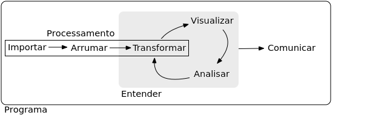
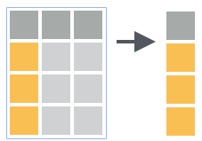
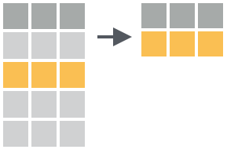
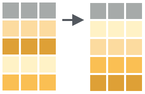
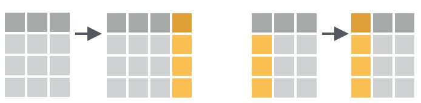
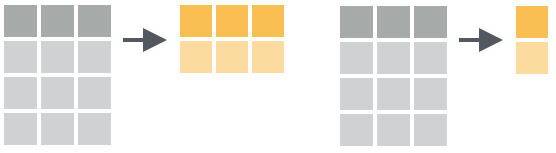
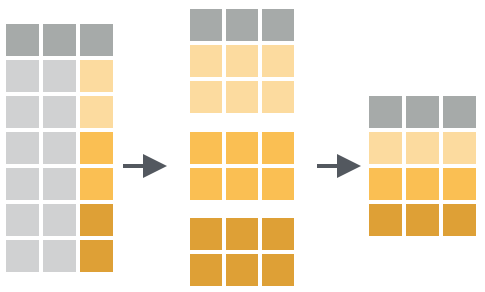

---
output:
  html_document: default
  pdf_document: default
---
# (PART) Ferramentas modernas do R {-}


# Processamento de dados {#data-wrangle}

<!-- 

https://moderndive.com/preface.html

Package for handling multiple imputations in a tidy format
https://github.com/njtierney/mputr 


https://blog.rstudio.com/2020/05/05/wrangling-unruly-data/?utm_content=buffer24dbf&utm_medium=social&utm_source=linkedin&utm_campaign=buffer

https://rstudio.com/resources/webinars/reproducibility-in-production/

-->


```{r setup, include = FALSE}
rm(list = ls())
pcks <- c("knitr", "pander")
easypackages::libraries(pcks)
opts_chunk$set(
  prompt = FALSE,
  cache = FALSE,
  fig.path = "images/",
  comment = "#>",
  collapse = TRUE,
  eval = FALSE # to try pass in travis!
)
source("R/utils.R")
figselect <- ''
```

Neste capítulo veremos:

- um *quadro de dados* aperfeiçoado, denominado *tibble*

- como arrumar seus dados em uma estrutura conveniente para a análise e visualização de dados

- como reestruturar os dados de uma forma versátil e fácil de entender

- como manipular os dados com uma ferramenta intuitiva e padronizada

Existem diversas ferramentas da base do `r rblue` para realizar as operações listadas acima. Entretanto, elas não foram construídas para um objetivo comum e foram feitas por diferentes desenvolvedores e em diferentes fases da evolução do `r rblue`. Por isso, elas podem parecer confusas, não seguem uma codificação consistente e não foram construídas pensando em uma interface integrada para o processamento de dados. Conseqüentemente, para usá-las é necessários um esforço significativo para entender a estrutura de dados de entrada de cada uma. A seguir, precisamos padronizar suas saídas para que sirvam de entrada para outra função (às vezes de outro pacote) que facilita a realização de uma próxima etapa do fluxo de trabalho.

Muitas coisas no `r rblue` que foram desenvolvidas há 20 anos atrás são úteis até hoje. Mas as mesmas ferramentas podem não ser a melhor solução para os problemas contemporâneos. Alterar os códigos da base do `r rblue` é uma tarefa complicada devido a cadeia de dependências do código fonte e dos pacotes dos milhares de contribuidores. Então, grande parte das inovações no `r rblue` estão ocorrendo na forma de pacotes. Um exemplo é o conjunto de pacotes [*tidyverse*](https://www.tidyverse.org/) desenvolvido para suprir a necessidade de ferramentas efetivas e integradas para ciência de dados (Figura \@ref(fig:tidy-workflow)).

<!---
#A nossa capacidade tecnológica de coletar e armazenar uma quantidade massiva de dados digitalmente demanda ferramentas pragmáticas e acessíveis.
--->


```{r tidy-workflow, out.width="100%", fig.cap="Modelo de ferramentas empregadas em ciência de dados. Adaptado de @Wickham2017.", echo = FALSE, eval = TRUE}

```

O termo *tidyverse* pode ser traduzido como 'universo arrumado' e consiste em uma coleção de pacotes (Figura \@ref(fig:tidyverse-components)) que compartilham uma interface comum com padrões de estrutura e manipulação de dados [@Wickham-dplyr, @Wickham2014].

O *tidyverse* tem sido amplamente utilizado pela comunidade de usuários e desenvolvedores do `r rblue`. Além de uma abordagem mais coesa e consistente para realizar as tarefas envolvidas no processamento de dados, os códigos são mais eficientes, legíveis e com sintaxe mais fácil de lembrar. Consequentemente, focamos mais nos conceitos e menos na sintaxe.

```{r tidyverse-components, out.width="80%", fig.cap="Coleção de pacotes do *tidyverse*.", echo = FALSE, eval = TRUE}
knitr::include_graphics("images/tidyverse_components.png")
```

O tidyverse enfatiza legibilidade ao invés de desempenho. Para quem está começando a programar ele atenderá à maioria dos processos analíticos, mas pode não ser rápido o suficiente para um sistema de processamento de dados operacional de alta demanda. Se você precisa avançar nesta linha, você precisará se aprofundar em ferramentas específicas (veja por exemplo  @Gillespie2017).

## Pré-requisitos

O pacote **tidyverse** torna fácil de instalar e carregar os pacotes do *tidyverse* com apenas uma chamada à função:

```{r, eval = FALSE}
install.packages("tidyverse")
```

E da mesma forma carregamos o conjunto de pacotes com:

```{r, eval = TRUE}
library(tidyverse)
```

```{block, tidyverse-load, type='rmdnote'}
Ao carregar o pacote **tidyverse** é mostrado no console os pacotes que foram carregados. À direita são mostradas as configurações e informações sobre o seu sistema operacional. Na parte inferior, há uma mensagem sobre os conflitos entre as funções da base do R (ou de outros pacotes) que tem mesmo nome que as de algum pacote do *tidyverse*. A função do pacote carregado mais recentemente terá prioridade de uso. No caso acima, a função `filter()` do **dplyr** sobrepôs a função `filter()` do pacote **stats** da base do R. Em situações como esta é melhor deixar explícito no seu código a chamada à função usando `pacote::funcao()`.
```


Neste capítulo além do **tidyverse** usaremos outros pacotes que já podemos instalar:

```{r, message=FALSE, warning=FALSE, eval = TRUE}
pacotes <- c(
  "openair",
  "lubridate",
  "scales",
  "rio"
)
easypackages::libraries(pacotes)
```


### Dados 

Para este capítulo utilizaremos diversos conjuntos de dados para exemplificar o uso das principais ferramentas de manipulação de dados do *tidyverse*.

1. Dados climatológicos de precipitação e temperatura máxima anual de estações meteorológicas do [INMET](http://www.inmet.gov.br/portal/index.php?r=bdmep/bdmep) localizadas no estado do Rio Grande do Sul.

```{r, results='hide'}
clima_file_url <- "https://github.com/lhmet/adar-ufsm/blob/master/data/clima-rs.RDS?raw=true"
# dados de exemplo
clima_rs <- import(clima_file_url, format = "RDS")
clima_rs
```

```{r, echo = FALSE}
kable(clima_rs, align = "c")
```


2. Metadados das estações meteorológicas do [INMET](http://www.inmet.gov.br/portal/index.php?r=bdmep/bdmep) relacionadas a tabela de dados `clima_rs`.

```{r, results='hide'}
metadados_url <- "https://github.com/lhmet/adar-ufsm/blob/master/data/clima_rs_metadata_61_90.rds?raw=true"
# dados de exemplo
metadados_rs <- import(metadados_url, format = "RDS")
metadados_rs
```

```{r, echo = FALSE}
kable(metadados_rs, align = "c")
```

3. Um exemplo minimalista de dados referentes a séries temporais de precipitação anual observada em estações meteorológicas.

```{r, results='hide'}
prec_anual <- data.frame(
  site = c(
    "A001", "A001", "A002", "A002", "A002", "A003", "A803", "A803"
  ),
  ano = c(2000:2001, 2000:2002, 2004, 2005, 2006),
  prec = c(1800, 1400, 1750, 1470, 1630, 1300, 1950, 1100)
)
prec_anual
```

```{r, echo = FALSE}
kable(prec_anual, align = "c")
```


## *tibble*: um *quadro de dados* aperfeiçoado

Quadro de dados (*data frames*) são a unidade fundamental de armazenamento de dados retangulares no `r rblue`. O pacote **tibble** estende a classe *data frame* da base do `r rblue` com aperfeiçoamentos relacionados a impressão de dados (mais amigável e versátil), a seleção de dados e a manipulação de dados do tipo *factor*. O novo objeto é chamado de *tibble* e sua classe de `tbl_df`. 

### Funcionalidades do *tibble*

Para ilustrar algumas vantagens do *tibble*, vamos usar o *data frame* `prec_anual`. A criação destes dados como *tibble* é feita com a função de mesmo nome do pacote: `tibble::tibble()`.

```{r}
prec_anual_tbl <- tibble(
  site = c(
    "A001", "A001", "A002", "A002", "A002", "A003", "A803", "A803"
  ),
  ano = c(2000:2001, 2000:2002, 2004, 2005, 2006),
  prec = c(1800, 1400, 1750, 1470, 1630, 1300, 1950, 1100)
)
```

O exemplo acima é ilustrativo, pois um *data frame* pode ser convertido em um *tibble* simplesmente com a função `tibble::as_tibble()`:

```{r}
prec_anual_tbl <- as_tibble(prec_anual)
prec_anual_tbl
```


Com o *tibble* acima, as principais diferenças entre um *tibble* e um *data frame* podem ser enfatizadas.

- quando impresso no console do R, o *tibble* já mostra a classe de cada variável.

- vetores caracteres não são interpretados como *factors* em um *tibble*, em contraste a `base::data.frame()` que faz a coerção para *factor* e não conserva o nome das variáveis. Este comportamento padrão pode causar problemas aos usuários desavisados em análises posteriores. 

```{r}
str(data.frame("temp. do ar" = "18"))
```

- permite usar seus próprios argumentos prévios para definir variáveis durante a criação do *tibble*; veja o exemplo abaixo, onde a `int prec`(intensidade da precipitação) é baseada na razão da precipitação (`prec`) pelo número de dias no ano.

```{r}
prec_anual_tbl <- tibble(
  site = c(
    "A001", "A001", "A002", "A002", "A002", "A003", "A803", "A803"
  ),
  ano = c(2000:2001, 2000:2002, 2004, 2005, 2006),
  prec = c(1800, 1400, 1750, 1470, 1630, 1300, 1950, 1100),
  "int prec" = prec / 365.25
)
prec_anual_tbl
```


- nunca adiciona nomes às linhas (`row.names`)

```{r}
# nomes das linhas de um data frame são carregados adiante
subset(prec_anual, ano == 2001)
# tibble não possui nome de linhas (rownames)
subset(prec_anual_tbl, ano == 2001)
```


- a impressão de um *tibble* mostra as dez primeiras linhas e a quantidade de colunas mostradas é ajustada ao tamanho da janela do console.


As opções de controle *default* da impressão de *tibbles* no console pode ser configuradas através da função de opções de configuração global do R:

```{r}
m <- 15
n <- 3
options(
  tibble.print_max = m,
  tibble.print_min = n
)
```

Com a configuração acima, será impresso no console do R `n = 3` linhas do *tibble* se ele tiver mais de `m = 15` linhas. 

```{r}
nrow(clima_rs) > 15
# coersão do data.frame clima_rs para tibble
clima_rs_tbl <- as_tibble(clima_rs)
```

Para restaurar as opções *default* use:

```{r}
options(
  tibble.print_max = NULL,
  tibble.print_min = NULL
)
clima_rs_tbl
```


Uma alternativa útil para inspecionar mais detalhadamente os dados é a função `tibble::glimpse()`.

```{r}
glimpse(clima_rs)
```


Lembre-se também, da função `utils::View()` para visualizar os dados no RStudio.

```{r, eval = FALSE}
View(clima_rs)
```


Outros aspectos diferencias do *tibble* podem consultados na vinheta do referido pacote (`vignette("tibble")`).


## Restruturação de dados retangulares

> Até 80% do tempo da análise dados é dedicada ao processo de limpeza e preparação dos dados [@Dasu-Johnson, [New York Times 2014/08/18](https://www.nytimes.com/2014/08/18/technology/for-big-data-scientists-hurdle-to-insights-is-janitor-work.html)].

<!---
# references
#http://www.storybench.org/getting-started-with-tidyverse-in-r/
--->

### Dados arrumados

O conceito \"dados arrumados\" foi estabelecido por @Wickham2014 e representa uma forma padronizada de conectar a estrutura (formato) de um conjunto de dados a sua semântica (significado).

Dados bem estruturados servem para:

- fornecer dados propícios para o processamento e análise de dados por *softwares*;

- revelar informações e facilitar a percepção de padrões

Dados no \"formato arrumado\" atendem as seguintes regras para dados retangulares:

1. cada **variável** está em uma coluna 

2. cada **observação** corresponde a uma linha

3. cada **valor** corresponde a uma célula

4. cada tipo de unidade observacional deve compor uma tabela

```{block, significados-obs, type='rmdnote'}
Como sinônimo de observações você pode encontrar os termos: registros, casos, exemplos, instâncias ou amostras dependendo da área de aplicação.
```

 


Um exemplo de dados no formato arrumado é o *tibble* `prec_anual_tbl` mostrado abaixo:

```{r, echo = FALSE}
kable(
  rename(
    prec_anual_tbl, 
    "intensidade" = `int prec`
  ),
  longtable = TRUE,
  booktabs = TRUE,
  #caption = "Exemplo de dados no formato arrumado.",
  align = "c"
)
```

Os dados acima tem duas variáveis: precipitação (`prec`) e intensidade da precipitação (`intensidade`). As unidades observacionais são as colunas `site` e `ano`. A primeira unidade observacional informa o ponto de amostragem espacial e a segunda o ponto de amostragem temporal.

Uma **variável** contém todos valores que medem um mesmo atributo ao longo das unidades observacionais. Uma **observação** contém todos valores medidos na mesma unidade observacional ao longo dos atributos.
Cada **valor** (número ou caractere) pertence a uma variável e uma observação.

Exemplo de diferentes **tipos de unidades observacionais** são a tabela com a séries temporais dos elementos meteorológicos (exemplo acima) e a tabela com os metadados das estações de superfície que contém atributos das estações meteorológicas (`site` no exemplo acima), tais como: longitude, latitude, altitude, nome, município, estado e etc.

A estrutura de dados \"arrumados\" parece óbvia, mas na prática, dados neste formatos são raros de serem encontrados. As razões para isso incluem:

- quem projeta a coleta e o registro de dados nem sempre é aquele que gasta tempo trabalhando sobre os dados;

- a organização dos dados busca tornar o registro de dados o mais fácil possível;

Consequente, dados reais sempre precisarão ser arrumados. O primeiro passo é identificação das variáveis e das observações. O passo seguinte é resolver os seguintes problemas mais comuns:

- distribuir observações (que estão armazenadas nas colunas) ao longo das linhas

- distribuir variáveis (que estão armazenada nas linhas) ao longo das colunas

Essas duas operações são realizadas com as principais funções do pacote **tidyr**: 

- `pivot_longer()`: para pivotar colunas ao longo das linhas (reunir \"variáveis\" nas linhas);

- `pivot_wider()`: para pivotar linhas ao longo das colunas (espalhar \"observações\" nas colunas)

<!---
#O formato de dados arrumado pode ser ideal para muitas operações no R que envolvem *data frames* (agregação, visualização gráfica, ajuste de modelos estatísticos), mas pode não ser a estrutura ideal para todos os casos.
--->


### Formatos de dados mais comuns

O pacote **tidyr** é a extensão do `r rblue` que fornece funcionalidades para reestruturar os dados entre diferentes formatos.

Os principais formatos de dados são: 

- **dados longos**, são tabelas com mais valores ao longo das linhas; geralmente mistura variáveis com observações;

- **dados amplos**, são tabelas com valores mais distribuídos nas colunas, geralmente contém pelo menos uma unidade observacional misturada com variáveis;


#### Formato de dados longo {#formatos-dados}

Para exemplificar o formato de dados longo vamos partir dos \"dados arrumados\" do exemplo, `prec_anual_tbl`. Primeiro vamos renomear a variável `int prec` para `intensidade` para  seguir um o padrão de nome das variáveis mais conveniente para o seu processamento no `r rblue`.

```{r}
prec_anual_tbl <- rename(
  prec_anual_tbl,
  "intensidade" = `int prec`
) 
prec_anual_tbl
```

Vamos usar a função `tidyr::pivot_longer()` para reestruturar os dados `prec_anual_tbl` em uma nova tabela de dados que chamaremos `prec_anual_long`.

Na nova tabela, manteremos as colunas `site`, `ano` e   teremos dois novos pares de variáveis: `variavel` e `valor`. Na coluna `variavel` pivotaremos as variáveis `prec` e `intensidade`. Na coluna `valor` pivotaremos os valores das variáveis `prec` e `intensidade`.

```{r}

prec_anual_long <- pivot_longer(
  data = prec_anual_tbl,
  cols = c(prec, intensidade), # ou c("prec", "intensidade"),
  names_to = "variavel",
  values_to = "medida"
)
prec_anual_long

# prec_anual_long <- gather(
#   data = prec_anual_tbl,
#   key = variavel,
#   value = medida,
#   prec, intensidade
# )

```

O código acima demonstra os principais argumentos requeridos pela função `gather`:

- `data = prec_anual_tbl`, o *quadro de dados* ou *tibble* que será reestruturado;

- `cols = c("prec", "intensidade")`, variáveis a serem pivotadas no formato longo;


- `names_to = variavel`, um vetor caractere com nome que nós escolhemos para dar à nova coluna que armazenará os dados nos **nomes das variáveis** dos dados de entrada (`data`).

- `values_to = medida`, um caractere com o nome que nós escolhemos para dar à nova coluna que armazenará os dados contidos nos valores das células;


As demais colunas dos dados (`site` e `ano`) serão mantidas inalteradas e seus valores serão repetidos quando necessário.

Como em outras funções dos pacotes do **tidyverse** você perceberá que alguns argumentos **não são especificados como caracteres** e sim como nomes (ou seja o nome da variável sem aspas), como aqueles usados quando definimos variáveis (p.ex.: `nome_var <- 10`). Os argumentos `names_to` e `values_to` podem ser especificados à gosto do usuário e não precisam ter relação com os dados existentes.


Se nós desejássemos que todas colunas do *quadro de dados* fossem reunidas em uma nova coluna `variavel` e os seus valores em uma nova coluna `valor`, isso poderia intuitivamente ser feito simplesmente especificando as variáveis de interesse por `everything()`[^selectores] no trecho de código anterior. 

```{r, error= TRUE}
prec_anual_longo <- pivot_longer(
  data = prec_anual_tbl, 
  cols = everything(),
  names_to = "atributo",
  values_to = "valor",
  values_ptypes = list(site = 'numeric')
)
```

[^selectores]: Nós veremos mais sobre funções do tipo seletoras na seção de manipulação de dados.

Entretanto, como a variável site é do tipo caractere, ela não pode ser combinada com variáveis do tipo numérico. Então temos que transformar a variável `site` para numérico se isso for realmente necessário.

```{r}
prec_anual_tbl_num <- transform(
  prec_anual_tbl,
  site = parse_number(site)
)
prec_anual_tbl_num
```

A função `parse_number()` é uma função auxiliar do pacote **`readr`** para extrair números de um caractere.

```{r}
pivot_longer(
  data = prec_anual_tbl_num, 
  cols = everything(),
  names_to = "atributo",
  values_to = "valor"
)

```
A tabela de dados resultante conterá todos os 32 pares de valores, formados pelas 4 colunas por 8 linhas, dos dados originais.

Se não forem especificados nomes para os argumentos `names_to` e `values_to` na chamada da função `tidyr::pivot_longer`, serão atribuídos os valores *default*: `name` e `value`.

```{r}
pivot_longer(
  data = prec_anual_tbl_num, 
  cols = everything()
)
```


#### Formato de dados amplo

Utilizando os dados `meteo_long`, vamos reestruturá-lo no formato amplo para demostrar a funcionalidade da função `tidyr::pivot_wider()`. Esta função é complementar à `tidyr::pivot_longer()`.

```{r}
prec_anual_long
```

Nosso objetivo é então gerar uma nova tabela de dados reestruturada, de forma que os nomes das variáveis (contidos na coluna `variavel`) sejam pivotados em duas colunas. Estas colunas receberão os nomes `prec` e `intensidade` e serão preenchidas com os dados das células da coluna `medida`. Para fazer isso usamos o seguinte código:

```{r}
prec_anual_amplo <- pivot_wider(
  data = prec_anual_long,
  names_from = variavel,
  values_from = medida
)
prec_anual_amplo
```

Esta operação serviu para colocar os dados originais (`prec_anual_long`) no formato \"arrumado\" (`prec_anual_amplo`).


### Funções adicionais do **tidyr**

Você pode unir duas colunas inserindo um separador entre elas com a função `tidyr::unite()`:

```{r}
(prec_anual_long_u <- unite(
  data = prec_anual_long,
  col = site_ano,
  site, ano,
  sep = "_"
))
```

Se ao contrário, você quer separar uma coluna em duas variáveis, utilize a função `tidyr::separate()`:

```{r}
separate(
  data = prec_anual_long_u,
  col = site_ano,
  sep = "_",
  into = c("site", "ano")
)
```

Para completar valores das variáveis para unidades observacionais faltantes podemos utilizar a função `tidyr::complete()`:

```{r}
prec_anual
prec_anual_comp <- complete(
  data = prec_anual,
  site, ano
)
prec_anual_comp
```


### Exercícios

```{r setup-ex-tidyr, include=FALSE}
#rm(list = ls())
knitr::opts_chunk$set(echo = TRUE,
                      comment = "#>",
                      prompt = FALSE, 
                      collapse = TRUE, 
                      include = FALSE)
```

**Pacotes necessários**

```{r, message=FALSE, warning=FALSE}
pcks <- c("rio", "tidyverse", "lubridate")
easypackages::libraries(pcks)
```


## Manipulação de dados

Com os dados arrumados, a próxima etapa é a manipulação dos dados. O pacote **dplyr** oferece um conjunto de funções que facilita as operações mais comuns para lidar com dados retangulares de uma forma bem pensada.

Os verbos fundamentais desta gramática de manipulação de dados são: 

  - `select()`, para selecionar variáveis;
  
  - `filter()`, para filtrar observações;
  
  - `arrange()`, para classificar variáveis;
  
  - `mutate()`, para criar e transformar variáveis;
  
  - `group_by()`, para agrupar observações;
  
  - `summarise()`, para resumir os dados com medidas estatísticas descritivas;


Estes verbos possuem uma sintaxe consistente com uma sentença gramatical:

<p style="color:DodgerBlue; font-size:1.3em; font-weight: bold;text-align:center;"> `verbo(sujeito, complemento)` </p>
 traduzindo de outra forma:
<p style="color:DodgerBlue; font-size:1.3em; font-weight: bold;text-align:center;"> `função(dados, z = x + y)` </p>

- o `verbo` é a função do **dplyr**;
- o `sujeito` (dados) é quem sofre a ação e é **sempre o primeiro argumento**, nomeado (`.data`);
- o `complemento` são expressões que podem ser usadas como argumentos (o que é representado pela reticência `...` no segundo argumento); isso ficará mais claro nos exemplos mais a frente;


```{block, note-pq-dplyr, type='rmdtip'}
Os verbos listados anteriormente possuem versões equivalentes na base do `r rblue`. Então, por que usar o *dplyr* ? 

- é muito mais rápido de se aprender, com poucas funções (ou verbos) nomeadas intuitivamente;

- as funções do **dplyr** são mais rápidas (parte dos códigos são programados em C++);

- trabalha bem com dados arrumados e também com sistemas de banco de dados

- as funções foram projetadas para trabalharem juntas na solução diversos problemas de processamento de dados; 
```


### Códigos como fluxogramas 

<!-- 
In deciphering R code it is helpful to read from right to left and from inside to outside. 
-->

A manipulação de dados requer uma organização apropriada do código. A medida que novas etapas do fluxo de trabalho vão sendo implementadas o código expande-se. As etapas vão sendo implementadas de forma sequencial, combinando funções que geram saídas que servirão de entrada para outras funções na cadeia de processamento. 

Essa é justamente a ideia do operador *pipe* `%>%`: passar a saída de uma função para outra função como a entrada dessa função por meio de uma seqüência de etapas. O operador `%>%` está disponível no `r rblue` através do pacote [magrittr](https://cran.r-project.org/web/packages/magrittr/vignettes/magrittr.html).

<!---
#{block, pipe-linux, type='rmdtip'}
# O *pipe* pode ser familiar para quem já usou SO unix, onde o operador  é representado por `|`. No comando linux abaixo listamos os arquivos com a extensão `.txt` e o resultado é passado como entrada ao comando `wc` com o argumento `-l` que conta quantas linhas tem a lista de arquivos. Neste caso o número de linhas corresponderá ao número de arquivos com a extensão `.txt`.
# `ls *.txt | wc -l`
--->

Os pacotes **tidyverse** integram-se muito bem com o `%>%`, por isso ele é automaticamente carregado com o **tidyverse**. Vamos ilustrar as vantagens de uso do %>% com exemplos a seguir.


#### Vantagens do %>%

O exemplo a baixo mostra uma aplicação simples do `%>%` para extrair a raiz quadrada de um número com a função `base::sqrt()`e a extração do segundo elemento de um vetor com a função `dplyr::nth()` (uma função alternativa aos colchetes `[]`).

```{r}
# chamada tradicional de uma função 
sqrt(4)
nth(5:1, 2)
# chamada de uma função com %>%
4 %>% sqrt()
5:1 %>% nth(2)
```

Ambas formas realizam a mesma tarefa e com mesmo resultado e o benefício do `%>%` não fica evidente. Entretanto, quando precisamos aplicar várias funções as vantagens ficam mais óbvias.

No código abaixo tente decifrar o objetivo das operações no vetor x.

```{r, eval = TRUE}
x <- c(1, 3, -1, 1, 4, 2, 2, -3)
x
nth(sort(cos(unique(x)), decreasing = TRUE), n = 2)
```

Talvez com o código identado fique mais claro:

```{r, eval = FALSE}
nth(            # 4
  sort(         # 3
    cos(        # 2
      unique(x) # 1
    ),
    decreasing = TRUE
  ),n =  2
)
```

O código acima está aninhando funções e isso leva a uma dificuldade de ler por causa da desordem. Para interpretá-lo precisamos fazer a leitura de dentro para fora:

1. mantém somente os valores únicos de x
2. calcula o cosseno do resultado de (1)
3. coloca em ordem decrescente o resultado de (2)
4. extrai o 2° elemento do resultado de (3)

Conclusão: o objetivo era obter o segundo maior número resultante do cosseno do vetor numérico x.

A versão usando pipe é:

```{r}
x %>%
  unique() %>%                # 1
  cos() %>%                   # 2
  sort(decreasing = TRUE) %>% # 3
  nth(n = 2)                      # 4
```

Dessa forma, o código fica mais simples, legível e explícito. Por isso, daqui para frente, nós utilizaremos extensivamente o operador `%>%` para ilustrar os verbos do **dplyr** e suas combinações.


```{block, pipe-linux, type='rmdtip'}
No exemplo anterior nós introduzimos a função `dplyr::nth()`. Ela é equivalente ao operador colchetes `[` da base do R. Se `a <- 5:1` então as instruções abaixo produzem resultados equivalentes:

`a[2]; nth(a, 2)`

`#> [1] 4`
`#> [1] 4`

```

#### O operador `.` como argumento

Uma representação mais explícita do código usado na cadeia de funções acima, seria com a inclusão do operador `.` e os nomes dos argumentos das funções:


```{r}
x %>%
  unique(x = .) %>%                  # 1
  sort(x = ., decreasing = TRUE) %>% # 2
  cos(x = .) %>%                     # 3
  nth(x = ., n = 2)                  # 4
```

O tempo a mais digitando é compensado posteriormente quando o você mesmo futuramente tiver que reler o código. Essa forma enfatiza com o `.` que o resultado à esquerda é usado como entrada para função à direita do `%>%`.

Mas nem todas funções do `r rblue` foram construídas com os dados de entrada no primeiro argumento. Essa é a deixa para outra funcionalidade do `.` que é redirecionar os dados de entrada para a posição adequada naquelas funções. Uma função que se encaixa neste caso é a `base::grep()` que detecta uma expressão regular num conjunto de caracteres (*strings*). 

```{r}
adverbs <- c("ontem", "hoje", "amanhã")
grep(
  pattern = "h",
  x = adverbs,
  value = TRUE
)
```

O código acima seve para retornar os elementos do vetor `dias` que contenham a letra `h`. No entanto os dados de entrada da `base::grep()` são esperados no 2° argumento (`x`). Para redirecioná-los para essa posição dentro de uma cadeia de funções com `%>%`, colocamos o operador `.` no 2° argumento da função:

```{r}
adverbs %>%
  grep(
  pattern = "h",
  x = .,
  value = TRUE
)
```


<!---
# pipe forever?
# No. ver http://r4ds.had.co.nz/pipes.html#When%20not%20to%20use%20the%20pipe
--->


### Seleção de variáveis 

```{r, ,echo = FALSE, out.width="20%", out.height="20%", fig.align='center', eval = TRUE}

```

Para selecionar somente variáveis de interesse em uma tabela de dados podemos usar a função `dplyr::select(.data, ...)`. Nos dados `clima_rs_tbl` se desejamos selecionar apenas as colunas `estacao` e `tmax` aplicamos a `dplyr::select()` com o 2° argumento listando as colunas que desejamos selecionar:

```{r}
select(clima_rs_tbl, estacao, tmax)
```

O resultado é um subconjunto dos dados originais contendo apenas as colunas nomeadas nos argumentos seguintes aos dados de entrada.

A função `dplyr::select()` possui funções auxiliares para seleção de variáveis:

```{r}
clima_rs_tbl %>%
  # as variáveis entre uf e tmax
  select(., uf:tmax) %>%
  head(., n = 3)

clima_rs_tbl %>%
  # todas variáveis menos as entre codigo:uf
  select(., -(codigo:uf)) %>%
  head(., n = 3)

clima_rs_tbl %>%
  # ordem inversa das variáveis
  select(., tmax:codigo) %>%
  head(., n = 3)

clima_rs_tbl %>%
  # nomes que contenham a letra "a"
  select(., contains("a")) %>%
  head(n = 3)

clima_rs_tbl %>%
  # variáveis que iniciam com "c"
  select(., starts_with("c")) %>%
  head(., n = 3)

clima_rs_tbl %>%
  # usando um vetor de caracteres
  select(., any_of(c("estacao", "uf"))) %>%
  head(., n = 3)

clima_rs_tbl %>%
  # combinações
  select(., -uf, ends_with("o")) %>%
  head(., n = 3)

clima_rs_tbl %>%
  # variáveis que inciam com letras minúsculas e com 4 caracteres
  select(., matches("^[a-z]{4}$")) %>%
  head(., n = 3)
# variáveis numéricas
clima_rs_tbl %>%
  select(is.numeric)
```

O último exemplo usa uma expressão regular ([regex](https://pt.wikipedia.org/wiki/Express%C3%A3o_regular)). *Regex* é uma linguagem para descrever e manipular caracteres de texto. Há [livros sobre este assunto](http://aurelio.net/regex/guia/) e diversos [tutorias](https://stringr.tidyverse.org/articles/regular-expressions.html) sobre *regex* no R. Para saber mais sobre isso veja  o capítulo sobre [strings](http://r4ds.had.co.nz/strings.html) do livro de @Wickham2017. Conhecendo o básico, você poupará tempo automatizando a formatação de caracteres de texto.

Veja mais funções úteis para seleção de variáveis em `?dplyr::select`. 

### Seleção de observações

```{r, ,echo = FALSE, out.width="20%", out.height="20%", fig.align='center', eval = TRUE}

```

A filtragem de observações geralmente envolve uma expressão que retorna valores lógicos ou as posições das linhas selecionadas (como a função `which()`).

A função `dplyr::filter()` permite filtrar observações de um *data frame* correspondentes a alguns critérios lógicos. Estes critérios podem ser passados um de cada vez ou com um operador lógico (e: `&`, ou: `|`). Veja abaixo alguns exemplos de filtragem de observações: 

- linhas correspondentes ao `codigo` da estação 83936.

```{r}
clima_rs_tbl %>%
  filter(codigo == 83936)
```

- linhas da variável `estacao` que contenham o vetor caractere `litoraneas`.
```{r}
litoraneas <- c("Torres", 
                "Guaporé")
clima_rs_tbl %>%
  filter(estacao %in% litoraneas)
```

- observações com `tmax` acima de 10% da média

```{r}
filter(clima_rs_tbl,  tmax > 1.1*mean(tmax))
```

- observações com `tmax` e `prec` acima de suas médias

```{r}
clima_rs_tbl %>%
filter(
  tmax > mean(tmax),  
  prec > mean(prec)
)
# equivalente a
#clima_rs %>% 
#  filter(tmax > mean(tmax) & prec > mean(prec))
```
- observações cuja variável `estacao` tem a palavra \"Sul\" 

```{r}
# estações com "Sul" no nome
clima_rs_tbl %>% 
  filter(str_detect(estacao, "Sul"))
```


```{block, sringr, type='rmdtip'}
O exemplo acima é mais uma operação com caracteres onde foi usada  a função `stringr::str_detect()` para detectar os elementos da variável do tipo caractere que contenham o termo \"Sul\". O pacote **stringr** [@Wickham-stringr] fornece funções para casar padrões de caracteres de texto e os nomes das funções são fáceis de lembrar. Todos começam com `str_` (de string) seguido do verbo, p.ex.:

`str_replace_all(`

   `  string = c("abc", "lca"),`

   `  pattern = "a",`

   `  replacement =  "A"`

`)`

`#> [1] "Abc" "lcA"`
```


A seleção de observações também pode ser baseada em índices passados para função `dplyr::slice()` que retorna o subconjunto de observações correspondentes. Abaixo vejamos alguns exemplos de filtragem de linhas baseada em índices ou posições:

```{r}
# linhas 2 e 4
clima_rs_tbl %>%
  slice(., c(2, 4))
# última linha
clima_rs_tbl %>%
  slice(., n())
# exlui da última à 3a linha
clima_rs_tbl %>%
  slice(., -(n():3))
# linhas com tmax > 26
clima_rs_tbl %>%
  slice(., which(tmax > 26))
# linhas com tmax mais próxima a média de tmax
clima_rs_tbl %>%
  slice(., which.min(abs(tmax - mean(tmax))))
```


### Reordenando dados

```{r, ,echo = FALSE, out.width="20%", out.height="20%", fig.align='center', eval = TRUE}

```

As vezes é útil reordenar os dados segundo a ordem (crescente ou decrescente) dos valores de uma variável. Por exemplo, os dados `clima_rs_tbl` podem ser arranjados em ordem decrescente da precipitação anual, conforme abaixo.

```{r}
clima_rs_tbl %>% 
  arrange(., desc(prec)) %>%
  head(., n = 3)
```

A função `dplyr::arrange()` por padrão ordena os dados em ordem crescente. A função `dplyr::desc()` ordena os valores da variável em ordem descendente. 

Os dados ordenados pela `tmax`, ficam da seguinte forma:

```{r}
clima_rs_tbl %>% 
  arrange(., tmax) %>%
  head(., n = 3)
```


### Criando e renomeando variáveis

```{r, ,echo = FALSE, out.width="50%", out.height="55%", fig.align='center', eval = TRUE}

```


Uma nova variável pode ser adicionada aos dados através da função `dplyr::mutate()`. A `tmax` expressa em Kelvin pode ser adicionada aos dados `clima_rs_tbl`, com:


```{r}
clima_rs_tbl %>%
  # tmax em Kelvin
  mutate(., tmaxK = tmax + 273.15) %>%
  # só as colunas de interesse
  select(., contains("tmax")) %>%
  # 3 primeiras linhas
  head(., n = 3)
```


Podemos renomear variáveis com a função `dplyr::rename()`.

```{r}
clima_rs_tbl %>%
rename(., 
       "id" = codigo,
       "site" = estacao,
       "temp_max" = tmax,
       "precip" = prec
       ) %>%
  head(., n = 3)
```

Podemos sobrescrever variáveis e recodificar seus valores, conforme o exemplo abaixo. A variável `site` será corrigida, de forma os valores iguais a "A803" sejam substituídos por "A003".

```{r}
prec_anual_corr <- prec_anual %>%
mutate(
  site = recode(site, A803 = "A003")
) 
tail(prec_anual_corr, n = 4)
```


Podemos preencher os valores faltantes de uma variável por um valor prescrito, por exemplo baseado na média de outras observações, ou nos valores prévios, ou posteriores. Variáveis podem ser derivadas das variáveis sendo criadas dentro da `dplyr::mutate()`. 


```{r}
# preenchendo prec faltante pela média
prec_anual_comp %>%
  mutate(., 
         prec = replace_na(prec,
                           mean(prec, na.rm = TRUE)
                           ),
         ndias = ifelse(ano %% 4 == 0, 
                      366, 
                      365),
         # intensidade de ndias, criada na linha acima
         intensidade = prec / ndias
         )

prec_anual_comp %>%
  # preenche com  a observação prévia
  fill(prec, .direction = "down")

prec_anual_comp %>%
  # preenche com  a observação posterior
  fill(prec, .direction = "up")

```


### Agregando observações

```{r, ,echo = FALSE, out.width="40%", out.height="50%", fig.align='center', eval = TRUE}

```

A função `dplyr::summarise()` (ou `dplyr::sumarize()`) agrega valores de uma variável e os fornece para uma função que retorna um único resultado. O resultado será armazenado em um `data frame`.

Por exemplo, qual a `prec`  média anual do RS?

```{r}
clima_rs_tbl %>%
  summarise(
    .,
    prec_med = mean(prec)
  )
```

Se você só quer o valor (ou o vetor), ao invés de um `data frame`, pode usar a função `dplyr::pull()`:

```{r}
clima_rs_tbl %>%
  summarise(
    .,
    prec_med = mean(prec)
  ) %>%
  pull()
```


Podemos aplicar uma ou mais funções a mais de uma variável usando `dplyr::summarise_at()`:

```{r}
clima_rs_tbl %>%
  summarise_at(
    .,
    .vars = vars(prec, tmax),
    .funs = list(mn = min, md = median, mx = max),
    na.rm = TRUE
  )
```


Observações repetidas devem ser removidas dos dados antes de qualquer cálculo. Suponha os dados abaixo:

```{r}
prec_anual_comp_rep <-
  prec_anual_comp %>%
  mutate(
    site = recode(site, A803 = "A003"),
    ano = NULL
  ) %>%
  # preenche com  a observação posterior
  fill(., prec, .direction = "up")
prec_anual_comp_rep
```

Para desconsiderar linhas duplicadas nos dados usamos a função `dplyr::distinct()`:

```{r}
# remove observações repetidas
prec_anual_comp_rep %>%
  distinct(site, prec)
```


A função `dplyr::count()` é útil para obter a frequência de ocorrência de uma variável ou da combinação de variáveis. 

```{r}
prec_anual_comp_rep %>%
  count(site)
prec_anual_comp_rep %>%
  count(site, prec)
```


### Agrupando observações

```{r, ,echo = FALSE, out.width="40%", out.height="50%", fig.align='center', eval = TRUE}

```

Frequentemente temos que agrupar observações em categorias ou grupos para realizar uma análise estatística. A função 
`dplyr::group_by()` é uma função silenciosa que separa (invisivelmente) as observações em categorias ou grupos.
A única mudança ao aplicar a `dplyr::group_by()` à um *data frame* é a indicação da variável agrupada e o seu número de grupos na saída do console. No exemplo a seguir vamos agrupar os dados `prec_anual_tbl` por `site` e teremos 4 grupos para esta variável.

```{r}
prec_anual_tbl %>%
  group_by(site)
```


A grande funcionalidade da `dplyr::group_by()` surge quando combinada com a função `dplyr::summarise()`, o que nos permite obter resumos estatísticos para cada grupo da variável. 

Por exemplo a chuva anual média por `site` (estação meteorológica) é obtida com o seguinte código:

```{r}
prec_anual_tbl %>%
  group_by(., site) %>%
  summarise(., prec_med = mean(prec))
```

A `prec` média para cada ano e o número de anos utilizados em seu cálculo é obtida por: 

```{r}
prec_anual_tbl %>%
  group_by(., ano) %>%
  summarise(
    .,
    prec_med = mean(prec),
    nobs = n()
  )
```

A função `n()` conta quantas observações temos em um subconjunto dos dados.

Os grupos podem ser compostos de mais de uma variável. Para o exemplo com os dados `prec_anual_long`;

```{r}
prec_anual_long
```

podemos obter a média por `variavel` e `site`, fazendo:

```{r}
por_site_var <- prec_anual_long %>%
  group_by(site, variavel) %>%
  summarise(
    media = mean(medida, na.rm = TRUE)
  ) %>%
  arrange(variavel, site)
por_site_var
```

Com o conjunto de verbos exemplificados você agora é capaz de realizar as tarefas mais comuns de manipulação de dados tabulares de forma clara e confiável.

Há mais funções úteis disponíveis no pacote **dplyr** e você é encorajado a descubrí-las. 

<!---
#faltando 
# - non standard evaluation
# - ...
--->


### Combinação de dados 

O processamento de dados frequentemente envolve a manipulação de diversas tabelas de dados. Ás vezes precisamos juntar dados de diferentes fontes, formar uma tabela única de dados com o período em comum à elas, ou combiná-las para compará-las.

A combinação de 2 *data frames*, com observações similares, que tem variáveis diferentes e algumas em comum é uma tarefa muito comum na manipulação de conjuntos dados. Este tipo de operação é chamada de **junção** (do termo em inglês *join*) de tabelas . O pacote **dplyr** possui uma gama de funções do tipo *join* para combinar *data frames*, genericamente representadas por `<tipo>_join()`, onde `<tipo>` pode ser substituído por `dplyr::full_join()`, `dplyr::inner_join()`, `dplyr::left_join()`, `dplyr::right_join()`.

Essas funções combinam informação em dois data frames baseada na unificação de valores entre as variáveis que ambos compartilham. 

Vamos considerar os dados `clima_rs_tbl` e `metadados_rs`. Para melhor compreensão do exemplo vamos remover algumas variáveis.

```{r}
# normais climatológicas das estaçõess
clima_rs_tbl <- clima_rs_tbl %>%
  select(-(estacao:uf))
head(clima_rs_tbl)
# metadados das estações convertidos para tibble
metadados_rs <- metadados_rs %>% 
  as_tibble()
head(metadados_rs)
```

A variável comum às duas tabelas é:

```{r}
var_comum <- names(clima_rs_tbl) %in% names(metadados_rs)
names(clima_rs_tbl)[var_comum]
```

Vamos comparar os valores da variável `codigo` em cada tabela de dados para verificar se todos valores contidos em uma tabela também estão presentes na outra e vice-versa. 

Para saber se algum valor da variável `codigo` da tabela `clima_rs_tbl` não está contido na tabela `metadados_rs` podemos usar o seguinte código:

```{r}
# algum codigo não está presente na tabela metadados_rs
clima_rs_tbl %>%
  filter(., ! codigo %in% metadados_rs$codigo ) %>%
  select(., codigo)
```

Não há nenhum caso.

Analogamente, vamos verificar se algum valor da variável `codigo` dos `metadados_rs` não está contido em `clima_rs_tbl`.

```{r}
# algum codigo não está presente na tabela metadados_rs
metadados_rs %>%
  filter(., ! codigo %in% clima_rs_tbl$codigo )%>%
  select(., codigo)
```


Obtemos que 7 valores da variável `codigo` dos `metadados_rs` que não estão presentes na tabela `clima_rs_tbl`. Portanto, não há valores de `tmax` e `prec` para essas observações.


Suponha agora que desejássemos visualizar a variação espacial da precipitação (`prec`) ou da temperatura máxima do ar (`tmax`) climatológica. Precisaríamos além dessas variáveis, as coordenadas geográficas das estações meteorológicas para plotar sua localização espacial. As coordenadas `lon` e `lat` da `metadados_rs` podem ser combinadas com `clima_rs_tbl` em uma nova tabela (`clima_rs_comb`), usando a função `dplyr::full_join()`:

```{r, results='hide'}
clima_rs_comb <- full_join(
  x = clima_rs_tbl, 
  y = metadados_rs,
  by = "codigo")
clima_rs_comb
```

```{r, echo = FALSE}
kable(clima_rs_comb)
```


Da inspeção das últimas linhas de `clima_rs_comb` verificamos que o resultado é uma tabela que contém todos valores da variável `codigo` das duas tabelas. Os valores das variáveis `prec` e `tmax`, para as observações da variável `codigo` sem valores ( na `metadados_rs`) são preenchidos com `NA`.

Se a combinação de interesse for nas observações em comum entre as tabelas, usaríamos:

```{r, results='hide'}
clima_rs_intersec <- inner_join(
  x = metadados_rs, 
  y = clima_rs_tbl,
  by = "codigo"
)
clima_rs_intersec
```

```{r, echo = FALSE}
kable(clima_rs_intersec)
```

Para obter uma tabela com as observações diferentes entre as duas tabelas, usamos:

```{r, results='hide'}
clima_rs_disj <- anti_join(
  x = metadados_rs, 
  y = clima_rs_tbl,
  by = "codigo"
)
clima_rs_disj
```

```{r, echo = FALSE}
kable(clima_rs_disj)
```

O exemplo abaixo demonstram os resultados das funções `dplyr::left_join()` e `dplyr::right_join()` para um versão reduzida dos dados `clima_rs_tbl`.

```{r}
clima_rs_tbl_mini <- clima_rs_tbl %>%
  slice(., 1:3) 
clima_rs_tbl_mini
# combina os dados baseado nas observações dos dados à esquerda (x)
left_join(
  x = clima_rs_tbl_mini, 
  y =metadados_rs, 
  by = "codigo"
)
# combina os dados baseado nas observações dos dados à direita (y)
right_join(
  x = clima_rs_tbl_mini, 
  y = metadados_rs, 
  by = "codigo"
)
```

## Exercícios

```{r setup-ex-dplyr, include=FALSE}
#rm(list = ls())
knitr::opts_chunk$set(echo = TRUE,
                      comment = "#>",
                      prompt = FALSE, 
                      collapse = TRUE, 
                      include = FALSE)
```

**Pacotes necessários**

```{r, include = TRUE, message=FALSE, warning=FALSE}
pcks <- c("rio", "tidyverse", "lubridate")
easypackages::libraries(pcks)
```

**Dados**

```{r, eval = FALSE}
arq_temp <- tempfile(fileext = ".RData")
download.file(
  "https://github.com/lhmet/adar-ufsm/blob/master/data/dados-lista-exerc4-cap9.RData?raw=true",
  destfile = arq_temp,
  mode = "wb"
)
file.exists(arq_temp)

# nome dos dados carregados para os exercícios
print(load(arq_temp))
```

1. Converta os dados de anomalias padronizadas do índice de oscilação sul armazenados no *quadro de dados* `soi` (mostrado abaixo) para o formato \"arrumado\" e em ordem cronológica. Os nomes das variáveis na tabela de dados arrumado deve estar sempre em letras minúsculas (Converta se for necessário usando a função `tolower(names(soi_arrumado))`).

```{r}
soi 
```

A estrutura esperada dos dados arrumados é mostrada abaixo: 

```
Rows: 36
Columns: 3
$ year <int> 1951, 1951, 1951, 1951, 1951, 1951, 195...
$ mes  <int> 1, 2, 3, 4, 5, 6, 7, 8, 9, 10, 11, 12, ...
$ soi  <dbl> 1.5, 0.9, -0.1, -0.3, -0.7, 0.2, -1.0, ...
```

2. Os dados de precipitação diária abaixo são uma pequena amostra dos dados usados na questão 4 da lista do Capítulo 8. Converta o *tibble* fornecido abaixo para o \"formato arrumado\". No data frame arrumado, transforme as datas obtidas (na classe de caractere) para classe *date* usando a função `as.Date()`.

```{r, include=TRUE}
precd_ncdf
```

A estrutura esperada do *tibble* resultante é mostrada abaixo:


```
Rows: 40
Columns: 4
$ x    <dbl> -60.625, -60.375, -60.125, -60.625, -60...
$ y    <dbl> 5.125, 5.125, 5.125, 4.875, 4.875, 5.12...
$ date <date> 2010-01-01, 2010-01-01, 2010-01-01, 20...
$ prec <dbl> 0.0000000, 0.0000000, 0.0000000, 0.0000...
```

3. Coloque os dados de poluição (*tibble* `poluentes`) no formato \"arrumado\".

```{r, include=TRUE}
poluentes
```


A estrutura esperada do *tibble* resultante é mostrada abaixo:

```
Rows: 3
Columns: 4
$ estacao <int> 1, 2, 4
$ no2     <chr> NA, NA, "1h"
$ ozone   <chr> "1h", "8h", NA
$ so2     <chr> "1h", NA, NA
```


4. Coloque os dados meteorológicos diários da estação meteorológica de Santa Maria no formato arrumado. Deixe os dados ordenados cronologicamente.

```{r, include = TRUE}
dados_sm
```


A estrutura esperada do *tibble* resultante é mostrada abaixo:

```
Rows: 186
Columns: 6
$ id    <chr> "83936", "83936", "83936", "83936", "8...
$ month <dbl> 1, 1, 1, 1, 1, 1, 1, 1, 1, 1, 1, 1, 1,...
$ year  <dbl> 2010, 2010, 2010, 2010, 2010, 2010, 20...
$ day   <int> 1, 2, 3, 4, 5, 6, 7, 8, 9, 10, 11, 12,...
$ tmax  <dbl> 32.6, 33.4, 24.8, 29.4, 27.0, 24.4, 29...
$ tmin  <dbl> 17.9, 21.4, 21.6, 23.4, 23.2, 21.8, 18...
```


- - -

5. Com os dados obtidos na questão 4: 

   a. junte as colunas `year`, `month` e `day` em uma única coluna denominada `date` de forma que a classe dessa nova coluna seja `date`.  


Estrutura de dados esperada:

```
Rows: 186
Columns: 4
$ id   <chr> "83936", "83936", "83936", "83936", "83...
$ date <date> 2010-01-01, 2010-01-02, 2010-01-03, 20...
$ tmax <dbl> 32.6, 33.4, 24.8, 29.4, 27.0, 24.4, 29....
$ tmin <dbl> 17.9, 21.4, 21.6, 23.4, 23.2, 21.8, 18....
```


   b. Filtre os dados obtidos em **(a)** de forma a descobrir as datas em que as observações de `tmax` ou `tmin` são faltantes. Mostre o *tibble* filtrado com as datas e explique o porquê de seus valores. 


- - -

6. A amostra de dados abaixo possui medidas a cada 6 horas de uma estação meteorológica de superfície. Reestruture os dados no formato \"arrumado\" e as informações de data e horário agregadas em uma única variável da classe *POSIXct*.

```{r, include=TRUE}
dados_zorra
```


A estrutura esperada do *tibble* resultante é mostrada abaixo:

```
Rows: 16
Columns: 3
$ date <dttm> 2010-01-01 00:00:00, 2010-01-01 06:00:...
$ tmax <dbl> 22.1, 21.0, 26.4, 27.0, 26.0, 25.0, 29....
$ tmin <dbl> 16.0, 13.5, 18.2, 24.1, 19.0, 13.7, 16....
```


- - -

7. Faça uma junção da tabela de dados de informações das estações de poluição (`etacoes`, dada abaixo) com os períodos de duração de poluição crítica (`poluentes`). A tabela resultante deve conter somente estações que tenham coordenadas espaciais e medidas de poluentes válidas.

```{r, include=TRUE}
estacoes
```


Estrutura da tabela resultante:

```
Rows: 3
Columns: 5
$ id       <int> 1, 1, 2
$ lat      <dbl> 42.46757, 42.46757, 42.04915
$ lon      <dbl> -87.81005, -87.81005, -88.27303
$ poluente <chr> "ozone", "so2", "ozone"
$ duracao  <chr> "1h", "1h", "8h"
```

- - -

8. Combine as 2 tabelas abaixo de forma que:

  a. a tabela resultante contenha todas as datas compreendidas pelas duas tabelas (e em ordem cronológica) e as observações de umidade do solo (`theta`) sejam preenchidas com `NA`. 

```{r}
# datas completas
datas_comp
# datas das observações de theta
datas_obs
```


Estrutura da tabela de dados resultante:

```
Rows: 8
Columns: 2
$ date  <date> 2018-07-13, 2018-07-14, 2018-07-15, 2...
$ theta <dbl> 0.3295812, 0.4123798, 0.3917322, NA, N...
```

  b. a tabela resultante contenha exatamente as datas da tabela `data_comp` (em ordem cronológica) e as observações de umidade do solo (`theta`) sejam preenchidas com `NA`.
  


Estrutura da tabela de dados resultante:

```
Rows: 7
Columns: 2
$ date  <date> 2018-07-14, 2018-07-15, 2018-07-16, 2...
$ theta <dbl> 0.4123798, 0.3917322, NA, NA, 0.326888...
```

- - - 

9. Utilizando os dados horários de estações meteorológicas automáticas (EMA) do RS (`dados_rs_08_16`), determine a data inicial, final e o período de dados (em anos) de cada estação (identificada pela variável `site`).

Estrutura da tabela de dados resultante: 

```
Rows: 42
Columns: 5
$ site        <chr> "A801", "A802", "A803", "A804", ...
$ periodo     <dbl> 8.5027322, 8.5027322, 8.5027322,...
$ inicio      <dttm> 2007-12-31 21:00:00, 2007-12-31...
$ fim         <dttm> 2016-12-31 20:00:00, 2016-12-31...
$ periodo_err <dbl> 9.0019393, 9.0019393, 9.0019393,...
```


10. Determine a porcentagem de dados válidos (ou seja, não faltantes) de cada variável para cada EMA. Aproxime os valores para números inteiros.


Estrutura da tabela de dados resultante:

```
Rows: 42
Columns: 6
$ site <chr> "A801", "A802", "A803", "A804", "A805",...
$ tair <int> 99, 93, 96, 80, 93, 96, 97, 86, 97, 96,...
$ rh   <int> 99, 86, 96, 77, 93, 91, 97, 86, 95, 96,...
$ prec <int> 99, 93, 96, 80, 93, 96, 97, 87, 95, 96,...
$ rg   <int> 52, 49, 51, 44, 49, 50, 48, 46, 51, 51,...
$ ws   <int> 99, 93, 95, 80, 93, 96, 96, 87, 97, 97,...
```


11. Adicione uma variável indicativa da porcentagem média de observações válidas de todas variáveis. Ordene esta tabela em ordem decrescente da disponibilidade média de observações. 


Estrutura da tabela de dados resultante:  
```
Rows: 42
Columns: 7
$ site     <chr> "A894", "A886", "A801", "A884", "A8...
$ tair     <int> 100, 99, 99, 99, 99, 100, 98, 98, 9...
$ rh       <int> 100, 99, 99, 99, 99, 94, 98, 98, 98...
$ prec     <int> 100, 99, 99, 99, 99, 100, 98, 98, 9...
$ rg       <int> 53, 55, 52, 52, 50, 53, 52, 51, 51,...
$ ws       <int> 99, 99, 99, 99, 99, 99, 98, 98, 98,...
$ disp_med <dbl> 90.4, 90.2, 89.6, 89.6, 89.2, 89.2,...
```


12. Para a EMA de Santa Maria (ver `info_emas_rs_08_16`) obtenha o ciclo diurno médio da temperatura do ar e a porcentagem de dados válidos usados para compor a `tair` média de cada hora. 

> Dica: Para extrair as horas das datas use a função `lubridate::hour(date)`.


Estrutura da tabela de dados resultante:

```
Rows: 24
Columns: 3
$ hour      <int> 0, 1, 2, 3, 4, 5, 6, 7, 8, 9, 10, ...
$ tair_med  <dbl> 17.26933, 16.87304, 16.52604, 16.2...
$ tair_disp <dbl> 96.68384, 96.55505, 96.42627, 96.2...
```


13. Com os dados de temperatura do ar (`tair`) da EMA de Santa Maria selecione somente os dias observações válidas nas 24 horas. Obtenha a partir destes dados a frequência de ocorrência da temperatura mínima para cada horário do dia. Apresente a tabela de resultados em ordem decrescente da frequência de ocorrência.

> Dica: para obter o dia a partir da data e hora (coluna `date` do tipo `POSIXct`) use `lubridate::floor_date(date, unit = "day")`.

Estrutura da tabela de dados resultante:

```
Rows: 24
Columns: 2
$ h_tmin <int> 6, 7, 23, 5, 8, 4, 3, 2, 0, 1, 22, 21...
$ n      <int> 720, 561, 438, 311, 196, 190, 123, 90...
```


<!-- 

Controle de qualidade e validação de dados

# pacote útil para controle de qualidade e validação de dados
https://github.com/data-cleaning/validate
https://github.com/data-cleaning/validatetools 

# pacote de verificação de qualidade de dados para R
https://github.com/guhjy/doctr/blob/master/vignettes/vignette.Rmd

# simple functions for examining and cleaning dirty data
https://github.com/sfirke/janitor

# dataPreparation
https://cran.r-project.org/web/packages/dataPreparation/vignettes/dataPreparation.html
-->


<!--
# dados meteorológicos gradeados
https://eliocamp.github.io/codigo-r/en/2019/04/ecmwfr-global-warming/
-->

