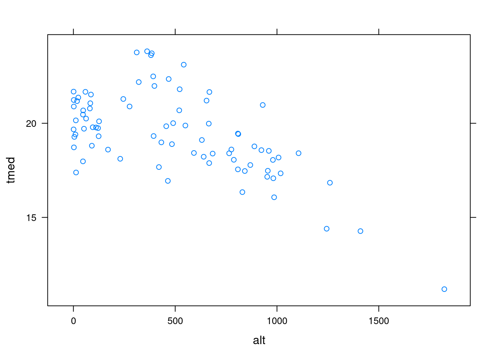

---
output:
  html_document: default
  pdf_document: default
---


# Visualização de dados {#data-vis}


> \"Uma imagem vale mais que mil palavras\"

é uma expressão popular atribuída ao filósofo chinês [Confúcio](https://en.wikipedia.org/wiki/Confucius) utilizada para transmitir a idéia do poder da comunicação através das imagens.

Gráficos são uma forma efetiva de representar visualmente seus dados. Eles servem para ressaltar padrões nos dados, frequentemente levam a novas idéias e descobertas, além de fornecer evidências notáveis de quaisquer problemas com os dados. Uma apresentação visual também costuma ser o meio mais eficaz de comunicar informações, seja em infográficos, dashboards, aplicações *web* e visualizações interativas.

O  possui ferramentas muito poderosas para visualização de dados. Provavelmente o  tem mais ferramentas do que você realmente precisa. Existem vários sistemas gráficos para visualizar dados no  e  geralmente eles são incompatíveis entre si. Portanto, você não pode combinar facilmente as gráficos de diferentes sistemas.


Neste capítulo, abordamos como fazer gráficos no `R`. É impossível cobrir todas as funcionalidades gráficas disponíveis no , confira a [Galeria de Gráficos do R](https://www.r-graph-gallery.com/) para você ter uma noção. Aqui vou me concentrar em algumas abordagens. Primeiro, a estrutura gráfica básica que vem com o próprio . Não é algo que eu uso frequentemente ou recomendo, mas é o padrão em muitos pacotes. Então, você precisa ter uma base sobre isso. Em segundo lugar, discutimos a estrutura **ggplot2**, que baseia-se na [gramática de gráficos](http://amzn.to/2ef1eWp). Ela é minha abordagem preferida para visualizar dados. Ela define uma pequena linguagem de domínio específico para construir gráficos e é perfeita para explorar dados aramzenados em quadro de dados. Com um pouco mais de trabalho, você consegue customizar seus gráficos e deixá-los prontos para publicação.

A visualização de dados espaciais também é contemplada no R por vários pacotes específicos. Os links a seguir permitem ter uma idéia das funcionalidades disponíveis:

- https://cran.r-project.org/web/views/Spatial.html;

- https://bhaskarvk.github.io/user2017.geodataviz/;

- http://spatial.ly/r/;

- https://data.cdrc.ac.uk/tutorial/an-introduction-to-spatial-data-analysis-and-visualisation-in-r;


A visualização interativa de dados também é possível e há vários pacotes. Um dos mais interessantes é o **`{plotly}`** que permite a criação de gráficos interativos a partir de gráficos do **`{ggplot2}`**. Dê uma conferida na galeria de gráfico do [plotly-R](https://plot.ly/r/).

A visualização interativa faz mais sentido quando usada para aplicações Web. Para este fim os seguintes pacotes podem ser úteis:

- [plotly](https://plot.ly/r/)

- [highcharter](http://jkunst.com/highcharter/)

- [googleVis](https://cran.r-project.org/web/packages/googleVis/vignettes/googleVis_examples.html)

- [rCharts](https://ramnathv.github.io/rCharts/)

- [leaflet](https://rstudio.github.io/leaflet/)

- [iplots](http://rosuda.org/software/iPlots/)

- [rgl](https://cran.r-project.org/web/packages/rgl/vignettes/rgl.html)

- [animation](https://yihui.name/animation/)


<!-- 
Citando @Tufte2001. 
-->


## Pré-requisitos

### Pacotes 

O pacote **ggplot2** faz parte do **tidyverse**, mas além dele precisaremos de outros pacotes com funcionalidades que complementam o **ggplot2**.


```r
pacotes <- c(
  "openair",
  "lubridate",
  "scales",
  "rio",
  "tidyverse",
  "ggrepel",
  "ggthemes",
  "viridis",
  "ggpubr",
  "ggmap",
  "psych",
  "grid",
  "lattice",
  "gcookbook"
)
easypackages::libraries(pacotes)
```


### Dados 


  + dados simulados de uma oscilação com amplitude variável
  

```r
x1 <- seq(
  from = -100,
  to = 100,
  by = 0.05
)
A <- seq(
  from = -1,
  to = 1,
  length.out = length(x1)
) %>%
  sin(x = .)
y1 <- exp(-0.07 * A * x1) * cos(x1 + pi / 2)
dados <- tibble(x1, y1)
dados
#> # A tibble: 4,001 x 2
#>        x1       y1
#>     <dbl>    <dbl>
#>  1 -100   -0.00140
#>  2 -100.  -0.00153
#>  3  -99.9 -0.00165
#>  4  -99.8 -0.00177
#>  5  -99.8 -0.00188
#>  6  -99.8 -0.00199
#>  7  -99.7 -0.00210
#>  8  -99.6 -0.00221
#>  9  -99.6 -0.00231
#> 10  -99.6 -0.00240
#> # … with 3,991 more rows
```

  + Dados de qualidade do ar em NY


```r
#help(airquality)
head(airquality)
# conversão da Temp de Farenheith para Celsius
aq <- airquality %>%
  mutate(Temp = (Temp - 32)/5,
        # adicionando coluna date criada das colunas Day e Month
        # o ano das medidas é 1973, conforme help
         date = as.Date(
           paste(Day, Month, "1973"),
           format = "%d %m %Y")
         ) %>%
  # removendo as colunas Month e Day e reordenando as colunas
  dplyr::select(., date, Ozone:Temp, -c(Month, Day))
head(aq)
```

  + Séries de dados aleatórios acumulados (**random walk**)


```r
# matriz de dados para 5 plots
# semente para reprodutibilidade
set.seed(12)
# laço para gerar uma matriz de 5 colunas
# com números aleatórios acumulados 
mat <- sapply(1:5, function(i) cumsum(rnorm(100)))
head(as.data.frame(mat))
```

  + Precipitação climatológica mensal das estações climatológicas do [INMET](http://www.inmet.gov.br/portal/index.php?r=clima/normaisClimatologicas) 


```r
# importando dados
prec <- import(
  "https://www.dropbox.com/s/9ym0845apcj38wq/PrecAccInmet_61_90.rds?dl=1", 
  format = "rds"
)
head(prec)
```

 + Dados de precipitação anual de algumas capitais do mundo


```r
## dados rain
rain <- import(
  file = "https://www.dropbox.com/s/z873gcyjouegspk/cityrain.csv?dl=1", 
  format = "csv", 
  header = TRUE
)
head(rain)
```

  + anomalias de temperatura do ar global Global de 1800 a 2011


```r
data(climate, package = "gcookbook")
#help(climate,package = "gcookbook")
head(climate)
```

-  Metadados das estações meteorológicas automáticas (EMA) do INMET;


```r
# dados de estações com localização, alt e tmed
sulbr_md <- import(
  "https://www.dropbox.com/s/3ddxq5v5a8i7dnw/info_sumary_tair_sul.rds?dl=1", 
  format = "rds"
)
sulbr_md
```


- dados meteorológicos horários das EMAs


```r
# dados com séries temporais
sulbr_dh <- import("https://www.dropbox.com/s/iesn64ij633rofp/data_inmet_sul_RS.rds?dl=1",
  format = "rds"
) %>%
  #filter(year(date) >= 2008, year(date) <= 2015) %>%
  select(site:tair, rh, prec, rg, wd, ws, wsmax) %>% as_tibble()
```


```r
glimpse(sulbr_dh)
#range(sulbr_dh$date)
```

Vamos obter a média da `tair` para cada dia do ano na EMA de POA.


```r
tair_poa_dly <- sulbr_dh %>%
  filter(site == "A801") %>%
  select(site:tair) %>%
  group_by(date = as.Date(date)) %>%
  summarise(tair = mean(tair, na.rm = TRUE)) %>%
  mutate(tair = ifelse(is.nan(tair), NA, tair))
glimpse((tair_poa_dly)
```


```r
tair_poa_clim <- tair_poa_dly %>%
  group_by(doy = lubridate::yday(date)) %>%
  summarise(med = mean(tair, na.rm = TRUE),
            max = max(tair, na.rm = TRUE),
            min = max(tair, na.rm = TRUE),
            q5 = quantile(tair, p = 0.05, na.rm = TRUE),
            q95 = quantile(tair, p = 0.95, na.rm = TRUE),
            n_anos = n(),
            n_obs = sum(!is.na(tair))
            ) %>% 
  ungroup()
tair_poa_clim
```


  
## Sistemas Gráficos 

O  possui uma poderosa [plataforma de ferramentas gráficas](http://cran.r-project.org/web/views/Graphics.html) para análise e visualização de dados. Os sistemas gráficos são: 

+ **sistema básico** (nativo do R)
    
   - 'modelo pintor', se errou, pega uma nova tela e começa tudo de novo;
   
   - a principal função é a `plot()`; 

+ **[sistema de grade](https://www.stat.auckland.ac.nz/~paul/grid/grid.html)**
   
   - conjunto de funções gráficas mais flexíveis para o *layout* de gráficos, como a criação de múltiplas regiões (*viewports*) em uma mesma página;
   
   - requer especificações detalhadas de onde plotar os pontos, linhas, retângulos e consequentemente um gráfico é elaborado a partir de várias linhas de código. 
    
## Pacotes Gráficos 

### graphics

O sistema básico de gráficos do  está implementado no pacote **`{graphics}`**. Ele é carregado quando iniciamos o R. Veja a saída da função `sessionInfo()` para verificar nas informações de sua sessão os pacotes carregados. 
Para ver exemplos de gráficos báscos digite `demo("graphics")` e `library(help = "graphics")` para listar as funções disponíveis no **`{graphics}`**.


```r
# lista de funções do pacote graphics
library(help = "graphics")
# exemplos de gráficos
demo("graphics")
```

Um exemplo simples de uso da função `graphics::plot()` é mostrado abaixo:


```r
with(
  dados,
  plot(x = x1, y = y1)
)
```

Para ilustrar os diferentes sistemas gráficos disponíveis no , vamos mostrar como gerar este mesmo gráfico usando o sistema **`{grid}`**, **`{lattice}`** e **`{ggplot2}`**.

### grid

  O sistema **{grid}** também faz parte da distribuição básica do , mas o pacote precisa ser carregado (`library(grid)`)

    

```r
## exemplo grid
library(grid)
## define tamanho da região para plot (viewport)
pushViewport(plotViewport(c(5, 4, 2, 2)))
## define intervalos de variação das escalas x e y
pushViewport(dataViewport(
  xData = dados$x1,
  yData = dados$y1,
  name = "plotRegion"
))
## retângulo em torno da região do plot
grid.rect()
## eixos x e y
grid.xaxis()
grid.yaxis()
## labels dos eixos x e y
grid.text("x1", y = unit(-3, "lines"))
grid.text("y1", x = unit(-3, "lines"), rot = 90)
## símbolos dos dados
grid.points(
  x = dados$x1,
  y = dados$y1,
  name = "dataSymbols"
)
```



    
### [lattice](http://lattice.r-forge.r-project.org/)

É baseado no sistema *grid* e os gráficos são armazenados como variáveis (objetos que podem ser salvos). Isto possibilita plotar, fazer alterações e atualizações no objeto.
    
Um grande atrativo do **{`lattice`}** são os gráficos multipainel para análise de dados multivariados.
    


```r
# exemplo lattice
library(lattice)
# interface usando fórmula
 xyplot(y1 ~ x1, data = dados)
```


### [ggplot2](http://ggplot2.org/)

Assim como lattice também foi construído baseado no sistema *grid*. É um sistema poderoso de gráficos que torna mais fácil a produção de gráficos complexos com multicamadas. Usa os aspectos bons de ambos sistemas **base** e **lattice**. O principal fator da popularidade do **`{ggplot2}`** é o seu modelo mental mais claro e ser altamente customizável, apesar de um processamento mais lento.


```r
## exemplo ggplot2
library(ggplot2)
 qplot(x = x1, y = y1, data = dados)
```


### Terminologia: funções de alto e baixo nível

- Funções de alto nível produzem um gráfico completo.


```r
# exemplo função gráfica de alto nível
plot(x1, y1, las = 1)
```

- Funções de baixo nível adicionam saídas a um plot existente, logo vão sobrepor o que estiver na tela gráfica. 


```r
# exemplo função gráfica de alto nível
plot(x1, y1, las = 1)
# exemplo funções gráficas de baixo nível
points(x1, y1,                    # adiciona pontos com cor e símbolo
       col = 2,                   # cor do ponto
       pch = 20,                  # tipo (círculo preenchido)
       cex = 0.8)                 # tamanho relativo do símbolo (default =1) 
grid()                            # adiciona linhas de grade
abline(h = 0,col = "gray")        # linhade referência (y = 0)
title(main = "Grafico a partir de funçoes de baixo nível")      # adiciona título ao gráfico
box(lwd = 2)                      # adiciona retângulo em torna da região do gráfico, com linha mais larga
```

Ambos sistemas *base* e *grid* fornecem funções gráficas de baixo nível. O sistema *grid* também oferece funções para interação com os gráficos de saída (como a edição, extração, remoção de partes de uma imagem).
A Maioria das funções em pacotes gráficos produz gráficos completos e geralmente oferecem gráficos específicos para um tipo de análise ou campo de estudo.
  
Nesta aula será dado foco a produção de gráficos usando o **sistema *base*** do .

## Funções gráficas básicas

### Função `plot()` 

#### Gráficos de diferentes dados de entrada

A função `plot()` é o carro chefe do sistema base do . Quando especificamos apenas uma variável de entrada é plotado a variável no eixo y em função de seu tamanho `1:length(x)` no eixo x.


```r
plot(y1)
```

Gerando um gráfico especificando os parâmetros x e y. 


```r
plot(x = x1, y = y1)
```

Também podemos especificar no primeiro argumento da `plot()` uma fórmula, p.ex.: `y1 ~ x1` que pode ser interpretada como y1 (variável) em função x1.


```r
plot(y1 ~ x1)
```

Aplicando a `plot()` a um *quadro de dados* com duas variáveis resulta um gráfico equivalente ao caso anterior.


```r
plot(dados)
```

#### Gráficos de dispersão

Aplicando a `plot()` a um quadro de dados com mais de duas variáveis resulta um gráfico de dispersão entre todas as variáveis do *quadro de dados*.


```r
## plot de todas colunas de aq, exceto a 1a coluna
plot(aq[, -1])
```

Cada gráfico desses é chamado de gráfico de dispersão. Através dele pode-se visualizar a relação entre duas variáveis. Nesse caso o gráfico resultante é uma matriz de gráficos de dispersão.

Existe uma função gráfica específica para produção deste tipo de gráfico: a função `pairs()`. 


```r
# plote de pares
pairs(aq[, -1])  # exclui coluna date
```

A função `pairs.panels()` do pacote `psych` fornece um gráfico de pares bastante informativo e foi expandida a partir da função `pairs()`.


```r
pairs.panels(x = aq[, -1])
```

Para fechar as janelas gráficas abertas:


```r
graphics.off()
```


## Parâmetros gráficos

Podemos personalisar muitas características de um gráfico (cores, eixos, títulos) através de opções chamadas **parametros gráficos**.

As opções são especificadas através da função `par()`. Os parâmetros assim definidos terão efeito até o fim da sessão ou até que eles sejam mudados.

Digitando `par()` sem parâmetros produz uma lista das configurações gráficas atuais. Adicionando o parâmetro `no.readonly = TRUE` produz uma lista das configurações atuais que podem ser modificadas posteriormente.


```r
str(par())
# cópia das configurações atuais
old_par <- par(no.readonly = TRUE)
# tipo de linha pontilhada, largura da linha, símbolo para plot (triângulo sólido)
par(lty = 3, pch = 17)
with(
  aq,
  plot(
    x = date,
    y = Wind,
    type = "b"
  )
) # linha e ponto desconectados
# restabelecendo parâmetros originais
par(old_par)
```

Podemos definir `par()` quantas vezes forem necessárias.
  
A segunda forma de especificar parâmetros é `nome_opção = valor` diretamente na função gráfica de alto nível.
  
Mas nesse caso, as opções terão efeito (local) apenas para aquele gráfico específico , portanto diferindo da primeira forma em que a definição pode ser para toda sessão (global).
  
Poderíamos gerar o mesmo gráfico anterior  da seguinte forma:


```r
with(
  aq,
  plot(
    x = date,
    y = Wind,
    type = "b",
    lty = 3,
    pch = 17
  )
)
```

Nem todas funções de alto nível permitem especificar todos parâmetros gráficos. Veja  o `help(plot)` para determinar quais parâmetros gráficos podem configurados dessa forma.


```r
?plot
```

A seguir veremos alguns importantes parâmetros gráficos que podemos configurar.

### Símbolos e linhas

Vimos que podemos especificar símbolos e linhas nos gráficos. Os parâmetros relevantes para essas opções são mostradas na tabela a seguir.

| Parâmetro | Descrição                                                                                                                                       |
|-----------|-------------------------------------------------------------------------------------------------------------------------------------------------|
| **pch**       | define o símbolo a ser usado para pontos                                                                                                        |
| **cex**       | tamanho do símbolo, cex é um nº indicando a quantidade pela qual símbolos devem ser relativos, Default = 1, 1.5 é 50 % maior, 0.5 é 50 % menor. |
| **lty**       | tipo de linha                                                                                                                                   |
| **lwd**       | largura da linha, expresso em relação ao default (=1), então lwd = 2 gera uma linha com o dobro de largura da linha default.                    |


```r
# plot(c(-1, 26), 0:1, type = "n", axes = FALSE, xlab = "", ylab = "")
# text(0:25, 0.6, c(0:25), cex = 1)
# points(0:25, rep(0.4, 26), pch = 0:25, bg = "grey")
# mtext(text = "pch = ", side = 1, line = -14.5, cex = 2)
# mtext(text = "símbolo", side = 1, line = -10.5, cex = 2)
pchShow <-
  function(extras = c("*", ".", "o", "O", "0", "+", "-", "|", "%", "#"),
           cex = 3, ## good for both .Device=="postscript" and "x11"
           col = "red3", bg = "gold", coltext = "brown", cextext = 1.2,
           main = paste(
             "Símbolos:  points(..., pch = *, cex =",
             cex, ")"
           )) {
    nex <- length(extras)
    np <- 26 + nex
    ipch <- 0:(np - 1)
    k <- floor(sqrt(np))
    dd <- c(-1, 1) / 2
    rx <- dd + range(ix <- ipch %/% k)
    ry <- dd + range(iy <- 3 + (k - 1) - ipch %% k)
    pch <- as.list(ipch) # list with integers & strings
    if (nex > 0) pch[26 + 1:nex] <- as.list(extras)
    plot(rx, ry, type = "n", axes = FALSE, xlab = "", ylab = "", main = main)
    abline(v = ix, h = iy, col = "lightgray", lty = "dotted")
    for (i in 1:np) {
      pc <- pch[[i]]
      ## 'col' symbols with a 'bg'-colored interior (where available) :
      points(ix[i], iy[i], pch = pc, col = col, bg = bg, cex = cex)
      if (cextext > 0) {
        text(ix[i] - 0.3, iy[i], pc, col = coltext, cex = cextext)
      }
    }
  }
pchShow()
```

As opções de tipo de linha são mostradas abaixo.


```r
# linhas
op <- par(lwd = 3,
          cex = 1.5,
          cex.axis = 1, 
          cex.lab = 1, 
          font = 2, 
          font.axis = 2, 
          font.lab = 2)
plot(
  x = c(0, 10),
  y = c(1, 6),
  type = "n",
  xlab = "",
  ylab = "",
  main = "Amostra de tipo de linhas",
  axes = FALSE,
  frame.plot = FALSE
)
axis(
  side = 2,
  lwd = 3,
  at = seq(1, 6, by = 1),
  cex = 1.25,
  font = 2,
  col = "white"
)
mtext(
  "Nº do tipo de linha (lty = )",
  side = 2,
  line = 2,
  cex = 1.5,
  font = 2
)
abline(h = 1:6, lty = 1:6)
par(op)
```

Exemplo com as opções.


```r
with(
  aq,
  plot(
    x = date,
    y = Temp,
    type = "b",
    lty = 3,
    pch = 15,
    cex = 2
  )
)
```


### Cores

Há diversos parâmetros relacionados a cores no . A tabela abaixo mostra os mais comuns.

| Parâmetro | Descrição                                                                                                  |
|-----------|------------------------------------------------------------------------------------------------------------|
| `col`       | cor default do gráfico. Algumas funções como `lines()` e `pie()` aceitam um vetor de cores que são recicladas |
| `col.axis`  | cor do texto (título) nos eixos                                                                            |
| `col.lab`   | cor dos rótulos dos eixos                                                                                     |
| `col.main`  | cor do texto do título do gráfico                                                                          |
| `col.sub`  | cor do sub-título                                                                                          |
| `fg`        | cor do primeiro plano                                                                                      |
| `bg`       | cor do plano de fundo                                                                                      |


Podemos especificar as cores no  por índice, nome, hexadecimal, RGB ou HSV. Por exemplo `col = 0`, `col = "white"`, `col =FFFFF`, `col = rgb(1,1,1)` e `col = hsv(1,1,1)` são formas equivalentes de especificar a cor branca.

A função `colors()` retorna o nome de todas as cores disponíveis.


```r
colors()[1:20]
n <- length(colors())
op <- par(bg = "gray60")
plot(
  dados$x1[1:n], dados$y1[1:n],
  type = "n",
  xlab = "x",
  ylab = "y",
  main = "Várias cores",
  sub = "Onda colorida",
  col.axis = "green",
  col.lab = "green",
  col.axis = "yellow",
  col.sub = "red"
)
usr <- par("usr")
rect(usr[1], usr[3], usr[2], usr[4], col = "snow", border = "black", lwd = 2)
points(
  dados$x1[1:n], dados$y1[1:n],
  col = colors()[1:n],
  pch = 20,
  cex = (1:n) / 60 * 4
)
par(op)
```

Para visualizar as cores e os nomes associados a cada uma veja [http://www.stat.columbia.edu/~tzheng/files/Rcolor.pdf](http://www.stat.columbia.edu/~tzheng/files/Rcolor.pdf).

O  também possui diversas funções para criar vetores de cores contínuas (paletas):


```r

paletas <- list(
  rainbow(n),
  heat.colors(n),
  terrain.colors(n),
  topo.colors(n),
  cm.colors(n)
)
for (ipal in seq_along(paletas)) {
  plot(
    x = dados$x1[1:n],
    y = dados$y1[1:n],
    type = "p",
    xlab = "x",
    ylab = "y",
    main = "Várias cores",
    sub = "Onda colorida",
    col = paletas[[ipal]], # função para paleta arco-íris
    pch = 20,
    cex = (1:n) / 60 * 4
  )
}

```

### Características de texto

Parâmetros especificando tamanho do texto.

| Parâmetro | Descrição                                                                                            |
|-----------|------------------------------------------------------------------------------------------------------|
| cex       | nº indicando a quantidade pela qual o texto plotado deve ser escalonado em relação ao default (=1).  |
| cex.axis  | magnificação do texto dos eixos (títulos).                                                           |
| cex.lab   | magnificação dos rótulos em relação ao cex.                                                          |
| cex.main  | magnificação dos títulos em relação ao cex.                                                          |
| cex.sub   | cor do sub-título                                                                                    |

Parâmetros especificando família, tamanho e estilo da fonte.

| Parâmetro | Descrição                                                                                                                   |
|-----------|-----------------------------------------------------------------------------------------------------------------------------|
| font      | inteiro especificando a fonte a ser usada. 1 = normal, 2 = negrito, 3 = itálico, 4 = negrito e itálico, 5 = símbolo (adobe) |
| font.axis | fonte para o texto do eixo                                                                                                  |
| font.lab  | fonte para o rótulo do eixo                                                                                                 |
| font.main | fonte para o título                                                                                                         |
| font.sub  | fonte para o sub-título                                                                                                     |
| ps        | tamanho do ponto da fonte (ps = 1/72 *cex)                                                                                  |
| family    |                                                                                                                             |


```r
op <- par(font.lab = 3, cex.lab = 2, font.main = 4, cex.main = 2)
plot(dados$x1[1:n], dados$y1[1:n], 
     type = "p",
     xlab = "x",
     ylab = "y",
     main = "Várias cores",
     sub = "Onda colorida",
     col = gray.colors(n), 
     pch = 20, 
     cex = (1:n)/60 * 4)
par(op)
```

#### Tipos de Gráficos 

Até aqui já vimos como criar gráficos de dispersão com a função `plot()`. Mas existe uma ampla variedade de gráficos, além daqueles: *boxplots*, histogramas, gráficos de barra, gráficos de pizza, gráficos de imagens, gráficos 3D. Alguns exemplos são mostrados a seguir.


```r
# gráfico de barras
barplot(
  height = BOD$demand,
  names.arg = BOD$Time,
  col = 1
)
# gráfico de uma tabela de contagem
barplot(height = table(mtcars$cyl))
# histograma
hist(x = mtcars$mpg)
# Especificando o número aproximado de classes com parâmetro breaks
hist(x = mtcars$mpg, breaks = 10)
# boxplots
# boxplot de todas colunas
boxplot(aq[, -1])
# usando formula
boxplot(Temp ~ Month, data = airquality)
# Curvas
curve(x ^ 3 - 5 * x, from = -4, to = 4)
# plot de uma função criada
minhafun <- function(xvar) {
  1 / (1 + exp(-xvar + 10))
}
curve(minhafun(x), from = 0, to = 20)
# Add a line:
curve(1 - minhafun(x), add = TRUE, col = "red")
# Imagem
dim(volcano)
x <- 10 * (1:nrow(volcano))
y <- 10 * (1:ncol(volcano))
image(
  x,
  y,
  volcano,
  col = terrain.colors(100),
  axes = FALSE
)
contour(
  x,
  y,
  volcano,
  levels = seq(90, 200, by = 5),
  add = TRUE,
  col = "peru"
)
axis(1, at = seq(100, 800, by = 100))
axis(2, at = seq(100, 600, by = 100))
box()
title(
  main = "Maunga Whau Volcano",
  font.main = 4
)
```


#### Telas gráficas 


Para gerar gráficos vamos primeiro abrir uma tela gráfica, plotar os dados e então fechar a tela gráfica.


```r
# abre uma tela gráfica fora do ambiente do RStudio
x11()  
 # plot de uma variável
 plot(y1)
 # fechando tela gráfica
dev.off()
```


```r
plot(y1)
```


Vamos gerar 5 gráficos e apága-los de uma vez só.


```r
# plotando cada coluna da matriz mat em uma nova tela gráfica
sapply(
  1:ncol(mat),
  FUN = function(i) {
    x11() # abrindo tela gráfica para plot
    # plot da variável de cada coluna da matriz
    plot(
      mat[, i],
      type = "l",
      col = 4,
      main = paste("Gráfico", i)
    )
    abline(h = 0) # linha de referência em x = 0
    return(i)
  }
) # fim do apply
```


Para apagar todas as telas gráficas abertas de uma vez só usa-se a função `graphics.off()`.


```r
graphics.off()
```


#### Salvando gráficos

O  pode exportar um gráfico para diferentes saídas gráficas (*png, pdf, ps, jpeg* e etc). Uma lista completa das opções disponíveis está disponível em `?device`.


```r
plot(y1)
```

Vamos usar o exemplo da matriz `mat` para salvar os gráficos das variáveis em cada coluna em um único arquivo **pdf**.


```r
## fechando qualquer tela gráfica aberta
graphics.off()
## abrindo saída gráfica
pdf(
  file = file.path(tempdir(), "5plots1file.pdf"),
  onefile = TRUE,
  width = 7,
  height = 4
)
## looping em cada coluna da matriz mat
sapply(
  1:ncol(mat),
  ##  Função para plot da variável na coluna i
  FUN = function(i) {
    ## mostra tela o índice do looping em execução
    cat(i, "\n")
    ## plot da variável de cada coluna da matriz
    plot(
      mat[, i],
      type = "l",
      col = 4,
      main = paste("Gráfico", i)
    )
    abline(h = 0) ## linha de referência em x = 0
    return(i)
  }
) ## fim do apply
## fechando pdf
dev.off()
```

Para salvar cada gráfico em um arquivo a chamada da função `grDevices::pdf()` deve ser feita antes de cada gráfico. 


```r
## fechando qualquer tela gráfica aberta
graphics.off()
## looping em cada coluna da matriz mat
sapply(
  1:ncol(mat),
  ##  Função para plot da variável na coluna i
  FUN = function(i) {
    ## mostra tela o índice do looping em execução
    cat(i, "\n")
    ## criando nome do arquivo
    arquivo <- file.path(tempdir(),paste("plot", i, "file", i, ".pdf", sep = ""))
    ## abrindo saída gráfica
    pdf(file = arquivo, onefile = TRUE, width = 7, height = 4)
    # plot da variável de cada coluna da matriz
    plot(mat[, i], 
         type = "l", 
         col = 4, 
         main = paste("Gráfico", i))
    # linha de referência em x = 0
    abline(h = 0)
    ## fechando pdf
    dev.off()
    return(i)
  }
) # fim do looping
```


### Plotando vários gráficos em uma mesma página


```r
par(mfrow = c(2, 3))
plot(x = aq$date, 
     y = aq$Ozone,
     type = "o") # linha e ponto conectados
plot(x = aq$date, 
     y = aq$Temp, 
     type = "l") # linha
plot(x = aq$date, 
     y = aq$Wind,
     type = "b") # linha e ponto desconectados
plot(x = aq$date, 
     y = aq$Solar.R, 
     type = "h")
plot(x = aq$date, 
     y = (aq$Ozone) ^ 1 / 3, 
     type = "o") # linha e ponto
plot(1:10, 
     1:10, 
     type = "n", 
     frame = F, 
     axes = F, 
     xlab = "", 
     ylab = "")
text(5, 5, "Gráficos \n em uma \n página", cex = 3)
#par()
```

### Gráfico com 2 eixos


```r
plot(
  x = aq$date,
  y = aq$Ozone,
  type = "l",
  lwd = 2,
  ylab = "",
  xlab = "Data"
)
par(new = T)
plot(
  x = aq$date,
  y = aq$Temp,
  type = "l",
  col = 2,
  lwd = 2,
  axes = FALSE,
  ylab = "",
  xlab = ""
)
axis(
  side = 4,
  col = 2,
  col.axis = 2
)
mtext(
  text = "Ozônio",
  line = -2,
  adj = 0.2
)
mtext(
  text = "Temp",
  col = 2,
  line = -1,
  adj = 0.2
)
```


### Adicionando legenda


```r
plot(
  rain$Tokyo,
  type = "l",
  col = "red",
  ylim = c(0, 300),
  main = "Chuva mensal em grandes cidades",
  xlab = "Mês do ano",
  ylab = "Chuva (mm)",
  lwd = 2
)
lines(
  rain$NewYork,
  type = "l",
  col = "blue",
  lwd = 2
)
lines(
  rain$London,
  type = "l",
  col = "green",
  lwd = 2
)
lines(
  rain$Berlin,
  type = "l",
  col = "orange",
  lwd = 2
)
## legenda
legend(
  "topright",
  legend = c("Tokyo", "NewYork", "London", "Berlin"),
  col = c("red", "blue", "green", "orange"),
  lty = 1,
  lwd = 2,
  bty = "n"
)
```


## ggplot2

O ggplot2 é uma implementação para o  da **G**ramática de **G**ráficos [@Wilkinson2005] (GG). A GG estabelece princípios fundamentais para a construção de gráficos. Um gráfico consiste no mapeamento dos dados a partir de atributos estéticos (posição, cor, forma, tamanho) de objetos geométricos (pontos, linhas, barras, caixas). Os principais aspectos de um gráfico são os dados, o sistema de coordenadas, os rótulos e as anotações, os quais podem ser combinados em camadas para elaboração do gráfico. Esse é a idéia central do ggplot2.

<!--
 https://exts.ggplot2.tidyverse.org/ 
https://www.curso-r.com/material/ggplot/ 
-->


## Gráfico de dispersão


## Série temporal


## Histograma e colunas


## Imagem 2D


## Dados espaciais

### Mapas básicos

<!-- 
earthdatascience.org/courses/earth-analytics/lidar-raster-data-r/ggmap-basemap/ 
-->


