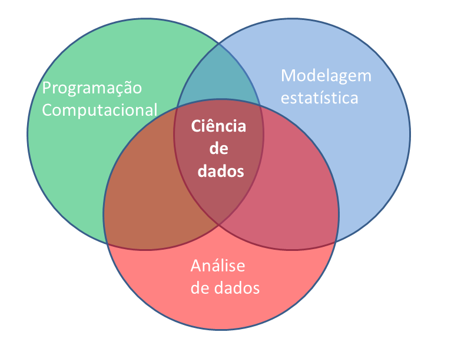

--- 
title: "Análise de Dados Ambientais com R"
author: "Jônatan Tatsch"
date: "2018-04-23"
site: bookdown::bookdown_site
output: bookdown::gitbook
documentclass: book
bibliography: [book.bib, packages.bib]
biblio-style: apalike
link-citations: yes
github-repo: lhmet/adar-ebook
description: "Livro baseado nas notas de aula da disciplina FSC1104 do curso de graduação em Meteorologia da UFSM."
---


# Apresentação {-} 


Este material é uma composição das notas de aula da disciplina
**Análise de Dados Ambientais com ** do curso de Graduação em [<span style="font-variant:small-caps;">meteorologia</span>](http://w3.ufsm.br/meteorologia/) oferecido no Departamento de Física da Universidade Federal de Santa Maria ([UFSM](http://site.ufsm.br/)). 

O livro é designado para quem não tem experiência em programação, ou qualquer um com interesse em aprender o  para manipular dados ambientais. O objetivo é prover uma material para ensinar os conceitos básicos de programação necessários para o processamento, a visualização e a análise de dados ambientais com o sistema computacional . Estes procedimentos são potencializados com o uso do software RStudio, uma interface de desenvolvimento integrado (IDE) para o .

Neste livro o leitor aprenderá a sintaxe básica da linguagem  [@R-base], a importação e exportação de dados, a criação de gráficos, funções, a padronização e organização de conjunto de dados ambientais; e finalmente, a confecção de relatórios dinâmicos e reproduzíveis.

O material do livro inclui o uso de dados ambientais de diferentes áreas (meteorologia, climatologia, hidrologia, sensoriamento remoto) em exemplos práticos e em exercícios, para estimular a prática da programação. 

O texto é intercalado com trechos de códigos que podem ser reproduzidos e os resultados visualizados no computador do leitor. 

Após a introdução ao  apresenta-se as capacidades específicas do  para manipulação de dados. Baseado na experiência do autor são empregados os pacotes mais adequados para cada finalidade, como **dplyr** e **tidyr** para o processamento de dados e o **ggplot2** para visualização de dados.

A intenção do livro é que após a leitura, o leitor tenha o conhecimento suficiente para desenvolver códigos que automatizem tarefas repetitivas, assim reduzindo o tempo gasto na etapa de preparação de dados. Esta programação mais efetiva permitirá focar mais na análise de dados e na comunicação dos resultados, seja ela na forma de documentos acadêmicos, ou relatórios técnicos em empresas públicas e privadas.

O texto está em formato [html](https://pt.wikipedia.org/wiki/HTML) para tirar o melhor proveito de recursos de multimídia, da capacidade de busca de texto e links para websites. 

O texto é organizado em 5 capítulos:

- \@ref(intro) Introdução

- \@ref(install) Instalação do  e Rstudio

- \@ref(iu) Interface do Usuário

- \@ref(rstudio) Rstudio

- \@ref(operbasic) Operações Básicas

- \@ref(datatype) Tipos de dados


<!--chapter:end:index.Rmd-->

# Introdução {#intro}


Breve intro.


## Análise de dados meteorológicos

> Processo pelo qual adquire-se conhecimento, compreensão e percepção dos fenômenos meteorológicos a partir de observações (dados) qualitativas e quantitativas.

</style>
<div class="midcenter" style="margin-left:50px; margin-top:50px;">

</div>


## Ciência de dados


</style>
<div class="midcenter" style="margin-left:50px; margin-top:50px;">

</div>


## Etapas para abordagem de um problema 


 1. **Questão científica/problema**
<br/>
 2. **Obtenção de dados:** coleta/medida do(as) estado/condições da atmosfera
    - Instrumentos e sensores
<br/>
 3. **Processamento de dados:**
    *download* ---> limpeza ---> formatação ---> <br/>
     transformação ---> controle de qualidade
       - ferramenta/software
         - <span style="color: red">conhecimento em programação</span>
 4. **Análise de dados**
    - ferramenta/software
      - <span style="color: red">conhecimento em programação</span>
 5. **Solução para o problema** 
    - Proposta de um modelo 
      - estatístico, empírico, ou fisicamente baseado
    - <span style="color: red">conhecimento em programação</span>
<br/> 
 6. **Apresentação/divulgação/publicação**


## Programação computacional


</style>
<div class="midcenter" style="margin-left:10px; margin-top:10px;">

</div>

</style>
<div class="midcenter" style="margin-left:10px; margin-top:0px;">

</div>

##  

* [R](https://www.r-project.org/) é o termo usado para se referir a linguagem de programação e ao software que interpreta os scripts escritos usando esta linguagem.

 

* Comunidade fantástica

  - [Contribuidores](https://www.r-project.org/contributors.html) (R-core Team)

  - milhares de pessoas usam o R diariamente e ajudam outras pessoas


* **Software Livre** (GPL), [Código aberto](https://github.com/wch/r-source) e multiplataforma
<br/> 
* Ambiente para Análise de dados interativa

## Por que o R?


* [R](https://www.r-project.org/) não é uma GUI (Interface gráfica do usuário) e isso é bom


    - há uma natural resistência e dificuldade ao uso de códigos e scripts
 

    - scripts favorecem a **automatização** e **reprodutibilidade**


    - força você a ter um conhecimneto mais aprofundado do que está fazendo


- [Reprodutibilidade](https://pt.wikipedia.org/wiki/Reprodutibilidade)

    - qualquer pessoa (inclusive você mesmo no futuro) pode obter os mesmos resultados do mesmo conjunto de dados

    - R é integrado com [outras ferramentas](https://cran.r-project.org/web/views/ReproducibleResearch.html) de que permitem atualizar seus resultados, figuras e análises automaticamente

   - [Relatório dinâmicos](https://rmarkdown.rstudio.com/articles_intro.html) e [interativos](http://shiny.rstudio.com/)

- Acesso ao estado da arte da ciência de dados (*Big Data*, *Data Mining*, *Machine Leraning*)

- é um software livre, de código fonte aberto e funciona em diversos sistemas operacionais (Linux, Windows e MacOS).

- Interface com Fortran, C, C++, Python

- [Visualização de dados](https://cran.r-project.org/web/views/Graphics.html)

   - R produz [gráficos de alta qualidade](https://timogrossenbacher.ch/2016/12/beautiful-thematic-maps-with-ggplot2-only/)


- R trabalha com dados de todas formas e tamanhos 


- Extensões para [Manipulação de dados](http://blog.rstudio.org/2014/07/22/introducing-tidyr/)
 


## Pacotes da comunidade do R

Evolução do nº de pacotes disponíveis no [CRAN](http://cran.r-project.org/mirrors.html)
</style>
<div class="midcenter" style="margin-left:10px; margin-top:10px;">

</div>


## Por que um meteorologista usaria o R?

A meteorologia é 4D: 

```r
meteorologia <- function(x, y, z, t){
  ...muita coisa para caber em um slide...
}
```

Logo, requer ferramentas específicas para:
 
* manipulação de dados espacias
 
* análise de séries temporais
 
* importação e ferramentas de [SIG](https://pt.wikipedia.org/wiki/Sistema_de_informa%C3%A7%C3%A3o_geogr%C3%A1fica)

* leitura de dados em formatos específicos ([netcdf](https://en.wikipedia.org/wiki/NetCDF), [binários](https://en.wikipedia.org/wiki/Binary_file), [grib2](https://en.wikipedia.org/wiki/GRIB), ...)


## R não é perfeito!

* Muitos códigos em R são escritos para resolver um problema;
    * foco nos resultados e não no processo
    * usuários não são programadores
    * códigos deselegantes, lentos e difíceis de entender
 
* Como o nosso idioma, há muitas exceções para serem lembradas
 
* R não é muito rápido e códigos mal escritos serão lentos
 
* São apenas ~20 anos de evolução
 
* Há muito o que melhorar


## Para saber mais sobre o R

[**Documentação oficial**](http://cran.r-project.org/manuals.html)
  - [Manuais do R traduzidos](https://cran.r-project.org/other-docs.html)


[**Lista de Livros relacionados ao R**](http://www.r-project.org/doc/bib/R-books.html)

- [Livros gratuitos](https://github.com/vhf/free-programming-books/blob/master/free-programming-books.md#r) (em inglês)


**Fóruns:** 

- lista Brasileira de discussão do programa R: [**R-br**](https://listas.inf.ufpr.br/cgi-bin/mailman/listinfo/r-br)

- [stackoverflow](http://stackoverflow.com/questions/tagged/r)
<br/>

<!--chapter:end:01-introducao.Rmd-->

# Instalação do R e RStudio {#install}


A interação do usuário com o  é por meio da linha de comando. Essa interação pode ser facilitada com o uso do software RStudio *Desktop*.

A seguir descreve-se como:

- instalar o  no Windows e no Linux Ubuntu

- manter o  sempre atualizado no Linux Ubuntu 

- configurar um diretório para armazenar os pacotes do R instalados

- instalar o Rstudio *Desktop*

Neste livro, o maior foco na instalação do  é dada para o SO Linux [Ubuntu](https://pt.wikipedia.org/wiki/Ubuntu), pelo fato de assim como o R, ser um software livre e de código aberto. Como o Linux Ubuntu é baseado no [Debian](https://pt.wikipedia.org/wiki/Debian) o procedimento de instalação também se estende a essa distribuição Linux e as [versões derivadas do Ubuntu](https://pt.wikipedia.org/wiki/Ubuntu#Projetos_derivados) que são oficialmente reconhecidas. 

A instalação no SO Windows é igual a instalação de qualquer outro *software* e pode ser facilmente encontrada na internet. Por esta razão, somente indicou-se o caminho de instalação, sem as instruções detalhadas de instalação para este SO.


\begin{rmdtip}
Ao instalar R e RStudio recomenda-se optar por instalar na língua
inglesa. Assim quando surgir uma mensagem de erro durante o uso do
software, basta usá-la numa pesquisa na internet para solucionar o
problema. As chances de resolver o problema serão muito maiores se sua
pesquisa for realizada em inglês.
\end{rmdtip}

## Instalando o 

O  pode ser instalado a partir dos [binários pré-compilados](https://cran.r-project.org/bin/) ou do [código fonte](https://cran.r-project.org/sources.html). Aqui, descreve-se a instalação do  a partir dos arquivos binários.


### Windows 

O binário executável do  para o Windows está disponível na **Rede Abrangente de Arquivos do ** ([CRAN](https://cran.r-project.org/)) e pode ser baixado [aqui](http://cran.r-project.org/bin/windows/base/). 

Abra o executável e siga instruções de instalação do R mantendo todas as opções padrões.

No Windows a instalação do  inclui uma Interface Gráfica do Usuário (GUI) acessível pelo executável `RGui.exe` (Figura \@ref(fig:r-gui)). Um atalho para esse executável é gerado por *default* na área de trabalho com o símbolo do .

\begin{figure}
\includegraphics[width=1\linewidth]{images/rgui-windows} \caption{Interface gráfica do usuário no R para Windows.}(\#fig:r-gui)
\end{figure}


#### Atualização do  no Windows

Novas versões do R são disponibilizadas em geral com frequência de 5 vezes por ano. Recomenda-se manter o R atualizado, pois as novas versões incluem [aperfeiçoamentos e a correção de *bugs*](https://cran.r-project.org/bin/windows/base/NEWS.R-3.4.4.html).


As novas versões do  vem com os [pacotes padrões do R](https://cran.r-project.org/doc/manuals/R-FAQ.html#Which-add_002don-packages-exist-for-R_003f). Os demais pacotes instalados pelo usuário na versão anterior precisam ser reinstalados na nova versão do .


Para atualizar o  no Windows, ao invés de baixar o executável a cada nova versão e repetir o processo da seção anterior, você pode utilizar o pacote [**installr**](https://cran.r-project.org/web/packages/installr/index.html). A instalação de pacotes no  será vista na seção \@ref(install-pck).

### Linux 

#### Ubuntu

Há várias formas de instalar o  no Ubuntu, mas geralmente a versão compilada no repositório *default* do Ubuntu não é a última. Se isso não for problema para você então basta executar:


```r
sudo apt-get install r-base
```

Entretanto, os pacotes do  recém lançados são compilados para última versão do . Então você pode ter restrições ao uso de pacotes novos, os quais geralmente incluem o estado da arte de análise de dados. Por esta razão, abaixo mostra-se como instalar o  de forma que seja atualizado automaticamente pelo sistema.

#### R sempre atualizado

Se você quer trabalhar sempre com a última versão estável do , é possível configurar o Linux Ubuntu para atualizar automaticamente o . O procedimento de instalação requer senha de superusuário do sistema ou de privilégios [sudo](https://en.wikipedia.org/wiki/Sudo). Caso não tenha, consulte o administrador do sistema.

Ao utilizar distribuições Linux Ubuntu é importante optar por versões estáveis[^1]. As versões de Suporte de longo prazo (LTS) mais recentes são:

- 14.04 (abril de 2014, *codename* `trusty`) 
- 16.04 (abril de 2016, *codename* `xenial`)

[^1]: Clique [aqui](http://releases.ubuntu.com) para saber mais sobre as versões do Ubuntu.

 
A versão mais atual é a R version 3.4.4 (2018-03-15). Para que ele seja atualizado automaticamente no Ubuntu você precisa adicionar o endereço do [repósitório do R](http://cran.r-project.org/mirrors.html) mais próximo de sua região à lista de repositórios do Linux. No exemplo deste livro, o repositório mais próximo é o da UFPR (<http://cran-r.c3sl.ufpr.br/>).

##### Incluindo repositório do  na Lista de repositórios do Ubuntu

A lista de repositórios do sistema é armazenada no arquivo `/etc/apt/sources.list`. Mas primeiro, você precisa descobrir ou verificar o nome da versão do sistema operacional. Para isso, você pode utilizar o seguinte comando[^2] :


```
$ lsb_release --codename | cut -f2
```
```
trusty
```


[^2]: Se o comando `lsb_release` não funcionar você precisa instalar o pacote `lsb-release` no sistema. Para isso, digite no terminal Linux `sudo apt-get install lsb-release`.

Precisamos incluir no arquivo `sources.list` o espelho do repositório do R mais próximo. Veja a lista de espelhos de repositórios do  [aqui](https://cran.r-project.org/mirrors.html). Assim o gerenciador de pacotes 
[apt](http://pt.wikipedia.org/wiki/Advanced_Packaging_Tool)[^3] fará a atualização do  quando uma nova versão estiver disponível. Ou seja, você estará utilizando sempre versão mais atual do .

[^3]: o gerenciador de pacotes [apt](http://pt.wikipedia.org/wiki/Advanced_Packaging_Tool) é usado para instalação, atualização e remoção de pacotes em distribuições Debian GNU/Linux.

O endereço do repositório da UFPR será inserido na última linha do arquivo `sources.list` usando alguns comandos linux. Essa tarefa requer privilégios de [superusuário](https://pt.wikipedia.org/wiki/Superusu%C3%A1rio). Vamos trocar do seu usuário para o superusuário.


    $ sudo su


Vamos definir no terminal uma variável com o endereço do repositório (da UFPR nesse caso) e o nome de versão do Ubuntu.

    # repos="deb http://cran-r.c3sl.ufpr.br/bin/linux/ubuntu `lsb_release --codename | cut -f2`/"
 
Note que a variável `repos` é uma sequência de caracteres com as seguintes informações:

    deb `linkRepositorioSelecionado`/bin/linux/ubuntu `versaoUbuntu`/

O valor da variável `repos` é mostrado pelo comando: `echo $repos`. Certifique-se de que a última palavra corresponde ao nome da sua versão Ubuntu. 

Para acrescentar essa informação no final do arquivo `sources.list` digite no terminal linux:

    # echo $repos >> /etc/apt/sources.list

Feito isso, você pode retornar a sessão de usuário comum, usando o comando abaixo:

    # exit

##### [APT protegido](https://cran.r-project.org/bin/linux/ubuntu/README.html#secure-apt) 

Os arquivos binários do  para Ubuntu na [CRAN](http://cran.r-project.org) são assinados com uma chave pública [^4] Para adicionar essa chave ao seu sistema digite os seguintes comandos:

    $ gpg --keyserver hkp://keyserver.ubuntu.com:80 --recv-keys E084DAB9

[^4]: Chave pública de autenticação é um meio alternativo de se logar em um servidor ao invés de digitar uma senha. É uma forma mais segura e flexível, mas mais difícil de ser configurada. Esse meio alternativo de fazer login é importante se o computador está visível na internet. Para saber mais veja [aqui](http://the.earth.li/~sgtatham/putty/0.55/htmldoc/Chapter8.html).
        
e então use essa informação como entrada no `apt-key` com

    $ gpg -a --export E084DAB9 | sudo apt-key add -
      
Se aparecer a mensagem de que a chave pública foi importada, então não há necessidade de executar os comandos abaixo. Mas caso seja impresso alguma mensagem de erro, outra alternativa pode ser usada para obter a chave, via os comandos:

    $ gpg --keyserver keyserver.ubuntu.com --recv-key E084DAB9
    $ gpg -a --export E084DAB9 | sudo apt-key add -


##### Atualização da lista de repositórios do Ubuntu e instalação do 

Após fazer as configurações da lista de repositórios e adicionar a chave é necessário fazer a atualização dessa lista (requer poderes de super usuário):

    $ sudo apt-get update
    
Agora, pode instalar o binário do R:

    $ sudo apt-get install r-base

##### Testando o 

Para iniciar o  no Ubuntu, digite `R` no cursor do terminal:

    $ R

A partir desse momento já começamos uma sessão no . Vamos gerar uma sequência numérica de 1 a 10 e plotá-la.


```r
> 1:10
 [1]  1  2  3  4  5  6  7  8  9 10
> plot(1:10)
```

\begin{figure}

{\centering \includegraphics{images/Chunck4-1} 

}

\caption{Gráfico da sequência de 10 números.}(\#fig:Chunck4)
\end{figure}

Você pode sair do , sem salvar os dados da seção, com o código a seguir:


```r
> q(save = "no")
```

#### Diretório para instalação de pacotes

Uma boa prática é definir um diretório para armazenamento dos pacotes utilizados. Isso lhe dá mais controle sobre os pacotes do  instalados no sistema. Um local sugerido é o `/home/usuario/.R/libs`. O seu `home` ou `pasta pessoal` pode ser obtido com o comando `echo $HOME`. Para criar o diretório você pode digitar o comando abaixo:

    $ mkdir -p `echo $HOME`/.R/libs/
    
Para informar ao  onde procurar os pacotes instalados, você precisa criar um arquivo chamado `.Renviron`, no diretório `$HOME`, contendo a expressão `R_LIBS=/home/usuario/.R/libs/`. Você pode fazer isso em um terminal com os comandos:

    $ R_LIBS=`echo $HOME/.R/libs/`
    $ echo $R_LIBS >> `echo $HOME/.Renviron`

Esse caminho fica então visível ao , o que pode ser verificado executando a função `.libPaths()` na linha de comando do . 

Abra o :

    $ R

e ao digitar:


```r
> .libPaths()
[1] "/home/pqgfapergs1/.R/libs"     "/usr/local/lib/R/site-library"
[3] "/usr/lib/R/site-library"       "/usr/lib/R/library"           
```
    
o seu diretório `/home/usuario/.R/libs` [^5] deve aparecer em primeiro lugar. Indicando que este local tem prioridade para instalação dos pacotes. Caso o diretório deixe de existir os seguintes diretórios serão usados.

[^5]: Diretórios precedidos por "." no Linux são diretórios ocultos. O diretório `/home/usuario/.R` é um diretório oculto, para visualizá-lo no Ubuntu, na interface gráfica do sistema, acesse *View > Show Hidden Files* (ou *Visualizar > Mostrar arquivos ocultos*). No terminal utilize `ls -a` para listar os arquivos ocultos.

## Pacotes do R {#install-pck}

### Da internet

#### CRAN

A forma mais fácil de instalar uma pacote do R é através da função `install.packages("nome_do_pacote")`.

Por *default* o pacote informado é instalado a partir da ([CRAN](https://cran.r-project.org/))

Por exemplo, para instalar o pacote **devtools**:


```r
install.packages("devtools")
```

A função automaticamente resolverá as dependências do pacote, de forma que qualquer pacote dependente também será instalado. 

Para ter acesso as funções disponibilizadas com o pacote você precisa carregar o pacote:


```r
library(devtools)
```


Para desinstalar um pacote você pode usar a função `remove.packages("nome_do_pacote")`.

#### GitHub e R-forge

Nem todos pacotes são disponíveis na CRAN. Muitos desenvolvedores disponibilizam seus pacotes em plataormas como o [GitHub](https://github.com/) e [R-forge](https://r-forge.r-project.org/). As vezes um pacote pode  estar em ambos CRAN e GitHub (ou R-forge), mas a última versão - a de desenvolvimento - é somente disponibilizada no GitHub (ou R-forge). 

Para instalar um pacote de um repositório do GitHub usa-se a função `install_github()` do pacote **devtools**. Portanto, o pacote **devtools** precisa ser instalado primeiro. 

Antes de instalar o pacote **devtools**, usuários Windows precisam instalar o programa [Rtools](https://cran.r-project.org/bin/windows/Rtools/index.html). 

A função para instalar um pacote do GitHub requer como argumento o nome do usuário e do repositório. Por exemplo, para instalar o pacote `inmetr` do repositório mantido pelo autor deste livro, usa-se:


```r
# install.packages("devtools")
# carrega o pacote devtools
library(devtools)
# instala o pacote inmetr do repositório 
# https://github.com/lhmet/inmetr 
install_github("lhmet/inmetr")
```

Para um repositório do R-forge, por exemplo o repositório do pacote [raster](https://r-forge.r-project.org/projects/raster/), usa-se:


```r
install.packages("raster", repos = "http://R-Forge.R-project.org")
```


#### Arquivo fonte local

Códigos fonte de pacotes do R são armazenados como arquivos com a extensão `.tar.gz`. Binários compilados são armazenados com a extensão `.zip`. Exemplo de arquivos como estes podem ser baixados manualmente da CRAN (veja a seção Downloads em https://cran.r-project.org/web/packages/ggplot2/index.html), GitHub ou R-forge.

Eventualmente um usuário pode instalar um pacote a partir desses arquivos localmente. Isto pode também ser feito  com a função `install.packages()`, especifincando o argumento `repos = NULL` e o argumento `pkgs` com o caminho do arquivo. Por exemplo:


```r
install.packages("ggplot2_2.1.0.tar.gz", repos=NULL)
```


## RStudio no Ubuntu {#install-rstudio}

 é uma empresa que desenvolve ferramentas gratuitas para o  e [produtos pagos](https://www.rstudio.com/products/) para empresas.

Uma de suas ferramentas gratuitas é o software RStudio *Desktop* que consiste em um ambiente integrado de desenvolvimento ([IDE](http://en.wikipedia.org/wiki/Integrated_development_environment)) construído especificamente para o , consequentemente, também é multiplataforma.

Para instalação da versão do RStudio para *[Desktop](https://pt.wikipedia.org/wiki/Ambiente_de_desktop)*, você precisa saber se seu SO é 64 ou 32-bit e a versão do Linux Ubuntu. Essas informações podem ser obtidas, respectivamente, pelos comandos:

    $ arch

```
x86_64
```
Se retornar **x86_64** sua máquina é 64-bit.

    $ lsb_release --release | cut -f2

```
14.04
```

Com essas informações, siga os seguintes passos:

  1. acesse [RStudio](https://www.rstudio.com/products/rstudio/download/)
  2. clique em *Download* (Figura \@ref(fig:rstudio-choose))


\begin{figure}

{\centering \includegraphics[width=1\linewidth]{images/rstudio-choose} 

}

\caption{Opção para baixar o RStudio *Desktop*.}(\#fig:rstudio-choose)
\end{figure}

  3. Clique na sua plataforma (de acordo com seu SO, arquitetura e versão da distribuição) (Figura \@ref(fig:rstudio-plat)), no exemplo deste livro *RStudio 1.1.447 - Ubuntu 12.04-15.10/Debian 8 (64-bit)*
  
\begin{figure}

{\centering \includegraphics[width=1\linewidth]{images/rstudio-plataform-options} 

}

\caption{Escolha da plataforma em que será o usada o RStudio *Desktop*.}(\#fig:rstudio-plat)
\end{figure}
  

  4. Dependendo da sua versão Ubuntu, ao clicar sobre o sobre o arquivo baixado com o botão direito, há a opção de abrir com *Ubuntu Software Center* e então clicar em `instalar`. Se na versão de seu *Desktop* não há esta opção ao clicar com botão direito sobre o arquivo, instale via **terminal**[^6] com os seguintes comandos:


[^6]: digite 'Ctrl+Alt+t' para abrir um terminal no Linux Ubuntu

```
$ cd /local/do/arquivo/baixado
$ sudo dpkg -i arquivoBaixado.deb
$ sudo apt-get install -f
```


Abra o RStudio digitando no terminal:

    $ rstudio &
    
Agora você está pronto para começar a programar em  aproveitando as facilidades que o [RStudio](http://www.rstudio.com/) oferece. 


<!--chapter:end:02-intall-r-rstudio.Rmd-->

# Interface do Usuário {#iu}


Na maior parte do tempo você provavelmente usará o  no **modo interativo**: rodando comandos e vendo os resultados.
 
Eventualmente esse processo pode ser inconveniente. Por exemplo, no caso de uma análise com um código bem extenso e que precisa ser  repetida com dados atualizados semanalmente. Nessa situação, recomenda-se a criação de um script, ou seja, um arquivo texto, com a extensão `.R`, contendo o código de sua análise.

Esse *script* pode ser executado pelo R no **modo de processamento em lote** (do termo em inglês *Batch Processing*) através de um terminal do SO Linux, ou via o Prompt de comando (`cmd.exe`) do SO Windows.

Nesta seção apresenta-se ao leitor estes dois modos de execução do .


##  no modo interativo

No Linux o  pode ser aberto simplesmente digitando em um terminal a letra `R`. 


```bash
$ R
```

```
R version 3.4.4 (2018-03-15) -- "Someone to Lean On"
Copyright (C) 2018 The R Foundation for Statistical Computing
Platform: x86_64-pc-linux-gnu (64-bit)

R is free software and comes with ABSOLUTELY NO WARRANTY.
You are welcome to redistribute it under certain conditions.
Type 'license()' or 'licence()' for distribution details.

  Natural language support but running in an English locale

R is a collaborative project with many contributors.
Type 'contributors()' for more information and
'citation()' on how to cite R or R packages in publications.

Type 'demo()' for some demos, 'help()' for on-line help, or
'help.start()' for an HTML browser interface to help.
Type 'q()' to quit R.

> 
```

A janela com a linha de comando do  apresenta o *prompt* do  (` > `). Após este símbolo digitamos os comandos, pressionamos a tecla `<enter>`, o  interpreta o comando e retorna o resultado. 

Os comandos digitados na linha de comando são chamados de expressões. Esse é o modo iterativo do . Portanto, a linha de comando é a mais importante ferramenta do , pois todas expressões são avaliadas através dela. 


```r
> 62 + 38
[1] 100
```

A expressão é avaliada pelo , o resultado é mostrado, mas o seu valor é perdido.

O número entre colchetes que aparece como resultado da operação ("[1]" no caso acima) indica o conteúdo resultante da operação iniciando na posição 1 desse objeto. O significado dessa informação torna-se mais óbvio quando trabalhamos com objetos maiores, como por exemplo com vetores. Observe os valores nos colchetes para uma sequência de 100 até 1.


```r
> 100:1
  [1] 100  99  98  97  96  95  94  93  92  91  90  89  88  87  86  85  84
 [18]  83  82  81  80  79  78  77  76  75  74  73  72  71  70  69  68  67
 [35]  66  65  64  63  62  61  60  59  58  57  56  55  54  53  52  51  50
 [52]  49  48  47  46  45  44  43  42  41  40  39  38  37  36  35  34  33
 [69]  32  31  30  29  28  27  26  25  24  23  22  21  20  19  18  17  16
 [86]  15  14  13  12  11  10   9   8   7   6   5   4   3   2   1
```

O elemento `[18]` da sequência de 100 até 1 é o número `83`.

Pode ocorrer da expressão digitada na linha ser muito extensa e ir além de uma linha. Se a expressão estiver incompleta o  mostra um sinal de `+`.


```r
> 1 * 2 * 3 * 4 * 5 *
+ 6 * 7 * 8 * 9 * 10
[1] 3628800
```

Execute a expressão abaixo até o sinal de menos e tecle `<enter>`. Enquanto a expressão não estiver completa o sinal de + se repetirá. Até que você digite o número que deseja subtrair de 4.


```r
> 4 -
+   
+   3
[1] 1
```

### Expressões em sequência {#expressInSeq}

Podemos executar todas expressões anteriores em apenas uma linha, usando o ponto e vírgula  `;` para separar as expressões:


```r
> 62 + 38; 100:1; 1 * 2 * 3 * 4 * 5 * 6 * 7 * 8 * 9 * 10; 4 - 3
[1] 100
  [1] 100  99  98  97  96  95  94  93  92  91  90  89  88  87  86  85  84
 [18]  83  82  81  80  79  78  77  76  75  74  73  72  71  70  69  68  67
 [35]  66  65  64  63  62  61  60  59  58  57  56  55  54  53  52  51  50
 [52]  49  48  47  46  45  44  43  42  41  40  39  38  37  36  35  34  33
 [69]  32  31  30  29  28  27  26  25  24  23  22  21  20  19  18  17  16
 [86]  15  14  13  12  11  10   9   8   7   6   5   4   3   2   1
[1] 3628800
[1] 1
```


### Navegação entre as expressões já avaliadas

Você pode usar as teclas ⬆️ e ⬇️ para navegar entre as expressões já avaliadas pelo . O que é útil quando precisamos repetir um comando anterior com alguma mudança ou para corrigir um erro de digitação ou a omissão de um parentêses.

Quando a linha de comando é usada por muito tempo a sua tela pode ficar poluída com a saída das expressões anteriores. Para limpar a tela, tecle `Ctrl+l`. Assim o console aparece na parte superior do terminal.


```r
> 15 + 4
[1] 19
> 100:1
  [1] 100  99  98  97  96  95  94  93  92  91  90  89  88  87  86  85  84
 [18]  83  82  81  80  79  78  77  76  75  74  73  72  71  70  69  68  67
 [35]  66  65  64  63  62  61  60  59  58  57  56  55  54  53  52  51  50
 [52]  49  48  47  46  45  44  43  42  41  40  39  38  37  36  35  34  33
 [69]  32  31  30  29  28  27  26  25  24  23  22  21  20  19  18  17  16
 [86]  15  14  13  12  11  10   9   8   7   6   5   4   3   2   1
> #tecle <Ctr + l>
```

Para parar ou cancelar a execução de uma expressão utilize as teclas `Ctrl + C`. As teclas `Ctrl + l` tem o efeito de limpar a tela.

### Comentários

No , a cerquilha `#` (hashtag) é um caracter especial. Qualquer coisa após esse caracter será ignorada pelo . Somente as expressões antes da `#` são avaliadas. Por meio desse símbolo de comentário podemos fazer anotações e comentários no código sem atrapalhar a interpretação das expressões pelo .


```r
> # comentário antes do código 
```

```r
> 17 + 3 # comentário ao lado do código: adicionando 17 e 3
[1] 20
```


### Auto preenchimento de funções

O  inclui o preenchimento automático de nomes de funções e arquivos por meio da tecla `<tab>`. Uma lista de possíveis funções que começam com as letras inicialmente digitadas aparecerão.


```r
> read#<tab> pressione <tab> para ver as opções de comandos que iniciam com o termo read
```


### Primeiro *script* {#primeiro-script}

O trecho de código abaixo apresenta nas primeiras linhas algumas expressões do  executadas anteriormente. Mas há também, na segunda parte, códigos para salvar um gráfico de pontos num arquivo *pdf*. Na última parte do trecho, define-se uma variável `x` que contém aquela mesma sequência numérica usada no gráfico.


```r
# Primeiro script no R
#----------------------------------------------------------------
# cálculos básicos
15 + 4
1:100
1 * 2 * 3 * 4 * 5 *6 * 7 * 8 * 9 * 10
4-3
#----------------------------------------------------------------
# salvando um gráfico em um arquivo pdf
arquivo_pdf <- "plot-script1.pdf"
pdf(arquivo_pdf)        # cria e abre um arquivo pdf
plot(1:100)             # faz o gráfico
dev.off()               # fecha o arquivo pdf
#----------------------------------------------------------------
# definindo uma variável x
x <- 1:100
x
```

Este conjunto de linhas de código, quando inseridos em um arquivo texto[^7] formam um primeiro *script* . Este *script* pode ser executado pelo  através da função `source()`, usando como argumento o caminho para o local do *script*. 

[^7]: Para fazer isso, você pode usar um editor de texto qualquer (p.ex.: [gedit](https://help.gnome.org/users/gedit/stable/index.html.pt_BR) no SO Linux, ou [Notepad](https://pt.wikipedia.org/wiki/Bloco_de_Notas) no SO Windows).


```r
> source("/home/usuario/adar/script1.R")
```


Este *script* produzirá como saída o arquivo `/home/usuario/adar/plot-script1.pdf`. Você pode visualizar o arquivo para conferir o gráficos de pontos gerado.


##  no modo de processamento em lote


Para rodar um *script* no modo de processamento em lote do  através do seguinte comando no terminal Linux:

```
$ R CMD BATCH opcoes arqentrada arqsaida
```

Onde: `arqentrada`é o nome do script (arquivo com a extensão `.R`) a ser executado; `arqsaida` é o arquivo (com a extensão `.Rout`) com as saídas dos comandos executados no R; `opcoes` é a lista de opções que controlam a execução.

Vamos rodar como exemplo, o `script1.R` da seção \@ref(primeiro-script). 

```
$ R CMD BATCH /home/usuario/adar/script1.R
```

O comando acima, produzirá dois arquivos de saída: 
 
1. `script1.Rout`[^8] criado por *default* quando o `arqsaida` não é especificado, e;

[^8]: Você pode notar que este arquivo tem o mesmo nome do `arqentrada`, exceto que a sua extensão foi alterada para `.Rout`.

2. arquivo \"plot-script1.pdf\".


Você pode especificar o nome do `arqsaida` como desejar. No exemplo abaixo, mostra-se como salvar o arquivo de saída incluindo a data em que ele foi gerado, `script1-saida-adatadehoje.log`.

```
$ R CMD BATCH script1.R script1-saida-`date "+%Y%m%d"`.log
```
Após a execução do último comando, os mesmos arquivos resultantes do comando anterior serão gerados, exceto pelo primeiro (`.Rout`), que será nomeado ` script1-saida-20180423.Rout `.

Para mais opções do comando `R CMD BATCH` digite no terminal do Linux `R --help`.


<!--chapter:end:03-interface-usuario.Rmd-->

# RStudio {#rstudio}


O RStudio *Desktop* é um ambiente integrado de desenvolvimento (IDE) para o . Portanto, o RStudio depende da instalação prévia do . Ele funciona como uma interface gráfica do usuário (GUI), mas com muito mais potencialidades.

O RStudio é uma ferramente que potencializará sua interação com o :

- na produção de gráficos

- na organização de seu código na forma de projetos

- na reprodutibilidade de seu trabalho ou pesquisa 

- na manutenção e criação de seus próprios pacotes do R

- na criação e compartilhamento de seus relatórios

- no compartilhamento de seu código e a colaboração com outros

Nessa seção você terá uma visão geral do RStudio *Desktop*.

## Visão geral do RStudio

Assumindo que o RStudio tenha sido instalado (seção \@ref(install-rstudio)), ao abri-lo e clicar em *File > New File > R script* você verá uma tela com aspecto similar ao da Figura \@ref(fig:rstudio-fig).

\begin{figure}
\includegraphics[width=26.67in]{images/Rstudio_panels} \caption{Rstudio}(\#fig:rstudio-fig)
\end{figure}

O RStudio possui 4 painéis principais:

  1. Editor para scripts e visualização de dados

     - abrir e criar scripts
     - rodar scripts
     - código com sintaxe realçada
     - rodar partes do código `<Ctrl+enter>`
     - rodar todo script `<Ctrl+Shift+S>`
     - autopreenchimento das funções `<tab>`
     - comentar linhas `<Ctrl+Shift+C>`
     - desfazer `<Ctrl+Z>`
     - refazer `<Ctrl+Shift+Z>`
     - referência para teclas de atalho `<Alt+Shift+K>`
     - abrir script com `<Ctrl+Click>`
     - encontrar e substituir `Ctrl+F`


2. Console do R


3. Navegador do espaço de trabalho e histórico de comandos


4. Arquivos/Plots/Pacotes/Ajuda/Visualizador


Configuração de texto e painéis em:

* Menus
    * Tools > global Options > Appearance
        * mostrar linhas, alterar realce da sintaxe
    * Session
    * Plots


Para saber mais sobre os recursos fornecidos pelo RStudio assista ao vídeo *[RStudio Essencials](https://www.rstudio.com/resources/webinars/rstudio-essentials-webinar-series-part-1/)*. Isso o ajudará a usar mais efetivamente o RStudio.


<!--html_preserve--><iframe class="vimeo-embed" src="https://player.vimeo.com/video/97378167" width="500" height="281" frameborder="0" webkitallowfullscreen="" mozallowfullscreen="" allowfullscreen=""></iframe><!--/html_preserve-->


**Folha de referência do RStudio**

\begin{figure}

{\centering \includegraphics[width=1\linewidth]{images/print-screen-folha-ref-rstudio} 

}

\caption{Folha de referência do RStudio, disponível em https://www.rstudio.com/wp-content/uploads/2016/03/rstudio-IDE-cheatsheet-portuguese.pdf}(\#fig:cheat-sheet)
\end{figure}


<!--chapter:end:04-rstudio.Rmd-->

# Operações básicas {#operbasic}

Nesta seção veremos:

- operações aritméticas básicas com R
- a atribuição de valores a uma variável
- o uso de funções matemáticas internas do R
- valores numéricos especiais do R
- os cuidados ao nomear variáveis


## Convenção

A partir deste capítulo, os códigos a serem avaliadas no <code class='sourceCode bash'><span class='ex'>R</span></code> terão o prompt do <code class='sourceCode bash'><span class='ex'>R</span></code> (`>`) omitidos. Essa convenção é para tornar mais fácil a ação de copiar e colar os códigos na linha de comando do <code class='sourceCode bash'><span class='ex'>R</span></code>. O resultado da avaliação das expressões será mostrado precedido do símbolo (`#>`). Esses valores são os resultados que esperam-se sejam reproduzidos pelo leitor na sessão do <code class='sourceCode bash'><span class='ex'>R</span></code> em seu computador. Por exemplo:


```r
1:5
#> [1] 1 2 3 4 5
```

No trecho de código acima,  a primeira linha contém o código a ser copiado pelo leitor para execução em seu computador. A segunda linha é a saída do código avaliado pelo R.


## Calculadora

O R é uma calculadora turbinada com diversas funções matemáticas disponíveis. Para quem não conhece o R, essa uma forma de familiarizar-se com a linha de comandos do R.

### Aritmética básica

Todas operações feitas em uma  calculadora podem ser realizadas na linha de comandos do R.


```r
10 + 2 + 4
#> [1] 16
# Exemplo de divisao 
(5 + 14)/2
#> [1] 9.5
# exponenciação
2^3
#> [1] 8
4^0.5
#> [1] 2
# operador artimético para se determinar o resto de uma divisao
10 %% 2
#> [1] 0
2001 %% 2
#> [1] 1
# o inteiro do quociente 
11 %/% 2
#> [1] 5
```


\begin{rmdwarning}
Note que no R, o separador decimal é o ponto ".", ao invés da vírgula
"," usada na notação brasileira. As vírgulas tem a finalidade de separar
os argumentos nas chamadas de funções, tal como em
\texttt{log(x\ =\ 10,\ base\ =\ 10)}.
\end{rmdwarning}

 

Conheça mais operadores aritméticos, digitando na linha de comando:


```r
?"Arithmetic"
```

A janela que se abrirá mostrará o texto que faz parte do manual de ajuda do <code class='sourceCode bash'><span class='ex'>R</span></code>.

### Constantes

O R possui algumas constantes pré-definidas, como o a constante pi ($\pi$).


```r
pi
#> [1] 3.141593
```

O R também tem vetores de caracteres pré-definidos, são eles:


```r
LETTERS
#>  [1] "A" "B" "C" "D" "E" "F" "G" "H" "I" "J" "K" "L" "M" "N" "O" "P" "Q"
#> [18] "R" "S" "T" "U" "V" "W" "X" "Y" "Z"
letters
#>  [1] "a" "b" "c" "d" "e" "f" "g" "h" "i" "j" "k" "l" "m" "n" "o" "p" "q"
#> [18] "r" "s" "t" "u" "v" "w" "x" "y" "z"
month.abb
#>  [1] "Jan" "Feb" "Mar" "Apr" "May" "Jun" "Jul" "Aug" "Sep" "Oct" "Nov"
#> [12] "Dec"
month.name
#>  [1] "January"   "February"  "March"     "April"     "May"      
#>  [6] "June"      "July"      "August"    "September" "October"  
#> [11] "November"  "December"
```

Note que caracteres estão sempre entre aspas: `""`.

<p style="color:DodgerBlue; font-size:1.3em; font-weight: bold;text-align:center;"> "caracteres são entre aspas"</p>


```r
aeiou
#> Error in eval(expr, envir, enclos): object 'aeiou' not found
```


```r
"aeiou"
#> [1] "aeiou"
```


### Funções matemáticas internas

Existem diversas funções internas do R que permitem, por exemplo, sortear números aleatóriamente, arrendondar números, calcular o fatorial, calcular o seno, cosseno de um ângulo e etc. A sintaxe para chamar uma função no R é:

<p style="color:DodgerBlue; font-size:1.3em; font-weight: bold;text-align:center;"> `funcão(argumento)` </p>

Por exemplo:


```r
# funções trigonométricas
sin(pi/6)
#> [1] 0.5
cos(pi)
#> [1] -1
# raiz quadrada
sqrt(100)
#> [1] 10
# exponencial
exp(1)
#> [1] 2.718282
# fatorial
factorial(4)
#> [1] 24
```

No R você verá que parênteses são frequentemente utilizados. Eles são sempre associados à funções. Qualquer palavra antecedendo um parênteses é uma função.

Para ver a lista completa de funções trigonométricas:

```r
?"Trig"
```


### Valores numéricos especiais

Um caso particular sobre operação aritméticas no R, são os valores numéricos `Inf`e `NaN` que resultam de operações como:


```r
2/0
#> [1] Inf
-12/0
#> [1] -Inf
exp(-Inf)
#> [1] 0
log(0)
#> [1] -Inf
0/Inf
#> [1] 0
(0:3)^Inf
#> [1]   0   1 Inf Inf
log(-0.5)
#> Warning in log(-0.5): NaNs produced
#> [1] NaN
sqrt(-1)
#> Warning in sqrt(-1): NaNs produced
#> [1] NaN
0/0 
#> [1] NaN
Inf-Inf
#> [1] NaN
Inf/Inf
#> [1] NaN
mean(c(NA, NA), na.rm = TRUE)
#> [1] NaN
```

`NaN` é a abreviação para *Not a Number*. Geralmente surge quando um cálculo não tem sentido matemático ou não pode ser propriamente realizado.

A demonstração das diferentes formas de se obter essas constantes especiais é importante para entender a origem delas durante a execução de um script mais extenso.

Outra constante especial do R é o `NA` (*Not Available*) que representa valor faltante, um problema comum em análise de dados. Qualquer operação envolvendo `NA` resultará em `NA` (Tabela 1). 

\begin{table}

\caption{(\#tab:chunk19)Tabela 1. Operações com NA.}
\centering
\begin{tabular}[t]{c|c}
\hline
operação & resultado\\
\hline
NA + 5 & NA\\
\hline
sqrt(NA) & NA\\
\hline
NA\textasciicircum{}2 & NA\\
\hline
NA/NaN & NA\\
\hline
\end{tabular}
\end{table}


### Notação científica e número de dígitos

Na maioria das vezes precisamos trabalhar com números grandes e consequentemente acabamos usando uma notação científica ou exponencial. No R há diferentes formas de representar números com expoentes:


```r
1.2e-6
#> [1] 1.2e-06
# expressões equivalentes
1.2E6; 1.2*10^6  
#> [1] 1200000
#> [1] 1200000
```

Os resultados dos cálculos no R são mostrados com 7 dígitos significativos, o que pode ser verificado pela `getOptions()`. É possível mudar para `n` dígitos usando a função `options()`, conforme exemplo abaixo.


```r
# opção de dígitos padrão
getOption("digits")
#> [1] 7
exp(1)
#> [1] 2.718282
# alterando para 14
options(digits = 14)
exp(1)
#> [1] 2.718281828459
getOption("digits")
#> [1] 14
# redefinindo para o número de casas decimais padrão
options(digits = 7)
getOption("digits")
#> [1] 7
```

## Variáveis

### Formas de atribuição 

#### Variável recebe valor

Até agora nós usamos expressões para fazer uma operação e obter um resultado. O termo \"expressão\" significa uma sentença de código que pode ser executada. Se a avaliação de uma expressão é salva usando o operador `<-`, esta combinação é chamada \"atribuição\". O resultado da \"atribuição\" é armazenado em uma variável e pode ser utilizado posteriormente. Então uma variável é um nome usado para guardar os dados. 

<p style="color:DodgerBlue; font-size:1.3em; font-weight: bold;text-align:center;"> `variavel <- valor` </p>


```r
p <- 1013
# para mostrar a variável digite o nome da variável
p
#> [1] 1013
# ou use a função print()
print(p)
#> [1] 1013
```

O R diferencia letras maiúsculas de minúsculas. Portanto `p` e `P` são variáveis diferentes.


```r
p
#> [1] 1013
P
#> Error in eval(expr, envir, enclos): object 'P' not found
```

Como criamos apenas a variável `p`, `P` não foi encontrada. 

A variável `p` pode ser utilizado para criar outras variáveis.


```r
p_pa <- p * 100
# pressão em Pascal
p_pa
#> [1] 101300
```

A seta de atribuição pode ser usada em qualquer sentido. Parênteses, além de estarem sempre acompanhando uma função, também são usados para indicar a prioridade dos cálculos.


```r
7/3 + 0.6 -> y1
 y1
#> [1] 2.933333
7/(3 + 0.6) -> y2
 y2
#> [1] 1.944444
```

Os espaços em torno do símbolo de atribuição (` <- `) não são obrigatórios mas eles ajudam na legibilidade do código.


```r
x <- 1
x < -1
# atribuição ou menor que?
x<-1 
```

Vamos criar uma variável chamada `ndias3` que recebe o nº de dias no mês de Março e `ndias4` que recebe o nº de dias no mês de Abril.


```r
nd3 <- 31
nd4 <- 30
```

O total de dias nos meses de março e abril será armazenado na variável `totdias`:


```r
totd <- nd3 + nd4
totd
#> [1] 61
```

A atribuição de um mesmo valor para diferentes variáveis pode ser feita da seguinte forma:


```r
# número de dias em cada mês
jan <- mar <- mai <- jul <- ago <- out <- dez <- 31
abr <- jun <- set <- nov <- 30
fev <- 28
# verificação
jan; jul
#> [1] 31
#> [1] 31
jun; set
#> [1] 30
#> [1] 30
fev
#> [1] 28
```

Nós estamos definindo a variável, digitando o nome dela na linha de comando e teclando enter para ver o resultado. Há uma forma mais prática de fazer isso e mostrar o resultado cercando a atribuição por parênteses:


```r
# ao invés de 
# tar <- 20
# tar
# é mais prático
(tar <- 20) 
#> [1] 20
```

Se desejamos calcular e já visualizar o valor da pressão de vapor de saturação obtida com a [equação de Tetens](https://en.wikipedia.org/wiki/Tetens_equation), podemos fazer:


```r
(es <- 0.611 * exp((17.269 * tar)/(tar + 237.3)))
#> [1] 2.338865
```

Quando usamos a mesma variável numa sequência de atribuições o seu valor é sobrescrito. Portanto não é bom usar nomes que já foram usados antes, exceto se a intenção for realmente essa. Para saber os nomes das variáveis já usados use a função `ls()`[^9] para verificar as variáveis existentes:


```r
ls()
#>  [1] "abr"      "ago"      "dez"      "es"       "fev"      "jan"     
#>  [7] "jul"      "jun"      "mai"      "mar"      "nd3"      "nd4"     
#> [13] "nov"      "oper_nas" "out"      "p"        "pcks"     "p_pa"    
#> [19] "rblue"    "set"      "tar"      "totd"     "y1"       "y2"
```

[^9]: Essa lista de variáveis também é mostrada no painel *Environment* do RStudio (canto direito superior, aba *Environment*).


```r
totd <- jan*7; totd <- totd + fev; totd <- totd + 4*abr
totd
#> [1] 365
```

#### Atribuição com a função `assign()`


Outra forma de atribuição é através da função `assign()`:


```r
es
#> [1] 2.338865
assign(x = "es_hpa", value = es/10)
es_hpa
#> [1] 0.2338865
# usando função assign sem nome dos parâmetros
assign("u", 2.5)
u
#> [1] 2.5
```

Um exemplo mais elaborado de uso da função `assign()` para criar várias variáveis pode ser visto [aqui](https://gist.github.com/lhmet/d28856ed16690bb45d5be36ea4f5d458#file-assign-ex-rmd).

### Removendo variáveis

Para remover variáveis usa-se a função `rm()`.


```r
# lista de variáveis existentes
ls()
#>  [1] "abr"      "ago"      "dez"      "es"       "es_hpa"   "fev"     
#>  [7] "jan"      "jul"      "jun"      "mai"      "mar"      "nd3"     
#> [13] "nd4"      "nov"      "oper_nas" "out"      "p"        "pcks"    
#> [19] "p_pa"     "rblue"    "set"      "tar"      "totd"     "u"       
#> [25] "y1"       "y2"
```

Vamos remover a variável `u` criada previamente e ver a lista de objetos no espaço de trabalho.


```r
rm(u)
# lista de variáveis existentes, sem u
ls()
#>  [1] "abr"      "ago"      "dez"      "es"       "es_hpa"   "fev"     
#>  [7] "jan"      "jul"      "jun"      "mai"      "mar"      "nd3"     
#> [13] "nd4"      "nov"      "oper_nas" "out"      "p"        "pcks"    
#> [19] "p_pa"     "rblue"    "set"      "tar"      "totd"     "y1"      
#> [25] "y2"
```

Podemos remover mais de uma variável ao mesmo tempo.


```r
rm(es_hpa, es, tar, y1, y2)
# lista de variáveis existentes, sem es_hpa, es, tar, y1, y2
ls()
#>  [1] "abr"      "ago"      "dez"      "fev"      "jan"      "jul"     
#>  [7] "jun"      "mai"      "mar"      "nd3"      "nd4"      "nov"     
#> [13] "oper_nas" "out"      "p"        "pcks"     "p_pa"     "rblue"   
#> [19] "set"      "totd"
```

Para remover todas variáveis do espaço de trabalho (use com cautela):


```r
# apagando tudo
rm(list = ls())
ls()
#> character(0)
```


### Nomeando variáveis

É preciso ter cuidado ao nomear variáveis no R porque existem algumas regras:

* não iniciar com um número e não conter espaços


```r
1oAno <- 1990
raizDe10 <- srt(2)
variavel teste <- 67
```


```r
# nomes alternativos para as variaveis
ano1 <- 1990
variavel_teste <- 67
variavel.teste <- 68
```

* não conter símbolos especiais: 
    
        ^, !, $, @, +, -, /, ou *


```r
dia-1 <- 2
#> Error in dia - 1 <- 2: object 'dia' not found
# alternativa
dia_1 <- 2
```

* evitar o uso de nomes usados em objetos do sistema (funções internas do R ou constantes como o número $\pi$):

        c q  s  t  C  D  F  I  T  diff  exp  log  mean  pi  range  rank  var

        FALSE  Inf  NA  NaN  NULL TRUE 
     
        break  else  for  function  if  in  next  repeat  while


* variáveis com acento são permitidas mas não recomendadas.


```r
verão <- "DJF"
verão
#> [1] "DJF"
```

\begin{rmdtip}
Há limitações de interpretação do R para caracteres latinos como cedilha
e acentos. Por isso não recomenda-se o uso destes caracteres para nomear
variáveis.
\end{rmdtip}

Uma boa prática de programação é dar nomes informativos às variáveis para maior legibilidade do código. Uma boa referência para isso é a seção [**Sintaxe**](http://style.tidyverse.org/syntax.html) do [Guia de estilo tidyverse (ou universo arrumado)](http://style.tidyverse.org/).

Apesar do ganho de legibilidade do código com a aplicação das regras de formatação de código do *tidyverse* é difícil de lembrar de todas elas. 

Mas este não é mais um problema, pois o pacote [styler](http://styler.r-lib.org/) fornece funções para estilizar o seu código padrão *tidyverse*. 


```r
install.packages("styler")
library(styler)
```

As funções são acessíveis Através do menu *Addins* do RStudio e incluem as opções de: estilizar um arquivo e uma região destacada do código.


<!--chapter:end:05-operacoes-basicas.Rmd-->

---
output:
  html_document: default
---


# Tipos de dados {#datatype}


Nesta seção vamos:

- conhecer os tipos de dados mais usados no R
- descobrir qual é o tipo de dado de uma variável
- aprender a fazer testes com operadores lógicos
- saber como converter uma variável de um tipo para outro


faltando:

- fórmulas
- factor


## Classes de dados

Existem vários classes de dados no R. As mais utilizadas são:

* `numeric` (números)

* `character` (sequência de caracteres)

* `logical` (TRUE/FALSE)

* `Date` (datas)

* `POSIXct` (datas e horários) 

A classe dos dados de um objeto é verificada com a função `class()`.


```r
> x <- 51
> class(x)
[1] "numeric"
```
 
### *numeric*

É a classe de objeto mais usada. Essa classe é similar a *float* ou *double* em outras linguagens. Ela trata de inteiros e decimais, positivos e negativos e zero. Um valor numérico armazenado em um objeto é automaticamente assumido ser numérico. Para testar se um objeto é numérico usa-se a função `is.numeric()`.


```r
> is.numeric(x)
[1] TRUE
> is.numeric(pi)
[1] TRUE
```

Outro tipo é o `integer` (inteiro), ou seja não há parte decimal. Para definir um objeto como inteiro é necessário acrescentar ao valor numérico um `L`. Analogamente, uma forma de verificação se o objeto é inteiro é através função `is.integer()`.


```r
> i <- 3L
> is.integer(i)
[1] TRUE
> is.integer(pi)
[1] FALSE
```
 
Mesmo com o objeto `i` sendo inteiro, ele também passa na verificação `is.numeric()`.


```r
> is.numeric(i)
[1] TRUE
```

O R converte inteiros para numéricos quando necessário. Vamos usar a função `typeof()` para determinar o tipo de dado e as conversões que o R faz. Por exemplo:


```r
> ## integer * numeric
> typeof(5L)
[1] "integer"
> typeof(4.5)
[1] "double"
> (prod_i <- 5L * 4.5)
[1] 22.5
> typeof(prod_i)
[1] "double"
> ## integer/integer
> typeof(5L)
[1] "integer"
> typeof(2L)
[1] "integer"
> typeof(5L/2L)
[1] "double"
> # número complexo
> typeof(3 + 2i)
[1] "complex"
```


### *character*

O tipo de dado *character* (*string*) é bastante utilizado e deve ser manipulado com cuidado. No R há duas principais formas de lidar com caracteres: a função `character()` e `factor()`. Embora pareçam similares eles são tratados de forma diferente.


```r
> (char <- "Vai chover hoje?")
[1] "Vai chover hoje?"
> charf <- factor("Vai chover hoje?")
> charf
[1] Vai chover hoje?
Levels: Vai chover hoje?
> levels(charf)
[1] "Vai chover hoje?"
> ordered(charf)
[1] Vai chover hoje?
Levels: Vai chover hoje?
```

`char` contém as palavras  \"Vai chover hoje?\", enquanto, `charf` tem as mesmas palavras porém sem as aspas e a segunda linha de informação sobre os níveis (*levels*) de `charf`. Nós veremos esse tipos de dado futuramente em vetores.


> **Lembre-se que caracteres em letras minúsculas e maiúsculas são coisas diferentes no R.**

Para encontrar o tamanho de um `character` usamos a função `nchar()`.
        

```r
> nchar(char)
[1] 16
> nchar("abc")
[1] 3
```

Esta função não funcionará para um objeto do tipo `factor`.


```r
> nchar(charf)
Error in nchar(charf): 'nchar()' requires a character vector
```

### *logical*
   
`logical` (lógico) é uma forma de representar dados que podem assumir valores booleanos, isto é, **TRUE** (verdadeiro) ou **FALSE** (falso). 


```r
> # variável lógica
> vl <- FALSE
```

Então em operações aritméticas envolvendo dados lógicos eles serão convertidos numericamente para 1 (TRUE) e 0 (FALSE).


```r
> vl * 5
[1] 0
> TRUE * 5
[1] 5
> TRUE + TRUE
[1] 2
> FALSE - TRUE
[1] -1
```

Assim como as outras classes de dados existem funções para verificar a classe de dados lógicos.


```r
> class(vl)
[1] "logical"
> is.logical(vl)
[1] TRUE
```

O R aceita as abreviaturas T e F para representar TRUE e FALSE, respectivamente, mas não é recomendado usá-las, conforme exemplo abaixo.


```r
TRUE
[1] TRUE
T
[1] TRUE
class(T)
[1] "logical"
T <- 10
class(T)
[1] "numeric"
```

Valores lógicos resultam da comparação de números ou caracteres.


```r
> 4 == 3 # 4 é idêntico a 3?
[1] FALSE
> teste2i2 <- 2*2 == 2+2
> teste2i2
[1] TRUE
> teste2d2 <- 2*2 != 2+2 # operador: diferente de
> teste2d2
[1] FALSE
> 4 < 3
[1] FALSE
> 4 > 3
[1] TRUE
> 4 >= 3 & 4 <= 5
[1] TRUE
> 4 <= 3 | 4 <= 5
[1] TRUE
> "abc" == "defg"
[1] FALSE
> "abc" < "defg"
[1] TRUE
> nchar("abc") < nchar("defg")
[1] TRUE
```

<a name="tab_oper_log"></a>

\begin{table}

\caption{(\#tab:chunck14)Tabela 1. Operadores Lógicos}
\centering
\begin{tabular}[t]{c|c}
\hline
Operador & Descrição\\
\hline
< & menor que\\
\hline
<= & menor ou igual a\\
\hline
> & maior que\\
\hline
>= & maior ou igual\\
\hline
== & idêntico\\
\hline
!= & diferente\\
\hline
!x & não é x (negação)\\
\hline
x | y & x ou y\\
\hline
x \& y & x e y\\
\hline
isTRUE(x) & teste se x é verdadeiro\\
\hline
\%in\% & está contido em\\
\hline
\end{tabular}
\end{table}


### *Date*

Lidar com datas e horários pode ser difícil em qualquer linguagem e pode complicar mais ainda quando há diversas opções de classes de datas disponíveis, como no R.

As mais úteis são:
  
  * `Date`
  
  * `POSIXct`
  

`Date` armazena apenas a data enquanto `POSIXct` armazena a data e o horário. Ambos dados são representados como o número de dias (Date) ou segundos (POSIXct) decorridos  desde 1 de Janeiro de 1970.

```r
> data1 <- as.Date("2012-06-28")
> data1
[1] "2012-06-28"
> class(data1)
[1] "Date"
> as.numeric(data1)
[1] 15519
> data2 <- as.POSIXct("2012-06-28 17:42")
> data2
[1] "2012-06-28 17:42:00 -03"
> class(data2)
[1] "POSIXct" "POSIXt" 
> as.numeric(data2)
[1] 1340916120
```

A manipulação de dados da classe de datas e horários (`Date-time`) torna-se mais versátil através dos pacotes `lubridate` e `chron`, o que será visto posteriormente no curso.

Funções como `as.numeric()` e `as.Date()` não apenas mudam o formato de um objeto mas muda realmente a classe original do objeto.


```r
> class(data1)
[1] "Date"
> class(as.numeric(data1))
[1] "numeric"
```

## Testes sobre tipos de dados

Além função `typeof()`, a família `is.*()` também permite descobrir o tipo de dado, p.ex.: `is.numeric()`, `is.character()` e etc.


```r
> x; typeof(x)
[1] 51
[1] "double"
> vl; typeof(vl)
[1] FALSE
[1] "logical"
> data1; typeof(data1)
[1] "2012-06-28"
[1] "double"
> x; is.numeric(x)
[1] 51
[1] TRUE
> #  num.real?
> is.double(x/5)
[1] TRUE
> is.double(5L)
[1] FALSE
> is.character("12.34")
[1] TRUE
> charf; is.factor(charf)
[1] Vai chover hoje?
Levels: Vai chover hoje?
[1] TRUE
> i; is.integer(i)
[1] 3
[1] TRUE
> is.function(sqrt)
[1] TRUE
> is.finite(i)
[1] TRUE
> is.nan(x)
[1] FALSE
> is.na(x)
[1] FALSE
```

## Conversão entre tipos de dados

Em algumas circunstâncias precisamos alterar o tipo de uma variável. A maioria das funções `is.*()` possui uma função `as.*()` correspondente de conversão para aquele tipo de dado.


```r
> # de character para numeric
> as.numeric("12.34") 
[1] 12.34
> # de factor para character
> as.character(charf)
[1] "Vai chover hoje?"
> # character para factor
> as.factor("a")
[1] a
Levels: a
> # de double para integer
> typeof(x)
[1] "double"
> typeof(as.integer(x))
[1] "integer"
> as.integer(x) == 51L
[1] TRUE
> as.integer("12.34")
[1] 12
> # arredondamento
> as.integer(12.34)
[1] 12
> # lógico para inteiro
> as.integer(TRUE)
[1] 1
> # numérico para lógico
> as.logical(0:2)
[1] FALSE  TRUE  TRUE
> # character para numérico?
> as.numeric("a")
Warning: NAs introduced by coercion
[1] NA
> # de character para date
> dt_char <- "2016-03-17"
> dt <- as.Date(dt_char)
> dt
[1] "2016-03-17"
> # de character para date-time
> data_hora <- as.POSIXct("2016-03-17 15:30:00")
> data_hora
[1] "2016-03-17 15:30:00 -03"
```


<!--chapter:end:06-tipos-dados.Rmd-->


<!--chapter:end:07-references.Rmd-->

