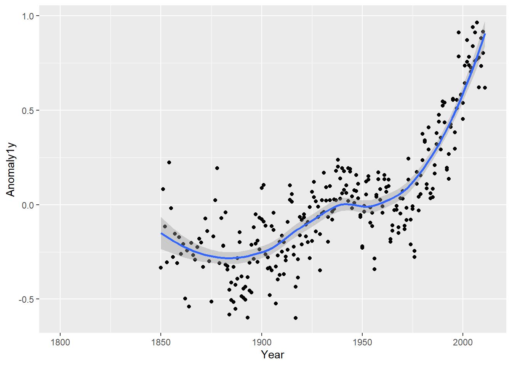
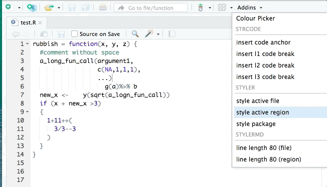
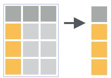
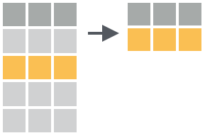
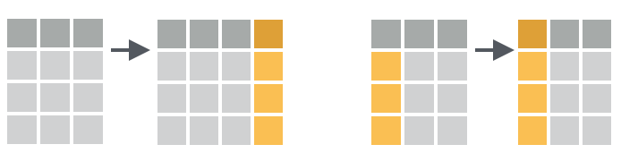
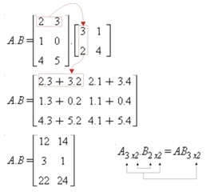

--- 
title: "Análise de Dados Ambientais com R"
#subtitle: "Versão preliminar"
cover-image: TB1.jpg
author: "Jônatan Tatsch"
date: "2020-04-27"
site: bookdown::bookdown_site
output: bookdown::gitbook
documentclass: book
bibliography: [book.bib, packages.bib]
biblio-style: apalike
link-citations: yes
github-repo: lhmet/adar-ebook
description: "Livro baseado nas notas de aula da disciplina FSC1104 do curso de graduação em Meteorologia da UFSM."
---

# Apresentação {-} 


<p style="font-size: 11px; font-style: italic; background: whitesmoke; text-align="right"; color: gray; line-height: 12px;width: 650px;">Ilustração: The Project Twins</p> 

<!--  -->


Este livro é uma composição das notas de aula da disciplina
**Análise de Dados Ambientais com ** do curso de Graduação em [<span style="font-variant:small-caps;">meteorologia</span>](http://w3.ufsm.br/meteorologia/) que eu ofereço no Departamento de Física da Universidade Federal de Santa Maria ([UFSM](http://site.ufsm.br/)). 

O livro pode ser útil para qualquer um com interesse em aprender o  e que quer alavancar a etapa de processamento de dados ambientais no seu projeto. O objetivo é prover uma material para ensinar os conceitos básicos de programação necessários para o processamento, a visualização e a análise de dados ambientais com o sistema computacional . Estes procedimentos são potencializados com o uso do software RStudio, uma interface de desenvolvimento integrado (IDE) específica para o .

Neste livro o leitor aprenderá a sintaxe básica da linguagem , a importação e exportação de dados, a criação de gráficos, funções, a padronização e organização de conjunto de dados ambientais; e finalmente, a confecção de relatórios dinâmicos e reproduzíveis.

O material do livro inclui o uso de dados ambientais de diferentes áreas (meteorologia, climatologia, hidrologia, sensoriamento remoto) em exemplos práticos e em exercícios, para estimular a prática da programação. 

O texto é intercalado com trechos de códigos que podem ser reproduzidos e os resultados visualizados no computador do leitor. 

Após a introdução ao  apresenta-se as capacidades específicas do  para manipulação de dados. Baseado na experiência do autor são empregados os pacotes mais adequados para cada finalidade, como **dplyr** e **tidyr** para o processamento de dados e o **ggplot2** para visualização de dados.

A intenção do livro é que após a leitura, o leitor tenha o conhecimento suficiente para desenvolver códigos que automatizem tarefas repetitivas, assim reduzindo o tempo gasto na etapa de preparação de dados. Esta programação mais efetiva permitirá focar mais na análise de dados e na comunicação dos resultados, seja ela na forma de documentos acadêmicos, ou relatórios técnicos em empresas públicas e privadas.

O texto está em formato [html](https://pt.wikipedia.org/wiki/HTML) para tirar o melhor proveito de recursos de multimídia, da capacidade de busca de texto e links para websites. 

O texto é organizado em 7 capítulos:

- \@ref(intro) Introdução

- \@ref(install) Instalação do  e RStudio

- \@ref(iu) Interface do Usuário

- \@ref(rstudio) Rstudio

- \@ref(operbasic) Operações Básicas

- \@ref(datatype) Tipos de dados

- \@ref(estrutura-dados) Estruturas de dados

- \@ref(io) Entrada de dados

- \@ref(data-wrangle) Processamento de dados


<!-- 
# estrutura de conteúdo de livro ideal
# para balancear R básico e tidyverse
https://dzchilds.github.io/eda-for-bio/
https://github.com/lhmet-forks/eda-for-bio
https://tavareshugo.github.io/r-eda-gapminder/
-->

<!-- 
https://github.com/ELToulemonde/dataPreparation
https://cran.r-project.org/web/packages/dlookr/vignettes/diagonosis.html
-->


<!--
- Para um futuro capítulo de EDA
 https://www.udemy.com/course/automating-data-exploration-with-r/
 
 # top demais!
 https://github.com/mstaniak/autoEDA-resources
 
  https://boxuancui.github.io/DataExplorer/
 
-->

<!-- - AUTOMAÇÂO COM R 
https://datacarpentry.org/rr-automation/ 

# The Automation of GitHub Processes in RStudio
https://rpubs.com/chrimaho/GitHubAutomation

https://towardsdatascience.com/automate-your-repetitive-reports-5ee60a53bda2

https://stackoverflow.com/questions/10204483/i-want-to-run-a-r-code-at-a-specific-time

https://stat545.com/automation-overview.html

https://towardsdatascience.com/how-to-build-an-automated-trading-system-using-r-34892b6d3320

https://nextjournal.com/eda/automated-eda

https://www.r-bloggers.com/how-to-create-automated-analysis-using-r/


https://medium.com/airbnb-engineering/using-googlesheets-and-mailr-packages-in-r-to-automate-reporting-c09579e0377f
-->


<br/>
<br/>


<a rel="license" href="http://creativecommons.org/licenses/by-nc-sa/4.0/"></a><br />A versão on-line deste livro está licenciada com uma Licença <a rel="license" href="http://creativecommons.org/licenses/by-nc-sa/4.0/">Creative Commons - Atribuição-NãoComercial-CompartilhaIgual 4.0 Internacional</a>.

<!--chapter:end:index.Rmd-->

# (PART) Introdução {-}

# Motivação {#intro}

<!-- #dados meteorológicos 
#Importância e valor da informação meteorológica
 aquisição de dados
 preparação de dados
 controle de qualidade
 interpolação 
 visualização
-->

<!--

- pesquisa reproduzível, transparência

-->


## Análise de dados meteorológicos

> Processo pelo qual adquire-se conhecimento, compreensão e percepção dos fenômenos meteorológicos a partir de observações (dados) qualitativas e quantitativas.

</style>
<div class="midcenter" style="margin-left:50px; margin-top:50px;">

</div>


## Ciência de dados


</style>
<div class="midcenter" style="margin-left:50px; margin-top:50px;">

</div>

<!-- 
Definitivamente pensando em 
(1) 'Ciência de dados meteorológicos' 
ou 
(2) 'processamento de dados meteorológicos'

Mas vem aí discussão sobre (1) Ciência de dados (dadoslogia), Estatística, Ciência da computação. 
(ver a Introdução do Beginning Dara Science with R)


asd 
-->


## Etapas para abordagem de um problema 


 1. **Questão científica/problema**
<br/>
 2. **Obtenção de dados:** coleta/medida do(as) estado/condições da atmosfera
    - Instrumentos e sensores
<br/>
 3. **Processamento de dados:**
    *download* ---> limpeza ---> formatação ---> <br/>
     transformação ---> controle de qualidade
       - ferramenta/software
         - <span style="color: red">conhecimento em programação</span>
 4. **Análise de dados**
    - ferramenta/software
      - <span style="color: red">conhecimento em programação</span>
 5. **Solução para o problema** 
    - Proposta de um modelo 
      - estatístico, empírico, ou fisicamente baseado
    - <span style="color: red">conhecimento em programação</span>
<br/> 
 6. **Apresentação/divulgação/publicação**


## Programação computacional


</style>
<div class="midcenter" style="margin-left:10px; margin-top:10px;">

</div>

</style>
<div class="midcenter" style="margin-left:10px; margin-top:0px;">

</div>

##  

<!-- 
https://datacarpentry.org/R-ecology-lesson/00-before-we-start.html 

-->

* [R](https://www.r-project.org/) é o termo usado para se referir a linguagem de programação e ao software que interpreta os scripts escritos usando esta linguagem.


* Comunidade fantástica

  - [Contribuidores](https://www.r-project.org/contributors.html) (@R-base)

  - milhares de pessoas usam o R diariamente e ajudam outras pessoas


* **Software Livre** (GPL), [Código aberto](https://github.com/wch/r-source) e multiplataforma
<br/> 
* Ambiente para Análise de dados interativa

## Por que o R?

<!-- 
https://simplystatistics.org/2018/07/12/use-r-keynote-2018/

http://www.sthda.com/english/wiki/what-is-r-and-why-learning-r-programming

https://datacarpentry.org/R-ecology-lesson/00-before-we-start.html
-->

* [R](https://www.r-project.org/) não é uma GUI (Interface gráfica do usuário) e isso é bom


    - há uma natural resistência e dificuldade ao uso de códigos e scripts
 

    - scripts favorecem a **automatização** e **reprodutibilidade**


    - força você a ter um conhecimneto mais aprofundado do que está fazendo


- [Reprodutibilidade](https://pt.wikipedia.org/wiki/Reprodutibilidade)

    - qualquer pessoa (inclusive você mesmo no futuro) pode obter os mesmos resultados do mesmo conjunto de dados

    - R é integrado com [outras ferramentas](https://cran.r-project.org/web/views/ReproducibleResearch.html) de que permitem atualizar seus resultados, figuras e análises automaticamente

   - [Relatório dinâmicos](https://rmarkdown.rstudio.com/articles_intro.html) e [interativos](http://shiny.rstudio.com/)

- Acesso ao estado da arte da ciência de dados (*Big Data*, *Data Mining*, *Machine Learning*)

- é um software livre, de código fonte aberto e funciona em diversos sistemas operacionais (Linux, Windows e MacOS).

- Interface com Fortran, C, C++, Python

- [Visualização de dados](https://cran.r-project.org/web/views/Graphics.html)

   - R produz [gráficos de alta qualidade](https://timogrossenbacher.ch/2016/12/beautiful-thematic-maps-with-ggplot2-only/)


- R trabalha com dados de todas formas e tamanhos 


- Extensões para [Manipulação de dados](http://blog.rstudio.org/2014/07/22/introducing-tidyr/)
 


## Pacotes da comunidade do R

Evolução do nº de pacotes disponíveis no [CRAN](http://cran.r-project.org/mirrors.html)
</style>
<div class="midcenter" style="margin-left:10px; margin-top:10px;">

</div>


<!--
A meteorologia é 4D: 

```r
meteorologia <- function(x, y, z, t){
  ...muita coisa para caber em um slide...
}
```

Logo, requer ferramentas específicas para:
 
* manipulação de dados espacias
 
* análise de séries temporais
 
* importação e ferramentas de [SIG](https://pt.wikipedia.org/wiki/Sistema_de_informa%C3%A7%C3%A3o_geogr%C3%A1fica)

* leitura de dados em formatos específicos ([netcdf](https://en.wikipedia.org/wiki/NetCDF), [binários](https://en.wikipedia.org/wiki/Binary_file), [grib2](https://en.wikipedia.org/wiki/GRIB), ...)

-->


## R não é perfeito!

* Muitos códigos em R são escritos para resolver um problema;
    * foco nos resultados e não no processo
    * usuários não são programadores
    * códigos deselegantes, lentos e difíceis de entender
 
* Como o nosso idioma, há muitas exceções para serem lembradas
 
* R não é muito rápido e códigos mal escritos serão lentos
 
* São apenas ~20 anos de evolução
 
* Há muito o que melhorar


## Para saber mais sobre o R

[**Documentação oficial**](http://cran.r-project.org/manuals.html)
  - [Manuais do R traduzidos](https://cran.r-project.org/other-docs.html)


[**Lista de Livros relacionados ao R**](http://www.r-project.org/doc/bib/R-books.html)

- [Livros gratuitos](https://github.com/vhf/free-programming-books/blob/master/free-programming-books.md#r) (em inglês)


<!-- 
https://simplystatistics.org/2018/07/12/use-r-keynote-2018/ 
-->


**Fóruns:** 

- lista Brasileira de discussão do programa R: [**R-br**](https://listas.inf.ufpr.br/cgi-bin/mailman/listinfo/r-br)

- [stackoverflow](http://stackoverflow.com/questions/tagged/r)
<br/>

<!--chapter:end:01-introducao.Rmd-->

# (PART) Configuração do Sistema {-}


# Pré-requisitos

<!-- 

-->

<!-- 
# TOP formato de curso
https://uomresearchit.github.io/r-tidyverse-intro/
https://github.com/UoMResearchIT/r-tidyverse-intro


http://ohi-science.org/data-science-training/
https://github.com/lhmet-forks/data-science-training
https://github.com/NCEAS/oss-lessons
http://ohi-science.org/toolbox-training/index.html
https://github.com/ohi-science/toolbox-training


# Reproducible Analysis With R
https://github.com/NCEAS/sasap-training/tree/master/materials/reproducible-analysis-in-r 
https://datacarpentry.org/rr-workshop/

https://ropensci.org/blog/2019/07/11/commcall-jul2019/


https://github.com/lhmet-forks/r-eda-gapminder 
https://github.com/cambiotraining/r-intro/tree/master 
https://datacarpentry.org/R-ecology-lesson/00-before-we-start.html
-->


Para tirar melhor proveito deste livro, você precisará:

1. Das **versões atualizadas** do

    - : https://cloud.r-project.org
    
      - se estiver em SO Windows também precisará do programa
    [Rtools](https://cran.r-project.org/bin/windows/Rtools/index.html).

    - RStudio: https://rstudio.com/download 

    - Git: https://git-scm.com/downloads [^pos-inst-git] 

[^pos-inst-git]: ao baixar e seguir o processo normal de instalação no seu computador, você não verá nenhum software instalado quando você tiver terminado.

2. Criar uma conta GitHub: https://github.com [^githubtip].

[^githubtip]: Procure escolher um nome curto para o seu usuário e que o 
identifique melhor.

## Instalação do R e RStudio {#install}

A interação do usuário com o  é por meio da linha de comando. A 
interface da linha de comando tem suas vantagens, mas você será mais produtivo 
com o uso de uma Interface de Desenvolvimento Integrado (IDE) como o RStudio *Desktop*.

A seguir veremos como:

- instalar o  nos SO Windows e Linux Ubuntu

- manter o  sempre atualizado no Linux Ubuntu 

- configurar um diretório para armazenar os pacotes do R instalados

- instalar pacotes 

- instalar o RStudio *Desktop*

Neste livro, o maior foco na instalação do  é dada para o SO Linux [Ubuntu](https://pt.wikipedia.org/wiki/Ubuntu), pelo fato de assim como o R, 
ser um software livre e de código aberto. Como o Linux Ubuntu é baseado no [Debian](https://pt.wikipedia.org/wiki/Debian) o procedimento de instalação 
também se estende a essa distribuição Linux e as [versões derivadas do Ubuntu](https://pt.wikipedia.org/wiki/Ubuntu#Projetos_derivados) oficialmente reconhecidas. 

A instalação no SO Windows é igual a instalação de qualquer outro *software* e
pode ser facilmente encontrada na internet. Por esta razão, somente indicou-se 
o caminho de instalação.


<div class="rmdtip">
<p>Ao instalar R recomenda-se optar por instalar na língua inglesa. Assim quando surgir uma mensagem de erro durante seu uso, basta usá-la numa pesquisa na internet para solucionar o problema. As chances de resolver o problema serão muito maiores se sua pesquisa for realizada em inglês.</p>
</div>

### Instalando o R

O  pode ser instalado a partir dos [binários pré-compilados](https://cran.r-project.org/bin/) ou do [código fonte](https://cran.r-project.org/sources.html). Nós veremos a instalação do  a partir dos arquivos binários.


#### Windows 

O binário executável do  para o Windows está disponível na **Rede Abrangente de Arquivos do ** ([CRAN](https://cran.r-project.org/)) e 
pode ser baixado [aqui](http://cran.r-project.org/bin/windows/base/). 

Abra o executável e siga instruções de instalação mantendo todas as opções 
padrões.

No Windows a instalação do  inclui uma Interface Gráfica do Usuário 
(GUI) acessível pelo executável `RGui.exe` (Figura \@ref(fig:r-gui)). Um atalho para esse executável é gerado por *default* na área de trabalho com o símbolo 
do .

<div class="figure">

<p class="caption">(\#fig:r-gui)Interface gráfica do usuário no R para Windows.</p>
</div>

Para instalar pacotes de plataformas diferentes da CRAN (veja seção \@ref(install-github)) é necessário instalar o programa [Rtools](https://cran.r-project.org/bin/windows/Rtools/index.html), 
selecionando a versão adequada para sua versão do . 


##### Atualização do R no Windows

Novas versões do R são disponibilizadas em geral com frequência de 5 vezes 
por ano. Recomenda-se manter o R atualizado, pois as novas versões incluem [aperfeiçoamentos e a correção de *bugs*](https://cran.r-project.org/bin/windows/base/NEWS.R-4.0.0.html).


As novas versões do  vem com os [pacotes padrões do R](https://cran.r-project.org/doc/manuals/R-FAQ.html#Which-add_002don-packages-exist-for-R_003f). Os demais pacotes instalados pelo usuário na versão anterior precisam ser reinstalados.

Para atualizar o  no Windows, ao invés de baixar o executável a 
cada nova versão e repetir o processo da seção anterior, você pode utilizar o pacote [**installr**](https://cran.r-project.org/web/packages/installr/index.html). A instalação de pacotes no  será vista na seção \@ref(install-pck).

#### Linux 

##### Ubuntu

<!-- 
#install the automatically tuned Atlas or the multi-threaded OpenBlas library in order to get higher performance for linear algebra operations
sudo apt-get install libatlas3-base libopenblas-base

link da cran sobre instalação do R no ubuntu
https://cran.rstudio.com/bin/linux/ubuntu/README.html 

# PPA
https://rubuntu.netlify.app/post/2018-05-25-announcing-c2d4u3-5/

# problemas com rjava
https://askubuntu.com/questions/1053726/r-cannot-install-rjava-what-is-r-api-3-4

sudo add-apt-repository ppa:marutter/c2d4u3.5
sudo apt update
sudo apt install r-cran-rjava

-->

Há várias formas de instalar o  no Ubuntu. Mas primeiro, caso você 
tenha alguma versão antiga do R, desinstale-a com:


```bash
$ sudo apt-get remove r-base-core
```

A forma mais fácil de instalar o  é usar a versão compilada no 
repositório *default* do Ubuntu. 


```bash
$ sudo apt-get install r-base
```

Entretanto, como o R é um projeto de evolução rápida, a versão estável mais recente[^rversion-recente] não está disponível nos repositórios do Ubuntu. Dessa forma, não conseguimos usufruir dos pacotes mais recentes 
(ou em desenvolvimento), que geralmente incluem o estado da arte da ciência de dados. Por esta razão, vamos instalar a última versão do  e de forma 
que seja atualizado automaticamente pelo sistema. Isto pode ser feito com os comandos a seguir.

[^rversion-recente]: A versão mais atual no período de elaboração deste texto 
foi a R 4.0.0.

1. Incluímos o endereço do repositório externo mantido pelo CRAN[^cran-mirror]
à lista de repositórios do sistema [^aviso-sudo].


[^cran-mirror]: Usando https://cloud.r-project.org automaticamente redireciona 
para o espelho da CRAN mais próximo. A lista de espelhos atual encontra-se em https://cran.r-project.org/mirrors.html.

[^aviso-sudo]: A execução destes comandos requer privilégios de [superusuário](https://pt.wikipedia.org/wiki/Superusu%C3%A1rio). Caso não 
tenha, consulte o administrador do sistema.


```bash
$ sudo touch /etc/apt/sources.list.d/cran.list
$ sudo sh -c "echo 'deb https://cloud.r-project.org/bin/linux/ubuntu `lsb_release -sc`-cran35/' >> /etc/apt/sources.list.d/cran.list" 
```

2. Adicionamos a chave de autenticação[^chave-pub] do repositório.

[^chave-pub]: Chave pública de autenticação é um meio alternativo de se logar
em um servidor ao invés de digitar uma senha. É uma forma mais segura e 
flexível, mas mais difícil de ser configurada. Esse meio alternativo de fazer 
login é importante se o computador está visível na internet. Para saber mais 
veja [aqui](http://the.earth.li/~sgtatham/putty/0.55/htmldoc/Chapter8.html).


```bash
$ sudo apt-key adv --keyserver keyserver.ubuntu.com --recv-keys E298A3A825C0D65DFD57CBB651716619E084DAB9
```

3. Atualizamos a lista de repositórios do sistema.


```bash
sudo apt-get update
```

4. Instalamos o R


```bash
$ sudo apt-get install -y r-base r-base-dev 
```


<!-- 
##### R sempre atualizado 

Se você quer trabalhar sempre com a última versão estável do , é possível configurar o Linux Ubuntu para atualizar automaticamente o . O procedimento de instalação requer senha de superusuário do sistema ou de privilégios [sudo](https://en.wikipedia.org/wiki/Sudo). Caso não tenha, consulte o administrador do sistema.

Ao utilizar distribuições Linux Ubuntu é importante optar por versões estáveis[^versoesubuntu]. As versões de Suporte de Longo Prazo (LTS) mais recentes são:

- 14.04: `trusty` 
- 16.04: `xenial`
- 18.04: `bionic`

[^versoesubuntu]: Clique [aqui](https://wiki.ubuntu.com/Releases) para saber mais sobre as versões do Ubuntu.

 
A versão mais atual é a 4.0.0. Para que ele seja atualizado automaticamente no Ubuntu você precisa adicionar o endereço https://cloud.r-project.org/bin/linux/ubuntu que automaticamente redireciona para o espelho da CRAN mais próximo à lista de repositórios do Linux.

###### Incluindo repositório do  na Lista de repositórios do Ubuntu

O primeiro passo é descobrir o nome da versão UBUNTU instalada. Para isso, você pode utilizar o seguinte comando[^ubuntuname] :


```
$ lsb_release -sc
```
```
bionic
```

[^ubuntuname]: Se o comando `lsb_release` não funcionar você precisa instalar o pacote `lsb-release` no sistema. Para isso, digite no terminal Linux `sudo apt-get install lsb-release`.

O endereço do espelho da CRAN e algumas configurações do sistema podem ser inseridas num arquivo em `/etc/apt/sources.list.d/cran.list`. Essa tarefa requer privilégios de [superusuário](https://pt.wikipedia.org/wiki/Superusu%C3%A1rio). Vamos trocar do seu usuário para o superusuário.

    $ sudo su

Após o comando, informe a senha de superusuário e então vamos criar o arquivo `/etc/apt/sources.list.d/cran.list`.

    # touch /etc/apt/sources.list.d/cran.list

Vamos definir no terminal uma variável chamada `repos` que será composta pelo endereço do espelho[^cran-mirrors], o nome da versão do Ubuntu e o sufixo `-cran35`. Este sufixo é para obter a última versão do pacote R 3.6 para Ubuntu. 

    # repos="deb https://cloud.r-project.org/bin/linux/ubuntu `lsb_release -sc`-cran35/"
    
[^cran-mirrors]: Usando https://cloud.r-project.org automaticamente redireciona para o espelho da CRAN mais próximo. A lista de espelhos atual encontra-se em https://cran.r-project.org/mirrors.html.

O valor da variável `repos` é mostrado pelo comando: `echo $repos`. Certifique-se de que a última palavra corresponde ao nome da sua versão Ubuntu.


Adicionamos o conteúdo da `repos` ao arquivo cran.list usando o comando:

    # echo $repos >> /etc/apt/sources.list.d/cran.list

Assim o gerenciador de pacotes 
[apt](http://pt.wikipedia.org/wiki/Advanced_Packaging_Tool)[^wikiped-apt] fará a atualização do  quando uma nova versão estiver disponível. Ou seja, você estará utilizando sempre versão mais atual do .

[^wikiped-apt]: o gerenciador de pacotes [apt](http://pt.wikipedia.org/wiki/Advanced_Packaging_Tool) é usado para instalação, atualização e remoção de pacotes em distribuições Debian GNU/Linux.


Feito isso, você podemos retornar a sessão de usuário comum:

    # exit


###### [APT protegido](https://cran.r-project.org/bin/linux/ubuntu/README.html#secure-apt) 

Os arquivos binários do  para Ubuntu na [CRAN](http://cran.r-project.org) são assinados com uma chave pública [^pub-key]. Para adicionar essa chave ao seu sistema digite os seguintes comandos:

    $ gpg --keyserver hkp://keyserver.ubuntu.com:80 --recv-keys E298A3A825C0D65DFD57CBB651716619E084DAB9

    $ gpg -a --export E298A3A825C0D65DFD57CBB651716619E084DAB9 | sudo apt-key add -

[^pub-key]: Chave pública de autenticação é um meio alternativo de se logar em um servidor ao invés de digitar uma senha. É uma forma mais segura e flexível, mas mais difícil de ser configurada. Esse meio alternativo de fazer login é importante se o computador está visível na internet. Para saber mais veja [aqui](http://the.earth.li/~sgtatham/putty/0.55/htmldoc/Chapter8.html).

Se aparecer uma mensagem **OK** a chave foi adicionada com sucesso e os comandos a seguir podem ignorados. Porém, se aparecer uma mensagem do tipo *keyserver error*, utilize o seguinte comando:

    $ sudo apt-key adv --keyserver keyserver.ubuntu.com --recv-keys E298A3A825C0D65DFD57CBB651716619E084DAB9

Caso seja impresso alguma mensagem de erro, outra alternativa pode ser usada para obter a chave, via os comandos:

    $ gpg --keyserver keyserver.ubuntu.com --recv-key E298A3A825C0D65DFD57CBB651716619E084DAB9
    
    $ gpg -a --export E298A3A825C0D65DFD57CBB651716619E084DAB9 | sudo apt-key add -


###### Atualização da lista de repositórios do Ubuntu e instalação do 

Após fazer as configurações da lista de repositórios e adicionar a chave é necessário fazer a atualização dessa lista (requer poderes de super usuário):

    $ sudo apt-get update
    
Finalmente, instalamos o binário do R, a coleção de pacotes recomendados e ferramentas de desenvolvimento:

    $ sudo apt-get -y install r-base r-base-dev
-->


<!---
referências

https://www.digitalocean.com/community/tutorials/how-to-install-r-on-ubuntu-18-04

https://askubuntu.com/questions/218708/installing-latest-version-of-r-base

 https://stackoverflow.com/questions/46704247/upgrade-r-in-ubuntu-xenial
 https://gist.github.com/mGalarnyk/41c887e921e712baf86fecc507b3afc7
 https://askubuntu.com/questions/1162051/i-am-unable-to-install-latest-version-of-r 
 https://rtask.thinkr.fr/installation-of-r-3-5-on-ubuntu-18-04-lts-and-tips-for-spatial-packages/
 https://yiweiniu.github.io/blog/2019/07/Install-Update-R-and-R-packages/
 https://shiny.rstudio.com/articles/upgrade-R.html

# for r dev packages
sudo add-apt-repository ppa:marutter/rrutter3.5
sudo add-apt-repository ppa:marutter/c2d4u
sudo apt-get update
sudo apt-get -y install r-base-core r-recommended r-base-dev

# run apt-get update and then check via apt-cache policy r-base-core
apt-cache policy r-base-core

sudo apt install r-cran-rgl r-cran-rjags r-cran-snow r-cran-ggplot2 r-cran-igraph r-cran-lme4 r-cran-rjava r-cran-devtools r-cran-roxygen2 r-cran-rjava r-cran-xlsx

# pacotes mais usados
c("tidyverse", 
  "data.table",
  "knitr",
  "rstudioapi",
  
  )

rlang > Rcpp > backports > vctrs > glue > tibble > tidyselect> dplyr > purrr
nlme > lattice > broom

‘broom’, ‘dbplyr’, ‘haven’, ‘hms’, ‘modelr’, ‘reprex’, ‘rvest’, ‘tidyr’
--->


Para iniciar o  no Linux, digite `R` no cursor do terminal:

    $ R

A partir desse momento já começamos uma sessão no . Vamos gerar uma sequência numérica de 1 a 10 e plotá-la.


```r
> 1:10
 [1]  1  2  3  4  5  6  7  8  9 10
> plot(1:10)
```

<div class="figure" style="text-align: center">

<p class="caption">(\#fig:Chunck4)Gráfico da sequência de 10 números.</p>
</div>

Após este teste, podemos sair do , sem salvar os dados da seção, com a expressão abaixo:


```r
> q(save = "no")
```

#### Diretório para pacotes instalados pelo usuário

Os pacotes que vem com os pacotes *r-base* e *r-recommended* são instalados no diretório `/usr/lib/R/library`. Estes pacotes são atualizados pelo sistema[^update-rbase] ou usando `sudo apt-get update && sudo apt-get upgrade`.

[^update-rbase]: Por ser atualizado automaticamente pelo sistema, às vezes o usuário nem percebe que a versão do R mudou.

Uma boa prática para os pacotes R instalados pelo usuário é definir um diretório específico. Isso lhe dá mais controle sobre os pacotes do  instalados no sistema. Um local sugerido é o `/home/usuario/.R/libs`. O seu `home` ou `pasta pessoal` pode ser obtido com o comando `echo $HOME`. Para criar o diretório você pode digitar o comando abaixo:


```bash
$ mkdir -p `echo $HOME`/.R/libs/
```

Para informar ao  onde procurar os pacotes instalados, você precisa criar um arquivo chamado `.Renviron`, no diretório `$HOME`, contendo a expressão `R_LIBS=/home/usuario/.R/libs/`. Você pode fazer isso em um terminal com os comandos:


```bash
$ R_LIBS=`echo $HOME/.R/libs/`
$ echo $R_LIBS >> `echo $HOME/.Renviron`
```


Esse caminho fica então visível ao , o que pode ser verificado executando a função `.libPaths()` na linha de comando do . 

Abra o :


```bash
$ R
```

e ao digitar:


```r
> .libPaths()
[1] "/home/hidrometeorologista/.R/libs" "/usr/local/lib/R/site-library"    
[3] "/usr/lib/R/site-library"           "/usr/lib/R/library"               
```
    
o seu diretório `/home/usuario/.R/libs` [^rlibs] deve aparecer em primeiro lugar. Indicando que este local tem prioridade para instalação dos pacotes. Caso o diretório deixe de existir os diretórios seguintes  serão usados.

[^rlibs]: Diretórios precedidos por "." no Linux são diretórios ocultos. O diretório `/home/usuario/.R` é um diretório oculto, para visualizá-lo no Ubuntu, na interface gráfica do sistema, acesse *View > Show Hidden Files* (ou *Visualizar > Mostrar arquivos ocultos*). No terminal utilize `ls -a` para listar os arquivos ocultos.


## Instalação de Pacotes {#install-pck}

Um pacote do  é uma coleção de funções, dados e documentação que estende as funcionalidades básicas do R, muito além do que se poderia imaginar. Os pacotes são desenvolvidos pela comunidade do  formada por vários contribuidores. 

<!-- 
http://www.sthda.com/english/wiki/installing-and-using-r-packages 
https://www.datacamp.com/community/tutorials/r-packages-guide
-->

### Da internet

#### CRAN {#install-cran}

A forma mais fácil de instalar uma pacote do R é através da função `install.packages("nome_do_pacote")`.

Por *default* o pacote informado é instalado a partir do repositório oficial de distribuição de pacotes: a ([CRAN](https://cran.r-project.org/)). A CRAN é uma rede de servidores e FTP distribuídas pelo mundo e mantida pela comunidade . A [Fundação R](https://www.r-project.org/foundation/) coordena a CRAN e estabelece diversos testes para assegurar que os pacotes publicados sigam as [políticas da CRAN](https://cran.r-project.org/web/packages/policies.html).

Agora veremos como instalar um pacote. Como exemplo instalaremos o pacote [remotes](https://cran.r-project.org/web/packages/remotes/index.html) que dispõe de funções para instalar pacotes de repositórios remotos, como por exemplo do [GitHub](https://github.com/).


```r
install.packages("remotes")
```

<!-- 
Package Installation from Remote Repositories, Including 'GitHub'
sudo apt-get libssl-dev 
see https://www.rstudio.com/products/rpackages/devtools/ 
  The OpenSSL library that is required to 
  build git2r was not found. 
  Please install: 
libssl-dev    (package on e.g. Debian and Ubuntu) 
openssl-devel (package on e.g. Fedora, CentOS) 
openssl       (Homebrew package on OS X) 
-->


Para ter acesso as funções disponibilizadas com o pacote você precisa carregar o pacote:


```r
library(remotes)
```

Apesar de precisar só instalar uma vez um pacote, você precisará carregá-lo a cada nova sessão.

Para desinstalar um pacote você pode usar a função `remove.packages("nome_do_pacote")`.

#### GitHub e R-forge {#install-github}

Nem todos pacotes são disponíveis na CRAN. Muitos desenvolvedores disponibilizam seus pacotes em plataformas como o [GitHub](https://github.com/) e [R-forge](https://r-forge.r-project.org/). As vezes um pacote pode  estar em ambos CRAN e GitHub (ou R-forge), mas a última versão - a de desenvolvimento - é somente disponibilizada no GitHub (ou R-forge). 

Para instalar um pacote de um repositório do GitHub usa-se a função `install_github()` do pacote **remotes**. Portanto, o pacote **remotes** precisa ser sido instalado primeiro (ver seção \@ref(install-cran)). 


<!-- 
#Antes de instalar o pacote **devtools**, usuários Windows precisam instalar o programa [Rtools](https://cran.r-project.org/bin/windows/Rtools/index.html). 
-->

A função para instalar um pacote do GitHub requer como argumento o `nome do usuário/nome do repositório`. Por exemplo, para instalar o pacote `inmetr` do repositório mantido pelo [lhmet](https://github.com/lhmet), usa-se:


```r
library(remotes)
# instala o pacote inmetr do repositório 
# https://github.com/lhmet/inmetr 
install_github("lhmet/inmetr")
```


<div class="rmdtip">
<p>Você pode acessar uma função de um pacote instalado com a forma especial <code>pacote::funcao</code>. O trecho de código anterior poderia ser reduzido a:</p>
<p><code>remotes::install_github(&quot;lhmet/inmetr&quot;)</code></p>
<p>Essa forma deixa explícito que estamos usando a função <code>install_github()</code> do pacote <strong>remotes</strong>.</p>
<p>As vezes você pode estar com diversos pacotes carregados e eles podem ter funções de mesmo nome. Portanto, essa é a alternativa mais segura de avaliar funções afim de evitar conflitos.</p>
</div>

Para instalar um pacote num repositório do R-forge, por exemplo o repositório do pacote [raster](https://r-forge.r-project.org/projects/raster/), usa-se:


```r
install.packages(
  "raster",  
  repos = "http://R-Forge.R-project.org"
)
```


#### Arquivo fonte local

Códigos fonte de pacotes do R são armazenados como arquivos com a extensão `.tar.gz`. Binários compilados são armazenados com a extensão `.zip`. Exemplo de arquivos como estes podem ser baixados manualmente da CRAN (veja a seção Downloads em por exemplo, https://cran.r-project.org/web/packages/remotes/index.html), no [GitHub](https://github.com/r-lib/remotes/releases) ou R-forge.

Eventualmente um usuário pode instalar um pacote a partir desses arquivos localmente. Isto pode também ser feito  com a função `install.packages()`, especificando o argumento `repos = NULL` e o argumento `pkgs` com o caminho do arquivo. Por exemplo:


```r
install.packages("remotes_2.1.1.tar.gz", repos = NULL)
```


## Atualização de pacotes 

Se o seu  foi atualizado, os pacotes da versão prévia do  devem ser reinstalados para evitar problemas de compatibilidade. O comando abaixo atualiza todos pacotes para a última versão. A opção `checkbuild = TRUE` reinstala os pacotes que foram construídos uma versão mais antiga que a do  atual. 


```r
update.packages(checkBuilt=TRUE, ask=FALSE)
```

Se você usa muitos pacotes, este processo pode tornar-se trabalhoso e problemático, devido a cadeia de dependências de alguns pacotes. Por esta razão, há pacotes para facilitar este processo, como o [rvcheck](https://github.com/GuangchuangYu/rvcheck).


```r
install.packages("rvcheck")
```

Com o [rvcheck](https://github.com/GuangchuangYu/rvcheck) podemos:

- checar a versão mais recente do R


```r
library(rvcheck)
check_r()
## $installed_version
## [1] "R-3.6.3"
## 
## $latest_version
## [1] "R-4.0.0"
## 
## $latest_url
## [1] "https://cran.r-project.org/src/base/R-4/R-4.0.0.tar.gz"
## 
## $up_to_date
## [1] FALSE
```

- checar a versão mais atual de um pacote na CRAN, no GitHub ou no Bioconductor


```r
check_cran('dplyr')
## package is up-to-date release version
## $package
## [1] "dplyr"
## 
## $installed_version
## [1] "0.8.5"
## 
## $latest_version
## [1] "0.8.5"
## 
## $up_to_date
## [1] TRUE
check_github('lhmet/inmetr')
## package is up-to-date devel version
## $package
## [1] "lhmet/inmetr"
## 
## $installed_version
## [1] '0.3.0.9000'
## 
## $latest_version
## [1] "0.3.0.9000"
## 
## $up_to_date
## [1] TRUE
check_bioc('EBImage')
## package is up-to-date release version
## $package
## [1] "EBImage"
## 
## $installed_version
## [1] "4.28.1"
## 
## $latest_version
## [1] "4.28.1"
## 
## $up_to_date
## [1] TRUE
```

Por fim, para atualizar todos os pacotes:


```r
update_all(check_R = TRUE)
```


<div class="rmdtip">
<p>Se você precisa manter a versão dos seus pacotes em uma nova versão do R, o pacote <a href="https://github.com/MangoTheCat/pkgsnap">pkgsnap</a> é uma solução. Esta opção é útil para evitar que mudanças nas versões dos pacotes possam fazer com que seu código se comporte de maneira diferente.</p>
</div>

## Pacotes necessários e dependências

Ao longo deste livro serão usados diversos pacotes para o processamento de dados ambientais. A maioria dos pacotes não vêm com o .

Alguns pacotes dependenm de bibliotecas do Linux e precisamos instalá-las antes da instalação no . 


```bash
$ sudo apt-get install libnetcdf-dev netcdf-bin libudunits2-dev libssl-dev
```


```r
pcks <- c(
  "easypackages",
  "rmarkdown",
  "knitr",
  "pander", 
  "htmlTable",
  "styler",
  "tidyverse", 
  "rio",   # instala readxl, openlxlsx, data.table, foreign, haven, feather, 
           # readODS, jsonlite, rmatio
  "writexl",
  "microbenchmark",
  "ncdf4",
  "raster",
  "openair",
  "lubridate",
  "fields",
  "viridis",
  "WriteXLS",
  "gcookbook"
  )

pcks_dev <- c(
  "vembedr",
  "inmetr"
)
```


```r
install.packages(pcks) 
```


<!-- 
# rJava
https://github.com/hannarud/r-best-practices/wiki/Installing-RJava-(Ubuntu)
# java -version
# sudo R CMD javareconf
$ sudo add-apt-repository ppa:marutter/c2d4u3.5
$ sudo apt-get update
$ sudo apt-get upgrade
The following packages will be upgraded:
  binutils binutils-common binutils-x86-64-linux-gnu gnome-software gnome-software-common gnome-software-plugin-snap libbinutils
  libpulse-mainloop-glib0 libpulse0 libpulse0:i386 libpulsedsp openjdk-11-jdk openjdk-11-jdk-headless openjdk-11-jre
  openjdk-11-jre-headless pulseaudio pulseaudio-module-bluetooth pulseaudio-utils r-cran-boot r-cran-class r-cran-codetools
  r-cran-foreign r-cran-lattice r-cran-mass r-cran-matrix r-cran-mgcv r-cran-nlme r-cran-nnet r-cran-spatial r-cran-survival
  ubuntu-software
31 upgraded, 0 newly installed, 0 to remove and 0 not upgraded.
$ sudo apt-get install r-cran-rjava
-->


## RStudio no Ubuntu {#install-rstudio}

RStudio é uma empresa que desenvolve ferramentas gratuitas para o  e [produtos pagos](https://www.rstudio.com/products/) para empresas.

Uma de suas ferramentas gratuitas é o software RStudio *Desktop* que consiste em um ambiente integrado de desenvolvimento ([IDE](http://en.wikipedia.org/wiki/Integrated_development_environment)) construído especificamente para o . Ele funciona é multiplataforma (servidores inclusive) e fornece diversos recursos, como a integração com controle de versão e manejo de projetos.

Para instalação da versão do [RStudio Desktop](https://rstudio.com/products/rstudio/#rstudio-desktop), você precisa saber se seu SO é 64 ou 32-bit e a versão do Linux Ubuntu. Essas informações podem ser obtidas, respectivamente, pelos comandos:


```bash
$ arch
```

```
x86_64
```
Se retornar **x86_64** sua máquina é 64-bit[^32bit].

[^32bit]: Se seu sistema for 32 bit, você pode usar [versões antigas do rstudio](https://rstudio.com/products/rstudio/older-versions/) 


```bash
$ lsb_release -sr
```

```
18.04
```

Com essas informações, você pode selecionar o [RStudio](https://www.rstudio.com/products/rstudio/download/) adequado para o seu sistema e baixá-lo (Figura \@ref(fig:rstudio-download)). 


<div class="figure" style="text-align: center">

<p class="caption">(\#fig:rstudio-download)Opção para baixar o RStudio *Desktop*.</p>
</div>


Ao clicar sobre o arquivo baixado com o botão direito, há a opção de abrir com *Ubuntu Software Center* e então clicar em `instalar`. Se no seu sistema não houver esta opção, instale via **terminal**[^atalho-term] com os seguintes comandos:

[^atalho-term]: digite <kbd>Ctrl</kbd>+<kbd>Alt</kbd>+<kbd>t</kbd> para abrir um terminal no Linux Ubuntu

```
$ cd /local/do/arquivo/baixado/rstudio-x.y.zzzz-amd64.deb
$ sudo dpkg -i rstudio-x.y.zzzz-amd64.deb
$ sudo apt-get install -f
```

Abra o RStudio digitando no terminal:

    $ rstudio &
    
Agora você está pronto para começar a programar em  aproveitando as facilidades que o [RStudio](http://www.rstudio.com/) oferece. 

## Git e Github

<!-- 
http://ohi-science.org/data-science-training/github.html 
https://www.hostinger.com.br/tutoriais/o-que-github/
-->

[Git](https://git-scm.com/book/pt-br/v2/Come%C3%A7ando-Sobre-Controle-de-Vers%C3%A3o) é um sistema de controle de versão que permite você rastrear as mudanças feitas em arquivos. Estes arquivos podem ser `.R`, `.Rmd`, `.doc`, `.pdf`, `.xls`, mas as diferenças em arquivos de texto regular são mais facilmente visíveis (`.txt`, `.csv`, `.md`).

[GitHub](https://github.com/) é um sistema de gerenciamento de projetos e versões de códigos assim como uma plataforma de rede social criado para desenvolvedores. O GitHub é permite que você trabalhe em projetos colaborativos com desenvolvedores de todo o mundo, planeje seus projetos e acompanhe o trabalho. O GitHub é um dos maiores depósitos online de trabalho colaborativo do mundo.


<!--chapter:end:02-intall-r-rstudio.Rmd-->

# (PART) Interação {-}

# Interface do Usuário {#iu}


Na maior parte do tempo você provavelmente usará o  no **modo interativo**: rodando comandos e vendo os resultados.
 
Eventualmente esse processo pode ser inconveniente. Por exemplo, no caso de uma análise com um código bem extenso e que precisa ser  repetida com dados atualizados semanalmente. Nessa situação, recomenda-se a criação de um script, ou seja, um arquivo texto, com a extensão `.R`, contendo o código de sua análise.

Esse *script* pode ser executado pelo R no **modo de processamento em lote** (do termo em inglês *Batch Processing*) através de um terminal do SO Linux, ou via o *Prompt* de comando (`cmd.exe`) do SO Windows.

Nesta seção apresenta-se ao leitor estes dois modos de execução do .


##  no modo interativo

No Linux o  pode ser aberto simplesmente digitando em um terminal a letra `R`. 


```bash
$ R
```

```
R version 3.6.3 (2020-02-29) -- "Holding the Windsock"
Copyright (C) 2020 The R Foundation for Statistical Computing
Platform: x86_64-pc-linux-gnu (64-bit)

R is free software and comes with ABSOLUTELY NO WARRANTY.
You are welcome to redistribute it under certain conditions.
Type 'license()' or 'licence()' for distribution details.

  Natural language support but running in an English locale

R is a collaborative project with many contributors.
Type 'contributors()' for more information and
'citation()' on how to cite R or R packages in publications.

Type 'demo()' for some demos, 'help()' for on-line help, or
'help.start()' for an HTML browser interface to help.
Type 'q()' to quit R.

>
```

A janela com a linha de comando do  apresenta o *prompt* do  (` > `). Após este símbolo digitamos os comandos, pressionamos a tecla `<enter>`, o  interpreta o comando e retorna o resultado. 

Os comandos digitados na linha de comando são chamados de expressões. Esse é o modo iterativo do . Portanto, a linha de comando é a mais importante ferramenta do , pois todas expressões são avaliadas através dela. 


```r
> 62 + 38
[1] 100
```

A expressão é avaliada pelo , o resultado é mostrado, mas o seu valor é perdido.

O número entre colchetes que aparece como resultado da operação ("[1]" no caso acima) indica o conteúdo resultante da operação iniciando na posição 1 desse objeto. O significado dessa informação torna-se mais óbvio quando trabalhamos com objetos maiores, como por exemplo com vetores. Observe os valores nos colchetes para uma sequência de 100 até 1.


```r
> 100:1
  [1] 100  99  98  97  96  95  94  93  92  91  90  89  88  87  86  85  84  83
 [19]  82  81  80  79  78  77  76  75  74  73  72  71  70  69  68  67  66  65
 [37]  64  63  62  61  60  59  58  57  56  55  54  53  52  51  50  49  48  47
 [55]  46  45  44  43  42  41  40  39  38  37  36  35  34  33  32  31  30  29
 [73]  28  27  26  25  24  23  22  21  20  19  18  17  16  15  14  13  12  11
 [91]  10   9   8   7   6   5   4   3   2   1
```

O elemento `[18]` da sequência de 100 até 1 é o número `83`.

Pode ocorrer da expressão digitada na linha ser muito extensa e ir além de uma linha. Se a expressão estiver incompleta o  mostra um sinal de `+`.


```r
> 1 * 2 * 3 * 4 * 5 *
+ 6 * 7 * 8 * 9 * 10
[1] 3628800
```

Execute a expressão abaixo até o sinal de menos e tecle `<enter>`. Enquanto a instrução não estiver completa o sinal de `+` se repetirá. Você pode cancelar a execução digitando `Ctrl + c` ou `Esc`. No código abaixo isso acontecerá até que você digite o número que deseja subtrair de 4, no caso de o número 3.


```r
> 4 -
+   
+   3
[1] 1
```


### Expressões em sequência {#expressInSeq}

Podemos executar todas expressões anteriores em apenas uma linha, usando o ponto e vírgula  `;` para separar as expressões:


```r
> 62 + 38; 100:1; 1 * 2 * 3 * 4 * 5 * 6 * 7 * 8 * 9 * 10; 4 - 3
[1] 100
  [1] 100  99  98  97  96  95  94  93  92  91  90  89  88  87  86  85  84  83
 [19]  82  81  80  79  78  77  76  75  74  73  72  71  70  69  68  67  66  65
 [37]  64  63  62  61  60  59  58  57  56  55  54  53  52  51  50  49  48  47
 [55]  46  45  44  43  42  41  40  39  38  37  36  35  34  33  32  31  30  29
 [73]  28  27  26  25  24  23  22  21  20  19  18  17  16  15  14  13  12  11
 [91]  10   9   8   7   6   5   4   3   2   1
[1] 3628800
[1] 1
```

### Navegação entre as expressões já avaliadas


Você pode usar as teclas ↑ e ↓ para navegar entre as expressões já avaliadas pelo . O que é útil quando precisamos repetir um comando anterior com alguma mudança ou para corrigir um erro de digitação ou a omissão de um parênteses.

Quando a linha de comando é usada por muito tempo a sua tela pode ficar poluída com a saída das expressões anteriores. Para limpar a tela, tecle `Ctrl+l`. Assim o console aparece na parte superior do terminal.


```r
> 15 + 4
[1] 19
> 100:1
  [1] 100  99  98  97  96  95  94  93  92  91  90  89  88  87  86  85  84  83
 [19]  82  81  80  79  78  77  76  75  74  73  72  71  70  69  68  67  66  65
 [37]  64  63  62  61  60  59  58  57  56  55  54  53  52  51  50  49  48  47
 [55]  46  45  44  43  42  41  40  39  38  37  36  35  34  33  32  31  30  29
 [73]  28  27  26  25  24  23  22  21  20  19  18  17  16  15  14  13  12  11
 [91]  10   9   8   7   6   5   4   3   2   1
> #tecle <Ctr + l>
```

Para parar ou cancelar a execução de uma expressão utilize as teclas `Ctrl + C`. As teclas `Ctrl + l` tem o efeito de limpar a tela.

### Comentários

No , a cerquilha `#` (hashtag) é um caractere especial. Qualquer coisa após esse caractere será ignorada pelo . Somente as expressões antes da `#` são avaliadas. Por meio desse símbolo de comentário podemos fazer anotações e comentários no código sem atrapalhar a interpretação das expressões pelo .


```r
> # comentário antes do código 
```

```r
> 17 + 3 # comentário ao lado do código: adicionando 17 e 3
[1] 20
```


### Auto preenchimento de funções

O  inclui o preenchimento automático de nomes de funções e arquivos por meio da tecla `<tab>`. Uma lista de possíveis funções que começam com as letras inicialmente digitadas aparecerão.


```r
> read#<tab> pressione <tab> para ver as opções de comandos que iniciam com o termo read
```


<div class="figure" style="text-align: center">

<p class="caption">(\#fig:unnamed-chunk-3)Auto preenchimento de código na linha de comandos do R.</p>
</div>

### Primeiro *script* {#primeiro-script}

O trecho de código abaixo apresenta nas primeiras linhas algumas expressões do  executadas anteriormente. Mas há também, na segunda parte, códigos para salvar um gráfico de pontos num arquivo *pdf*. Na última parte do trecho, define-se uma variável `x` que contém aquela mesma sequência numérica usada no gráfico.


```r
# Primeiro script no R
#----------------------------------------------------------------
# cálculos básicos
15 + 4
1:100
1 * 2 * 3 * 4 * 5 *6 * 7 * 8 * 9 * 10
4-3
#----------------------------------------------------------------
# salvando um gráfico em um arquivo pdf
arquivo_pdf <- "plot-script1.pdf"
pdf(arquivo_pdf)        # cria e abre um arquivo pdf
plot(1:100)             # faz o gráfico
dev.off()               # fecha o arquivo pdf
#----------------------------------------------------------------
# definindo uma variável x
x <- 1:100
x
```

Este conjunto de linhas de código, quando inseridos em um arquivo texto[^newtextfile] formam um primeiro *script* . Este *script* pode ser executado pelo  através da função `source()`, usando como argumento o caminho para o local do *script*. 

[^newtextfile]: Para fazer isso, você pode usar um editor de texto qualquer (p.ex.: [gedit](https://help.gnome.org/users/gedit/stable/index.html.pt_BR) no SO Linux, ou [Notepad](https://pt.wikipedia.org/wiki/Bloco_de_Notas) no SO Windows).


```r
> source("/home/usuario/adar/script1.R")
```


Este *script* produzirá como saída o arquivo `/home/usuario/adar/plot-script1.pdf`. Você pode visualizar o arquivo para conferir o gráficos de pontos gerado.


##  no modo de processamento em lote


Para rodar um *script* no modo de processamento em lote do  através do seguinte comando no terminal Linux:

```
$ R CMD BATCH opcoes arqentrada arqsaida
```

Onde: `arqentrada`é o nome do script (arquivo com a extensão `.R`) a ser executado; `arqsaida` é o arquivo (com a extensão `.Rout`) com as saídas dos comandos executados no R; `opcoes` é a lista de opções que controlam a execução.

Vamos rodar como exemplo, o `script1.R` da seção \@ref(primeiro-script). 

```
$ R CMD BATCH /home/usuario/adar/script1.R
```

O comando acima, produzirá dois arquivos de saída: 
 
1. `script1.Rout`[^Rout] criado por *default* quando o `arqsaida` não é especificado, e;

[^Rout]: Você pode notar que este arquivo tem o mesmo nome do `arqentrada`, exceto que a sua extensão foi alterada para `.Rout`.

2. arquivo \"plot-script1.pdf\".


Você pode especificar o nome do `arqsaida` como desejar. No exemplo abaixo, mostra-se como salvar o arquivo de saída incluindo a data em que ele foi gerado, `script1-saida-adatadehoje.log`.

```
$ R CMD BATCH script1.R script1-saida-`date "+%Y%m%d"`.log
```
Após a execução do último comando, os mesmos arquivos resultantes do comando anterior serão gerados, exceto pelo primeiro (`.Rout`), que será nomeado ` script1-saida-20200427.Rout `.

Para mais opções do comando `R CMD BATCH` digite no terminal do Linux `R --help`.


<!--chapter:end:03-interface-usuario.Rmd-->

# RStudio {#rstudio}

<!-- 

https://itsfoss.com/install-r-ubuntu/ 

-->


O RStudio *Desktop* é um ambiente integrado de desenvolvimento (IDE) para o . Portanto, o RStudio depende da instalação prévia do . Ele funciona como uma interface gráfica do usuário (GUI), mas com muito mais potencialidades.

O RStudio é uma ferramente que potencializará sua interação com o :

- na produção de gráficos

- na organização de seu código na forma de projetos

- na reprodutibilidade de seu trabalho ou pesquisa 

- na manutenção e criação de seus próprios pacotes do R

- na criação e compartilhamento de seus relatórios

- no compartilhamento de seu código e a colaboração com outros

Nessa seção você terá uma visão geral do RStudio *Desktop*.

## Visão geral do RStudio

Assumindo que o RStudio tenha sido instalado (seção \@ref(install-rstudio)), ao abri-lo e clicar em *`File ▶ New File ▶ R Script`* você verá uma tela com aspecto similar ao da Figura \@ref(fig:rstudio-fig).

<div class="figure">

<p class="caption">(\#fig:rstudio-fig)Rstudio</p>
</div>

O RStudio possui 4 painéis principais:

  1. Editor para scripts e visualização de dados

     - abrir e criar scripts
     - rodar scripts
     - código com sintaxe realçada
     - rodar partes do código <kbd>Ctrl</kbd>+<kbd>Enter</kbd>
     - rodar todo script <kbd>Ctrl</kbd>+<kbd>Shift</kbd>+<kbd>S</kbd>
     - autopreenchimento das funções <kbd>Tab</kbd>
     - comentar linhas <kbd>Ctrl</kbd>+<kbd>Shift</kbd>+<kbd>C</kbd>
     - desfazer <kbd>Ctrl</kbd>+<kbd>Z</kbd>
     - refazer <kbd>Ctrl</kbd>+<kbd>Shift</kbd>+<kbd>Z</kbd>
     - referência para teclas de atalho <kbd>Alt</kbd>+<kbd>Shift</kbd>+<kbd>K</kbd>
     - abrir script com <kbd>Ctrl</kbd>+<kbd>Click</kbd>
     - encontrar e substituir <kbd>Ctrl</kbd>+<kbd>F</kbd>
     - comentar texto em R Markdown <kbd>shift</kbd>+<kbd>ctrl</kbd>+<kbd>c</kbd>

2. Console do R


3. Navegador do espaço de trabalho e histórico de comandos


4. Arquivos/Plots/Pacotes/Ajuda/Visualizador


Configuração de texto e painéis em:

* Menus
    *`Tools ▶ Global Options ▶ Appearance`*
        * mostrar linhas, alterar realce da sintaxe
        * Session
        * Plots


A **Folha de referência do RStudio** (Figura \@ref(fig:rstudio-cheat-sheet))) fornece uma visão geral das suas principais funcionalidades.

<div class="figure" style="text-align: center">

<p class="caption">(\#fig:rstudio-cheat-sheet)Folha de referência do RStudio, disponível em https://www.rstudio.com/wp-content/uploads/2016/03/rstudio-IDE-cheatsheet-portuguese.pdf</p>
</div>


## Verificação ortográfica

O RStudio oferece o recurso de verificação ortográfica do texto. No caso de línguas diferentes da Inglesa é necessário instalar os dicionários para outras línguas. Os dicionários podem ser instalados indo em *`Tools ▶ Global Options`*, selecionando *`Spelling`* no painel à esquerda e *`Install More Languages`* na caixa de seleção dos dicionários de línguas (Figura \@ref(fig:rstudio-spell-config)). Dessa forma, os dicionários de 28 linguagens serão instalados.


<div class="figure" style="text-align: center">

<p class="caption">(\#fig:rstudio-spell-config)Configuração do RStudio para instalar dicionários de outras línguas.</p>
</div>

Após a adição dos dicionários, acesse novamente a caixa de seleção de dicionários e selecione `Portuguese (Brazil)` e depois clique em `ok` (Figura \@ref(fig:rstudio-set-dict)).

<div class="figure" style="text-align: center">

<p class="caption">(\#fig:rstudio-set-dict)Configuração do dicionário de Portugês-BR  no RStudio.</p>
</div>

Agora você pode evitar erros ortográficos nos seus relatórios e demais documentos escritos em R Markdown através da tecla `F7` (ou *`Edit ▶ Check Spelling`*).


<!-- rstudio.cloud -->


<!--
### Configurando dicionários customizados 

Se você quer usar um diferente variação de dicionário ou algum dicionário customizado, siga as orientações disponibilizadas no [suporte do RStudio](https://support.rstudio.com/hc/en-us/articles/200551916-Spelling-Dictionaries) e na vinheta do pacote [hunspell](https://docs.ropensci.org/hunspell/articles/intro.html#hunspell-dictionaries).


A instalação do dicionário de Português-brasileiro no Debian ou Ubuntu requer o pacote `hunspell-pt-br`: 


```bash
> sudo apt-get install hunspell-pt-br
```

A verificação de que o dicionário foi instalado pode ser feita se ele aparece listado pelo comando abaixo.


```bash
> ll /usr/share/hunspell
```
-->


<!--chapter:end:04-rstudio.Rmd-->

# (PART) Fundamentos do R {-}

<!--
# Boas refrências
http://swcarpentry.github.io/r-novice-gapminder/
https://datacarpentry.org/R-ecology-lesson/
https://swcarpentry.github.io/r-novice-inflammation/06-best-practices-R/index.html
https://github.com/swcarpentry/2013-10-09-canberra
-->


<!--
NAO QUERO SER CHATO

If there’s one piece of advice I wish I could communicate to my past self, it’s “You have permission not to be boring.” Something being boring doesn’t make it necessary: often material is boring because it’s not solving a problem the students have. Something being boring doesn’t make it reliable, either. If students forget what you taught them, they can’t be relied upon to use it well.

In time, students will learn the “boring” material when they need to, during the thousands of hours it takes to become a proficient programmer. An introductory course has a different and important responsibility: to convince people that R is worth learning. And tidyverse packages are a powerful tool towards that goal.
-->


# Operações básicas {#operbasic}


Nesta seção veremos:

- operações aritméticas básicas com 
- a atribuição de valores a uma variável
- o uso de funções matemáticas internas do 
- valores numéricos especiais do 
- os cuidados ao nomear variáveis


## Convenção

A partir deste capítulo, os códigos a serem avaliadas no  terão o *prompt* do  (`>`) omitidos. Essa convenção é para tornar mais fácil a ação de copiar e colar os códigos na linha de comando do . O resultado da avaliação das expressões será mostrado precedido do símbolo (`#>`). Esses valores são os resultados que esperam-se sejam reproduzidos pelo leitor na sessão do  em seu computador. Por exemplo:


```r
1:5
#> [1] 1 2 3 4 5
```

No trecho de código acima,  a primeira linha contém o código a ser copiado pelo leitor para execução em seu computador. A segunda linha é a saída do código avaliado pelo R.


## Calculadora

O  é uma calculadora turbinada com diversas funções matemáticas disponíveis. Para quem não conhece o , essa uma forma de familiarizar-se com a linha de comandos.

### Aritmética básica

Todas operações feitas em uma calculadora podem ser realizadas no painel com console do  no RStudio. Podemos calcular diversas operações em uma expressão:


```r
10 + 8^2/4 - pi
#> [1] 22.85841
```

Além de números e operadores artiméticos a expressão acima inclui a constante pré-definida ($\pi$): `pi` (=3.1415927).


<div class="rmdwarning">
<p>Note que no R, o separador decimal é o ponto &quot;.&quot;, ao invés da vírgula &quot;,&quot; usada na notação brasileira. As vírgulas tem a finalidade de separar os argumentos nas chamadas de funções, tal como <code>log(10, 10)</code>, que veremos na seção <span class="citation">@ref</span>(matfuns) .</p>
</div>

As operações no  seguem a mesma ordem de precedência que aprendemos em matemática na escola: 

- parênteses: `(` `)`

- expoentes: `^`ou `**`

- multiplicação: `*`

- divisão: `/`

Então use os parênteses para forçar a ordem das operações acima de acordo com sua intenção:


```r
10 + ((8^2)/4) - pi  # parênteses opcionais se você lembrar a regra
#> [1] 22.85841
(10 + 8^2)/4 - pi
#> [1] 15.35841
10 + 8^2/(4 - pi)
#> [1] 84.55668
10 + 8^(2/4) - pi
#> [1] 9.686834
```

Se você quer saber se um número é divisor exato de outro número (resto da divisão igual a zero), o operador `%%` determina o resto de uma divisão:


```r
10 %% 2
#> [1] 0
11 %% 2
#> [1] 1
```

O operador `%/%` fornece a parte inteira do quociente da divisão entre 2 números.


```r
11 / 2
#> [1] 5.5
11 %/% 2
#> [1] 5
```


Operações que resultam em números muito pequenos ou muito grandes são representados em notação científica.


```r
5/10000
#> [1] 5e-04
```

Este mesmo valor pode ser escrito nas seguintes formas equivalentes:


```r
5e-4
#> [1] 5e-04
5E-4
#> [1] 5e-04
5*10^-4
#> [1] 5e-04
```


<!--
Os resultados dos cálculos no  são mostrados com 7 dígitos significativos, o que pode ser verificado pela `getOptions()`. É possível mudar para `n` dígitos usando a função `options()`, conforme exemplo abaixo.


```r
# opção de dígitos padrão
getOption("digits")
#> [1] 7
exp(1)
#> [1] 2.718282
# alterando para 14
options(digits = 14)
exp(1)
#> [1] 2.718281828459
getOption("digits")
#> [1] 14
# redefinindo para o número de casas decimais padrão
options(digits = 7)
getOption("digits")
#> [1] 7
```
-->

### Cálculos problemáticos

Geralmente surge quando um cálculo não tem sentido matemático ou não pode ser propriamente realizado (Tabela \@ref(tab:tab-num-esp)) você se deparará com os valores numéricos especiais:  `Inf`(Infinito) e `NaN` (abreviação do termo em inglês *Not a Number* - valor indefinido). 


Table: (\#tab:tab-num-esp)Exemplos de operações que resultam em NaN ou $\pm\infty$ .

           operação               resultado 
-------------------------------  -----------
              2/0                    Inf    
             -12/0                  -Inf    
            log(0)                  -Inf    
        (c(-3, 3))^Inf            NaN, Inf  
             0*Inf                   NaN    
           log(-0.5)                 NaN    
           sqrt(-1)                  NaN    
              0/0                    NaN    
            Inf-Inf                  NaN    
 mean(c(NA, NA), na.rm = TRUE)       NaN    

A demonstração das diferentes formas de se obter essas constantes especiais é importante para entender a origem delas durante a execução de um script mais extenso.

Por outro lado, há operações válidas com estes valores especiais.


```r
exp(-Inf)
#> [1] 0
(0:1)^Inf
#> [1] 0 1
0/Inf
#> [1] 0
(c(-1, 1)*Inf)^0
#> [1] 1 1
0^0
#> [1] 1
```

Outra constante especial do  é o `NA` (*Not Available*) que representa **valor faltante**, um problema inerente a maioria dos conjuntos de dados ambientais. Qualquer operação envolvendo `NA` resultará em `NA` (Tabela \@ref(tab:tab-nas)). 


Table: (\#tab:tab-nas)Operações com NA.

 operação    resultado 
----------  -----------
  NA + 5        NA     
 sqrt(NA)       NA     
   NA^2         NA     
  NA/NaN        NA     


### Funções matemáticas

O  tem diversas funções internas. A sintaxe para chamar uma função é simplesmente:

<p style="color:DodgerBlue; font-size:1.3em; font-weight: bold;text-align:center;"> `funcão(argumento)` </p>

Por exemplo:


```r
# cosseno de 60°
cos(60*pi/180)
#> [1] 0.5
# raiz quadrada de 100
sqrt(100)
#> [1] 10
# exponencial de 1
exp(1)
#> [1] 2.718282
# fatorial de 4 (4*3*2*1)
factorial(4) 
#> [1] 24
```

Por padrão a função logaritmo (`log()`) determina o logaritmo natural (logaritmo de base $e$). 


```r
# logaritmo natural de 10
log(10)
#> [1] 2.302585
```

Para obter o logaritmo de 10 na base 10, o segundo argumento da função `log()` deve ser especificado, ou pode-se usar a função `log10()`.


```r
log(10, base = 10) # logaritmo de 10 na base 10
#> [1] 1
log10(10)          # forma equivalente
#> [1] 1
```

No  você verá que parênteses são frequentemente utilizados. Em geral, uma palavra antecedendo um parênteses em uma expressão: é uma função.


Você não precisa lembrar do nome de cada função do . Você pode ou buscar pelo termo em um site de busca, ou usar o auto-preenchimento de código (<tab> no RStudio)  após a parte inicial do nome da função.  

Digitando `?` antes do nome de uma função ou operador abrirá a página de ajuda daquela função. 


```r
?atan2
```


## Variáveis

Até agora nós usamos expressões para fazer uma operação e obter um resultado. O termo \"expressão\" significa uma sentença de código que pode ser executada. Se a avaliação de uma expressão é salva usando o operador `<-`, esta combinação é chamada de operador **atribuição**. O resultado da \"atribuição\" é armazenado em uma variável e pode ser utilizado posteriormente. Então uma variável é um nome usado para guardar os dados. 

<p style="color:DodgerBlue; font-size:1.3em; font-weight: bold;text-align:center;"> `variavel <- valor` </p>


```r
m <- 100
# para mostrar a variável digite o nome da variável
m
#> [1] 100
# ou use a função print()
print(m)
#> [1] 100
```

O R diferencia letras maiúsculas de minúsculas. 


```r
m
#> [1] 100
M
#> Error in eval(expr, envir, enclos): object 'M' not found
```

Como criamos apenas a variável `m`, `M` não foi encontrada. 

A variável `m` pode ser utilizado para criar outras variáveis.


```r
p <- m * 9.8
# pressão em Pascal
p
#> [1] 980
```

<!--
A seta de atribuição pode ser usada em qualquer sentido. Parênteses, além de estarem sempre acompanhando uma função, também são usados para indicar a prioridade dos cálculos.


```r
7/3 + 0.6 -> y1
 y1
7/(3 + 0.6) -> y2
 y2
```
-->

Os espaços em torno do símbolo de atribuição (` <- `) não são obrigatórios mas eles ajudam na legibilidade do código.


```r
g <- 9.8  # g é igual a 9.8
g < -9.8  # g é menor que -9.8 ?
g<-9.8    # g é igual a 9.8 ou é menor que -9.8 ?
```

<!--
Vamos criar uma variável chamada `ndias3` que recebe o nº de dias no mês de Março e `ndias4` que recebe o nº de dias no mês de Abril.


```r
nd3 <- 31
nd4 <- 30
```

O total de dias nos meses de março e abril será armazenado na variável `totdias`:


```r
totd <- nd3 + nd4
totd
```

A atribuição de um mesmo valor para diferentes variáveis pode ser feita da seguinte forma:


```r
# número de dias em cada mês
jan <- mar <- mai <- jul <- ago <- out <- dez <- 31
abr <- jun <- set <- nov <- 30
fev <- 28
# verificação
jan
jul
jun
set
fev
```
-->

Nós estamos definindo a variável, digitando o nome dela na linha de comando e teclando enter para ver o resultado. Há uma forma mais prática de fazer isso e mostrar o resultado cercando a atribuição por parênteses:


```r
g <- 10   # não imprime nada
g         # digitando o nome da variável também mostra o valor de g
(g <- 10) # a mesma chamada com parênteses define e mostra o valor de g
```


Se desejamos calcular e já visualizar o valor da variável peso (`p`) definida abaixo, podemos fazer:


```r
(p <- m * g)
#> [1] 1000
```

Quando usamos a mesma variável numa sequência de atribuições o seu valor é sobrescrito. Portanto não é bom usar nomes que já foram usados antes, exceto se a intenção for realmente essa. Para saber os nomes das variáveis já usados use a função `ls()`[^11] para verificar as variáveis existentes:


```r
ls()
#> [1] "g" "m" "p"
```

[^11]: Essa lista de variáveis também é mostrada no painel *Environment* do RStudio (canto direito superior, aba *Environment*).


<!--

```r
totd <- jan*7; totd <- totd + fev; totd <- totd + 4*abr
totd
```

#### Atribuição com a função `assign()`


Outra forma de atribuição é através da função `assign()`:


```r
es <- 3
assign(x = "es_hpa", value = es/10)
es_hpa
# usando função assign sem nome dos parâmetros
assign("u", 2.5)
u
```

Um exemplo mais elaborado de uso da função `assign()` para criar várias variáveis pode ser visto [aqui](https://gist.github.com/lhmet/d28856ed16690bb45d5be36ea4f5d458#file-assign-ex-rmd).


<div class="rmdwarning">
<p>Este método de atribuição é menos comum, por deixar o código menos legível que o método <code>variavel &lt;- valor</code>. Mas em alguns casos de programação avançada envolvendo ambientes (especificado como 3° argumento da <code>assign()</code>) ele pode ser útil.</p>
</div>
-->


### Removendo variáveis

Para remover variáveis usa-se a função `rm()`. Vamos remover a variável `m` criada previamente e ver a lista de objetos no espaço de trabalho.


```r
rm(m)
ls()
#> [1] "g" "p"
```

Podemos remover mais de uma variável ao mesmo tempo.


```r
rm(g, p)
ls()
#> character(0)
```

Para remover todas variáveis do espaço de trabalho (use com cautela):


```r
# apagando tudo
rm(list = ls())
ls()
```


### Nomeando variáveis

<!-- 
# consultar para acrescentar o que for útil/complementar
https://swcarpentry.github.io/r-novice-inflammation/06-best-practices-R/index.html

-->


É preciso ter cuidado ao nomear variáveis no   porque existem algumas regras:

* não iniciar com um número e não conter espaços


```r
1oAno <- 1990
raizDe10 <- srt(2)
variavel teste <- 67
```


```r
# nomes alternativos para as variaveis
ano1 <- 1990
variavel_teste <- 67
variavel.teste <- 68
```

* não conter símbolos especiais: 
    
        ^, !, $, @, +, -, /, ou *


```r
dia-1 <- 2
#> Error in dia - 1 <- 2: object 'dia' not found
# alternativa
dia_1 <- 2
```

* evitar o uso de nomes usados em objetos do sistema (funções internas do R ou constantes como o número $\pi$):

        c q  s  t  C  D  F  I  T  diff  exp  log  mean  pi  range  rank  var

        FALSE  Inf  NA  NaN  NULL TRUE 
     
        break  else  for  function  if  in  next  repeat  while


* variáveis com acento são permitidas mas não recomendadas.


```r
verão <- "DJF"
verão
#> [1] "DJF"
```

<div class="rmdtip">
<p>Há limitações de interpretação do R para caracteres latinos como cedilha e acentos. Por isso não recomenda-se o uso destes caracteres para nomear variáveis.</p>
</div>

Uma boa prática de programação é dar nomes informativos às variáveis para maior legibilidade do código. Uma boa referência para isso é a seção [**Sintaxe**](http://style.tidyverse.org/syntax.html) do [Guia de estilo tidyverse (ou universo arrumado)](http://style.tidyverse.org/).

Apesar do ganho de legibilidade do código com a aplicação das regras de formatação de código do *tidyverse* é difícil de lembrar de todas elas. 

Mas este não é mais um problema, pois o pacote [styler](http://styler.r-lib.org/) fornece funções para estilizar o seu código padrão *tidyverse*. 


```r
install.packages("styler")
library(styler)
```

As funções são acessíveis Através do menu *Addins* do RStudio e incluem as opções de: estilizar um arquivo e uma região destacada do código.


<!-- -->


## Exercícios

<!-- 
equação de báskara para dados valores 
-->


1. Execute as seguintes expressões no R mostrando os resultados obtidos.


```r
1 + 1
100:130
5 - +1
3 % 5
2 * 3
4 - 1
6 / (4 - 1)
```

- - - 

2. Utilize uma expressão para cada item. 
     a. Escolha um número e some 3 a ele.
     b. Multiplique o resultado por 2.
     c. Subtraia 10 da resposta.
     d. Divida o que foi obtido por 4.

- - - 

3. Calcule $\sqrt{16}$, ${16^{0.5}}^{3}$, ${(16^{0.5})}^{3}$ e $4^{\frac{3}{2}}$.

- - - 

4. Teste as expressões `log10(1000)`, `log(1000)`, `exp(log(1000))`. Depois teste a expressão `log2(64)`. Verifique se você entendeu as diferentes funções logarítmicas.

- - - 

5. Defina as variáveis abaixo tomando cuidados ao nomear as variáveis, conforme visto em sala de aula. Mostre os valores para as seguintes constantes:


    a. Velocidade da luz: $\nu = 2.998 \times 10^{8} \left[m \, s^{-1}\right]$ 

    b. Carga elementar ou eletrônica: $e = 1.602 \times 10^{-19} \left[C\right]$

    c. Permissividade do vácuo: $\epsilon_{0} = 8.85 \times 10^{-12} \left[C^{2} \, N^{-1} \, m^{2}\right]$
    
    d. Constante de Planck: $h=6.626 \times 10^{-34} \left[J \, s\right]$
    
    e. Constante de Stefan Boltzman: $\sigma = 5.67 \times 10^{-8} \left[W \, m^{-2} \, K^{-4}\right]$    
    f. Constante solar: $S_{0} = 1380 \left[W \, m^{-2}\right]$


    g. Constante de Avogadro: $N_{A} = 6.022 \times 10^{23} \left[mol^{-1}\right]$

    h. Constante dos gases para o ar seco: $R_{d} = 287.04 \left[J \, K^{-1} \, kg^{-1}\right]$
    
    i. Constante dos gases ideais para o vapor: $R_{w} = 461.5 \left[J \, K^{-1} \, kg^{-1}\right]$

    j. Densidade do ar seco para CNTP (à 0 ° C em 1000 mb): $\rho=1.2754 \left[kg \, m^{-3}\right]$

    k. Pressão média ao nível médio do mar para atmosfera padrão: $P_{0}=1013.25 \left[mb\right]$
    
    l. Temperatura ao nível médio do mar para atmosfera padrão: $T_{0}=288.15 \left[K\right]$
    
    m. Calor latente de vaporização ou condensação (à 0 °C): $\lambda_{v} =  2.501 \times 10^{6}\left[J \, kg^{-1}\right]$
    
    n. Calor latente de fusão (à 0 °C): $\lambda_{f} =  0.334 \times 10^{6}\left[J \, kg^{-1}\right]$
    
    o. Massa molecular da água: $M_w = 18.016 \left[g \, mol^{-1}\right]$
    
    p. Peso molecular do ar: $M_{ar} = 28.96 \left[g \, mol^{-1}\right]$

    q. Raio da terra: $r = 6.37 \times 10^{6} \left[m\right]$
    
    r. Velocidade angular da Terra: $\Omega=7.29 \times 10^{-5} \left[rad \, s^{-1}\right]$


- - - 

6. (a) Como você pode fazer para que a constante `pi` seja mostrada com 20 dígitos? (b) Como voltar a trabalhar a com 7 dígitos novamente? c. Mostre o número neperiano com 7 dígitos.

- - - 

7. Determine a temperatura de bulbo úmido ($T_{w}$) usando a expressão empírica ([Stull, 2011](http://journals.ametsoc.org/doi/abs/10.1175/JAMC-D-11-0143.1])) abaixo. Salve os resultados em variáveis diferentes. Para uma temperatura do ar ($T$) de 20°C e Umidade relativa ($UR$) de 70%, qual o valor de `Tw`? Defina variáveis para os valores $T$ e ($UR$) e use-as na equação de $T_{w}$.

$$
\begin{aligned} 
T_{w}=T\cdot atan\left [ 0.151977\cdot \left ( UR+8.313659 \right )^{1/2} \right ]+ \\
atan\left (T+UR \right )-\\
atan\left ( UR-1.676331 \right )+\\
0.00391838\left ( UR \right )^{3/2}\cdot atan\left ( 0.023101\cdot UR \right )-\\
4.686035
\end{aligned} 
$$

- - - 

8. Determine os valores de umidade do solo:

 - no potencial hídrico de 10kPa ($\theta_{10kPa}$)
 - na capacidade de campo ($\theta_{33kPa}$)
 - no ponto de murcha permanente ($\theta_{1500kPa}$)
 
    utilizando o conjunto de equações de pedotransferência abaixo ([Tomasela et al. 2003](https://dl.sciencesocieties.org/publications/sssaj/abstracts/67/4/1085)):


 - Considere $SI = 16.29$ (%), $CL =  49.25$ (%), $Db = 1.25$ ($g \, cm^{-3}$), $Me = 25$ (%), onde
$SI$ é a porcentagem de silte no solo, $CL$ é a porcentagem de argila, $Db$ é a densidade do solo e $Me$ é a umidade equivalente em %.


- - - 

9. Arredonde para 2 casas decimais os resultados da questão 8. Dica ver `?round`.

- - - 

10. Instale a **última versão do R** no (seu) computador usado para resolução desta lista. Crie um *script* chamado `solucao-q10-NomeDoAluno.R` contendo os códigos gerados para solução das questões 7 e 8. Faça as seguintes alterações no código do *script*:

 - no código da questão 8, utilize a temperatura do ar ($T$) de 30°C e Umidade relativa ($UR$) de 30% para calcular $Tw$.

 - no código da questão 9, considere $SI = 13$ (%), $CL =  37$ (%), $Db = 1.3$ ($g \, cm^{-3}$), $Me = 21$ (%) para recalcular  $\theta_{10kPa}$, $\theta_{33kPa}$ e $\theta_{1500kPa}$.

- após os códigos usados para resolver as questões 8 e 9, adicione uma nova linha com a expressão `sessionInfo()`.

 - Finalmente rode o *script* usando o R no modo não iterativo. Anexe o arquivo de saída `solucao-q10-NomeDoAluno.Rout` como resposta para este problema.

- - - 


<div class="rmdimportant">
<p><strong>Instruções para entrega da resolução da lista de exercícios.</strong></p>
<p>A resolução da lista deve conter um único arquivo compactado nomeado segundo o padrão <code>lista1-adar-NomedoAluno.zip</code>.</p>
<p>O arquivo compactado deve incluir pelo menos 3 arquivos:</p>
<ol style="list-style-type: decimal">
<li><p><code>solucao-q10-NomeDoAluno.R</code>: um <em>script</em> com os códigos usados para resolver a questão 10.</p></li>
<li><p><code>solucao-q10-NomeDoAluno.Rout</code> um arquivo texto de saída gerado (automaticamente) pelo R quando usado no modo não iterativo (<em>Batch</em>). Também faz parte da resolução da questão 10.</p></li>
<li><p><code>lista1-adar-NomedoAluno.Rmd</code>: arquivo <strong>Rmarkdown</strong> gerado no RStudio (<em><code>File ▶ New File ▶ R Notebook</code></em>) e editado de forma que contenha o texto e o código (<em>chuncks</em>) necessários para resolução das questões 1 a 9.</p></li>
</ol>
<p>Sempre procure criar variáveis para cada etapa da resolução das questões. Utilize nomes contextualizados e intuitivos. Siga as boas práticas recomendadas no material para nomear as variáveis.</p>
<ol start="4" style="list-style-type: decimal">
<li>(Opcional) <code>lista1-adar-NomedoAluno.html</code> arquivo html gerado pelo RStudio (botão knit na aba do painel do editor) a partir do arquivo <code>lista1-adar-NomedoAluno.Rmd</code>.</li>
</ol>
</div>


<!--chapter:end:05-operacoes-basicas.Rmd-->

# Tipos de dados {#datatype}


Neste capítulo vamos:

- conhecer os tipos de dados mais usados no R
- descobrir qual é o tipo de dado de uma variável
- aprender a fazer testes com operadores lógicos
- saber como converter uma variável de um tipo para outro


## Classes de dados

Existem vários classes de dados no R. As mais utilizadas são mostradas na  \@ref(tab:classes-r). A classe de um objeto é obtida com a função `class()`.


```r
x <- 51
class(x)
#> [1] "numeric"
```


Table: (\#tab:classes-r)Principais classes de dados do R.

 Classes de dados    Classes no R          exemplo       
------------------  --------------  ---------------------
     Números           numeric             2.5, 2        
    Caracteres        character               a          
     Lógicos           logical           TRUE, FALSE     
      Datas              Date            2010-01-01      
 Datas e horários       POSIX        2010-01-01 00:00:00 


 
### Números

É a classe de objeto mais usada. Essa classe é chamada *numeric* no  e é similar a *float* ou *double* em outras linguagens. Ela trata de inteiros, decimais, positivos, negativos e zero. Um valor numérico armazenado em um objeto é automaticamente assumido ser numérico. Para testar se um objeto é numérico usa-se a função `is.numeric()`.


```r
is.numeric(x)
#> [1] TRUE
is.numeric(pi)
#> [1] TRUE
```

Outro tipo é o `integer` (inteiro), ou seja não há parte decimal. Para definir um objeto como inteiro é necessário acrescentar ao valor numérico um `L`. Analogamente, uma forma de verificação se o objeto é inteiro é através função `is.integer()`.


```r
i <- 3L
is.integer(i)
#> [1] TRUE
is.integer(pi)
#> [1] FALSE
```
 
Mesmo com o objeto `i` sendo inteiro, ele também passa na verificação `is.numeric()`.


```r
is.numeric(i)
#> [1] TRUE
```

O R converte inteiros para numéricos quando necessário. Vamos usar a função `typeof()` para determinar o tipo de dado e as conversões que o R faz. Por exemplo:


```r
## integer * numeric
typeof(5L)
#> [1] "integer"
typeof(4.5)
#> [1] "double"
(prod_i <- 5L * 4.5)
#> [1] 22.5
typeof(prod_i)
#> [1] "double"
## integer/integer
typeof(5L)
#> [1] "integer"
typeof(2L)
#> [1] "integer"
typeof(5L/2L)
#> [1] "double"
# número complexo
typeof(3 + 2i)
#> [1] "complex"
```


### Caractere

O tipo de dado caractere (do termo em inglês *character* ou *string*) é bastante utilizado e deve ser manipulado com cuidado. Há duas principais formas de lidar com caracteres: a função `character()` e a `factor()`. Embora pareçam similares eles são tratados de forma diferente.


```r
(char <- "Vai chover hoje?")
#> [1] "Vai chover hoje?"
charf <- factor("Vai chover hoje?")
charf
#> [1] Vai chover hoje?
#> Levels: Vai chover hoje?
levels(charf)
#> [1] "Vai chover hoje?"
ordered(charf)
#> [1] Vai chover hoje?
#> Levels: Vai chover hoje?
```

`char` contém as palavras  \"Vai chover hoje?\", enquanto, `charf` tem as mesmas palavras porém sem as aspas e a segunda linha de informação sobre os níveis (*levels*) de `charf`. Nós veremos esse tipos de dado futuramente em vetores.


> **Lembre-se que caracteres em letras minúsculas e maiúsculas são coisas diferentes no R.**

Para encontrar o tamanho de um `character` usamos a função `nchar()`.
        

```r
nchar(char)
#> [1] 16
nchar("abc")
#> [1] 3
```

Esta função não funcionará para um objeto do tipo `factor`.


```r
nchar(charf)
#> Error in nchar(charf): 'nchar()' requires a character vector
```

### Lógico {#logico}
   
Valores lógicos (`logical` no ) são uma forma de representar dados que podem assumir valores booleanos, isto é, **TRUE** (verdadeiro) ou **FALSE** (falso). O  aceita as abreviaturas T e F para representar TRUE e FALSE,


```r
# variável lógica
vl <- c(FALSE, T, F, TRUE)
vl
#> [1] FALSE  TRUE FALSE  TRUE
```

 Entretanto, esta não é uma prática recomendável, conforme exemplo abaixo.


```r
TRUE
#> [1] TRUE
T
#> [1] TRUE
class(T)
#> [1] "logical"
T <- 10
class(T)
#> [1] "numeric"
```

Valores lógicos podem ser usados em operações aritméticas. Neste caso, serão convertidos numericamente para 1 (TRUE) e 0 (FALSE).


```r
vl * 5
#> [1] 0 5 0 5
TRUE * 4
#> [1] 4
TRUE + TRUE
#> [1] 2
FALSE - TRUE
#> [1] -1
```

Assim como as outras classes de dados, existem funções para verificar a classe de dados lógicos.


```r
class(vl)
#> [1] "logical"
is.logical(vl)
#> [1] TRUE
```


Valores lógicos resultam da comparação de números ou caracteres.


```r
4 == 3 # 4 é idêntico a 3?
#> [1] FALSE
teste2i2 <- 2 * 2 == 2 + 2
teste2i2
#> [1] TRUE
teste2d2 <- 2 * 2 != 2 + 2 # operador: diferente de
teste2d2
#> [1] FALSE
4 < 3
#> [1] FALSE
4 > 3
#> [1] TRUE
4 >= 3 & 4 <= 5
#> [1] TRUE
4 <= 3 | 4 <= 5
#> [1] TRUE
"abc" == "defg"
#> [1] FALSE
"abc" < "defg"
#> [1] TRUE
nchar("abc") < nchar("defg")
#> [1] TRUE
```


A Tabela \@ref(tab:oper-logic) apresenta os principais operadores lógicos disponíveis no .


Table: (\#tab:oper-logic)Operadores Lógicos

 Operador            Descrição        
-----------  -------------------------
     <               menor que        
    <=           menor ou igual a     
     >               maior que        
    >=            maior ou igual      
    ==               idêntico         
    !=               diferente        
    !x           não é x (negação)    
   x | y              x ou y          
   x & y               x e y          
 isTRUE(x)    teste se x é verdadeiro 
   %in%           está contido em     


### Datas e horários

Lidar com datas e horários pode ser difícil em qualquer linguagem e pode complicar mais ainda quando há diversas opções de classes de datas disponíveis, como no . Entre as classes mais convenientes para este tipo de informação consideram-se:

  * `Date`
  
  * `POSIXct`
  

`Date` armazena apenas a data enquanto `POSIXct` armazena a data e o horário. Ambos dados são representados como o número de dias (*Date*) ou segundos (*POSIXct*) decorridos  desde 1 de Janeiro de 1970.


```r
data1 <- as.Date("2012-06-28")
data1
#> [1] "2012-06-28"
class(data1)
#> [1] "Date"
as.numeric(data1)
#> [1] 15519
data2 <- as.POSIXct("2012-06-28 17:42")
data2
#> [1] "2012-06-28 17:42:00 -03"
class(data2)
#> [1] "POSIXct" "POSIXt"
as.numeric(data2)
#> [1] 1340916120
```

A manipulação de dados da classe de datas e horários (`Date-time`) torna-se mais versátil através dos pacotes `lubridate` e `chron`, o que será visto posteriormente no curso.

Funções como `as.numeric()` e `as.Date()` não apenas mudam o formato de um objeto mas muda realmente a classe original do objeto.


```r
class(data1)
#> [1] "Date"
class(as.numeric(data1))
#> [1] "numeric"
```


## Testes sobre tipos de dados

Além função `typeof()`, a família `is.*()` também permite descobrir o tipo de dado, p.ex.: `is.numeric()`, `is.character()` e etc.


```r
x; typeof(x)
#> [1] 51
#> [1] "double"
vl; typeof(vl)
#> [1] FALSE  TRUE FALSE  TRUE
#> [1] "logical"
data1; typeof(data1)
#> [1] "2012-06-28"
#> [1] "double"
x; is.numeric(x)
#> [1] 51
#> [1] TRUE
#  num.real?
is.double(x/5)
#> [1] TRUE
is.double(5L)
#> [1] FALSE
is.character("12.34")
#> [1] TRUE
charf; is.factor(charf)
#> [1] Vai chover hoje?
#> Levels: Vai chover hoje?
#> [1] TRUE
i; is.integer(i)
#> [1] 3
#> [1] TRUE
is.function(sqrt)
#> [1] TRUE
is.finite(i)
#> [1] TRUE
is.nan(x)
#> [1] FALSE
is.na(x)
#> [1] FALSE
```

## Conversão entre tipos de dados

Em algumas circunstâncias precisamos alterar o tipo de uma variável. A maioria das funções `is.*()` possui uma função `as.*()` correspondente de conversão para aquele tipo de dado.


```r
# de character para numeric
as.numeric("12.34") 
#> [1] 12.34
# de factor para character
as.character(charf)
#> [1] "Vai chover hoje?"
# character para factor
as.factor("a")
#> [1] a
#> Levels: a
# de double para integer
typeof(x)
#> [1] "double"
typeof(as.integer(x))
#> [1] "integer"
as.integer(x) == 51L
#> [1] TRUE
as.integer("12.34")
#> [1] 12
# arredondamento
as.integer(12.34)
#> [1] 12
# lógico para inteiro
as.integer(TRUE)
#> [1] 1
# numérico para lógico
as.logical(0:2)
#> [1] FALSE  TRUE  TRUE
# character para numérico?
as.numeric("a")
#> Warning: NAs introduced by coercion
#> [1] NA
# de character para date
dt_char <- "2016-03-17"
dt <- as.Date(dt_char)
dt
#> [1] "2016-03-17"
# de character para date-time
data_hora <- as.POSIXct("2016-03-17 15:30:00")
data_hora
#> [1] "2016-03-17 15:30:00 -03"
```


<!--chapter:end:06-tipos-dados.Rmd-->

# Estrutura de dados {#estrutura-dados}


Existem diferentes formas de armazenar dados no R. Algumas vezes os dados precisam ser armazenados de forma mais complexa do que por exemplo vetores. 

O  possui uma variedade de estruturas (Figura \@ref(fig:fig-estrut-dados)). Dentre elas as fundamentais que serão vistas neste capítulo são:

- *dataframe* (tabela de dados)

- *matrix* (matriz)

- *list* (lista)

- *array* e *vector* (vetor)

<div class="figure">

<p class="caption">(\#fig:fig-estrut-dados)Principais estruturas de dados no R.</p>
</div>


## Vetor

Um vetor é uma coleção de elementos. Os vetores são amplamente usados e compõem a estrutura básica de dados do R, por ser uma linguagem vetorizada. 

Os vetores podem ser de dois tipos: **vetores atômicos** e **listas**. 

### Vetores atômicos 

Os **vetores atômicos** são constituem a estrutura de dados mais simples do R (como se fossem os átomos do R). Um vetor atômico é uma coleção de elementos, em que todos são do mesmo tipo de dado (todos `double`, ou `integer`, ou `logical`, etc). 

Como linguagem vetorizada, as operações são aplicadas a cada elemento do vetor automaticamente, sem a necessidade de laços (ou *loopings*) ao longo do vetor. Esse conceito pode ser estranho para quem vem de outras linguagens, mas é uma das grandes vantagens do R.

Vetores não tem dimensões, ou seja não existem é um vetor linha ou vetor coluna. 

#### Propriedades

+ `typeof()` para descobrir o tipo de dado

+ `length()` para descobrir o tamanho de um tipo de dado 

+ `attributes` (informações acionais específicas do dado), entre eles o atributo mais comum está o `names()`.

#### Criação

**Vetores atômicos** são geralmente criados com `c()`, abreviatura para o verbo **combinar ou concatenar**.


```r
# vetor numérico
vetor_num <- c(5, 2.5, 4.5)
# Note o sufixo L que distingue variaveis "double" de "integers"
vetor_int <- c(1L, 6L, 10L)
# Vetor logico
vetor_log <- c(TRUE, FALSE, TRUE, FALSE)
# Vetor de caracteres
vetor_char <- c("Analise de dados", "ambientais com o R")
```

Vetores atômicos podem ser criados a partir de outros vetores aninhados entre si pela função `c()`.


```r
v1 <- 1 # vetor com 1 elemento
v2 <- c(2) # vetor com 1 elemento
v3 <- c(4, 6) # vetor com 2 elemento
```

Formas diferentes para criação de vetor que resultam num mesmo vetor:


```r
(v_123 <- c(v1, v2, v3))
#> [1] 1 2 4 6
(v_123a <- c(1, c(v2, v3)))
#> [1] 1 2 4 6
(v_123b <- c(vetor_num, c(v1, v2), v3))
#> [1] 5.0 2.5 4.5 1.0 2.0 4.0 6.0
v <- c(1, 2, 4, 6)
v
#> [1] 1 2 4 6
```

#### Coerção de vetores


```r
c("a", 1)
#> [1] "a" "1"
as.numeric(c(FALSE, FALSE, TRUE))
#> [1] 0 0 1
```

Você pode manualmente forçar um tipo de vetor para outro usando funções de coerção: `as.character()`, `as.double()`,`as.integer()`, `as.logical()`. Coerção frequentemente acontece automaticamente, mas geralmente será mostrada uma mensagem quando ocorrer.

Vamos usar a coerção no seguinte caso. Imagine um vetor com valores de chuva mensal de um ano e outro vetor com os meses do ano. Note a diferença da forma como criamos o vetor `meses` e o vetor `months`. Como descobrir o número de meses sem chuva nesse ano?

```r
# vetor com nomes criados com 1 comando
meses <- c(
  jan = 1, fev = 2, mar = 3, abr = 4, mai = 5, jun = 6,
  jul = 7, ago = 8, set = 9, out = 10, nov = 11, dez = 12
)
meses
#> jan fev mar abr mai jun jul ago set out nov dez 
#>   1   2   3   4   5   6   7   8   9  10  11  12
# vetor definido e depois adiciona-se o nome das variáveis
months <- c(1, 2, 3, 4, 5, 6, 7, 8, 9, 10, 11, 12)
names(months) <- c("Jan", "Feb", "Mar", "Apr", "May", "Jun", "Jul", "Aug", "Sep", "Oct", "Nov", "Dec")
months
#> Jan Feb Mar Apr May Jun Jul Aug Sep Oct Nov Dec 
#>   1   2   3   4   5   6   7   8   9  10  11  12
# o atibuto mais comum de um vetor
attributes(meses)
#> $names
#>  [1] "jan" "fev" "mar" "abr" "mai" "jun" "jul" "ago" "set" "out" "nov" "dez"
length(meses)
#> [1] 12
# Vetor com dados de prec
chuva <- c(100, 0, 20, 140, 110, 50, 90, 0, 0, 10, 0, 6)
length(chuva)
#> [1] 12
# quando nao choveu?
seco <- chuva == 0
seco
#>  [1] FALSE  TRUE FALSE FALSE FALSE FALSE FALSE  TRUE  TRUE FALSE  TRUE FALSE
# coerção de lógico para numérico
seco01 <- as.numeric(seco)
# seco01 <- as.integer(seco)
seco01
#>  [1] 0 1 0 0 0 0 0 1 1 0 1 0
# total de meses secos no ano
sum(seco01)
#> [1] 4
# também funciona com vetores lógicos
sum(seco)
#> [1] 4
```

#### Nomeando vetores

Nós podemos nomear um vetor de 3 formas:

+ Durante a criação

+ Modificando um vetor

+ Criando um vetor modificado

Nomes devem ser únicos (sem repetições), porque para filtragem de elementos de um vetor ou a seleção de um subconjunto (razão pela qual usam-se os `names`) retornará somente o primeiro elemento que tiver nome repetido.

```r
# Durante a criação:
x <- c(a = 1, b = 2, c = 3)
x
#> a b c 
#> 1 2 3
# Modificando um vetor:
x <- 1:3
names(x) <- c("a", "b", "c")
x
#> a b c 
#> 1 2 3
# Criando um vetor modificado
x <- setNames(1:3, c("a", "b", "c"))
x
#> a b c 
#> 1 2 3
```

Nem todos elementos precisam ter nomes. Se os nomes são faltantes, `names()` retornará um string vazia ("") para aqueles elementos. Se todos forem faltantes, `names()` retornará `NULL`.

```r
y <- c(a = 1, 2, 3)
names(y)
#> [1] "a" ""  ""
z <- c(1, 2, 3)
names(z)
#> NULL
```

Podemos criar um vetor sem nomes usando a função `unname(x)`, ou remover `names` com `names(x) <- NULL`.


```r
a <- c(dia1 = 12, dia2 = 20, dia3 = 10)
a
#> dia1 dia2 dia3 
#>   12   20   10
names(a)
#> [1] "dia1" "dia2" "dia3"
a_sn <- unname(a)
a_sn
#> [1] 12 20 10
names(a_sn)
#> NULL
```


### Operações com vetores

Para multiplicar cada elemento de um vetor por um valor é usar o operador de multiplicação  (*). O mesmo procedimento se aplica as demais operações de soma, subtração, divisão, exponenciação e etc.

```r
x <- 1:10
x * 3
#>  [1]  3  6  9 12 15 18 21 24 27 30
x + 2
#>  [1]  3  4  5  6  7  8  9 10 11 12
x - 3
#>  [1] -2 -1  0  1  2  3  4  5  6  7
x / 4
#>  [1] 0.25 0.50 0.75 1.00 1.25 1.50 1.75 2.00 2.25 2.50
2 ^ (x / 4)
#>  [1] 1.189207 1.414214 1.681793 2.000000 2.378414 2.828427 3.363586 4.000000
#>  [9] 4.756828 5.656854
x ^ 2
#>  [1]   1   4   9  16  25  36  49  64  81 100
sqrt(x)
#>  [1] 1.000000 1.414214 1.732051 2.000000 2.236068 2.449490 2.645751 2.828427
#>  [9] 3.000000 3.162278
```

Operações vetoriais podem ser estendidas para mais de um vetor.


```r
# criando 2 vetores de mesmo tamanho
x <- 1:10
y <- -5:4
# somando-os
x + y
#>  [1] -4 -2  0  2  4  6  8 10 12 14
x - y
#>  [1] 6 6 6 6 6 6 6 6 6 6
x * y
#>  [1] -5 -8 -9 -8 -5  0  7 16 27 40
x / y
#>  [1] -0.2 -0.5 -1.0 -2.0 -5.0  Inf  7.0  4.0  3.0  2.5
x ^ y
#>  [1] 1.000000e+00 6.250000e-02 3.703704e-02 6.250000e-02 2.000000e-01
#>  [6] 1.000000e+00 7.000000e+00 6.400000e+01 7.290000e+02 1.000000e+04
2 ^ x
#>  [1]    2    4    8   16   32   64  128  256  512 1024
x %% y
#>  [1] -4 -2  0  0  0 NA  0  0  0  2
# tamanho dos vetores
length(x)
#> [1] 10
length(y)
#> [1] 10
length(x + y)
#> [1] 10
```

Uma peculiaridade do R é o tratamento de operações com vetores de tamanhos diferentes. O vetor menor é reciclado, de forma que seus elementos sejam repetidos em ordem até atingirem o tamanho do vetor mais longo envolvido na operação. 


```r
v1 <- c(3, 5, 88, 90)
v2 <- c(2, 1)
v1 + v2
#> [1]  5  6 90 91
```

Se o vetor mais longo não é múltiplo do mais curto, o R imprime um aviso.


```r
v1 <- c(3, 5, 88, 90)
v2 <- c(2, 1, 3)
v1 + v2
#> Warning in v1 + v2: longer object length is not a multiple of shorter object
#> length
#> [1]  5  6 91 92
```

A reciclagem é intrinsecamente usada em operações envolvendo vetores.


```r
v1
#> [1]  3  5 88 90
cte <- 4
v1 * cte
#> [1]  12  20 352 360
```

O número 4 nesse caso é reciclado 4 vezes e então multiplicado por cada elemento do vetor `v1`.
Avisos e erros:


```r
v1 <- c(3, 5, 88, 90)
srt(v1)
#> Error in srt(v1): could not find function "srt"
sqrt(-v1)
#> Warning in sqrt(-v1): NaNs produced
#> [1] NaN NaN NaN NaN
```

Comparações também funcionam com vetores.


```r
x <= 5
#>  [1]  TRUE  TRUE  TRUE  TRUE  TRUE FALSE FALSE FALSE FALSE FALSE
x > y
#>  [1] TRUE TRUE TRUE TRUE TRUE TRUE TRUE TRUE TRUE TRUE
x < y
#>  [1] FALSE FALSE FALSE FALSE FALSE FALSE FALSE FALSE FALSE FALSE
```


Entre os operadores lógicos vistos (Tabela \@ref(tab:oper-logic)) alguns deles não foram aplicados em exemplos. Vamos então usar o operador `%in%` para verificar se um vetor está contido parcial ou totalmente em outro vetor.


```r
# operador está contido em
2:4 %in% x
#> [1] TRUE TRUE TRUE
# 2:4 são elementos de x?
is.element(2:4, x)
#> [1] TRUE TRUE TRUE
```

A função `nchar()` também funciona sobre cada elemento do vetor. Esse é mais um exemplo de função vetorizada do R.


```r
nchar(month.name)
#>  [1] 7 8 5 5 3 4 4 6 9 7 8 8
nchar(y)
#>  [1] 2 2 2 2 2 1 1 1 1 1
```

#### Operadores `any` e `all`


```r
vetor <- c(0, 1, -1, -2, 3, 5, -5)
all(vetor < 0)  # todas as posições são maiores que 0 ?
#> [1] FALSE
any(vetor > 0)  # alguma posição é maior que 0?
#> [1] TRUE
```

Ambas as funções sintetizam a informação:

- `all()` verifica se a condição avaliada é válida para todos elementos do vetor;
- `any()` verifica se a condição avaliada é válida para pelo menos um dos elementos do vetor;

As funções fornecem um único valor (vetor lógico de tamanho 1) para resumir ou descrever o resultado da condição aplicada ao vetor.


### Sequências 

Vimos nas seções anteriores que é muito simples criar sequências de números inteiros com o operador `:`.  Nesta seção veremos outras formas de gerar sequências, como uma sequência de números não inteiros e sequências de números repetidos. 

#### Sequências de números inteiros

Sequências de números formam um vetor. Há diversas formas de se gerar sequências no R. Para gerar uma sequência de 1 até 365, em vez de escrevermos cada número e combiná-los usando `c(1,2,3,...,365)`, podemos usar o operador `:` da seguinte forma:
 

```r
# dias do ano
dda <- 1:365
dda
#>   [1]   1   2   3   4   5   6   7   8   9  10  11  12  13  14  15  16  17  18
#>  [19]  19  20  21  22  23  24  25  26  27  28  29  30  31  32  33  34  35  36
#>  [37]  37  38  39  40  41  42  43  44  45  46  47  48  49  50  51  52  53  54
#>  [55]  55  56  57  58  59  60  61  62  63  64  65  66  67  68  69  70  71  72
#>  [73]  73  74  75  76  77  78  79  80  81  82  83  84  85  86  87  88  89  90
#>  [91]  91  92  93  94  95  96  97  98  99 100 101 102 103 104 105 106 107 108
#> [109] 109 110 111 112 113 114 115 116 117 118 119 120 121 122 123 124 125 126
#> [127] 127 128 129 130 131 132 133 134 135 136 137 138 139 140 141 142 143 144
#> [145] 145 146 147 148 149 150 151 152 153 154 155 156 157 158 159 160 161 162
#> [163] 163 164 165 166 167 168 169 170 171 172 173 174 175 176 177 178 179 180
#> [181] 181 182 183 184 185 186 187 188 189 190 191 192 193 194 195 196 197 198
#> [199] 199 200 201 202 203 204 205 206 207 208 209 210 211 212 213 214 215 216
#> [217] 217 218 219 220 221 222 223 224 225 226 227 228 229 230 231 232 233 234
#> [235] 235 236 237 238 239 240 241 242 243 244 245 246 247 248 249 250 251 252
#> [253] 253 254 255 256 257 258 259 260 261 262 263 264 265 266 267 268 269 270
#> [271] 271 272 273 274 275 276 277 278 279 280 281 282 283 284 285 286 287 288
#> [289] 289 290 291 292 293 294 295 296 297 298 299 300 301 302 303 304 305 306
#> [307] 307 308 309 310 311 312 313 314 315 316 317 318 319 320 321 322 323 324
#> [325] 325 326 327 328 329 330 331 332 333 334 335 336 337 338 339 340 341 342
#> [343] 343 344 345 346 347 348 349 350 351 352 353 354 355 356 357 358 359 360
#> [361] 361 362 363 364 365
# sequencia de anos
anos <- 1961:1990
anos
#>  [1] 1961 1962 1963 1964 1965 1966 1967 1968 1969 1970 1971 1972 1973 1974 1975
#> [16] 1976 1977 1978 1979 1980 1981 1982 1983 1984 1985 1986 1987 1988 1989 1990
# sequencia de inteiros decrescente
si_dec <- 10:-10
si_dec
#>  [1]  10   9   8   7   6   5   4   3   2   1   0  -1  -2  -3  -4  -5  -6  -7  -8
#> [20]  -9 -10
# sequencia de numeros não inteiros
seqn <- 1.5:10
seqn
#> [1] 1.5 2.5 3.5 4.5 5.5 6.5 7.5 8.5 9.5
c(seqn, 10)
#>  [1]  1.5  2.5  3.5  4.5  5.5  6.5  7.5  8.5  9.5 10.0
```

#### Sequências de números não inteiros

Mas para gerar uma sequencia de números não inteiros há uma função específica para tal tarefa.

```r
# igual a c(snum, 10), mas usando o seq
(snum_b <- seq(from = 1.5, to = 10, by = 0.5))
#>  [1]  1.5  2.0  2.5  3.0  3.5  4.0  4.5  5.0  5.5  6.0  6.5  7.0  7.5  8.0  8.5
#> [16]  9.0  9.5 10.0
```

Exemplos de sequência de anos, meses e dias.

```r
# vetor com de anos decimais (2 valores por dia)
anos_dec <- seq(2010, 2011, length.out = 365 * 2)
# para ver só o início do vetor ao invés de todo o vetor
head(anos_dec)
#> [1] 2010.000 2010.001 2010.003 2010.004 2010.005 2010.007
# mas não dá pra ver a parte decimal, vamos alterar as opções
# aumentando as casas decimais
options(digits = 6)
# verifique agora
head(anos_dec)
#> [1] 2010.00 2010.00 2010.00 2010.00 2010.01 2010.01
# só os primeiros 30 elementos
head(anos_dec, 30)
#>  [1] 2010.00 2010.00 2010.00 2010.00 2010.01 2010.01 2010.01 2010.01 2010.01
#> [10] 2010.01 2010.01 2010.02 2010.02 2010.02 2010.02 2010.02 2010.02 2010.02
#> [19] 2010.02 2010.03 2010.03 2010.03 2010.03 2010.03 2010.03 2010.03 2010.04
#> [28] 2010.04 2010.04 2010.04
# para ver só o final do vetor yrFrac
tail(anos_dec)
#> [1] 2010.99 2010.99 2011.00 2011.00 2011.00 2011.00
# para ver só os último 50 elementos do yrFrac
tail(anos_dec, 50)
#>  [1] 2010.93 2010.93 2010.94 2010.94 2010.94 2010.94 2010.94 2010.94 2010.94
#> [10] 2010.95 2010.95 2010.95 2010.95 2010.95 2010.95 2010.95 2010.95 2010.96
#> [19] 2010.96 2010.96 2010.96 2010.96 2010.96 2010.96 2010.97 2010.97 2010.97
#> [28] 2010.97 2010.97 2010.97 2010.97 2010.98 2010.98 2010.98 2010.98 2010.98
#> [37] 2010.98 2010.98 2010.98 2010.99 2010.99 2010.99 2010.99 2010.99 2010.99
#> [46] 2010.99 2011.00 2011.00 2011.00 2011.00
# pentadas
pent <- seq(from = 1, to = 365, by = 5)
# dencendios
decd <- seq(from = 1, to = 365, by = 10)
# fracoes de dia
frac_d30mn <- seq(0, 365, length.out = 365 * 48) + 1
head(frac_d30mn, 48 * 2)
#>  [1] 1.00000 1.02083 1.04167 1.06250 1.08334 1.10417 1.12501 1.14584 1.16668
#> [10] 1.18751 1.20835 1.22918 1.25001 1.27085 1.29168 1.31252 1.33335 1.35419
#> [19] 1.37502 1.39586 1.41669 1.43752 1.45836 1.47919 1.50003 1.52086 1.54170
#> [28] 1.56253 1.58337 1.60420 1.62504 1.64587 1.66670 1.68754 1.70837 1.72921
#> [37] 1.75004 1.77088 1.79171 1.81255 1.83338 1.85422 1.87505 1.89588 1.91672
#> [46] 1.93755 1.95839 1.97922 2.00006 2.02089 2.04173 2.06256 2.08340 2.10423
#> [55] 2.12506 2.14590 2.16673 2.18757 2.20840 2.22924 2.25007 2.27091 2.29174
#> [64] 2.31257 2.33341 2.35424 2.37508 2.39591 2.41675 2.43758 2.45842 2.47925
#> [73] 2.50009 2.52092 2.54175 2.56259 2.58342 2.60426 2.62509 2.64593 2.66676
#> [82] 2.68760 2.70843 2.72927 2.75010 2.77093 2.79177 2.81260 2.83344 2.85427
#> [91] 2.87511 2.89594 2.91678 2.93761 2.95845 2.97928
tail(frac_d30mn, 48 * 2)
#>  [1] 364.021 364.042 364.062 364.083 364.104 364.125 364.146 364.167 364.187
#> [10] 364.208 364.229 364.250 364.271 364.292 364.312 364.333 364.354 364.375
#> [19] 364.396 364.417 364.437 364.458 364.479 364.500 364.521 364.542 364.562
#> [28] 364.583 364.604 364.625 364.646 364.667 364.687 364.708 364.729 364.750
#> [37] 364.771 364.792 364.812 364.833 364.854 364.875 364.896 364.917 364.937
#> [46] 364.958 364.979 365.000 365.021 365.042 365.062 365.083 365.104 365.125
#> [55] 365.146 365.167 365.187 365.208 365.229 365.250 365.271 365.292 365.312
#> [64] 365.333 365.354 365.375 365.396 365.417 365.437 365.458 365.479 365.500
#> [73] 365.521 365.542 365.562 365.583 365.604 365.625 365.646 365.667 365.687
#> [82] 365.708 365.729 365.750 365.771 365.792 365.812 365.833 365.854 365.875
#> [91] 365.896 365.917 365.937 365.958 365.979 366.000
# diferentes funções para gerar uma sequência
an <- c(1, 7, 2, 5, 3, 2)
# gerando uma sequencia a partir de um número
seq_len(length.out = 6)
#> [1] 1 2 3 4 5 6
# gerando uma sequência a partir de um número
seq(6)
#> [1] 1 2 3 4 5 6
# de acordo com o tamanho do vetor gera-se uma sequencia
seq(along = an)
#> [1] 1 2 3 4 5 6
seq(along = 0) # ! melhor opção para gerar sequencias do tamanho do vetor
#> [1] 1
seq(0) # ! cuidado, veja ?seq para entender a razão desse resultado inusitado
#> [1] 1 0
# conflito entre parâmetros
# a <-seq(from = -5, to = 5, by = 0.05, length.out=200)
s5by <- seq(from = -5, to = 5, by = 0.05)
length(s5by)
#> [1] 201
tail(s5by)
#> [1] 4.75 4.80 4.85 4.90 4.95 5.00
s5len <- seq(from = -5, to = 5, length.out = 200)
length(s5len)
#> [1] 200
tail(s5len)
#> [1] 4.74874 4.79899 4.84925 4.89950 4.94975 5.00000
```

#### Sequências de números repetidos


```r
rep_t4 <- rep(1:2, times = 4)
rep_t4
#> [1] 1 2 1 2 1 2 1 2
rep_e31 <- rep(1:12, each = 31)
rep_e31
#>   [1]  1  1  1  1  1  1  1  1  1  1  1  1  1  1  1  1  1  1  1  1  1  1  1  1  1
#>  [26]  1  1  1  1  1  1  2  2  2  2  2  2  2  2  2  2  2  2  2  2  2  2  2  2  2
#>  [51]  2  2  2  2  2  2  2  2  2  2  2  2  3  3  3  3  3  3  3  3  3  3  3  3  3
#>  [76]  3  3  3  3  3  3  3  3  3  3  3  3  3  3  3  3  3  3  4  4  4  4  4  4  4
#> [101]  4  4  4  4  4  4  4  4  4  4  4  4  4  4  4  4  4  4  4  4  4  4  4  4  5
#> [126]  5  5  5  5  5  5  5  5  5  5  5  5  5  5  5  5  5  5  5  5  5  5  5  5  5
#> [151]  5  5  5  5  5  6  6  6  6  6  6  6  6  6  6  6  6  6  6  6  6  6  6  6  6
#> [176]  6  6  6  6  6  6  6  6  6  6  6  7  7  7  7  7  7  7  7  7  7  7  7  7  7
#> [201]  7  7  7  7  7  7  7  7  7  7  7  7  7  7  7  7  7  8  8  8  8  8  8  8  8
#> [226]  8  8  8  8  8  8  8  8  8  8  8  8  8  8  8  8  8  8  8  8  8  8  8  9  9
#> [251]  9  9  9  9  9  9  9  9  9  9  9  9  9  9  9  9  9  9  9  9  9  9  9  9  9
#> [276]  9  9  9  9 10 10 10 10 10 10 10 10 10 10 10 10 10 10 10 10 10 10 10 10 10
#> [301] 10 10 10 10 10 10 10 10 10 10 11 11 11 11 11 11 11 11 11 11 11 11 11 11 11
#> [326] 11 11 11 11 11 11 11 11 11 11 11 11 11 11 11 11 12 12 12 12 12 12 12 12 12
#> [351] 12 12 12 12 12 12 12 12 12 12 12 12 12 12 12 12 12 12 12 12 12 12
rep_t13 <- rep(c("chuva", "sol"), times = c(1, 3))
rep_t13
#> [1] "chuva" "sol"   "sol"   "sol"
rep_t13_t4 <- rep(rep(c("chuva", "sol"), times = c(1, 3)), times = 4)
rep_t13_t4
#>  [1] "chuva" "sol"   "sol"   "sol"   "chuva" "sol"   "sol"   "sol"   "chuva"
#> [10] "sol"   "sol"   "sol"   "chuva" "sol"   "sol"   "sol"
```


### Indexação de vetores {#index-vetores}

Os elementos de um vetor são indexados e para acessá-los usamos a notação de índices do R. 

Podemos selecionar partes de um vetor por números (posição do elemento), caracteres (nome) e vetores lógicos. 

Através do operador `[` podemos acessar ou filtrar elementos de um vetor. O operador colchete `[` aplicado a um vetor retornará um vetor.

Considere os seguintes vetores como exemplo:


```r
# vetor de chuva mensal para um dado ano
prec <- c(300, 150, 210, 12, 0, 0, 12, 22, 80, 100, 0, 280)
meses <- c("Jan", "Fev", "Mar", "Abr", "Mai", "Jun", "Jul", "Ago", "Set", "Out", "Nov", "Dez")
names(prec) <- meses
prec
#> Jan Fev Mar Abr Mai Jun Jul Ago Set Out Nov Dez 
#> 300 150 210  12   0   0  12  22  80 100   0 280
# gráfico de barras
barplot(prec)
box()
```


```r
# temperatura do ar média mensal para um dado ano
temp <- c(25, 23.2, 22.5, 21, 19, 17.6, 18, 19.7, 21.3, 22, 24, 26.8)
names(temp) <- meses
temp
#>  Jan  Fev  Mar  Abr  Mai  Jun  Jul  Ago  Set  Out  Nov  Dez 
#> 25.0 23.2 22.5 21.0 19.0 17.6 18.0 19.7 21.3 22.0 24.0 26.8
plot(temp, type = "o")
```


Como selecionar o valor de chuva e temperatura só para janeiro?

Usando a seguinte sintaxe: 

`vetor[i]`

onde `i` representa os elementos a serem selecionados.

#### Indexação por vetores inteiros

##### Positivos

Para selecionar o valor de chuva e temperatura só para janeiro, digitamos:


```r
prec_jan <- prec[1]
prec_jan
#> Jan 
#> 300
temp_jan <- temp[1]
temp_jan
#> Jan 
#>  25
```

Como selecionar os últimos valores dos vetores de chuva e temperatura?


```r
# vetor de temperatura do ar média mensal de um ano qualquer
temp_dez <- temp[length(temp)]
temp_dez
#>  Dez 
#> 26.8
prec_dez <- prec[length(prec)]
prec_dez
#> Dez 
#> 280
```

Como selecionar os valores de chuva do trimestre JJA e de temperatura para o trimestre DJF?


```r
sel_prec <- c(6, 7, 8)
# vetor de chuva JJA
prec_jja <- prec[sel_prec]
prec_jja
#> Jun Jul Ago 
#>   0  12  22
# total de chuva trimestral nesse ano
prect_jja_tot <- sum(prec_jja)
prect_jja_tot
#> [1] 34
# vetor de temperatura DJF
sel_temp <- c(12, 1, 2)
temp_djf <- temp[sel_temp]
temp_djf
#>  Dez  Jan  Fev 
#> 26.8 25.0 23.2
# temp média trimestral nesse ano
temp_djf_med <- mean(temp_djf)
temp_djf_med
#> [1] 25
```

##### Negativos

Como selecionar todos valores menos o primeiro e o último?


```r
# exceto o primeiro e ultimo
prec[-c(1, length(prec))]
#> Fev Mar Abr Mai Jun Jul Ago Set Out Nov 
#> 150 210  12   0   0  12  22  80 100   0
# exceto os 3 primeiros meses
temp[-c(1:3)]
#>  Abr  Mai  Jun  Jul  Ago  Set  Out  Nov  Dez 
#> 21.0 19.0 17.6 18.0 19.7 21.3 22.0 24.0 26.8
# exceto os 3 últimos meses
temp[-c(length(temp):(length(temp) - 2))]
#>  Jan  Fev  Mar  Abr  Mai  Jun  Jul  Ago  Set 
#> 25.0 23.2 22.5 21.0 19.0 17.6 18.0 19.7 21.3
```

####  Indexação por nomes


```r
prec["Jan"]
#> Jan 
#> 300
prec[c("Dez", "Fev", "Jun")]
#> Dez Fev Jun 
#> 280 150   0
```

#### Indexação por vetores lógicos

Vamos criar um vetor lógico e usá-lo para exemplificar a seleção lógica de elementos de um vetor. 


```r
vetor_l <- c(TRUE, FALSE, FALSE, TRUE, TRUE, FALSE, TRUE, FALSE, TRUE, FALSE, FALSE, 
    TRUE)
meses[vetor_l]
#> [1] "Jan" "Abr" "Mai" "Jul" "Set" "Dez"
```

Os elementos de `vetor_l` correspondentes a `TRUE` foram selecionados. Aplicando-se a função `sum()` a um vetor lógico obtemos o total de elementos verdadeiros:


```r
sum(vetor_l)
#> [1] 6
```

Vamos considerar agora a seguinte forma do vetor lógico (`vetor_l`) e relembrar da **coerção** de vetores.


```r
# vetor lógico
vetor_l <- c(TRUE, FALSE)
meses[vetor_l]
#> [1] "Jan" "Mar" "Mai" "Jul" "Set" "Nov"
vetor_l <- c(TRUE, FALSE, FALSE)
meses[vetor_l]
#> [1] "Jan" "Abr" "Jul" "Out"
prec[c(TRUE, FALSE)]
#> Jan Mar Mai Jul Set Nov 
#> 300 210   0  12  80   0
temp[c(rep(FALSE, 3), TRUE)]
#>  Abr  Ago  Dez 
#> 21.0 19.7 26.8
```

A indexação pode ser feita também por comparações:


```r
# vetor prec
prec
#> Jan Fev Mar Abr Mai Jun Jul Ago Set Out Nov Dez 
#> 300 150 210  12   0   0  12  22  80 100   0 280
# teste para chuva > 80 mm/mês
prec > 80
#>   Jan   Fev   Mar   Abr   Mai   Jun   Jul   Ago   Set   Out   Nov   Dez 
#>  TRUE  TRUE  TRUE FALSE FALSE FALSE FALSE FALSE FALSE  TRUE FALSE  TRUE
# salvando resultado do teste
above80 <- prec > 80
# extraindo valores atendidos ao teste
prec[above80]
#> Jan Fev Mar Out Dez 
#> 300 150 210 100 280
# teste para meses com chuva abaixo da média mensal
(prec_med <- mean(prec))
#> [1] 97.1667
# salvando resultado do teste
(below_avg <- prec < prec_med)
#>   Jan   Fev   Mar   Abr   Mai   Jun   Jul   Ago   Set   Out   Nov   Dez 
#> FALSE FALSE FALSE  TRUE  TRUE  TRUE  TRUE  TRUE  TRUE FALSE  TRUE FALSE
# extraindo valores que atendem a condição
prec[below_avg]
#> Abr Mai Jun Jul Ago Set Nov 
#>  12   0   0  12  22  80   0
# extraindo os 3 primeiros meses com prec abaixo da média
prec[below_avg][1:3]
#> Abr Mai Jun 
#>  12   0   0
# forma equivalente em uma linha só
prec[prec < mean(prec)][1:3]
#> Abr Mai Jun 
#>  12   0   0
# teste para meses com prec diferente de zero
prec[prec != 0]
#> Jan Fev Mar Abr Jul Ago Set Out Dez 
#> 300 150 210  12  12  22  80 100 280
```


####  Indexação com múltiplas condições

Nos exemplo acima vimos como buscar os os elementos de um vetor para apenas uma condição. Entretanto frequentemente precisamos testar mais condições. Por exemplo, para condições do tipo:

- $0.5 < prec \leq 100$ 
- $temp < 5$  ou $temp \geq 25$ 

precisamos usar os operadores relacionais:

- `&` e `&&` (\"e"\)

- `|` e `||` (\"ou"\)

A ordem das operações pode ser controladas por parênteses. Os operadores `&` e `|` são vetorizados (retornam vetores de mesmo tamanho que os vetores testados). 

As diferenças entre os operadores são mostradas nos exemplos a seguir.


```r
# prec
prec
#> Jan Fev Mar Abr Mai Jun Jul Ago Set Out Nov Dez 
#> 300 150 210  12   0   0  12  22  80 100   0 280
# combinação de operador lógico e relacional
below100 <- prec > 0 & prec <= 100
prec_cond1 <- prec[below100]
prec_cond1
#> Abr Jul Ago Set Out 
#>  12  12  22  80 100
```

A forma dupla (`&&` ou `||`) compara somente um elemento de cada lado, enquanto a forma normal (`&` e `|`), compara cada elemento dos vetores em cada lado.


```r
a <- c(1, 1, 0, 1)
b <- c(2, 1, 0, 1)
# forma normal verifica cada elemento de a e cada elemento de b
a == 1 & b == 1
#> [1] FALSE  TRUE FALSE  TRUE
# forma dupla verifica somente o primeiro elemento de a e o primeiro elemento de
# b retornando somente um resultado
a == 1 && b == 1
#> [1] FALSE
```


------------------------------------------------------------
 a   b   a==1    b==1    a == 1 & b == 1   a == 1 && b == 1 
--- --- ------- ------- ----------------- ------------------
 1   2   TRUE    FALSE        FALSE             FALSE       

 1   1   TRUE    TRUE         TRUE                          

 0   0   FALSE   FALSE        FALSE                         

 1   1   TRUE    TRUE         TRUE                          
------------------------------------------------------------

Table: Demostração da diferença entre & e &&.

Podem haver mais que duas condições a serem testadas. As condições podem ser combinadas usando múltiplos `&` ou `|`. As diferentes condições podem ser agrupadas por parênteses assim como operações matemáticas. Sem parênteses, a ordem das operações é semelhante a das operações matemáticas:

- **PEMDAS**: Parênteses > Expoentes > Multiplicação > Divisão > Adição e Subtração 

Onde `&`é equivalente à **multiplicação** e `|` é equivalente à **adição**, logo **e** tem precedência sobre **ou**.


```r
# vetor de horas
horas <- 0:23
# vetor de temperaturas horárias
tar_hor <- c(
  19.9, 19.8, 19.5, 19.4, 19.4, 19.3,
  19.2, 19, 19.2, 19.5, 20.1, 20.6, 20.9,
  21.8, 22.5, 22.6, 22.5, 22, 21.4, 20.1,
  20, 19.8, 19.6, 19.4
)
# gráfico do varição horária da temperatura do ar
plot(horas, tar_hor, type = "o", pch = 20)
# temperaturas noturnas abaixo de 20ºC
(night_below20 <- (horas < 6 | horas > 18) & tar_hor < 20)
#>  [1]  TRUE  TRUE  TRUE  TRUE  TRUE  TRUE FALSE FALSE FALSE FALSE FALSE FALSE
#> [13] FALSE FALSE FALSE FALSE FALSE FALSE FALSE FALSE FALSE  TRUE  TRUE  TRUE
tar_hor[night_below20]
#> [1] 19.9 19.8 19.5 19.4 19.4 19.3 19.8 19.6 19.4
# destacando no gráfico
points(
  x = horas[night_below20],
  y = tar_hor[night_below20],
  pch = 20, # tipo de símbolo para os ponts
  col = "blue", # cor do símbolo
  cex = 2
) # tamanho do ponto
# temperaturas abaixo de 20ºC que não ocorreram a noite
day_below20 <- tar_hor < 20 & !night_below20
points(horas[day_below20], tar_hor[day_below20], pch = 20, col = "red", cex = 2)
# adicionando linha horizontal ao longo da temperatura = 20ºC
abline(h = 20, col = "gray")
```


Vimos que a filtragem consiste em extrair elementos de um vetor que satisfaça uma (ou várias) condição(ões). Entretanto, em alguns casos, o interesse é na posição dentro do vetor na qual a condição é verdadeira Nós podemos localizar essas ocorrências usando a função `which()`:


```r
# prec sem nomes
names(prec) <- NULL
# combinação de operador lógico e relacional
below100
#>   Jan   Fev   Mar   Abr   Mai   Jun   Jul   Ago   Set   Out   Nov   Dez 
#> FALSE FALSE FALSE  TRUE FALSE FALSE  TRUE  TRUE  TRUE  TRUE FALSE FALSE
which(below100)
#> Abr Jul Ago Set Out 
#>   4   7   8   9  10
# qual os meses em que a chuva foi acima da media
which(prec > prec_med)
#> [1]  1  2  3 10 12
prec[which(prec > prec_med)]
#> [1] 300 150 210 100 280
# Qual a temp quando a chuva ou a temp foi acima da media?
sel <- which(prec > prec_med | !temp < mean(temp))
sel
#> Jan Fev Mar Out Nov Dez 
#>   1   2   3  10  11  12
prec[sel]
#> [1] 300 150 210 100   0 280
# quais posições do vetor prec não choveu
which(prec == 0)
#> [1]  5  6 11
# quando ocorreu a prec max
which(prec == max(prec))
#> [1] 1
# equivalente a ...
which.max(prec)
#> [1] 1
# seleciona só a primeira ocorrência!
which.min(prec)
#> [1] 5
prec
#>  [1] 300 150 210  12   0   0  12  22  80 100   0 280
```

Um outro operador útil para comparação entre vetores é o operador `%in%`, que pode ser interpretado como \"está contido em\". O **resultado é um vetor de mesmo tamanho que o vetor à esquerda do teste**. 


```r
# compare o tamanho dos vetores resultantes
which(meses %in% c("JAN", "Feb", "Mar"))
#> [1] 3
# note a diferença
which(c("JAN", "Feb", "Mar") %in% meses)
#> [1] 3
cond <- names(temp) %in% c("Jun", "Jul", "Ago")
quais <- which(cond)
quais
#> [1] 6 7 8
prec[cond]
#> [1]  0 12 22
prec[quais]
#> [1]  0 12 22
```

### Substituição de elementos de um vetor


```r
# posição a ser alterada
pos <- 10
# valor da temperatura naquela posição
old_temp <- temp[pos]
old_temp
#> Out 
#>  22
# vetor de temperatura
temp
#>  Jan  Fev  Mar  Abr  Mai  Jun  Jul  Ago  Set  Out  Nov  Dez 
#> 25.0 23.2 22.5 21.0 19.0 17.6 18.0 19.7 21.3 22.0 24.0 26.8
# substituição do valor original por um novo valor
new_temp <- 30
# alterando temperatura do mês de outubro
temp[pos] <- new_temp
temp
#>  Jan  Fev  Mar  Abr  Mai  Jun  Jul  Ago  Set  Out  Nov  Dez 
#> 25.0 23.2 22.5 21.0 19.0 17.6 18.0 19.7 21.3 30.0 24.0 26.8
```
  
A substituição também pode ser feita também pelo nome das variáveis.


```r
prec
#>  [1] 300 150 210  12   0   0  12  22  80 100   0 280
prec["Mai"] <- 5
temp
#>  Jan  Fev  Mar  Abr  Mai  Jun  Jul  Ago  Set  Out  Nov  Dez 
#> 25.0 23.2 22.5 21.0 19.0 17.6 18.0 19.7 21.3 30.0 24.0 26.8
temp[c("Mai", "Jul")] <- temp[c("Mai", "Jul")] + 2
temp
#>  Jan  Fev  Mar  Abr  Mai  Jun  Jul  Ago  Set  Out  Nov  Dez 
#> 25.0 23.2 22.5 21.0 21.0 17.6 20.0 19.7 21.3 30.0 24.0 26.8
```

### Criação de vetores com `vector`

Outra forma de se criar vetores é através da função `vector()`.


```r
# criação de vetor v
v <- 3
v
#> [1] 3
# adicionando elementos
v[2] <- 100
v
#> [1]   3 100
v[5] <- 6
v
#> [1]   3 100  NA  NA   6
# adicionando elementos de vetores
x <- c(88, 5, 12, 13)
x <- c(x[1:3], 168, x[4])  # insere 168 antes do 13
x
#> [1]  88   5  12 168  13
# outra opção
k <- vector()
class(k)
#> [1] "logical"
# vetor k existe?
ls()
#>  [1] "a"             "a_sn"          "above80"       "an"           
#>  [5] "anos"          "anos_dec"      "b"             "below_avg"    
#>  [9] "below100"      "chuva"         "cond"          "cte"          
#> [13] "day_below20"   "dda"           "decd"          "desc"         
#> [17] "frac_d30mn"    "horas"         "k"             "meses"        
#> [21] "months"        "new_temp"      "night_below20" "old_temp"     
#> [25] "oper"          "pcks"          "pent"          "pos"          
#> [29] "prec"          "prec_cond1"    "prec_dez"      "prec_jan"     
#> [33] "prec_jja"      "prec_med"      "prect_jja_tot" "quais"        
#> [37] "rblue"         "rep_e31"       "rep_t13"       "rep_t13_t4"   
#> [41] "rep_t4"        "s5by"          "s5len"         "seco"         
#> [45] "seco01"        "sel"           "sel_prec"      "sel_temp"     
#> [49] "seqn"          "si_dec"        "snum_b"        "tar_hor"      
#> [53] "temp"          "temp_dez"      "temp_djf"      "temp_djf_med" 
#> [57] "temp_jan"      "v"             "v_123"         "v_123a"       
#> [61] "v_123b"        "v1"            "v2"            "v3"           
#> [65] "vetor"         "vetor_char"    "vetor_int"     "vetor_l"      
#> [69] "vetor_log"     "vetor_num"     "x"             "y"            
#> [73] "z"
# alocando o valor 45 no 3º elemento de k
k[3] <- 45
k
#> [1] NA NA 45
class(k)
#> [1] "numeric"
# diminuindo o tamanho de k
length(k)
#> [1] 3
length(k) <- 2
k
#> [1] NA NA
length(k) <- 0
k
#> numeric(0)
class(k)
#> [1] "numeric"
is.null(k)
#> [1] FALSE
# exemplo
temp <- c(25, 23.2, 22.5, 21, 19, 17.6, 18, 19.7, 21.3, 22, 24, 26.8)
temp_orig <- temp
# mostrando o vetor temp
temp
#>  [1] 25.0 23.2 22.5 21.0 19.0 17.6 18.0 19.7 21.3 22.0 24.0 26.8
temp[]
#>  [1] 25.0 23.2 22.5 21.0 19.0 17.6 18.0 19.7 21.3 22.0 24.0 26.8
# substituir todos elementos do vetor temp por um vetor com apenas um valor
temp <- 0
temp
#> [1] 0
# vamos redefinir temp e comparar o anterior com o obtido com o próximo comando
temp <- temp_orig
temp[1:length(temp)] <- 0
temp
#>  [1] 0 0 0 0 0 0 0 0 0 0 0 0
# qual diferença de x <- 0 e x[] <-0 ?
temp <- temp_orig
temp[] <- 0
temp
#>  [1] 0 0 0 0 0 0 0 0 0 0 0 0
# Um vetor com tamanho pre-definido e do tipo numeric
umvetor <- vector(mode = "numeric", length = 100)
umvetor
#>   [1] 0 0 0 0 0 0 0 0 0 0 0 0 0 0 0 0 0 0 0 0 0 0 0 0 0 0 0 0 0 0 0 0 0 0 0 0 0
#>  [38] 0 0 0 0 0 0 0 0 0 0 0 0 0 0 0 0 0 0 0 0 0 0 0 0 0 0 0 0 0 0 0 0 0 0 0 0 0
#>  [75] 0 0 0 0 0 0 0 0 0 0 0 0 0 0 0 0 0 0 0 0 0 0 0 0 0 0
# populando o vetor
umvetor[1] <- 10
umvetor[10] <- 100
umvetor
#>   [1]  10   0   0   0   0   0   0   0   0 100   0   0   0   0   0   0   0   0
#>  [19]   0   0   0   0   0   0   0   0   0   0   0   0   0   0   0   0   0   0
#>  [37]   0   0   0   0   0   0   0   0   0   0   0   0   0   0   0   0   0   0
#>  [55]   0   0   0   0   0   0   0   0   0   0   0   0   0   0   0   0   0   0
#>  [73]   0   0   0   0   0   0   0   0   0   0   0   0   0   0   0   0   0   0
#>  [91]   0   0   0   0   0   0   0   0   0   0
```

### Vetores nulos e elementos faltantes

Seja qual for a razão, ao realizar um experimento em condições reais sempre haverá situações em que não conhecemos o valor de uma determinada variável. Por exemplo, a série de uma variável meteorológica medida em estação de superfície, sempre ocorrem datas em que não há registro da variável. Falha instrumental, dado não coletado pelo observador, falta de energia, são causas inerentes de falhas em séries climáticas de longo prazo. 
No R dados faltantes são representados pela string `NA`.


```r
v1 <- c(1:8, NA)
v1 > 5 # NA sai na resposta
#> [1] FALSE FALSE FALSE FALSE FALSE  TRUE  TRUE  TRUE    NA
# teste lógico com o operador idêntico "=="
v1 == NA
#> [1] NA NA NA NA NA NA NA NA NA
# não funcionou, porque há funções específicas para vetores com NA
onde_falta <- is.na(v1)
# função apropriada p/ checar se tem NAs
faltante <- which(is.na(v1))
v1[-faltante]
#> [1] 1 2 3 4 5 6 7 8
# ou
v1[!onde_falta]
#> [1] 1 2 3 4 5 6 7 8
# vamos calcular a média de v1
sum(v1) / length(v1)
#> [1] NA
# vamos remover valores NA
sum(v1[-faltante]) / length(v1[-faltante])
#> [1] 4.5
sum(v1[!onde_falta]) / length(v1[!onde_falta])
#> [1] 4.5
# mas o R possui a função mean
mean(v1)
#> [1] NA
# não retornou o que desejamos, removendo as posicoes dos dados faltantes
mean(v1[-faltante])
#> [1] 4.5
# ok, mas olhando o help ...
# ?mean
mean(v1, na.rm = TRUE)
#> [1] 4.5
# definir como faltante todos elementos de v1
v1[] <- NA
v1
#> [1] NA NA NA NA NA NA NA NA NA
length(v1)
#> [1] 9
# vetor com dados faltantes indicados por -999
# substituir onde é -999 por NA
x <- c(-999, 10, 15, -999, 50)
x == -999
#> [1]  TRUE FALSE FALSE  TRUE FALSE
x[x == -999] <- NA
# total de dados faltantes
sum(!is.na(x))
#> [1] 3
```


### Diferença entre `NA` e `NULL`

O `NULL` é um tipo de dado especial do R.


```r
# v1 existe ?
ls()
#>  [1] "a"             "a_sn"          "above80"       "an"           
#>  [5] "anos"          "anos_dec"      "b"             "below_avg"    
#>  [9] "below100"      "chuva"         "cond"          "cte"          
#> [13] "day_below20"   "dda"           "decd"          "desc"         
#> [17] "faltante"      "frac_d30mn"    "horas"         "k"            
#> [21] "meses"         "months"        "new_temp"      "night_below20"
#> [25] "old_temp"      "onde_falta"    "oper"          "pcks"         
#> [29] "pent"          "pos"           "prec"          "prec_cond1"   
#> [33] "prec_dez"      "prec_jan"      "prec_jja"      "prec_med"     
#> [37] "prect_jja_tot" "quais"         "rblue"         "rep_e31"      
#> [41] "rep_t13"       "rep_t13_t4"    "rep_t4"        "s5by"         
#> [45] "s5len"         "seco"          "seco01"        "sel"          
#> [49] "sel_prec"      "sel_temp"      "seqn"          "si_dec"       
#> [53] "snum_b"        "tar_hor"       "temp"          "temp_dez"     
#> [57] "temp_djf"      "temp_djf_med"  "temp_jan"      "temp_orig"    
#> [61] "umvetor"       "v"             "v_123"         "v_123a"       
#> [65] "v_123b"        "v1"            "v2"            "v3"           
#> [69] "vetor"         "vetor_char"    "vetor_int"     "vetor_l"      
#> [73] "vetor_log"     "vetor_num"     "x"             "y"            
#> [77] "z"
exists("v1")
#> [1] TRUE
# vamos anular todo v1
v1 <- NULL
ls()
#>  [1] "a"             "a_sn"          "above80"       "an"           
#>  [5] "anos"          "anos_dec"      "b"             "below_avg"    
#>  [9] "below100"      "chuva"         "cond"          "cte"          
#> [13] "day_below20"   "dda"           "decd"          "desc"         
#> [17] "faltante"      "frac_d30mn"    "horas"         "k"            
#> [21] "meses"         "months"        "new_temp"      "night_below20"
#> [25] "old_temp"      "onde_falta"    "oper"          "pcks"         
#> [29] "pent"          "pos"           "prec"          "prec_cond1"   
#> [33] "prec_dez"      "prec_jan"      "prec_jja"      "prec_med"     
#> [37] "prect_jja_tot" "quais"         "rblue"         "rep_e31"      
#> [41] "rep_t13"       "rep_t13_t4"    "rep_t4"        "s5by"         
#> [45] "s5len"         "seco"          "seco01"        "sel"          
#> [49] "sel_prec"      "sel_temp"      "seqn"          "si_dec"       
#> [53] "snum_b"        "tar_hor"       "temp"          "temp_dez"     
#> [57] "temp_djf"      "temp_djf_med"  "temp_jan"      "temp_orig"    
#> [61] "umvetor"       "v"             "v_123"         "v_123a"       
#> [65] "v_123b"        "v1"            "v2"            "v3"           
#> [69] "vetor"         "vetor_char"    "vetor_int"     "vetor_l"      
#> [73] "vetor_log"     "vetor_num"     "x"             "y"            
#> [77] "z"
v1
#> NULL
# NULL
vetor1 <- c()
vetor2 <- NULL
is.null(c(vetor1, vetor2))
#> [1] TRUE
# vetor1 e vetor2 são equivalentes?
identical(vetor1, vetor2)
#> [1] TRUE
# remoção de elementos de um vetor com NULL
a <- c(10, 2, NA, 20)
a
#> [1] 10  2 NA 20
typeof(a)
#> [1] "double"
# remover de a o dado faltante
a <- a[!is.na(a)]
a
#> [1] 10  2 20
# é possível remover um elemento com o NULL?
a[length(a)] <- NULL
#> Error in a[length(a)] <- NULL: replacement has length zero
a
#> [1] 10  2 20
a <- a[-length(a)]
a
#> [1] 10  2
typeof(a)
#> [1] "double"
# anulando a
a <- NULL
# qual modo de um objeto nulo?
typeof(a)
#> [1] "NULL"
# qual modo de NA?
b <- NA
b
#> [1] NA
typeof(b)
#> [1] "logical"
length(a)
#> [1] 0
length(b)
#> [1] 1
```

 

## Matriz

Vetores são dados unidimensionais. Vetores multidimensionais são denominados arranjos (tradução do termo em inglês *array*). As matrizes são um caso especial de *array* em que o número de dimensões é igual a 2, uma dimensão corresponde as linhas e a outra as colunas. Os dados armazenados em uma matriz só podem ser de um tipo de dado (ou `numeric`, ou `character`, por exemplo).

### Criação de matrizes 

#### Função `matrix()` 

Uma forma mais clara de se criar uma matriz é usando a função `matrix()`.

Ao aplicarmos a função `matrix()` a um vetor sem especificar nenhum argumento ela produz uma matriz de uma coluna.


```r
# atribuindo novas dimensões ao vetor
m <- matrix(vetor)  # matriz de uma coluna
m
#>      [,1]
#> [1,]    0
#> [2,]    1
#> [3,]   -1
#> [4,]   -2
#> [5,]    3
#> [6,]    5
#> [7,]   -5
```

Se desejamos construir uma matriz com 3 linhas e 4 colunas a partir do vetor `vetor` podemos fazer da seguinte forma:


```r
# criando a matriz gerada com dim
mat <- matrix(vetor, nrow = 3, ncol = 4)
#> Warning in matrix(vetor, nrow = 3, ncol = 4): data length [7] is not a sub-
#> multiple or multiple of the number of rows [3]
mat
#>      [,1] [,2] [,3] [,4]
#> [1,]    0   -2   -5   -1
#> [2,]    1    3    0   -2
#> [3,]   -1    5    1    3
# não há necessidade de especificar ambos ncol e nrow
mat <- matrix(vetor, nrow = 3)
#> Warning in matrix(vetor, nrow = 3): data length [7] is not a sub-multiple or
#> multiple of the number of rows [3]
mat
#>      [,1] [,2] [,3]
#> [1,]    0   -2   -5
#> [2,]    1    3    0
#> [3,]   -1    5    1
```

No exemplo a seguir os dados do vetor aparecem distribuídos ao longo das linhas e não das colunas como no caso acima. Nós definimos isso com o argumento **`byrow = TRUE`** da função `matrix()`:


```r
mat <- matrix(vetor, ncol = 4, byrow = TRUE)
#> Warning in matrix(vetor, ncol = 4, byrow = TRUE): data length [7] is not a sub-
#> multiple or multiple of the number of rows [2]
mat
#>      [,1] [,2] [,3] [,4]
#> [1,]    0    1   -1   -2
#> [2,]    3    5   -5    0
```

### Nomes das linhas e colunas de uma matriz {#nomes-lin-col-mat}

Nas matrizes, assim como nos vetores, também é possível dar nomes aos elementos para tornar a leitura da informação mais clara. 
Vamos usar os vetores de temperatura mensal dos anos de `1990:1992`para construir uma matriz com os meses ao longo das colunas e  os anos ao longo das linhas. 


```r
# temperatura do ar média mensal do ano de 1990
temp90 <- c(25, 23.2, 22.5, 21, 19, 17.6, 18, 19.7, 21.3, 22, 24, 26.8)
# temperatura do ar média mensal do ano de 1991
temp91 <- c(24.89, 24.07, 23.56, 23.11, 18.29, 18.22, 16.72, 19.37, 20.08, 21.45, 
    26.61, 25.99)
# temperatura do ar média mensal do ano de 1992
temp92 <- c(23.2, 26.61, 18, 23.11, 26.8, 21.3, 18.22, 21.45, 19.7, 22.5, 24.07, 
    20.08)
# vetor com as temperaturas dos 3 anos
vtemp <- c(temp90, temp91, temp92)
vtemp
#>  [1] 25.00 23.20 22.50 21.00 19.00 17.60 18.00 19.70 21.30 22.00 24.00 26.80
#> [13] 24.89 24.07 23.56 23.11 18.29 18.22 16.72 19.37 20.08 21.45 26.61 25.99
#> [25] 23.20 26.61 18.00 23.11 26.80 21.30 18.22 21.45 19.70 22.50 24.07 20.08
# arranjar matrix com meses ao longo das colunas e anos ao longo das linhas
temp_mat <- matrix(vtemp, ncol = 12, byrow = TRUE)
temp_mat
#>       [,1]  [,2]  [,3]  [,4]  [,5]  [,6]  [,7]  [,8]  [,9] [,10] [,11] [,12]
#> [1,] 25.00 23.20 22.50 21.00 19.00 17.60 18.00 19.70 21.30 22.00 24.00 26.80
#> [2,] 24.89 24.07 23.56 23.11 18.29 18.22 16.72 19.37 20.08 21.45 26.61 25.99
#> [3,] 23.20 26.61 18.00 23.11 26.80 21.30 18.22 21.45 19.70 22.50 24.07 20.08
# cópia da matriz temp_mat (sem nomes)
temp_matO <- temp_mat
```

Atribuindo nomes às linhas (`rownames()`) e colunas (`colnames()`) da matriz criada dos vetores de temperatura mensal (`temp_mat`).


```r
# atribuindo nomes as colunas e linhas da temp_mat
rownames(temp_mat) <- c("ano1990", "ano1991", "ano1992")
colnames(temp_mat) <- c("Jan", "Fev", "Mar", "Abr", "Mai", "Jun", "Jul", "Ago", "Set", 
    "Out", "Nov", "Dez")
temp_mat
#>           Jan   Fev   Mar   Abr   Mai   Jun   Jul   Ago   Set   Out   Nov   Dez
#> ano1990 25.00 23.20 22.50 21.00 19.00 17.60 18.00 19.70 21.30 22.00 24.00 26.80
#> ano1991 24.89 24.07 23.56 23.11 18.29 18.22 16.72 19.37 20.08 21.45 26.61 25.99
#> ano1992 23.20 26.61 18.00 23.11 26.80 21.30 18.22 21.45 19.70 22.50 24.07 20.08
```

### Indexação de matrizes

Como acessamos o valor de temperatura de maio de 1991 na matriz `temp_mat`?


```r
temp_mat  # matriz de temperaturas com nomes
#>           Jan   Fev   Mar   Abr   Mai   Jun   Jul   Ago   Set   Out   Nov   Dez
#> ano1990 25.00 23.20 22.50 21.00 19.00 17.60 18.00 19.70 21.30 22.00 24.00 26.80
#> ano1991 24.89 24.07 23.56 23.11 18.29 18.22 16.72 19.37 20.08 21.45 26.61 25.99
#> ano1992 23.20 26.61 18.00 23.11 26.80 21.30 18.22 21.45 19.70 22.50 24.07 20.08
temp_matO  # matriz de temperaturas sem nomes
#>       [,1]  [,2]  [,3]  [,4]  [,5]  [,6]  [,7]  [,8]  [,9] [,10] [,11] [,12]
#> [1,] 25.00 23.20 22.50 21.00 19.00 17.60 18.00 19.70 21.30 22.00 24.00 26.80
#> [2,] 24.89 24.07 23.56 23.11 18.29 18.22 16.72 19.37 20.08 21.45 26.61 25.99
#> [3,] 23.20 26.61 18.00 23.11 26.80 21.30 18.22 21.45 19.70 22.50 24.07 20.08
# qual a linha do ano de 1991
linha <- 2
# qual a coluna do mês de maio
coluna <- 5
# extraindo
temp_mat[linha, coluna]
#> [1] 18.29
# ou usando os nomes
temp_mat["ano1991", "Mai"]
#> [1] 18.29
```


Com o operador `[` podemos usar todos os esquemas de indexação vistos em vetores.


```r
# temperaturas de todos janeiros
temp_mat[, 1]
#> ano1990 ano1991 ano1992 
#>   25.00   24.89   23.20
temp_mat[, "Jan"]
#> ano1990 ano1991 ano1992 
#>   25.00   24.89   23.20
# só as temperaturas de 1990 e 1993
temp_mat[-2, ]
#>          Jan   Fev  Mar   Abr  Mai  Jun   Jul   Ago  Set  Out   Nov   Dez
#> ano1990 25.0 23.20 22.5 21.00 19.0 17.6 18.00 19.70 21.3 22.0 24.00 26.80
#> ano1992 23.2 26.61 18.0 23.11 26.8 21.3 18.22 21.45 19.7 22.5 24.07 20.08
# só as temperaturas dos verões
temp_mat[, c(12, 1, 2)]
#>           Dez   Jan   Fev
#> ano1990 26.80 25.00 23.20
#> ano1991 25.99 24.89 24.07
#> ano1992 20.08 23.20 26.61
# invertendo ordem das colunas
temp_mat[, ncol(temp_mat):1]
#>           Dez   Nov   Out   Set   Ago   Jul   Jun   Mai   Abr   Mar   Fev   Jan
#> ano1990 26.80 24.00 22.00 21.30 19.70 18.00 17.60 19.00 21.00 22.50 23.20 25.00
#> ano1991 25.99 26.61 21.45 20.08 19.37 16.72 18.22 18.29 23.11 23.56 24.07 24.89
#> ano1992 20.08 24.07 22.50 19.70 21.45 18.22 21.30 26.80 23.11 18.00 26.61 23.20
# invertendo ordem das colunas e das linhas
temp_mat[3:1, 12:1]
#>           Dez   Nov   Out   Set   Ago   Jul   Jun   Mai   Abr   Mar   Fev   Jan
#> ano1992 20.08 24.07 22.50 19.70 21.45 18.22 21.30 26.80 23.11 18.00 26.61 23.20
#> ano1991 25.99 26.61 21.45 20.08 19.37 16.72 18.22 18.29 23.11 23.56 24.07 24.89
#> ano1990 26.80 24.00 22.00 21.30 19.70 18.00 17.60 19.00 21.00 22.50 23.20 25.00
# invertendo ordem das colunas e das linhas
temp_mat[c(2, 1, 3), c(6:1, 12, 10:8)]
#>           Jun   Mai   Abr   Mar   Fev   Jan   Dez   Out   Set   Ago
#> ano1991 18.22 18.29 23.11 23.56 24.07 24.89 25.99 21.45 20.08 19.37
#> ano1990 17.60 19.00 21.00 22.50 23.20 25.00 26.80 22.00 21.30 19.70
#> ano1992 21.30 26.80 23.11 18.00 26.61 23.20 20.08 22.50 19.70 21.45
# só as temperaturas dos invernos
temp_mat[, colnames(temp_mat) %in% c("Jun", "Jul", "Ago")]
#>           Jun   Jul   Ago
#> ano1990 17.60 18.00 19.70
#> ano1991 18.22 16.72 19.37
#> ano1992 21.30 18.22 21.45
# exceto as temperaturas dos invernos
temp_mat[, -which(colnames(temp_mat) %in% c("Jun", "Jul", "Ago"))]
#>           Jan   Fev   Mar   Abr   Mai   Set   Out   Nov   Dez
#> ano1990 25.00 23.20 22.50 21.00 19.00 21.30 22.00 24.00 26.80
#> ano1991 24.89 24.07 23.56 23.11 18.29 20.08 21.45 26.61 25.99
#> ano1992 23.20 26.61 18.00 23.11 26.80 19.70 22.50 24.07 20.08
# seleção de colunas intercaladas da matriz: mês sim, mês nao
temp_mat[, c(TRUE, FALSE)]
#>           Jan   Mar   Mai   Jul   Set   Nov
#> ano1990 25.00 22.50 19.00 18.00 21.30 24.00
#> ano1991 24.89 23.56 18.29 16.72 20.08 26.61
#> ano1992 23.20 18.00 26.80 18.22 19.70 24.07
# 2 meses sim, 1 mes não
temp_mat[, c(TRUE, TRUE, FALSE)]
#>           Jan   Fev   Abr   Mai   Jul   Ago   Out   Nov
#> ano1990 25.00 23.20 21.00 19.00 18.00 19.70 22.00 24.00
#> ano1991 24.89 24.07 23.11 18.29 16.72 19.37 21.45 26.61
#> ano1992 23.20 26.61 23.11 26.80 18.22 21.45 22.50 24.07
```

Podemos fazer uso do operador `[` de forma aninhada:


```r
temp_mat
#>           Jan   Fev   Mar   Abr   Mai   Jun   Jul   Ago   Set   Out   Nov   Dez
#> ano1990 25.00 23.20 22.50 21.00 19.00 17.60 18.00 19.70 21.30 22.00 24.00 26.80
#> ano1991 24.89 24.07 23.56 23.11 18.29 18.22 16.72 19.37 20.08 21.45 26.61 25.99
#> ano1992 23.20 26.61 18.00 23.11 26.80 21.30 18.22 21.45 19.70 22.50 24.07 20.08
temp_mat[, 1:6]
#>           Jan   Fev   Mar   Abr   Mai   Jun
#> ano1990 25.00 23.20 22.50 21.00 19.00 17.60
#> ano1991 24.89 24.07 23.56 23.11 18.29 18.22
#> ano1992 23.20 26.61 18.00 23.11 26.80 21.30
temp_mat[, 1:6]["ano1991", ]
#>   Jan   Fev   Mar   Abr   Mai   Jun 
#> 24.89 24.07 23.56 23.11 18.29 18.22
temp_mat[, 1:6]["ano1991", ][2:4]
#>   Fev   Mar   Abr 
#> 24.07 23.56 23.11
```

Podemos substituir valores de uma submatriz da matriz:


```r
M <- temp_mat
M
#>           Jan   Fev   Mar   Abr   Mai   Jun   Jul   Ago   Set   Out   Nov   Dez
#> ano1990 25.00 23.20 22.50 21.00 19.00 17.60 18.00 19.70 21.30 22.00 24.00 26.80
#> ano1991 24.89 24.07 23.56 23.11 18.29 18.22 16.72 19.37 20.08 21.45 26.61 25.99
#> ano1992 23.20 26.61 18.00 23.11 26.80 21.30 18.22 21.45 19.70 22.50 24.07 20.08
# 1990 e 1992 os meses de jan e dez
M[c(1, 3), c(1, 12)]
#>          Jan   Dez
#> ano1990 25.0 26.80
#> ano1992 23.2 20.08
# matriz com novos valores
matrix(c(21, 22, 23, 24), ncol = 2)
#>      [,1] [,2]
#> [1,]   21   23
#> [2,]   22   24
# substituindo
M[c(1, 3), c(1, 12)] <- matrix(c(21, 22, 23, 24), ncol = 2)
M
#>           Jan   Fev   Mar   Abr   Mai   Jun   Jul   Ago   Set   Out   Nov   Dez
#> ano1990 21.00 23.20 22.50 21.00 19.00 17.60 18.00 19.70 21.30 22.00 24.00 23.00
#> ano1991 24.89 24.07 23.56 23.11 18.29 18.22 16.72 19.37 20.08 21.45 26.61 25.99
#> ano1992 22.00 26.61 18.00 23.11 26.80 21.30 18.22 21.45 19.70 22.50 24.07 24.00
```


### Número de linhas e colunas de uma matriz


```r
M
#>           Jan   Fev   Mar   Abr   Mai   Jun   Jul   Ago   Set   Out   Nov   Dez
#> ano1990 21.00 23.20 22.50 21.00 19.00 17.60 18.00 19.70 21.30 22.00 24.00 23.00
#> ano1991 24.89 24.07 23.56 23.11 18.29 18.22 16.72 19.37 20.08 21.45 26.61 25.99
#> ano1992 22.00 26.61 18.00 23.11 26.80 21.30 18.22 21.45 19.70 22.50 24.07 24.00
ncol(temp_mat)
#> [1] 12
nrow(temp_mat)
#> [1] 3
dim(temp_mat)
#> [1]  3 12
```

Existem funções específicas para saber a coluna e a linha de cada elemento de uma matriz.


```r
# colunas de cada elemento da matriz
col(temp_mat)
#>      [,1] [,2] [,3] [,4] [,5] [,6] [,7] [,8] [,9] [,10] [,11] [,12]
#> [1,]    1    2    3    4    5    6    7    8    9    10    11    12
#> [2,]    1    2    3    4    5    6    7    8    9    10    11    12
#> [3,]    1    2    3    4    5    6    7    8    9    10    11    12
# linhas de cada elemento da matriz
row(temp_mat)
#>      [,1] [,2] [,3] [,4] [,5] [,6] [,7] [,8] [,9] [,10] [,11] [,12]
#> [1,]    1    1    1    1    1    1    1    1    1     1     1     1
#> [2,]    2    2    2    2    2    2    2    2    2     2     2     2
#> [3,]    3    3    3    3    3    3    3    3    3     3     3     3
```

### Adição de linhas e colunas a uma matriz

Na construção de um vetor concatenaram-se valores com a função `c()`. A concatenação por linhas ou colunas em uma matriz pode ser feita com as funções `rbind()` e `cbind()`, respectivamente. No exemplo abaixo concatenam-se vetores de temperaturas mensais de 3 anos (ver seção \@ref(nomes-lin-col-mat)), primeiro por linhas e depois por colunas. 


```r
(temp_mat_lin <- rbind(temp90, temp91, temp92))
#>         [,1]  [,2]  [,3]  [,4]  [,5]  [,6]  [,7]  [,8]  [,9] [,10] [,11] [,12]
#> temp90 25.00 23.20 22.50 21.00 19.00 17.60 18.00 19.70 21.30 22.00 24.00 26.80
#> temp91 24.89 24.07 23.56 23.11 18.29 18.22 16.72 19.37 20.08 21.45 26.61 25.99
#> temp92 23.20 26.61 18.00 23.11 26.80 21.30 18.22 21.45 19.70 22.50 24.07 20.08
(temp_mat_col <- cbind(temp90, temp91, temp92))
#>       temp90 temp91 temp92
#>  [1,]   25.0  24.89  23.20
#>  [2,]   23.2  24.07  26.61
#>  [3,]   22.5  23.56  18.00
#>  [4,]   21.0  23.11  23.11
#>  [5,]   19.0  18.29  26.80
#>  [6,]   17.6  18.22  21.30
#>  [7,]   18.0  16.72  18.22
#>  [8,]   19.7  19.37  21.45
#>  [9,]   21.3  20.08  19.70
#> [10,]   22.0  21.45  22.50
#> [11,]   24.0  26.61  24.07
#> [12,]   26.8  25.99  20.08
```


### Matriz transposta e diagonal

A primeira entre as diversas funções de álgebra matricial no R é a transposta `t()`.

```r
temp_mat
#>           Jan   Fev   Mar   Abr   Mai   Jun   Jul   Ago   Set   Out   Nov   Dez
#> ano1990 25.00 23.20 22.50 21.00 19.00 17.60 18.00 19.70 21.30 22.00 24.00 26.80
#> ano1991 24.89 24.07 23.56 23.11 18.29 18.22 16.72 19.37 20.08 21.45 26.61 25.99
#> ano1992 23.20 26.61 18.00 23.11 26.80 21.30 18.22 21.45 19.70 22.50 24.07 20.08
t(temp_mat)
#>     ano1990 ano1991 ano1992
#> Jan    25.0   24.89   23.20
#> Fev    23.2   24.07   26.61
#> Mar    22.5   23.56   18.00
#> Abr    21.0   23.11   23.11
#> Mai    19.0   18.29   26.80
#> Jun    17.6   18.22   21.30
#> Jul    18.0   16.72   18.22
#> Ago    19.7   19.37   21.45
#> Set    21.3   20.08   19.70
#> Out    22.0   21.45   22.50
#> Nov    24.0   26.61   24.07
#> Dez    26.8   25.99   20.08
# diagonal
diag(temp_mat)
#> [1] 25.00 24.07 18.00
```

Operações matriciais adicionais são apresentadas no Apêndice \@ref(oper-mat).


### Conversão de matriz para vetor

Frequentemente é mais conveniente trabalhar com um vetor do que com uma matriz, por isso precisamos saber como fazer o caminho inverso. Quando criamos uma matriz (p. ex.: `temp_mat`) no início da seção ela foi baseada em um vetor (`vtemp`). Como fazemos para voltar aquele vetor original a partir da matriz?


```r
temp_mat[1:nrow(temp_mat) * ncol(temp_mat) ]
#> [1] 23.11 21.45 20.08
# vetor de temperaturas
vtemp <- temp_mat[1:(ncol(temp_mat) * nrow(temp_mat))]
vtemp
#>  [1] 25.00 24.89 23.20 23.20 24.07 26.61 22.50 23.56 18.00 21.00 23.11 23.11
#> [13] 19.00 18.29 26.80 17.60 18.22 21.30 18.00 16.72 18.22 19.70 19.37 21.45
#> [25] 21.30 20.08 19.70 22.00 21.45 22.50 24.00 26.61 24.07 26.80 25.99 20.08
# outra forma de converte temp_mat para vetor
c(temp_mat)
#>  [1] 25.00 24.89 23.20 23.20 24.07 26.61 22.50 23.56 18.00 21.00 23.11 23.11
#> [13] 19.00 18.29 26.80 17.60 18.22 21.30 18.00 16.72 18.22 19.70 19.37 21.45
#> [25] 21.30 20.08 19.70 22.00 21.45 22.50 24.00 26.61 24.07 26.80 25.99 20.08
# função formal para converter
as.vector(temp_mat)
#>  [1] 25.00 24.89 23.20 23.20 24.07 26.61 22.50 23.56 18.00 21.00 23.11 23.11
#> [13] 19.00 18.29 26.80 17.60 18.22 21.30 18.00 16.72 18.22 19.70 19.37 21.45
#> [25] 21.30 20.08 19.70 22.00 21.45 22.50 24.00 26.61 24.07 26.80 25.99 20.08
# para desmanchar a matriz com os elementos seguindo a ordem das linhas
c(t(temp_mat))
#>  [1] 25.00 23.20 22.50 21.00 19.00 17.60 18.00 19.70 21.30 22.00 24.00 26.80
#> [13] 24.89 24.07 23.56 23.11 18.29 18.22 16.72 19.37 20.08 21.45 26.61 25.99
#> [25] 23.20 26.61 18.00 23.11 26.80 21.30 18.22 21.45 19.70 22.50 24.07 20.08
as.vector(t(temp_mat))
#>  [1] 25.00 23.20 22.50 21.00 19.00 17.60 18.00 19.70 21.30 22.00 24.00 26.80
#> [13] 24.89 24.07 23.56 23.11 18.29 18.22 16.72 19.37 20.08 21.45 26.61 25.99
#> [25] 23.20 26.61 18.00 23.11 26.80 21.30 18.22 21.45 19.70 22.50 24.07 20.08
# serie temporal de temp_mat
stemp <- c(t(temp_mat))
plot(stemp, type = "o")
```


```r
# criar matriz com colunas temp e meses 1:12
cbind(rep(1:12, nrow(temp_mat)), stemp)
#>          stemp
#>  [1,]  1 25.00
#>  [2,]  2 23.20
#>  [3,]  3 22.50
#>  [4,]  4 21.00
#>  [5,]  5 19.00
#>  [6,]  6 17.60
#>  [7,]  7 18.00
#>  [8,]  8 19.70
#>  [9,]  9 21.30
#> [10,] 10 22.00
#> [11,] 11 24.00
#> [12,] 12 26.80
#> [13,]  1 24.89
#> [14,]  2 24.07
#> [15,]  3 23.56
#> [16,]  4 23.11
#> [17,]  5 18.29
#> [18,]  6 18.22
#> [19,]  7 16.72
#> [20,]  8 19.37
#> [21,]  9 20.08
#> [22,] 10 21.45
#> [23,] 11 26.61
#> [24,] 12 25.99
#> [25,]  1 23.20
#> [26,]  2 26.61
#> [27,]  3 18.00
#> [28,]  4 23.11
#> [29,]  5 26.80
#> [30,]  6 21.30
#> [31,]  7 18.22
#> [32,]  8 21.45
#> [33,]  9 19.70
#> [34,] 10 22.50
#> [35,] 11 24.07
#> [36,] 12 20.08
# dados de temp e meses
tempdat <- cbind(1:12, stemp)
# plot da temperatura pelos meses (os meses repetem)
plot(
  tempdat,
  type = "p", # tipo de grafico: pontos
  pch = 20, # codigo numérico do simbolo do ponto
  col = rep(1:3, each = ncol(temp_mat)), # cores dos pontos
  cex = rep(seq(1, 2, by = 0.5), each = ncol(temp_mat)), # aumenta tamanho dos pontos
  las = 1, # orientação dos labels dos eixos perpendiculares ao eixo
  ylab = expression(Tar ~ (degree ~ C)), # label da variável y
  xlab = "meses", # label da variavel x
  main = "Temperatura mensal (1990-1992)" # título
) # end plot
```


```r
# para entender a variação nas cores e símbolos usadas no gráfico
cbind(
  meses = 1:12, temp = stemp,
  cores = rep(1:3, each = ncol(temp_mat)), # cores
  simb_tam = rep(seq(1, 2, by = 0.5), each = ncol(temp_mat))
) # tamanho dos símbolos
#>       meses  temp cores simb_tam
#>  [1,]     1 25.00     1      1.0
#>  [2,]     2 23.20     1      1.0
#>  [3,]     3 22.50     1      1.0
#>  [4,]     4 21.00     1      1.0
#>  [5,]     5 19.00     1      1.0
#>  [6,]     6 17.60     1      1.0
#>  [7,]     7 18.00     1      1.0
#>  [8,]     8 19.70     1      1.0
#>  [9,]     9 21.30     1      1.0
#> [10,]    10 22.00     1      1.0
#> [11,]    11 24.00     1      1.0
#> [12,]    12 26.80     1      1.0
#> [13,]     1 24.89     2      1.5
#> [14,]     2 24.07     2      1.5
#> [15,]     3 23.56     2      1.5
#> [16,]     4 23.11     2      1.5
#> [17,]     5 18.29     2      1.5
#> [18,]     6 18.22     2      1.5
#> [19,]     7 16.72     2      1.5
#> [20,]     8 19.37     2      1.5
#> [21,]     9 20.08     2      1.5
#> [22,]    10 21.45     2      1.5
#> [23,]    11 26.61     2      1.5
#> [24,]    12 25.99     2      1.5
#> [25,]     1 23.20     3      2.0
#> [26,]     2 26.61     3      2.0
#> [27,]     3 18.00     3      2.0
#> [28,]     4 23.11     3      2.0
#> [29,]     5 26.80     3      2.0
#> [30,]     6 21.30     3      2.0
#> [31,]     7 18.22     3      2.0
#> [32,]     8 21.45     3      2.0
#> [33,]     9 19.70     3      2.0
#> [34,]    10 22.50     3      2.0
#> [35,]    11 24.07     3      2.0
#> [36,]    12 20.08     3      2.0
```


## Arranjo 

Arranjo é uma estrutura de dados multidimensional. A matriz é um caso particular de arranjo com 2 dimensões: linhas e colunas. Mas podemos ter dados com *n* dimensões. 


Por exemplo, imagine o campo espacial representado por uma grade de espaçamento horizontal regular de uma variável meteorológica. Nessa situação podemos usar uma matriz com valores de temperatura, onde as colunas representam as longitudes e as linhas as latitudes dos pontos da grade. Em um dados tempo, a matriz da variável com valores de temperatura do ar, por exemplo, representa o estado térmico espacial daquele momento. Então podemos dizer que esse arranjo possui 3 dimensões: latitude (linha), longitude (coluna) e tempo (camadas).

### Criação 

Suponha que os campos espaciais médios mensais de temperatura sejam dados pelo vetor `temp_vetor` abaixo. 


```r
temp_vetor <- c(
  18, 24, 19, 23, 19, 27, 24, 18, 13, 20, 25, 19, 18, 22, 17,
  9, 17, 22, 13, 19, 29, 18, 19, 18, 11, 18, 19, 17, 13, 17, 26,
  21, 22, 20, 14, 17
)
```

O vetor `temp_vetor` pode ser convertido em um arranjo dos campos espaciais usando a função `array()`, com o argumento `dim` especificando as dimensões.


```r
temp_array <- array(data = temp_vetor, dim = c(3, 4, 3))
temp_array
#> , , 1
#> 
#>      [,1] [,2] [,3] [,4]
#> [1,]   18   23   24   20
#> [2,]   24   19   18   25
#> [3,]   19   27   13   19
#> 
#> , , 2
#> 
#>      [,1] [,2] [,3] [,4]
#> [1,]   18    9   13   18
#> [2,]   22   17   19   19
#> [3,]   17   22   29   18
#> 
#> , , 3
#> 
#>      [,1] [,2] [,3] [,4]
#> [1,]   11   17   26   20
#> [2,]   18   13   21   14
#> [3,]   19   17   22   17
dim(temp_array)
#> [1] 3 4 3
class(temp_array)
#> [1] "array"
```

O arranjo também pode ter atributos, como o nomes das linhas, colunas e camadas.


```r
colnames(temp_array) <- -(45:42)
rownames(temp_array) <- -(19:21)
# nomes das dimensões
dimnames(temp_array)
#> [[1]]
#> [1] "-19" "-20" "-21"
#> 
#> [[2]]
#> [1] "-45" "-44" "-43" "-42"
#> 
#> [[3]]
#> NULL
# nomes para camadas
dimnames(temp_array)[[3]] <- c("Jan", "Fev", "Mar")
temp_array
#> , , Jan
#> 
#>     -45 -44 -43 -42
#> -19  18  23  24  20
#> -20  24  19  18  25
#> -21  19  27  13  19
#> 
#> , , Fev
#> 
#>     -45 -44 -43 -42
#> -19  18   9  13  18
#> -20  22  17  19  19
#> -21  17  22  29  18
#> 
#> , , Mar
#> 
#>     -45 -44 -43 -42
#> -19  11  17  26  20
#> -20  18  13  21  14
#> -21  19  17  22  17
```

### Indexação

Os mesmo procedimentos de indexação usados para matriz são aplicados a um arranjo (A), mas com a seguinte convenção de índices `A[linha, coluna, camada]`.


```r
# serie temporal do 1º ponto
temp_array[1, 1, ]
#> Jan Fev Mar 
#>  18  18  11
temp_array["-19", "-45", ]
#> Jan Fev Mar 
#>  18  18  11
# para 1a faixa de latitude (-19),
# os valores de temp das longitudes em todos tempos
temp_array[1, , ]
#>     Jan Fev Mar
#> -45  18  18  11
#> -44  23   9  17
#> -43  24  13  26
#> -42  20  18  20
# para 2a faixa de longitude (-44), todas longitudes e tempos
temp_array[, 2, ]
#>     Jan Fev Mar
#> -19  23   9  17
#> -20  19  17  13
#> -21  27  22  17
# média meridional
colMeans(temp_array[, 2, ])
#>     Jan     Fev     Mar 
#> 23.0000 16.0000 15.6667
# subdominio "espacial"
temp_array[2:3, 2:3, ]
#> , , Jan
#> 
#>     -44 -43
#> -20  19  18
#> -21  27  13
#> 
#> , , Fev
#> 
#>     -44 -43
#> -20  17  19
#> -21  22  29
#> 
#> , , Mar
#> 
#>     -44 -43
#> -20  13  21
#> -21  17  22
# média espacial do 1o mês
mean(temp_array[, , 1])
#> [1] 20.75
# média espacial do segundo mês
mean(temp_array[, , "Jan"])
#> [1] 20.75
# demanchando o arranjo (conversão para vetor)
c(temp_array)
#>  [1] 18 24 19 23 19 27 24 18 13 20 25 19 18 22 17  9 17 22 13 19 29 18 19 18 11
#> [26] 18 19 17 13 17 26 21 22 20 14 17
c(temp_array[, , 1])
#>  [1] 18 24 19 23 19 27 24 18 13 20 25 19
# para entender a forma como a matriz é convertida para vetor
mat_temp <- cbind(
  mes = rep(1:3, each = 20),
  elemat = rep(1:20, times = 6),
  valores = c(temp_array),
  elearr = 1:(cumprod(dim(temp_array))[3])
)
#> Warning in cbind(mes = rep(1:3, each = 20), elemat = rep(1:20, times = 6), :
#> number of rows of result is not a multiple of vector length (arg 3)
mat_temp
#>        mes elemat valores elearr
#>   [1,]   1      1      18      1
#>   [2,]   1      2      24      2
#>   [3,]   1      3      19      3
#>   [4,]   1      4      23      4
#>   [5,]   1      5      19      5
#>   [6,]   1      6      27      6
#>   [7,]   1      7      24      7
#>   [8,]   1      8      18      8
#>   [9,]   1      9      13      9
#>  [10,]   1     10      20     10
#>  [11,]   1     11      25     11
#>  [12,]   1     12      19     12
#>  [13,]   1     13      18     13
#>  [14,]   1     14      22     14
#>  [15,]   1     15      17     15
#>  [16,]   1     16       9     16
#>  [17,]   1     17      17     17
#>  [18,]   1     18      22     18
#>  [19,]   1     19      13     19
#>  [20,]   1     20      19     20
#>  [21,]   2      1      29     21
#>  [22,]   2      2      18     22
#>  [23,]   2      3      19     23
#>  [24,]   2      4      18     24
#>  [25,]   2      5      11     25
#>  [26,]   2      6      18     26
#>  [27,]   2      7      19     27
#>  [28,]   2      8      17     28
#>  [29,]   2      9      13     29
#>  [30,]   2     10      17     30
#>  [31,]   2     11      26     31
#>  [32,]   2     12      21     32
#>  [33,]   2     13      22     33
#>  [34,]   2     14      20     34
#>  [35,]   2     15      14     35
#>  [36,]   2     16      17     36
#>  [37,]   2     17      18      1
#>  [38,]   2     18      24      2
#>  [39,]   2     19      19      3
#>  [40,]   2     20      23      4
#>  [41,]   3      1      19      5
#>  [42,]   3      2      27      6
#>  [43,]   3      3      24      7
#>  [44,]   3      4      18      8
#>  [45,]   3      5      13      9
#>  [46,]   3      6      20     10
#>  [47,]   3      7      25     11
#>  [48,]   3      8      19     12
#>  [49,]   3      9      18     13
#>  [50,]   3     10      22     14
#>  [51,]   3     11      17     15
#>  [52,]   3     12       9     16
#>  [53,]   3     13      17     17
#>  [54,]   3     14      22     18
#>  [55,]   3     15      13     19
#>  [56,]   3     16      19     20
#>  [57,]   3     17      29     21
#>  [58,]   3     18      18     22
#>  [59,]   3     19      19     23
#>  [60,]   3     20      18     24
#>  [61,]   1      1      11     25
#>  [62,]   1      2      18     26
#>  [63,]   1      3      19     27
#>  [64,]   1      4      17     28
#>  [65,]   1      5      13     29
#>  [66,]   1      6      17     30
#>  [67,]   1      7      26     31
#>  [68,]   1      8      21     32
#>  [69,]   1      9      22     33
#>  [70,]   1     10      20     34
#>  [71,]   1     11      14     35
#>  [72,]   1     12      17     36
#>  [73,]   1     13      18      1
#>  [74,]   1     14      24      2
#>  [75,]   1     15      19      3
#>  [76,]   1     16      23      4
#>  [77,]   1     17      19      5
#>  [78,]   1     18      27      6
#>  [79,]   1     19      24      7
#>  [80,]   1     20      18      8
#>  [81,]   2      1      13      9
#>  [82,]   2      2      20     10
#>  [83,]   2      3      25     11
#>  [84,]   2      4      19     12
#>  [85,]   2      5      18     13
#>  [86,]   2      6      22     14
#>  [87,]   2      7      17     15
#>  [88,]   2      8       9     16
#>  [89,]   2      9      17     17
#>  [90,]   2     10      22     18
#>  [91,]   2     11      13     19
#>  [92,]   2     12      19     20
#>  [93,]   2     13      29     21
#>  [94,]   2     14      18     22
#>  [95,]   2     15      19     23
#>  [96,]   2     16      18     24
#>  [97,]   2     17      11     25
#>  [98,]   2     18      18     26
#>  [99,]   2     19      19     27
#> [100,]   2     20      17     28
#> [101,]   3      1      13     29
#> [102,]   3      2      17     30
#> [103,]   3      3      26     31
#> [104,]   3      4      21     32
#> [105,]   3      5      22     33
#> [106,]   3      6      20     34
#> [107,]   3      7      14     35
#> [108,]   3      8      17     36
#> [109,]   3      9      18      1
#> [110,]   3     10      24      2
#> [111,]   3     11      19      3
#> [112,]   3     12      23      4
#> [113,]   3     13      19      5
#> [114,]   3     14      27      6
#> [115,]   3     15      24      7
#> [116,]   3     16      18      8
#> [117,]   3     17      13      9
#> [118,]   3     18      20     10
#> [119,]   3     19      25     11
#> [120,]   3     20      19     12
```

## Lista

Listas são o segundo tipo de vetor. O primeiro tipo nós já vimos, são os **vetores atômicos**, nos quais todos os elementos devem ser de uma mesma classe de objeto. Listas são uma estrutura de dados muito versátil por pelo menos 3 razões:

  1. Os elementos podem ser de diferentes classes de objetos (p.ex.: um elemento `numeric`, outro `character`);
  2. Cada elemento pode ter um tamanho diferente;
  3. Os elementos podem conter diferentes estrutura de dados (p.ex.: um elemento `matrix`, outro `vector`);
  
Dentro da lista o conjunto de objetos são ordenados e cada elemento pode conter sub-elementos.

### Criação

As vezes precisamos de um *container* para armazenar diferentes tipos de dados do R e com diferente tamanhos. As *listas* servem para isso e permitem armazenar qualquer número de itens de qualquer tipo. Uma lista pode conter números, caracteres ou uma mistura de *dataframes*, sub-listas, matrizes e vetores.

Listas podem ser criadas com a função `list()`. A especificação do conteúdo de uma lista é muito similar a da função `c()` vista anteriormente. Nós simplesmente listamos os elementos da lista separados por uma vírgula dentro da função `list()`.


```r
# lista de dados heterogêneos
lst <- list(1:4, c(1.1, 2.3, 5.9), c(TRUE, FALSE), "R", list(0, 1))
lst
#> [[1]]
#> [1] 1 2 3 4
#> 
#> [[2]]
#> [1] 1.1 2.3 5.9
#> 
#> [[3]]
#> [1]  TRUE FALSE
#> 
#> [[4]]
#> [1] "R"
#> 
#> [[5]]
#> [[5]][[1]]
#> [1] 0
#> 
#> [[5]][[2]]
#> [1] 1
# estrutura da lista
str(lst)
#> List of 5
#>  $ : int [1:4] 1 2 3 4
#>  $ : num [1:3] 1.1 2.3 5.9
#>  $ : logi [1:2] TRUE FALSE
#>  $ : chr "R"
#>  $ :List of 2
#>   ..$ : num 0
#>   ..$ : num 1
# tamanho da lista (num. de componentes ou elementos)
length(lst)
#> [1] 5
# atribuindo nomes a lista
names(lst)
#> NULL
names(lst) <- c("vetor_int", "vetor_num", "logico", "char", "lista")
```

Os índices em colchetes duplos `[[]]` identificam o elemento ou a componente da lista. Os índices em colchete simples `[]` indicam qual sub-elemento da lista está sendo mostrado. Por exemplo `1.1` é o primeiro sub-elemento do segundo elemento da lista `lst`. Desse aninhamento de elementos surge o sistema de indexação de listas. A estrutura de uma lista pode se tornar complicada com o aumento do grau de sub-elementos. Mas essa flexibilidade, faz das listas uma ferramenta de armazenamento de dados para todos propósitos.

<div class="rmdtip">
<p>Veremos que no R, listas são frequentemente usadas para armazenar a saída de funções com diversos resultados. Como por exemplo a saída das funções <code>rle()</code>.</p>
</div>


Para verificar se uma lista é aninhada usamos a função `is.recursive()`.


```r
is.recursive(lst)
#> [1] TRUE
```


Vamos ver um exemplo onde criamos uma lista com informações de duas estações meteorológicas.


```r
# matriz de dados meteorológicos da estação de Santa Maria
dados_sm <- cbind(
  tar = c(31, 35, 21, 23, 33, 17),
  prec = c(300, 200, 150, 120, 210, 110)
)
dados_sm
#>      tar prec
#> [1,]  31  300
#> [2,]  35  200
#> [3,]  21  150
#> [4,]  23  120
#> [5,]  33  210
#> [6,]  17  110
# lista com informações da estação de santa maria
sm_l <- list(
  c(-45, -23),
  "Santa Maria",
  dados_sm
)
sm_l
#> [[1]]
#> [1] -45 -23
#> 
#> [[2]]
#> [1] "Santa Maria"
#> 
#> [[3]]
#>      tar prec
#> [1,]  31  300
#> [2,]  35  200
#> [3,]  21  150
#> [4,]  23  120
#> [5,]  33  210
#> [6,]  17  110
# adicionar nomes aos elementos
names(sm_l) <- c("coords", "cidade", "dados")
sm_l
#> $coords
#> [1] -45 -23
#> 
#> $cidade
#> [1] "Santa Maria"
#> 
#> $dados
#>      tar prec
#> [1,]  31  300
#> [2,]  35  200
#> [3,]  21  150
#> [4,]  23  120
#> [5,]  33  210
#> [6,]  17  110
# matriz de dados meteorológicos da estação de Júlio de Castilhos
dados_jc <- cbind(
  tar = c(22.5, 20, 18.75, 18, 20.25, 17.75),
  prec = c(360, 310, 285, 270, 315, 265)
)
# criando lista de JC, mas nomeando de forma diferente
jc_l <- list(
  coords = c(-45.1, -23.2),
  cidade = "Júlio de Castilhos",
  dados = dados_jc
)
# adicionar nomes as componentes
names(jc_l) <- names(sm_l)
jc_l
#> $coords
#> [1] -45.1 -23.2
#> 
#> $cidade
#> [1] "Júlio de Castilhos"
#> 
#> $dados
#>        tar prec
#> [1,] 22.50  360
#> [2,] 20.00  310
#> [3,] 18.75  285
#> [4,] 18.00  270
#> [5,] 20.25  315
#> [6,] 17.75  265
```

As informações de cada estação estão armazenadas em 2 listas. Mas é mais prático termos todas estações em um única lista:


```r
# combinando listas mantendo os elementos separadamente
dados_l <- list(sm_l, jc_l)
dados_l
#> [[1]]
#> [[1]]$coords
#> [1] -45 -23
#> 
#> [[1]]$cidade
#> [1] "Santa Maria"
#> 
#> [[1]]$dados
#>      tar prec
#> [1,]  31  300
#> [2,]  35  200
#> [3,]  21  150
#> [4,]  23  120
#> [5,]  33  210
#> [6,]  17  110
#> 
#> 
#> [[2]]
#> [[2]]$coords
#> [1] -45.1 -23.2
#> 
#> [[2]]$cidade
#> [1] "Júlio de Castilhos"
#> 
#> [[2]]$dados
#>        tar prec
#> [1,] 22.50  360
#> [2,] 20.00  310
#> [3,] 18.75  285
#> [4,] 18.00  270
#> [5,] 20.25  315
#> [6,] 17.75  265
names(dados_l)
#> NULL
names(dados_l) <- c("sm", "jc")
dados_l
#> $sm
#> $sm$coords
#> [1] -45 -23
#> 
#> $sm$cidade
#> [1] "Santa Maria"
#> 
#> $sm$dados
#>      tar prec
#> [1,]  31  300
#> [2,]  35  200
#> [3,]  21  150
#> [4,]  23  120
#> [5,]  33  210
#> [6,]  17  110
#> 
#> 
#> $jc
#> $jc$coords
#> [1] -45.1 -23.2
#> 
#> $jc$cidade
#> [1] "Júlio de Castilhos"
#> 
#> $jc$dados
#>        tar prec
#> [1,] 22.50  360
#> [2,] 20.00  310
#> [3,] 18.75  285
#> [4,] 18.00  270
#> [5,] 20.25  315
#> [6,] 17.75  265
# como a lista é um tipo vetor, a função length()
# fornece o número de elementos da lista
length(dados_l)
#> [1] 2
```

Para resumir a estrutura de uma lista (ou *dataframe*) podemos usar a função `str()`:


```r
str(dados_l)
#> List of 2
#>  $ sm:List of 3
#>   ..$ coords: num [1:2] -45 -23
#>   ..$ cidade: chr "Santa Maria"
#>   ..$ dados : num [1:6, 1:2] 31 35 21 23 33 17 300 200 150 120 ...
#>   .. ..- attr(*, "dimnames")=List of 2
#>   .. .. ..$ : NULL
#>   .. .. ..$ : chr [1:2] "tar" "prec"
#>  $ jc:List of 3
#>   ..$ coords: num [1:2] -45.1 -23.2
#>   ..$ cidade: chr "Júlio de Castilhos"
#>   ..$ dados : num [1:6, 1:2] 22.5 20 18.8 18 20.2 ...
#>   .. ..- attr(*, "dimnames")=List of 2
#>   .. .. ..$ : NULL
#>   .. .. ..$ : chr [1:2] "tar" "prec"
```

As listas também poderiam ser combinadas com função concatena ou combina `c()`. 


```r
dados_l2 <- c(sm_l, jc_l)
dados_l2
#> $coords
#> [1] -45 -23
#> 
#> $cidade
#> [1] "Santa Maria"
#> 
#> $dados
#>      tar prec
#> [1,]  31  300
#> [2,]  35  200
#> [3,]  21  150
#> [4,]  23  120
#> [5,]  33  210
#> [6,]  17  110
#> 
#> $coords
#> [1] -45.1 -23.2
#> 
#> $cidade
#> [1] "Júlio de Castilhos"
#> 
#> $dados
#>        tar prec
#> [1,] 22.50  360
#> [2,] 20.00  310
#> [3,] 18.75  285
#> [4,] 18.00  270
#> [5,] 20.25  315
#> [6,] 17.75  265
str(dados_l2)
#> List of 6
#>  $ coords: num [1:2] -45 -23
#>  $ cidade: chr "Santa Maria"
#>  $ dados : num [1:6, 1:2] 31 35 21 23 33 17 300 200 150 120 ...
#>   ..- attr(*, "dimnames")=List of 2
#>   .. ..$ : NULL
#>   .. ..$ : chr [1:2] "tar" "prec"
#>  $ coords: num [1:2] -45.1 -23.2
#>  $ cidade: chr "Júlio de Castilhos"
#>  $ dados : num [1:6, 1:2] 22.5 20 18.8 18 20.2 ...
#>   ..- attr(*, "dimnames")=List of 2
#>   .. ..$ : NULL
#>   .. ..$ : chr [1:2] "tar" "prec"
```


### Indexação 

#### Operador `[`

Assim como em vetores, podemos acessar os elementos de uma lista usando os colchetes `[` com índices numéricos positivos, negativos, caracteres (nomes dos elementos) e lógicos. As expressões abaixo, ilustram o uso dessas diferentes formas de seleção de elementos e produzem o mesmo resultado.


```r
sm_l[1:2]
#> $coords
#> [1] -45 -23
#> 
#> $cidade
#> [1] "Santa Maria"
sm_l[c("coords", "alt")]
#> $coords
#> [1] -45 -23
#> 
#> $<NA>
#> NULL
```

O resultado da seleção do 1º e 2º elemento é uma lista menor que a original. Isso não é muito útil, uma vez que muitas funções do R não lidam com listas.  Por exemplo, se quiséssemos calcular a soma do vetor contido do primeiro elemento da lista `lst` obtém-se um erro.


```r
# seleção do 1º elemento da lst
lst[1]
#> $vetor_int
#> [1] 1 2 3 4
# o resultado da seleção é uma lista
mode(lst[1])
#> [1] "list"
# a função sum() espera como entrada um vetor
sum(lst[1])
#> Error in sum(lst[1]): invalid 'type' (list) of argument
# acessando elemento inexistente
lst[6]
#> $<NA>
#> NULL
```

Então ao selecionar elementos de uma lista com o operador `[` o resultado preserva a estrutura original do objeto. `lst` é uma lista e o resultado da seleção `lst[1]` também é uma lista.
**Portanto, a seleção de elementos com o operador `[` preserva a estrutura do objeto original**.   

#### Operador `[[` e `$`

Entretanto na maioria das vezes estamos interessados no conteúdo dos elementos de uma lista. Para fazer isso há dois operadores: o duplo colchetes `[[` e o `$`. Para acessar elementos individuais de uma lista usamos o duplo colchetes `[[` especificando o número do elemento ou o nome. Essa forma de seleção de dados permite o acesso a um elemento por vez. 


```r
# 1º elemento de sm_l
sm_l[[1]]
#> [1] -45 -23
sm_l[["coords"]]
#> [1] -45 -23
# modo de sm_l
mode(sm_l)
#> [1] "list"
# ultimo elemento de sm_l
sm_l[[length(sm_l)]]
#>      tar prec
#> [1,]  31  300
#> [2,]  35  200
#> [3,]  21  150
#> [4,]  23  120
#> [5,]  33  210
#> [6,]  17  110
sm_l[["dados"]]
#>      tar prec
#> [1,]  31  300
#> [2,]  35  200
#> [3,]  21  150
#> [4,]  23  120
#> [5,]  33  210
#> [6,]  17  110
# subelementos
dados_l[["sm"]][["cidade"]]
#> [1] "Santa Maria"
```

Para acessar o conteúdo de elementos de uma lista que possui nomes podemos também usar o  operador `$`. Ele funciona de forma similar ao duplo colchetes usado com o nome do elemento da lista. Mas esse operador tem duas vantagens: a IDE RStudio autocompleta o nome do elemento (usando a tecla `<tab>`) e o R aceita o nome parcial dos nomes dos elementos.


```r
# seleção de dados por nomes usando o símbolo $
dados_l$s
#> $coords
#> [1] -45 -23
#> 
#> $cidade
#> [1] "Santa Maria"
#> 
#> $dados
#>      tar prec
#> [1,]  31  300
#> [2,]  35  200
#> [3,]  21  150
#> [4,]  23  120
#> [5,]  33  210
#> [6,]  17  110
dados_l$j
#> $coords
#> [1] -45.1 -23.2
#> 
#> $cidade
#> [1] "Júlio de Castilhos"
#> 
#> $dados
#>        tar prec
#> [1,] 22.50  360
#> [2,] 20.00  310
#> [3,] 18.75  285
#> [4,] 18.00  270
#> [5,] 20.25  315
#> [6,] 17.75  265
dados_l$sm$dados
#>      tar prec
#> [1,]  31  300
#> [2,]  35  200
#> [3,]  21  150
#> [4,]  23  120
#> [5,]  33  210
#> [6,]  17  110
dados_l$sm$dados[3:5, 1:2]
#>      tar prec
#> [1,]  21  150
#> [2,]  23  120
#> [3,]  33  210
dados_l$sm$dados[, "tar"]
#> [1] 31 35 21 23 33 17
dados_l$sm$dados[, "tar", drop = FALSE]
#>      tar
#> [1,]  31
#> [2,]  35
#> [3,]  21
#> [4,]  23
#> [5,]  33
#> [6,]  17
```

#### Lista de condimentos 

É fácil de confundir quando usar `]` e `]]`. A tabela abaixo ajuda lembrar da diferença entre eles.


------------------------------------------------------------------------------
           descrição                   código               resultado         
-------------------------------- ------------------ --------------------------
       frasco de pimenta               frasco           

 frasco de pimenta com apenas 1      frasco[1]        
       pacote de pimenta                                                      

      1 pacote de pimenta           frasco[[1]]       

    conteúdo de um pacote de      frasco[[1]][[1]]    
            pimenta                                                           
------------------------------------------------------------------------------

### Conversão de lista para vetor e vice-versa.


```r
vet <- 1:10
vet
#>  [1]  1  2  3  4  5  6  7  8  9 10
vet.list <- as.list(vet)
vet.list
#> [[1]]
#> [1] 1
#> 
#> [[2]]
#> [1] 2
#> 
#> [[3]]
#> [1] 3
#> 
#> [[4]]
#> [1] 4
#> 
#> [[5]]
#> [1] 5
#> 
#> [[6]]
#> [1] 6
#> 
#> [[7]]
#> [1] 7
#> 
#> [[8]]
#> [1] 8
#> 
#> [[9]]
#> [1] 9
#> 
#> [[10]]
#> [1] 10
# desmanchando a lista
unlist(vet.list)
#>  [1]  1  2  3  4  5  6  7  8  9 10
# deletando um elemento de uma lista
length(vet.list)
#> [1] 10
vet.list[8] <- NULL
vet.list
#> [[1]]
#> [1] 1
#> 
#> [[2]]
#> [1] 2
#> 
#> [[3]]
#> [1] 3
#> 
#> [[4]]
#> [1] 4
#> 
#> [[5]]
#> [1] 5
#> 
#> [[6]]
#> [1] 6
#> 
#> [[7]]
#> [1] 7
#> 
#> [[8]]
#> [1] 9
#> 
#> [[9]]
#> [1] 10
length(vet.list)
#> [1] 9
```

### Conversão de `list` para `data.frame`

Vamos modificar a lista `sm_l` para convertê-la em um *dataframe*.


```r
sm_l
#> $coords
#> [1] -45 -23
#> 
#> $cidade
#> [1] "Santa Maria"
#> 
#> $dados
#>      tar prec
#> [1,]  31  300
#> [2,]  35  200
#> [3,]  21  150
#> [4,]  23  120
#> [5,]  33  210
#> [6,]  17  110
# ao invés da componente coords, criamos uma lon e lat
sm_l$lon <- sm_l$coords[1]
sm_l$lat <- sm_l$coords[2]
sm_l$coords <- NULL
sm_l
#> $cidade
#> [1] "Santa Maria"
#> 
#> $dados
#>      tar prec
#> [1,]  31  300
#> [2,]  35  200
#> [3,]  21  150
#> [4,]  23  120
#> [5,]  33  210
#> [6,]  17  110
#> 
#> $lon
#> [1] -45
#> 
#> $lat
#> [1] -23
# converter para dataframe
sm_df <- data.frame(sm_l)
sm_df
#>        cidade dados.tar dados.prec lon lat
#> 1 Santa Maria        31        300 -45 -23
#> 2 Santa Maria        35        200 -45 -23
#> 3 Santa Maria        21        150 -45 -23
#> 4 Santa Maria        23        120 -45 -23
#> 5 Santa Maria        33        210 -45 -23
#> 6 Santa Maria        17        110 -45 -23
```


## Dataframe

Um dataframe é o objeto mais usado para guardar conjunto de dados na forma de tabela (tabulares ou planos).

A estrutura de um *dataframe* é retangular como a de uma matriz. Mas tem a vantagem de armazenar vetores de diferentes tipos (`character`, `numeric`, `logical` e etc) nas suas colunas. O que não é possível em uma matriz. Ou seja é uma estrutura de armazenamento de dados heterogênea. *Matrix*, *arrays* e *vector* só armazenam dados homogêneos.

Cada linha do *dataframe* corresponde a um registro da tabela. Cada coluna corresponde a uma variável a ser armazenada para cada registro da tabela.

### Criação

Uma das formas mais simples de se criar um *dataframe* é através da função `data.frame()`.


```r
# criando um dataframe
dados <- data.frame(
  datas = c(
    "2013-01-01", "2013-01-02", "2013-01-03", "2013-01-04", "2013-01-05",
    "2013-01-06", "2013-01-07", "2013-01-08", "2013-01-09", "2013-01-10",
    "2013-01-11", "2013-01-12", "2013-01-13", "2013-01-14", "2013-01-15"
  ),
  cidade = rep("Santa Maria", 15),
  tar = c(31, 35, 21, 23, 33, 17, 18, 16, 34, 27, 15, 28, 22, 29, 32)
)
dados
#>         datas      cidade tar
#> 1  2013-01-01 Santa Maria  31
#> 2  2013-01-02 Santa Maria  35
#> 3  2013-01-03 Santa Maria  21
#> 4  2013-01-04 Santa Maria  23
#> 5  2013-01-05 Santa Maria  33
#> 6  2013-01-06 Santa Maria  17
#> 7  2013-01-07 Santa Maria  18
#> 8  2013-01-08 Santa Maria  16
#> 9  2013-01-09 Santa Maria  34
#> 10 2013-01-10 Santa Maria  27
#> 11 2013-01-11 Santa Maria  15
#> 12 2013-01-12 Santa Maria  28
#> 13 2013-01-13 Santa Maria  22
#> 14 2013-01-14 Santa Maria  29
#> 15 2013-01-15 Santa Maria  32
class(dados)
#> [1] "data.frame"
is.data.frame(dados)
#> [1] TRUE
```

Para um diagnóstico rápido das variáveis de um `dataframe` usamos a função `str()`: 


```r
# descrição geral do conjunto de dados
str(dados)
#> 'data.frame':	15 obs. of  3 variables:
#>  $ datas : Factor w/ 15 levels "2013-01-01","2013-01-02",..: 1 2 3 4 5 6 7 8 9 10 ...
#>  $ cidade: Factor w/ 1 level "Santa Maria": 1 1 1 1 1 1 1 1 1 1 ...
#>  $ tar   : num  31 35 21 23 33 17 18 16 34 27 ...
```

A saída da função `str()`indica que há duas variáveis da classe `factor`.
Em um *dataframe* vetores do tipo `character` são automaticamente convertidos em `factor`. Este é o comportamento *default* da função `data.frame()`. Para desabilitar essa conversão você precisa definir o parâmetro `stringsAsFactors = FALSE` na função `data.frame()`. Vamos recriar o *dataframe* `dados` sem a conversão de `character` para `factor`.


```r
# criando um dataframe
dados <- data.frame(
  datas = c(
    "2013-01-01", "2013-01-02", "2013-01-03", "2013-01-04", "2013-01-05",
    "2013-01-06", "2013-01-07", "2013-01-08", "2013-01-09", "2013-01-10",
    "2013-01-11", "2013-01-12", "2013-01-13", "2013-01-14", "2013-01-15"
  ),
  cidade = rep("Santa Maria", 15),
  tar = c(31, 35, 21, 23, 33, 17, 18, 16, 34, 27, 15, 28, 22, 29, 32),
  stringsAsFactors = FALSE
)
str(dados)
#> 'data.frame':	15 obs. of  3 variables:
#>  $ datas : chr  "2013-01-01" "2013-01-02" "2013-01-03" "2013-01-04" ...
#>  $ cidade: chr  "Santa Maria" "Santa Maria" "Santa Maria" "Santa Maria" ...
#>  $ tar   : num  31 35 21 23 33 17 18 16 34 27 ...
```

A função `summary()` fornece um resumo estatístico das variáveis (colunas) de um *dataframe*.


```r
# resumo estatístico dos dados
summary(dados)
#>     datas              cidade               tar      
#>  Length:15          Length:15          Min.   :15.0  
#>  Class :character   Class :character   1st Qu.:19.5  
#>  Mode  :character   Mode  :character   Median :27.0  
#>                                        Mean   :25.4  
#>                                        3rd Qu.:31.5  
#>                                        Max.   :35.0
```

### Atributos de um *dataframe*

*dataframe* é uma estrutura de dados avançada e possui diversos atributos. 


```r
# atributos
attributes(dados)
#> $names
#> [1] "datas"  "cidade" "tar"   
#> 
#> $class
#> [1] "data.frame"
#> 
#> $row.names
#>  [1]  1  2  3  4  5  6  7  8  9 10 11 12 13 14 15
# atributos armazenados em uma lista
str(attributes(dados))
#> List of 3
#>  $ names    : chr [1:3] "datas" "cidade" "tar"
#>  $ class    : chr "data.frame"
#>  $ row.names: int [1:15] 1 2 3 4 5 6 7 8 9 10 ...
# número de colunas
ncol(dados)
#> [1] 3
# número de linhas
nrow(dados)
#> [1] 15
# dimensões
dim(dados)
#> [1] 15  3
# nomes podem ser atribuídos as linhas e as colunas
rownames(dados)
#>  [1] "1"  "2"  "3"  "4"  "5"  "6"  "7"  "8"  "9"  "10" "11" "12" "13" "14" "15"
# novos nomes para as linhas de dados
rownames(dados) <- paste0("linha", rownames(dados))
dados
#>              datas      cidade tar
#> linha1  2013-01-01 Santa Maria  31
#> linha2  2013-01-02 Santa Maria  35
#> linha3  2013-01-03 Santa Maria  21
#> linha4  2013-01-04 Santa Maria  23
#> linha5  2013-01-05 Santa Maria  33
#> linha6  2013-01-06 Santa Maria  17
#> linha7  2013-01-07 Santa Maria  18
#> linha8  2013-01-08 Santa Maria  16
#> linha9  2013-01-09 Santa Maria  34
#> linha10 2013-01-10 Santa Maria  27
#> linha11 2013-01-11 Santa Maria  15
#> linha12 2013-01-12 Santa Maria  28
#> linha13 2013-01-13 Santa Maria  22
#> linha14 2013-01-14 Santa Maria  29
#> linha15 2013-01-15 Santa Maria  32
# removendo nomes das linhas
rownames(dados) <- NULL
dados
#>         datas      cidade tar
#> 1  2013-01-01 Santa Maria  31
#> 2  2013-01-02 Santa Maria  35
#> 3  2013-01-03 Santa Maria  21
#> 4  2013-01-04 Santa Maria  23
#> 5  2013-01-05 Santa Maria  33
#> 6  2013-01-06 Santa Maria  17
#> 7  2013-01-07 Santa Maria  18
#> 8  2013-01-08 Santa Maria  16
#> 9  2013-01-09 Santa Maria  34
#> 10 2013-01-10 Santa Maria  27
#> 11 2013-01-11 Santa Maria  15
#> 12 2013-01-12 Santa Maria  28
#> 13 2013-01-13 Santa Maria  22
#> 14 2013-01-14 Santa Maria  29
#> 15 2013-01-15 Santa Maria  32
# mesmo que names(dados)
colnames(dados)
#> [1] "datas"  "cidade" "tar"
# ou simplesmente
names(dados)
#> [1] "datas"  "cidade" "tar"
```

### Acesso as variáveis de um *dataframe* 

Existem várias formas de acessar as variáveis de um *dataframe*. Os operadores para extração de elementos são os mesmos utilizados para extração de elementos de uma lista: `[`, `[[` e `$`. Mas observe a diferença nos resultados extraídos com cada operador.


```r
# variáveis do dataframe
names(dados)
#> [1] "datas"  "cidade" "tar"
# acessando os dados de temperatura
dados[, 3]
#>  [1] 31 35 21 23 33 17 18 16 34 27 15 28 22 29 32
# ou
dados[, "tar"]
#>  [1] 31 35 21 23 33 17 18 16 34 27 15 28 22 29 32
# ou
dados$tar
#>  [1] 31 35 21 23 33 17 18 16 34 27 15 28 22 29 32
is.vector(dados$tar)
#> [1] TRUE
# note a diferença no resultado da extração
dados["tar"]
#>    tar
#> 1   31
#> 2   35
#> 3   21
#> 4   23
#> 5   33
#> 6   17
#> 7   18
#> 8   16
#> 9   34
#> 10  27
#> 11  15
#> 12  28
#> 13  22
#> 14  29
#> 15  32
class(dados["tar"])
#> [1] "data.frame"
dados[["tar"]]
#>  [1] 31 35 21 23 33 17 18 16 34 27 15 28 22 29 32
class(dados[["tar"]])
#> [1] "numeric"
dados[, "tar"]
#>  [1] 31 35 21 23 33 17 18 16 34 27 15 28 22 29 32
class(dados[, "tar"])
#> [1] "numeric"
```

Portanto *dataframes* tem estrutura retangular similar a das matrizes e algumas de listas (diferentes colunas podem conter diferentes tipos de objetos).

#### Função `with()`

O acesso as variáveis de um *dataframe* também é possível com a função `with(data, expr)`.


```r
# acesso a variáveis de um dataframe
with(data = dados, expr = tar)
#>  [1] 31 35 21 23 33 17 18 16 34 27 15 28 22 29 32
tarK <- with(data = dados, expr = tar + 273.15)
tarK
#>  [1] 304.15 308.15 294.15 296.15 306.15 290.15 291.15 289.15 307.15 300.15
#> [11] 288.15 301.15 295.15 302.15 305.15
# gráfico de uma variável usando with()
with(data = dados, 
     # parâmetro expr geralmente não é mostrado
       plot(tar + 273.15, type = "o")
     )
```


O argumento pode ser substituído por qualquer expressão ou conjunto de expressões que envolvam as variáveis do *dataframe* de entrada.

Quando houver uma expressão com mais de uma linha você agrupa o código usando chaves `{}`.


```r
with(dados, 
     {
       dates <- as.Date(datas)
       plot(dates, tar)
     }
)
```


### Indexação, seleção e substituição 

Todos esquemas de  indexação usados para matrizes (seleção por índices, nomes, vetores lógicos - *ver Aula9*) podem ser usados com *dataframes*.


```r
# exclui a primeiro e a última observação para todas variáveis
dados[-c(1, nrow(dados)), ]
#>         datas      cidade tar
#> 2  2013-01-02 Santa Maria  35
#> 3  2013-01-03 Santa Maria  21
#> 4  2013-01-04 Santa Maria  23
#> 5  2013-01-05 Santa Maria  33
#> 6  2013-01-06 Santa Maria  17
#> 7  2013-01-07 Santa Maria  18
#> 8  2013-01-08 Santa Maria  16
#> 9  2013-01-09 Santa Maria  34
#> 10 2013-01-10 Santa Maria  27
#> 11 2013-01-11 Santa Maria  15
#> 12 2013-01-12 Santa Maria  28
#> 13 2013-01-13 Santa Maria  22
#> 14 2013-01-14 Santa Maria  29
# temperatura dos primeiros 5 dias
dados[1:5, 3]
#> [1] 31 35 21 23 33
# temperatura no dia 2013-01-09
dados[dados$datas == "2013-01-09", "tar"]
#> [1] 34
# acrescentar uma nova variavel
dados$prec <- c(rep(0, 5), 10, 18, 4, 0, 0, 5, 0, 0, 2, 0)
dados
#>         datas      cidade tar prec
#> 1  2013-01-01 Santa Maria  31    0
#> 2  2013-01-02 Santa Maria  35    0
#> 3  2013-01-03 Santa Maria  21    0
#> 4  2013-01-04 Santa Maria  23    0
#> 5  2013-01-05 Santa Maria  33    0
#> 6  2013-01-06 Santa Maria  17   10
#> 7  2013-01-07 Santa Maria  18   18
#> 8  2013-01-08 Santa Maria  16    4
#> 9  2013-01-09 Santa Maria  34    0
#> 10 2013-01-10 Santa Maria  27    0
#> 11 2013-01-11 Santa Maria  15    5
#> 12 2013-01-12 Santa Maria  28    0
#> 13 2013-01-13 Santa Maria  22    0
#> 14 2013-01-14 Santa Maria  29    2
#> 15 2013-01-15 Santa Maria  32    0
```

Uma função específica para gerar subconjunto de dados em *dataframes* é a `subset()`. 


```r
# subconjunto baseado em condição lógica
ss1 <- subset(dados, datas == "2013-01-09", select = "tar")
ss1
#>   tar
#> 9  34
# subconjunto baseado em condição lógica
ss2 <- subset(dados, tar > 26 & prec > 0)
ss2
#>         datas      cidade tar prec
#> 14 2013-01-14 Santa Maria  29    2
# subconjunto baseado em condição lógica
ss3 <- subset(dados, tar > 26 | prec > 0)
ss3
#>         datas      cidade tar prec
#> 1  2013-01-01 Santa Maria  31    0
#> 2  2013-01-02 Santa Maria  35    0
#> 5  2013-01-05 Santa Maria  33    0
#> 6  2013-01-06 Santa Maria  17   10
#> 7  2013-01-07 Santa Maria  18   18
#> 8  2013-01-08 Santa Maria  16    4
#> 9  2013-01-09 Santa Maria  34    0
#> 10 2013-01-10 Santa Maria  27    0
#> 11 2013-01-11 Santa Maria  15    5
#> 12 2013-01-12 Santa Maria  28    0
#> 14 2013-01-14 Santa Maria  29    2
#> 15 2013-01-15 Santa Maria  32    0
# subconjunto baseado em condição lógica
ss4 <- subset(dados,
  datas %in% c("2013-01-09", "2013-01-13", "2013-01-15"),
  select = -cidade
)
ss4
#>         datas tar prec
#> 9  2013-01-09  34    0
#> 13 2013-01-13  22    0
#> 15 2013-01-15  32    0
# subconjunto baseado em condição lógica
ss4 <- subset(dados,
  !datas %in% c("2013-01-09", "2013-01-13", "2013-01-15"),
  select = -cidade
)
ss4
#>         datas tar prec
#> 1  2013-01-01  31    0
#> 2  2013-01-02  35    0
#> 3  2013-01-03  21    0
#> 4  2013-01-04  23    0
#> 5  2013-01-05  33    0
#> 6  2013-01-06  17   10
#> 7  2013-01-07  18   18
#> 8  2013-01-08  16    4
#> 10 2013-01-10  27    0
#> 11 2013-01-11  15    5
#> 12 2013-01-12  28    0
#> 14 2013-01-14  29    2
```

Uma função específica para alteração, remoção e inclusão de variáveis em um *dataframe* é a `transform()`. Essa função é mais indicada para alteração de mais de uma variável (ao mesmo tempo) de um *dataframe*.


```r
# mudança do dataframe, alteração de várias variáveis
dados <- transform(dados,
  cidade = ifelse(1:nrow(dados) > 8, "Sao Sepe", cidade),
  datas = c(datas[1:8], datas[1:7]),
  anomalias = ifelse(cidade == "Santa Maria",
    tar - mean(tar[cidade == "Santa Maria"]),
    tar - mean(tar[cidade == "Sao Sepe"])
  )
)
dados
#>         datas      cidade tar prec anomalias
#> 1  2013-01-01 Santa Maria  31    0       5.6
#> 2  2013-01-02 Santa Maria  35    0       9.6
#> 3  2013-01-03 Santa Maria  21    0      -4.4
#> 4  2013-01-04 Santa Maria  23    0      -2.4
#> 5  2013-01-05 Santa Maria  33    0       7.6
#> 6  2013-01-06 Santa Maria  17   10      -8.4
#> 7  2013-01-07 Santa Maria  18   18      -7.4
#> 8  2013-01-08 Santa Maria  16    4      -9.4
#> 9  2013-01-01    Sao Sepe  34    0       8.6
#> 10 2013-01-02    Sao Sepe  27    0       1.6
#> 11 2013-01-03    Sao Sepe  15    5     -10.4
#> 12 2013-01-04    Sao Sepe  28    0       2.6
#> 13 2013-01-05    Sao Sepe  22    0      -3.4
#> 14 2013-01-06    Sao Sepe  29    2       3.6
#> 15 2013-01-07    Sao Sepe  32    0       6.6
# alterar só uma variavel, anomalia normalizada
dados$anomalias.norm <- ifelse(dados$cidade == "Santa Maria",
  dados$anomalias / sd(dados$anomalias[dados$cidade == "Santa Maria"]),
  dados$anomalias / sd(dados$anomalias[dados$cidade == "Sao Sepe"])
)
dados
#>         datas      cidade tar prec anomalias anomalias.norm
#> 1  2013-01-01 Santa Maria  31    0       5.6       0.732167
#> 2  2013-01-02 Santa Maria  35    0       9.6       1.255143
#> 3  2013-01-03 Santa Maria  21    0      -4.4      -0.575274
#> 4  2013-01-04 Santa Maria  23    0      -2.4      -0.313786
#> 5  2013-01-05 Santa Maria  33    0       7.6       0.993655
#> 6  2013-01-06 Santa Maria  17   10      -8.4      -1.098250
#> 7  2013-01-07 Santa Maria  18   18      -7.4      -0.967506
#> 8  2013-01-08 Santa Maria  16    4      -9.4      -1.228994
#> 9  2013-01-01    Sao Sepe  34    0       8.6       1.339211
#> 10 2013-01-02    Sao Sepe  27    0       1.6       0.249156
#> 11 2013-01-03    Sao Sepe  15    5     -10.4      -1.619512
#> 12 2013-01-04    Sao Sepe  28    0       2.6       0.404878
#> 13 2013-01-05    Sao Sepe  22    0      -3.4      -0.529456
#> 14 2013-01-06    Sao Sepe  29    2       3.6       0.560600
#> 15 2013-01-07    Sao Sepe  32    0       6.6       1.027767
```

### Combinando *dataframes*


```r
coords_df <- data.frame(
  lon = c(rep(-45, 8), rep(-45.1, 7)), # longitudes
  lat = c(rep(-23, 8), rep(-23.1, 7))
) # latitudes
d <- cbind(dados, coords_df)
d
#>         datas      cidade tar prec anomalias anomalias.norm   lon   lat
#> 1  2013-01-01 Santa Maria  31    0       5.6       0.732167 -45.0 -23.0
#> 2  2013-01-02 Santa Maria  35    0       9.6       1.255143 -45.0 -23.0
#> 3  2013-01-03 Santa Maria  21    0      -4.4      -0.575274 -45.0 -23.0
#> 4  2013-01-04 Santa Maria  23    0      -2.4      -0.313786 -45.0 -23.0
#> 5  2013-01-05 Santa Maria  33    0       7.6       0.993655 -45.0 -23.0
#> 6  2013-01-06 Santa Maria  17   10      -8.4      -1.098250 -45.0 -23.0
#> 7  2013-01-07 Santa Maria  18   18      -7.4      -0.967506 -45.0 -23.0
#> 8  2013-01-08 Santa Maria  16    4      -9.4      -1.228994 -45.0 -23.0
#> 9  2013-01-01    Sao Sepe  34    0       8.6       1.339211 -45.1 -23.1
#> 10 2013-01-02    Sao Sepe  27    0       1.6       0.249156 -45.1 -23.1
#> 11 2013-01-03    Sao Sepe  15    5     -10.4      -1.619512 -45.1 -23.1
#> 12 2013-01-04    Sao Sepe  28    0       2.6       0.404878 -45.1 -23.1
#> 13 2013-01-05    Sao Sepe  22    0      -3.4      -0.529456 -45.1 -23.1
#> 14 2013-01-06    Sao Sepe  29    2       3.6       0.560600 -45.1 -23.1
#> 15 2013-01-07    Sao Sepe  32    0       6.6       1.027767 -45.1 -23.1
# usando a própria função data.frame()
d2 <- data.frame(dados, coords_df, stringsAsFactors = FALSE)
d2
#>         datas      cidade tar prec anomalias anomalias.norm   lon   lat
#> 1  2013-01-01 Santa Maria  31    0       5.6       0.732167 -45.0 -23.0
#> 2  2013-01-02 Santa Maria  35    0       9.6       1.255143 -45.0 -23.0
#> 3  2013-01-03 Santa Maria  21    0      -4.4      -0.575274 -45.0 -23.0
#> 4  2013-01-04 Santa Maria  23    0      -2.4      -0.313786 -45.0 -23.0
#> 5  2013-01-05 Santa Maria  33    0       7.6       0.993655 -45.0 -23.0
#> 6  2013-01-06 Santa Maria  17   10      -8.4      -1.098250 -45.0 -23.0
#> 7  2013-01-07 Santa Maria  18   18      -7.4      -0.967506 -45.0 -23.0
#> 8  2013-01-08 Santa Maria  16    4      -9.4      -1.228994 -45.0 -23.0
#> 9  2013-01-01    Sao Sepe  34    0       8.6       1.339211 -45.1 -23.1
#> 10 2013-01-02    Sao Sepe  27    0       1.6       0.249156 -45.1 -23.1
#> 11 2013-01-03    Sao Sepe  15    5     -10.4      -1.619512 -45.1 -23.1
#> 12 2013-01-04    Sao Sepe  28    0       2.6       0.404878 -45.1 -23.1
#> 13 2013-01-05    Sao Sepe  22    0      -3.4      -0.529456 -45.1 -23.1
#> 14 2013-01-06    Sao Sepe  29    2       3.6       0.560600 -45.1 -23.1
#> 15 2013-01-07    Sao Sepe  32    0       6.6       1.027767 -45.1 -23.1
# verificando se os dois dataframes são idênticos
identical(d, d2)
#> [1] TRUE
# dados de Caçapava
cacapava <- data.frame(
  datas = "2013-01-01",
  cidade = "Cacapava",
  tar = 19,
  prec = 0,
  anomalias = NA,
  anomalias.norm = NA,
  lon = -45.1,
  lat = -23.2
)
d <- rbind(d, cacapava)
d
#>         datas      cidade tar prec anomalias anomalias.norm   lon   lat
#> 1  2013-01-01 Santa Maria  31    0       5.6       0.732167 -45.0 -23.0
#> 2  2013-01-02 Santa Maria  35    0       9.6       1.255143 -45.0 -23.0
#> 3  2013-01-03 Santa Maria  21    0      -4.4      -0.575274 -45.0 -23.0
#> 4  2013-01-04 Santa Maria  23    0      -2.4      -0.313786 -45.0 -23.0
#> 5  2013-01-05 Santa Maria  33    0       7.6       0.993655 -45.0 -23.0
#> 6  2013-01-06 Santa Maria  17   10      -8.4      -1.098250 -45.0 -23.0
#> 7  2013-01-07 Santa Maria  18   18      -7.4      -0.967506 -45.0 -23.0
#> 8  2013-01-08 Santa Maria  16    4      -9.4      -1.228994 -45.0 -23.0
#> 9  2013-01-01    Sao Sepe  34    0       8.6       1.339211 -45.1 -23.1
#> 10 2013-01-02    Sao Sepe  27    0       1.6       0.249156 -45.1 -23.1
#> 11 2013-01-03    Sao Sepe  15    5     -10.4      -1.619512 -45.1 -23.1
#> 12 2013-01-04    Sao Sepe  28    0       2.6       0.404878 -45.1 -23.1
#> 13 2013-01-05    Sao Sepe  22    0      -3.4      -0.529456 -45.1 -23.1
#> 14 2013-01-06    Sao Sepe  29    2       3.6       0.560600 -45.1 -23.1
#> 15 2013-01-07    Sao Sepe  32    0       6.6       1.027767 -45.1 -23.1
#> 16 2013-01-01    Cacapava  19    0        NA             NA -45.1 -23.2
```

### Teste e Coerção

Podemos converter um objeto para *dataframe* com `as.data.frame()`:

+ Um vetor é transformado em um *dataframe* de uma coluna;

+ Uma lista terá uma coluna para elemento, se os elementos não forem de mesmo tamanho haverá um erro;
+ Uma matriz cria um *dataframe* com mesma estrutura de uma matriz;


```r
# convertendo lista para dataframe
sm_l
#> $cidade
#> [1] "Santa Maria"
#> 
#> $dados
#>      tar prec
#> [1,]  31  300
#> [2,]  35  200
#> [3,]  21  150
#> [4,]  23  120
#> [5,]  33  210
#> [6,]  17  110
#> 
#> $lon
#> [1] -45
#> 
#> $lat
#> [1] -23
sm_l_df <- as.data.frame(sm_l)
sm_l_df
#>        cidade dados.tar dados.prec lon lat
#> 1 Santa Maria        31        300 -45 -23
#> 2 Santa Maria        35        200 -45 -23
#> 3 Santa Maria        21        150 -45 -23
#> 4 Santa Maria        23        120 -45 -23
#> 5 Santa Maria        33        210 -45 -23
#> 6 Santa Maria        17        110 -45 -23
# convertendo array para dataframe
v
#> [1]   3 100  NA  NA   6
v_df <- as.data.frame(v)
# convertendo vetor para dataframe
temp90_df <- as.data.frame(temp90)
# convertendo matrix para dataframe
mat
#>      [,1] [,2] [,3] [,4]
#> [1,]    0    1   -1   -2
#> [2,]    3    5   -5    0
mat_df <- as.data.frame(mat)
names(mat_df)
#> [1] "V1" "V2" "V3" "V4"
mat_df
#>   V1 V2 V3 V4
#> 1  0  1 -1 -2
#> 2  3  5 -5  0
# testes
is.data.frame(mat_df)
#> [1] TRUE
class(v_df)
#> [1] "data.frame"
```

## Exercícios

1. Crie um vetor com os valores de $e^{x}cos{x}$ para os valores de $x = (3, 3.1, 3.2, ..., 6$).


- - - 


2. Crie os seguintes vetores.
    a. $(0.1^{3}\times0.2^{1}, 0.1^{6}\times0.2^{4}, ..., 0.1^{36}\times0.2^{34})$  
    

 
    b. $(2, \frac{2^{2}}{2}, \frac{2^{3}}{3}, ..., \frac{2^{25}}{25})$  
    


- - -

3. Reproduza a criação do vetor dias da semana (`dds`) mostrado abaixo.


```
      Domingo Segunda-feira   Terca-feira  Quarta-feira  Quinta-feira 
            1             2             3             4             5 
  Sexta-feira        Sabado 
            6             7 
```

- - -

4. Escreva os códigos necessários para determinar:  

  a. o vetor lógico indicando quais números são pares na sequência de valores 85, 79, 70, 6, 32, 8, 17, 93, 81, 76. Calcule o total de números ímpares.

  b. Se um ano é bissexto. Verifique os resultados de seu código para os anos 1974, 1968, 1959, 1895, 1921, 1897, 1906, 1982, 1970, 1965. Calcule o total de anos com 365 dias.


- - -

5. Quais códigos para gerar os seguintes dados:
  a.

```
[1] -20   0  10  20  30  40
```
  b.

```
[1] -1.00 -0.75 -0.50 -0.25  0.00  0.25  0.50  0.75  1.00
```
  c.

```
 [1] -3.141593 -2.570394 -1.999195 -1.427997 -0.856798 -0.285599  0.285599
 [8]  0.856798  1.427997  1.999195  2.570394  3.141593
```
  d.

```
 [1] 1 1 1 1 1 2 2 2 2 3 3 3 4 4 5
```
  e.

```
 [1] 1 1 1 1 1 2 2 2 2 3 3 3 4 4 5 4 4 3 3 3 2 2 2 2 1 1 1 1 1
```

  f. Dica: lembre da função `rep()` e seus argumentos `each` e `times`. Experimente usar vetores nesses argumentos.
  

```
     [,1] [,2] [,3] [,4]
[1,]    1    1    2    2
[2,]    1    1    2    2
[3,]    3    3    4    4
[4,]    3    3    4    4
```

  g. Como a partir da matriz gerada na letra *f* você pode obter a matriz abaixo?
  

```
     [,1] [,2] [,3] [,4]
[1,]    1    1    3    3
[2,]    1    1    3    3
[3,]    2    2    4    4
[4,]    2    2    4    4
```

  h. Qual o código para converter a matriz gerada na letra *g* no vetor abaixo?
  

```
 [1] 1 1 3 3 1 1 3 3 2 2 4 4 2 2 4 4
```

- - - 

6. Como obter as seguintes sequências a partir dos vetores fornecidos usando a mesma solução para todos casos?


   a. v3 = (10, 0.5, 8, 4)


```
[1] 1 2 3 4
```


  b. v2 = (10, 0.5)


```
[1] 1 2
```


  c. v1 = (10)


```
[1] 1
```


  d. v0 = ()


```
integer(0)
```

- - -

7. (a) Calcule a soma cumulativa dos números 2, 3, 4, 5, 6. Dica: ver a função `cumsum()`. (b) Calcule a soma cumulativa destes números mas na ordem reversa. Dica: ver a função `rev()`.


- - -

8. Os dados abaixo são de precipitação horária de um evento severo ocorrido em 03/12/2012 em Santa Maria-RS. 


 hora    prec 
------  ------
  9      0.0  
  10     0.0  
  11     0.0  
  12     0.0  
  13     0.0  
  14     0.0  
  15     0.0  
  16     21.4 
  17     41.2 
  18     2.6  
  19     1.0  
  20     0.4  
  21     0.0  

a. Como seria o código para determinar a soma cumulativa da precipitação horária? Salve seu resultado em um vetor chamado `prec_acum`. Interprete o resultado `c(NA, diff(prec_acum))`.


b. Mostre o código para encontrar o horário de ocorrência da precipitação máxima?


c. Mostre o código para obter a hora de início e fim do evento de  precipitação severa. Qual foi a duração do evento?


d. Qual foi a precipitação total do evento? Quanto da precipitação total do evento, em %, ocorreu até às 17 h?


- - -

9. EXERCÍCIO RESOLVIDO. Considere o vetor `x` definido pelos números descritos abaixo. Mostre como  encontrar o primeiro número positivo localizado após o último número negativo. Por exemplo, seja o vetor `z` definido pelos valores (11, 10, 15, 2, 6, -15, -10, -22, -8, 5, 7, 2, 12, 8, 4, 1, 3, -3, -1, 30, 14). Os valores selecionados seriam 5 e 30.

Um possível código para chegar a esse resultado seria:


```r
x <- c(
  11, 10, 15, 2, 6, -15, -10, -22, -8,  5,
   7,  2, 12, 8, 4,   1,   3,  -3, -1, 30, 14
)
# x1 <- ifelse(x > 0, 1, 0)
# cópia de x
x01 <- x
# substituo x positivo por 1 e x negativo por 0
x01[x > 0] <- 1
x01[!x > 0] <- 0
res <- x[which(diff(x01) == 1) + 1]
res
#> [1]  5 30
```

- - -

10. Mostre o código para resolver as seguintes tarefas. Considere o vetor `prec` com valores de precipitação diária indicado abaixo.


```r
prec <- c(
  0, 0, 0, 0.8, 0, 0.01, 0.75, 0,
  0, 0, 0, 0.35, 0.08, 0, 0, 0, 0, 0.31, 0, 3.57, 12.17, 0, 0,
  0, 0.04, 3.16, 0, 0.95, 0.79, 0, 0, 0, 0, 0, 3.51, 0, 0, 0.16,
  0, 0, 8.16, 0.54, 4.39, 1.24, 0, 0, 0, 0, 0, 2.43, 0, 0, 0, 0,
  0, 7.18, 0, 0, 0.26, 0, 0, 0.28, 0, 0, 0.09, 0.38, 0, 0, 0, 0,
  0, 0, 0.51, 0, 0, 0, 0, 0, 0, 0.67, 0, 0, 0, 0, 0.15, 0, 0.82,
  0, 0, 0, 0, 0, 0, 0, 0, 0.37, 0, 0.58, 4.95, 0, 0, 0, 0, 0, 7.68,
  0, 0, 0.37, 0, 1.56, 0, 0, 0, 0.34, 0.48, 0, 4.21, 2.28, 4.3,
  0, 3.38, 0, 0, 0, 0, 7.28, 0, 4.89, 3.91, 0, 0, 0, 0, 0, 0, 2.93,
  0, 2.49, 0.77, 0, 2.9, 3.53, 0.83, 0, 0, 0, 0.94, 0.59, 0, 0,
  0, 0, 0.04, 0, 0.65, 0, 0, 0, 6.23, 0.09, 0, 0.66, 0, 0, 0, 4.42,
  0, 0, 0, 0.84, 0, 0, 0, 0, 0, 0.09, 0, 0, 0.08, 0, 0.66, 0, 0,
  0, 0.06, 0, 0, 0, 3.28, 0, 0.8, 5.69, 0.8, 0
)
```

  (a) Quantos dias ocorreram no intervalo 0 < prec < 0.25?
  


  (b) Substitua os valores de chuva registrados no intervalo 0 < prec < 0.25 por 0.
  


  (c) Crie um vetor denominado `prec01` indicando o estado da precipitação (chuvoso = 1, seco = 0) baseado no limiar de 0.25 mm para detecção de chuva pelo pluviômetro. 


  (d) Qual a probabilidade de chuva dessa série de precipitação diária?
  


  (e) Qual a probabilidade de chover dois dias consecutivos (`p11`)? Calcule a probabilidade de chover em qualquer um de dois dias consecutivos (`p01 + p10`)?


  (f) Determine a duração de cada evento chuvoso (número de dias consecutivos).
   
> Dica: comece encontrando a posição do início do evento e depois a posição final do envento. A diferença entre as posições fornece a duração do evento. O exercício resolvido (9) é análogo a esse exercício.


O resultado esperado é um vetor que identifique o evento e sua duração.


```r
duracao
#>  evento1  evento2  evento3  evento4  evento5  evento6  evento7  evento8 
#>        1        1        1        1        2        1        2        1 
#>  evento9 evento10 evento11 evento12 evento13 evento14 evento15 evento16 
#>        4        1        1        1        1        1        1        1 
#> evento17 evento18 evento19 evento20 evento21 evento22 evento23 evento24 
#>        1        1        2        1        1        1        2        3 
#> evento25 evento26 evento27 evento28 evento29 evento30 evento31 evento32 
#>        1        1        2        1        2        3        2        1 
#> evento33 evento34 evento35 evento36 evento37 evento38 evento39 
#>        1        1        1        1        1        1        3
```

- - -

11. EXERCÍCIO RESOLVIDO. Dado o vetor `temp` mostrado abaixo.


```r
temp <- c(
  NA, NA, 27L, 7L, 4L, 0L, 26L, 15L, 25L, NA, NA, NA, NA, 6L,
  29L, 18L, 17L, 23L, 20L, 1L, 30L, 13L, NA, NA, NA, NA, NA, NA,
  NA, 19L
)
```

   a. Como você pode codificar a obtenção de um vetor com zeros nos valores válidos e com números sequenciais dentro das falhas?


```r
# vetor lógico de falhas
eh_falha <- is.na(temp)
# soma cumulativa de falhas
acum_falhas <- cumsum(eh_falha)
# calculando soma a partir do início da falha
seq_falhas <- acum_falhas - cummax((!eh_falha) * acum_falhas)
seq_falhas
#>  [1] 1 2 0 0 0 0 0 0 0 1 2 3 4 0 0 0 0 0 0 0 0 0 1 2 3 4 5 6 7 0
```


   b. Como a partir do vetor resultante em *11.b* obter um vetor cujo os valores
dentro das falhas indique a ordem de ocorrência da falha.


```r
(ordem_falhas <- cumsum(seq_falhas == 1) * as.integer(eh_falha > 0))
#>  [1] 1 1 0 0 0 0 0 0 0 2 2 2 2 0 0 0 0 0 0 0 0 0 3 3 3 3 3 3 3 0
```

   c. Qual o tamanho de cada falha.
   

```r
pos_fim_falha <- which(c(NA, diff(ordem_falhas)) < 0) - 1
(tamanho_falhas <- seq_falhas[pos_fim_falha])
#> [1] 2 4 7
# names(tamanho_falhas) <- paste0("falha", unique(ordem_falhas[ordem_falhas > 0]))
names(tamanho_falhas) <- paste0("falha", seq_along(tamanho_falhas))
tamanho_falhas
#> falha1 falha2 falha3 
#>      2      4      7
```

   d. Determine o tamanho da maior falha?


```r
(max_falha <- max(tamanho_falhas))
#> [1] 7
```

- - -

12. Para os valores de velocidade ($V_h$) e a direção do vento ($\theta$) (na convenção meteorológica):


$V_h$ = (10, 10, 10, 10, 14.142, 14.142, 14.142, 14.142, 0)

$\theta$ = (270, 180, 360, 90, 225, 315, 135, 45, 0)

   a. Determine as componentes zonal e meridional do vento.
   
   $$u = -V_{h} \cdot sin(\theta_{rad})$$
   $$v = -V_{h} \cdot cos(\theta_{rad})$$


   b. Faça os cálculos necessários para reconstruir $V_h$ e $\theta$ a partir de $u$ e $v$ determinados no item **a**. Por convenção, a direção do vento $\theta$ em condições calmas ($V_h$ < 0.5 m s^-1^) é assumida como 0°.

$$V_{h} = \sqrt{(u^2 + v^2)}$$
$$\theta_{mat} = {\rm atan2}(-u, -v)\cdot\frac{180}{\pi}$$
$$
\theta = \left\{\begin{matrix}
\theta_{mat} + 360 & se & \theta_{mat} < 0 \\ 
0 & se & u = 0,\:  v = 0 \: \:  ou \: \:  V_{h} < 0.5\\
\end{matrix}\right.
$$


Como resultado monte um dataframe com todas variáveis derivadas.


   u     v       ws    wd   wd_uv  dir      
----  ----  -------  ----  ------  ---------
  10     0   10.000   270     270  Oeste    
   0    10   10.000   180     180  Sul      
   0   -10   10.000   360     360  Norte    
 -10     0   10.000    90      90  Leste    
  10    10   14.142   225     225  Sudoeste 
  10   -10   14.142   315     315  Noroeste 
 -10    10   14.142   135     135  Sudeste  
 -10   -10   14.142    45      45  Nordeste 
   0     0    0.000     0       0  Calmo    


> Dica: ver figura abaixo.


- - -


13. Para as séries de `prec_obs` e `prec_sim` calcule:

- a proporção corretamente prevista $PC = \frac{wc+dc}{n}$ 
- o índice de sucesso crítico $CSI=\frac{wc}{wc+wi+di}$. 

Onde $wc$ e $dc$ são as previsões corretas de dias úmidos ($prec > 0.25$ mm dia^-1^) e secos respectivamente, $wi$ e $di$ são as previsões incorretas de dias úmidos e secos respectivamente. $n$ é o n° total de previsões.


```r
prec_obs <- c(
  0, 0, 0, 0.5, 1, 6, 9, 0.2, 1, 0, 0, 0.25,
  10, 15, 8, 3, 0, 0, 0, 0, 0, 0, 0.25, 0,
  0, 0, 1, 5, 0, 20, 0, 0, 0, 0, 1, 1,
  0, 2, 12, 1, 0, 0, 0, 0, 0, 0, 5, 5
)
prec_sim <- c(
  0, 0.2, 0.1, 0, 0, 3, 1, 1, 1, 1, 0, 3,
  0, 10, 4, 1, 0.3, 0.5, 0.5, 0.5, 0.5, 0, 0.25, 0.25,
  0.25, 0, 0.5, 3, 0, 5, 0, 0, 0, 0, 0.5, 0,
  0.25, 0.2, 0, 0.2, 0, 0, 0, 0, 1, 2, 1, 0
)
```


- - -

14. Escreva o código para calcular o coeficiente de correlação de Pearson (`r`) entre os vetores `obs` e `prev`. 


Confira seu resultado com a saída da função `cor(obs, prev)`. 


```r
obs <- c(
  -0.49, 0.27, -0.48, 0.8, -1, 0.1, -1.16,
  0.58, -1.6, -0.31, 0.45, -0.98, 0.19, 0.73,
  -0.49, -0.04, -0.11, 0.46, 2.02, -1.05
)
prev <- c(
  NA, -0.49, 0.27, -0.48, 0.8, -1, 0.1, -1.16,
  0.58, -1.6, -0.31, 0.45, -0.98, 0.19, 0.73,
  -0.49, -0.04, -0.11, 0.46, 2.02
)
```


- - - 

15. Construa uma função para converter valores de temperatura em K para °C e outra para converter ângulos de radianos para graus. Utilize dois exemplos para mostrar que suas funções funcionam corretamente.


<!--chapter:end:07-estrutura-dados.Rmd-->

# Entrada e saída de dados {#io}


O  é capaz de importar dados de uma diversidade de fontes, formatos e 
tamanhos. Neste capítulo será visto como importar e exportar dados nos formatos
mais comuns em aplicações ambientais, como: 

- dados retangulares armazenados em arquivos de texto puro
- dados binários e NetCDF
- dados espaciais em formato GIS

Nesta era digital, a quantidade de dados disponíveis na internet está aumentando
monstruosamente. Para você estar preparado para o futuro, além de aprender como 
importar arquivos locais, veremos também como baixar e importar dados da *web*.

Diversos pacotes permitem lidar com diferentes formatos de dados. Começaremos 
com o pacote **rio** que permite importar uma diversidade de tipos de dados com
muita facilidade.

Arquivos texto com valores separados por vírgula (*CSV*) serão tratados com os 
pacotes **readr** e **data.table**. Dados em formato texto puro tem desvantagens
e por isso também veremos formatos binários, entre eles, as funções nativas do 
 (`readRDS()`, `load()`) e funções de pacotes específicos para importar
arquivos no formato NetCDF.

## Pré-requisitos

Para reproduzir os códigos deste capítulo você precisará dos seguintes pacotes:


```r
pacotes <- c(
  "easypackages",
  "rio",
  "readr",
  "feather",
  "readxl",
  "writexl",
  "dplyr",
  "microbenchmark",
  "openxlsx"
)
```

Para instalá-los já com as dependências utilize a instrução abaixo:


```r
install.packages(pacotes)
```

Agora você pode carregar os pacotes.


```r
library("easypackages")
library("rio")
library("readr")
library("writexl")
library("dplyr")
#> 
#> Attaching package: 'dplyr'
#> The following objects are masked from 'package:stats':
#> 
#>     filter, lag
#> The following objects are masked from 'package:base':
#> 
#>     intersect, setdiff, setequal, union
library("microbenchmark")
library("openxlsx")
```


<div class="rmdtip">
<p>Para carregar diversos pacotes de uma vez só, você pode usar a função <code>libraries()</code> do pacote <strong>easypackages</strong>. Então o trecho de código anterior poderia ser substituído por:</p>
<p><code>library(easypackages)</code></p>
<p><code>libraries(pacotes)</code></p>
<p>ou simplesmente</p>
<p><code>easypackages::libraries(pacotes)</code></p>
</div>

Para ter acesso a todos pacotes suportados pelo pacote **rio**, após sua 
instalação precisamos executar o comando abaixo.


```r
install_formats()
```


## Diretório de trabalho

Antes de lidar com arquivos locais, você precisa conhecer o seu diretório de 
trabalho; o local para o qual sua sessão do R importará ou exportará dados por *default*.

O  possui uma variedade de funções para se obter informações do 
sistema, como arquivos, diretórios, e etc. Uma informação importante é diretório
de trabalho atual. 

Importar ou exportar dados é mais fácil quando você não precisa digitar caminhos
longos de diretórios para os arquivos. Por isso, quando abrimos uma sessão no 
, ela é vinculada a um diretório de trabalho 
(*working directory*, `wd`). A função `getwd()` retorna o diretório de trabalho
da sua sessão do .


```r
getwd()
```

O local *default* geralmente é o home do usuário \"/home/usuario\" no linux 
e \"C:\\Users\\usuario\\" no Windows. Você obtém essa informação com a instrução
abaixo:


```r
Sys.getenv("HOME")
```

É neste local onde o  e o RStudio irão salvar gráficos, documentos, 
ler e escrever dados,  quando você não especificar o caminho completo para o 
arquivo de saída.

Ocasionalmente pode ser conveniente alterar seu `wd` e para isso você pode 
usar a função `setwd()`.


```r
wd <- getwd()
# define o wd em "/home/user"
setwd("~/Documents")
getwd()
# volta para o wd original
setwd(wd)
getwd()
```

<div class="rmdtip">
<p>Você pode configurar o diretório de trabalho pelo menu do Rstudio <em><code>Session ▶ Set Working Directory</code></em>. Você terá as opções:</p>
<ul>
<li><p><code>*To Source File Location*</code>: definirá o diretório de trabalho como o mesmo do arquivo atualmente aberto no RStudio</p></li>
<li><p><code>*To Files Pane Location*</code>: definirá o diretório de trabalho como aquele atualmente aberto no painel de arquivos</p></li>
<li><p><code>*To Files Pane Location*</code>: definirá o diretório de trabalho como o mesmo do projeto atualmente aberto no RStudio</p></li>
<li><p><code>*Choose Directory*</code>: permite você navegar até o diretório de interesse</p></li>
</ul>
</div>

O conteúdo de um diretório pode ser listado com a função `dir()`, ou se estiver
usando o Rstudio você pode clicar na aba `*Files*` do painel de direito inferior
e depois em `*More  ▶  Go To Working Directory*`.

## Boas práticas para importação e exportação de dados

Para uma importação e exportação eficiente de dados recomenda-se [@Gillespie2017]:

>1. Mantenha o nome original dos arquivos locais baixados da internet ou 
copiados da fonte provedora. Isso o ajudará a rastrear a proveniência dos dados 
no futuro.  
2. Para um armazenamento eficinte utilize o formato binário nativo do R *.Rds* 
para importar (`readRDS()`) e exportar (`saveRDS()`) dados processados.  
3. Use funções equivalentes a read.table() dos pacotes **readr** ou
**data.table** para importar arquivos de texto grandes.
4. Use as funções `file.size()` e `object.size()` para saber o tamanho de 
arquivos e objetos no R e analisar como proceder se eles ficarem muito grandes.  


## Arquivos texto

Dados armazenados em um arquivo de 
[texto puro ou simples](https://pt.wikipedia.org/wiki/Texto_simples) podem ser
facilmente importados no . 

O formato mais comum de armazenar dados é o retangular, ou seja, uma tabela de 
dados com as observações ao longo das linhas e as variáveis ao longo das 
colunas. As vezes as variáveis são referentes a locais diferentes em cada linha.


Os valores de cada coluna de uma linha são separados por um caractere separador:
vírgula, espaço, tab e etc; as linhas são separadas por quebras de linha (`\n` 
no Linux, `\r\n` no Windows).

Dados em arquivo texto podem conter caracteres latinos, como palavras com 
acentos no caso do Português. Para lidar com esta peculiaridade, as funções de 
importação de dados, possuem um argumento relacionado a codificação (*encoding*)
dos caracteres. Arquivos texto em Português geralmente usam a codificação [ISO 8859-1](https://pt.wikipedia.org/wiki/ISO/IEC_8859-1) ou equivalente *Latin1*. 
Portanto, para importação com formatação correta de caracteres latinos a 
especificação com esta codificação deve ser explícita.

O R utiliza o alfabeto [Unicode](https://pt.wikipedia.org/wiki/Unicode) para 
identificação de caracteres. Para associação unívoca de cada caractere (de mais
1 milhão de caracteres do alfabeto Unicode) a uma sequência de bits, o R usa o 
esquema de codificação [UTF-8](https://pt.wikipedia.org/wiki/UTF-8). Assim, 
recomenda-se utilizar essa codificação de caracteres como padrão em seus códigos
e na construção e aquisição de dados. No RStudio a especificação da codificação 
de caracteres pode ser feita através do menu: 
`*Tools  ▶  Global Options  ▶  Code  ▶  Saving  ▶  Default Text Encoding*`.


<!---
#ABOUT Encoding
# Como o computador só armazena bits, o texto do arquivo que está na nossa linguagem escrita precisa ser convertido em [bits](https://pt.wikipedia.org/wiki/Bit). Essa conversão é feita por meio de um esquema codificação ou simplesmente codificação. Tradicionalmente a codificação mais usada era o [ASCII](http://pt.wikipedia.org/wiki/ASCII]) (Padrão Americano de Codificação para Intercâmbio de Informação) de 8 bits (ou 1 *byte*) que codifica um conjunto de 128 símbolos (letras, números, sinais de pontuação e símbolos matemáticos) da língua Inglesa. Por exemplo a letra R corresponde a seguinte sequência r pryr::bits("R").
# 
# Da necessidade de representar caracteres de outras linguagens surgiram [várias outras codificações](http://en.wikipedia.org/wiki/Character_encoding#Common_character_encodings). O [ISO 8859-1](https://en.wikipedia.org/wiki/ISO/IEC_8859-1) ou *Latin1* é um exemplo de codificação de 8 bits que permite representar 256 símbolos diferentes, sendo usada nas Americas, Oeste da Europa, Oceania e grande parte da África. 
# 
# Com advento da internet, a troca de informação entre computadores de diferentes países exigiu a criação de um conjunto de caracteres (únicos) que suportasse todas as linguagens do mundo. Para isso foi criado o [Unicode](https://pt.wikipedia.org/wiki/Unicode). Cada caractere é referido ao seu ponto de código, o carácter "é" pode ser representado por "U+00E9". O U+ significa Unicode e os números são em hexadecimal.
# 
# O Unicode define dois métodos de mapeamento de códigos Unicode em esquemas de codificação: UTF (Formato de Transformação Unicode, do inglês *Unicode Transformation Format*) e UCS (Conjunto Universal de Caracteres, do inglês *Universal Character Set*). Os números associados aos nomes dos mapeamentos indicam o número de bits por código (no caso de UTF) ou o número de bytes por código (no caso de UCS). UTF-8 e UTF-16 são possivelmente as mais usadas.
# 
# https://leb-fmvz-usp.gitbooks.io/manipulacao-e-visualizacao-de-dados-no-r/content/04-arquivos.html
# Embora seja possível especificar a **codificação latin1** para reconhecer caracteres do português, é preferível evitar caracteres especiais nos bancos de dados.

# REFS
# http://kunststube.net/encoding/
# https://integrada.minhabiblioteca.com.br/books/9788577808625/pageid/271
# 
-->


### **rio** {#Rio}

O pacote [rio](https://cran.r-project.org/web/packages/rio/vignettes/rio.html), 
nas palavras do próprio autor do pacote é  \"um canivete suíço para entrada e 
saída de dados\" nos formatos mais frequentemente usados.

A grande funcionalidade do **rio** é simplificar estes processos que podem 
confundir a cabeça de quem  está aprendendo R, devido a vastidão de opções 
disponíveis no  (veja o [Manual de Importação e Exportação do R](https://cran.r-project.org/doc/manuals/r-release/R-data.htmlpara ter noção)).

Esta facilidade deve-se as premissas feitas pelo **rio** sobre o formato do 
arquivo. Ao importar um arquivo o pacote descobre o formato (pela extensão) 
e então aplica a função apropriada para ler aquele formato.

Desta forma, com o **rio**, você precisa saber duas funções para ler e escrever
uma variedade de formatos de arquivos (Tabela \@ref(tab:rio-table)): `import()` 
e `export()`, respectivamente.

Os formatos importados e exportados pelo **rio** são apresentados na Tabela 
\@ref(tab:rio-table). Para uma versão completa desta tabela confira a 
[vinheta do pacote](https://cran.r-project.org/web/packages/rio/vignettes/rio.html).


Table: (\#tab:rio-table)Versão resumida da tabela com os formatos suportados pelo pacote **rio**.

               Formato                          Extensão                                 Pacote.de.importação                                               Pacote.de.exportação                          Instalado.por..default. 
-------------------------------------  --------------------------  -----------------------------------------------------------------  -----------------------------------------------------------------  -------------------------
    Valores separados por vírgula                 .csv              [**data.table**](https://cran.r-project.org/package=data.table)    [**data.table**](https://cran.r-project.org/package=data.table)              Sim           
       dados separados por tab                    .tsv              [**data.table**](https://cran.r-project.org/package=data.table)    [**data.table**](https://cran.r-project.org/package=data.table)              Sim           
                Excel                             .xls                  [**readxl**](https://cran.r-project.org/package=readxl)                                                                                     Sim           
                Excel                            .xlsx                  [**readxl**](https://cran.r-project.org/package=readxl)          [**openxlsx**](https://cran.r-project.org/package=openxlsx)                Sim           
         objetos salvos no R                  .RData, .rda                                     **base**                                                           **base**                                          Sim           
      objetos do R serializados                   .rds                                         **base**                                                           **base**                                          Sim           
            dados Fortran               Sem extensão reconhecida                               **utils**                                                                                                            Sim           
  Formato de dados com largura fixa               .fwf                                         **utils**                                                          **utils**                                         Sim           
 Feather R/Python interchange format            .feather               [**feather**](https://cran.r-project.org/package=feather)          [**feather**](https://cran.r-project.org/package=feather)                 Não           
 Armazenamento rápido (Fast Storage)              .fst                     [**fst**](https://cran.r-project.org/package=fst)                  [**fst**](https://cran.r-project.org/package=fst)                     Não           
                JSON                             .json                [**jsonlite**](https://cran.r-project.org/package=jsonlite)        [**jsonlite**](https://cran.r-project.org/package=jsonlite)                Não           
               Matlab                             .mat                  [**rmatio**](https://cran.r-project.org/package=rmatio)            [**rmatio**](https://cran.r-project.org/package=rmatio)                  Não           
        Planilha OpenDocument                     .ods                 [**readODS**](https://cran.r-project.org/package=readODS)          [**readODS**](https://cran.r-project.org/package=readODS)                 Não           
            tabelas HTML                         .html                    [**xml2**](https://cran.r-project.org/package=xml2)                [**xml2**](https://cran.r-project.org/package=xml2)                    Não           
           documentos XML                         .xml                    [**xml2**](https://cran.r-project.org/package=xml2)                [**xml2**](https://cran.r-project.org/package=xml2)                    Não           
        Área de transferência               *default* é tsv              [**clipr**](https://cran.r-project.org/package=clipr)              [**clipr**](https://cran.r-project.org/package=clipr)                   Não           


#### Como usar

Vamos  baixar um arquivo de dados em formato texto para importá-lo com o pacote
**rio**. Os dados são de precipitação diária e foram obtidos no sistema [hidroweb](http://www.snirh.gov.br/hidroweb/publico/medicoes_historicas_abas.jsf)
da [Agência Nacional das Águas](http://www.ana.gov.br/).

A extensão do arquivo é `.TXT` e não se encaixa em nenhuma das extensões 
esperadas pelo **rio**. Mas se você visualizar o arquivo no navegador (`browseURL(url="https://raw.github.com/lhmet/adar-ufsm/master/data/CHUVAS.TXT")`)
perceberá que os dados estão estruturados como CSV2, ou seja, com valores 
delimitados por \";\" e o separador decimal \",\". 

Vamos então baixar o arquivo e salvá-lo em diretório temporário do computador.


```r
# arquivo de exemplo disponível no GitHub
hw_url <- "https://raw.github.com/lhmet/adar-ufsm/master/data/CHUVAS.TXT"
# arquivo temporário para salvar o aquivo baixado
(hw_file <- tempfile(fileext = ".csv"))
# você pode substituir tempfile() por um caminho do seu
# computador, p.ex. "~/Downloads/CHUVAS.TXT"
download.file(
  url = hw_url_file, 
  destfile = hw_file
)
hw_file
```

Agora podemos importar os dados de precipitação baixados.


```r
# Importa o arquivo 
dprec <- import(hw_file, 
                # se fread = TRUE (default usa função fread do pacote data.table)
                fread = FALSE,  
                skip = 15, # pula linhas com metadados
                header = TRUE, # com cabeçalho
                sep = ";", # delimitador entre os valores
                dec = ",", # separador decimal
                na.strings = "") # rótulo para dados faltantes
# primeiras 10 colunas e linhas dos dados
head(dprec[, 1:10])
```

Para saber quais argumentos devem ser especificados na função `import()` você 
precisar ler a documentação de ajuda da função (`?import`), principalmente a 
sessão *Details*. Os argumentos usados no exemplo acima, estão implícitos no a
rgumento da função `import()` representado pela reticência (`...`). Conforme 
descrito na sessão *Details*, o parâmetro `fread = FALSE` implica no uso da 
função `read.table()` da base do R (descrita no Apêndice \@ref(readtable)) 
para importar o arquivo; então a descrição dos argumentos especificados 
encontra-se na ajuda da função `read.table()`, facilmente acessada pelo *link* 
na ajuda da função `import`.


Quando os nomes dos arquivos incluem uma extensão reconhecida pelo **rio** 
(Tabela \@ref(tab:rio-table)), não há necessidade de especificar o argumento 
`format` nas funções `import()` e `export()`. O formato dos arquivos é inferido
da extensão do arquivo (csv, no exemplo acima). No exemplo acima, a extensão do
arquivo original do *site* é desconhecida (ex.: \".TXT\", \".dat\", etc). Nesta
situação você deve especificar o formato do arquivo através do argumento 
`format` da `import()`.

Para exportar os dados importados anteriormente, vamos criar um nome para 
salvar o arquivo com a função `export()`. Vamos salvá-lo usando um formato 
diferente do original, como *tsv* (valores separados por *tab*), para explorar
a funcionalidade do **rio**.


```r
# exporta para arquivo texto separado por tab
(arq_temp <- tempfile())
(dprec_file <- paste0(arq_temp, ".tsv"))
export(dprec, file = dprec_file, na = "-999")
```


#### Arquivos formatados com largura fixa {#arquivos-fwf}

Alguns arquivos texto com dados tabulares podem não conter separadores para 
economizar espaço de disco. Outros arquivos podem ser formatados usando largura
fixa para reservar o espaço de cada variável, o que facilita a legibilidade 
dos dados. 

Vamos usar como exemplo o arquivo de dados do Índice de Oscilação Sul (SOI) 
obtido no site do 
[National Weather Service - Climate Prediction Center (NWS-CPC)](http://www.cpc.ncep.noaa.gov).


```r
# link para os dados do SOI
link_soi <- "http://www.cpc.ncep.noaa.gov/data/indices/soi"
```

Vamos visualizar os dados SOI no navegador para reconhecer o formato.


```r
browseURL(url = link_soi)
```

Ao inspecionar cuidadosamente os dados até o fim da página no navegador, 
percebe-se os seguintes aspectos sobre estes dados:

- temos duas tabelas de dados do SOI, uma de anomalias absolutas 
(da linha 4 até 74) e outra de anomalias normalizadas (da linha 79 à 148);

- os valores da coluna `YEAR` ocupam 4 campos (ou espaços), ou seja, vão desde 
a 1ª até a 4 coluna; os valores da coluna `JAN` ocupam os campos da 5ª à 10ª 
coluna e este padrão é repetido para as colunas restantes.

- dados faltantes são representados pelo rótulo `-999.9`

- os dados incluem os nomes das variáveis (cabeçalho)

- o cabeçalho ocupa um número de campos diferentes daqueles ocupados pelos 
valores de SOI (note o sinal de menos que antecede os valores)

Nosso interesse é na 1ª tabela de dados. Uma estratégia possível de importar 
estes dados é começar lendo o cabeçalho.


```r
nome_vars <- scan(
    link_soi, # varredura do arquivo
    what = "character", # tipo dos dados
    skip = 3, # pula 3 linhas
    nmax = 13 # num. max. de campos a serem lidos
)
nome_vars
```

A seguir, podemos usar o cabeçalho obtido acima, como argumento na `import()` 
através do argumento `col.names`. As informações da inspeção dos dados são
utilizadas para definir os outros argumentos.


```r
soi <- import(
  file = link_soi,
  format = "fwf", # formato de largura fixa
  skip = 4, # pula 4 linhas
  header = FALSE, # sem cabeçalho
  nrows = 70, # num. de linhas
  widths = c(4, rep(6, 12)), # largura dos campos das variáveis
  na.strings = "-999.9", # string para dados faltantes
  col.names = nome_vars
)
str(soi)
tail(soi)
```

A documentação de ajuda da função `import()` do **rio** nos diz que no arquivo
acima foi usada a função `read.fwf()` do  para ler os dados. Os 
argumentos usados foram:

- `format = "fwf"` significa formato de largura fixa
- `skip = 4` especifica que os dados iniciam após as 4 primeiras linhas do 
arquivo
- `header = FALSE` especifica que estamos lendo diretamente os dados
- `nrows = 70` é o número de linhas lidas desde o começo dos dados, isto 
é, `74 - 4`.
- `widths = c(4, rep(6, 12))` especifica a largura dos campos das variáveis; 
4 campos para 1ª coluna e 6 campos para as 12 colunas seguintes;
- `na.strings = "-999.9"` indica o rótulo para os dados faltantes
- `col.names = nome_vars` especifica o nome das variáveis que será usado 
no *data frame*.


Por fim, salvaremos as anomalias absolutas do SOI em um arquivo CSV.


```r
# nome para o arquivo CSV
(soi_file <- paste0(tempdir(), "SOI.csv"))
# exportação com rio
export(soi,
  file = soi_file,
  na = "-999.9"
)
# verificar se o arquivo foi gerado
file.exists(soi_file)
```


Vamos importar o arquivo `SOI.csv` através da função `file.choose()` 
(ou `choose.file()` no Windows) que permite selecionar o arquivo de 
forma iterativa.


```r
# leitura de dados com escolha interativa do arquivo
soi.df <- import(file.choose(),
  # file.choose só é válido em sistema *unix
  # no windows é choose.file()
  header = TRUE,
  na.strings = "-999.9"
)
```

Navegue até o diretório do arquivo `SOI.csv` e clique duas vezes sobre o 
arquivo ele.


```r
head(soi.df)
```

### Arquivos texto não estruturados

Em alguns casos é necessário ler arquivos textos sem uma estrutura definida 
como no caso de arquivos delimitados. Se o arquivo não é bem estruturado é mais
fácil ler cada linha de texto separadamente e depois decompor e manipular o 
conteúdo do texto. 
A função `readLines()` é adequada para isso. Cada linha é tratada como um 
elemento de um vetor do tipo `character`.

Vamos importar os dados do INMET, mas dessa vez vamos focar no cabeçalho, onde
estão as informações da estação meteorológica.

Obtendo os dados


```r
# arquivo de exemplo disponível no GitHub
bdmep_url_file <- "https://raw.githubusercontent.com/lhmet/adar-ufsm/master/data/83004.txt"
# leitura do cabecalho do arquivo de dados de uma estação do inmet
cab <- readLines(bdmep_url_file)
head(cab)
# somente linhas com coordenadas da estação
cab[5:7]
is.vector(cab[5:7])
# arranjando em coluna
cbind(cab[5:7])
# selecionando somente os dados e o nome das variáveis
cab[-c(1:15)][1:10]
```

A função `writeLines()` escreve os elementos do vetor de caracteres em um 
arquivo texto. Essa é uma forma de escrever os dados mantendo a formatação 
original dos dados.


```r
# dados sem as linhas com metadados
dados_limpos <- cab[-c(1:15)]
# arquivo para salvar os dados limpos
file_83004_limpo <- paste0(tempfile(), ".txt")
# escrevendo dados limpos
writeLines(
  text =  dados_limpos, 
  con = file_83004_limpo
)
```


## Arquivos binários 

Arquivo texto favorecem a legibilidade humana dos dados mas tem precisão 
numérica limitada. Formatos binários diminuem substancialmente o tamanho, 
o tempo de leitura e escrita de arquivos. Por isso, vários softwares armazenam dados no formato binário.
 
Após a leitura e o processamento de dados brutos você provavelmente os salvará
para uso futuro. Este procedimento é recomendado para evitar de ter que repetir
todo processamento novamente. Para dados que ocupam espaço significativo (por 
exemplo com mais de 1 milhão de linhas) é mais eficiente salvar os dados em um
formato binário, uma vez que dessa forma os tempos de escrita e leitura são
menores.


### Formatos binários nativos do R

#### RDdata 

Para mostrar como usar as funções `save()` e `load()` vamos utilizar os dados 
pluviométricos lidos anteriormente (`dprec`) e selecionar as colunas de
interesse. O *data frame* será salvo em um arquivo binário do R com a extensão
`.RData`.


```r
# início dos dados dprec
head(dprec[, 1:10])
# colunas referentes do dia 1 a 31 de cada ano
chuva_df <- dprec[, c(3, 14:44)]
# gerando arquivo em um diretório temporário
arq_chuva <- tempfile(fileext = ".RData")
save(chuva_df, file = arq_chuva)
# verificando se arquivo foi salvo no diretório
file.exists(arq_chuva)
```

Como o objeto `chuva_df` foi salvo em um arquivo, vamos removê-lo e então 
recuperá-lo carregando os dados armazenado no arquivo `chuva_df.RData`.


```r
# apagando chuva_df do ambiente de trabalho
rm(chuva_df)
# verifica existência de objeto
exists(chuva_df)
# carregando chuva_df
load(file = arq_chuva)
ls()
# para carregar os dados e saber o nome com que foram salvos
print(load(file = arq_chuva))
head(chuva_df[, 1:10])
```

Um **vantagem desse formato** é que os objetos criados podem ser lidos pelo 
 independente do sistema operacional e da arquitetura do computador, 
tornando muito prático o acesso aos dados. 
Cada vez que uma sessão do R é finalizada, uma janela surge perguntando se 
deseja salvar o espaço de trabalho (`save the workspace image`), que nada mais
é do que um arquivo binário chamado `.RData` no diretório de trabalho. Assim 
quando iniciar a sessão se o arquivo `.RData` estiver no diretório de trabalho
ele será automaticamente carregado tornando todos os objetos da última sessão 
disponíveis novamente. 
Se você deseja salvar o espaço de trabalho em outro momento use a função 
`save.image()`.

Quando desejamos salvar só uma parte dos dados uma opção é usar a função `rm()`
(uma abreviação de **remove**) para remover objetos que não são de interesse 
antes de finalizar a sessão do R. A função `save()`permite salvar *mais de um 
objeto* em um mesmo arquivo. 


```r
file_dados_prec <- tempfile(fileext = ".Rdata") 
save(cab, chuva_df, file = file_dados_prec)
#save(cab, chuva_df, file = "../output-adar/dados_prec.RData")
ls()
rm(cab, chuva_df)
ls()
# carrega e imprime na tela nome dos dados carregados
print(load(file_dados_prec))
ls()
```


#### RDS

As funções `readRDS()` e `writeRDS()` são similares a `load()` e `save()`, 
respectivamente, exceto que elas lidam com **um único objeto**. Em 
contrapartida elas possuem a flexibilidade nomear o objeto lido com um nome 
diferente do qual ele foi salvo.
Vamos alterar o formato da data do *dataframe* `chuva_df` e salvá-lo no 
arquivo `chuva_df.rds`.


```r
# salvar dados em um arquivo rds
head(chuva_df[, 1:10])
# alterando formato de datas da coluna Data
chuva_df$Data <- as.Date(x = chuva_df$Data, format = "%d/%m/%Y")
file_rds_chuva_df <- tempfile(fileext = ".Rdata")
saveRDS(object = chuva_df, file = file_rds_chuva_df)
file.exists(file_rds_chuva_df)
```

Após salvar o *dataframe* `chuva_df` vamos removê-lo do ambiente da sessão 
e recuperá-lo com a função `readRDS()`.


```r
# removendo chuva_df do ambiente
rm(chuva_df)
# recuperando dados do arquivo em uma variável com nome diferente do original
prec_ana <- readRDS(file_rds_chuva_df)
head(prec_ana[, 1:10])
```


### NetCDF (Network Common Data Form) 

NetCDF é um formato binário, auto-descritivo e independente do SO criado para 
criar e distribuir arranjos multidimensionais de dados gradeados. 
Originalmente foi desenvolvido para o armazenamento e distribuição de dados 
climáticos, tais como os gerados por modelos climáticos e sistemas de 
assimilação de dados como as 
[reanálises](http://en.wikipedia.org/wiki/Meteorological_reanalysis).

As bibliotecas NetCDF são mantidas pelo 
[Unidata](http://www.unidata.ucar.edu/software/netcdf/). Dados no formato 
NetCDF são acessíveis no R pelos pacotes 
[ncdf4](http://cran.r-project.org/web/packages/ncdf4/index.html) [@Pierce2017] e [raster](http://cran.r-project.org/web/packages/raster/index.html)
[@Hijmans2017]. Esses pacotes fornecem o suporte necessário para leitura e 
escrita de arquivos NetCDF. 

O pacote [ncdf](https://cran.r-project.org/src/contrib/Archive/ncdf/) foi um 
dos primeiros pacotes de interface com dados NetCDF, mas com suporte somente 
para versão 3. O pacote que o substituiu foi o 
[ncdf4](https://cran.r-project.org/web/packages/ncdf4/index.html) e suporta
tanto arquivos no formato NetCDF 3 como 4. O pacote **raster** baseia-se no
**ncdf4** para fornecer através da função `brick()` uma importação e exportação
fácil de dados NetCDF com o R.


#### Pré-requisitos

Para utilizar o pacote `ncdf4` é necessário instalar os pacotes linux mostrados
abaixo.

```bash
## Install pacotes NetCDF
$ sudo apt-get install libnetcdf-dev libudunits2-dev
```

Pacotes necessários:


```r
library(ncdf4)
```


```r
library(raster)
library(RColorBrewer)
library(fields)
```

#### Arquivo exemplo

Os exemplos a seguir usam o pacote 
[ncdf4](https://cran.r-project.org/web/packages/ncdf4/index.html) para ler 
arquivo NetCDF com dados climáticos do 
*Climate Research Unit [CRU](http://www.cru.uea.ac.uk/data)*, consistindo de 
valores médios de longo prazo (1961-1990) da  temperatura do ar próximo à
superfície  com resolução espacial de 0,5 º na área continental. 
As dimensões da *array* são: 720 (longitudes) x 360 (latitudes) x 12 (meses).


```r
dados_cru_url <- "https://www.dropbox.com/s/ynp9i42is1flg43/cru10min30_tmp.nc?dl=1"
dest_file_nc <- file.path(tempdir(), "cru10min30_tmp.nc")
download.file(dados_cru_url, dest_file_nc)
```

Abrindo arquivo NetCDF e obtendo informações básicas.


```r
dest_file_nc
file.exists(dest_file_nc)
```


```r
# variável de interesse, tmp: temperatura do ar
dname <- "tmp"  
# abre o arquivo NetCDF
ncin <- nc_open(dest_file_nc)
print(ncin)
# estrutura dos dados
#str(ncin)
# classe
class(ncin)
# modo
mode(ncin)
```

Agora, vamos ler as coordenadas de longitude e latitude. 


```r
lon <- ncvar_get(ncin, "lon")
nlon <- dim(lon)
head(lon)
lat <- ncvar_get(ncin, "lat", verbose = FALSE)
nlat <- dim(lat)
head(lat)
c(nlon, nlat)
```

Vamos obter a variável temporal e seus atributos usando as funções `ncvarget()`
 e `ncatt_get`. Depois fechamos o acesso ao arquivo NetCDF.


```r
tempo <- ncvar_get(ncin, "time")
(tunits <- ncatt_get(ncin, "time", "units"))
(nt <- dim(tempo))
tmp.array <- ncvar_get(ncin, dname)
# resumo da estrutura dos dados
str(tmp.array)
# nome longo da variável
(dlname <- ncatt_get(ncin, dname, "long_name"))
# unidades da variável
(dunits <- ncatt_get(ncin, dname, "units"))
# valor definido para valores faltantes
(fillvalue <- ncatt_get(ncin, dname, "_FillValue"))
# fechando arquivo
nc_close(ncin)
```

As variáveis do arquivo NetCDF são lidas e escritas como vetores (p.ex.:
longitudes), *arrays* bidimensionais (matrizes, campo espacial de um momento),
ou *arrays* multidimensionais (campos espaciais de uma variável em diversos 
tempos).

Vamos extrair o campo espacial de um passo de tempo (1 dia), criar um 
*data frame* onde cada linha será um ponto de grade e a coluna representa
uma variável, por exemplo: longitude, latitude e temperatura. 


```r
m <- 1
# campo espacial do primeiro dia de dados
tmp.slice <- tmp.array[, , m]
str(tmp.slice)
# outra função para visualizar dados com 3D
image.plot(lon, lat, tmp.slice, col = rev(brewer.pal(10, "RdBu")))
```

##### Forma fácil de importar NetCDF

O pacote [raster](https://cran.r-project.org/web/packages/raster/index.html)
fornece uma função para fácil importação de arquivos NetCDF. Os dados 
importados são retornados no formato específico do pacote (classe de dados 
*RasterBrick*). Esta classe de dados, corresponde a uma estrutura de dados
 espaciais gradeados, regularmente espaçados, podendo ter uma ou mais dimensões. 

Quando o dados gradeados possuem somente uma variável em um único tempo, como 
por exemplo a altitude do terreno (z), temos 2 dimensões espaciais *x* 
(longitude), *y* (latitude) e *z*. Neste caso, o dado é um [raster](https://docs.qgis.org/2.8/pt_BR/docs/gentle_gis_introduction/raster_data.html)
e sua classe de dados é denominada `RasterLayer` no pacote **raster**, ou seja
os dados possuem somente uma camada. Quando os dados possuem mais de uma camada,
como no casos de campos espaciais de temperatura em diferentes meses (cada mês 
é uma camada) a classe de dados é denominada `Rasterbrick`. 

Para importar dados em formato NetCDF que tenham mais uma camada no R, usamos 
a função `brick()` do pacote **raster**.


```r
brick_tar_cru <- brick(dest_file_nc)
brick_tar_cru
```

O resultado da importação de um `RasterBrick` mostra no console do R informações
sobre as dimensões dos dados, a resolução espacial, os limites do domínio 
espacial, o sistema de coordenadas de referência, o arquivo fonte dos dados, 
o nome das camadas, eventualmente as datas e nome da variável importada do 
arquivo NetCDF. 

Quando o arquivo NetCDF possui mais de uma variável é necessário definir o nome
da variável de interesse através do argumento `varname`. No exemplo acima 
poderíamos ter chamado a função `raster::brick()` com 
`brick(dest_file_nc, varname = "tmp")`. Mas como há somente uma variável no
arquivo NetCDF deste exemplo a especificação deste argumento é opcional.

Os nomes das camadas, são acessados e alterados com função `names()`, da mesma 
forma que em *data frames*.


```r
# substituindo a letra "X" dos nomes por "Mes_"
names(brick_tar_cru) <- gsub("X", "Mes_", names(brick_tar_cru))
names(brick_tar_cru)
```

Um gráfico pode ser gerado através da funções `plot()`. Por default são 
mostrados no máximo 16 camadas de um `RasteBrick`.


```r
plot(brick_tar_cru, col = rev(brewer.pal(10, "RdBu")))
```

Os dados em formato `RasterBrick`, `RasterStack` ou `RasterLayer` podem ser 
convertidos para `data frame` por meio da função `raster::as.data.frame()`.


```r
df_tar_cru <- as.data.frame(
  x = brick_tar_cru,
  xy = TRUE, 
  na.rm = TRUE
  #long = TRUE
)
str(df_tar_cru)
head(df_tar_cru)
```

Os argumentos usados na função `as.dataframe()` correspondem a:

- `x` é o objeto `Raster*` (onde \* significa  `RasterBrick`, `RasterStack`
ou `RasterLayer`)

- `xy` é um argumento lógico, se `TRUE` (verdadeiro) inclui as coordenadas 
espaciais (longitude e altitude) das células do *raster* como colunas no 
*data frame* de saída

- `na.rm` é um argumento opcional lógico, tal que se for `TRUE` remove linhas 
com valores `NA`. Isto é particularmente útil para grandes conjuntos de dados 
com muitos valores `NA`s e em regiões oceânicas, como no arquivo de exemplo, 
onde não há dados medidos. Note que se `na.rm = FALSE` (`TRUE`) o *data frame*
resultante terá (poderá ter) um número de linhas igual ao (menor que o) número
de células do `RasterBrick`.


```r
nrow(df_tar_cru) < ncell(brick_tar_cru)
```

- `long` é um argumento opcional lógico. Se for `TRUE` (verdadeiro) os valores
são reestruturados de um formato amplo para um formato longo (veja a seção 
\@ref(formatos-dados) para definição de dados no formato longo e amplo).

Como exercício, rode novamente o trecho de código anterior, mudando os valores
dos argumentos lógicos e observe as mudanças nas dimensões do `data frame` 
resultante.

## Arquivos Excel

O armazenamento de dados em formato Excel (arquivos com extensões `.xls` e 
`.xlsx`) é uma prática muito popular, principalmente em empresas privadas. 
Entretanto, arquivos em formato Excel tem problemas de interação com 
[sistemas de controle de versões](https://pt.wikipedia.org/wiki/Sistema_de_controle_de_vers%C3%B5es). 
Se a rastreabilidade das mudanças em seus dados é importante, trabalhar com
arquivo texto é uma boa  opção. O formato CSV é facilmente importado no Excel 
e por isso é um formato texto amplamente utilizado. Uma solução é converter as
planilhas Excel para `csv` usando algum programa.

Mas caso isso não seja viável, você verá as opções mais eficientes para 
processar arquivos Excel no R.

Importar ou exportar dados neste formato para o R era trabalhoso devido a 
dependências dos pacotes em programas externos (Excel, Java, Perl, etc). Mas
nos últimos esta tarefa deixou de ser um obstáculo. 

Há uma variedade de pacotes para processar dados em Excel, entre eles estão:
[gdata](https://cran.r-project.org/web/packages/gdata/index.html), 
[XLConnect](https://cran.r-project.org/web/packages/XLConnect/index.html), [xlsx](https://cran.r-project.org/web/packages/xlsx/index.html), [openxlsx](https://cran.r-project.org/web/packages/openxlsx/index.html), 
[readxl](https://readxl.tidyverse.org/), [writexl](https://github.com/ropensci/writexl) 
e [WriteXLS](https://cran.r-project.org/web/packages/WriteXLS/index.html). 


Na seção \@ref(Rio) vimos que o pacote **rio** importa diversos formatos de 
arquivos, inclusive Excel (Tabela \@ref(tab:rio-table)). A função `import()` 
utiliza a função `read_excel()`do pacote **readr** para importar arquivos 
Excel. A função `export()`, por outro lado, utiliza a função `write.xlsx()` 
do pacote **openxlsx**. 

Além do uso do pacote **rio** para exportar arquivos `xlsx`, veremos também 
o pacote [writexl](https://github.com/ropensci/writexl) por ter uma exportação
mais rápida que a usada no pacote **rio**.


### Como usar

Vamos baixar um arquivo `.xls` para usar com a função `import()` do pacote
**rio**. 


```r
excel_file_url <- "https://github.com/lhmet/adar-ufsm/blob/master/data/Esta%C3%A7%C3%B5es%20Normal%20Climato%C3%B3gica%201981-2010.xls?raw=true"
dest_file_excel <- file.path(
  tempdir(), 
  "Estacoes-Normal-Climatologica-1981-2010.xls"
  )
download.file(excel_file_url, dest_file_excel)
```

Agora podemos importar o arquivo baixado com o pacote **rio**.


```r
inmet_estacoes <- import(
  file = dest_file_excel,
  col_names = TRUE, 
  skip = 3)
head(inmet_estacoes)
```

### Escrita de arquivos excel no formato `.xls` {#export-xls}

Vamos alterar os nomes das variáveis para minúsculo e escrever o *data frame* 
em novo arquivo `.xls`. 


```r
names(inmet_estacoes) <- tolower(names(inmet_estacoes))
head(inmet_estacoes)
```


Peraí! Mas o **rio** não suporta a opção de exportar arquivos no formato 
`.xls` (confira na Tabela \@ref(tab:rio-table)). Uma alternativa, caso você 
ainda realmente precise escrever os dados no formato `xls`, é o pacote [WriteXLS](https://cran.r-project.org/web/packages/WriteXLS/index.html), no 
entanto ele possui dependência da linguagem [PERL](https://www.perl.org/).


```r
library(WriteXLS)
arq_xls_temp <- file.path(tempdir(), basename(dest_file_excel))
WriteXLS(x = inmet_estacoes, ExcelFileName = arq_xls_temp)
file.exists(arq_xls_temp)
# conferindo
head(
  import(
    file = arq_xls_temp,
    col_names = TRUE
  )
)
```


### Escrita de arquivos excel no formato `.xlsx`

Se algum dia, você precisa entregar uma penca de arquivos em formato Excel, 
então valerá a pena saber qual das opções de escrita de arquivos `xlsx` é mais 
eficiente.

No trecho de código abaixo vamos fazer essa comparação usando os mesmos dados 
da seção \@ref(export-xls)m `inmet_estacoes`. As funções avaliadas são a 
`writexl::write_xlsx` e a `openxlsx::write.xlsx`.


```r
tempos_escrita_xlsx <- microbenchmark(
  writexl = write_xlsx(inmet_estacoes, tempfile()),
  openxlsx = write.xlsx(inmet_estacoes, tempfile()),
  times = 5
)
tempos_escrita_xlsx
```

A função `microbenckmar::microbenckmark` usada acima toma os tempos das 
expressões que foram avaliadas arbitrariamente 5 vezes. 


<!---
# substituição para teste +rápido de construção do livro no travis
O resultado é que a `writexl::write_xlsx()` foi cerca de r mais_rapido vezes
mais rápida na escrita dos dados que a `openxlsx::write.xlsx`.
--->

O resultado é que a `writexl::write_xlsx()` foi cerca de 5 vezes mais rápida 
na escrita dos dados que a `openxlsx::write.xlsx`.


### Estrutura de dados não tabulares

Dados em arquivos Excel estão geralmente sujeitos a manipulação mais frequente
de forma que sua estrutura pode não ser tabular, com mais de uma tabela por 
planilha, comentários em células vizinhas aos valores, células aninhadas, 
células formatadas e etc. Se você precisa arrumar dados nessas condições, vale 
a pena conferir os pacotes 
[tidyxl](https://cran.r-project.org/web/packages/tidyxl/index.html) e 
[unpivotr](https://cran.r-project.org/web/packages/unpivotr/index.html).

## Para saber mais

Para uma descrição mais abrangente sobre importação e exportação de dados no
 usando as funções da base do R, consulte o manual [R Data Import/Export](http://cran.r-project.org/doc/manuals/r-release/R-data.html) e
a documentação de ajuda das funções citadas naquele documento.

## Exercícios


1. a. Importe da *web* diretamente para o  os dados do índice 
multivariado em tempo real da Oscilação de Madden-Julian disponível em http://www.bom.gov.au/climate/mjo/graphics/rmm.74toRealtime.txt.


    b. Defina o nome das variáveis como: `year, month, day, RMM1, RMM2, phase, 
    amplitude, status`. Tente obter os nomes das variáveis do próprio link para 
    os dados (Releia a seção \@ref(arquivos-fwf) e a 
    seção \@ref(scan) para detalhes). Mostre os 10 primeiros valores da 
    variável `RMM1`.


    c. Escreva os dados importados em um arquivo excel no **formato `xls`** 
    e nomeado `mjo.xls`. Dê uma olhada na seção \@ref(export-xls).
    

    
    d. Importe no R o arquivo excel nomeado `mjo.xls` e mostre qual a classe 
    dos dados importados.


    e. Mostre as primeiras e as últimas 10 linhas dos dados.

  
    
    f. Qual o código para mostrar quantas linhas e colunas possui a tabela 
    de dados.


    g. Interprete a saída da `tibble::glimpse()` do pacote **dplyr** aplicada 
    aos dados importados. O resultado parece com o de alguma outra função que 
    você já conhece, qual?


2. Importe as anomalias padronizadas dos dados do 
[SOI]("http://www.cpc.ncep.noaa.gov/data/indices/soi") (2ª tabela ou a tabela 
mais abaixo na página do *link*). Veja a seção \@ref(arquivos-fwf) para 
detalhes. Mostre as últimas linhas dos dados importados.


3. Importe no R o arquivo Excel com a climatologia das temperaturas mínimas do 
INMET no período de 1981-2010, disponível neste
[link](http://www.inmet.gov.br/webcdp/climatologia/normais2/imagens/normais/planilhas/1961-1990/Temperatura-Minima_NCB_1961-1990.xls). Mostre a estrutura dos dados e certifique-se de as colunas 
dos meses e ano são numéricas.


4. Faça *download* de dados gradeados de precipitação diário para todo Brasil 
com resolução horizontal de 0,25° 
(arquivo `prec_daily_UT_Brazil_v2.2_20100101_20151231.nc`), disponível em https://utexas.app.box.com/v/Xavier-etal-IJOC-DATA. Navegue pelas páginas 
até encontrar o arquivo NetCDF. 

    a. Importe os dados para o R. Converta-os para *data frame* incluindo 
    as coordenadas espaciais e verifique o número de colunas e linhas 
    resultantes.


    b. Compare as dimensões do *data frame* com as dimensões do objeto 
    importado, o número de linhas e de colunas do *data frame* correspondem a
    quais propriedades ou dimensões do objeto importado? Faça essa comparação 
    usando os diferentes valores lógicos para os argumentos `na.rm` e `xy`.


<!--chapter:end:08-entrada-dados.Rmd-->

---
output:
  html_document: default
  pdf_document: default
---
# (PART) Ferramentas modernas do R {-}


# Processamento de dados {#data-wrangle}

<!-- 
Package for handling multiple imputations in a tidy format
https://github.com/njtierney/mputr 
-->


Neste capítulo veremos:

- um *data frame* aperfeiçoado, denominado *tibble*

- como arrumar seus dados em uma estrutura conveniente para a análise e visualização de dados

- como reestruturar os dados de uma forma versátil e fácil de entender

- como manipular os dados com uma ferramenta intuitiva e padronizada

Existem diversas ferramentas da base do  para realizar as operações listadas acima. Entretanto, elas não foram construídas para um objetivo comum e foram feitas por diferentes desenvolvedores e em diferentes fases da evolução do R. Por isso, elas podem parecer confusas, não seguem uma codificação consistente e não foram construídas pensando em uma interface integrada para o processamento de dados. Conseqüentemente, para usá-las é necessários um esforço significativo para entender a estrutura de dados de entrada de cada uma. A seguir, precisamos padronizar suas saídas para que sirvam de entrada para outra função (às vezes de outro pacote) que facilita a realização de uma próxima etapa do fluxo de trabalho.

Muitas coisas no  que foram desenvolvidas há 20 anos atrás são úteis até hoje. Mas as mesmas ferramentas podem não ser a melhor solução para os problemas contemporâneos. Alterar os códigos da base do  é uma tarefa complicada devido a cadeia de dependências do código fonte e dos pacotes dos milhares de contribuidores. Então, grande parte das inovações no  estão ocorrendo na forma de pacotes. Um exemplo é o conjunto de pacotes [*tidyverse*](https://www.tidyverse.org/) desenvolvido para suprir a necessidade de ferramentas efetivas e integradas para ciência de dados (Figura \@ref(fig:tidy-workflow)).

<!---
#A nossa capacidade tecnológica de coletar e armazenar uma quantidade massiva de dados digitalmente demanda ferramentas pragmáticas e acessíveis.
--->


<div class="figure">

<p class="caption">(\#fig:tidy-workflow)Modelo de ferramentas empregadas em ciência de dados. Adaptado de @Wickham2017.</p>
</div>

O termo *tidyverse* pode ser traduzido como 'universo arrumado' e consiste em um pacote do  que agrupa pacotes (Figura \@ref(fig:tidyverse-components)) que compartilham uma filosofia comum de *design*, gramática [@Wickham-dplyr] e estrutura de dados [@Wickham2014]. Consequentemente, o *tidyverse* tem sido amplamente utilizado pela comunidade de usuários e desenvolvedores do . Além de uma abordagem mais coesa e consistente para realizar as tarefas envolvidas no processamento de dados, os códigos são mais eficientes (que a base do ), legíveis e com sintaxe mais fácil de lembrar.

<div class="figure">

<p class="caption">(\#fig:tidyverse-components)Coleção de pacotes do *tidyverse*.</p>
</div>


## Pré-requisitos

O pacote **tidyverse** torna fácil de instalar e carregar os pacotes do *tidyverse* com apenas uma chamada à função:


```r
install.packages("tidyverse")
```

E da mesma forma carregamos o conjunto de pacotes com:


```r
library(tidyverse)
#> ── Attaching packages ────────────────────────────────── tidyverse 1.3.0 ──
#> ✓ ggplot2 3.3.0     ✓ purrr   0.3.4
#> ✓ tibble  3.0.1     ✓ dplyr   0.8.5
#> ✓ tidyr   1.0.2     ✓ stringr 1.4.0
#> ✓ readr   1.3.1     ✓ forcats 0.5.0
#> ── Conflicts ───────────────────────────────────── tidyverse_conflicts() ──
#> x dplyr::filter() masks stats::filter()
#> x dplyr::lag()    masks stats::lag()
```

<div class="rmdnote">
<p>Ao carregar o pacote <strong>tidyverse</strong> é mostrado no console os pacotes que foram carregados. À direita são mostradas as configurações e informações sobre o seu sistema operacional. Na parte inferior, há uma mensagem sobre os conflitos entre as funções da base do R (ou de outros pacotes) que tem mesmo nome que as de algum pacote do <em>tidyverse</em>. A função do pacote carregado mais recentemente terá prioridade de uso. No caso acima, a função <code>filter()</code> do <strong>dplyr</strong> sobrepôs a função <code>filter()</code> do pacote <strong>stats</strong> da base do R. Em situações como esta é melhor deixar explícito no seu código a chamada à função usando <code>pacote::funcao()</code>.</p>
</div>


Neste capítulo além do **tidyverse** usaremos outros pacotes que já podemos instalar:


```r
pacotes <- c("openair", "lubridate", "scales", "rio")
easypackages::libraries(pacotes)
```


### Dados 

Para este capítulo utilizaremos diversos conjuntos de dados para exemplificar o uso das principais ferramentas de manipulação de dados do *tidyverse*.

1. Dados climatológicos de precipitação e temperatura máxima anual de estações meteorológicas do [INMET](http://www.inmet.gov.br/portal/index.php?r=bdmep/bdmep) localizadas no estado do Rio Grande do Sul.


```r
clima_file_url <- "https://github.com/lhmet/adar-ufsm/blob/master/data/clima-rs.RDS?raw=true"
# dados de exemplo
clima_rs <- import(clima_file_url, format = "RDS")
clima_rs
```


2. Metadados das estações meteorológicas do [INMET](http://www.inmet.gov.br/portal/index.php?r=bdmep/bdmep) relacionadas a tabela de dados `clima_rs`.


```r
metadados_url <- "https://github.com/lhmet/adar-ufsm/blob/master/data/clima_rs_metadata_61_90.rds?raw=true"
# dados de exemplo
metadados_rs <- import(metadados_url, format = "RDS")
metadados_rs
```


3. Um exemplo minimalista de dados referentes a séries temporais de precipitação anual observada em estações meteorológicas.


```r
prec_anual <- data.frame(
  site = c(
    "A001", "A001", "A002", "A002", "A002", "A003", "A803", "A803"
  ),
  ano = c(2000:2001, 2000:2002, 2004, 2005, 2006),
  prec = c(1800, 1400, 1750, 1470, 1630, 1300, 1950, 1100)
)
prec_anual
```


## *tibble*: um *data frame* aperfeiçoado

*Data frames* são a unidade fundamental de armazenamento de dados retangulares no R. O pacote **tibble** estende a classe *data frame* da base do  com aperfeiçoamentos relacionados a impressão de dados (mais amigável e versátil), a seleção de dados e a manipulação de dados do tipo *factor*. O novo objeto é chamado de *tibble* e sua classe de `tbl_df`. 

### Funcionalidades do *tibble*

Para ilustrar algumas vantagens do *tibble*, vamos usar o *data frame* `prec_anual`. A criação destes dados como *tibble* é feita com a função de mesmo nome do pacote: `tibble::tibble()`.


```r
prec_anual_tbl <- tibble(
  site = c(
    "A001", "A001", "A002", "A002", "A002", "A003", "A803", "A803"
  ),
  ano = c(2000:2001, 2000:2002, 2004, 2005, 2006),
  prec = c(1800, 1400, 1750, 1470, 1630, 1300, 1950, 1100)
)
```

O exemplo acima é ilustrativo, pois um *data frame* pode ser convertido em um *tibble* simplesmente com a função `tibble::as_tibble()`:


```r
prec_anual_tbl <- as_tibble(prec_anual)
prec_anual_tbl
```


Com o *tibble* acima, as principais diferenças entre um *tibble* e um *data frame* podem ser enfatizadas.

- quando impresso no console do R, o *tibble* já mostra a classe de cada variável.

- vetores caracteres não são interpretados como *factors* em um *tibble*, em contraste a `base::data.frame()` que faz a coerção para *factor* e não conserva o nome das variáveis. Este comportamento padrão pode causar problemas aos usuários desavisados em análises posteriores. 


```r
str(data.frame("temp. do ar" = "18"))
```

- permite usar seus próprios argumentos prévios para definir variáveis durante a criação do *tibble*; veja o exemplo abaixo, onde a `int prec`(intensidade da precipitação) é baseada na razão da precipitação (`prec`) pelo número de dias no ano.


```r
prec_anual_tbl <- tibble(
  site = c(
    "A001", "A001", "A002", "A002", "A002", "A003", "A803", "A803"
  ),
  ano = c(2000:2001, 2000:2002, 2004, 2005, 2006),
  prec = c(1800, 1400, 1750, 1470, 1630, 1300, 1950, 1100),
  "int prec" = prec / 365.25
)
prec_anual_tbl
```


- nunca adiciona nomes às linhas (`row.names`)


```r
# nomes das linhas de um data frame são carregados adiante
subset(prec_anual, ano == 2001)
# tibble não possui nome de linhas (rownames)
subset(prec_anual_tbl, ano == 2001)
```


- a impressão de um *tibble* mostra as dez primeiras linhas e a quantidade de colunas mostradas é ajustada ao tamanho da janela do console.


As opções de controle *default* da impressão de *tibbles* no console pode ser configuradas através da função de opções de configuração global do R:


```r
m <- 15
n <- 3
options(
  tibble.print_max = m,
  tibble.print_min = n
)
```

Com a configuração acima, será impresso no console do R `n = 3` linhas do *tibble* se ele tiver mais de `m = 15` linhas. 


```r
nrow(clima_rs) > 15
# coersão do data.frame clima_rs para tibble
clima_rs_tbl <- as_tibble(clima_rs)
```

Para restaurar as opções *default* use:


```r
options(
  tibble.print_max = NULL,
  tibble.print_min = NULL
)
clima_rs_tbl
```


Uma alternativa útil para inspecionar mais detalhadamente os dados é a função `tibble::glimpse()`.


```r
glimpse(clima_rs)
```


Lembre-se também, da função `utils::View()` para visualizar os dados no RStudio.


```r
View(clima_rs)
```


Outros aspectos diferencias do *tibble* podem consultados na vinheta do referido pacote (`vignette("tibble")`).


## Restruturação de dados retangulares

> Até 80% do tempo da análise dados é dedicada ao processo de limpeza e preparação dos dados [@Dasu-Johnson, [New York Times 2014/08/18](https://www.nytimes.com/2014/08/18/technology/for-big-data-scientists-hurdle-to-insights-is-janitor-work.html)].

<!---
# references
#http://www.storybench.org/getting-started-with-tidyverse-in-r/
--->

### Dados arrumados

O conceito \"dados arrumados\" foi estabelecido por @Wickham2014 e representa uma forma padronizada de conectar a estrutura (formato) de um conjunto de dados a sua semântica (significado).

Dados bem estruturados servem para:

- fornecer dados propícios para o processamento e análise de dados por *softwares*;

- revelar informações e facilitar a percepção de padrões

Dados no \"formato arrumado\" atendem as seguintes regras para dados retangulares:

1. cada **variável** está em uma coluna 

2. cada **observação** corresponde a uma linha

3. cada **valor** corresponde a uma célula

4. cada tipo de unidade observacional deve compor uma tabela

<div class="rmdnote">
<p>Como sinônimo de observações você pode encontrar os termos: registros, casos, exemplos, instâncias ou amostras dependendo da área de aplicação.</p>
</div>

 


Um exemplo de dados no formato arrumado é o *tibble* `prec_anual_tbl` mostrado abaixo:


Os dados acima tem duas variáveis: precipitação (`prec`) e intensidade da precipitação (`intensidade`). As unidades observacionais são as colunas `site` e `ano`. A primeira unidade observacional informa o ponto de amostragem espacial e a segunda o ponto de amostragem temporal.

Uma **variável** contém todos valores que medem um mesmo atributo ao longo das unidades observacionais. Uma **observação** contém todos valores medidos na mesma unidade observacional ao longo dos atributos.
Cada **valor** (número ou caractere) pertence a uma variável e uma observação.

Exemplo de diferentes **tipos de unidades observacionais** são a tabela com a séries temporais dos elementos meteorológicos (exemplo acima) e a tabela com os metadados das estações de superfície que contém atributos das estações meteorológicas (`site` no exemplo acima), tais como: longitude, latitude, altitude, nome, município, estado e etc.

A estrutura de dados \"arrumados\" parece óbvia, mas na prática, dados neste formatos são raros de serem encontrados. As razões para isso incluem:

- quem projeta a coleta e o registro de dados nem sempre é aquele que gasta tempo trabalhando sobre os dados;

- a organização dos dados busca tornar o registro de dados o mais fácil possível;

Consequente, dados reais sempre precisarão ser arrumados. O primeiro passo é identificação das variáveis e das observações. O passo seguinte é resolver os seguintes problemas mais comuns [@Wickham2017]:

- uma variável deve ser distribuída ao longo das colunas

- uma observação deve ser distribuída ao longo das linhas

Essas duas operações são realizadas com as principais funções do pacote **tidyr**: 

- `gather()`, que pode ser traduzida como reunir (nas linhas);

- `spread()` que pode ser traduzida como espalhar (nas colunas)

<!---
#O formato de dados arrumado pode ser ideal para muitas operações no R que envolvem *data frames* (agregação, visualização gráfica, ajuste de modelos estatísticos), mas pode não ser a estrutura ideal para todos os casos.
--->


### Formatos de dados mais comuns

O pacote **tidyr** é a extensão do  que fornece funcionalidades para reestruturar os dados entre diferentes formatos.

Os principais formatos de dados são: 

- dados longos, são tabelas com mais valores ao longo das linhas; geralmente mistura variáveis com observações;

- dados amplos, são tabelas com valores mais distribuídos nas colunas, geralmente contém pelo menos uma unidade observacional misturada com variáveis;


#### Formato de dados longo {#formatos-dados}

Para exemplificar o formato de dados longo vamos partir dos \"dados arrumados\" do exemplo, `prec_anual_tbl`. Primeiro vamos renomear a variável `int prec` para `intensidade` para  seguir um o padrão de nome das variáveis mais conveniente para o seu processamento no R.


```r
prec_anual_tbl <- rename(
  prec_anual_tbl,
  "intensidade" = `int prec`
) 
prec_anual_tbl
```

Vamos usar a função `tidyr::gather()` para reestruturar os dados `prec_anual_tbl` em uma nova tabela de dados que chamaremos `prec_anual_long`.

Na nova tabela, manteremos as colunas `site`, `ano` e   teremos dois novos pares de variáveis: `variavel` e `valor`. Na coluna `variavel` será distribuído o nome das variáveis `prec` e `intensidade`. A coluna `valor`reunirá os valores das variáveis `prec` e `intensidade`.


```r
prec_anual_long <- gather(
  data = prec_anual_tbl,
  key = variavel,
  value = medida,
  prec, intensidade
)
prec_anual_long
```

O código acima demonstra os principais argumentos requeridos pela função `gather`:

- `data = prec_anual_tbl`, o *data frame* ou *tibble* que será reestruturado;

- `key = variavel`, nome que nós escolhemos para dar à nova coluna que distribuirá os **nomes das variáveis** dos dados de entrada.

- `value = medida`, nome que nós escolhemos para dar à nova coluna que reunirá os **valores das variáveis** dos dados de entrada;

- `...`, lista com o nome das variáveis, no código acima corresponde à `prec, intensidade`;

As demais colunas dos dados (`site` e `ano`) serão mantidas inalteradas e seus valores serão repetidos quando necessário.

Como em outras funções dos pacotes do **tidyverse** você perceberá que os argumentos **não são especificados como caracteres** e sim como nomes (ou seja o nome da variável sem aspas), como aqueles usados quando definimos variáveis (p.ex.: `nome_var <- 10`). Os argumentos `key` e `value` podem ser especificados à gosto do usuário e não precisam ter relação com os dados existentes.

Se nós desejássemos que todas colunas do *data frame* fossem reunidas em uma nova coluna `atributo` e os seus valores em uma nova coluna `valor`, isso poderia ser feito simplesmente sem especificar variáveis de interesse (`prec, intensidade`) no trecho de código anterior. A tabela de dados resultante conterá todos os 32 pares de valores, formados pelas 4 colunas por 8 linhas, dos dados originais:


```r
prec_anual_longo <- gather(
  prec_anual_tbl, 
  key = atributo,
  value = valor
)
prec_anual_longo
```

Se não forem especificados nomes para os argumentos `key` e `value` na chamada da função `tidyr::gather()`, serão atribuídos os valores *default*: `key` e `value`.


```r
gather(prec_anual_tbl)
```


#### Formato de dados amplo

Utilizando os dados `meteo_long`, vamos reestruturá-lo no formato amplo para demostrar a funcionalidade da função `tidyr::spread()`. Esta função é complementar à `tidyr::gather()`.


```r
prec_anual_long
```

Nosso objetivo é então gerar uma nova tabela de dados reestruturada, de forma que os nomes das variáveis (contidos na coluna `variavel`) sejam distribuídos em duas colunas. Estas colunas receberão os nomes `prec` e `intensidade` e serão preenchidas com os valores armazenados na coluna `medida`. Para fazer isso usamos o seguinte código:


```r
prec_anual_amplo <- spread(
  data = prec_anual_long,
  key = variavel,
  value = medida
)
prec_anual_amplo
```

Esta operação serviu para colocar os dados originais (`prec_anual_long`) no formato \"arrumado\" (`prec_anual_amplo`).


### Funções adicionais do **tidyr**

Você pode unir duas colunas inserindo um separador entre elas com a função `tidyr::unite()`:


```r
(prec_anual_long_u <- unite(
  prec_anual_long,
  col = site_ano,
  site, ano,
  sep = "_"
))
```

Se ao contrário, você quer separar uma coluna em duas variáveis, utilize a função `tidyr::separate()`:


```r
separate(
  prec_anual_long_u,
  col = site_ano,
  sep = "_",
  into = c("site", "ano")
)
```

Para completar valores das variáveis para unidades observacionais faltantes podemos utilizar a função `tidyr::complete()`:


```r
prec_anual
prec_anual_comp <- complete(
  prec_anual,
  site, ano
)
prec_anual_comp
```


## Manipulação de dados

Com os dados arrumados, a próxima etapa é a manipulação dos dados. O pacote **dplyr** oferece um conjunto de funções que facilita as operações mais comuns para lidar com dados retangulares de uma forma bem pensada.

Os verbos fundamentais desta gramática de manipulação de dados são: 

  - `select()`, para selecionar variáveis;
  - `filter()`, para filtrar observações;
  - `arrange()`, para classificar variáveis;
  - `mutate()`, para criar e transformar variáveis;
  - `group_by()`, para agrupar observações;
  - `summarise()`, para resumir os dados com medidas estatísticas descritivas;


Estes verbos possuem uma sintaxe consistente com uma sentença gramatical:

<p style="color:DodgerBlue; font-size:1.3em; font-weight: bold;text-align:center;"> `verbo(sujeito, complemento)` </p>
 traduzindo de outra forma:
<p style="color:DodgerBlue; font-size:1.3em; font-weight: bold;text-align:center;"> `função(dados, z = x + y)` </p>

- o `verbo` é a função do **dplyr**;
- o `sujeito` (dados) é quem sofre a ação e é **sempre o primeiro argumento**, nomeado (`.data`);
- o `complemento` são expressões que podem ser usadas como argumentos (o que é representado pela reticência `...` no segundo argumento); isso ficará mais claro nos exemplos mais a frente;


<div class="rmdtip">
<p>Os verbos listados anteriormente possuem versões equivalentes na base do <code>r rblue</code>. Então, por que usar o <em>dplyr</em> ?</p>
<ul>
<li><p>é muito mais rápido de se aprender, com poucas funções (ou verbos) nomeadas intuitivamente;</p></li>
<li><p>as funções do <strong>dplyr</strong> são mais rápidas (parte dos códigos são programados em C++);</p></li>
<li><p>trabalha bem com dados arrumados e também com sistemas de banco de dados</p></li>
<li><p>as funções foram projetadas para trabalharem juntas na solução diversos problemas de processamento de dados;</p></li>
</ul>
</div>


### Códigos como fluxogramas 

A manipulação de dados requer uma organização apropriada do código. A medida que novas etapas do fluxo de trabalho vão sendo implementadas o código expande-se. As etapas vão sendo implementadas de forma sequencial, combinando funções que geram saídas que servirão de entrada para outras funções na cadeia de processamento. 

Essa é justamente a ideia do operador *pipe* `%>%`: passar a saída de uma função para outra função como a entrada dessa função por meio de uma seqüência de etapas. O operador `%>%` está disponível no  através do pacote [magrittr](https://cran.r-project.org/web/packages/magrittr/vignettes/magrittr.html).

<!---
#{block, pipe-linux, type='rmdtip'}
# O *pipe* pode ser familiar para quem já usou SO unix, onde o operador  é representado por `|`. No comando linux abaixo listamos os arquivos com a extensão `.txt` e o resultado é passado como entrada ao comando `wc` com o argumento `-l` que conta quantas linhas tem a lista de arquivos. Neste caso o número de linhas corresponderá ao número de arquivos com a extensão `.txt`.
# `ls *.txt | wc -l`
--->

Os pacotes **tidyverse** integram-se muito bem com o `%>%`, por isso ele é automaticamente carregado com o **tidyverse**. Vamos ilustrar as vantagens de uso do %>% com exemplos a seguir.

#### Vantagens do %>%

O exemplo a baixo mostra uma aplicação simples do `%>%` para extrair a raiz quadrada de um número com a função `base::sqrt()`e a extração do segundo elemento de um vetor com a função `dplyr::nth()` (uma função alternativa aos colchetes `[]`).


```r
# chamada tradicional de uma função 
sqrt(4)
nth(5:1, 2)
# chamada de uma função com %>%
4 %>% sqrt()
5:1 %>% nth(2)
```

Ambas formas realizam a mesma tarefa e com mesmo resultado e o benefício do `%>%` não fica evidente. Entretanto, quando precisamos aplicar várias funções as vantagens ficam mais óbvias.

No código abaixo tente decifrar o objetivo das operações no vetor x.


```r
x <- c(1, 3, -1, 1, 4, 2, 2, -3)
x
#> [1]  1  3 -1  1  4  2  2 -3
nth(sort(cos(unique(x)), decreasing = TRUE), n = 2)
#> [1] 0.5403023
```

Talvez com o código identado fique mais claro:


```r
nth(            # 4
  sort(         # 3
    cos(        # 2
      unique(x) # 1
    ),
    decreasing = TRUE
  ),n =  2
)
```

O código acima está aninhando funções e isso leva a uma dificuldade de ler por causa da desordem. Para interpretá-lo precisamos fazer a leitura de dentro para fora:

1. mantém somente os valores únicos de x
2. calcula o cosseno do resultado de (1)
3. coloca em ordem decrescente o resultado de (2)
4. extrai o 2° elemento do resultado de (3)

Conclusão: o objetivo era obter o segundo maior número resultante do cosseno do vetor numérico x.

A versão usando pipe é:


```r
x %>%
  unique() %>%                # 1
  cos() %>%                   # 2
  sort(decreasing = TRUE) %>% # 3
  nth(n = 2)                      # 4
```

Dessa forma, o código fica mais simples, legível e explícito. Por isso, daqui para frente, nós utilizaremos extensivamente o operador `%>%` para ilustrar os verbos do **dplyr** e suas combinações.


<div class="rmdtip">
<p>No exemplo anterior nós introduzimos a função <code>dplyr::nth()</code>. Ela é equivalente ao operador colchetes <code>[</code> da base do R. Se <code>a &lt;- 5:1</code> então as instruções abaixo produzem resultados equivalentes:</p>
<p><code>a[2]; nth(a, 2)</code></p>
<p><code>#&gt; [1] 4</code> <code>#&gt; [1] 4</code></p>
</div>

#### O operador `.` como argumento

Uma representação mais explícita do código usado na cadeia de funções acima, seria com a inclusão do operador `.` e os nomes dos argumentos das funções:


```r
x %>%
  unique(x = .) %>%                  # 1
  sort(x = ., decreasing = TRUE) %>% # 2
  cos(x = .) %>%                     # 3
  nth(x = ., n = 2)                  # 4
```

O tempo a mais digitando é compensado posteriormente quando o você mesmo futuramente tiver que reler o código. Essa forma enfatiza com o `.` que o resultado à esquerda é usado como entrada para função à direita do `%>%`.

Mas nem todas funções do  foram construídas com os dados de entrada no primeiro argumento. Essa é a deixa para outra funcionalidade do `.` que é redirecionar os dados de entrada para a posição adequada naquelas funções. Uma função que se encaixa neste caso é a `base::grep()` que detecta uma expressão regular num conjunto de caracteres (*strings*). 


```r
adverbs <- c("ontem", "hoje", "amanhã")
grep(
  pattern = "h",
  x = adverbs,
  value = TRUE
)
```

O código acima seve para retornar os elementos do vetor `dias` que contenham a letra `h`. No entanto os dados de entrada da `base::grep()` são esperados no 2° argumento (`x`). Para redirecioná-los para essa posição dentro de uma cadeia de funções com `%>%`, colocamos o operador `.` no 2° argumento da função:


```r
adverbs %>%
  grep(
  pattern = "h",
  x = .,
  value = TRUE
)
```


<!---
# pipe forever?
# No. ver http://r4ds.had.co.nz/pipes.html#When%20not%20to%20use%20the%20pipe
--->


### Seleção de variáveis 



Para selecionar somente variáveis de interesse em uma tabela de dados podemos usar a função `dplyr::select(.data, ...)`. Nos dados `clima_rs_tbl` se desejamos selecionar apenas as colunas `estacao` e `tmax` aplicamos a `dplyr::select()` com o 2° argumento listando as colunas que desejamos selecionar:


```r
select(clima_rs_tbl, estacao, tmax)
```

O resultado é um subconjunto dos dados originais contendo apenas as colunas nomeadas nos argumentos seguintes aos dados de entrada.

A função `dplyr::select()` possui funções auxiliares para seleção de variáveis:


```r
clima_rs_tbl %>%
  # as variáveis entre uf e tmax
  select(., uf:tmax) %>%
  head(., n = 3)

clima_rs_tbl %>%
  # todas variáveis menos as entre codigo:uf
  select(., -(codigo:uf)) %>%
  head(., n = 3)

clima_rs_tbl %>%
  # ordem inversa das variáveis
  select(., tmax:codigo) %>%
  head(., n = 3)

clima_rs_tbl %>%
  # nomes que contenham a letra "a"
  select(., contains("a")) %>%
  head(n = 3)

clima_rs_tbl %>%
  # variáveis que iniciam com "c"
  select(., starts_with("c")) %>%
  head(., n = 3)

clima_rs_tbl %>%
  # usando um vetor de caracteres
  select(., one_of(c("estacao", "uf"))) %>%
  head(., n = 3)

clima_rs_tbl %>%
  # combinações
  select(., -uf, ends_with("o")) %>%
  head(., n = 3)

clima_rs_tbl %>%
  # variáveis que inciam com letras minúsculas e com 4 caracteres
  select(., matches("^[a-z]{4}$")) %>%
  head(., n = 3)
```

O último exemplo usa uma expressão regular ([regex](https://pt.wikipedia.org/wiki/Express%C3%A3o_regular)). *Regex* é uma linguagem para descrever e manipular caracteres de texto. Há [livros sobre este assunto](http://aurelio.net/regex/guia/) e diversos [tutorias](https://stringr.tidyverse.org/articles/regular-expressions.html) sobre *regex* no R. Para saber mais sobre isso veja  o capítulo sobre [strings](http://r4ds.had.co.nz/strings.html) do livro de @Wickham2017. Conhecendo o básico, você poupará tempo automatizando a formatação de caracteres de texto.

Veja mais funções úteis para seleção de variáveis em `?dplyr::select`. 

### Seleção de observações



A filtragem de observações geralmente envolve uma expressão que retorna valores lógicos ou as posições das linhas selecionadas (como a função `which()`).

A função `dplyr::filter()` permite filtrar observações de um *data frame* correspondentes a alguns critérios lógicos. Estes critérios podem ser passados um de cada vez ou com um operador lógico (e: `&`, ou: `|`). Veja abaixo alguns exemplos de filtragem de observações: 

- linhas correspondentes ao `codigo` da estação 83936.


```r
clima_rs_tbl %>%
  filter(codigo == 83936)
```

- linhas da variável `estacao` que contenham o vetor caractere `litoraneas`.

```r
litoraneas <- c("Torres", 
                "Guaporé")
clima_rs_tbl %>%
  filter(estacao %in% litoraneas)
```

- observações com `tmax` acima de 10% da média


```r
filter(clima_rs_tbl,  tmax > 1.1*mean(tmax))
```

- observações com `tmax` e `prec` acima de suas médias


```r
clima_rs_tbl %>%
filter(
  tmax > mean(tmax),  
  prec > mean(prec)
)
# equivalente a
#clima_rs %>% 
#  filter(tmax > mean(tmax) & prec > mean(prec))
```
- observações cuja variável `estacao` tem a palavra \"Sul\" 


```r
# estações com "Sul" no nome
clima_rs_tbl %>% 
  filter(str_detect(estacao, "Sul"))
```


<div class="rmdtip">
<p>O exemplo acima é mais uma operação com caracteres onde foi usada a função <code>stringr::str_detect()</code> para detectar os elementos da variável do tipo caractere que contenham o termo &quot;Sul&quot;. O pacote <strong>stringr</strong> <span class="citation">[@Wickham-stringr]</span> fornece funções para casar padrões de caracteres de texto e os nomes das funções são fáceis de lembrar. Todos começam com <code>str_</code> (de string) seguido do verbo, p.ex.:</p>
<p><code>str_replace_all(</code></p>
<p><code>string = c(&quot;abc&quot;, &quot;lca&quot;),</code></p>
<p><code>pattern = &quot;a&quot;,</code></p>
<p><code>replacement =  &quot;A&quot;</code></p>
<p><code>)</code></p>
<p><code>#&gt; [1] &quot;Abc&quot; &quot;lcA&quot;</code></p>
</div>


A seleção de observações também pode ser baseada em índices passados para função `dplyr::slice()` que retorna o subconjunto de observações correspondentes. Abaixo vejamos alguns exemplos de filtragem de linhas baseada em índices ou posições:


```r
#linhas 2 e 4 
clima_rs_tbl %>%
  slice(., c(2,4))
#última linha
clima_rs_tbl %>%
  slice(., n())
# exlui da última à 3a linha
clima_rs_tbl %>%
  slice(., -(n():3))
# linhas com tmax > 26
clima_rs_tbl %>%
  slice(., which(tmax > 26))
# linhas com tmax mais próxima a média de tmax
clima_rs_tbl %>%
  slice(., which.min(abs(tmax - mean(tmax))))
```


### Reordenando dados


As vezes é útil reordenar os dados segundo a ordem (crescente ou decrescente) dos valores de uma variável. Por exemplo, os dados `clima_rs_tbl` podem ser arranjados em ordem decrescente da precipitação anual, conforme abaixo.


```r
clima_rs_tbl %>% 
  arrange(., desc(prec)) %>%
  head(., n = 3)
```

A função `dplyr::arrange()` por padrão ordena os dados em ordem crescente. A função `dplyr::desc()` ordena os valores da variável em ordem descendente. 

Os dados ordenados pela `tmax`, ficam da seguinte forma:


```r
clima_rs_tbl %>% 
  arrange(., tmax) %>%
  head(., n = 3)
```


### Criando e renomeando variáveis




Uma nova variável pode ser adicionada aos dados através da função `dplyr::mutate()`. A `tmax` expressa em Kelvin pode ser adicionada aos dados `clima_rs_tbl`, com:


```r
clima_rs_tbl %>%
  # tmax em Kelvin
  mutate(., tmaxK = tmax + 273.15) %>%
  # só as colunas de interesse
  select(., contains("tmax")) %>%
  # 3 primeiras linhas
  head(., n = 3)
```


Podemos renomear variáveis com a função `dplyr::rename()`.


```r
clima_rs_tbl %>%
rename(., 
       "id" = codigo,
       "site" = estacao,
       "temp_max" = tmax,
       "precip" = prec
       ) %>%
  head(., n = 3)
```

Podemos sobrescrever variáveis e recodificar seus valores, conforme o exemplo abaixo. A variável `site` será corrigida, de forma os valores iguais a "A803" sejam substituídos por "A003".


```r
prec_anual_corr <- prec_anual %>%
mutate(
  site = recode(site, A803 = "A003")
) 
tail(prec_anual_corr, n = 4)
```


Podemos preencher os valores faltantes de uma variável por um valor prescrito, por exemplo baseado na média de outras observações, ou nos valores prévios, ou posteriores. Variáveis podem ser derivadas das variáveis sendo criadas dentro da `dplyr::mutate()`. 


```r
# preenchendo prec faltante pela média
prec_anual_comp %>%
  mutate(., 
         prec = replace_na(prec,
                           mean(prec, na.rm = TRUE)
                           ),
         ndias = ifelse(ano %% 4 == 0, 
                      366, 
                      365),
         # intensidade de ndias, criada na linha acima
         intensidade = prec / ndias
         )

prec_anual_comp %>%
  # preenche com  a observação prévia
  fill(prec, .direction = "down")

prec_anual_comp %>%
  # preenche com  a observação posterior
  fill(prec, .direction = "up")

```


### Agregando observações


A função `dplyr::summarise()` (ou `dplyr::sumarize()`) agrega valores de uma variável e os fornece para uma função que retorna um único resultado. O resultado será armazenado em um `data frame`.

Por exemplo, qual a `prec`  média anual do RS?


```r
clima_rs_tbl %>%
  summarise(
    .,
    prec_med = mean(prec)
  )
```

Se você só quer o valor (ou o vetor), ao invés de um `data frame`, pode usar a função `dplyr::pull()`:


```r
clima_rs_tbl %>%
  summarise(
    .,
    prec_med = mean(prec)
  ) %>%
  pull()
```


Podemos aplicar uma ou mais funções a mais de uma variável usando `dplyr::summarise_at()`:


```r
clima_rs_tbl %>%
  summarise_at(
    .,
    .vars = vars(prec, tmax),
    .funs = funs(min, median, max),
    na.rm = TRUE
  )
```


Observações repetidas devem ser removidas dos dados antes de qualquer cálculo. Suponha os dados abaixo:


```r
prec_anual_comp_rep <-
  prec_anual_comp %>%
  mutate(
    site = recode(site, A803 = "A003"),
    ano = NULL
  ) %>%
  # preenche com  a observação posterior
  fill(., prec, .direction = "up")
prec_anual_comp_rep
```

Para desconsiderar linhas duplicadas nos dados usamos a função `dplyr::distinct()`:


```r
# remove observações repetidas
prec_anual_comp_rep %>%
  distinct(site, prec)
```


A função `dplyr::count()` é útil para obter a frequência de ocorrência de uma variável ou da combinação de variáveis. 


```r
prec_anual_comp_rep %>%
  count(site)
prec_anual_comp_rep %>%
  count(site, prec)
```


### Agrupando observações


Frequentemente temos que agrupar observações em categorias ou grupos para realizar uma análise estatística. A função 
`dplyr::group_by()` é uma função silenciosa que separa (invisivelmente) as observações em categorias ou grupos.
A única mudança ao aplicar a `dplyr::group_by()` à um *data frame* é a indicação da variável agrupada e o seu número de grupos na saída do console. No exemplo a seguir vamos agrupar os dados `prec_anual_tbl` por `site` e teremos 4 grupos para esta variável.


```r
prec_anual_tbl %>%
  group_by(site)
```


A grande funcionalidade da `dplyr::group_by()` surge quando combinada com a função `dplyr::summarise()`, o que nos permite obter resumos estatísticos para cada grupo da variável. 

Por exemplo a chuva anual média por `site` é obtida com o seguinte código:


```r
prec_anual_tbl %>%
  group_by(., site) %>%
  summarise(., prec_med = mean(prec))
```

A `prec` média para cada ano e o número de anos utilizados em seu cálculo é obtida por: 


```r
prec_anual_tbl %>%
  group_by(., ano) %>%
  summarise(
    .,
    prec_med = mean(prec),
    nobs = n()
  )
```

A função `n()` conta quantas observações temos em um subconjunto dos dados.

Os grupos podem ser compostos de mais de uma variável. Para o exemplo com os dados `prec_anual_long`;


```r
prec_anual_long
```

podemos obter a média por `variavel` e `site`, fazendo:


```r
estats_por_site_var <- prec_anual_long %>%
  group_by(site, variavel) %>%
  summarise(
    media = mean(medida, na.rm = TRUE)
  ) %>%
  arrange(variavel, site)
estats_por_site_var
```

Com o conjunto de verbos exemplificados você agora é capaz de realizar as tarefas mais comuns de manipulação de dados tabulares de forma clara e confiável.

Há mais funções úteis disponíveis no pacote **dplyr** e você é encorajado a descubrí-las. 

<!---
#faltando 
# - non standard evaluation
# - ...
--->


### Combinação de dados 

O processamento de dados frequentemente envolve a manipulação de diversas tabelas de dados. Ás vezes precisamos juntar dados de diferentes fontes, formar uma tabela única de dados com o período em comum à elas, ou combiná-las para compará-las.

A combinação de 2 *data frames*, com observações similares, que tem variáveis diferentes e algumas em comum é uma tarefa muito comum na manipulação de conjuntos dados. Este tipo de operação é chamada de **junção** (do termo em inglês *join*) de tabelas . O pacote **dplyr** possui uma gama de funções do tipo *join* para combinar *data frames*, genericamente representadas por `<tipo>_join()`, onde `<tipo>` pode ser substituído por `dplyr::full_join()`, `dplyr::inner_join()`, `dplyr::left_join()`, `dplyr::right_join()`.

Essas funções combinam informação em dois data frames baseada na unificação de valores entre as variáveis que ambos compartilham. 

Vamos considerar os dados `clima_rs_tbl` e `metadados_rs`. Para melhor compreensão do exemplo vamos remover algumas variáveis.


```r
# normais climatológicas das estaçõess
clima_rs_tbl <- clima_rs_tbl %>%
  select(-(estacao:uf))
head(clima_rs_tbl)
# metadados das estações convertidos para tibble
metadados_rs <- metadados_rs %>% 
  as_tibble()
head(metadados_rs)
```

A variável comum às duas tabelas é:


```r
var_comum <- names(clima_rs_tbl) %in% names(metadados_rs)
names(clima_rs_tbl)[var_comum]
```

Vamos comparar os valores da variável `codigo` em cada tabela de dados para verificar se todos valores contidos em uma tabela também estão presentes na outra e vice-versa. 

Para saber se algum valor da variável `codigo` da tabela `clima_rs_tbl` não está contido na tabela `metadados_rs` podemos usar o seguinte código:


```r
# algum codigo não está presente na tabela metadados_rs
clima_rs_tbl %>%
  filter(., ! codigo %in% metadados_rs$codigo ) %>%
  select(., codigo)
```

Não há nenhum caso.

Analogamente, vamos verificar se algum valor da variável `codigo` dos `metadados_rs` não está contido em `clima_rs_tbl`.


```r
# algum codigo não está presente na tabela metadados_rs
metadados_rs %>%
  filter(., ! codigo %in% clima_rs_tbl$codigo )%>%
  select(., codigo)
```


Obtemos que 7 valores da variável `codigo` dos `metadados_rs` que não estão presentes na tabela `clima_rs_tbl`. Portanto, não há valores de `tmax` e `prec` para essas observações.


Suponha agora que desejássemos visualizar a variação espacial da precipitação (`prec`) ou da temperatura máxima do ar (`tmax`) climatológica. Precisaríamos além dessas variáveis, as coordenadas geográficas das estações meteorológicas para plotar sua localização espacial. As coordenadas `lon` e `lat` da `metadados_rs` podem ser combinadas com `clima_rs_tbl` em uma nova tabela (`clima_rs_comb`), usando a função `dplyr::full_join()`:


```r
clima_rs_comb <- full_join(
  x = clima_rs_tbl, 
  y = metadados_rs,
  by = "codigo")
clima_rs_comb
```


Da inspeção das últimas linhas de `clima_rs_comb` verificamos que o resultado é uma tabela que contém todos valores da variável `codigo` das duas tabelas. Os valores das variáveis `prec` e `tmax`, para as observações da variável `codigo` sem valores ( na `metadados_rs`) são preenchidos com `NA`.

Se a combinação de interesse for nas observações em comum entre as tabelas, usaríamos:


```r
clima_rs_intersec <- inner_join(
  x = metadados_rs, 
  y = clima_rs_tbl,
  by = "codigo"
)
clima_rs_intersec
```


Para obter uma tabela com as observações diferentes entre as duas tabelas, usamos:


```r
clima_rs_disj <- anti_join(
  x = metadados_rs, 
  y = clima_rs_tbl,
  by = "codigo"
)
clima_rs_disj
```


O exemplo abaixo demonstram os resultados das funções `dplyr::left_join()` e `dplyr::right_join()` para um versão reduzida dos dados `clima_rs_tbl`.


```r
clima_rs_tbl_mini <- clima_rs_tbl %>%
  slice(., 1:3) 
clima_rs_tbl_mini
# combina os dados baseado nas observações dos dados à esquerda (x)
left_join(
  x = clima_rs_tbl_mini, 
  y =metadados_rs, 
  by = "codigo"
)
# combina os dados baseado nas observações dos dados à direita (y)
right_join(
  x = clima_rs_tbl_mini, 
  y = metadados_rs, 
  by = "codigo"
)
```

## Exercícios


**Pacotes necessários**


```r
pcks <- c("rio", "tidyverse", "lubridate")
easypackages::libraries(pcks)
```

**Dados**


```r
arq_temp <- tempfile(fileext = ".RData")
download.file(
  "https://github.com/lhmet/adar-ufsm/blob/master/data/dados-lista-exerc4-cap9.RData?raw=true",
  destfile = arq_temp
)
# nome dos dados carregados para os exercícios
print(load(arq_temp))
```

1. Converta os dados de anomalias padronizadas do índice de oscilação sul armazenados no *data frame* `soi` (dado abaixo) para o formato \"arrumado\" e em ordem cronológica. Os nomes das variáveis na tabela de dados arrumado deve estar sempre em letras minúsculas (Converta se for necessário usando a função `tolower(names(soi_arrumado))`).


```r
soi 
```


```r
soi_arrumado <- gather(data = soi, 
                       key = "mes", 
                       value = "soi",
                       -YEAR) %>%
  mutate(., mes = as.integer(mes)) %>%
  arrange(YEAR, mes) %>%
  setNames(., tolower(names(.)))
soi_arrumado
```

A estrutura esperada dos dados arrumados é mostrada abaixo: 


2. Os dados de precipitação diária abaixo são uma pequena amostra dos dados usados na questão 4 da lista do Capítulo 8. Converta o *tibble* fornecido abaixo para o \"formato arrumado\". No data frame arrumado, transforme as datas obtidas (na classe de caractere) para classe *date* usando a função `as.Date()`.


```r
precd_ncdf
```


```r
precd_arrum <- gather(precd_ncdf,
                      key =  date, 
                      value = prec,
                      -c(x, y)) %>%
  mutate(
    date = gsub(
      pattern = "X", 
      replacement = "", 
      x = date
      ),
    date = as.Date(date, "%Y.%m.%d")
  )
precd_arrum
```

A estrutura esperada do *tibble* resultante é mostrada abaixo:


3. Coloque os dados de poluição (*tibble* `poluentes`) no formato \"arrumado\".


```r
poluentes
```


```r
poluentes_arrum <- poluentes %>%
  spread(., poluente, duracao)
poluentes_arrum
```

A estrutura esperada do *tibble* resultante é mostrada abaixo:


4. Coloque os dados meteorológicos diários da estação meteorológica de Santa Maria no formato arrumado. Deixe os dados ordenados cronologicamente.


```r
dados_sm
```


  

```r
dados_sm_arrum <- dados_sm %>%
  gather(., 
         key = day, 
         value = valor, 
         d1:d31
         ) %>%
  spread(., 
         element, 
         valor
         ) %>%
  mutate(.,
         day = as.integer(str_replace_all(day, "d", ""))
         ) %>%
  arrange(year, month, day)
```

A estrutura esperada do *tibble* resultante é mostrada abaixo:


- - -

5. Com os dados obtidos na questão 4: 

   a. junte as colunas `year`, `month` e `day` em uma única coluna denominada `date` de forma que a classe dessa nova coluna seja `date`.  


```r
dados_sm_arrum_u <- dados_sm_arrum %>%
  unite(., 
        col = date, 
        c("year", "month", "day"),
        sep = "-"
        ) %>%
  mutate(date = as.Date(date))
```


```r
glimpse(dados_sm_arrum_u)
```


   b. Filtre os dados obtidos em **(a)** de forma a descobrir as datas em que as observações de `tmax` ou `tmin` são faltantes. Mostre o *tibble* filtrado com as datas e explique o porquê de seus valores. 


```r
dados_sm_arrum_u %>%
  filter(., is.na(tmax) | is.na(tmin))
```


```r
# As datas faltantes de tmax e tmin também são NA, pq 
# são datas inválidas ou inexistentes.
# O que pode ser mostrado com :
dados_sm_arrum %>%
  filter(., is.na(tmax) | is.na(tmin)) %>%
  select(., year, month, day)
```


- - -

6. A amostra de dados abaixo possui medidas a cada 6 horas de uma estação meteorológica de superfície. Reestruture os dados no formato \"arrumado\" e as informações de data e horário agregadas em uma única variável da classe *POSIXct*.


```r
dados_zorra
```


```r
# solucao
res <- dados_zorra %>%
  gather(., key = variavel, value = valor, -date) %>%
  separate(
    .,
    col = variavel,
    into = c("varname", "hora")
    #sep = "\\."
    ) %>% #.$hora %>% unique()
  mutate(.,
         hora = ifelse(
           nchar(hora) >= 3,
           as.numeric(hora)/100,
           as.numeric(hora)),
         hora = paste0(hora,":", "00:00"),
         date = as.Date(date, "%d-%m-%Y")
         ) %>%
  unite(., col = date, date, hora, sep = " ") %>%
  mutate(., date = as.POSIXct(date)) %>%
  spread(., varname, valor)
res
```

A estrutura esperada do *tibble* resultante é mostrada abaixo:


- - -

7. Faça uma junção da tabela de dados de informações das estações de poluição (`etacoes`, dada abaixo) com os períodos de duração de poluição crítica (`poluentes`). A tabela resultante deve conter somente estações que tenham coordenadas espaciais e medidas de poluentes válidas.


```r
estacoes
```


```r
res7 <- inner_join(
  x = estacoes, 
  y = poluentes, 
  by = c("id" = "estacao")
)
```

Estrutura da tabela resultante:


- - -

8. Combine as 2 tabelas abaixo de forma que:

  a. a tabela resultante contenha todas as datas compreendidas pelas duas tabelas (e em ordem cronológica) e as observações de umidade do solo (`theta`) sejam preenchidas com `NA`. 


```r
# datas completas
datas_comp
# datas das observações de theta
datas_obs
```


```r
res8a <- full_join(
  x = datas_obs,
  y = datas_comp,
  by = "date") %>%
  arrange(date)
res8a
```

Estrutura da tabela de dados resultante:


  b. a tabela resultante contenha exatamente as datas da tabela `data_comp` (em ordem cronológica) e as observações de umidade do solo (`theta`) sejam preenchidas com `NA`.
  

```r
res8b <- right_join(
  x = datas_obs,
  y = datas_comp,
  by = "date") %>%
  arrange(date)
```

Estrutura da tabela de dados resultante:


- - - 

Utilize os dados horários de estações meteorológicas automáticas (EMA) do RS (`dados_rs_08_16`) para solução das questões a seguir.

10. Determinar a data inicial, final e o período de dados (em anos) de cada estação (identificada pela variável `site`).


```r
ini_fim <- dados_rs_08_16 %>%
  select(site, date) %>%
  group_by(site) %>%
  summarise(
    inicio = min(date),
    fim = max(date),
    periodo_err = time_length(
      fim - inicio, unit = "year"
      )
    ) #%>% glimpse()
#glimpse(ini_fim)

periodo <- dados_rs_08_16 %>%
  select(site, date) %>%
  group_by(site, year = year(date)) %>%
  count() %>%
  mutate(ndays = ifelse(year %% 4 == 0, 366, 365),
         n = n/24,
         periodo = n/ndays) %>%
  ungroup() %>%
  group_by(site) %>%
  summarise(periodo = sum(periodo))
#glimpse(periodo)

per_ini_fim <- full_join(periodo, ini_fim, by = "site")
```

Estrutura da tabela de dados resultante: 


11. Determine a porcentagem de dados válidos (ou seja, não faltantes) de cada variável para cada EMA. Aproxime os valores para números inteiros.


```r
perc_valid <- function(x){
  #if(all(is.na(x))) return(0)
  sum(!is.na(x))/length(x) * 100
} 
validos <- dados_rs_08_16 %>%
  group_by(site) %>%
  summarise_at(., vars(tair:ws), perc_valid) %>%
  mutate_at(., vars(tair:ws), as.integer)
```

Estrutura da tabela de dados resultante:


12. Adicione uma variável indicativa da porcentagem média de observações válidas de todas variáveis. Ordene esta tabela em ordem decrescente da disponibilidade média de observações. 
  

```r
disp <- validos %>%
  mutate(., disp_med = rowMeans(.[,-1])) %>%
  arrange(desc(disp_med))
```

Estrutura da tabela de dados resultante:


13. Para a EMA de Santa Maria (ver `info_emas_rs_08_16`) obtenha o ciclo diurno médio da temperatura do ar e a porcentagem de dados válidos usados para compor a `tair` média de cada hora. 

> Dica: Para extrair as horas das datas use a função `lubridate::hour(date)`.


```r
id_sm <- info_emas_rs_08_16$site[info_emas_rs_08_16$name == "SANTA MARIA"]

sm_tar_ciclo_medio <- dados_rs_08_16 %>%
  select(site, date, tair) %>%
  filter(site == id_sm) %>%
  group_by(hour = hour(date)) %>%
  summarise(tair_med = mean(tair, na.rm = TRUE),
            tair_disp = perc_valid(tair)) #%>% glimpse()

```

Estrutura da tabela de dados resultante:


14. Com os dados de temperatura do ar (`tair`) da EMA de Santa Maria selecione somente os dias observações válidas nas 24 horas. Obtenha a partir destes dados a frequência de ocorrência da temperatura mínima para cada horário do dia. Apresente a tabela de resultados em ordem decrescente da frequência de ocorrência.

> Dica: para obter o dia a partir da data e hora (coluna `date` do tipo `POSIXct`) use `lubridate::floor_date(date, unit = "day")`.


Estrutura da tabela de dados resultante:


<!-- 

Controle de qualidade e validação de dados

# pacote útil para controle de qualidade e validação de dados
https://github.com/data-cleaning/validate
https://github.com/data-cleaning/validatetools 

# pacote de verificação de qualidade de dados para R
https://github.com/guhjy/doctr/blob/master/vignettes/vignette.Rmd

# simple functions for examining and cleaning dirty data
https://github.com/sfirke/janitor

# dataPreparation
https://cran.r-project.org/web/packages/dataPreparation/vignettes/dataPreparation.html
-->


<!--
# dados meteorológicos gradeados
https://eliocamp.github.io/codigo-r/en/2019/04/ecmwfr-global-warming/
-->


<!--chapter:end:09-manipulacao-dados.Rmd-->

---
output:
  html_document: default
  pdf_document: default
---


# Visualização de dados {#data-vis}


<!-- 
earthdatascience.org/courses/earth-analytics/lidar-raster-data-r/ggmap-basemap/ 
-->


> \"Uma imagem vale mais que mil palavras\"

é uma expressão popular atribuída ao filósofo chinês [Confúcio](https://en.wikipedia.org/wiki/Confucius) utilizada para transmitir a idéia do poder da comunicação através das imagens.

Gráficos são uma forma efetiva de olhar os seus dados e servem para apresentar informações.

Figura \@ref(fig:tidy-workflow)


Neste capítulo veremos como produzir gráficos usando o pacote ggplot2 que baseia-se na [gramática de gráficos](http://amzn.to/2ef1eWp).

<!-- 
Citando @Tufte2001 e @Wilkinson2005. 
-->


## Pré-requisitos

O pacote **ggplot2** faz parte do **tidyverse**, mas além dele precisaremos de outros pacotes com funcionalidades que complementam o **ggplot2**.


```r
pacotes <- c("openair", "lubridate",
             "scales", "rio", 
             "tidyverse", 
             "ggrepel", "ggthemes",
             "viridis")
easypackages::libraries(pacotes)
```


### Dados 


## *ggplot2*


<!--chapter:end:10-visualizacao-dados.Rmd-->


# Referências 
<div id="refs"></div>


<!--chapter:end:11-references.Rmd-->

# (APPENDIX) Appendix {-} 


# Operações adicionais com matrizes {#oper-mat}

Há outras formas de se construir uma matriz além daquela usando a função `matrix()`. Há também diveras operações matriciais que podem ser realizadas no . Aqui apresentam-se esse conteúdo complementar sobre matrizes.

## Função `dim()`

Podemos converter um vetor atômico em uma arranjo de `n` dimensões através do atributo da dimensão de um objeto. Este atributo pode ser alterado pela função `dim()`. Para fazer isso, definimos o atributo `dim` (de dimensão) com um vetor numérico com os tamanhos para cada dimensão. 
O R reorganizará os elementos do vetor de acordo com as dimensões.


```r
v <- vetor <- 1:12
length(v)
attributes(v)
typeof(v)
# conversão de vetor para matriz
dim(v) <- c(3, 4) # 1a dimensão: linhas , 2a dimensão: colunas
# v é vector?
is.vector(v)
# v é matrix?
is.matrix(v)
# classe de vetor
class(v)
attributes(v)
v
# invertendo as dimensões
dim(v) <- c(4, 3)
v
```

O R usa o primeiro elemento de `dim()` para o número de linhas e o segundo para o número de colunas. De forma geral, em operações que usam linhas e colunas, as linhas vem sempre em primeiro lugar.

Note como os valores de `v` foram distribuídos na matriz com 3 linhas e 4 colunas. O R sempre preenche a matriz ao longo das colunas.

Para mais controle na forma como R reorganiza os dados em linhas e colunas, podemos utilizar a função `matrix()` ou `array()`. Elas fazem a mesma coisa que a `dim()` porém com argumentos mais versáteis para estruturar uma `matrix`.


## Atribuição por indexação

Uma matriz `mat` poderia ser criada especificando os valores de cada elemento :


```r
# criando a matriz gerada com dim
mat <- matrix(nrow = 3, ncol = 4)
mat
mat[1, 1] <- 1
mat[2, 1] <- 2
mat[3, 1] <- 3
mat[1, 2] <- 4
mat[2, 2] <- 5
mat[3, 2] <- 6
mat[1, 3] <- 7
mat[2, 3] <- 8
mat[3, 3] <- 9
mat[1, 4] <- 10
mat[2, 4] <- 11
mat[3, 4] <- 12
mat
```

No exemplo a seguir os dados do vetor aparecem distribuídos ao longo das linhas e não das colunas como no caso acima. Nós definimos isso com o argumento **`byrow = TRUE`** da função `matrix()`:


```r
vetor <- 1:12
mat <- matrix(vetor, ncol = 4, byrow = TRUE)
mat
```

## Operações matriciais 

### Multiplicação matricial

Operações algébricas, incluindo a multiplicação `*`, atuam elemento a elemento sobre matrizes. Mas se a intenção é fazer uma multiplicação matricial (Figura \@ref(fig:fig-multiplicacao-mat)) usamos o operador (`%*%`).

<div class="figure" style="text-align: center">

<p class="caption">(\#fig:fig-multiplicacao-mat)Multiplicação matricial.</p>
</div>


```r
# multiplicação de duas matrizes
A <- matrix(c(2, 1, 4, 3, 0, 5), ncol = 2)
A
B <- matrix(c(3, 2, 1, 4), ncol = 2)
B
A * B # erro pela diferença nas dims entre as matrizes
prod_mat <- A %*% B
prod_mat
# multiplicação de uma matriz por um escalar
m <- matrix(1:16, nrow = 4, byrow = TRUE)
m
m * 2
```

### Adição matricial


```r
m
m + m
```

### Produto escalar


```r
u <- 1:3
v <- c(5, 12, 13)
u * v
# produto escalar = u.v = 1*5 + 2*12 + 3*13
crossprod(u, v)
```

### Determinante


```r
# matriz exemplo
mat_ex <- matrix(c(1, -7, 3, 5, -9, 2, 6, 6, 1), ncol = 3)
det(mat_ex)
```

### Solução de sistemas lineares

$$
\left\{\begin{matrix}
x_1 + x_2 = 2
\\ 
-x_1 + x_2 = 4
\end{matrix}\right.
$$

Qual os valores de $x_1$ e $x_2$?


```r
# matrizes do sistema linear
coefs <- matrix(c(1, -1, 1, 1), ncol = 2)
y <- c(2, 4)
x <- solve(coefs, y)
x
```

### Produto cartesiano

O produto cartesiano de dois conjuntos A e B é representado por $A \times B$. O resultado é o conjunto de todos pares ordenados (a, b) tal que $a \belong b$.


<!--chapter:end:AppendixA.Rmd-->


# Funções nativas do R para importar e exportar dados


## Amostras pequenas de dados

### scan() {#scan}

A função `scan()` também pode ler dados de arquivos, mas a sua saída é um vetor, ou seja ela não mantém a estrutura dos dados contidos no arquivo.

Vamos baixar um arquivo de dados da internet para ilustrar o uso da `scan()`.


```r
# download dados de exemplo
aq_url <- "https://raw.githubusercontent.com/lhmet/adar-ufsm/master/data/airquality.txt"
# arquivo temporário, você pode substituir tempfile() por um caminho de seu computador, p.ex. "~/Downloads"
(aq_dest_file <- tempfile())
download.file(aq_url, destfile = aq_dest_file)
```


```r
# Exemplo: vetor
vetor_aq <- scan(aq_dest_file)
# parte inicial dos dados
head(vetor_aq, 100)
# parte final
tail(vetor_aq, 100)
# dados são importados como vetor
is.vector(vetor_aq)
mode(vetor_aq)
```


### readline()

Para ler apenas uma linha de dados a partir do teclado como `character` usamos a função **`readline()`**:


```r
sentenca <- readline(prompt = "digite alguma coisa e tecle enter para continuar: ")
sentenca
```

Esta função pode ser utilizada como uma forma de controlar um *looping*. Esse exemplo ilustra o uso da função `lapply()` para execução de laços ou *loopings* ao longo de um vetor de índices. Essa função será vista futuramente no curso.


```r
# para reprodutibilidade
set.seed(123)
# looping ao longo da sequência de 1 a 5
l <- sapply(
  1:5,
  function(i) {
    # cria vetor com números aleatórios com distribuição uniforme
    x <- runif(n = 100, min = 1, max = 50)
    # anomalia acumulada
    y <- cumsum(x - mean(x))
    plot(y, type = "o")
    abline(h = 0, lty = 2)
    # leitura de linha, só após teclar enter vai gerar próximo gráfico
    readline(prompt = "tecle <enter> para continuar: ")
  }
)
l
```

### Impressão na tela

No modo interativo do R podemos imprimir os valores de um objeto na tela digitando o nome do objeto.


```r
x <- 1:3
y <- x ^ 2
y
# ou
print(y)
```

Entretanto isso não é possível quando precisamos mostrar o valor de uma variável dentro do corpo de uma função ou dentro de um laço (*looping*). Nesse caso podemos usar a função `print()`:


```r
# dentro de uma função
# digitando o nome do objeto não imprimi na tela
fcubo <- function(x) {
  classe <- class(x)
  # intenção de mostrar objeto de entrada
  classe
  x ^ 3
}
fcubo(2)
# adicionando print
cubo <- function(x) {
  # mostra objeto de entrada
  classe <- class(x)
  print(classe)
  x ^ 3
}
fcubo(-3) # não imprime classe do objeto de entrada
cubo(-3) # imprime classe do objeto de entrada
```

#### `cat()` ao invés de `print()`

É melhor usar a função `cat()` ao invés da função `print()`, já que a `print()` permite a impressão de apenas um único objeto enquanto a `cat()` não. Compare os resultados das duas funções:


```r
print("abc")
cat("abc\n") # \n indica quebra de linha
x
cat("os elementos de x são: ", x, "\n")
cat("os elementos de x são: ", x, sep = "")
cat("os elementos de x são: ", x, sep = "\n")
k <- c(5, 12, 13, 8, 88)
cat(k, sep = c(".", "___", " ---> ", "\n", "\n"))
```

### textConnection()

Imagine que você tivesse recebido essa amostra de dados por e-mail:
   
    dates      cidade temperatura chuva
    2013-01-01 SM          13     3
    2013-01-01 SS          30    10
    2013-01-01 CV          22    12

Para converter essa pequena amostra de dados em um *dataframe* nós podemos selecionar, copiar e colar o texto no primeiro argumento da função `textConnection`, e então usar a função `read.table`. 


```r
texto <- "       dates      cidade temperatura chuva
    2013-01-01 SM          31     3
    2013-01-01 SS          35    10
    2013-01-01 CV          21    14"
# conexão de texto
tc <- textConnection(object = texto)
tc
x <- read.table(file = tc, header = TRUE)
x
```


## Exportando e recuperando objetos do R no formato textual

### `dput()`, `dget`, `dump` e `source`.

Uma função útil para compartilhar dados com alguém que precisa reproduzi-los é a função `dput()` (que pode ser traduzido como \"despejar\"). Ela escreve uma representação textual de um objeto R que pode ser escrita em um arquivo. Para recriar o objeto basta usar a função `dget()`.


```r
x
# representação textual do objeto x
dput(x)
# salva representação textual de x em um arquivo temporário, você pode substituir tempfile() por um caminho de seu computador, p.ex. "~/Downloads"
(aq_dest_file <- tempfile())
(x_dest_file <- tempfile())
dput(x, file = x_dest_file)
# recuperando x a partir do arquivo
y <- dget(x_dest_file)
# alterar valores de y
y <- y[, 3:4] - sqrt(2)
y
# verificar existência de x e y
ls()
# listando variáveis que começam com x ou y
ls(pattern = "^[xy]")
# salvando mais de um objeto em um arquivo
(xy_dest_file <- tempfile())
dump(ls(pattern = "^[xy]"), file = xy_dest_file)
# vamos apagar x e y do espaco de trabalho
rm(x, y)
# x e y não existem mais
ls()
# recuperando os objetos x e y salvos em xy.R
source(xy_dest_file)
ls()
x
y
```

Portanto diferente da escrita dos dados em si para um arquivo texto as funções `dump()` e `dput()` armazenam os **dados** e os **metadados**, assim outro usuário não precisa especificá-los novamente. Assim o usuário que recebe a saída do `dput()` em um arquivo, pode recriar os dados pelo comando `dget("nomedoarquivo")`. 


```r
# representação textual de um data.frame
dados3est <- structure(
  list(
    dates = c("2013-01-01", "2013-01-01", "2013-01-01"),
    cidade = c("SM", "SS", "CV"),
    temperatura = c(31L, 35L, 21L),
    chuva = c(3L, 10L, 14L)
  ),
  .Names = c("dates", "cidade", "temperatura", "chuva"),
  class = "data.frame",
  row.names = c(NA, -3L)
)
dados3est
```

**Vantagens:**

- armazena os **dados e os metadados**
- recuperação rápida e fácil dos dados 

**Desvantagens:**

- armazenamento de dados nesse formato não é muito eficiente em termos de espaço em disco
- pouca legibilidade dos dados 

Esse procedimento é geralmente recomendado para fornecer pequenas amostras de dados (e-mails por exemplo)

## Dados de pacotes do R

O `R` possui diversos conjuntos de dados internos que são automaticamente carregados quando iniciado. Esses dados são usados nos exemplos do `help()` de diversas funções para ilustrar o uso e a aplicação delas. Esses dados podem ser carregados com a função `data()`.


```r
# lista de dados disponíveis
data()
# Annual Precipitation in US Cities, p/ mais informações "?precip"
data(precip)
# primeiros 30 elementos dos dados precip
head(precip, n = 30)
# New York Air Quality Measurements, , p/ mais informações "?airquality"
data(airquality)
# primeiras linhas dos dados
head(airquality, n = 10)
```


## Leitura de arquivos texto com funções da base do R {#readtable}

A função nativa do  mais usada para leitura de dados de um arquivo texto é a `read.table()`. Os dados lidos são armazenados em um dataframe. 

Essa função possui diversos parâmetros para especificar a importação de acordo com as peculiaridades do formato de dados do arquivo. 

O valor *default* do parâmetro `sep` é um ou mais caracteres de `espaço` e `tabs`. Devido as diversas opções de separadores existem outras funções envelopes da `read.table()`, com a diferença no separador, por exemplo as funções: `read.csv(), read.csv2(), read.delim()` que chamam a `read.table()`, dentro corpo da função, com o argumento `sep` definido como `,`, `;` e `\t`, respectivamente. Para detalhes sobre essas funções o *help* de cada uma. Uma vez que essas funções aceitam qualquer argumento da `read.table()` elas são mais convenientes que usar a `read.table()` e configurar os argumentos apropriados manualmente.


Alguns argumentos da função `read.table()` são:

* `file` nome do arquivo
* `header` lógico (TRUE ou FALSE) indicando se o arquivo tem ou não linha de cabeçalho
* `sep` um caractere indicando como as colunas são separadas
* `colClasses`, um vetor caractere indicando as classes de cada coluna no conjunto de dados
* `nrows`, número de linhas no conjunto de dados
* `comment.char`, um caractere indicando o caractere usado como comentário (para ignorar essas linhas)
* `skip`, o número de linhas que devem ser "puladas" desde o início do arquivo
* `stringsAsFactors`, lógico, as variáveis do tipo `character` devem ser codificadas como `factor`?

Esse último argumento pode ser definido também através da configuração global de opções no R pelo comando: `options(stringsAsFactors=FALSE)`.

Quando se faz a leitura de dados com `read.table("nome_do_arquivo")` o R automaticamente: 

+ pula linhas que começam com '#'
+ descobre quantas linhas tem o arquivo e quanta memória precisa ser alocada
+ descobre qual o tipo de variável em cada coluna

Vamos ver alguns exemplos de leitura de dados hidrometeorológicos no formato texto amplamente usados em aplicações da Meteorologia.


### Dados hidrometeorológicos brasileiros

#### [hidroweb-ANA](http://hidroweb.ana.gov.br/)

O sistema hidroweb é o maior base de dados hidrológicos brasileira. No trecho de código a seguir baixamos um arquivo de dados de precipitação obtidos no sistema hidroweb que foi salvo no site do livro.


```r
# arquivo de exemplo disponível no GitHub
hidroweb_url_file <- "https://raw.github.com/lhmet/adar-ufsm/master/data/CHUVAS.TXT"
#arquivo temporário, você pode substituir tempfile() por um caminho de seu computador, p.ex. "~/Downloads/CHUVAS.TXT"
hidroweb_dest_file <- tempfile()
download.file(
  url = hidroweb_url_file, 
  destfile = hidroweb_dest_file
)
```

Antes de importar os dados você precisa visualizar o arquivo para extrair as informações básicas necessárias para sua importação. Você pode abri-lo em um editor de texto.


```r
# caracteres não devem tratados como fatores
options(stringsAsFactors = FALSE)
# leitura de dados da ANA
dprec <- read.csv2(file = hidroweb_url_file, 
                   skip = 15, 
                   head = TRUE, 
                   fill = TRUE)
# primeiras linhas
head(dprec)
# últimas linhas
tail(dprec)
 # corrigindo nome da primeira coluna
 names(dprec)[1] <- "EstacaoCodigo"
 # removendo última coluna que só tem NAs
 dprec <- dprec[ , -ncol(dprec)]
  # estrutura dos dados
  str(dprec)
# Fazendo a mesma leitura com read.table
dprec2 <- read.table(file = hidroweb_url_file, 
                   skip = 15, 
                   head = T, 
                   stringsAsFactors = FALSE,
                   fill = T,
                   sep = ";",
                   dec = ",")
head(dprec2)
```


#### [BDMEP-INMET](http://www.inmet.gov.br/portal/index.php?r=bdmep/bdmep)

O Banco de Dados Meteorológicos para Ensino e Pesquisa do INMET é uma das principais fonte de dados climáticos brasileiros. Abaixo veremos como importar um arquivo de dados diários de uma estação meteorológica convencional. Os dados foram obtidos no BDMEP e salvos no site do livro. 

No trecho de código a seguir baixamos o arquivo de dados da estação 83004.


```r
# arquivo de exemplo disponível no GitHub
bdmep_url_file <- "https://raw.githubusercontent.com/lhmet/adar-ufsm/master/data/83004.txt"
#arquivo temporário, você pode substituir tempfile() por um caminho de seu computador, p.ex. "~/Downloads/CHUVAS.TXT"
bdmep_dest_file <- tempfile()
download.file(
  url = bdmep_url_file, 
  destfile = bdmep_dest_file
)
```


```r
x <- read.csv2(file = bdmep_dest_file, 
               header = FALSE, 
               skip = 16,
               stringsAsFactors = FALSE,
               na.strings = ""
               )
head(x)
str(x)
```

Os dados lidos não incluíram a linha de cabeçalho com os nomes das variáveis. Nós pulamos essa linha porque o nome das variáveis está de acordo como número de colunas do arquivo. Então se tentarmos ler um arquivo de dados que contém linhas com número de registros diferentes ocorrerá um erro pois os dados não são tabulares. 

Outro aspecto nos dados lidos é que aparecem vários `<NA>`, que é o símbolo para dados do tipo `character` faltantes. A razão dos terem sido interpretados dessa forma deve-se a um caractere (`</pre>`) encontrado na última linha do arquivo. 

Para que os dados numéricos não sejam interpretados como caractere nós poderíamos executar a função `read.table(..., nrows = 5878)`, que ignoraria a última linha do arquivo e os dados seriam interpretados como `numeric`.


```r
x1 <- read.csv2(file=bdmep_dest_file, 
               header = FALSE, 
               skip = 16,
               stringsAsFactors = FALSE,
               dec = ".",
               na.strings = "",
               nrows = 5878 
)
head(x1)
str(x1)
```

Outra alternativa seria converter as colunas de interesse (todas exceto as de 1 a 3) para `numeric` através da função `as.numeric()` usando a função `apply` ao longo das colunas:


```r
# corrigindo classe dos dados
# convertendo de character para numeric
x[, -c(1:3)] <- apply(x[,-c(1:3)], 2, as.numeric)
str(x)
# razão dos avisos
#as.numeric("NA")
```

Mas e o nome das variáveis? Nós ignoramos a linha de cabeçalho por que nos dados do INMET ocorre uma variável denominada `VelocidadeVentoInsolacao`. Essa *string* deveria ser separada em duas. Vamos fazer essa adequação aos dados.


```r
# lendo somente o nome das variaveis
vnames <- read.csv2(file=bdmep_dest_file, 
                    header = FALSE, 
                    skip = 15,
                    stringsAsFactors = FALSE,
                    dec = ".",
                    na.strings = "",
                    nrows = 1)
# convertendo de dataframe para vetor
vnames <- c(t(vnames))
vnames
# número de variáveis é diferente do número de colunas do arquivo
length(vnames) == ncol(x)
# corrigindo nomes das variaveis
#   substitui "VelocidadeVentoInsolacao" por "VelocidadeVento"
vnames[13] <- "VelocidadeVento"
# acresenta na 14a posição dos nomes a variável "insolacao" e
# desloca os elementos orginais do vetor 
vnames <- c(vnames[1:13], "insolacao", vnames[14:length(vnames)])
length(vnames)
ncol(x)
names(x) <- vnames
head(x)
```

Finalmente vamos escrever os dados do INMET corretamente organizados.


```r
bdmep_dest_file_clean <- file.path(tempdir(), "83004_clean.txt")
write.csv2(x,
           file = bdmep_dest_file_clean, 
           na = "-9999",
           row.names = FALSE)
```


### Arquivos formatados com largura fixa

Alguns arquivos texto com dados tabulares podem não conter separadores (para p.ex. economizar espaço de disco). Outros arquivos podem ser formatados usando largura fixa para reservar o espaço de cada variável, o que aumenta a legibilidade dos dados em editor de texto. 

Nesses casos a função `read.fwf()` é conveniente. Vamos usar como exemplo o arquivo de dados do Índice de Oscilação Sul (SOI) obtido no site do [National Weather Service - Climate Prediction Center (NWS-CPC)](http://www.cpc.ncep.noaa.gov).


```r
# link para os dados do SOI
noaa_url_file <- "http://www.cpc.ncep.noaa.gov/data/indices/soi"
```

Abrindo o link dos dados no navegador para visualização dos dados.


```r
browseURL(url = noaa_url_file)
```

Leitura dos dados: 


```r
#soi <- read.fwf(file = link,                           # nome do arquivo ou link
soi <- read.fwf(file = noaa_url_file,                       # sem internet, usar esse arquivo
                skip = 4,                               # pula 4 linhas
                header = FALSE,                             # sem cabeçalho
                nrows = 70,                             # num. de linhas
                widths = c(4, rep(6,12)),                # largura dos campos das variáveis
                na.strings = "-999.9",                  # string para dados faltantes
                col.names = scan(noaa_url_file,             # varredura do arquivo
                #col.names = scan(link,             # varredura do arquivo
                                 what = "character",    # tipo dos dados a serem lidos
                                 skip = 3,              # pula 3 linhas
                                 nmax = 13)             # num. max de registros a serem lidos
                )
head(soi)
```

Vamos alterar a estrutura dos dados: ao invés dos dados serem distribuídos ao longo das colunas, vamos estruturá-los como série temporal, ou seja cada valor mensal corresponderá a uma linha. 


```r
# converte a matriz de dados para um vetor (em sequencia cronológica)
soi_v <- c(t(soi[, -1]))
# criando um dataframe com valores de SOI, mes e ano
soi_df <- data.frame(ano = rep(soi$YEAR, each = 12),
                     mes = rep(1:12, length(soi[,1])),
                     soi = soi_v)
# escrevendo dados SOI em um arquivo CSV
soi_csv_file <- file.path(tempdir(), "SOI.csv")
write.csv(x = soi_df, 
          file = soi_csv_file, 
          na = "-999.9", 
          row.names = FALSE)
```

Vamos ler os dados reestruturados que foram salvos no formato [csv](http://en.wikipedia.org/wiki/Comma-separated_values) usando uma função que permite a escolha do arquivo de forma iterativa.


```r
# leitura de dados com escolha interativa do arquivo
soi.df <- read.csv(file = file.choose(),
                   # file.choose só é válido em sistema *unix
                   # no windows é choose.file()
                   header = TRUE,
                   na.strings = "-999.9")
```

Navegue até o diretório do arquivo `SOI.csv` e clique duas vezes sobre ele.


```r
soi.df <- read.csv(file = soi_csv_file,
                   header = TRUE,
                   na.strings = "-999.9")
```


```r
head(soi.df)
str(soi.df)
```

A função `read.fortran()` é uma função similar à `read.fwf()` e permite usar especificações de colunas no estilo [Fortran](http://en.wikipedia.org/wiki/Fortran).


<!--chapter:end:AppendixB.Rmd-->


# R Markdown


[R Markdown](http://rmarkdown.rstudio.com/) é uma ferramenta de [programação literária](https://pt.wikipedia.org/wiki/Programa%C3%A7%C3%A3o_liter%C3%A1ria) que combina uma sintaxe de formatação de texto simples (o [Markdown](http://daringfireball.net/projects/markdown/)) com trechos de códigos [R](http://www.r-project.org) em um documento final em formatos HTML, PDF ou Word. Esta peculiaridade do R Markdown faz dele um elemento chave para pesquisa reproduzível[^pesq-reprod] e colaborativa.

[^pesq-reprod]: Pesquisa reproduzível é o conceito de divulgar documentos científicos incluindo os dados e os códigos utilizados (além do texto e dos gráficos) para que qualquer pessoa possa reproduzir os resultados e assim aperfeiçoar ou construir novos resultados a partir deles.

<!-- documento dinâmico reprodutível  = texto (descrição e interpretação dos resultados) + código (linguagem computacional)  -->
  

O R Markdown está disponível no RStudio e sua implementação é baseada nos pacotes [knitr](http://yihui.name/knitr/) e [pandoc](http://pandoc.org/). A extensão de um arquivo R Markdown é `.Rmd`. Um texto R Markdown pode ser facilmente criado no RStudio a partir de um *template* em *`File ▶ New File ▶ R Markdown`*.  Ao clicar no ícone `Knit HTML` ou digitar o atalho `Ctr+Shift+K` é gerado o documento HTML do arquivo `.Rmd` correspondente.

Os documentos HTML gerados com R Markdown podem ser prontamente disponibilizados na internet por meio do [Rpubs](https://rpubs.com/)[^howto2rpubs], [Github](https://github.com)[^howto2github] e [netlify](https://app.netlify.com/drop)[^howto2netlify].

[^howto2rpubs]: No RStudio, após gerar o documento HTML clicando em knit, clique em *Publish* no canto superior direito da aba Viewer e siga os passos apresentados.

[^howto2github]: para publicar no GitHub você precisa criar seu arquivo HTML dentro de um projeto do RStudio usando o [git](https://git-scm.com/book/pt-br/v2/Come%C3%A7ando-Sobre-Controle-de-Vers%C3%A3o) como sistema de versão de controle. Ao gerar o arquivo HTML, na aba *Git* do painel *Environmet*,  *Commit* o arquivo gerado e depois *Push*. O arquivo HTML no GitHub pode ser visualizado https://rawgit.com/nomedousuario/nomedorepositorio/master/nomedoarquivo.html.

<!-- 

-->

[^howto2netlify]: Para publicar seu documento HTML no [netlify](https://app.netlify.com/drop) coloque-o em uma pasta qualquer, renomeie seu `arquivo.html` para `index.html` e arraste a pasta para área pontilhada indicada no site.   


## Como usar o *R Markdown*

A ideia básica é que o texto seja intercalado com blocos ou trechos de código que são identificados de uma forma particular. A estrutura básica de um *chunk* é: 


Por exemplo, para mostrar a expressão usada para instalar os pacotes `rmarkdown` e `gcookbook`, digitamos o seguinte trecho no corpo do texto do arquivo `.Rmd` criado no RStudio. 


````
```{r}
install.packages(c('rmarkdown', 'gcookbook'))
```                                              
````

O texto acima aparecerá da seguinte forma no documento `html`:


```r
install.packages(c('rmarkdown', 'gcookbook'))
```

Os trechos de código (*chuncks*) são avaliados pelo R na ordem em que eles aparecem. Os objetos criados criados em um *chunck* permanecem disponíveis no ambiente para uso em *chuncks* posteriores. O código no *chunck* é destacado de forma diferente do texto. Os resultados (tabelas, gráficos e outros objetos) gerados pelo código de um *chunck* também são incorporados no documento.

Nesse documento mostramos os principais elementos do ***Markdown*** e como construir os ***chunks***.
 


### Opções do **chunk**

 Cada *chunk* possui parâmetros que permitem definir opções de execução para aquele *chunck*. Para o chunck de exemplo abaixo, as principais são as seguintes:


````
```{r letras-ufsm, eval=TRUE, echo = TRUE, message = TRUE, results = 'hide'}
letters
## letras em maiúsculo
LETRAS <- toupper(letters)
LETRAS
x <- LETRAS[LETRAS %in% c('U', 'F', 'S', 'M')]
x
```
````


  *  `letras-ufsm` identificador do *chunk* (opcional) que permite encontrar ele mais fácil se ocorrer algum erro durante a geração do documento.
  *  `eval = TRUE` opção para executar o *chunk* quando compilar o documento (valor *default*: TRUE).     
  *  `message = TRUE`  mostra as mensagens de erro (*default* TRUE).   
  *  `results = 'hide'`  permite ocultar as saídas da avaliação do código do chunk (*default* 'hold', ou seja mantém os resultados).   
  
O resto das opções são mostradas ao pressionar a tecla `tab` com o mouse posicionado dentro dos colchetes da linha do **chunk**. Para uma lista completa os parâmetros do *chunck* consulte <http://yihui.name/knitr/options/>.


 

### Saídas dos **chunks**

Os resultados dos *chuncks* podem ser mostrados na forma de figuras, tabelas e textos.


````
```{r, warning=FALSE, message=FALSE,comment=''}
# carregando a pacote 'ggplot2' para gráficos elegante
library(ggplot2)
# pacote que contém conjunto de dados de temperatura
library(gcookbook)
# Mostrando as primeiras linhas da tabela 'climate' que pertenece ao pacote
head(climate)
# Usando a função qplot() para plotar a série de temperatura global
qplot(x = Year, y = Anomaly1y, data = climate) + geom_smooth()
# Usando apenas a função plot()
plot(x = climate$Year, y = climate$Anomaly1)
# regressão linear
reg <- lm(Anomaly1y ~ Year, data = climate)
# extraindo o coeficiente angular (°C/ano) da reta
# convertendo para °C/100 anos
tendencia <- coef(reg)[2] * 100
```
````

O resultado do chunck acima será:


```
#>     Source Year Anomaly1y Anomaly5y Anomaly10y Unc10y
#> 1 Berkeley 1800        NA        NA     -0.435  0.505
#> 2 Berkeley 1801        NA        NA     -0.453  0.493
#> 3 Berkeley 1802        NA        NA     -0.460  0.486
#> 4 Berkeley 1803        NA        NA     -0.493  0.489
#> 5 Berkeley 1804        NA        NA     -0.536  0.483
#> 6 Berkeley 1805        NA        NA     -0.541  0.475
#> `geom_smooth()` using method = 'loess' and formula 'y ~ x'
#> Warning: Removed 207 rows containing non-finite values (stat_smooth).
#> Warning: Removed 207 rows containing missing values (geom_point).
```


```
#>      Year 
#> 0.5929518
```

Podemos fazer outro *chunk* para mostrar as tabelas.


```
#> ```{r}
#> # pacote com a função kable para saída de tabelas
#> library(knitr)
#> # Aplicando a função 'summary()' ao dataframe airquality.
#> s <- summary(airquality)
#> # Convertendo o formato da saída das tabelas
#> kable(s, caption = 'Tabela 1: Resumo estatístico dos de qualidade do ar')
#> ```
```


Table: (\#tab:chunck6)Tabela 1: Resumo estatístico dos dados de 'qualidade do ar' de NY

         Ozone           Solar.R           Wind             Temp           Month            Day     
---  ---------------  --------------  ---------------  --------------  --------------  -------------
     Min.   :  1.00   Min.   :  7.0   Min.   : 1.700   Min.   :56.00   Min.   :5.000   Min.   : 1.0 
     1st Qu.: 18.00   1st Qu.:115.8   1st Qu.: 7.400   1st Qu.:72.00   1st Qu.:6.000   1st Qu.: 8.0 
     Median : 31.50   Median :205.0   Median : 9.700   Median :79.00   Median :7.000   Median :16.0 
     Mean   : 42.13   Mean   :185.9   Mean   : 9.958   Mean   :77.88   Mean   :6.993   Mean   :15.8 
     3rd Qu.: 63.25   3rd Qu.:258.8   3rd Qu.:11.500   3rd Qu.:85.00   3rd Qu.:8.000   3rd Qu.:23.0 
     Max.   :168.00   Max.   :334.0   Max.   :20.700   Max.   :97.00   Max.   :9.000   Max.   :31.0 
     NA's   :37       NA's   :7       NA               NA              NA              NA           
 
 
 
### Códigos R dentro de linhas

Podemos usar o R em expressões dentro de uma linha de texto, para mostrar o valor de uma variável ou efetuar um cálculo. Por exemplo, para obtermos o valor resultante de 2 + 2 escrevemos \`<code>r 2 + 2</code>\` e o R colocará o resultado naquela posição do texto.

Por exemplo, a sentença:

* A tendência da temperatura do ar média global é de \`<code> r round(tendencia, 2)</code>\` °C/100 anos.

ficará

* A tendência da temperatura do ar média global é de 0.59 °C/100 anos.


## Markdown

### Cabeçalhos

  **Cabeçalhos** (ou *headers* em inglês) são definidos para construção do índice de seções ou capítulos do documento (*table of content, TOC*) que são 'lincados' às seções.
  
```
 # Seção - nível 1
 ## Subseção - nível 2 
 ### Subsubseção - nível 3
 e assim por diante
 ...
```

 

### Parágrafos
 
  Um parágrafo é uma ou mais linhas de texto, seguido de uma ou mais linha em branco. 
  
  
  **Novas linhas são tratadas como espaços**, para que possa organizar seus parágrafos como você gosta. 
  
  
  Se você precisar de uma quebra de linha, insira **dois ou mais espaços no final de uma linha**.


 


### Aparência

A aparência e formato do documento final impresso é definido por parâmetros definidos no cabeçalho, mais conhecido como **YAML** documento. Veja no exemplo abaixo, onde são definidos parâmetros para o formato de saída do arquivo (`output: html_document`), a inclusão de índice (`toc = TRUE`), opções para figuras (`fig_width: 7`, `fig_height: 6`, `fig_caption: true`), a opção para realce da sintaxe do código R (`highlight: tango`), o tema do `html` (`theme: united`). Para mais informações consulte <http://rmarkdown.rstudio.com/markdown_document_format.html>.

```python   
    ---
    title: "Meu novo projeto"
    author: Nome Sobrenome
    output:
         html_document:
            theme: united [default, cerulean, journal, flatly, readable, spacelab, united, cosmo]
            highlight: tango [default, tango, pygments, kate, monochrome, espresso, zenburn, haddock, textmate]
            number_sections: true
            toc: true
            fig_width: 7
            fig_height: 6
            fig_caption: true
    ---
```

 


### Listas

Para produzir uma lista são usados os símbolos: `+` , `*` , `-`.
Uma lista suporta vários níveis de subitens. Os subitens devem separados por quatro espaços ou um *tab*.

```
 * um
     - subitem
 * dois
     - subitem
         - subsubitem
 * três
```
 * um
     - subitem
 * dois
     - subitem
         - subsubitem
 * três

### Linhas horizontais
 
 
 
 Para inserir uma linha horizontal pode-se usar:

```md
 
 * * *
 
 ou
 
 - - -
 
```

Ambos serão impressos como:

- - -


É importante notar a quebra de linha entre cada linha de caracteres.


### Citações diretas

Para fazer citações diretas é só acrescentar um `>` antes do texto da citação. Por exemplo: 

\> É eRReando que se aprende R. (Jônatan Tatsch)\.

será impresso no HTML assim:

> É eRRando que se aprende R. (Jônatan Tatsch).


## Tabelas

 As tabelas devem ter uma linha para cada fila, com alinhamento definido pela posição relativa a linha pontilhada dos nomes das colunas. A descrição da tabela precisa ter o formato `Table:` ou apenas `:`, a posição definida é acima da tabela.


```
  direita     esquerda   Centro    Default
  -------     ------   ---------   -------
       12     12          12           12
      123     123         123         123
        1     1            1            1
  Table:  Tabela 1. Demonstração da sintaxe para uma tabela.
```

direita     esquerda   Centro    Default
-------     ------   ---------   -------
     12     12          12           12
    123     123         123         123
      1     1            1            1

Table: Tabela 1.  Demonstração da sintaxe para uma tabela.
 


```
#> : Amostra de tabela com grades.
#>                                
#> +---------------+---------------+--------------------+
#> | Variável1     | Variável2     | descrição          |
#> +===============+===============+====================+
#> | 1             |  1.34         | - Observação 1     |
#> |               |               | - Observação 2     |
#> +---------------+---------------+--------------------+
#> | 2             |  2.10         | - Observação 2     |
#> |               |               | - Linha 2          |
#> +---------------+---------------+--------------------+
```
 
: Amostra de tabela com grades.

+---------------+---------------+--------------------+
| Variável1     | Variável2     | descrição          |
+===============+===============+====================+
| 1             | 1.34          | - Observação 1     |
|               |               | - Linha 1          |
+---------------+---------------+--------------------+
| 2             | 2.10          | - Observação 2     |
|               |               | - Linha 2          |
+---------------+---------------+--------------------+

Um recurso para construir tabelas em Markdown é o [gerador de tabelas](http://www.tablesgenerator.com/markdown_tables) que permite montar a tabela e criar o código para você colá-lo no seu documento `.Rmd`.

 

### Ênfase de texto 

Para destacar texto usa-se geralmente as palavras em _itálico_ (`_itálico_` ou `*itálico*`) ou em **negrito** (`__negrito__` ou `**negrito**`). 
 
Um texto sobrescrito 2^10^ é escrito `2^10^` e o subscrito (H~2~O) da forma `H~2~O`.

 
 
### Hyperlinks

Para incluir link de um site é só colocar o endereço web entre `< >`. Por exemplo, o texto:

```
<https://lhmet.github.io/adar-ebook/calculadora.html> 
```

será mostrado como

<https://lhmet.github.io/adar-ebook/calculadora.html>


Podemos associar um link a uma sentença, conforme sintaxe abaixo.

```
O _R Markdown_  possui ampla documentação, veja o [cartão de referência](http://www.rstudio.com/wp-content/uploads/2015/03/rmarkdown-reference.pdf) e o [site oficial](http://rmarkdown.rstudio.com/)".
``` 
que resultará em

O _R Markdown_  possui ampla documentação, veja o [cartão de referência](http://www.rstudio.com/wp-content/uploads/2015/03/rmarkdown-reference.pdf) e o [site oficial](http://rmarkdown.rstudio.com/). 
 

### Figuras

Para a inserir figuras o procedimento é quase o mesmo de um link, só que precedido pelo  símbolo `!`.

Vamos criar um link para o endereço da imagem:

```
[Cachoeira do Abade](http://upload.wikimedia.org/wikipedia/commons/c/c5/Cachoeira_do_Abade_AGO_2008.jpg)
```

[Cachoeira do Abade](http://upload.wikimedia.org/wikipedia/commons/c/c5/Cachoeira_do_Abade_AGO_2008.jpg)

Ao acrescentarmos o símbolo `!` no início, obtemos a imagem no documento.

```md

```


O procedimento para inserir figuras do seu computador é o mesmo, só altera-se o endereço pelo caminho até o arquivo.

 

### Expressões matemáticas

 Nossa área de estudo geralmente requer análises baseadas em equações. Para inserir expressões matemáticas no _R Markdown_ é da mesma forma usada em [Latex](http://pt.wikipedia.org/wiki/LaTeX). 
 
 Para expressões dentro de uma linha as equações são escritas entre os símbolos `$ $`, por exemplo, $y=f(x)$ foi gerada com `$y=f(x)$`. 
Mas se a equação for muito complexa é melhor colocá-la sozinha entre parágrafos de texto, duplicando o mesmo símbolo `$$ $$`, exemplo:

```tex
 $$\psi = \psi_e \left(\dfrac{\theta}{\theta_s}\right)^{-b}$$
 
```
produz:

  $$\psi = \psi_e \left(\dfrac{\theta}{\theta_s}\right)^{-b}$$

- - -

Há também um [Editor online de equações](http://www.codecogs.com/latex/eqneditor.php?lang=pt-br) que fornece uma interface para escrever a equação e o código gerado pode ser colado no seu documento.
 


## Referências para aprender mais sobre o R Markdown
 
 * [Documentos dinâmicos no R](http://rmarkdown.rstudio.com/)
 * [Tutorial mínimo sobre R Markdown](http://kbroman.org/knitr_knutshell/) 
 * [Manual do knitr](https://github.com/yihui/knitr/releases/download/doc/knitr-manual.pdf)
 * [Principal referência para Markdown](http://daringfireball.net/projects/markdown/)
 * [Guia rápido expressões matemáticas](ftp://ftp.ams.org/pub/tex/doc/amsmath/short-math-guide.pdf)
 * [Notação matemática](http://rstudio-pubs-static.s3.amazonaws.com/18858_0c289c260a574ea08c0f10b944abc883.html)
 * [Cartão de referência para expressões matemáticas-latex](http://elevatorlady.ca/doc/refcard/expressions.html)
 * [latex-mathjax](http://meta.math.stackexchange.com/questions/5020/mathjax-basic-tutorial-and-quick-reference) 
 * [latex em R Markdown](http://www.calvin.edu/~rpruim/courses/m343/F12/RStudio/LatexExamples.html)
 * [Citações e referências bibliográficas](https://cran.r-project.org/web/packages/knitcitations/index.html)
 
 
<br/>

<!--chapter:end:AppendixC.Rmd-->

