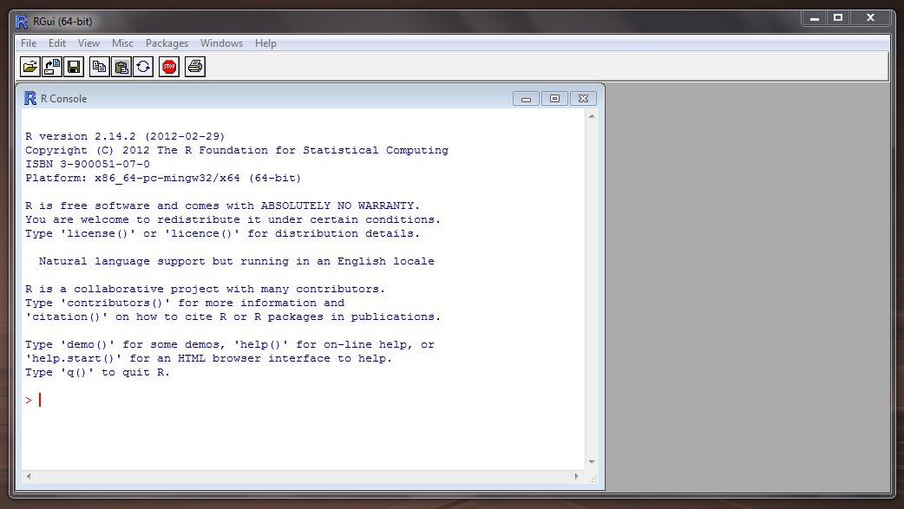

# (PART) Configuração {-}

# Instalação do R e RStudio {#install}


A interação do usuário com o  é por meio da linha de comando. Essa interação pode ser facilitada com o uso do software RStudio *Desktop*.

A seguir descreve-se como:

- instalar o  no Windows e no Linux Ubuntu

- manter o  sempre atualizado no Linux Ubuntu 

- configurar um diretório para armazenar os pacotes do R instalados

- instalar pacotes do 

- instalar o Rstudio *Desktop*

Neste livro, o maior foco na instalação do  é dada para o SO Linux [Ubuntu](https://pt.wikipedia.org/wiki/Ubuntu), pelo fato de assim como o R, ser um software livre e de código aberto. Como o Linux Ubuntu é baseado no [Debian](https://pt.wikipedia.org/wiki/Debian) o procedimento de instalação também se estende a essa distribuição Linux e as [versões derivadas do Ubuntu](https://pt.wikipedia.org/wiki/Ubuntu#Projetos_derivados) oficialmente reconhecidas. 

A instalação no SO Windows é igual a instalação de qualquer outro *software* e pode ser facilmente encontrada na internet. Por esta razão, somente indicou-se o caminho de instalação, sem as instruções detalhadas de instalação para este SO.


<div class="rmdtip">
<p>Ao instalar R e RStudio recomenda-se optar por instalar na língua inglesa. Assim quando surgir uma mensagem de erro durante o uso do software, basta usá-la numa pesquisa na internet para solucionar o problema. As chances de resolver o problema serão muito maiores se sua pesquisa for realizada em inglês.</p>
</div>

## Instalando o 

O  pode ser instalado a partir dos [binários pré-compilados](https://cran.r-project.org/bin/) ou do [código fonte](https://cran.r-project.org/sources.html). Aqui, descreve-se a instalação do  a partir dos arquivos binários.


### Windows 

O binário executável do  para o Windows está disponível na **Rede Abrangente de Arquivos do ** ([CRAN](https://cran.r-project.org/)) e pode ser baixado [aqui](http://cran.r-project.org/bin/windows/base/). 

Abra o executável e siga instruções de instalação do R mantendo todas as opções padrões.

No Windows a instalação do  inclui uma Interface Gráfica do Usuário (GUI) acessível pelo executável `RGui.exe` (Figura \@ref(fig:r-gui)). Um atalho para esse executável é gerado por *default* na área de trabalho com o símbolo do .

<div class="figure">

<p class="caption">(\#fig:r-gui)Interface gráfica do usuário no R para Windows.</p>
</div>


#### Atualização do  no Windows

Novas versões do R são disponibilizadas em geral com frequência de 5 vezes por ano. Recomenda-se manter o R atualizado, pois as novas versões incluem [aperfeiçoamentos e a correção de *bugs*](https://cran.r-project.org/bin/windows/base/NEWS.R-3.5.1.html).


As novas versões do  vem com os [pacotes padrões do R](https://cran.r-project.org/doc/manuals/R-FAQ.html#Which-add_002don-packages-exist-for-R_003f). Os demais pacotes instalados pelo usuário na versão anterior precisam ser reinstalados na nova versão do .


Para atualizar o  no Windows, ao invés de baixar o executável a cada nova versão e repetir o processo da seção anterior, você pode utilizar o pacote [**installr**](https://cran.r-project.org/web/packages/installr/index.html). A instalação de pacotes no  será vista na seção \@ref(install-pck).

### Linux 

#### Ubuntu

Há várias formas de instalar o  no Ubuntu, mas geralmente a versão compilada no repositório *default* do Ubuntu não é a última. Se isso não for problema para você então basta executar:


```r
sudo apt-get install r-base
```

Entretanto, os pacotes do  recém lançados são compilados para última versão do . Então você pode ter restrições ao uso de pacotes novos, os quais geralmente incluem o estado da arte de análise de dados. Por esta razão, abaixo mostra-se como instalar o  de forma que seja atualizado automaticamente pelo sistema.

#### R sempre atualizado

Se você quer trabalhar sempre com a última versão estável do , é possível configurar o Linux Ubuntu para atualizar automaticamente o . O procedimento de instalação requer senha de superusuário do sistema ou de privilégios [sudo](https://en.wikipedia.org/wiki/Sudo). Caso não tenha, consulte o administrador do sistema.

Ao utilizar distribuições Linux Ubuntu é importante optar por versões estáveis[^1]. As versões de Suporte de longo prazo (LTS) mais recentes são:

- 14.04 (abril de 2014, *codename* `trusty`) 
- 16.04 (abril de 2016, *codename* `xenial`)

[^1]: Clique [aqui](http://releases.ubuntu.com) para saber mais sobre as versões do Ubuntu.

 
A versão mais atual é a R version 3.4.4 (2018-03-15). Para que ele seja atualizado automaticamente no Ubuntu você precisa adicionar o endereço do [repósitório do R](http://cran.r-project.org/mirrors.html) mais próximo de sua região à lista de repositórios do Linux. No exemplo deste livro, o repositório mais próximo é o da UFPR (<http://cran-r.c3sl.ufpr.br/>).

##### Incluindo repositório do  na Lista de repositórios do Ubuntu

A lista de repositórios do sistema é armazenada no arquivo `/etc/apt/sources.list`. Mas primeiro, você precisa descobrir ou verificar o nome da versão do sistema operacional. Para isso, você pode utilizar o seguinte comando[^2] :


```
$ lsb_release --codename | cut -f2
```
```
trusty
```


[^2]: Se o comando `lsb_release` não funcionar você precisa instalar o pacote `lsb-release` no sistema. Para isso, digite no terminal Linux `sudo apt-get install lsb-release`.

Precisamos incluir no arquivo `sources.list` o espelho do repositório do R mais próximo. Veja a lista de espelhos de repositórios do  [aqui](https://cran.r-project.org/mirrors.html). Assim o gerenciador de pacotes 
[apt](http://pt.wikipedia.org/wiki/Advanced_Packaging_Tool)[^3] fará a atualização do  quando uma nova versão estiver disponível. Ou seja, você estará utilizando sempre versão mais atual do .

[^3]: o gerenciador de pacotes [apt](http://pt.wikipedia.org/wiki/Advanced_Packaging_Tool) é usado para instalação, atualização e remoção de pacotes em distribuições Debian GNU/Linux.

O endereço do repositório da UFPR será inserido na última linha do arquivo `sources.list` usando alguns comandos linux. Essa tarefa requer privilégios de [superusuário](https://pt.wikipedia.org/wiki/Superusu%C3%A1rio). Vamos trocar do seu usuário para o superusuário.


    $ sudo su


Vamos definir no terminal uma variável com o endereço do repositório (da UFPR nesse caso) e o nome de versão do Ubuntu.

    # repos="deb http://cran-r.c3sl.ufpr.br/bin/linux/ubuntu `lsb_release --codename | cut -f2`/"
 
Note que a variável `repos` é uma sequência de caracteres com as seguintes informações:

    deb `linkRepositorioSelecionado`/bin/linux/ubuntu `versaoUbuntu`/

O valor da variável `repos` é mostrado pelo comando: `echo $repos`. Certifique-se de que a última palavra corresponde ao nome da sua versão Ubuntu. 

Para acrescentar essa informação no final do arquivo `sources.list` digite no terminal linux:

    # echo $repos >> /etc/apt/sources.list

Feito isso, você pode retornar a sessão de usuário comum, usando o comando abaixo:

    # exit

##### [APT protegido](https://cran.r-project.org/bin/linux/ubuntu/README.html#secure-apt) 

Os arquivos binários do  para Ubuntu na [CRAN](http://cran.r-project.org) são assinados com uma chave pública [^4] Para adicionar essa chave ao seu sistema digite os seguintes comandos:

    $ gpg --keyserver hkp://keyserver.ubuntu.com:80 --recv-keys E084DAB9

[^4]: Chave pública de autenticação é um meio alternativo de se logar em um servidor ao invés de digitar uma senha. É uma forma mais segura e flexível, mas mais difícil de ser configurada. Esse meio alternativo de fazer login é importante se o computador está visível na internet. Para saber mais veja [aqui](http://the.earth.li/~sgtatham/putty/0.55/htmldoc/Chapter8.html).
        
e então use essa informação como entrada no `apt-key` com

    $ gpg -a --export E084DAB9 | sudo apt-key add -
      
Se aparecer a mensagem de que a chave pública foi importada, então não há necessidade de executar os comandos abaixo. Mas caso seja impresso alguma mensagem de erro, outra alternativa pode ser usada para obter a chave, via os comandos:

    $ gpg --keyserver keyserver.ubuntu.com --recv-key E084DAB9
    $ gpg -a --export E084DAB9 | sudo apt-key add -


##### Atualização da lista de repositórios do Ubuntu e instalação do 

Após fazer as configurações da lista de repositórios e adicionar a chave é necessário fazer a atualização dessa lista (requer poderes de super usuário):

    $ sudo apt-get update
    
Agora, pode instalar o binário do R:

    $ sudo apt-get install r-base

##### Testando o 

Para iniciar o  no Ubuntu, digite `R` no cursor do terminal:

    $ R

A partir desse momento já começamos uma sessão no . Vamos gerar uma sequência numérica de 1 a 10 e plotá-la.


```r
> 1:10
 [1]  1  2  3  4  5  6  7  8  9 10
> plot(1:10)
```

<div class="figure" style="text-align: center">

<p class="caption">(\#fig:Chunck4)Gráfico da sequência de 10 números.</p>
</div>

Você pode sair do , sem salvar os dados da seção, com o código a seguir:


```r
> q(save = "no")
```

#### Diretório para instalação de pacotes

Uma boa prática é definir um diretório para armazenamento dos pacotes utilizados. Isso lhe dá mais controle sobre os pacotes do  instalados no sistema. Um local sugerido é o `/home/usuario/.R/libs`. O seu `home` ou `pasta pessoal` pode ser obtido com o comando `echo $HOME`. Para criar o diretório você pode digitar o comando abaixo:

    $ mkdir -p `echo $HOME`/.R/libs/
    
Para informar ao  onde procurar os pacotes instalados, você precisa criar um arquivo chamado `.Renviron`, no diretório `$HOME`, contendo a expressão `R_LIBS=/home/usuario/.R/libs/`. Você pode fazer isso em um terminal com os comandos:

    $ R_LIBS=`echo $HOME/.R/libs/`
    $ echo $R_LIBS >> `echo $HOME/.Renviron`

Esse caminho fica então visível ao , o que pode ser verificado executando a função `.libPaths()` na linha de comando do . 

Abra o :

    $ R

e ao digitar:


```r
> .libPaths()
[1] "/home/hidrometeorologista/.R/libs" "/usr/local/lib/R/site-library"    
[3] "/usr/lib/R/site-library"           "/usr/lib/R/library"               
```
    
o seu diretório `/home/usuario/.R/libs` [^5] deve aparecer em primeiro lugar. Indicando que este local tem prioridade para instalação dos pacotes. Caso o diretório deixe de existir os seguintes diretórios serão usados.

[^5]: Diretórios precedidos por "." no Linux são diretórios ocultos. O diretório `/home/usuario/.R` é um diretório oculto, para visualizá-lo no Ubuntu, na interface gráfica do sistema, acesse *View > Show Hidden Files* (ou *Visualizar > Mostrar arquivos ocultos*). No terminal utilize `ls -a` para listar os arquivos ocultos.

## Pacotes do R {#install-pck}

Um pacote do R é uma coleção de funções, dados e documentação que estende as capacidades básicas do R.

### Da internet

#### CRAN {#install-cran}

A forma mais fácil de instalar uma pacote do R é através da função `install.packages("nome_do_pacote")`.

Por *default* o pacote informado é instalado a partir da ([CRAN](https://cran.r-project.org/))

A seguir você verá como instalar um pacote. Como exemplo instalaremos o pacote **remotes** que dispões de funções para instalar pacotes de repositórios remotos, como por exemplo do [GitHub](https://github.com/).


```r
install.packages("remotes")
```


Para ter acesso as funções disponibilizadas com o pacote você precisa carregar o pacote:


```r
library(remotes)
```

Apesar de precisar só instalar uma vez um pacote, você precisará carregá-lo a cada nova sessão.

Para desinstalar um pacote você pode usar a função `remove.packages("nome_do_pacote")`.

#### GitHub e R-forge {#install-github}

Nem todos pacotes são disponíveis na CRAN. Muitos desenvolvedores disponibilizam seus pacotes em plataformas como o [GitHub](https://github.com/) e [R-forge](https://r-forge.r-project.org/). As vezes um pacote pode  estar em ambos CRAN e GitHub (ou R-forge), mas a última versão - a de desenvolvimento - é somente disponibilizada no GitHub (ou R-forge). 

Para instalar um pacote de um repositório do GitHub usa-se a função `install_github()` do pacote **remotes**. Portanto, o pacote **remotes** precisa ser sido instalado primeiro (ver seção \@ref(install-cran)). 


A função para instalar um pacote do GitHub requer como argumento o nome do usuário e do repositório. Por exemplo, para instalar o pacote `inmetr` do repositório mantido pelo [lhmet](https://github.com/lhmet), usa-se:


```r
# install.packages("devtools")
# carrega o pacote devtools
library(remotes)
# instala o pacote inmetr do repositório 
# https://github.com/lhmet/inmetr 
install_github("lhmet/inmetr")
```


<div class="rmdtip">
<p>Você pode acessar uma função de um pacote instalado com a forma especial <code>pacote::funcao</code>. O trecho de código anterior poderia ser reduzido a:</p>
<p><code>remotes::install_github(&quot;lhmet/inmetr&quot;)</code></p>
<p>Essa forma deixa explícito que estamos usando a função <code>install_github()</code> do pacote <strong>remotes</strong>.</p>
<p>As vezes você pode estar com diversos pacotes carregados e eles podem ter funções de mesmo nome. Portanto essa é a alternativa mais segura de avaliar funções afim de evitar conflitos.</p>
</div>

Para instalar um pacote num repositório do R-forge, por exemplo o repositório do pacote [raster](https://r-forge.r-project.org/projects/raster/), usa-se:


```r
install.packages(
  "raster",  
  repos = "http://R-Forge.R-project.org",
  dependencies = TRUE
)
```

Alguns pacotes as vezes dependem de outros pacotes e para lidar com essas dependências define-se o argumento `dependencies = TRUE` na função `install.packages()`, como no trecho de código anterior. A função automaticamente resolverá as dependências do pacote, de forma que qualquer pacote dependente também será instalado.

#### Arquivo fonte local

Códigos fonte de pacotes do R são armazenados como arquivos com a extensão `.tar.gz`. Binários compilados são armazenados com a extensão `.zip`. Exemplo de arquivos como estes podem ser baixados manualmente da CRAN (veja a seção Downloads em https://cran.r-project.org/web/packages/ggplot2/index.html), GitHub ou R-forge.

Eventualmente um usuário pode instalar um pacote a partir desses arquivos localmente. Isto pode também ser feito  com a função `install.packages()`, especificando o argumento `repos = NULL` e o argumento `pkgs` com o caminho do arquivo. Por exemplo:


```r
install.packages("ggplot2_2.1.0.tar.gz", repos = NULL)
```


## RStudio no Ubuntu {#install-rstudio}

 é uma empresa que desenvolve ferramentas gratuitas para o  e [produtos pagos](https://www.rstudio.com/products/) para empresas.

Uma de suas ferramentas gratuitas é o software RStudio *Desktop* que consiste em um ambiente integrado de desenvolvimento ([IDE](http://en.wikipedia.org/wiki/Integrated_development_environment)) construído especificamente para o , consequentemente, também é multiplataforma.

Para instalação da versão do RStudio para *[Desktop](https://pt.wikipedia.org/wiki/Ambiente_de_desktop)*, você precisa saber se seu SO é 64 ou 32-bit e a versão do Linux Ubuntu. Essas informações podem ser obtidas, respectivamente, pelos comandos:

    $ arch

```
x86_64
```
Se retornar **x86_64** sua máquina é 64-bit.

    $ lsb_release --release | cut -f2

```
14.04
```

Com essas informações, siga os seguintes passos:

  1. acesse [RStudio](https://www.rstudio.com/products/rstudio/download/)
  2. clique em *Download* (Figura \@ref(fig:rstudio-choose))


<div class="figure" style="text-align: center">

<p class="caption">(\#fig:rstudio-choose)Opção para baixar o RStudio *Desktop*.</p>
</div>

  3. Clique na sua plataforma (de acordo com seu SO, arquitetura e versão da distribuição) (Figura \@ref(fig:rstudio-plat)), no exemplo deste livro *RStudio 1.1.447 - Ubuntu 12.04-15.10/Debian 8 (64-bit)*
  
<div class="figure" style="text-align: center">

<p class="caption">(\#fig:rstudio-plat)Escolha da plataforma em que será o usada o RStudio *Desktop*.</p>
</div>
  

  4. Dependendo da sua versão Ubuntu, ao clicar sobre o sobre o arquivo baixado com o botão direito, há a opção de abrir com *Ubuntu Software Center* e então clicar em `instalar`. Se na versão de seu *Desktop* não há esta opção ao clicar com botão direito sobre o arquivo, instale via **terminal**[^6] com os seguintes comandos:


[^6]: digite 'Ctrl+Alt+t' para abrir um terminal no Linux Ubuntu

```
$ cd /local/do/arquivo/baixado
$ sudo dpkg -i arquivoBaixado.deb
$ sudo apt-get install -f
```


Abra o RStudio digitando no terminal:

    $ rstudio &
    
Agora você está pronto para começar a programar em  aproveitando as facilidades que o [RStudio](http://www.rstudio.com/) oferece. 

