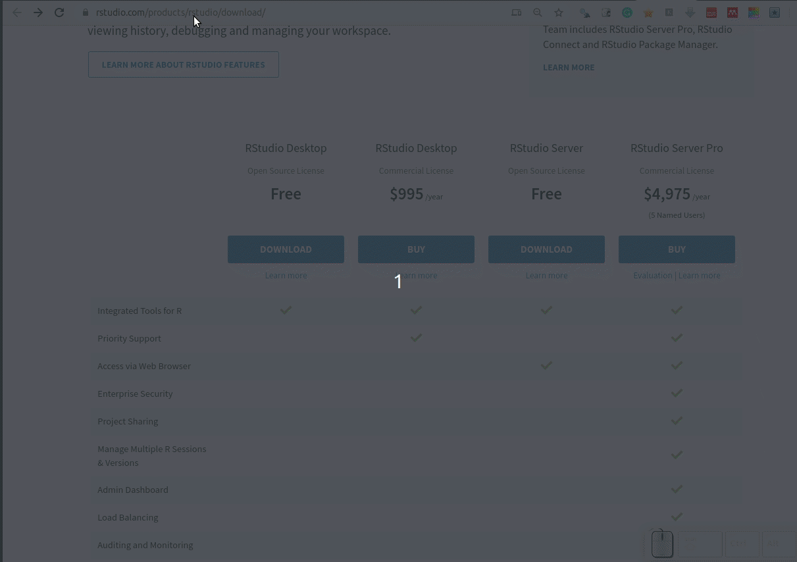
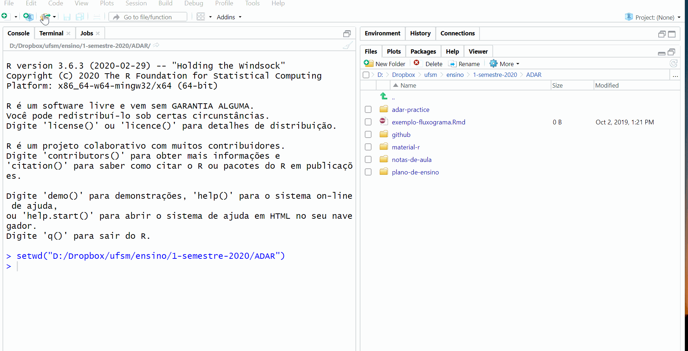

# (PART) Configuração do Sistema {-}


# Pré-requisitos

<!-- 
-->

<!-- 
# TOP formato de curso
https://uomresearchit.github.io/r-tidyverse-intro/
https://github.com/UoMResearchIT/r-tidyverse-intro


http://ohi-science.org/data-science-training/
https://github.com/lhmet-forks/data-science-training
https://github.com/NCEAS/oss-lessons
http://ohi-science.org/toolbox-training/index.html
https://github.com/ohi-science/toolbox-training


# Reproducible Analysis With R
https://github.com/NCEAS/sasap-training/tree/master/materials/reproducible-analysis-in-r 
https://datacarpentry.org/rr-workshop/

https://ropensci.org/blog/2019/07/11/commcall-jul2019/


https://github.com/lhmet-forks/r-eda-gapminder 
https://github.com/cambiotraining/r-intro/tree/master 
https://datacarpentry.org/R-ecology-lesson/00-before-we-start.html
-->


Para tirar melhor proveito deste livro, você precisará:

1. Das **versões atualizadas** do

    - : https://cloud.r-project.org
    
      - se estiver em SO Windows também precisará do programa
    [Rtools](https://cran.r-project.org/bin/windows/Rtools/index.html).

    - RStudio: https://rstudio.com/download 

    - Git: https://git-scm.com/downloads [^git-aviso] 

[^git-aviso]: ao baixar e seguir o processo normal de instalação no seu computador, você não verá nenhum software instalado quando você tiver terminado.  

2. Criar uma conta GitHub: https://github.com [^github-dica].

[^github-dica]: Procure escolher um nome curto para o seu usuário e que o identifique melhor.  

3. Criar uma conta no https://rstudio.cloud [^rstcloud-pq].

[^rstcloud-pq]: O RStudio Cloud será usado para você realizar atividades práticas no RStudio diretamente no seu navegador (sem ter que instalar ou configurar nada).  


## Instalação do R e RStudio {#install}

A interação do usuário com o  é por meio da linha de comando. A 
interface da linha de comando tem suas vantagens, mas você será mais produtivo 
com o uso de uma Interface de Desenvolvimento Integrado (IDE) como o RStudio *Desktop*.

A seguir veremos como:

- instalar o  nos SO Windows e Linux Ubuntu

- manter o  sempre atualizado no Linux Ubuntu 

- configurar um diretório para armazenar os pacotes do R instalados

- instalar pacotes 

- instalar o RStudio *Desktop*

Neste livro, o maior foco na instalação do  é dada para o SO Linux [Ubuntu](https://pt.wikipedia.org/wiki/Ubuntu), pelo fato de assim como o R, 
ser um software livre e de código aberto. Como o Linux Ubuntu é baseado no [Debian](https://pt.wikipedia.org/wiki/Debian) o procedimento de instalação 
também se estende a essa distribuição Linux e as [versões derivadas do Ubuntu](https://pt.wikipedia.org/wiki/Ubuntu#Projetos_derivados) oficialmente reconhecidas. 

A instalação no SO Windows é igual a instalação de qualquer outro *software* e
pode ser facilmente encontrada na internet. Por esta razão, somente indicou-se 
o caminho de instalação.

### Instalando o R

O  pode ser instalado a partir dos [binários pré-compilados](https://cran.r-project.org/bin/) ou do [código fonte](https://cran.r-project.org/sources.html). Nós veremos a instalação do  a partir dos arquivos binários.


#### Windows 

O binário executável do  para o Windows está disponível na **Rede Abrangente de Arquivos do ** ([CRAN](https://cran.r-project.org/)) e 
pode ser baixado [aqui](http://cran.r-project.org/bin/windows/base/). 

Abra o executável e siga instruções de instalação mantendo todas as opções 
padrões.

No Windows a instalação do  inclui uma Interface Gráfica do Usuário 
(GUI) acessível pelo executável `RGui.exe` (Figura \@ref(fig:r-gui)). Um atalho para esse executável é gerado por *default* na área de trabalho com o símbolo 
do .

<div class="figure">

<p class="caption">(\#fig:r-gui)Interface gráfica do usuário no R para Windows.</p>
</div>

Para instalar pacotes de plataformas diferentes da CRAN (veja seção \@ref(install-github)) é necessário instalar o programa [Rtools](https://cran.r-project.org/bin/windows/Rtools/index.html), 
selecionando a versão adequada para sua versão do . 


##### Atualização do R no Windows

Novas versões do R são disponibilizadas em geral com frequência de 5 vezes 
por ano. Recomenda-se manter o R atualizado, pois as novas versões incluem [aperfeiçoamentos e a correção de *bugs*](https://cran.r-project.org/bin/windows/base/NEWS.R-4.0.0.html).


As novas versões do  vem com os [pacotes padrões do R](https://cran.r-project.org/doc/manuals/R-FAQ.html#Which-add_002don-packages-exist-for-R_003f). Os demais pacotes instalados pelo usuário na versão anterior precisam ser reinstalados.

Para atualizar o  no Windows, ao invés de baixar o executável a 
cada nova versão e repetir o processo da seção anterior, você pode utilizar o pacote [**installr**](https://cran.r-project.org/web/packages/installr/index.html). A instalação de pacotes no  será vista na seção \@ref(install-pck).

#### Linux 

##### Ubuntu

<!-- 
#install the automatically tuned Atlas or the multi-threaded OpenBlas library in order to get higher performance for linear algebra operations
sudo apt-get install libatlas3-base libopenblas-base

link da cran sobre instalação do R no ubuntu
https://cran.rstudio.com/bin/linux/ubuntu/README.html 

# PPA
https://rubuntu.netlify.app/post/2018-05-25-announcing-c2d4u3-5/

# problemas com rjava
https://askubuntu.com/questions/1053726/r-cannot-install-rjava-what-is-r-api-3-4

sudo add-apt-repository ppa:marutter/c2d4u3.5
sudo apt update
sudo apt install r-cran-rjava

-->

Há várias formas de instalar o  no Ubuntu. Mas primeiro, caso você 
tenha alguma versão antiga do R, desinstale-a com:


```bash
$ sudo apt-get remove r-base-core
```

A forma mais fácil de instalar o  é usar a versão compilada no 
repositório *default* do Ubuntu. 


```bash
$ sudo apt-get install r-base
```

Entretanto, como o R é um projeto de evolução rápida, a versão estável mais recente [^rversion-recente] não está disponível nos repositórios do Ubuntu. Dessa forma, não conseguimos usufruir dos pacotes mais recentes 
(ou em desenvolvimento), que geralmente incluem o estado da arte da ciência de dados. Por esta razão, vamos instalar a última versão do  e de forma 
que seja atualizado automaticamente pelo sistema. Isto pode ser feito com os comandos a seguir.

[^rversion-recente]: A versão mais atual no período de elaboração deste texto 
foi a R 4.0.0.

1. Incluímos o endereço do repositório externo mantido pelo CRAN [^cran-mirror]
à lista de repositórios do sistema [^aviso-sudo].


[^cran-mirror]: Usando https://cloud.r-project.org automaticamente redireciona 
para o espelho da CRAN mais próximo. A lista de espelhos atual encontra-se em https://cran.r-project.org/mirrors.html.

[^aviso-sudo]: A execução destes comandos requer privilégios de [superusuário](https://pt.wikipedia.org/wiki/Superusu%C3%A1rio). Caso não 
tenha, consulte o administrador do sistema.


```bash
$ sudo touch /etc/apt/sources.list.d/cran.list
$ sudo sh -c "echo 'deb https://cloud.r-project.org/bin/linux/ubuntu `lsb_release -sc`-cran35/' >> /etc/apt/sources.list.d/cran.list" 
```


2. Adicionamos a chave de autenticação [^chavePub] do repositório.


[^chavePub]: Chave pública de autenticação é um meio alternativo de se logar
em um servidor ao invés de digitar uma senha. É uma forma mais segura e 
flexível, mas mais difícil de ser configurada. Esse meio alternativo de fazer login é importante se o computador está visível na internet. Para saber mais 
veja [aqui](http://the.earth.li/~sgtatham/putty/0.55/htmldoc/Chapter8.html).


```bash
$ sudo apt-key adv --keyserver keyserver.ubuntu.com --recv-keys E298A3A825C0D65DFD57CBB651716619E084DAB9
```

3. Atualizamos a lista de repositórios do sistema.


```bash
sudo apt-get update
```

4. Instalamos o R


```bash
$ sudo apt-get install -y r-base r-base-dev 
```


<!-- 
##### R sempre atualizado 

Se você quer trabalhar sempre com a última versão estável do , é possível configurar o Linux Ubuntu para atualizar automaticamente o . O procedimento de instalação requer senha de superusuário do sistema ou de privilégios [sudo](https://en.wikipedia.org/wiki/Sudo). Caso não tenha, consulte o administrador do sistema.

Ao utilizar distribuições Linux Ubuntu é importante optar por versões estáveis[^versoesubuntu]. As versões de Suporte de Longo Prazo (LTS) mais recentes são:

- 14.04: `trusty` 
- 16.04: `xenial`
- 18.04: `bionic`

[^versoesubuntu]: Clique [aqui](https://wiki.ubuntu.com/Releases) para saber mais sobre as versões do Ubuntu.

 
A versão mais atual é a 4.0.0. Para que ele seja atualizado automaticamente no Ubuntu você precisa adicionar o endereço https://cloud.r-project.org/bin/linux/ubuntu que automaticamente redireciona para o espelho da CRAN mais próximo à lista de repositórios do Linux.

###### Incluindo repositório do  na Lista de repositórios do Ubuntu

O primeiro passo é descobrir o nome da versão UBUNTU instalada. Para isso, você pode utilizar o seguinte comando[^ubuntuname] :


```
$ lsb_release -sc
```
```
bionic
```

[^ubuntuname]: Se o comando `lsb_release` não funcionar você precisa instalar o pacote `lsb-release` no sistema. Para isso, digite no terminal Linux `sudo apt-get install lsb-release`.

O endereço do espelho da CRAN e algumas configurações do sistema podem ser inseridas num arquivo em `/etc/apt/sources.list.d/cran.list`. Essa tarefa requer privilégios de [superusuário](https://pt.wikipedia.org/wiki/Superusu%C3%A1rio). Vamos trocar do seu usuário para o superusuário.

    $ sudo su

Após o comando, informe a senha de superusuário e então vamos criar o arquivo `/etc/apt/sources.list.d/cran.list`.

    # touch /etc/apt/sources.list.d/cran.list

Vamos definir no terminal uma variável chamada `repos` que será composta pelo endereço do espelho[^cran-mirrors], o nome da versão do Ubuntu e o sufixo `-cran35`. Este sufixo é para obter a última versão do pacote R 3.6 para Ubuntu. 

    # repos="deb https://cloud.r-project.org/bin/linux/ubuntu `lsb_release -sc`-cran35/"
    
[^cran-mirrors]: Usando https://cloud.r-project.org automaticamente redireciona para o espelho da CRAN mais próximo. A lista de espelhos atual encontra-se em https://cran.r-project.org/mirrors.html.

O valor da variável `repos` é mostrado pelo comando: `echo $repos`. Certifique-se de que a última palavra corresponde ao nome da sua versão Ubuntu.


Adicionamos o conteúdo da `repos` ao arquivo cran.list usando o comando:

    # echo $repos >> /etc/apt/sources.list.d/cran.list

Assim o gerenciador de pacotes 
[apt](http://pt.wikipedia.org/wiki/Advanced_Packaging_Tool)[^wikiped-apt] fará a atualização do  quando uma nova versão estiver disponível. Ou seja, você estará utilizando sempre versão mais atual do .

[^wikiped-apt]: o gerenciador de pacotes [apt](http://pt.wikipedia.org/wiki/Advanced_Packaging_Tool) é usado para instalação, atualização e remoção de pacotes em distribuições Debian GNU/Linux.


Feito isso, você podemos retornar a sessão de usuário comum:

    # exit


###### [APT protegido](https://cran.r-project.org/bin/linux/ubuntu/README.html#secure-apt) 

Os arquivos binários do  para Ubuntu na [CRAN](http://cran.r-project.org) são assinados com uma chave pública [^pub-key]. Para adicionar essa chave ao seu sistema digite os seguintes comandos:

    $ gpg --keyserver hkp://keyserver.ubuntu.com:80 --recv-keys E298A3A825C0D65DFD57CBB651716619E084DAB9

    $ gpg -a --export E298A3A825C0D65DFD57CBB651716619E084DAB9 | sudo apt-key add -

[^pub-key]: Chave pública de autenticação é um meio alternativo de se logar em um servidor ao invés de digitar uma senha. É uma forma mais segura e flexível, mas mais difícil de ser configurada. Esse meio alternativo de fazer login é importante se o computador está visível na internet. Para saber mais veja [aqui](http://the.earth.li/~sgtatham/putty/0.55/htmldoc/Chapter8.html).

Se aparecer uma mensagem **OK** a chave foi adicionada com sucesso e os comandos a seguir podem ignorados. Porém, se aparecer uma mensagem do tipo *keyserver error*, utilize o seguinte comando:

    $ sudo apt-key adv --keyserver keyserver.ubuntu.com --recv-keys E298A3A825C0D65DFD57CBB651716619E084DAB9

Caso seja impresso alguma mensagem de erro, outra alternativa pode ser usada para obter a chave, via os comandos:

    $ gpg --keyserver keyserver.ubuntu.com --recv-key E298A3A825C0D65DFD57CBB651716619E084DAB9
    
    $ gpg -a --export E298A3A825C0D65DFD57CBB651716619E084DAB9 | sudo apt-key add -


###### Atualização da lista de repositórios do Ubuntu e instalação do 

Após fazer as configurações da lista de repositórios e adicionar a chave é necessário fazer a atualização dessa lista (requer poderes de super usuário):

    $ sudo apt-get update
    
Finalmente, instalamos o binário do R, a coleção de pacotes recomendados e ferramentas de desenvolvimento:

    $ sudo apt-get -y install r-base r-base-dev
-->


<!---
referências

https://www.digitalocean.com/community/tutorials/how-to-install-r-on-ubuntu-18-04

https://askubuntu.com/questions/218708/installing-latest-version-of-r-base

 https://stackoverflow.com/questions/46704247/upgrade-r-in-ubuntu-xenial
 https://gist.github.com/mGalarnyk/41c887e921e712baf86fecc507b3afc7
 https://askubuntu.com/questions/1162051/i-am-unable-to-install-latest-version-of-r 
 https://rtask.thinkr.fr/installation-of-r-3-5-on-ubuntu-18-04-lts-and-tips-for-spatial-packages/
 https://yiweiniu.github.io/blog/2019/07/Install-Update-R-and-R-packages/
 https://shiny.rstudio.com/articles/upgrade-R.html

# for r dev packages
sudo add-apt-repository ppa:marutter/rrutter3.5
sudo add-apt-repository ppa:marutter/c2d4u
sudo apt-get update
sudo apt-get -y install r-base-core r-recommended r-base-dev

# run apt-get update and then check via apt-cache policy r-base-core
apt-cache policy r-base-core

sudo apt install r-cran-rgl r-cran-rjags r-cran-snow r-cran-ggplot2 r-cran-igraph r-cran-lme4 r-cran-rjava r-cran-devtools r-cran-roxygen2 r-cran-rjava r-cran-xlsx

# pacotes mais usados
c("tidyverse", 
  "data.table",
  "knitr",
  "rstudioapi",
  
  )

rlang > Rcpp > backports > vctrs > glue > tibble > tidyselect> dplyr > purrr
nlme > lattice > broom

‘broom’, ‘dbplyr’, ‘haven’, ‘hms’, ‘modelr’, ‘reprex’, ‘rvest’, ‘tidyr’
--->


Para iniciar o  no Linux, digite `R` no cursor do terminal:

    $ R

A partir desse momento já começamos uma sessão no . Vamos gerar uma sequência numérica de 1 a 10 e plotá-la.


```r
> 1:10
 [1]  1  2  3  4  5  6  7  8  9 10
> plot(1:10)
```

<div class="figure" style="text-align: center">

<p class="caption">(\#fig:Chunck4)Gráfico da sequência de 10 números.</p>
</div>

Após este teste, podemos sair do , sem salvar os dados da seção, com a expressão abaixo:


```r
> q(save = "no")
```

#### Diretório para pacotes instalados pelo usuário

Os pacotes que vem com os pacotes *r-base* e *r-recommended* são instalados no diretório `/usr/lib/R/library`. Estes pacotes são atualizados pelo sistema [^update-rbase] ou usando `sudo apt-get update && sudo apt-get upgrade`.

[^update-rbase]: Por ser atualizado automaticamente pelo sistema, às vezes o usuário nem percebe que a versão do R mudou.

Uma boa prática para os pacotes R instalados pelo usuário é definir um diretório específico. Isso lhe dá mais controle sobre os pacotes do  instalados no sistema. Um local sugerido é o `/home/usuario/.R/libs`. O seu `home` ou `pasta pessoal` pode ser obtido com o comando `echo $HOME`. Para criar o diretório você pode digitar o comando abaixo:


```bash
$ mkdir -p `echo $HOME`/.R/libs/
```

Para informar ao  onde procurar os pacotes instalados, você precisa criar um arquivo chamado `.Renviron`, no diretório `$HOME`, contendo a expressão `R_LIBS=/home/usuario/.R/libs/`. Você pode fazer isso em um terminal com os comandos:


```bash
$ R_LIBS=`echo $HOME/.R/libs/`
$ echo $R_LIBS >> `echo $HOME/.Renviron`
```


Esse caminho fica então visível ao , o que pode ser verificado executando a função `.libPaths()` na linha de comando do . 

Abra o :


```bash
$ R
```

e ao digitar:


```r
> .libPaths()
[1] "C:/Users/bitev/Documents/R/win-library/3.6"
[2] "C:/Program Files/R/R-3.6.3/library"        
```
    
o seu diretório `/home/usuario/.R/libs` [^rlibs] deve aparecer em primeiro lugar. Indicando que este local tem prioridade para instalação dos pacotes. Caso o diretório deixe de existir os diretórios seguintes  serão usados.

[^rlibs]: Diretórios precedidos por "." no Linux são diretórios ocultos. O diretório `/home/usuario/.R` é um diretório oculto, para visualizá-lo no Ubuntu, na interface gráfica do sistema, acesse *View > Show Hidden Files* (ou *Visualizar > Mostrar arquivos ocultos*). No terminal utilize `ls -a` para listar os arquivos ocultos.


## Instalação de Pacotes {#install-pck}

Um pacote do  é uma coleção de funções, dados e documentação que estende as funcionalidades básicas do R, muito além do que se poderia imaginar. Os pacotes são desenvolvidos pela comunidade do  formada por vários contribuidores. 

<!-- 
http://www.sthda.com/english/wiki/installing-and-using-r-packages 
https://www.datacamp.com/community/tutorials/r-packages-guide
-->

### Da internet

#### CRAN {#install-cran}

A forma mais fácil de instalar uma pacote do R é através da função `install.packages("nome_do_pacote")`.

Por *default* o pacote informado é instalado a partir do repositório oficial de distribuição de pacotes: a ([CRAN](https://cran.r-project.org/)). A CRAN é uma rede de servidores e FTP distribuídas pelo mundo e mantida pela comunidade . A [Fundação R](https://www.r-project.org/foundation/) coordena a CRAN e estabelece diversos testes para assegurar que os pacotes publicados sigam as [políticas da CRAN](https://cran.r-project.org/web/packages/policies.html).

Agora veremos como instalar um pacote. Como exemplo instalaremos o pacote [remotes](https://cran.r-project.org/web/packages/remotes/index.html) que dispõe de funções para instalar pacotes de repositórios remotos, como por exemplo do [GitHub](https://github.com/).


```r
install.packages("remotes")
```

<!-- 
Package Installation from Remote Repositories, Including 'GitHub'
sudo apt-get libssl-dev 
see https://www.rstudio.com/products/rpackages/devtools/ 
  The OpenSSL library that is required to 
  build git2r was not found. 
  Please install: 
libssl-dev    (package on e.g. Debian and Ubuntu) 
openssl-devel (package on e.g. Fedora, CentOS) 
openssl       (Homebrew package on OS X) 
-->


Para ter acesso as funções disponibilizadas com o pacote você precisa carregar o pacote:


```r
library(remotes)
```

Apesar de precisar só instalar uma vez um pacote, você precisará carregá-lo a cada nova sessão.

Para desinstalar um pacote você pode usar a função `remove.packages("nome_do_pacote")`.

#### GitHub e R-forge {#install-github}

Nem todos pacotes são disponíveis na CRAN. Muitos desenvolvedores disponibilizam seus pacotes em plataformas como o [GitHub](https://github.com/) e [R-forge](https://r-forge.r-project.org/). As vezes um pacote pode  estar em ambos CRAN e GitHub (ou R-forge), mas a última versão - a de desenvolvimento - é somente disponibilizada no GitHub (ou R-forge). 

Para instalar um pacote de um repositório do GitHub usa-se a função `install_github()` do pacote **remotes**. Portanto, o pacote **remotes** precisa ser sido instalado primeiro (ver seção \@ref(install-cran)). 


<!-- 
#Antes de instalar o pacote **devtools**, usuários Windows precisam instalar o programa [Rtools](https://cran.r-project.org/bin/windows/Rtools/index.html). 
-->

A função para instalar um pacote do GitHub requer como argumento o `nome do usuário/nome do repositório`. Por exemplo, para instalar o pacote `inmetr` do repositório mantido pelo [lhmet](https://github.com/lhmet), usa-se:


```r
library(remotes)
# instala o pacote inmetr do repositório 
# https://github.com/lhmet/inmetr 
install_github("lhmet/inmetr")
```


<div class="rmdtip">
<p>Você pode acessar uma função de um pacote instalado com a forma especial <code>pacote::funcao</code>. O trecho de código anterior poderia ser reduzido a:</p>
<p><code>remotes::install_github("lhmet/inmetr")</code></p>
<p>Essa forma deixa explícito que estamos usando a função <code>install_github()</code> do pacote <strong>remotes</strong>.</p>
<p>As vezes você pode estar com diversos pacotes carregados e eles podem ter funções de mesmo nome. Portanto, essa é a alternativa mais segura de avaliar funções afim de evitar conflitos.</p>
</div>

Para instalar um pacote num repositório do R-forge, por exemplo o repositório do pacote [raster](https://r-forge.r-project.org/projects/raster/), usa-se:


```r
install.packages(
  "raster",  
  repos = "http://R-Forge.R-project.org"
)
```


#### Arquivo fonte local

Códigos fonte de pacotes do R são armazenados como arquivos com a extensão `.tar.gz`. Binários compilados são armazenados com a extensão `.zip`. Exemplo de arquivos como estes podem ser baixados manualmente da CRAN (veja a seção Downloads em por exemplo, https://cran.r-project.org/web/packages/remotes/index.html), no [GitHub](https://github.com/r-lib/remotes/releases) ou R-forge.

Eventualmente um usuário pode instalar um pacote a partir desses arquivos localmente. Isto pode também ser feito  com a função `install.packages()`, especificando o argumento `repos = NULL` e o argumento `pkgs` com o caminho do arquivo. Por exemplo:


```r
install.packages("remotes_2.1.1.tar.gz", repos = NULL)
```


### Atualização de pacotes 

Se o seu  foi atualizado, os pacotes da versão prévia do  devem ser reinstalados para evitar problemas de compatibilidade. O comando abaixo atualiza todos pacotes para a última versão. A opção `checkbuild = TRUE` reinstala os pacotes que foram construídos uma versão mais antiga que a do  atual. 


```r
update.packages(checkBuilt=TRUE, ask=FALSE)
```

Se você usa muitos pacotes, este processo pode tornar-se trabalhoso e problemático, devido a cadeia de dependências de alguns pacotes. Por esta razão, há pacotes para facilitar este processo, como o [rvcheck](https://github.com/GuangchuangYu/rvcheck).


```r
install.packages("rvcheck")
```

Com o [rvcheck](https://github.com/GuangchuangYu/rvcheck) podemos:

- checar a versão mais recente do R


```r
library(rvcheck)
check_r()
## $installed_version
## [1] "R-3.6.3"
## 
## $latest_version
## [1] "R-4.0.0"
## 
## $latest_url
## [1] "https://cran.r-project.org/src/base/R-4/R-4.0.0.tar.gz"
## 
## $up_to_date
## [1] FALSE
```

- checar a versão mais atual de um pacote na CRAN, no GitHub ou no Bioconductor


```r
check_cran('dplyr')
## package is up-to-date release version
## $package
## [1] "dplyr"
## 
## $installed_version
## [1] "0.8.5"
## 
## $latest_version
## [1] "0.8.5"
## 
## $up_to_date
## [1] TRUE
check_github('lhmet/inmetr')
## package is up-to-date devel version
## $package
## [1] "lhmet/inmetr"
## 
## $installed_version
## [1] '0.3.0.9000'
## 
## $latest_version
## [1] "0.3.0.9000"
## 
## $up_to_date
## [1] TRUE
check_bioc('EBImage')
## ## EBImage is not installed...
## install.packages("BiocManager")
## BiocManager::install("EBImage")
## $package
## [1] "EBImage"
## 
## $installed_version
## [1] NA
## 
## $latest_version
## [1] "4.28.1"
## 
## $up_to_date
## [1] NA
```

Por fim, para atualizar todos os pacotes:


```r
update_all(check_R = TRUE)
```


<div class="rmdtip">
<p>Se você precisa manter a versão dos seus pacotes em uma nova versão do R, o pacote <a href="https://github.com/MangoTheCat/pkgsnap">pkgsnap</a> é uma solução. Esta opção é útil para evitar que mudanças nas versões dos pacotes possam fazer com que seu código se comporte de maneira diferente.</p>
</div>

## Pacotes necessários e dependências

Ao longo deste livro serão usados diversos pacotes para o processamento de dados ambientais. A maioria dos pacotes não vêm com o .

Alguns pacotes dependenm de bibliotecas do Linux e precisamos instalá-las antes da instalação no . 


```bash
$ sudo apt-get install libnetcdf-dev netcdf-bin libudunits2-dev libssl-dev
```


```r
pcks <- c(
  "easypackages",
  "rmarkdown",
  "knitr",
  "pander", 
  "htmlTable",
  "styler",
  "tidyverse", 
  "rio",   # instala readxl, openlxlsx, data.table, foreign, haven, feather, 
           # readODS, jsonlite, rmatio
  "writexl",
  "microbenchmark",
  "ncdf4",
  "raster",
  "openair",
  "lubridate",
  "fields",
  "viridis",
  "WriteXLS",
  "gcookbook"
  )

pcks_dev <- c(
  "vembedr",
  "inmetr"
)
```


```r
install.packages(pcks) 
```


<!-- 
# rJava
https://github.com/hannarud/r-best-practices/wiki/Installing-RJava-(Ubuntu)
# java -version
# sudo R CMD javareconf
$ sudo add-apt-repository ppa:marutter/c2d4u3.5
$ sudo apt-get update
$ sudo apt-get upgrade
The following packages will be upgraded:
  binutils binutils-common binutils-x86-64-linux-gnu gnome-software gnome-software-common gnome-software-plugin-snap libbinutils
  libpulse-mainloop-glib0 libpulse0 libpulse0:i386 libpulsedsp openjdk-11-jdk openjdk-11-jdk-headless openjdk-11-jre
  openjdk-11-jre-headless pulseaudio pulseaudio-module-bluetooth pulseaudio-utils r-cran-boot r-cran-class r-cran-codetools
  r-cran-foreign r-cran-lattice r-cran-mass r-cran-matrix r-cran-mgcv r-cran-nlme r-cran-nnet r-cran-spatial r-cran-survival
  ubuntu-software
31 upgraded, 0 newly installed, 0 to remove and 0 not upgraded.
$ sudo apt-get install r-cran-rjava
-->


## RStudio no Ubuntu {#install-rstudio}

RStudio é uma empresa que desenvolve ferramentas gratuitas para o  e [produtos pagos](https://www.rstudio.com/products/) para empresas.

Uma de suas ferramentas gratuitas é o software RStudio *Desktop* que consiste em um ambiente integrado de desenvolvimento ([IDE](http://en.wikipedia.org/wiki/Integrated_development_environment)) construído especificamente para o . Ele funciona é multiplataforma (servidores inclusive) e fornece diversos recursos, como a integração com controle de versão e manejo de projetos.

Para instalação da versão do [RStudio Desktop](https://rstudio.com/products/rstudio/#rstudio-desktop), você precisa saber se seu SO é 64 ou 32-bit e a versão do Linux Ubuntu. Essas informações podem ser obtidas, respectivamente, pelos comandos:


```bash
$ arch
```

```
x86_64
```
Se retornar **x86_64** sua máquina é 64-bit [^32bit].

[^32bit]: Se seu sistema for 32 bit, você pode usar [versões antigas do rstudio](https://rstudio.com/products/rstudio/older-versions/) 


```bash
$ lsb_release -sr
```

```
18.04
```

Com essas informações, você pode selecionar o [RStudio](https://www.rstudio.com/products/rstudio/download/) adequado para o seu sistema e baixá-lo (Figura \@ref(fig:rstudio-download)). 


<div class="figure" style="text-align: center">

<p class="caption">(\#fig:rstudio-download)Opção para baixar o RStudio *Desktop*.</p>
</div>


Ao clicar sobre o arquivo baixado com o botão direito, há a opção de abrir com *Ubuntu Software Center* e então clicar em `instalar`. Se no seu sistema não houver esta opção, instale via **terminal**[^atalho-term] com os seguintes comandos:

[^atalho-term]: digite <kbd>Ctrl</kbd>+<kbd>Alt</kbd>+<kbd>t</kbd> para abrir um terminal no Linux Ubuntu

```
$ cd /local/do/arquivo/baixado/rstudio-x.y.zzzz-amd64.deb
$ sudo dpkg -i rstudio-x.y.zzzz-amd64.deb
$ sudo apt-get install -f
```

Abra o RStudio digitando no terminal:

    $ rstudio &
    
Agora você está pronto para começar a programar em  aproveitando as facilidades que o [RStudio](http://www.rstudio.com/) oferece. 

## Git e Github

<!-- 
http://ohi-science.org/data-science-training/github.html 
https://www.hostinger.com.br/tutoriais/o-que-github/
-->

[Git](https://git-scm.com/book/pt-br/v2/Come%C3%A7ando-Sobre-Controle-de-Vers%C3%A3o) é um sistema de controle de versão que permite você rastrear as mudanças feitas em arquivos. Estes arquivos podem ser de qualquer tipo (`.R`, `.Rmd`, `.doc`, `.pdf`, `.xls`), mas a visualização das diferenças em arquivos texto é mais fácil (`.txt`, `.csv`, `.md`). Na prática, você verá o **`git`** como um conjunto de comandos que você executa na shell [^whatishell]. 

[^whatishell]: Shell é um programa que roda outros programas, sendo popularmente chamado de \"linha de comando"\, \"console\" ou \"terminal\".

O [GitHub](https://github.com/) é um dos maiores depósitos online de trabalho colaborativo do mundo. Ele é a rede social dos programadores. Nele você pode ver no que eles estão trabalhando, ler facilmente o código deles e fazer sugestões ou alterações. Isso só possível porque sua plataforma inclui um sistema de gerenciamento de projetos e de versões de códigos (**`git`**). 

### Instalação do **`git`**

Acesse https://git-scm.com/downloads e selecione para baixar a opção do **`git`** adequada para seu SO.

#### Windows

Para instalar o **`git`** proceda a instalação como a de qualquer outro programa, aceitando as opções padrão. Ao terminar, verifique a instalação abrindo o **`gitbash`** (acessível no menu iniciar) e digitando `git --version`.

#### Ubuntu

A instalação do git no Ubuntu pode ser feita com os comandos abaixo:

```bash
# atualização da lista de repositórios ubuntu
$ sudo apt-get update
# instalação do Git
$ sudo apt-get install git
```


Ao terminar, verifique a instalação digitando num terminal o comando `git --version`. A versão disponível nos repositórios do Windows 10 x64 quando este livro foi escrito era a `gsub("git version ", "", system("git --version", intern = TRUE))`.


#### Git no RStudio

Nesta seção vamos usar a funcionalidade do **`git`** através do RStudio. Um procedimento muito comum em um projeto com controle de versão é clonar um repositório do **`github`** (repositório remoto) para o seu computador (repositório local). Neste exemplo será usado o repositório remoto `lhmet/gittutor-adar`. Siga as instruções a seguir para reproduzir este processo.

Abra o RStudio, acesse *`File ▶ New Project ▶ Version Control`* .

- Em *Repository URL* insira `https://github.com/lhmet/gittutor-adar` 

- Em *Create project as subdirectory of:*: navegue até a pasta onde deseja salvar o diretório que conterá o repositório [^pasta-adar]. 

[^pasta-adar]: Sugere-se salvar o projeto numa subpasta nomeado **github** localizado na pasta com o material do curso de ADAR ;)

- Clique em *Create Project* e siga os passos indicados na Figura \@ref(fig:git-proj-rstudio).


<div class="figure" style="text-align: center">

<p class="caption">(\#fig:git-proj-rstudio)Procedimentos para clonar um repositório do github no seu computador.</p>
</div>


Após estes procedimentos você tem o **`git`** instalado e já sabe como clonar um repositório do **`github`** em um diretório do seu computador. 


