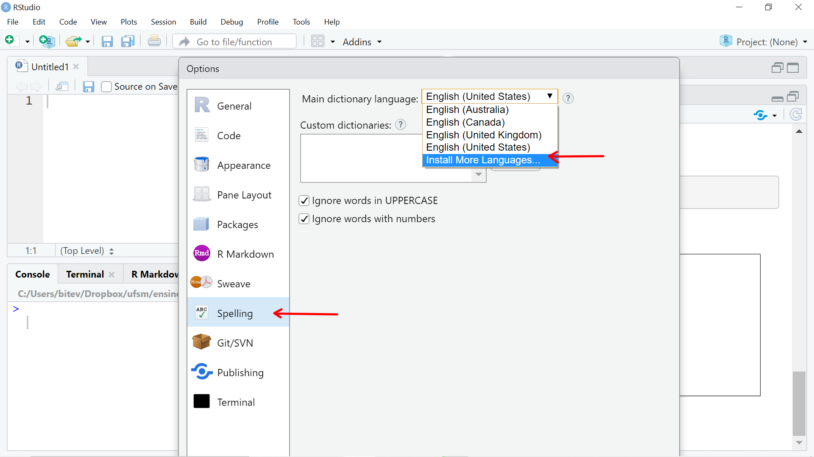
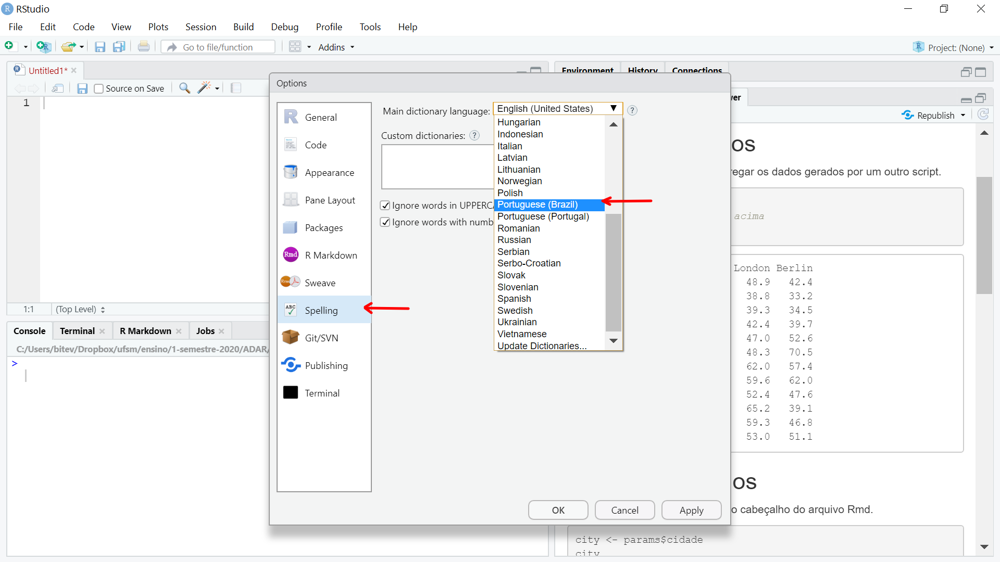

# RStudio {#rstudio}

<!-- 

https://itsfoss.com/install-r-ubuntu/ 

-->


O RStudio *Desktop* é um ambiente integrado de desenvolvimento (IDE) para o . Portanto, o RStudio depende da instalação prévia do . Ele funciona como uma interface gráfica do usuário (GUI), mas com muito mais potencialidades.

O RStudio é uma ferramente que potencializará sua interação com o :

- na produção de gráficos

- na organização de seu código na forma de projetos

- na reprodutibilidade de seu trabalho ou pesquisa 

- na manutenção e criação de seus próprios pacotes do R

- na criação e compartilhamento de seus relatórios

- no compartilhamento de seu código e a colaboração com outros

Nessa seção você terá uma visão geral do RStudio *Desktop*.

## Visão geral do RStudio

Assumindo que o RStudio tenha sido instalado (seção \@ref(install-rstudio)), ao abri-lo e clicar em *`File ▶ New File ▶ R Script`* você verá uma tela com aspecto similar ao da Figura \@ref(fig:rstudio-fig).

<div class="figure">

<p class="caption">(\#fig:rstudio-fig)Rstudio</p>
</div>

O RStudio possui 4 painéis principais:

  1. Editor para scripts e visualização de dados

     - abrir e criar scripts
     
     - rodar scripts
     
     - código com sintaxe realçada
     
     - rodar partes do código  <kbd>Ctrl</kbd>+<kbd>Enter</kbd>
     
     - rodar todo script <kbd>Ctrl</kbd>+<kbd>Shift</kbd>+<kbd>s</kbd> 
     
     - autopreenchimento das funções <kbd>Tab</kbd> 
     
     - comentar linhas de um script <kbd>Ctrl</kbd>+<kbd>Shift</kbd>+<kbd>c</kbd>  
     
     - desfazer <kbd>Ctrl</kbd>+<kbd>z</kbd>  
     
     - refazer <kbd>Ctrl</kbd>+<kbd>Shift</kbd>+<kbd>z</kbd>  
     
     - referência para teclas de atalho <kbd>Alt</kbd>+<kbd>Shift</kbd>+<kbd>k</kbd>  
     
     - abrir script cujo nome aparece no código em visualização no painel *Source* <kbd>Ctrl</kbd>+<kbd>click</kbd>
     
     - buscar e substituir termos <kbd>Ctrl</kbd>+<kbd>f</kbd>
     
     - comentar texto em R Markdown <kbd>Ctrl</kbd>+<kbd>Shift</kbd>+<kbd>c</kbd>
     

2. Console do R


3. Navegador do espaço de trabalho e histórico de comandos


4. Arquivos/Plots/Pacotes/Ajuda/Visualizador


Configuração de texto e painéis em:

* Menus
    *`Tools ▶ Global Options ▶ Appearance`*
        * mostrar linhas, alterar realce da sintaxe
        * Session
        * Plots


A **Folha de referência do RStudio** (Figura \@ref(fig:rstudio-cheat-sheet))) fornece uma visão geral das suas principais funcionalidades.

<div class="figure" style="text-align: center">

<p class="caption">(\#fig:rstudio-cheat-sheet)Folha de referência do RStudio, disponível em https://www.rstudio.com/wp-content/uploads/2016/03/rstudio-IDE-cheatsheet-portuguese.pdf</p>
</div>


## Verificação ortográfica

O RStudio oferece o recurso de verificação ortográfica do texto. No caso de línguas diferentes da Inglesa é necessário instalar os dicionários para outras línguas. Os dicionários podem ser instalados indo em *`Tools ▶ Global Options`*, selecionando *`Spelling`* no painel à esquerda e *`Install More Languages`* na caixa de seleção dos dicionários de línguas (Figura \@ref(fig:rstudio-spell-config)). Dessa forma, os dicionários de 28 linguagens serão instalados.


<div class="figure" style="text-align: center">

<p class="caption">(\#fig:rstudio-spell-config)Configuração do RStudio para instalar dicionários de outras línguas.</p>
</div>

Após a adição dos dicionários, acesse novamente a caixa de seleção de dicionários e selecione `Portuguese (Brazil)` e depois clique em `ok` (Figura \@ref(fig:rstudio-set-dict)).

<div class="figure" style="text-align: center">

<p class="caption">(\#fig:rstudio-set-dict)Configuração do dicionário de Portugês-BR  no RStudio.</p>
</div>

Agora você pode evitar erros ortográficos nos seus relatórios e demais documentos escritos em R Markdown através da tecla `F7` (ou *`Edit ▶ Check Spelling`*).


<!-- rstudio.cloud -->


<!--
### Configurando dicionários customizados 

Se você quer usar um diferente variação de dicionário ou algum dicionário customizado, siga as orientações disponibilizadas no [suporte do RStudio](https://support.rstudio.com/hc/en-us/articles/200551916-Spelling-Dictionaries) e na vinheta do pacote [hunspell](https://docs.ropensci.org/hunspell/articles/intro.html#hunspell-dictionaries).


A instalação do dicionário de Português-brasileiro no Debian ou Ubuntu requer o pacote `hunspell-pt-br`: 


```bash
> sudo apt-get install hunspell-pt-br
```

A verificação de que o dicionário foi instalado pode ser feita se ele aparece listado pelo comando abaixo.


```bash
> ll /usr/share/hunspell
```
-->


