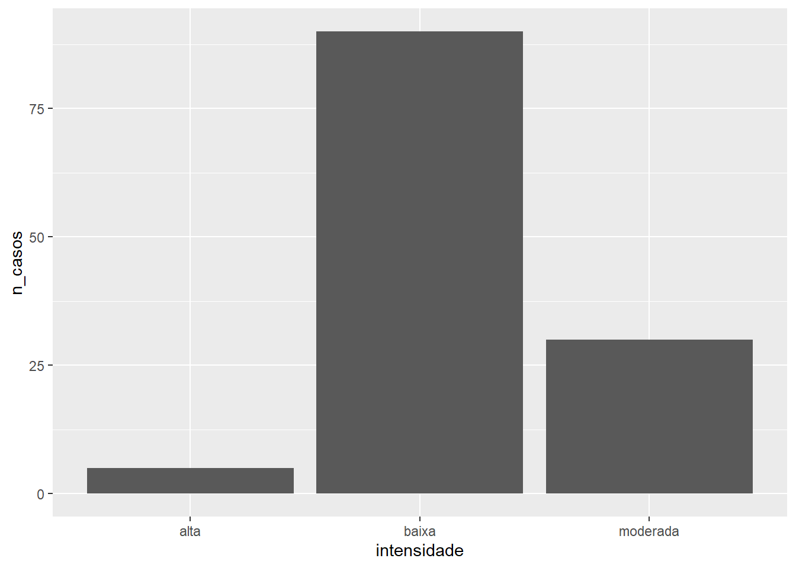
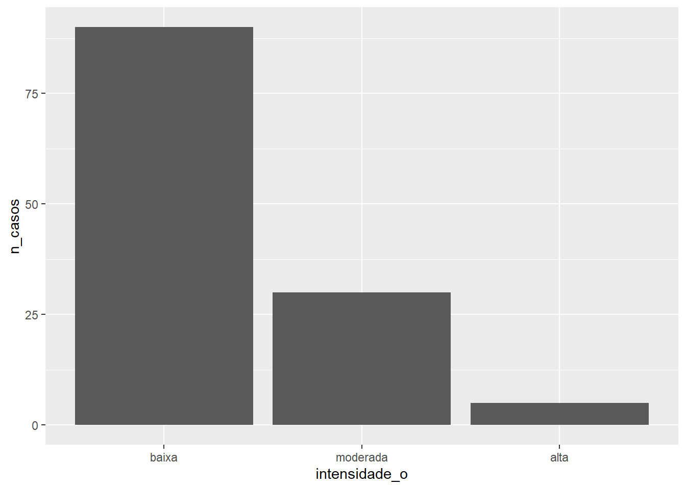

# Tipos básicos de dados {#datatype}


Neste capítulo vamos:

- aprender a criar vetores
- conhecer os tipos de dados mais usados no R
- descobrir qual é o tipo de dado de uma variável
- saber como converter uma variável de um tipo para outro


<!-- 
faltando: 
fórmulas 
factor 
-->


## Vetores e tipos de dados {#tipos-dados}

Uma conjunto de um ou elementos formam um vetor[^vetor-escalar]  (**`vector`** no idioma ). Vetor é a estrutura básica de dados do  e podem ser de dois tipos: **vetores atômicos** e **listas**[^listas]. 

[^vetor-escalar]: Diferente de outras linguagens de programação no R, um **escalar** é um vetor com um elemento. Então, vetores são o menor tipo de dados no R.

Um vetor atômico tem elementos só de um mesmo tipo de dado. Os quatro tipos básicos de vetores atômicos (tabela \@ref(tab:classes-r)) são: 

- **`double`** (real)

- **`integer`** (inteiro)

- **`character`** (caracteres)

- **`logical`** (lógico)
 

A relação entre estes tipos de dados é mostrada na Figura \@ref(fig:data-types-rel). 

[^listas]: Lista é um tipo de vetor chamado `list` que é capaz de armazenar dados de diferentes tipos (heterogêneos), o que será visto na seção \@ref(listas). 


Table: (\#tab:classes-r)Principais tipos de dados do R.

  Tipo de dados      Classe no R       exemplo     
------------------  -------------  ----------------
 Números inteiros      integer          2, 11      
  Números reais        double       0.1234, 1.23e4 
    Caracteres        character         "adar"     
     Lógicos           logical       TRUE, FALSE   


<div class="figure" style="text-align: center">

<p class="caption">(\#fig:data-types-rel)Relação entre os diferentes tipos de vetores atômicos.</p>
</div>


<div class="rmdtip">
<p>Embora existam dois tipos de vetores o termo "vetor" é em geral usado para se referir ao do tipo atômico.</p>
</div>


### Construindo vetores {#build-vectors}


**Vetores atômicos** são geralmente criados com a função `c()`, abreviatura para **combinar ou concatenar**. Os argumentos dessa função podem ser especificados separados por vírgula. Por exemplo, para criar um vetor com números reais chamado `vetor_dbl`, escrevemos:


```r
(vetor_dbl <- c(-1.51, 0.33, 1.46, 2.04))
#> [1] -1.51  0.33  1.46  2.04
```


<div class="rmdnote">
<p>A função <code>c()</code> aceita um <strong>número variado de argumentos</strong>, o que é representado por três pontos ou reticências (<code>...</code>) na sua documentação de ajuda (<code>?c</code>).</p>
</div>


Para saber qual a classe ou tipo de uma variável podemos usar a função `class()`.


```r
class(vetor_dbl)
#> [1] "numeric"
```


### Números

O tipo de dados mais usado no  é chamado *numeric*. Este tipo inclui números inteiros, decimais, positivos, negativos e zero. Um dado do tipo numérico pode ser real (`double`) ou inteiro (`integer`) (Figura \@ref(fig:data-types-rel)).

**Números inteiros**: são geralmente usados para contagem (n° habitantes, n° de palavras, quantidade de eventos de um dado fenômeno). São números sem a parte fracionária.  

**Números reais**: podem ter uma parte fracionária e uma inteira. Estes resultam de medidas que podem assumir qualquer valor: 3.5 horas, 10.4 mm, 18.1 °C.


<div class="rmdimportant">
<p>Medidas são compostas de um número e uma escala. Você pode estar trabalhando com valores de população na escala de milhões de habitantes, mas o valor pode ser apenas 1.7. Para garantir consistência nos seus cálculos, em termos de unidades, é recomendado nomear sua variável com alguma referência à sua unidade de medida. Erros de unidades podem ter consequências catastróficas como o exemplo do <a href="https://pt.wikipedia.org/wiki/Mars_Climate_Orbiter#Resultados">Caso do Orbitador Climático de Marte</a>.</p>
</div>


Como todo n° inteiro pode ser representado como real, por padrão números (ou operações envolvendo números) são definidos como **`double`** ([dupla precisão no formato de ponto flutuante](https://pt.wikipedia.org/wiki/Dupla_precis%C3%A3o_no_formato_de_ponto_flutuante)) no . Por exemplo o vetor `vetor_num` é numérico:


```r
(vetor_num <- c(-1, 0, 1, 2, NA_real_))
#> [1] -1  0  1  2 NA
class(vetor_num)
#> [1] "numeric"
```

Podemos determinar se uma variável é do tipo real ou inteiro com a função `typeof()`:


```r
typeof(vetor_num)
#> [1] "double"
```


Para definirmos um vetor como do tipo **`integer`** é necessário usar o sufixo `L` em cada elemento numérico do vetor. 


```r
(vetor_int <- c(1L, 6L, 10L, NA_integer_))
#> [1]  1  6 10 NA
typeof(vetor_int)
#> [1] "integer"
```
 

Há outra forma, bem mais prática, de criar vetores de inteiros: a partir da conversão de uma variável do tipo real (`double`) usando a função `as.integer()`:


```r
vetor_num_fi <- as.integer(vetor_num)
typeof(vetor_num_fi)
#> [1] "integer"
```

Na exemplo acima nós forçamos a conversão da variável `vetor_num` do tipo real para inteiro e verificamos qual seu tipo.

<div class="rmdnote">
<p>Há outros tipos de dados numéricos no R, como: complexos e hexadecimais.</p>
</div>

### Caractere


Um grupo de caracteres (ou *strings*), letras ou qualquer forma de texto são dados do tipo **`character`**. Eles são identificados por aspas dupla (`"`) ou simples (`'`) no início e fim de uma sequência de caracteres. Qualquer um destes delimitadores de caracteres podem ser usados para definir um dado como caractere:


```r
(vetor_char <- c('ae', NA_character_, "ou"))
#> [1] "ae" NA   "ou"
class(vetor_char)
#> [1] "character"
```

Dados do tipo caractere são usados para descrição qualitativa de uma variável, como no caso de  identificadores (por exemplo: nome de pessoas, cidades, IP de computadores em uma rede, cores, etc).

O número de letras em cada elemento de um vetor do tipo **`character`** podemos determinar com `nchar()`.
        

```r
nchar(vetor_char)
#> [1]  2 NA  2
```

O  vem com alguns vetores de caracteres pré-definidos:


```r
# alfabeto inglês em letras minúsculas
letters
#>  [1] "a" "b" "c" "d" "e" "f" "g" "h" "i" "j" "k" "l" "m" "n" "o" "p" "q" "r" "s"
#> [20] "t" "u" "v" "w" "x" "y" "z"
# alfabeto inglês em letras maiúsculas
LETTERS
#>  [1] "A" "B" "C" "D" "E" "F" "G" "H" "I" "J" "K" "L" "M" "N" "O" "P" "Q" "R" "S"
#> [20] "T" "U" "V" "W" "X" "Y" "Z"
# nomes dos meses em inglês
month.name
#>  [1] "January"   "February"  "March"     "April"     "May"       "June"     
#>  [7] "July"      "August"    "September" "October"   "November"  "December"
# abreviatura dos nomes dos meses em inglês
month.abb
#>  [1] "Jan" "Feb" "Mar" "Apr" "May" "Jun" "Jul" "Aug" "Sep" "Oct" "Nov" "Dec"
```

Se você precisar incluir aspas duplas ou apóstrofe em um caractere usando os dois delimitadores juntos, como nos dois exemplos, respectivamente:


```r
citacao <- 'Me diga o que é pior: "Desistir do que quer ou se contentar com o que nunca quis?" - Reverb Poesia.'
citacao
#> [1] "Me diga o que é pior: \"Desistir do que quer ou se contentar com o que nunca quis?\" - Reverb Poesia."

sentenca_apos <- "Marca d'água"
sentenca_apos
#> [1] "Marca d'água"
```


Se precisar usar ambos delimitadores dentro um mesmo caractere, use a barra invertida (`\`) antes do delimitador que deseja desconsiderar.


```r
(sentenca_2aspas <- "Ele disse: \"Me sinto como um peixe fora d'água\"")
#> [1] "Ele disse: \"Me sinto como um peixe fora d'água\""
```

Note que a impressão de caracteres no console inclui a barra invertida para maior clareza. Esse padrão também ocorre com a função `print()`:


```r
print(sentenca_2aspas)
#> [1] "Ele disse: \"Me sinto como um peixe fora d'água\""
```

Já a função `cat()`[^cat], interpreta caracteres especiais (como a barra invertida `\` e a quebra de linha `\n`), para então dar saída na tela.


```r
cat(sentenca_2aspas, "\n")
#> Ele disse: "Me sinto como um peixe fora d'água"
```

[^cat]: Em comparação a função `print()`, a função `cat()` tem a vantagem de concatenar os dados fornecidos em seus argumentos, fazendo a  coerção deles para caracteres se necessário. Isso faz dela uma função bastante útil para imprimir mensagens e avisos dentro de funções.

<div class="rmdnote">
<p>Há diversos caracteres especiais com interpretação especial dentro de caracteres (strings). Eles são precedidos por uma barra invertida (<em>escape</em>). Os mais comuns são:</p>
<ul>
<li><p><code>\\'</code> aspas simples</p></li>
<li><p><code>\\"</code> aspas duplas</p></li>
<li><p><code>\\n</code> quebra de lina ou nova linha</p></li>
<li><p><code>\\\\</code> a própria barra invertida</p></li>
</ul>
</div>

### Lógico {#logico}
   
Valores lógicos são um tipo de vetores atômicos extremamente úteis simples, pois só podem assumir os valores `TRUE` (verdadeiro), `FALSE` (falso) e `NA`. No  eles são da classe de dados do tipo `logical`.


```r
# variável lógica
vetor_log <- c(FALSE, NA, FALSE, TRUE)
vetor_log
#> [1] FALSE    NA FALSE  TRUE
class(vetor_log)
#> [1] "logical"
```


O  aceita as abreviaturas `T` e `F` para representar `TRUE` e `FALSE`. Entretanto, esta não é uma prática recomendável, pois `T` e `F` não fazem parte das palavras reservadas do . Consequentemente isso pode levar a confusão, como no exemplo abaixo.


```r
TRUE
#> [1] TRUE
T
#> [1] TRUE
class(T)
#> [1] "logical"
T <- 10
class(T)
#> [1] "numeric"
c(T, F)
#> [1] 10  0
```

Vetores lógicos resultam de comparações e são amplamente usados em estruturas de controle condicional do código (como por exemplo nas funções `if()` e `ifelse()`). 


## Testes sobre tipos de dados

Além função `typeof()`, a família de funções `is.{tipo_de_dados}()` também permite descobrir o tipo de dado de uma variável. Por exemplo, para testar se a variável `vetor_num` é do tipo `character`, substituímos `{tipo_de_dados}` por `character`: 


```r
is.character(vetor_num)
#> [1] FALSE
```

O mesmo processo vale para `integer`, `numeric`, `double`, `logical`.


```r
is.integer(vetor_num)
#> [1] FALSE
is.numeric(vetor_num)
#> [1] TRUE
is.double(vetor_num)
#> [1] TRUE
is.logical(vetor_num)
#> [1] FALSE
```

Essa é uma forma de verificação mais direta do tipo de uma variável. Outra possível forma seria combinar o uso do operador relacional[^relacionais] idêntico (`==`) e a mais legível que `typeof(vetor_num) == "double"`. O operador `==` é um operador relacional para verificar se dois objetos são iguais.

[^relacionais]: Operadores relacionais será visto na seção \@ref(oper-vect). 

<div class="rmdtip">
<p>O grupo de funções <code>is.{tipo_de_dados}()</code> inclui também opções para verificar se a variável tem valores:</p>
<ul>
<li><code>NA</code>: <code>is.na()</code></li>
<li><code>NaN</code>: <code>is.nan()</code></li>
<li><code>Inf</code>: <code>is.infinite</code></li>
<li>valores finitos: <code>is.finite()</code></li>
</ul>
</div>

## Conversão entre tipos de dados


Em algumas circunstâncias precisamos alterar o tipo de uma variável para o tipo que queremos. Para isso há o grupo de funções `as.{tipo_de_dados}()`, semelhante ao grupo de funções `is.{tipo_de_dados}()`. Este tipo de operação é chamada de **coerção** no .

<!-- 
COLOCAR TUDO EM UMA TABELA SÓ 
-->

Então, a coerção da variável `vetor_num` para inteiro pode ser feita com:


```r
vetor_num
#> [1] -1  0  1  2 NA
as.integer(vetor_num)
#> [1] -1  0  1  2 NA
# verificação do resultado
typeof(as.integer(vetor_num))
#> [1] "integer"
```

Já a sua coerção para lógico 


```r
as.logical(vetor_num)
#> [1]  TRUE FALSE  TRUE  TRUE    NA
# verificação do resultado
typeof(as.logical(vetor_num))
#> [1] "logical"
```

converte **0** para `FALSE` e **qualquer outro número** para `TRUE`.


A coerção da variável `vetor_log` para numérica 


```r
vetor_log
#> [1] FALSE    NA FALSE  TRUE
as.numeric(vetor_log)
#> [1]  0 NA  0  1
# verificação do resultado
typeof(as.numeric(vetor_log))
#> [1] "double"
```

converte os valores `FALSE` para **0** e **TRUE** para `1`. 


A coerção da variável `vetor_char` para numérica ou inteiro


```r
vetor_char
#> [1] "ae" NA   "ou"
as.integer(vetor_char)
#> Warning: NAs introduzidos por coerção
#> [1] NA NA NA
# verificação do resultado
typeof(as.numeric(vetor_char))
#> Warning in typeof(as.numeric(vetor_char)): NAs introduzidos por coerção
#> [1] "double"
```

gera `NA`.


Como vetores atômicos podem ter dados de um único tipo, a concatenação de vetores de tipos diferentes levará a coerção automática (ou implícita) dos dados pelo , para o tipo mais fácil de ser convertido.

Misturando `numeric` com `character` resulta:


```r
(vmix_num_char <- c(vetor_num, vetor_char))
#> [1] "-1" "0"  "1"  "2"  NA   "ae" NA   "ou"
typeof(vmix_num_char)
#> [1] "character"
```

Misturando `logical` com `numeric` resulta:


```r
(vmix_log_num <- c(vetor_log, vetor_num))
#> [1]  0 NA  0  1 -1  0  1  2 NA
typeof(vmix_log_num)
#> [1] "double"
```

Misturando `double` com `integer` resulta:


```r
(vmix_dbl_int <- c(vetor_dbl, vetor_int))
#> [1] -1.51  0.33  1.46  2.04  1.00  6.00 10.00    NA
typeof(vmix_dbl_int)
#> [1] "double"
```

Misturando `lógical` com `character` resulta:


```r
(vmix_log_char <- c(vetor_log, vetor_char))
#> [1] "FALSE" NA      "FALSE" "TRUE"  "ae"    NA      "ou"
typeof(vmix_log_char)
#> [1] "character"
```

A hierarquia usada na coerção entre tipos de dados segue a relação: 

<p style="color:DodgerBlue; font-size:1.3em; font-weight: bold;text-align:center;"> `logical < integer < numeric <  character` </p>

A coerção implícita pode ser bastante útil em operações com variáveis lógicas. Para descobrirmos quantos números são positivos na variável `vetor_num`, podemos fazer:


```r
# vetor lógico
vetor_num > 0 
#> [1] FALSE FALSE  TRUE  TRUE    NA
sum(vetor_num > 0, na.rm = TRUE)
#> [1] 2
```

Neste exemplo, os valores lógicos obtidos com o operador `>` foram implicitamente convertidos para numéricos (`TRUE` para `1`, `FALSE` para `0`) antes de se obter a soma dos casos verdadeiros. O argumento `na.rm = TRUE` habilita a funcionalidade de realizar a soma ignorando os itens faltantes.


## Outros tipos de dados derivados


### Fator

Em alguns casos variáveis do tipo caractere possuem uma ordem implícita. Este tipo de variável é geralmente chamada de **categórica**. Então qualquer variável que pode ser ordenada ou classificada em grupos pode ser representada como `factor` no . 

Podemos por exemplo classificar eventos de ocorrência de chuva por classe de intensidade:


```r
intensidade <- factor(
  x = c("baixa", "moderada", "alta")
  )
intensidade
#> [1] baixa    moderada alta    
#> Levels: alta baixa moderada
```

Note que a impressão de um fator na tela é diferente da de um caractere. Ele é impresso sem as aspas e há uma segunda linha de informação sobre os níveis (*levels*) da variável `intensidade`. Um fator possui o atributo adicional: níveis. Os níveis de um fator são obtidos com a função `levels()`: 


```r
levels(intensidade)
#> [1] "alta"     "baixa"    "moderada"
```

Por padrão os níveis são definidos em ordem alfabética. Então `"alta"` recebeu o índice `1`, `"baixa"` o índice `2` e `moderada` o índice `3`. Estes índices são mostrados com a função `str()` ou convertendo um fator para numérico:


```r
str(intensidade)
#>  Factor w/ 3 levels "alta","baixa",..: 2 3 1
as.numeric(intensidade)
#> [1] 2 3 1
```

A função `str()` é uma abreviação para `structure` e serve para nos fornecer um resumo da estrutura dos dados.

No caso das intensidade, seria melhor que os níveis fossem ordenados como: `baixa < moderada < alta`. Nós podemos especificar um **fator ordenado** ao , especificando no argumento `levels`: 


```r
intensidade_o <- factor(
  x = c("baixa", "moderada", "alta"),
  levels = c("baixa", "moderada", "alta"),
  ordered = TRUE
  )
intensidade_o
#> [1] baixa    moderada alta    
#> Levels: baixa < moderada < alta
```

Fatores são úteis em alguns processos analíticos e gráficos. Para ilustrar um exemplo simples, suponha que o número de casos registrados em cada intensidade tenha sido:


```r
n_casos <- c(90, 30, 5)
```

Poderíamos representar graficamente estas informações. Veja abaixo a diferença na ordem do eixo x, ao usar o fator `intensidade`(ordem alfabética) e `intensidade_o` (ordenado):


```r
library(ggplot2)
qplot(x = intensidade, y = n_casos, geom = "col")
```



```r
qplot(x = intensidade_o, y = n_casos, geom = "col")
```



Para verificar se uma variável é um **fator** e se esse fator é ordenado usamos, respectivamente:


```r
is.factor(intensidade)
#> [1] TRUE
is.ordered(intensidade)
#> [1] FALSE
```

A coerção para **fator** é feita pela função `as.factor`:


```r
(intensidade_no <- as.factor(
  c("baixa", "moderada", "alta", "baixa", "baixa", "moderada")
))
#> [1] baixa    moderada alta     baixa    baixa    moderada
#> Levels: alta baixa moderada
```

<!-- 
summary(intensidade_no)
-->

### Datas e horários

Lidar com datas e horários pode ser difícil se não for usada uma estrutura de dados específica para isso. Entre as classes mais úteis para armazenar este tipo de informação, estão:

  * `Date`: para combinar datas (anos, meses e dias)
  
  * `POSIXct`: para combinar datas e horas (horas, minutos e segundos)
  

`Date` armazena apenas datas, enquanto `POSIXct` armazena a datas associadas com horários. Ambos dados são representados como o número de dias (**`Date`**) ou de segundos (**`POSIXct`**) decorridos  desde 1 de Janeiro de 1970.

Exemplos de cada um destes tipos de dados podem ser obtidos com o  usando as funções internas `Sys.Date()` e `Sys.time()` que informam a data e a hora atual: 


```r
Sys.Date()
#> [1] "2020-06-01"
Sys.time()
#> [1] "2020-06-01 13:29:17 -03"
```

<!-- Na saída da `Sys.time()` a última parte (`03`) refere-se ao fuso horário (3h antes do meridiano de Greenwich). -->

As datas seguem o formato padrão de representação [ISO-8601](https://pt.wikipedia.org/wiki/ISO_8601), ou seja o formato `YYYY-MM-DD` para `ano-mês-dia`, independente do local onde você mora.

Datas são criadas a partir da coerção de dados do tipo `character` para `date`:


```r
amd <- as.Date("2012-06-28")
amd
#> [1] "2012-06-28"
class(amd)
#> [1] "Date"
# num. de dias de 1971
as.numeric(amd)
#> [1] 15519
```

Datas com horários são criados a partir da coerção de dados do tipo `character` para `POSIXct`:


```r
amd_hms <- as.POSIXct("2012-06-28 17:42")
amd_hms
#> [1] "2012-06-28 17:42:00 -03"
class(amd_hms)
#> [1] "POSIXct" "POSIXt"
as.numeric(amd_hms)
#> [1] 1340916120
```

A manipulação de dados da classe de datas com horários (`POSIXct`) torna-se mais versátil através do pacote `lubridate`, específico para manipulação de datas, o que será visto posteriormente.

O  requer que o formato de entrada dos dados sejam especificados usando a `%` e outros códigos que são descritos no manual de ajuda da função `?strptime`. O formato padrão assumido pelo R para caracteres contendo datas com horas é `%Y-%m-%d %H:%M:%S`.


Table: (\#tab:format-dates)Códigos de formato de datas e horas.

 código         Significado          Intervalo 
--------  ------------------------  -----------
   %Y      ano (incluindo século)    1 - 9999  
   %m               mês               01 - 12  
   %d               dia               01 - 31  
   %H               hora              00 - 23  
   %M              minuto             00 - 59  
   %S             segundo             00 - 59  


Há vários outros códigos adicionais, por exemplo, para usar abreviações de meses como `Jan` (`%b`), e estes códigos são listados em `?strptime`. 

Para extrair informações de uma data, como por exemplo o ano, podemos usar a função `format()` passando o código de formato ao argumento `format`.


```r
format(x = Sys.Date(), format = "%Y")
#> [1] "2020"
```

O argumento format também pode ser especificado nas funções `as.Date()` e `as.POSIXct()`, assim provendo grande versatilidade para ler datas em diferentes formatos. No exemplo a seguir, vamos converter um caractere com as informações de data com horário armazenadas na ordem dia, mês, ano, hora, minuto e segundo, sem nenhum delimitador.


```r
as.POSIXct(
  x = "prec010120001942.grib",
  tz = "UTC", 
  format = "prec%d%m%Y%H%M.grib"
  )
#> [1] "2000-01-01 19:42:00 UTC"
```

