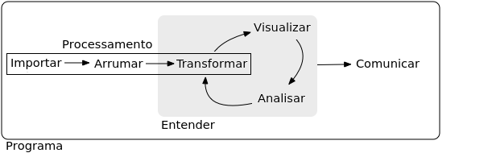

# (PART) Ferramentas modernas do R {-}


# Processamento de dados {#data-wrangle}


Neste capítulo veremos:

- um *data frame* aperfeiçoado, denominado *tibble*

- como arrumar seus dados em uma estrutura conveniente para a análise e visualização de dados

- como reestruturar os dados de uma forma versátil e fácil de entender

- como manipular os dados com uma ferramenta intuitiva e padronizada

Existem diversas ferramentas da base do  para a execução dessas operações. Entretanto, elas são um pouco confusas, não seguem uma codificação consistente e não possuem uma capacidade de fluirem juntas no processamento de dados. 

Suprindo a necessidade de uma abordagem efetiva e integrada para ciência de dados (Figura \@ref(fig:tidy-workflow)) um conjunto de pacotes foram desenvolvidos e denominado [*tidyverse*](https://www.tidyverse.org/).


<div class="figure">

<p class="caption">(\#fig:tidy-workflow)Modelo de ferramentas empregadas em ciência de dados. Adaptado de @Wickham2017.</p>
</div>

O termo *tidyverse* pode ser traduzido como 'universo arrumado' e consiste em um pacote do R que agrupa pacotes que compartilham uma filosofia comun de *design*, gramática [@Wickham-dplyr] e estrutura de dados [@Wickham2014]. Consequentemente, o *tidyverse* tem sido amplamente utilizado pela comunidade de usuários e desenvolvedores do R. Além de uma abordagem mais coesa e consistente de realizar as tarefas de processamento de dados, os códigos são mais eficientes (que a base do R), legíveis e a sintaxe mais fácil de lembrar.


  

## Pré-requisitos

O pacote tidyverse torna fácil de instalar e carregar os pacotes do *tidyverse* em apenas um comando.


```r
install.packages("tidyverse")
```

Agora você pode carregar os pacotes.


```r
library(tidyverse)
#> + ggplot2 2.2.1        Date: 2018-06-11
#> + tibble  1.4.2           R: 3.4.4
#> + tidyr   0.8.0          OS: Ubuntu 14.04.5 LTS
#> + readr   1.1.1         GUI: X11
#> + purrr   0.2.4      Locale: en_US.UTF-8
#> + dplyr   0.7.4          TZ: America/Sao_Paulo
#> + stringr 1.3.1      
#> + forcats 0.2.0
#> ── Conflicts ────────────────────────────────────────────────────
#> * filter(),  from dplyr, masks stats::filter()
#> * lag(),     from dplyr, masks stats::lag()
```


## *tibbles*: um dataframe aperfeiçoado

asd

## Pipe


## Restruturação de dados


### Dados arrumados

asd

### tidyr

asd

## Manipulação de dados

Gramática de manipulação de dados.

### dplyr

asd
